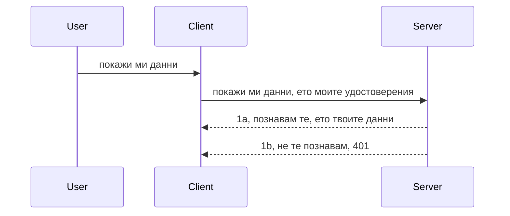

# Прост автентикация

MCP SDK поддържат използването на OAuth 2.1, който за честно е доста обширен процес, включващ концепции като сървър за автентикация, сървър за ресурси, изпращане на данни за достъп, получаване на код, разменяне на кода за токен с право на достъп, докато най-накрая получите достъп до данните на ресурса. Ако не сте свикнали с OAuth, който е чудесно нещо за внедряване, е добре да започнете с някакво базово ниво на автентикация и да надграждате до по-добра и по-добра сигурност. Затова съществува тази глава, да ви подготви за по-сложни методи за автентикация.

## Автентикация, какво имаме предвид?

Автентикацията е съкращение от удостоверяване и упълномощаване. Идеята е, че трябва да направим две неща:

- **Удостоверяване**, което е процесът на разбиране дали позволяваме на човек да влезе в нашия дом, дали има право да е "тук" — тоест да има достъп до нашия сървър с ресурси, където са функциите на MCP Server.
- **Упълномощаване**, което е процесът на определяне дали потребителят трябва да има достъп до конкретните ресурси, които иска, например тези поръчки или тези продукти, или дали е позволено да чете съдържанието, но не и да го изтрива, като друг пример.

## Данни за достъп: как казваме на системата кои сме ние

Повечето уеб разработчици започват да мислят във връзка с предоставяне на данни за достъп на сървъра, обикновено тайна, която казва дали им е позволено да са тук ("Удостоверяване"). Тези данни за достъп обикновено са базирана на base64 кодиран вариант на потребителско име и парола или API ключ, който уникално идентифицира конкретен потребител.

Това включва изпращането им в заглавка, наречена "Authorization", по следния начин:

```json
{ "Authorization": "secret123" }
```

Това обикновено се нарича базова автентикация. Как работи цялостният поток е по следния начин:


```mermaid
sequenceDiagram
   participant User
   participant Client
   participant Server

   User->>Client: покажи ми данни
   Client->>Server: покажи ми данни, ето моите удостоверения
   Server-->>Client: 1a, познавам те, ето твоите данни
   Server-->>Client: 1b, не те познавам, 401 
```

След като разбрахме как работи от гледна точка на потока, как го внедряваме? Повечето уеб сървъри имат концепция, наречена middleware, част от кода, който се изпълнява при заявка и може да провери данните за достъп, и ако са валидни, да позволи преминаването на заявката. Ако заявката няма валидни данни за достъп, тогава получавате грешка за автентикация. Нека видим как това може да се внедри:

**Python**

```python
class AuthMiddleware(BaseHTTPMiddleware):
    async def dispatch(self, request, call_next):

        has_header = request.headers.get("Authorization")
        if not has_header:
            print("-> Missing Authorization header!")
            return Response(status_code=401, content="Unauthorized")

        if not valid_token(has_header):
            print("-> Invalid token!")
            return Response(status_code=403, content="Forbidden")

        print("Valid token, proceeding...")
       
        response = await call_next(request)
        # добавете всякакви клиентски заглавки или направете промени в отговора по някакъв начин
        return response


starlette_app.add_middleware(CustomHeaderMiddleware)
```

Това тук имаме: 

- Създадена middleware, наречена `AuthMiddleware`, където методът `dispatch` се извиква от уеб сървъра.
- Добавена middleware към уеб сървъра:

    ```python
    starlette_app.add_middleware(AuthMiddleware)
    ```

- Написана логика за валидиране, която проверява дали заглавката Authorization е налична и дали тайният код, който се изпраща, е валиден:

    ```python
    has_header = request.headers.get("Authorization")
    if not has_header:
        print("-> Missing Authorization header!")
        return Response(status_code=401, content="Unauthorized")

    if not valid_token(has_header):
        print("-> Invalid token!")
        return Response(status_code=403, content="Forbidden")
    ```

    ако тайната е налична и валидна, допускаме заявката да премине чрез извикване на `call_next` и връщаме отговор.

    ```python
    response = await call_next(request)
    # добавете каквито и да е потребителски заглавки или променете по някакъв начин отговора
    return response
    ```

Как работи това: ако е направена уеб заявка към сървъра, middleware ще бъде извикан и според своята имплементация ще позволи на заявката да премине или ще върне грешка, която показва, че клиента няма право да продължи.

**TypeScript**

Тук създаваме middleware с популярния фреймуърк Express и прихващаме заявката преди да достигне MCP Server. Ето кода за това:

```typescript
function isValid(secret) {
    return secret === "secret123";
}

app.use((req, res, next) => {
    // 1. Присъства заглавка за упълномощаване?
    if(!req.headers["Authorization"]) {
        res.status(401).send('Unauthorized');
    }
    
    let token = req.headers["Authorization"];

    // 2. Проверка на валидността.
    if(!isValid(token)) {
        res.status(403).send('Forbidden');
    }

   
    console.log('Middleware executed');
    // 3. Предава заявката към следващата стъпка в обработката на заявката.
    next();
});
```

В този код:

1. Проверяваме дали заглавката Authorization първоначално е налична, ако не - изпращаме грешка 401.
2. Убедителяваме се, че данните за достъп / токенът са валидни, ако не - изпращаме грешка 403.
3. Накрая пропускаме заявката в тръбопровода на заявките и връщаме искания ресурс.

## Упражнение: Внедряване на автентикация

Нека вземем нашите знания и опитаме да го внедрим. Ето плана:

Сървър

- Създайте уеб сървър и MCP инстанция.
- Внедрете middleware за сървъра.

Клиент

- Изпратете уеб заявка, с данни за достъп, чрез заглавка.

### -1- Създайте уеб сървър и MCP инстанция

> [!WARNING]
> Примерът с TypeScript по-долу цели MCP `2025-11-25`. Той проследява транспорта
> чрез `mcp-session-id` и не е актуален за транспорта `2026-07-28`. MCP
> `2026-07-28` премахва handshake и идентификатора на сесия в протокола; новите
> имплементации използват самостоятелни заявки. Вижте
> [Какво се е променило в MCP: Спецификация 2026-07-28](../../01-CoreConcepts/mcp-2026-07-28.md).

В първата ни стъпка трябва да създадем уеб сървър и MCP Server.

**Python**

Тук създаваме MCP сървър инстанция, стартираме starlette уеб приложение и го хостваме с uvicorn.

```python
# създаване на MCP сървър

app = FastMCP(
    name="MCP Resource Server",
    instructions="Resource Server that validates tokens via Authorization Server introspection",
    host=settings["host"],
    port=settings["port"],
    debug=True
)

# създаване на starlette уеб приложение
starlette_app = app.streamable_http_app()

# обслужване на приложението чрез uvicorn
async def run(starlette_app):
    import uvicorn
    config = uvicorn.Config(
            starlette_app,
            host=app.settings.host,
            port=app.settings.port,
            log_level=app.settings.log_level.lower(),
        )
    server = uvicorn.Server(config)
    await server.serve()

run(starlette_app)
```

В този код:

- Създаваме MCP Server.
- Конструираме starlette уеб приложението от MCP Server, `app.streamable_http_app()`.
- Хостираме и обслужваме уеб приложението с uvicorn чрез `server.serve()`.

**TypeScript**

Тук създаваме MCP Server инстанция.

```typescript
const server = new McpServer({
      name: "example-server",
      version: "1.0.0"
    });

    // ... настройване на сървърни ресурси, инструменти и подканящи съобщения ...
```

Това създаване на MCP Server трябва да се случи в нашата дефиниция на POST /mcp маршрут, така че нека вземем горния код и го преместим така:

```typescript
import express from "express";
import { randomUUID } from "node:crypto";
import { McpServer } from "@modelcontextprotocol/sdk/server/mcp.js";
import { StreamableHTTPServerTransport } from "@modelcontextprotocol/sdk/server/streamableHttp.js";
import { isInitializeRequest } from "@modelcontextprotocol/sdk/types.js"

const app = express();
app.use(express.json());

// Карта за съхранение на транспорти по ID на сесията
const transports: { [sessionId: string]: StreamableHTTPServerTransport } = {};

// Обработка на POST заявки за комуникация клиент-сървър
app.post('/mcp', async (req, res) => {
  // Проверка за съществуващо ID на сесията
  const sessionId = req.headers['mcp-session-id'] as string | undefined;
  let transport: StreamableHTTPServerTransport;

  if (sessionId && transports[sessionId]) {
    // Повторно използване на съществуващ транспорт
    transport = transports[sessionId];
  } else if (!sessionId && isInitializeRequest(req.body)) {
    // Нова инициализационна заявка
    transport = new StreamableHTTPServerTransport({
      sessionIdGenerator: () => randomUUID(),
      onsessioninitialized: (sessionId) => {
        // Съхранение на транспорта по ID на сесията
        transports[sessionId] = transport;
      },
      // Защитата против DNS повторно свързване е изключена по подразбиране за съвместимост назад. Ако стартирате този сървър
      // локално, уверете се, че сте задали:
      // enableDnsRebindingProtection: true,
      // allowedHosts: ['127.0.0.1'],
    });

    // Изчистване на транспорта при затваряне
    transport.onclose = () => {
      if (transport.sessionId) {
        delete transports[transport.sessionId];
      }
    };
    const server = new McpServer({
      name: "example-server",
      version: "1.0.0"
    });

    // ... настройване на сървърни ресурси, инструменти и подсказки ...

    // Свързване към MCP сървъра
    await server.connect(transport);
  } else {
    // Невалидна заявка
    res.status(400).json({
      jsonrpc: '2.0',
      error: {
        code: -32000,
        message: 'Bad Request: No valid session ID provided',
      },
      id: null,
    });
    return;
  }

  // Обработка на заявката
  await transport.handleRequest(req, res, req.body);
});

// Повторно използваем обработчик за GET и DELETE заявки
const handleSessionRequest = async (req: express.Request, res: express.Response) => {
  const sessionId = req.headers['mcp-session-id'] as string | undefined;
  if (!sessionId || !transports[sessionId]) {
    res.status(400).send('Invalid or missing session ID');
    return;
  }
  
  const transport = transports[sessionId];
  await transport.handleRequest(req, res);
};

// Обработка на GET заявки за уведомления от сървъра към клиента чрез SSE
app.get('/mcp', handleSessionRequest);

// Обработка на DELETE заявки за прекратяване на сесията
app.delete('/mcp', handleSessionRequest);

app.listen(3000);
```

Сега виждате как създаването на MCP Server беше преместено вътре в `app.post("/mcp")`.

Нека преминем към следващата стъпка - създаване на middleware, за да валидираме входящите данни за достъп.

### -2- Внедрете middleware за сървъра

Стигаме до middleware частта. Тук ще създадем middleware, който търси данни за достъп в заглавката `Authorization` и ги валидира. Ако са приемливи, заявката ще продължи да изпълнява необходимото (например изброяване на инструменти, четене на ресурс или каквато и да е функционалност на MCP, която клиентът е поискал).

**Python**

За да създадем middleware, трябва да създадем клас, който наследява от `BaseHTTPMiddleware`. Има два интересни елемента:

- Заявката `request`, от която четем заглавната информация.
- `call_next` - callback функцията, която трябва да извикаме, ако клиентът е донесъл валидни данни за достъп.

Първо трябва да обработим случая, в който липсва заглавката `Authorization`:

```python
has_header = request.headers.get("Authorization")

# няма наличен хедър, връщаме грешка 401, в противен случай продължаваме.
if not has_header:
    print("-> Missing Authorization header!")
    return Response(status_code=401, content="Unauthorized")
```

Тук изпращаме съобщение за 401 unauthorized, защото клиентът не премина автентикацията.

След това, ако са подадени данни за достъп, трябва да проверим тяхната валидност по следния начин:

```python
 if not valid_token(has_header):
    print("-> Invalid token!")
    return Response(status_code=403, content="Forbidden")
```

Забележете, че изпращаме съобщение 403 forbidden по-горе. Ето пълна имплементация на middleware, която изпълнява всичко описано:

```python
class AuthMiddleware(BaseHTTPMiddleware):
    async def dispatch(self, request, call_next):

        has_header = request.headers.get("Authorization")
        if not has_header:
            print("-> Missing Authorization header!")
            return Response(status_code=401, content="Unauthorized")

        if not valid_token(has_header):
            print("-> Invalid token!")
            return Response(status_code=403, content="Forbidden")

        print("Valid token, proceeding...")
        print(f"-> Received {request.method} {request.url}")
        response = await call_next(request)
        response.headers['Custom'] = 'Example'
        return response

```

Страхотно, но какво е `valid_token` функцията? Ето я по-долу:

```python
# НЕ използвайте за продукция - усъвършенствайте го !!
def valid_token(token: str) -> bool:
    # премахнете префикса "Bearer "
    if token.startswith("Bearer "):
        token = token[7:]
        return token == "secret-token"
    return False
```

Това очевидно трябва да се подобри.

ВАЖНО: Никога не трябва да имате такива тайни в кода. Идеално е да извлечете стойността за сравнение от база данни или от IDP (провайдър на идентичност) или още по-добре - да оставите IDP да извърши валидацията.

**TypeScript**

За да го направим с Express, трябва да извикаме метода `use`, който приема middleware функции.


Трябва да:

- Взаимодействаме с променливата request, за да проверим предадените идентификационни данни в свойството `Authorization`.
- Валидираме идентификационните данни и, ако са валидни, позволяваме заявката да продължи и клиентската MCP заявка да изпълни това, което трябва (например изброяване на инструменти, четене на ресурс или всичко друго свързано с MCP).

Тук проверяваме дали хедърът `Authorization` е наличен и ако не е, спираме заявката:

```typescript
if(!req.headers["authorization"]) {
    res.status(401).send('Unauthorized');
    return;
}
```

Ако хедърът не бъде изпратен изобщо, получавате 401.

След това проверяваме дали идентификационните данни са валидни; ако не, отново спираме заявката, но с малко по-различно съобщение:

```typescript
if(!isValid(token)) {
    res.status(403).send('Forbidden');
    return;
} 
```

Забележете как сега получавате грешка 403.

Ето пълния код:

```typescript
app.use((req, res, next) => {
    console.log('Request received:', req.method, req.url, req.headers);
    console.log('Headers:', req.headers["authorization"]);
    if(!req.headers["authorization"]) {
        res.status(401).send('Unauthorized');
        return;
    }
    
    let token = req.headers["authorization"];

    if(!isValid(token)) {
        res.status(403).send('Forbidden');
        return;
    }  

    console.log('Middleware executed');
    next();
});
```

Настроили сме уеб сървъра да приема middleware, който проверява идентификационните данни, които клиентът ни се надява да изпрати. А какво за самия клиент?

### -3- Изпращане на уеб заявка с идентификационни данни чрез хедър

Трябва да гарантираме, че клиентът изпраща идентификационните данни чрез хедъра. Тъй като ще използваме MCP клиент за това, трябва да разберем как се прави.

**Python**

За клиента трябва да подадем хедър с идентификационните данни, както следва:

```python
# НЕ закодирайте стойността на твърдо, дръжте я поне в променлива на околната среда или по-сигурно хранилище
token = "secret-token"

async with streamablehttp_client(
        url = f"http://localhost:{port}/mcp",
        headers = {"Authorization": f"Bearer {token}"}
    ) as (
        read_stream,
        write_stream,
        session_callback,
    ):
        async with ClientSession(
            read_stream,
            write_stream
        ) as session:
            await session.initialize()
      
            # TODO, какво искате да се направи в клиента, напр. изброяване на инструменти, извикване на инструменти и т.н.
```

Забележете как попълваме свойството `headers` като ` headers = {"Authorization": f"Bearer {token}"}`.

**TypeScript**

Можем да го решим на два етапа:

1. Попълваме конфигурационен обект с нашите идентификационни данни.
2. Предаваме конфигурационния обект на транспорта.

```typescript

// НЕ въвеждайте стойността директно в кода, както е показано тук. Най-малко направете я като променлива на околната среда и използвайте нещо като dotenv (в режим на разработка).
let token = "secret123"

// дефинирайте обект с опции за транспорт на клиента
let options: StreamableHTTPClientTransportOptions = {
  sessionId: sessionId,
  requestInit: {
    headers: {
      "Authorization": "secret123"
    }
  }
};

// предайте обекта с опции на транспорта
async function main() {
   const transport = new StreamableHTTPClientTransport(
      new URL(serverUrl),
      options
   );
```

Тук по-горе виждате как създадохме обект `options` и поставихме хедърите под свойството `requestInit`.

ВАЖНО: Как можем да го подобрим от тук нататък? Текущата имплементация има някои проблеми. Първо, предаването на идентификационни данни по този начин е доста рисковано, освен ако нямате поне HTTPS. Дори тогава, идентификационните данни могат да бъдат откраднати, затова ви трябва система, чрез която лесно да отнемете токена и да добавите допълнителни проверки като откъде по света идва заявката, случва ли се заявката твърде често (поведение като на бот), с две думи, има множество въпроси.

Трябва да се каже, обаче, че за много прости API-та, където не искате никой да използва вашия API без удостоверяване, това, което имаме тук, е добро начало.

С това казано, нека опитаме да затвърдим сигурността, като използваме стандартизиран формат като JSON Web Token, известен още като JWT или "JOT" токени.

## JSON Web Token-и, JWT

Значи се опитваме да подобрим нещата от изпращане на много прости идентификационни данни. Какви са непосредствените подобрения, които получаваме, като приемаме JWT?

- **Подобрения в сигурността**. При basic auth изпращате потребителското име и паролата като base64-кодиран токен (или изпращате API ключ) отново и отново, което увеличава риска. При JWT изпращате потребителското име и паролата и получавате токен в замяна, който е също така времево ограничен, което означава, че ще изтече. JWT ви позволява лесно да използвате фино настроен контрол на достъп, използвайки роли, обхвати и разрешения.
- **Безсървърност и мащабируемост**. JWT-тата са самостоятелни, съдържат цялата информация за потребителя и премахват необходимостта от съхраняване на сесии на сървъра. Токенът може да бъде валидиран локално.
- **Взаимодействие и федерация**. JWT е централно в Open ID Connect и се използва с познати доставчици на идентичност като Entra ID, Google Identity и Auth0. Те също така позволяват използването на single sign on и много други възможности, правейки го подходящ за корпоративни приложения.
- **Модулност и гъвкавост**. JWT-тата могат да се използват и с API Gateway както Azure API Management, NGINX и др. Поддържа случаи за удостоверяване на потребители и комуникация между сървър и услуга, включително имперсонация и делегация.
- **Производителност и кеширане**. JWT-тата могат да се кешират след декодиране, което намалява нуждата от ново парсиране. Това помага особено при приложения с висок трафик, като подобрява пропускателната способност и намалява натоварването върху избраната инфраструктура.
- **Разширени функции**. Те поддържат и интроспекция (проверка на валидността на сървъра) и отнемане (правене на токен невалиден).

С всички тези ползи, нека видим как да вдигнем нашата имплементация на следващо ниво.

## Превръщане на basic auth в JWT

Така, промените, които трябва да направим на високо ниво, са:

- **Научете как да конструирате JWT токен** и да го подготвите за изпращане от клиент към сървър.
- **Валидирайте JWT токен** и ако е валиден, позволете на клиента да достъпи нашите ресурси.
- **Сигурно съхранение на токена**. Как да съхраняваме този токен.
- **Защитете маршрутите**. Трябва да защитим маршрутите, в нашия случай, маршрути и специфични функции на MCP.
- **Добавете refresh токени**. Осигурете да създаваме токени с кратък живот, но и refresh токени с дълъг живот, които могат да се използват за получаване на нови токени при изтичане. Осигурете също refresh endpoint и стратегия за ротация.

### -1- Конструиране на JWT токен

Първо, JWT токенът има следните части:

- **хедър**, алгоритъм, който се използва и тип на токена.
- **payload**, претенции, като sub (потребителят или обектът, който токенът представлява. В сценарий на удостоверяване обикновено е userid), exp (кога изтича) и role (ролята)
- **подпис**, подписан със секретен или частен ключ.

За това ще трябва да конструираме хедър, payload и кодиран токен.

**Python**

```python

import jwt
import jwt
from jwt.exceptions import ExpiredSignatureError, InvalidTokenError
import datetime

# Тайният ключ, използван за подписване на JWT
secret_key = 'your-secret-key'

header = {
    "alg": "HS256",
    "typ": "JWT"
}

# информацията за потребителя и неговите претенции и време на изтичане
payload = {
    "sub": "1234567890",               # Субект (потребителско ID)
    "name": "User Userson",                # Потребителска претенция
    "admin": True,                     # Потребителска претенция
    "iat": datetime.datetime.utcnow(),# Издадено на
    "exp": datetime.datetime.utcnow() + datetime.timedelta(hours=1)  # Изтичане
}

# кодирай го
encoded_jwt = jwt.encode(payload, secret_key, algorithm="HS256", headers=header)
```

В горния код ние:

- Дефинирахме хедър, използвайки HS256 като алгоритъм и тип JWT.
- Конструирахме payload, който съдържа subject или ID на потребител, потребителско име, роля, кога е издаден и кога изтича, като по този начин имплементираме времево ограничената характеристика, която споменахме по-рано.

**TypeScript**

Тук ще имаме нужда от някои зависимости, които ще ни помогнат да конструираме JWT токена.

Зависимости

```sh

npm install jsonwebtoken
npm install --save-dev @types/jsonwebtoken
```

Сега, когато имаме това, нека създадем хедъра, payload-а и чрез това да създадем кодиран токен.

```typescript
import jwt from 'jsonwebtoken';

const secretKey = 'your-secret-key'; // Използвайте променливи на средата в продукция

// Дефинирайте натоварването
const payload = {
  sub: '1234567890',
  name: 'User usersson',
  admin: true,
  iat: Math.floor(Date.now() / 1000), // Издадено на
  exp: Math.floor(Date.now() / 1000) + 60 * 60 // Изтича след 1 час
};

// Дефинирайте заглавната част (по избор, jsonwebtoken задава стойности по подразбиране)
const header = {
  alg: 'HS256',
  typ: 'JWT'
};

// Създайте токена
const token = jwt.sign(payload, secretKey, {
  algorithm: 'HS256',
  header: header
});

console.log('JWT:', token);
```

Този токен е:

Подписан с HS256
Валиден за 1 час
Включва претенции като sub, name, admin, iat и exp.

### -2- Валидиране на токен

Ще трябва също да валидираме токена, това е нещо, което трябва да правим на сървъра, за да сме сигурни, че това, което клиентът ни изпраща, е валидно. Трябва да извършим много проверки - от валидиране на структурата му до валидността му. Препоръчва се също така да добавите други проверки, за да видите дали потребителят е в системата ви и др.

За да валидираме токен, трябва да го декодираме, за да можем да го прочетем, и след това да започнем да проверяваме валидността му:

**Python**

```python

# Декодиране и проверка на JWT
try:
    decoded = jwt.decode(token, secret_key, algorithms=["HS256"])
    print("✅ Token is valid.")
    print("Decoded claims:")
    for key, value in decoded.items():
        print(f"  {key}: {value}")
except ExpiredSignatureError:
    print("❌ Token has expired.")
except InvalidTokenError as e:
    print(f"❌ Invalid token: {e}")

```


В този код извикваме `jwt.decode`, използвайки токена, тайния ключ и избрания алгоритъм като входни данни. Обърнете внимание как използваме конструкция try-catch, тъй като неуспешната валидация води до генериране на грешка.

**TypeScript**

Тук трябва да извикаме `jwt.verify`, за да получим декодирана версия на токена, която можем да анализираме по-нататък. Ако този повик не успее, това означава, че структурата на токена е неправилна или вече не е валидна.

```typescript

try {
  const decoded = jwt.verify(token, secretKey);
  console.log('Decoded Payload:', decoded);
} catch (err) {
  console.error('Token verification failed:', err);
}
```

ЗАБЕЛЕЖКА: както беше споменато по-рано, трябва да извършим допълнителни проверки, за да се уверим, че този токен сочи към потребител в нашата система и че потребителят има правата, които твърди, че притежава.

След това нека разгледаме контрол на достъпа, базиран на роли, известен още като RBAC.

## Добавяне на контрол на достъпа, базиран на роли

Идеята е да изразим, че различните роли имат различни права. Например, предполагаме, че администраторът може да прави всичко, обикновеният потребител може да чете/записва, а гостът може само да чете. Следователно, ето някои възможни нива на разрешение:

- Admin.Write 
- User.Read
- Guest.Read

Нека видим как можем да реализираме такъв контрол чрез междинен софтуер (middleware). Мидълуери могат да се добавят за всеки маршрут или за всички маршрути.

**Python**

```python
from starlette.middleware.base import BaseHTTPMiddleware
from starlette.responses import JSONResponse
import jwt

# НЕ слагайте тайната директно в кода, това е само за демонстрационни цели. Четете я от сигурно място.
SECRET_KEY = "your-secret-key" # сложете това в променлива на средата
REQUIRED_PERMISSION = "User.Read"

class JWTPermissionMiddleware(BaseHTTPMiddleware):
    async def dispatch(self, request, call_next):
        auth_header = request.headers.get("Authorization")
        if not auth_header or not auth_header.startswith("Bearer "):
            return JSONResponse({"error": "Missing or invalid Authorization header"}, status_code=401)

        token = auth_header.split(" ")[1]
        try:
            decoded = jwt.decode(token, SECRET_KEY, algorithms=["HS256"])
        except jwt.ExpiredSignatureError:
            return JSONResponse({"error": "Token expired"}, status_code=401)
        except jwt.InvalidTokenError:
            return JSONResponse({"error": "Invalid token"}, status_code=401)

        permissions = decoded.get("permissions", [])
        if REQUIRED_PERMISSION not in permissions:
            return JSONResponse({"error": "Permission denied"}, status_code=403)

        request.state.user = decoded
        return await call_next(request)


```

Има няколко различни начина за добавяне на междинен софтуер, както е показано по-долу:

```python

# Алт 1: добавяне на middleware по време на конструиране на starlette приложението
middleware = [
    Middleware(JWTPermissionMiddleware)
]

app = Starlette(routes=routes, middleware=middleware)

# Алт 2: добавяне на middleware след като starlette приложението вече е конструирано
starlette_app.add_middleware(JWTPermissionMiddleware)

# Алт 3: добавяне на middleware за всеки маршрут
routes = [
    Route(
        "/mcp",
        endpoint=..., # обработващ функция
        middleware=[Middleware(JWTPermissionMiddleware)]
    )
]
```

**TypeScript**

Можем да използваме `app.use` и междинен софтуер, който ще се изпълнява за всички заявки.

```typescript
app.use((req, res, next) => {
    console.log('Request received:', req.method, req.url, req.headers);
    console.log('Headers:', req.headers["authorization"]);

    // 1. Проверете дали е изпратен авторизационен хедър

    if(!req.headers["authorization"]) {
        res.status(401).send('Unauthorized');
        return;
    }
    
    let token = req.headers["authorization"];

    // 2. Проверете дали токенът е валиден
    if(!isValid(token)) {
        res.status(403).send('Forbidden');
        return;
    }  

    // 3. Проверете дали потребителят на токена съществува в нашата система
    if(!isExistingUser(token)) {
        res.status(403).send('Forbidden');
        console.log("User does not exist");
        return;
    }
    console.log("User exists");

    // 4. Потвърдете, че токенът има правилните права
    if(!hasScopes(token, ["User.Read"])){
        res.status(403).send('Forbidden - insufficient scopes');
    }

    console.log("User has required scopes");

    console.log('Middleware executed');
    next();
});

```

Има доста неща, които можем да оставим на нашия междинен софтуер и които нашият междинен софтуер ТРЯБВА да прави, а именно:

1. Проверка дали заглавката за удостоверяване е налична
2. Проверка дали токенът е валиден – извикваме `isValid`, което е метод, който сме написали и който проверява цялостта и валидността на JWT токена.
3. Проверка дали потребителят съществува в нашата система, това също трябва да се провери.

   ```typescript
    // потребители в базата данни
   const users = [
     "user1",
     "User usersson",
   ]

   function isExistingUser(token) {
     let decodedToken = verifyToken(token);

     // ЗАДАЧА, провери дали потребителят съществува в базата данни
     return users.includes(decodedToken?.name || "");
   }
   ```

   По-горе създадохме много прост списък `users`, който естествено трябва да се намира в база данни.

4. Освен това, трябва да проверим дали токенът има правилните разрешения.

   ```typescript
   if(!hasScopes(token, ["User.Read"])){
        res.status(403).send('Forbidden - insufficient scopes');
   }
   ```

   В този код от междинния софтуер проверяваме дали токенът съдържа разрешение User.Read, ако не, изпращаме грешка 403. По-долу е помощният метод `hasScopes`.

   ```typescript
   function hasScopes(scope: string, requiredScopes: string[]) {
     let decodedToken = verifyToken(scope);
    return requiredScopes.every(scope => decodedToken?.scopes.includes(scope));
  }
   ```

Have a think which additional checks you should be doing, but these are the absolute minimum of checks you should be doing.

Using Express as a web framework is a common choice. There are helpers library when you use JWT so you can write less code.

- `express-jwt`, helper library that provides a middleware that helps decode your token.
- `express-jwt-permissions`, this provides a middleware `guard` that helps check if a certain permission is on the token.

Here's what these libraries can look like when used:

```typescript
const express = require('express');
const jwt = require('express-jwt');
const guard = require('express-jwt-permissions')();

const app = express();
const secretKey = 'your-secret-key'; // put this in env variable

// Decode JWT and attach to req.user
app.use(jwt({ secret: secretKey, algorithms: ['HS256'] }));

// Check for User.Read permission
app.use(guard.check('User.Read'));

// multiple permissions
// app.use(guard.check(['User.Read', 'Admin.Access']));

app.get('/protected', (req, res) => {
  res.json({ message: `Welcome ${req.user.name}` });
});

// Error handler
app.use((err, req, res, next) => {
  if (err.code === 'permission_denied') {
    return res.status(403).send('Forbidden');
  }
  next(err);
});

```

Сега, когато видяхте как посредническият софтуер може да се използва както за удостоверяване, така и за упълномощаване, какво обаче с MCP – изменя ли начина, по който правим удостоверяването? Нека разберем в следващия раздел.

### -3- Добавяне на RBAC към MCP

Вече видяхте как можете да добавяте RBAC чрез посреднически софтуер, но за MCP няма лесен начин да добавите RBAC за всяка функция на MCP, така че какво правим? Просто трябва да добавим код като този, който проверява дали клиентът има права да извика определен инструмент:

Имате няколко различни възможности за постигане на RBAC на ниво функция, ето някои от тях:

- Добавяне на проверка за всеки инструмент, ресурс, подканяне, където е необходимо да се провери нивото на разрешение.

   **python**

   ```python
   @tool()
   def delete_product(id: int):
      try:
          check_permissions(role="Admin.Write", request)
      catch:
        pass # клиентът не успя да се упълномощи, повдигнете грешка за упълномощаване
   ```

   **typescript**

   ```typescript
   server.registerTool(
    "delete-product",
    {
      title: Delete a product",
      description: "Deletes a product",
      inputSchema: { id: z.number() }
    },
    async ({ id }) => {
      
      try {
        checkPermissions("Admin.Write", request);
        // за вършене, изпратете id към productService и отдалечено влизане
      } catch(Exception e) {
        console.log("Authorization error, you're not allowed");  
      }

      return {
        content: [{ type: "text", text: `Deletected product with id ${id}` }]
      };
    }
   );
   ```


- Използване на усъвършенстван сървърен подход и обработващи заявки функции, за да минимизирате местата, на които правите проверката.

   **Python**

   ```python
   
   tool_permission = {
      "create_product": ["User.Write", "Admin.Write"],
      "delete_product": ["Admin.Write"]
   }

   def has_permission(user_permissions, required_permissions) -> bool:
      # user_permissions: списък с разрешения, които потребителят има
      # required_permissions: списък с разрешения, необходими за инструмента
      return any(perm in user_permissions for perm in required_permissions)

   @server.call_tool()
   async def handle_call_tool(
     name: str, arguments: dict[str, str] | None
   ) -> list[types.TextContent]:
    # Предполага се, че request.user.permissions е списък с разрешения за потребителя
     user_permissions = request.user.permissions
     required_permissions = tool_permission.get(name, [])
     if not has_permission(user_permissions, required_permissions):
        # Вдигни грешка "Нямате разрешение да използвате инструмента {name}"
        raise Exception(f"You don't have permission to call tool {name}")
     # продължи и извикай инструмента
     # ...
   ```   
   

   **TypeScript**

   ```typescript
   function hasPermission(userPermissions: string[], requiredPermissions: string[]): boolean {
       if (!Array.isArray(userPermissions) || !Array.isArray(requiredPermissions)) return false;
       // Върнете true ако потребителят има поне едно необходимо разрешение
       
       return requiredPermissions.some(perm => userPermissions.includes(perm));
   }
  
   server.setRequestHandler(CallToolRequestSchema, async (request) => {
      const { params: { name } } = request;
  
      let permissions = request.user.permissions;
  
      if (!hasPermission(permissions, toolPermissions[name])) {
         return new Error(`You don't have permission to call ${name}`);
      }
  
      // продължавайте..
   });
   ```

   Забележка: ще трябва да осигурите вашият междинен софтуер да присвоява декодиран токен на свойството user на заявката, за да се опрости горният код.

### Обобщение

Сега, след като обсъдихме как да добавим поддръжка за RBAC като цяло и за MCP по-специално, е време да опитате сами да приложите сигурност, за да се уверите, че сте разбрали представените концепции.

## Задача 1: Изградете MCP сървър и MCP клиент с базова автентикация

Тук ще използвате наученото относно изпращане на идентификационни данни чрез заглавки.

## Решение 1

[Решение 1](./code/basic/README.md)

## Задача 2: Актуализирайте решението от Задача 1 с JWT

Вземете първото решение, но този път нека го подобрим.

Вместо да използваме Basic Auth, нека използваме JWT.

## Решение 2

[Решение 2](./solution/jwt-solution/README.md)

## Предизвикателство

Добавете RBAC за всеки инструмент, както описахме в раздела "Добавяне на RBAC към MCP".

## Обобщение

Надявам се, че сте научили много в тази глава – от липса на сигурност до базова сигурност, до JWT и как това може да бъде добавено към MCP.

Създадохме стабилна основа с персонализирани JWT, но с нарастване на мащаба се насочваме към модел на идентичност, основан на стандарти. Приемането на IdP като Entra или Keycloak ни позволява да прехвърлим издаването, валидирането и управлението на жизнения цикъл на токените към доверена платформа — освобождавайки ни да се съсредоточим върху логиката на приложението и потребителския опит.

За това имаме по- [напреднала глава за Entra](../../05-AdvancedTopics/mcp-security-entra/README.md)

## Какво следва

- Следващ: [Настройване на MCP хостове](../12-mcp-hosts/README.md)

---

<!-- CO-OP TRANSLATOR DISCLAIMER START -->
**Отказ от отговорност**:
Този документ е преведен с помощта на AI преводачески услуга [Co-op Translator](https://github.com/Azure/co-op-translator). Въпреки че се стремим към точност, моля имайте предвид, че автоматизираните преводи могат да съдържат грешки или неточности. Оригиналният документ на неговия роден език трябва да се счита за авторитетен източник. За критична информация се препоръчва професионален човешки превод. Ние не носим отговорност за каквито и да е недоразумения или неправилни тълкувания, произтичащи от използването на този превод.
<!-- CO-OP TRANSLATOR DISCLAIMER END -->