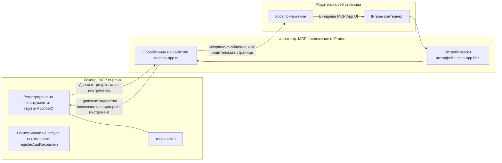
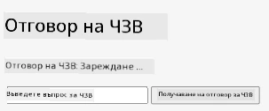
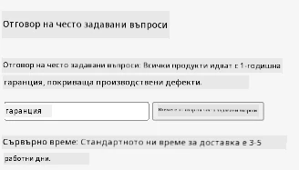
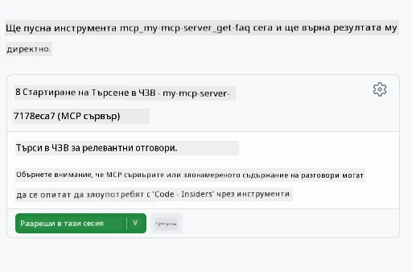

# MCP Apps

MCP Apps е нов парадигма в MCP. Идеята е не само да отговаряте с данни от извикване на инструмент, но и да предоставяте информация за това как с тези данни трябва да се взаимодейства. Това означава, че резултатите от инструментите вече могат да съдържат информация за потребителския интерфейс. Защо въобще бихме искали това? Е, помислете как правите нещата днес. Вероятно използвате резултатите от MCP Server като поставяте някакъв вид фронтенд пред него, това е код, който трябва да пишете и поддържате. Понякога това е това, което искате, но понякога би било страхотно, ако просто можете да внесете фрагмент от информация, който е самостоятелен и включва всичко – от данни до потребителски интерфейс.

## Преглед

Този урок предоставя практическо ръководство за MCP Apps, как да започнете с него и как да го интегрирате във вашите съществуващи уеб приложения. MCP Apps е много ново допълнение към MCP стандарта.

## Цели на обучението

Към края на този урок ще можете да:

- Обясните какво са MCP Apps.
- Кога да използвате MCP Apps.
- Създавате и интегрирате свои собствени MCP Apps.

## MCP Apps - как работи

Идеята при MCP Apps е да се предостави отговор, който съществено е компонент за рендиране. Такъв компонент може да има както визуални елементи, така и интерактивност, например кликвания на бутони, потребителски вход и други. Нека започнем със сървърната страна и нашия MCP Server. За да създадете MCP App компонент, трябва да създадете инструмент, но и ресурс на приложението. Тези две части са свързани чрез resourceUri.

Ето един пример. Нека се опитаме да визуализираме какво е включено и коя част какво прави:

```text
server.ts -- responsible for registering tools and the component as a UI component
src/
  mcp-app.ts -- wiring up event handlers
mcp-app.html -- the user interface
```

Тази визуализация описва архитектурата за създаване на компонент и неговата логика.


Нека се опитаме след това да опишем отговорностите на бекенда и фронтенда съответно.

### Бекендът

Има две неща, които трябва да постигнем тук:

- Регистриране на инструментите, с които искаме да си взаимодействаме.
- Дефиниране на компонента.

**Регистрация на инструмента**

```typescript
registerAppTool(
    server,
    "get-time",
    {
      title: "Get Time",
      description: "Returns the current server time.",
      inputSchema: {},
      _meta: { ui: { resourceUri } }, // Свързва този инструмент с неговия UI ресурс
    },
    async () => {
      const time = new Date().toISOString();
      return { content: [{ type: "text", text: time }] };
    },
  );

```

Горният код описва поведението, където се излага инструмент, наречен `get-time`. Той не приема входни данни, но връща текущото време. Имаме възможност да дефинираме `inputSchema` за инструменти, където трябва да можем да приемем потребителски вход.

**Регистрация на компонента**

В същия файл, също трябва да регистрираме компонента:

```typescript
const resourceUri = "ui://get-time/mcp-app.html";

// Регистрирайте ресурса, който връща събраните HTML/JavaScript за потребителския интерфейс.
registerAppResource(
  server,
  resourceUri,
  resourceUri,
  { mimeType: RESOURCE_MIME_TYPE },
  async () => {
    const html = await fs.readFile(path.join(DIST_DIR, "mcp-app.html"), "utf-8");

    return {
    contents: [
        { uri: resourceUri, mimeType: RESOURCE_MIME_TYPE, text: html },
    ],
    };
  },
);
```

Обърнете внимание как споменаваме `resourceUri`, за да свържем компонента с неговите инструменти. Интересен е също callback-а, където зареждаме UI файла и връщаме компонента.

### Фронтенд на компонента

Точно както бекендът, тук има две части:

- Фронтенд написан на чист HTML.
- Код, който обработва събития и действия, например извикване на инструменти или съобщения към родителския прозорец.

**Потребителски интерфейс**

Нека разгледаме потребителския интерфейс.

```html
<!-- mcp-app.html -->
<!DOCTYPE html>
<html lang="en">
  <head>
    <meta charset="UTF-8" />
    <title>Get Time App</title>
  </head>
  <body>
    <p>
      <strong>Server Time:</strong> <code id="server-time">Loading...</code>
    </p>
    <button id="get-time-btn">Get Server Time</button>
    <script type="module" src="/src/mcp-app.ts"></script>
  </body>
</html>
```

**Свързване на събития**

Последната част е свързването на събитията. Това означава да идентифицираме коя част в нашия UI се нуждае от обработчици на събития и какво да направим, ако се появят събития:

```typescript
// mcp-app.ts

import { App } from "@modelcontextprotocol/ext-apps";

// Вземете препратки към елементи
const serverTimeEl = document.getElementById("server-time")!;
const getTimeBtn = document.getElementById("get-time-btn")!;

// Създайте инстанция на приложението
const app = new App({ name: "Get Time App", version: "1.0.0" });

// Обработвайте резултатите от инструмента от сървъра. Поставете преди `app.connect()`, за да избегнете
// пропускането на първоначалния резултат от инструмента.
app.ontoolresult = (result) => {
  const time = result.content?.find((c) => c.type === "text")?.text;
  serverTimeEl.textContent = time ?? "[ERROR]";
};

// Свържете кликване на бутон
getTimeBtn.addEventListener("click", async () => {
  // `app.callServerTool()` позволява на потребителския интерфейс да поиска свежи данни от сървъра
  const result = await app.callServerTool({ name: "get-time", arguments: {} });
  const time = result.content?.find((c) => c.type === "text")?.text;
  serverTimeEl.textContent = time ?? "[ERROR]";
});

// Свържете се към хост
app.connect();
```

Както виждате от горното, това е нормален код за свързване на DOM елементи със събития. Струва си да се отбележи извикването на `callServerTool`, което в крайна сметка извиква инструмент на бекенда.

## Обработка на потребителски вход

Досега видяхме компонент с бутон, който при кликване извиква инструмент. Нека видим дали можем да добавим още UI елементи като поле за въвеждане и да видим дали можем да изпратим аргументи към инструмент. Нека реализираме функционалност за често задавани въпроси (FAQ). Ето как трябва да работи:

- Трябва да има бутон и входен елемент, където потребителят въвежда ключова дума за търсене, например "Shipping". Това трябва да извика инструмент на бекенда, който прави търсене в данните за FAQ.
- Инструмент, който поддържа търсене в FAQ.

Нека първо добавим необходимата поддръжка на бекенда:

```typescript
const faq: { [key: string]: string } = {
    "shipping": "Our standard shipping time is 3-5 business days.",
    "return policy": "You can return any item within 30 days of purchase.",
    "warranty": "All products come with a 1-year warranty covering manufacturing defects.",
  }

registerAppTool(
    server,
    "get-faq",
    {
      title: "Search FAQ",
      description: "Searches the FAQ for relevant answers.",
      inputSchema: zod.object({
        query: zod.string().default("shipping"),
      }),
      _meta: { ui: { resourceUri: faqResourceUri } }, // Връзва този инструмент с неговия UI ресурс
    },
    async ({ query }) => {
      const answer: string = faq[query.toLowerCase()] || "Sorry, I don't have an answer for that.";
      return { content: [{ type: "text", text: answer }] };
    },
  );
```

Тук виждаме как попълваме `inputSchema` и задаваме `zod` схема по следния начин:

```typescript
inputSchema: zod.object({
  query: zod.string().default("shipping"),
})
```

В горната схема декларираме, че имаме входен параметър, наречен `query`, и че той е по избор с подразбираща се стойност "shipping".

Добре, нека продължим към *mcp-app.html*, за да видим какъв UI трябва да създадем за това:

```html
<div class="faq">
    <h1>FAQ response</h1>
    <p>FAQ Response: <code id="faq-response">Loading...</code></p>
    <input type="text" id="faq-query" placeholder="Enter FAQ query" />
    <button id="get-faq-btn">Get FAQ Response</button>
  </div>
```

Страхотно, сега имаме входен елемент и бутон. Нека отидем на *mcp-app.ts* и свържем тези събития:

```typescript
const getFaqBtn = document.getElementById("get-faq-btn")!;
const faqQueryInput = document.getElementById("faq-query") as HTMLInputElement;

getFaqBtn.addEventListener("click", async () => {
  const query = faqQueryInput.value;
  const result = await app.callServerTool({ name: "get-faq", arguments: { query } });
  const faq = result.content?.find((c) => c.type === "text")?.text;
  faqResponseEl.textContent = faq ?? "[ERROR]";
});
```

В кода по-горе ние:

- Създаваме препратки към интересните UI елементи.
- Обработваме клик върху бутон, за да извлечем стойността от входния елемент, и също така извикваме `app.callServerTool()` с `name` и `arguments`, където последното подава `query` като стойност.

Това, което всъщност се случва, когато извикате `callServerTool`, е, че се изпраща съобщение към родителския прозорец, а този прозорец в крайна сметка извиква MCP Server.

### Опитайте го

Ако пробвате това, трябва да видите следното:



и ето тук, когато изпробваме с вход като "warranty"



За да стартирате този код, отидете в [Code section](./code/README.md)

## Тестване във Visual Studio Code

Visual Studio Code има отлична поддръжка за MVP Apps и вероятно е един от най-лесните начини за тестване на вашите MCP Apps. За да използвате Visual Studio Code, добавете сървърен запис в *mcp.json* по следния начин:

```json
"my-mcp-server-7178eca7": {
    "url": "http://localhost:3001/mcp",
    "type": "http"
  }
```

След това стартирайте сървъра, трябва да можете да комуникирате с вашето MVP App през прозореца за чат, стига да имате инсталиран GitHub Copilot.

чрез задействане чрез промпт, например "#get-faq":



и точно както при стартиране през уеб браузър, той се рендерира по същия начин:


## Задача

Създайте игра камък, ножица, хартия. Тя трябва да се състои от следното:

UI:

- падащ списък с опции
- бутон за подаване на избора
- етикет показващ кой какво е избрал и кой е победител

Сървър:

- трябва да има инструмент rock paper scissor, който приема „choice“ като вход. Трябва също да генерира избор на компютъра и да определи победителя

## Решение

[Решение](./assignment/README.md)

## Резюме

Научихме за тази нова парадигма MCP Apps. Това е нова парадигма, която позволява на MCP Servers да имат мнение не само за данните, но и за начина, по който тези данни трябва да бъдат представени.

Освен това научихме, че тези MCP Apps се хостват в iframe и за да комуникират с MCP Servers, те трябва да изпращат съобщения към родителското уеб приложение. Съществуват няколко библиотеки както за чист JavaScript, така и за React и други, които улесняват тази комуникация.

## Основни изводи

Ето какво научихте:

- MCP Apps е нов стандарт, който може да бъде полезен, когато искате да доставяте както данни, така и UI функции.
- Тези типове приложения работят в iframe поради съображения за сигурност.

## Какво следва

- [Глава 4](../../04-PracticalImplementation/README.md)

---

<!-- CO-OP TRANSLATOR DISCLAIMER START -->
**Отказ от отговорност**:  
Този документ е преведен с помощта на AI преводаческа услуга [Co-op Translator](https://github.com/Azure/co-op-translator). Въпреки че се стремим към точност, имайте предвид, че автоматизираните преводи могат да съдържат грешки или неточности. Оригиналният документ на неговия роден език трябва да се счита за авторитетен източник. За критична информация се препоръчва професионален човешки превод. Ние не носим отговорност за никакви недоразумения или неправилни тълкувания, произтичащи от използването на този превод.
<!-- CO-OP TRANSLATOR DISCLAIMER END -->