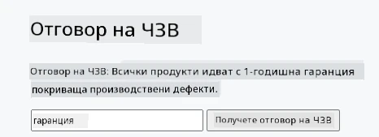
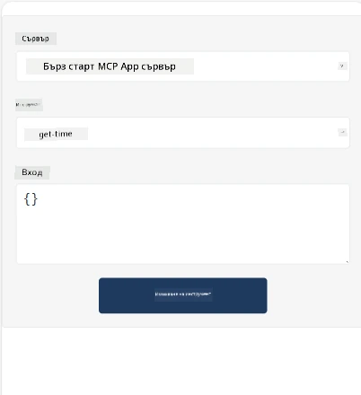
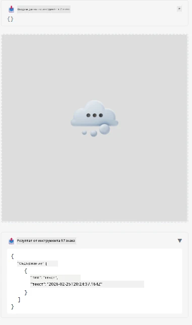

Ето един пример, който демонстрира MCP App

## Инсталиране

1. Навигирайте до папката *mcp-app*
1. Стартирайте `npm install`, това трябва да инсталира зависимости както за frontend, така и за backend

Проверете дали backend компилира като стартирате:

```sh
npx tsc --noEmit
```

Не трябва да има изход, ако всичко е наред.

## Стартиране на backend

> Това изисква малко допълнителна работа, ако сте на Windows машина, тъй като решението MCP Apps използва библиотеката `concurrently`, за която трябва да намерите заместител. Ето проблемния ред в *package.json* на MCP App:

    ```json
    "start": "concurrently \"cross-env NODE_ENV=development INPUT=mcp-app.html vite build --watch\" \"tsx watch main.ts\""
    ```

Това приложение има две части - backend част и хост част.

Стартирайте backend като изпълните:

```sh
npm start
```

Това трябва да стартира backend на `http://localhost:3001/mcp`.

> Забележка, ако използвате Codespace, може да се наложи да зададете портът да е видим публично. Проверете дали можете да достигнете крайна точка в браузъра през https://<името на Codespace>.app.github.dev/mcp

## Вариант 1 - Тествайте приложението в Visual Studio Code

За да тествате решението във Visual Studio Code, направете следното:

- Добавете сървърна записка в `mcp.json`, както следва:

    ```json
    {
        "servers": {
            "my-mcp-server-7178eca7": {
                "url": "http://localhost:3001/mcp",
                "type": "http"
            }
        },
        "inputs": []
    }
    ```

1. Натиснете бутона "start" в *mcp.json*
1. Уверете се, че чат прозорецът е отворен и напишете `get-faq`, трябва да видите резултат като този:

    

## Вариант 2 - Тествайте приложението с хост

Репозиторито <https://github.com/modelcontextprotocol/ext-apps> съдържа няколко различни хоста, които можете да използвате за тестване на вашите MVP приложения.

Ще ви представим два различни варианта тук:

### Локална машина

- Навигирайте до *ext-apps* след като сте клонирали репозиторито.

- Инсталирайте зависимости

   ```sh
   npm install
   ```

- В отделен терминален прозорец, навигирайте до *ext-apps/examples/basic-host*

    > Ако използвате Codespace, трябва да отидете до serve.ts на ред 27 и да замените http://localhost:3001/mcp с URL на вашия Codespace за backend, например https://psychic-xylophone-657rpjgvxpc5g64-3001.app.github.dev/mcp

- Стартирайте хоста:

    ```sh
    npm start
    ```

    Това трябва да свърже хоста с backend и трябва да видите приложението да работи, както следва:

    

### Codespace

Изисква малко допълнителна работа, за да накарате средата Codespace да работи. За да използвате хост чрез Codespace:

- Отидете в директория *ext-apps* и навигирайте до *examples/basic-host*.
- Стартирайте `npm install` за инсталиране на зависимости
- Стартирайте `npm start`, за да стартирате хоста.

## Тествайте приложението

Опитайте приложението по следния начин:

- Изберете бутон "Call Tool" и трябва да видите резултатите като на следната снимка:

    

Страхотно, всичко работи.

---

<!-- CO-OP TRANSLATOR DISCLAIMER START -->
**Отказ от отговорност**:  
Този документ е преведен с помощта на AI преводаческа услуга [Co-op Translator](https://github.com/Azure/co-op-translator). Въпреки че се стремим към точност, моля, имайте предвид, че автоматичните преводи могат да съдържат грешки или неточности. Оригиналният документ на неговия изходен език трябва да се счита за авторитетен източник. За критична информация се препоръчва професионален човешки превод. Ние не носим отговорност за никакви недоразумения или грешни тълкувания, произтичащи от използването на този превод.
<!-- CO-OP TRANSLATOR DISCLAIMER END -->