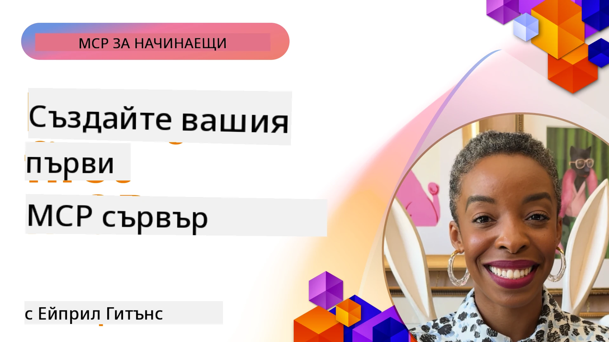

## Започване  

_(Кликнете върху снимката по-горе, за да гледате видео на този урок)_

Този раздел се състои от няколко урока:

- **1 Вашият първи сървър**, в този първи урок ще научите как да създадете първия си сървър и да го инспектирате с инструмента инспектор, ценен начин за тестване и отстраняване на грешки в сървъра, [към урока](01-first-server/README.md)

- **2 Клиент**, в този урок ще научите как да напишете клиент, който може да се свърже с вашия сървър, [към урока](02-client/README.md)

- **3 Клиент с LLM**, още по-добър начин за писане на клиент е като добавите LLM към него, така че да може да „преговаря“ със сървъра ви за това какво да прави, [към урока](03-llm-client/README.md)

- **4 Използване на режим Агент на GitHub Copilot сървър в Visual Studio Code**. Тук разглеждаме работа с MCP сървъра от Visual Studio Code, [към урока](04-vscode/README.md)

- **5 stdio транспортен сървър** stdio транспорт е препоръчаният стандарт за локална комуникация между MCP сървър и клиент, осигуряващ сигурна комуникация базирана на подпроцеси с вградена изолация на процеси [към урока](05-stdio-server/README.md)

- **6 HTTP поточно предаване с MCP (Потоци от HTTP)**. Научете за съвременния HTTP поточен транспорт (препоръчаният подход за отдалечени MCP сървъри според [MCP Спецификация 2025-11-25](https://spec.modelcontextprotocol.io/specification/2025-11-25/basic/transports/#streamable-http)), известия за напредък и как да реализирате мащабируеми, реално време MCP сървъри и клиенти с помощта на потоков HTTP, [към урока](06-http-streaming/README.md)

- **7 Използване на AI Toolkit за VSCode** за консумация и тестване на вашите MCP клиенти и сървъри [към урока](07-aitk/README.md)

- **8 Тестване**. Тук ще се фокусираме особено как да тестваме нашия сървър и клиент по различни начини, [към урока](08-testing/README.md)

- **9 Разгръщане**. Тази глава разглежда различни начини за разгръщане на вашите MCP решения, [към урока](09-deployment/README.md)

- **10 Разширено използване на сървър**. Тази глава покрива разширени начини за използване на сървъри, [към урока](./10-advanced/README.md)

- **11 Удостоверяване**. Тази глава разглежда как да добавите просто удостоверяване от Basic Auth до използване на JWT и RBAC. Препоръчва се да започнете тук, след което да разгледате Разширени теми в Глава 5 и да приложите допълнително затягане на сигурността според препоръките в Глава 2, [към урока](./11-simple-auth/README.md)

- **12 MCP Hosts**. Конфигуриране и използване на популярни MCP хост клиенти като Claude Desktop, Cursor, Cline и Windsurf. Научете типовете транспорти и отстраняване на грешки, [към урока](./12-mcp-hosts/README.md)

- **13 MCP Inspector**. Отстраняване на грешки и тестване на вашите MCP сървъри интерактивно с инструмента MCP Inspector. Научете как да отстранявате проблеми с инструменти, ресурси и съобщения по протокола, [към урока](./13-mcp-inspector/README.md)

- **14 Извадки**. Създавайте MCP сървъри, които си сътрудничат с MCP клиенти по задачи свързани с LLM, [към урока](./14-sampling/README.md)

- **15 MCP приложения**. Създавайте MCP сървъри, които също отговарят с инструкции за потребителски интерфейс, [към урока](./15-mcp-apps/README.md)

Протоколът Model Context (MCP) е отворен протокол, който стандартизира начина, по който приложенията предоставят контекст на LLM. Мислете за MCP като за USB-C порт за AI приложения — той осигурява стандартизиран начин за свързване на AI модели с различни източници на данни и инструменти.

## Учебни цели

В края на този урок ще можете да:

- Настроите среди за разработка за MCP на C#, Java, Python, TypeScript и JavaScript
- Създавате и внедрявате основни MCP сървъри с персонализирани функции (ресурси, подсказки и инструменти)
- Създавате хост приложения, които се свързват с MCP сървъри
- Тест и отстраняване на грешки в имплементации на MCP
- Разбирате често срещани предизвикателства и решения при настройка
- Свързвате вашите MCP имплементации с популярни LLM услуги

## Настройване на вашата MCP среда

Преди да започнете да работите с MCP, важно е да подготвите вашата среда за разработка и да разберете основния работен процес. Този раздел ще ви преведе през началните стъпки, за да осигури плавен старт с MCP.

### Предварителни изисквания

Преди да се потопите в разработването с MCP, уверете се, че имате:

- **Среда за разработка**: за избрания от вас език (C#, Java, Python, TypeScript или JavaScript)
- **IDE/Редактор**: Visual Studio, Visual Studio Code, IntelliJ, Eclipse, PyCharm или някой модерен редактор за код
- **Пакетни мениджъри**: NuGet, Maven/Gradle, pip или npm/yarn
- **API ключове**: за всички AI услуги, които планирате да използвате във вашите хост приложения

### Официални SDK

В предстоящите глави ще видите решения, изградени с Python, TypeScript, Java и .NET. Ето всички официално поддържани SDK.

MCP предлага официални SDK за няколко езика (съвместими с [MCP Спецификация 2025-11-25](https://spec.modelcontextprotocol.io/specification/2025-11-25/)):
- [C# SDK](https://github.com/modelcontextprotocol/csharp-sdk) - Поддържан в партньорство с Microsoft
- [Java SDK](https://github.com/modelcontextprotocol/java-sdk) - Поддържан в партньорство със Spring AI
- [TypeScript SDK](https://github.com/modelcontextprotocol/typescript-sdk) - Официалната имплементация за TypeScript
- [Python SDK](https://github.com/modelcontextprotocol/python-sdk) - Официалната Python имплементация (FastMCP)
- [Kotlin SDK](https://github.com/modelcontextprotocol/kotlin-sdk) - Официалната Kotlin имплементация
- [Swift SDK](https://github.com/modelcontextprotocol/swift-sdk) - Поддържан в партньорство с Loopwork AI
- [Rust SDK](https://github.com/modelcontextprotocol/rust-sdk) - Официалната Rust имплементация
- [Go SDK](https://github.com/modelcontextprotocol/go-sdk) - Официалната Go имплементация

## Основни изводи

- Настройването на MCP среда за разработка е лесно с езиково-специфични SDK
- Изграждането на MCP сървъри включва създаване и регистриране на инструменти с ясни схеми
- MCP клиентите се свързват със сървъри и модели, за да използват разширени възможности
- Тестът и отстраняването на грешки са от съществено значение за надеждни MCP имплементации
- Вариантите за разгръщане варират от локална разработка до решения в облака

## Практика

Имаме набор от примери, които допълват упражненията, които ще видите във всички глави в този раздел. Освен това всяка глава има свои собствени упражнения и задачи.

- [Java Калкулатор](./samples/java/calculator/README.md)
- [.Net Калкулатор](../../../03-GettingStarted/samples/csharp)
- [JavaScript Калкулатор](./samples/javascript/README.md)
- [TypeScript Калкулатор](./samples/typescript/README.md)
- [Python Калкулатор](../../../03-GettingStarted/samples/python)

## Допълнителни ресурси

- [Създаване на агенти с Model Context Protocol в Azure](https://learn.microsoft.com/azure/developer/ai/intro-agents-mcp)
- [Отдалечен MCP с Azure Container Apps (Node.js/TypeScript/JavaScript)](https://learn.microsoft.com/samples/azure-samples/mcp-container-ts/mcp-container-ts/)
- [.NET OpenAI MCP Агент](https://learn.microsoft.com/samples/azure-samples/openai-mcp-agent-dotnet/openai-mcp-agent-dotnet/)

## Какво следва

Започнете с първия урок: [Създаване на първия ви MCP сървър](01-first-server/README.md)

След като завършите този модул, продължете с: [Модул 4: Практическа реализация](../04-PracticalImplementation/README.md)

---

<!-- CO-OP TRANSLATOR DISCLAIMER START -->
**Отказ от отговорност**:
Този документ е преведен с използване на AI преводаческа услуга [Co-op Translator](https://github.com/Azure/co-op-translator). Въпреки че се стремим към точност, моля, имайте предвид, че автоматизираните преводи може да съдържат грешки или неточности. Оригиналният документ на неговия роден език трябва да се счита за авторитетен източник. За критична информация се препоръчва професионален превод от човешки преводач. Не носим отговорност за каквито и да е недоразумения или неправилни тълкувания, произтичащи от използването на този превод.
<!-- CO-OP TRANSLATOR DISCLAIMER END -->