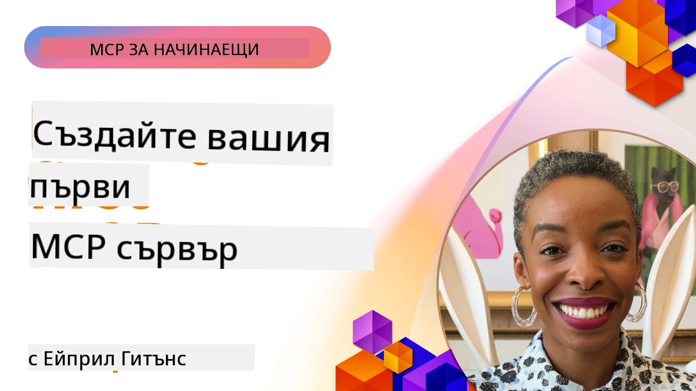

## Започване  

_(Кликнете върху изображението по-горе, за да гледате видео на този урок)_

Този раздел съдържа няколко урока:

- **1 Вашият първи сървър**, в този първи урок ще научите как да създадете своя първи сървър и да го разгледате с инструмента инспектор, ценен начин за тестване и отстраняване на грешки на вашия сървър, [към урока](01-first-server/README.md)

- **2 Клиент**, в този урок ще научите как да напишете клиент, който може да се свърже с вашия сървър, [към урока](02-client/README.md)

- **3 Клиент с LLM**, още по-добър начин за писане на клиент е като добавите LLM, така че той да може да „преговаря“ със сървъра ви какво да прави, [към урока](03-llm-client/README.md)

- **4 Използване на режим GitHub Copilot Agent за сървър в Visual Studio Code**. Тук разглеждаме работа на нашия MCP сървър от Visual Studio Code, [към урока](04-vscode/README.md)

- **5 stdio Transport Server** stdio транспортът е препоръчаният стандарт за локална комуникация между MCP сървър и клиент, осигуряващ сигурна комуникация на база на подсистеми с вградена изолация на процесите [към урока](05-stdio-server/README.md)

- **6 HTTP Streaming с MCP (Streamable HTTP)**. Научете за стандартния
	отдалечен транспорт в [MCP Спецификация 2026-07-28](https://modelcontextprotocol.io/specification/2026-07-28/basic/transports/streamable-http),
	плюс наследената имплементация базирана на сесия, запазена в урока.
	[към урока](06-http-streaming/README.md)

- **7 Използване на AI Toolkit за VSCode** за консумиране и тестване на вашите MCP Клиенти и Сървъри [към урока](07-aitk/README.md)

- **8 Тестване**. Тук ще се съсредоточим специално как можем да тестваме сървъра и клиента по различни начини, [към урока](08-testing/README.md)

- **9 Деплоймънт**. Тази глава разглежда различни начини за разгръщане на вашите MCP решения, [към урока](09-deployment/README.md)

- **10 Разширено използване на сървър**. Тази глава обхваща разширеното използване на сървъра, [към урока](./10-advanced/README.md)

- **11 Автентикация**. Тази глава разглежда как да добавите проста автентикация, от Basic Auth до използване на JWT и RBAC. Препоръчваме да започнете тук и след това да разгледате Разширени Теми в Глава 5 и да извършите допълнително засилване на сигурността чрез препоръки в Глава 2, [към урока](./11-simple-auth/README.md)

- **12 MCP Хостове**. Конфигурирайте и използвайте популярни MCP клиент хостове включително Claude Desktop, Cursor, Cline и Windsurf. Научете типовете транспорт и отстраняване на проблеми, [към урока](./12-mcp-hosts/README.md)

- **13 MCP Инспектор**. Отстранявайте грешки и тествайте вашите MCP сървъри интерактивно с инструмента MCP Inspector. Научете за отстраняването на проблеми с инструменти, ресурси и протоколни съобщения, [към урока](./13-mcp-inspector/README.md)

- **14 Семплиране (Sampling)**. Научете за наследения примитив Sampling за `2025-11-25` и
	как да мигрирате нови проекти към директна интеграция с доставчик на LLM. Семплирането е
	обявено за остаряло в MCP `2026-07-28`. [към урока](./14-sampling/README.md)

- **15 MCP Приложения**. Създавайте MCP сървъри, които също отговарят с UI инструкции, [към урока](./15-mcp-apps/README.md)

Model Context Protocol (MCP) е отворен протокол, който стандартизира начина, по който приложенията предоставят контекст на LLM. Мислете за MCP като за USB-C порт за AI приложения - той осигурява стандартизиран начин да се свързват AI модели с различни източници на данни и инструменти.

## Учебни цели

В края на този урок ще можете да:

- Настроите среди за разработка за MCP на C#, Java, Python, TypeScript и JavaScript
- Създавате и разгръщате базови MCP сървъри с персонализирани функции (ресурси, промпти и инструменти)
- Създавате хост приложения, които се свързват с MCP сървъри
- Тествате и отстранявате грешки в MCP имплементации
- Разбирате общи предизвикателства при настройка и техните решения
- Свързвате вашите MCP имплементации с популярни LLM услуги

## Настройка на вашата MCP среда

Преди да започнете да работите с MCP, е важно да подготвите вашата среда за разработка и да разберете основния работен процес. Този раздел ще ви насочи през началните стъпки, за да осигури плавно начало с MCP.

### Предварителни изисквания

Преди да се захванете с разработка на MCP, уверете се, че разполагате с:

- **Среда за разработка**: За избрания от вас език (C#, Java, Python, TypeScript или JavaScript)
- **IDE/Редактор**: Visual Studio, Visual Studio Code, IntelliJ, Eclipse, PyCharm или всеки модерен кодов редактор
- **Пакетни мениджъри**: NuGet, Maven/Gradle, pip или npm/yarn
- **API ключове**: За всички AI услуги, които планирате да използвате във вашите хост приложения

### Официални SDK-та

В следващите глави ще видите решения, изградени с Python, TypeScript,
Java и .NET. Ето официалните SDK-та.

Поддръжката на SDK за MCP `2026-07-28` се въвежда независимо за всеки език.
Преди да стартирате пример, проверете версията на пакета и бележките за изданието на SDK
за поддържаните ревизии на протокола. Вижте
[официалния списък с SDK-та](https://modelcontextprotocol.io/docs/sdk):
- [C# SDK](https://github.com/modelcontextprotocol/csharp-sdk) - Поддържан в сътрудничество с Microsoft
- [Java SDK](https://github.com/modelcontextprotocol/java-sdk) - Поддържан в сътрудничество с Spring AI
- [TypeScript SDK](https://github.com/modelcontextprotocol/typescript-sdk) - Официалната TypeScript имплементация
- [Python SDK](https://github.com/modelcontextprotocol/python-sdk) - Официалната Python имплементация (FastMCP)
- [Kotlin SDK](https://github.com/modelcontextprotocol/kotlin-sdk) - Официалната Kotlin имплементация
- [Swift SDK](https://github.com/modelcontextprotocol/swift-sdk) - Поддържан в сътрудничество с Loopwork AI
- [Rust SDK](https://github.com/modelcontextprotocol/rust-sdk) - Официалната Rust имплементация
- [Go SDK](https://github.com/modelcontextprotocol/go-sdk) - Официалната Go имплементация

## Основни изводи

- Настройването на MCP среда за разработка е лесно с SDK-та за конкретни езици
- Изграждането на MCP сървъри включва създаване и регистриране на инструменти с ясни схеми
- MCP клиентите се свързват със сървъри и модели, за да използват разширени възможности
- Тестването и отстраняването на грешки са от съществено значение за надеждни MCP имплементации
- Вариантите за разгръщане варират от локална разработка до облачни решения

## Практика

Имаме набор от примери, които допълват упражненията, които ще видите във всички глави в този раздел. Освен това всяка глава има свои собствени упражнения и задачи

- [Java Calculator](./samples/java/calculator/README.md)
- [.NET Calculator](../../../03-GettingStarted/samples/csharp)
- [JavaScript Calculator](./samples/javascript/README.md)
- [TypeScript Calculator](./samples/typescript/README.md)
- [Python Calculator](../../../03-GettingStarted/samples/python)

## Допълнителни ресурси

- [Създаване на агенти с Model Context Protocol в Azure](https://learn.microsoft.com/azure/developer/ai/intro-agents-mcp)
- [Отдалечен MCP с Azure Container Apps (Node.js/TypeScript/JavaScript)](https://learn.microsoft.com/samples/azure-samples/mcp-container-ts/mcp-container-ts/)
- [.NET OpenAI MCP агент](https://learn.microsoft.com/samples/azure-samples/openai-mcp-agent-dotnet/openai-mcp-agent-dotnet/)

## Какво следва

Започнете с първия урок: [Създаване на първия ви MCP сървър](01-first-server/README.md)

След като завършите този модул, продължете с: [Модул 4: Практическо приложение](../04-PracticalImplementation/README.md)

---

<!-- CO-OP TRANSLATOR DISCLAIMER START -->
**Отказ от отговорност**:
Този документ е преведен с помощта на AI преводачески услуга [Co-op Translator](https://github.com/Azure/co-op-translator). Въпреки че се стремим към точност, моля имайте предвид, че автоматизираните преводи могат да съдържат грешки или неточности. Оригиналният документ на неговия роден език трябва да се счита за авторитетен източник. За критична информация се препоръчва професионален човешки превод. Ние не носим отговорност за каквито и да е недоразумения или неправилни тълкувания, произтичащи от използването на този превод.
<!-- CO-OP TRANSLATOR DISCLAIMER END -->