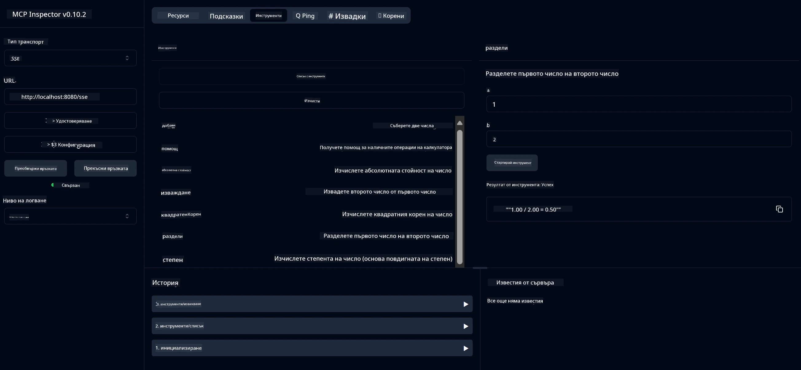

# Основна услуга за калкулатор MCP

> [!NOTE]
> Този пример използва наследения транспорт HTTP+SSE и е насочен към SDK съвместим
> с MCP `2025-11-25`. Новите отдалечени сървъри трябва да използват поддръжка Streamable
> HTTP `2026-07-28`.

Тази услуга предоставя основни операции на калкулатор чрез Протокола за контекст на модел (MCP) с използване на Spring Boot с транспорт WebFlux. Тя е проектирана като прост пример за начинаещи, които учат за реализации на MCP.

За повече информация вижте референтната документация на [MCP Server Boot Starter](https://docs.spring.io/spring-ai/reference/api/mcp/mcp-server-boot-starter-docs.html).

## Преглед

Услугата демонстрира:
- Поддръжка на SSE (Server-Sent Events)
- Автоматична регистрация на инструменти чрез анотацията `@Tool` на Spring AI
- Основни функции на калкулатор:
  - Събиране, изваждане, умножение, деление
  - Изчисляване на степен и квадратен корен
  - Остатък (модул) и абсолютна стойност
  - Помощна функция за описания на операциите

## Характеристики

Тази услуга за калкулатор предлага следните възможности:

1. **Основни аритметични операции**:
   - Събиране на две числа
   - Изваждане на едно число от друго
   - Умножение на две числа
   - Деление на едно число на друго (с проверка за деление на нула)

2. **Разширени операции**:
   - Изчисляване на степен (повдигане на основа в степен)
   - Изчисляване на квадратен корен (с проверка за отрицателно число)
   - Изчисляване на остатък (модул)
   - Изчисляване на абсолютна стойност

3. **Помощна система**:
   - Вградена помощна функция, която обяснява всички налични операции

## Използване на услугата

Услугата предлага следните API крайни точки чрез MCP протокола:

- `add(a, b)`: Събира две числа
- `subtract(a, b)`: Изважда второто число от първото
- `multiply(a, b)`: Умножава две числа
- `divide(a, b)`: Делим първото число на второто (с проверка за нула)
- `power(base, exponent)`: Изчислява степен на число
- `squareRoot(number)`: Изчислява квадратния корен (с проверка за отрицателно число)
- `modulus(a, b)`: Изчислява остатъка при деление
- `absolute(number)`: Изчислява абсолютната стойност
- `help()`: Получава информация за наличните операции

## Тест клиент

Включен е прост тест клиент в пакета `com.microsoft.mcp.sample.client`. Класът `SampleCalculatorClient` демонстрира наличните операции на услугата калкулатор.

## Използване на LangChain4j клиент

Проектът включва примерен LangChain4j клиент в `com.microsoft.mcp.sample.client.LangChain4jClient`, който демонстрира как да се интегрира услугата калкулатор с LangChain4j и GitHub модели:

### Предварителни изисквания

1. **Настройка на GitHub токен**:
   
   За да използвате AI моделите на GitHub (като phi-4), ви е необходим личен достъп токен от GitHub:

   а. Отидете в настройките на своя GitHub акаунт: https://github.com/settings/tokens
   
   б. Кликнете „Generate new token“ → „Generate new token (classic)“
   
   в. Дайте описателно име на токена
   
   г. Изберете следните разрешения:
      - `repo` (Пълен контрол върху частни хранилища)
      - `read:org` (Четене на членство в организации и екипи, четене на организационни проекти)
      - `gist` (Създаване на гистове)
      - `user:email` (Достъп до имейл адресите на потребителя (само за четене))
   
   д. Кликнете „Generate token“ и копирайте новия си токен
   
   е. Задайте го като променлива на средата:
      
      В Windows:
      ```
      set GITHUB_TOKEN=your-github-token
      ```
      
      В macOS/Linux:
      ```bash
      export GITHUB_TOKEN=your-github-token
      ```

   ж. За постоянно настройване, добавете го в променливите на средата чрез системните настройки

2. Добавете зависимостта за LangChain4j GitHub към вашия проект (вече включена в pom.xml):
   ```xml
   <dependency>
       <groupId>dev.langchain4j</groupId>
       <artifactId>langchain4j-github</artifactId>
       <version>${langchain4j.version}</version>
   </dependency>
   ```

3. Уверете се, че сървърът за калкулатор работи на `localhost:8080`

### Стартиране на LangChain4j клиента

Този пример демонстрира:
- Свързване със сървъра MCP на калкулатора чрез транспорт SSE
- Използване на LangChain4j за създаване на чат бот, който използва калкулаторни операции
- Интеграция с AI модели на GitHub (сега с модела phi-4)

Клиентът изпраща следните примерни заявки за демонстрация на функционалността:
1. Изчисляване на сумата от две числа
2. Намиране на квадратен корен на число
3. Получаване на помощна информация за наличните операции на калкулатора

Стартирайте примера и проверете конзолния изход, за да видите как AI моделът използва инструментите на калкулатора за отговор на заявките.

### Конфигурация на GitHub модела

LangChain4j клиентът е конфигуриран да използва модела phi-4 на GitHub със следните настройки:

```java
ChatLanguageModel model = GitHubChatModel.builder()
    .apiKey(System.getenv("GITHUB_TOKEN"))
    .timeout(Duration.ofSeconds(60))
    .modelName("phi-4")
    .logRequests(true)
    .logResponses(true)
    .build();
```

За да използвате различни модели на GitHub, просто променете параметъра `modelName` на друг поддържан модел (например "claude-3-haiku-20240307", "llama-3-70b-8192" и т.н.).

## Зависимости

Проектът изисква следните основни зависимости:

```xml
<!-- For MCP Server -->
<dependency>
    <groupId>org.springframework.ai</groupId>
    <artifactId>spring-ai-starter-mcp-server-webflux</artifactId>
</dependency>

<!-- For LangChain4j integration -->
<dependency>
    <groupId>dev.langchain4j</groupId>
    <artifactId>langchain4j-mcp</artifactId>
    <version>${langchain4j.version}</version>
</dependency>

<!-- For GitHub models support -->
<dependency>
    <groupId>dev.langchain4j</groupId>
    <artifactId>langchain4j-github</artifactId>
    <version>${langchain4j.version}</version>
</dependency>
```

## Компилиране на проекта

Компилирайте проекта с Maven:
```bash
./mvnw clean install -DskipTests
```

## Стартиране на сървъра

### Използване на Java

```bash
java -jar target/calculator-server-0.0.1-SNAPSHOT.jar
```

### Използване на MCP Inspector

MCP Inspector е полезен инструмент за взаимодействие с MCP услуги. За да го използвате с тази услуга калкулатор:

1. **Инсталирайте и стартирайте MCP Inspector** в нов терминален прозорец:
   ```bash
   npx @modelcontextprotocol/inspector
   ```

2. **Достъп до уеб интерфейса** чрез кликване върху URL адреса, показан от приложението (обикновено http://localhost:6274)

3. **Конфигурирайте връзката**:
   - Задайте типа транспорт на "SSE"
   - Задайте URL адреса към работещия SSE край на вашия сървър: `http://localhost:8080/sse`
   - Кликнете "Connect"

4. **Използвайте инструментите**:
   - Кликнете "List Tools", за да видите наличните операции на калкулатора
   - Изберете инструмент и кликнете "Run Tool", за да изпълните операция



### Използване на Docker

Проектът включва Dockerfile за контейнерирано разгръщане:

1. **Създайте Docker образ:**
   ```bash
   docker build -t calculator-mcp-service .
   ```

2. **Стартирайте Docker контейнера:**
   ```bash
   docker run -p 8080:8080 calculator-mcp-service
   ```

Това ще:
- Създаде мултистепенен Docker образ с Maven 3.9.9 и Eclipse Temurin 24 JDK
- Създаде оптимизиран контейнерен образ
- Изложи услугата на порт 8080
- Стартира MCP калкулаторната услуга вътре в контейнера

Ще можете да достъпите услугата на `http://localhost:8080`, след като контейнерът работи.

## Отстраняване на проблеми

### Чести проблеми с GitHub токена

1. **Проблеми с разрешенията на токена**: Ако получите грешка 403 Forbidden, проверете дали токенът има правилните разрешения, както е описано в предварителните изисквания.

2. **Токенът не е намерен**: Ако получите грешка „No API key found“, уверете се, че променливата на средата GITHUB_TOKEN е правилно зададена.

3. **Ограничение на честотата**: GitHub API има ограничения за честотата на заявките. Ако срещнете грешка от тип rate limit (код на състоянието 429), изчакайте няколко минути преди да опитате отново.

4. **Изтичане на времето на токена**: GitHub токените могат да изтичат. Ако получите грешки при удостоверяване след известно време, генерирайте нов токен и обновете променливата на средата.

Ако имате нужда от допълнителна помощ, разгледайте [документацията на LangChain4j](https://github.com/langchain4j/langchain4j) или [документацията на GitHub API](https://docs.github.com/en/rest).

---

<!-- CO-OP TRANSLATOR DISCLAIMER START -->
**Отказ от отговорност**:
Този документ е преведен с помощта на AI преводачески услуга [Co-op Translator](https://github.com/Azure/co-op-translator). Въпреки че се стремим към точност, моля имайте предвид, че автоматизираните преводи могат да съдържат грешки или неточности. Оригиналният документ на неговия роден език трябва да се счита за авторитетен източник. За критична информация се препоръчва професионален човешки превод. Ние не носим отговорност за каквито и да е недоразумения или неправилни тълкувания, произтичащи от използването на този превод.
<!-- CO-OP TRANSLATOR DISCLAIMER END -->