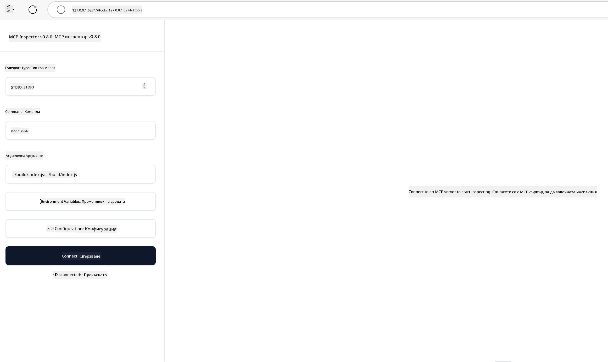

# Практическа реализация

[](https://youtu.be/vCN9-mKBDfQ)

_(Кликнете на горната снимка, за да гледате видео от този урок)_

Практическата реализация е мястото, където силата на Протокола за контекст на модела (MCP) става осезаема. Въпреки че разбирането на теорията и архитектурата зад MCP е важно, истинската стойност се проявява, когато прилагате тези концепции, за да създадете, тествате и разположите решения, които решават реални проблеми. Тази глава преодолява пропастта между концептуалното знание и практическата разработка, като ви води през процеса на създаване на MCP-базирани приложения.

Независимо дали разработвате интелигентни асистенти, интегрирате изкуствен интелект в бизнес процеси, или създавате поръчкови инструменти за обработка на данни, MCP предоставя гъвкава основа. Неговият езиконезависим дизайн и официалните SDK за популярни програмни езици го правят достъпен за широк кръг разработчици. Използвайки тези SDK, можете бързо да прототипирате, итеративно да подобрявате и да мащабирате своите решения в различни платформи и среди.

В следващите раздели ще намерите практически примери, примерен код и стратегии за разполагане, които демонстрират как да внедрите MCP в C#, Java със Spring, TypeScript, JavaScript и Python. Също така ще научите как да отстранявате грешки и тествате MCP сървърите си, да управлявате API-та и да разполагате решения в облака, използвайки Azure. Тези практически ресурси са предназначени да ускорят вашето обучение и да ви помогнат уверено да изграждате стабилни, готови за продукция MCP приложения.

## Преглед

Този урок се фокусира върху практическите аспекти на реализацията на MCP в различни програмни езици. Ще разгледаме как да използвате MCP SDK в C#, Java със Spring, TypeScript, JavaScript и Python, за да изградите стабилни приложения, да отстранявате грешки и тествате MCP сървъри и да създавате повторно използваеми ресурси, промптове и инструменти.

## Цели на обучението

Към края на този урок ще можете:

- Да реализирате MCP решения с помощта на официални SDK на различни програмни езици
- Да отстранявате грешки и тествате MCP сървъри систематично
- Да създавате и използвате функции на сървър (Ресурси, Промптове и Инструменти)
- Да проектирате ефективни MCP работни процеси за сложни задачи
- Да оптимизирате реализации на MCP по отношение на производителност и надеждност

## Официални SDK ресурси

Протоколът за контекст на модела предлага официални SDK за няколко езика (съгласувани с [MCP Спецификация 2025-11-25](https://spec.modelcontextprotocol.io/specification/2025-11-25/)):

- [C# SDK](https://github.com/modelcontextprotocol/csharp-sdk)
- [Java със Spring SDK](https://github.com/modelcontextprotocol/java-sdk) **Забележка:** изисква зависимост към [Project Reactor](https://projectreactor.io). (Вижте [дискусионен въпрос 246](https://github.com/orgs/modelcontextprotocol/discussions/246).)
- [TypeScript SDK](https://github.com/modelcontextprotocol/typescript-sdk)
- [Python SDK](https://github.com/modelcontextprotocol/python-sdk)
- [Kotlin SDK](https://github.com/modelcontextprotocol/kotlin-sdk)
- [Go SDK](https://github.com/modelcontextprotocol/go-sdk)

## Работа с MCP SDK

Този раздел предоставя практични примери за реализиране на MCP на различни програмни езици. Можете да намерите примерен код в директорията `samples`, организиран по езици.

### Налични примери

Репозиторият включва [примерни реализации](../../../04-PracticalImplementation/samples) на следните езици:

- [C#](./samples/csharp/README.md)
- [Java със Spring](./samples/java/containerapp/README.md)
- [TypeScript](./samples/typescript/README.md)
- [JavaScript](./samples/javascript/README.md)
- [Python](./samples/python/README.md)

Всеки пример демонстрира ключови концепции и модели за реализация на MCP за конкретен език и екосистема.

### Практически ръководства

Допълнителни ръководства за практическа реализация на MCP:

- [Пагинация и големи набори от резултати](./pagination/README.md) - Управление на курсор-базирана пагинация за инструменти, ресурси и големи данни

## Основни функции на сървъра

MCP сървърите могат да реализират всякаква комбинация от тези функции:

### Ресурси

Ресурсите предоставят контекст и данни за ползване от потребителя или AI модела:

- Репозитории с документи
- Бази знания
- Структурирани източници на данни
- Файлови системи

### Промптове

Промптовете са шаблонирани съобщения и работни процеси за потребителите:

- Предефинирани шаблони за разговори
- Водени модели на взаимодействие
- Специализирани структури на диалога

### Инструменти

Инструментите са функции, които AI моделът може да изпълнява:

- Утилити за обработка на данни
- Интеграции с външни API
- Изчислителни възможности
- Функции за търсене

## Примерни реализации: Реализация на C#

Официалният репозиторий на C# SDK съдържа няколко примерни реализации, демонстриращи различни аспекти на MCP:

- **Основен MCP клиент**: Прост пример как да се създаде MCP клиент и да се извикват инструменти
- **Основен MCP сървър**: Минимална реализация на сървър с базова регистрация на инструменти
- **Разширен MCP сървър**: Пълноценен сървър с регистрация на инструменти, автентикация и обработка на грешки
- **Интеграция с ASP.NET**: Примери за интеграция с ASP.NET Core
- **Модели за реализация на Инструменти**: Различни модели за реализиране на инструменти с различна сложност

MCP C# SDK е в предварителна версия и API-тата може да се променят. Ще обновяваме този блог непрекъснато с развитието на SDK.

### Ключови характеристики

- [C# MCP Nuget ModelContextProtocol](https://www.nuget.org/packages/ModelContextProtocol)
- Създаване на [първия MCP сървър](https://devblogs.microsoft.com/dotnet/build-a-model-context-protocol-mcp-server-in-csharp/).

За пълни примери за реализация на C#, посетете [официалния репозиторен с примери за C# SDK](https://github.com/modelcontextprotocol/csharp-sdk)

## Примерна реализация: Реализация на Java със Spring

SDK за Java със Spring предлага стабилни опции за реализация на MCP с функции от корпоративен клас.

### Ключови характеристики

- Интеграция със Spring Framework
- Силна типова безопасност
- Поддръжка на реактивно програмиране
- Пълноценна обработка на грешки

За пълен пример за реализация на Java със Spring вижте [Java със Spring пример](samples/java/containerapp/README.md) в директорията с примери.

## Примерна реализация: Реализация на JavaScript

JavaScript SDK предлага лек и гъвкав подход за реализация на MCP.

### Ключови характеристики

- Поддръжка за Node.js и браузър
- Promise-базиран API
- Лесна интеграция с Express и други рамки
- Поддръжка на WebSocket за стрийминг

За пълен пример за реализация на JavaScript вижте [JavaScript пример](samples/javascript/README.md) в директорията с примери.

## Примерна реализация: Реализация на Python

Python SDK предоставя по-питоничен подход към реализацията на MCP с отлична интеграция с ML рамки.

### Ключови характеристики

- Поддръжка на async/await с asyncio
- Интеграция с FastAPI
- Лесна регистрация на инструменти
- Родна интеграция с популярни ML библиотеки

За пълен пример за реализация на Python вижте [Python пример](samples/python/README.md) в директорията с примери.

## Управление на API

Azure API Management е отлично решение за осигуряване на сигурността на MCP сървърите. Идеята е да поставите Azure API Management инстанция пред вашия MCP сървър и тя да управлява функции, които вероятно ще искате като:

- ограничаване на скоростта
- управление на токени
- мониторинг
- балансиране на натоварването
- сигурност

### Пример за Azure

Ето пример за Azure, който прави точно това, т.е. [създава MCP сървър и го защитава с Azure API Management](https://github.com/Azure-Samples/remote-mcp-apim-functions-python).

Вижте как се осъществява потока на автентикация на изображението по-долу:


В предишното изображение се случва следното:

- Автентикация/авторизация се извършва с Microsoft Entra.
- Azure API Management действа като шлюз и използва политики за насочване и управление на трафика.
- Azure Monitor регистрира всички заявки за по-нататъшен анализ.

#### Поток на авторизация

Нека разгледаме по-подробно потока на авторизация:


#### Спецификация за авторизация в MCP

Научете повече за [спецификацията за авторизация в MCP](https://spec.modelcontextprotocol.io/specification/2025-11-25/basic/authorization/)

## Разгръщане на Отдалечен MCP сървър в Azure

Нека видим дали можем да разположим по-рано споменатия пример:

1. Клонирайте репозиторито

    ```bash
    git clone https://github.com/Azure-Samples/remote-mcp-apim-functions-python.git
    cd remote-mcp-apim-functions-python
    ```

1. Регистрирайте ресурсния доставчик `Microsoft.App`.

   - Ако използвате Azure CLI, изпълнете `az provider register --namespace Microsoft.App --wait`.
   - Ако използвате Azure PowerShell, изпълнете `Register-AzResourceProvider -ProviderNamespace Microsoft.App`. След малко проверете с `(Get-AzResourceProvider -ProviderNamespace Microsoft.App).RegistrationState` дали регистрацията е завършена.

1. Стартирайте тази [azd](https://aka.ms/azd) команда, за да осигурите услугата за управление на api, функцията app (с код) и всички останали необходими Azure ресурси

    ```shell
    azd up
    ```

    Тази команда трябва да разположи всички облачни ресурси в Azure

### Тестване на вашия сървър с MCP Inspector

1. В **нов терминален прозорец** инсталирайте и стартирайте MCP Inspector

    ```shell
    npx @modelcontextprotocol/inspector
    ```

    Трябва да видите интерфейс, подобен на:

    

1. Натиснете CTRL и кликнете, за да заредите MCP Inspector уеб приложението от URL-а, показан от приложението (напр. [http://127.0.0.1:6274/#resources](http://127.0.0.1:6274/#resources))
1. Задайте типа на транспорта на `SSE`
1. Задайте URL на вашия работещ API Management SSE крайна точка, показан след `azd up` и **Свържете се**:

    ```shell
    https://<apim-servicename-from-azd-output>.azure-api.net/mcp/sse
    ```

1. **Изброяване на Инструменти**. Кликнете върху инструмент и **Стартирайте Инструмента**.

Ако всички стъпки са успешни, вече трябва да сте свързани с MCP сървъра и да сте успели да извикате инструмент.

## MCP сървъри за Azure

[Remote-mcp-functions](https://github.com/Azure-Samples/remote-mcp-functions-dotnet): Този набор от репозитории са шаблони за бърз старт за изграждане и разполагане на поръчкови отдалечени MCP (Model Context Protocol) сървъри, използвайки Azure Functions с Python, C# .NET или Node/TypeScript.

Примерите предоставят цялостно решение, което позволява на разработчиците да:

- Строят и пускат локално: Разработват и отстраняват грешки на MCP сървър на локална машина
- Разполагат в Azure: Лесно разполагат в облака с проста команда azd up
- Свързват се от клиенти: Свързване към MCP сървър от различни клиенти, включително режим агент Copilot на VS Code и инструмента MCP Inspector

### Ключови характеристики

- Сигурност по дизайн: MCP сървърът е защитен с ключове и HTTPS
- Опции за автентикация: Поддържа OAuth с вградена автентикация и/или API Management
- Изолация на мрежата: Позволява мрежова изолация чрез Azure Virtual Networks (VNET)
- Архитектура без сървър: Използва Azure Functions за мащабируемо, събитийно ориентирано изпълнение
- Местна разработка: Обширна поддръжка за локална разработка и отстраняване на грешки
- Лесно разгръщане: Оптимизиран процес за разполагане в Azure

Репозиторият включва всички необходими конфигурационни файлове, изходен код и инфраструктурни дефиниции, за да започнете бързо с продукционно реализиран MCP сървър.

- [Azure Remote MCP Functions Python](https://github.com/Azure-Samples/remote-mcp-functions-python) - Примерна реализация на MCP с Azure Functions и Python

- [Azure Remote MCP Functions .NET](https://github.com/Azure-Samples/remote-mcp-functions-dotnet) - Примерна реализация на MCP с Azure Functions и C# .NET

- [Azure Remote MCP Functions Node/Typescript](https://github.com/Azure-Samples/remote-mcp-functions-typescript) - Примерна реализация на MCP с Azure Functions и Node/TypeScript.

## Ключови изводи

- MCP SDK предоставят езиково-специфични инструменти за реализиране на стабилни MCP решения
- Процесът на отстраняване на грешки и тестване е критичен за надеждността на MCP приложенията
- Повторно използваемите шаблони на промптове позволяват последователни AI взаимодействия
- Добре проектираните работни процеси могат да оркестрират сложни задачи, използвайки множество инструменти
- Реализирането на MCP решения изисква внимание към сигурността, производителността и обработката на грешки

## Упражнение

Проектирайте практичен MCP работен процес, който адресира реален проблем във вашата област:

1. Идентифицирайте 3-4 инструмента, които биха били полезни за решаването на този проблем
2. Създайте диаграма на работния процес, показваща как тези инструменти взаимодействат
3. Реализирайте базова версия на един от инструментите с предпочитания от вас език
4. Създайте шаблон на промпт, който ще помогне на модела ефективно да използва вашия инструмент

## Допълнителни ресурси

---

## Следващо

Следва: [Разширени Теми](../05-AdvancedTopics/README.md)

---

<!-- CO-OP TRANSLATOR DISCLAIMER START -->
**Отказ от отговорност**:
Този документ е преведен с помощта на AI преводаческа услуга [Co-op Translator](https://github.com/Azure/co-op-translator). Въпреки че се стремим към точност, моля, имайте предвид, че автоматичните преводи могат да съдържат грешки или неточности. Оригиналният документ на неговия роден език трябва да се счита за авторитетен източник. За критична информация се препоръчва професионален човешки превод. Ние не носим отговорност за каквито и да било недоразумения или погрешни тълкувания, произтичащи от използването на този превод.
<!-- CO-OP TRANSLATOR DISCLAIMER END -->