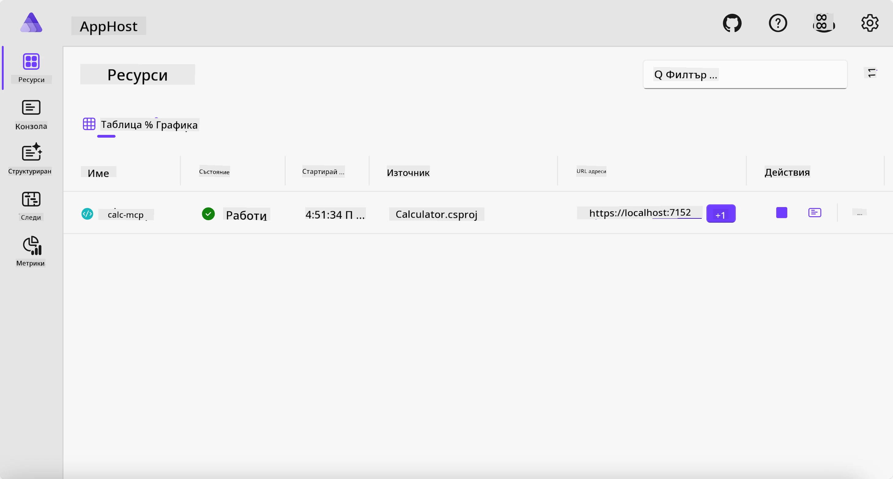
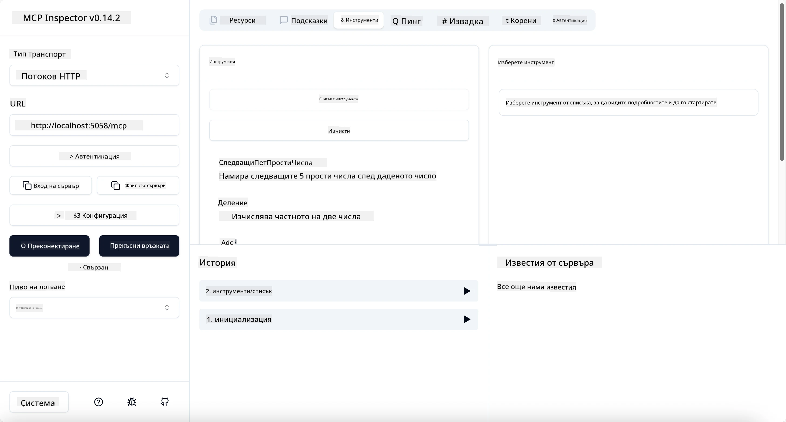

# Пример

Предишният пример показва как да използвате локален .NET проект с тип `stdio`. И как да стартирате сървъра локално в контейнер. Това е добро решение в много ситуации. Въпреки това, може да е полезно сървърът да работи отдалечено, например в облачна среда. Тук идва типът `http`.

Като погледнете решението в папка `04-PracticalImplementation`, може да изглежда много по-сложно от предишното. Но в действителност не е така. Ако разгледате отблизо проекта `src/Calculator`, ще видите, че е предимно същият код като в предишния пример. Единствената разлика е, че използваме различна библиотека `ModelContextProtocol.AspNetCore` за обработка на HTTP заявките. И променяме метода `IsPrime`, за да го направим частен, просто за да покажем, че можете да имате частни методи във вашия код. Останалата част от кода е същата като преди.

Другите проекти са от [Aspire](https://aspire.dev/get-started/what-is-aspire/). Присъствието на Aspire в решението подобрява опита на разработчика по време на разработване и тестване и помага с наблюдаемостта. Не е задължително да се използва за стартиране на сървъра, но е добра практика да бъде включен в решението ви.

## Стартиране на сървъра локално

1. От VS Code (с разширението C# DevKit) навигирайте до директорията `04-PracticalImplementation/samples/csharp`.
1. Изпълнете следната команда, за да стартирате сървъра:

   ```bash
    dotnet watch run --project ./src/AppHost
   ```

1. Когато уеб браузър отвори Aspire таблото, отбележете URL адреса `http`. Той трябва да изглежда като `http://localhost:5058/`.

   

## Тествайте Streamable HTTP с MCP Inspector

Ако имате Node.js версия 22.7.5 или по-висока, можете да използвате MCP Inspector, за да тествате сървъра си.

Стартирайте сървъра и изпълнете следната команда в терминал:

```bash
npx @modelcontextprotocol/inspector http://localhost:5058
```



- Изберете `Streamable HTTP` като тип транспорт.
- В полето Url въведете URL адреса на сървъра, отбелязан по-рано, и добавете `/mcp`. Трябва да бъде `http` (не `https`), примерно `http://localhost:5058/mcp`.
- изберете бутона Connect.

Хубаво при Inspector е, че предоставя добра видимост върху случващото се.

- Опитайте да изброите наличните инструменти
- Опитайте някои от тях, трябва да работят точно както преди.

## Тествайте MCP сървъра с GitHub Copilot Chat във VS Code

За да използвате Streamable HTTP транспорт с GitHub Copilot Chat, променете конфигурацията на сървъра `calc-mcp`, създаден по-рано, да изглежда така:

```jsonc
// .vscode/mcp.json
{
  "servers": {
    "calc-mcp": {
      "type": "http",
      "url": "http://localhost:5058/mcp"
    }
  }
}
```

Направете някои тестове:

- Попитайте за "3 прости числа след 6780". Забележете как Copilot ще използва новите инструменти `NextFivePrimeNumbers` и ще върне само първите 3 прости числа.
- Попитайте за "7 прости числа след 111", за да видите какво ще се случи.
- Попитайте за "Джон има 24 близалки и иска да ги раздаде на 3-те си деца. Колко близалки ще има всяко дете?", за да видите какво ще стане.

## Деплойване на сървъра в Azure

Нека деплойнем сървъра в Azure, за да могат повече хора да го използват.

От терминал навигирайте до папка `04-PracticalImplementation/samples/csharp` и изпълнете следната команда:

```bash
azd up
```

След като деплойването приключи, трябва да видите съобщение като това:


Вземете URL адреса и го използвайте в MCP Inspector и в GitHub Copilot Chat.

```jsonc
// .vscode/mcp.json
{
  "servers": {
    "calc-mcp": {
      "type": "http",
      "url": "https://calc-mcp.gentleriver-3977fbcf.australiaeast.azurecontainerapps.io/mcp"
    }
  }
}
```

## Какво следва?

Ние изпробвахме различни типове транспорт и инструменти за тестване. Също така деплойнахме вашия MCP сървър в Azure. Но какво ако сървърът ни трябва да има достъп до частни ресурси? Например база данни или частен API? В следващата глава ще видим как можем да подобрим сигурността на нашия сървър.

---

<!-- CO-OP TRANSLATOR DISCLAIMER START -->
**Отказ от отговорност**:
Този документ е преведен с помощта на AI преводачески услуга [Co-op Translator](https://github.com/Azure/co-op-translator). Въпреки че се стремим към точност, моля имайте предвид, че автоматизираните преводи могат да съдържат грешки или неточности. Оригиналният документ на неговия роден език трябва да се счита за авторитетен източник. За критична информация се препоръчва професионален човешки превод. Ние не носим отговорност за каквито и да е недоразумения или неправилни тълкувания, произтичащи от използването на този превод.
<!-- CO-OP TRANSLATOR DISCLAIMER END -->