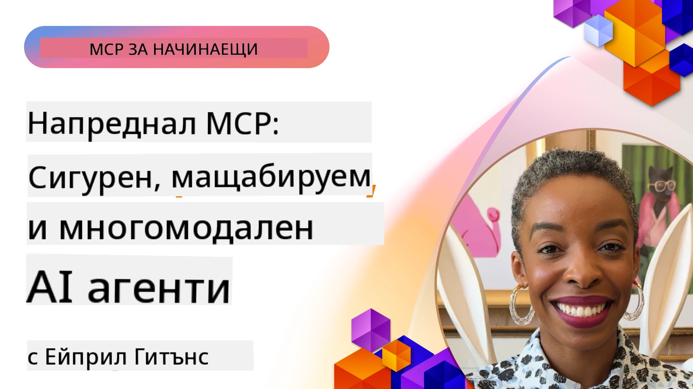

# Разширени Теми в MCP

_(Кликнете върху изображението по-горе, за да гледате видеото на този урок)_

Тази глава обхваща серия от напреднали теми в реализирането на Протокола за Моделен Контекст (MCP), включително мултимодална интеграция, мащабируемост, най-добри практики за сигурност и интеграция в предприятия. Тези теми са от решаващо значение за изграждане на стабилни и готови за продукция MCP приложения, които могат да отговорят на изискванията на модерните AI системи.

## Обзор

Този урок разглежда усъвършенствани концепции в реализирането на Протокола за Моделен Контекст, с фокус върху мултимодална интеграция, мащабируемост, най-добри практики за сигурност и интеграция в предприятия. Тези теми са от съществено значение за изграждане на MCP приложения за продукционна среда, които могат да се справят със сложни изисквания в корпоративни среди.

> **Забележка за текущата спецификация:** MCP `2026-07-28` премахва кореновите и
> семплинг примитиви, разгледани в уроци 5.4 и 5.6. Също така прехвърля
> експерименталната функция „Задачи“, спомената в Протоколни Функционалности (5.16), 
> в отделно разширение за Задачи. Тези уроци са запазени за наследствени
> `2025-11-25` реализации и включват насоки за миграция. Вижте
> [Какво се промени в MCP: Спецификация 2026-07-28](../01-CoreConcepts/mcp-2026-07-28.md).

## Обучителни Цели

В края на този урок ще можете да:

- Реализирате мултимодални възможности в рамките на MCP
- Проектирате мащабируеми MCP архитектури за сценарии с високо търсене
- Прилагате най-добри практики за сигурност, съгласувани с принципите за сигурност на MCP
- Интегрирате MCP със системи и рамки за корпоративен AI
- Оптимизирате производителността и надеждността в продукционни среди

## Уроци и примерни проекти

| Връзка | Заглавие | Описание |
|------|-------|-------------|
| [5.1 Интеграция с Azure](./mcp-integration/README.md) | Интеграция с Azure | Научете как да интегрирате вашия MCP сървър в Azure |
| [5.2 Мултимодален пример](./mcp-multi-modality/README.md) | Мултимодални примери на MCP | Примери за аудио, изображение и мултимодален отговор |
| [5.3 MCP OAuth2 пример](../../../05-AdvancedTopics/mcp-oauth2-demo) | MCP OAuth2 Демонстрация | Минимално приложение Spring Boot, показващо OAuth2 с MCP, както като Авторизационен, така и като Ресурсен сървър. Демонстрира защитено издаване на токени, защитени крайни точки, деплоймънт в Azure Container Apps и интеграция с API Management. |
| [5.4 Коренови Контексти](./mcp-root-contexts/README.md) | Коренови контексти | Научете наследствения `2025-11-25` коренов примитив и текущите опции за миграция (прекратено в `2026-07-28`) |
| [5.5 Маршрутизиране](./mcp-routing/README.md) | Маршрутизиране | Научете различни видове маршрутизиране |
| [5.6 Семплиране](./mcp-sampling/README.md) | Семплиране | Научете наследствения `2025-11-25` семплиращ примитив и текущи опции за миграция (прекратено в `2026-07-28`) |
| [5.7 Мащабиране](./mcp-scaling/README.md) | Мащабиране | Научете за мащабирането |
| [5.8 Сигурност](./mcp-security/README.md) | Сигурност | Защитете вашия MCP сървър |
| [5.9 Уеб търсене пример](./web-search-mcp/README.md) | Уеб търсене MCP | Python MCP сървър и клиент, интегриращи се със SerpAPI за реално време уеб, новини, продуктово търсене и въпроси и отговори. Демонстрира многоинструментна оркестрация, интеграция с външни API и надеждно обработване на грешки. |
| [5.10 Поточно предаване в реално време](./mcp-realtimestreaming/README.md) | Поточно предаване | Поточното предаване на данни в реално време стана съществено в днешния свят, ориентиран към данни, където бизнеса и приложенията изискват незабавен достъп до информация за своевременно вземане на решения. |
| [5.11 Уеб търсене в реално време](./mcp-realtimesearch/README.md) | Уеб търсене | Как MCP преобразува уеб търсенето в реално време чрез предоставяне на стандартизиран подход към управлението на контекста между AI модели, търсачки и приложения. |
| [5.12 Автентикация с Entra ID за MCP сървъри](./mcp-security-entra/README.md) | Автентикация с Entra ID | Microsoft Entra ID предоставя стабилно базирано в облак решение за управление на идентичността и достъпа, което помага да се гарантира, че само упълномощени потребители и приложения могат да взаимодействат с вашия MCP сървър. |
| [5.13 Интеграция с Microsoft Foundry Agent](./mcp-foundry-agent-integration/README.md) | Интеграция с Microsoft Foundry | Научете как да интегрирате MCP сървъри с Microsoft Foundry агенти, позволявайки мощна оркестрация на инструменти и корпоративни AI възможности с стандартизирани връзки към външни източници на данни. |
| [5.14 Контекстно инженерство](./mcp-contextengineering/README.md) | Контекстно инженерство | Бъдещата възможност на техниките за контекстно инженерство за MCP сървъри, включително оптимизация на контекста, динамично управление на контекста и стратегии за ефективно изграждане на подсказки в рамките на MCP архитектури. |
| [5.15 Персонализиран транспорт на MCP](./mcp-transport/README.md) | Персонализиран транспорт | Научете как да реализирате персонализирани механизми за транспорт за специализирани MCP комуникационни сценарии. |
| [5.16 Задълбочен преглед на протоколните функции](./mcp-protocol-features/README.md) | Протоколни функции | Умейте да използвате напреднали протоколни функции, включително известия за напредък, отмяна на заявки, шаблони за ресурси и модели за обработка на грешки. |
| [5.17 Съвместно мултиагентно разсъждение](./mcp-adversarial-agents/README.md) | Противопоставящи се агенти | Използвайте два агента с противоположни позиции, споделящи един набор инструменти на MCP, за да откривате халюцинации, да изваждате проблемни случаи на повърхността и да произвеждате по-добре калибрирани резултати чрез структурирана дебата. |

> **Историческа `2025-11-25` забележка:** тази ревизия въведе експериментални
> Задачи и разшири няколко протоколни функции. В `2026-07-28` Задачи
> се преместиха в официално разширение, а Корените станаха прекратени. Не използвайте
> състоянието на функционалността `2025-11-25` като текущо указание; вижте
> [промяната в 2026-07-28](https://modelcontextprotocol.io/specification/2026-07-28/changelog).

## Допълнителни препратки

За най-актуална информация относно разширените теми в MCP, вижте:
- [Документация на MCP](https://modelcontextprotocol.io/)
- [Спецификация MCP (2026-07-28)](https://modelcontextprotocol.io/specification/2026-07-28/)
- [GitHub хранилище](https://github.com/modelcontextprotocol)
- [OWASP MCP Топ 10](https://microsoft.github.io/mcp-azure-security-guide/mcp/) - Рискове за сигурността и мерки за защита
- [MCP Security Summit Workshop (Sherpa)](https://azure-samples.github.io/sherpa/) - Практическо обучение по сигурност

## Основни изводи

- Мултимодалните реализации на MCP разширяват възможностите на AI отвъд обработката на текст
- Мащабируемостта е от съществено значение за внедряването в предприятия и може да се постигне чрез хоризонтално и вертикално мащабиране
- Комплексните мерки за сигурност защитават данните и осигуряват правилен контрол на достъпа
- Корпоративната интеграция с платформи като Azure OpenAI и Microsoft AI Foundry подобрява възможностите на MCP
- Разширените реализации на MCP печелят от оптимизирани архитектури и внимателно управление на ресурсите

## Упражнение

Проектирайте корпоративна реализация на MCP за конкретен случай на употреба:

1. Определете мултимодалните изисквания за вашия случай на употреба
2. Очертайте контролните мерки за сигурност, необходими за защита на чувствителни данни
3. Проектирайте мащабируема архитектура, която може да се справя с вариращо натоварване
4. Планирайте интеграционните точки със системи за корпоративен AI
5. Документирайте потенциални места на стеснение в производителността и стратегии за отстраняването им

## Допълнителни ресурси

- [Документация на Azure OpenAI](https://learn.microsoft.com/en-us/azure/ai-services/openai/)
- [Документация на Microsoft AI Foundry](https://learn.microsoft.com/en-us/ai-services/)

---

## Какво следва

Изследвайте уроците в този модул започвайки с: [5.1 MCP Интеграция](./mcp-integration/README.md)

След като завършите този модул, продължете към: [Модул 6: Приноси от общността](../06-CommunityContributions/README.md)

---

<!-- CO-OP TRANSLATOR DISCLAIMER START -->
**Отказ от отговорност**:
Този документ е преведен с помощта на AI преводачески услуга [Co-op Translator](https://github.com/Azure/co-op-translator). Въпреки че се стремим към точност, моля имайте предвид, че автоматизираните преводи могат да съдържат грешки или неточности. Оригиналният документ на неговия роден език трябва да се счита за авторитетен източник. За критична информация се препоръчва професионален човешки превод. Ние не носим отговорност за каквито и да е недоразумения или неправилни тълкувания, произтичащи от използването на този превод.
<!-- CO-OP TRANSLATOR DISCLAIMER END -->