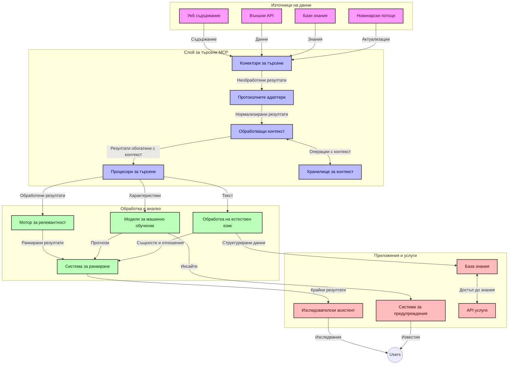
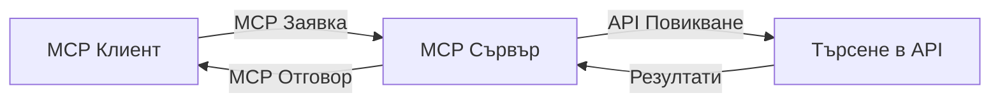
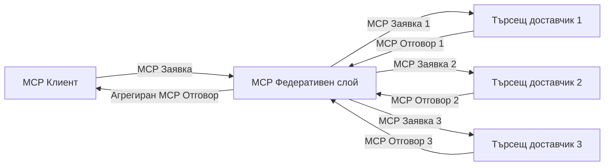
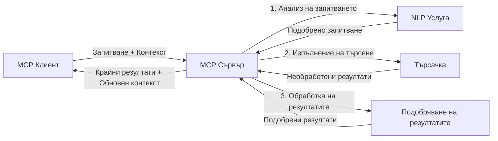

# Протокол за контекст на модела за търсене в уеб в реално време

## Преглед

Търсенето в уеб в реално време се превърна в съществено в днешната информационно насочена среда, където приложенията имат нужда от незабавен достъп до актуална информация в интернет, за да предоставят релевантни и навременни отговори. Протоколът за контекст на модела (MCP) представлява значителен напредък в оптимизирането на тези процеси на търсене в реално време, подобрявайки ефективността на търсене, поддържайки контекстуалната цялост и подобрявайки общото представяне на системата.

Този модул изследва как MCP трансформира търсенето в уеб в реално време, като предоставя стандартизиран подход за управление на контекста между AI модели, търсачки и приложения.

### Какво ще научите

В това изчерпателно ръководство ще откриете:

- Как MCP създава безпроблемна връзка между AI модели и възможностите за търсене в уеб в реално време
- Архитектурни модели за внедряване на ефективни и мащабируеми решения за търсене с MCP
- Техники за запазване на контекста на търсенето през множество заявки и взаимодействия
- Практически кодови реализации на Python и JavaScript за различни сценарии на търсене
- Методи за баланс между релевантност, новост и производителност в системи за търсене, захранвани от MCP

## Въведение в търсенето в уеб в реално време

Търсенето в уеб в реално време е технологичен подход, който позволява непрекъснато запитване, обработка и анализ на уеб-базирана информация в момента на публикуването или обновяването ѝ, което позволява на системите да предоставят свежа и релевантна информация с минимална латентност. За разлика от традиционните търсачки, които работят с индексирани данни, които може да са на часове или дни, търсените в реално време обработват живи данни от уеб, предоставяйки прозрения и информация, отразяваща текущото състояние на онлайн съдържанието.

### Основни концепции на търсенето в уеб в реално време:

- **Непрекъсната обработка на заявки**: Търсещите заявки се обработват спрямо постоянно обновяващи се източници на данни
- **Приоритет на новостта**: Системите са проектирани да приоритизират свежа информация
- **Баланс на релевантността**: Поддържане на баланс между релевантност и новост
- **Мащабируема архитектура**: Системите трябва да могат да поемат променливи натоварвания от заявки и обеми на данни
- **Контекстуално разбиране**: Поддържането на контекста на потребителя през итерациите на търсене е от ключово значение за смислени резултати
- **Динамично преформулиране на заявки**: Адаптивно модифициране на заявките в зависимост от контекста и предходните резултати
- **Интеграция на множество източници**: Комбиниране на резултати от множество доставчици на търсене и уеб източници
- **Семантично разбиране**: Обработка на заявки и съдържание на база смисъл, а не само ключови думи
- **Ранглиране в реално време**: Непрекъснато настройване на подредбата на резултатите с появата на нова информация

### Протоколът за контекст на модела и търсенето в уеб в реално време

Протоколът за контекст на модела (MCP) адресира няколко ключови предизвикателства в среди за търсене в уеб в реално време:

1. **Запазване на контекста на търсенето**: MCP стандартизира начина, по който контекстът се поддържа между разпределени компоненти за търсене, гарантирайки, че AI модели и възлите за обработка имат достъп до релевантна история на заявките и потребителските предпочитания.

2. **Ефективно управление на заявките**: Чрез предоставяне на организирани механизми за трансмисия на контекст, MCP намалява товара от повторното предаване на контекста при всяка итерация на търсене.

3. **Взаимна съвместимост**: MCP създава общ език за споделяне на контекст между различни технологии за търсене и AI модели, позволявайки по-гъвкави и разширяеми архитектури.

4. **Контекст, оптимизиран за търсене**: Внедряванията на MCP могат да приоритизират кои елементи от контекста са най-важни за ефективно търсене, оптимизирайки както за производителност, така и за точност.

5. **Адаптивна обработка на търсенето**: С правилното управление на контекста чрез MCP системите за търсене могат динамично да настройват обработката според променящите се потребителски нужди и информационни пейзажи.

В модерни приложения като агрегатори на новини и изследователски асистенти интеграцията на MCP с уеб търсачки позволява по-интелигентно, контекстуално информирано търсене, което предоставя все по-релевантни резултати с напредването на взаимодействията с потребителя.

## Обучителни цели

В края на този урок ще можете да:

- Разбирате основите на търсенето в уеб в реално време и предизвикателствата му в съвременните приложения
- Обясните как Протоколът за контекст на модела (MCP) подобрява способностите за търсене в уеб в реално време
- Внедрявате решения за търсене, базирани на MCP, използвайки популярни рамки и API
- Проектирате и деплойвате скалируеми, високопроизводителни архитектури за търсене с MCP
- Прилагате концепции на MCP за различни случаи на употреба, включително семантично търсене, изследователска помощ и AI-усилено браузване
- Оценявате нововъзникващи тенденции и бъдещи иновации в MCP-базирани търсещи технологии
- Развивате системи за търсене, осъзнати за контекста, които се учат от взаимодействията с потребителя
- Интегрирате възможностите за уеб търсене в AI асистенти чрез стандартизирани MCP протоколи
- Създавате многостепенни търсещи тръбопроводи, които постепенно усъвършенстват резултатите на база контекст
- Оптимизирате производителността на търсенето, като същевременно поддържате пълно осъзнаване на контекста

### Дефиниция и значимост

Търсенето в уеб в реално време включва непрекъснато запитване, извличане и предоставяне на уеб-базирана информация с минимална латентност. За разлика от традиционните търсачки, които периодично претърсват и индексират уеб, търсенето в реално време цели да представи информация веднага щом стане достъпна, позволявайки незабавен достъп до най-актуалното съдържание.

Ключови характеристики на търсенето в уеб в реално време включват:

- **Свежест**: Приоритизиране на ново съдържание и обновления
- **Непрекъсната обработка**: Постоянен мониторинг за нова информация
- **Адаптиране на заявките**: Усъвършенстване на търсещите заявки спрямо контекст и обратна връзка
- **Незабавно предоставяне**: Осигуряване на резултати от търсенето с минимално забавяне
- **Задържане на контекст**: Изграждане върху предишни заявки за подобрена релевантност

### Предизвикателства в традиционното търсене в уеб

Традиционните подходи за търсене в уеб се сблъскват с няколко ограничения при прилагане в реално времеви сценарии:

1. **Фрагментация на контекста**: Трудности при поддържане на контекст на търсенето през множество заявки
2. **Свежест на информацията**: Трудности в достъпа до и приоритизирането на най-новата информация
3. **Сложност на интеграция**: Проблеми с взаимовръзката между търсещи системи и приложения
4. **Проблеми с латентността**: Балансиране на цялостното търсене с изисквания за време за отговор
5. **Настройване на релевантността**: Осигуряване на точност и релевантност при приоритет на новостта

## Разбиране на Протокола за контекст на модела (MCP) за търсене

### Какво е MCP в контекста на търсене?

Протоколът за контекст на модела (MCP) е стандартизиран комуникационен протокол, създаден за улесняване на ефективното взаимодействие между AI модели и приложения. В контекста на търсенето в уеб в реално време, MCP предоставя рамка за:

- Запазване на контекста на търсенето през поредици от заявки
- Стандартизиране на формати за заявки и резултати от търсене
- Оптимизиране на трансмисията на параметрите и резултатите от търсенето
- Подобряване на комуникацията модел-търсачка

### Основни компоненти и архитектура

Архитектурата на MCP за търсене в уеб в реално време се състои от няколко ключови компонента:

1. **Обработващи контекст на заявки**: Управляват и поддържат контекста на търсенето през множество заявки
2. **Процесори на търсене**: Обработват входящите заявки за търсене с техники, осъзнаващи контекста
3. **Адаптери на протоколи**: Преобразуват между различни API за търсене, като запазват контекста
4. **Склад за контекст**: Ефективно съхранява и извлича история на търсения и предпочитания
5. **Свързващи търсене**: Свързват с различни търсещи машини и уеб API



### Как MCP подобрява търсенето в уеб в реално време

MCP адресира традиционните предизвикателства при търсене в уеб чрез:

- **Контекстуална непрекъснатост**: Поддържане на връзките между заявките през цялата сесия на търсене
- **Оптимизирана трансмисия**: Намаляване на излишъка в параметрите на търсене чрез интелигентно управление на контекста
- **Стандартизирани интерфейси**: Предоставяне на постоянни API за компоненти на търсене
- **Намалена латентност**: Минимален товар за обработка чрез ефективно управление на контекста
- **Подобрена релевантност**: Усъвършенстване на релевантността на търсенето чрез запазване на потребителския замисъл през множество заявки

## Интеграция и внедряване

Системите за търсене в уеб в реално време изискват внимателен архитектурен дизайн и внедряване, за да поддържат както производителността, така и контекстуалната цялост. Протоколът за контекст на модела предлага стандартизиран подход за интегриране на AI модели и търсещи технологии, позволявайки по-сложни, контекстно осъзнати тръбопроводи за търсене.

### Преглед на интеграцията на MCP в архитектури за търсене

Внедряването на MCP в среди за търсене в уеб в реално време включва няколко ключови съображения:

1. **Сериализация на контекста на търсенето**: MCP предоставя ефективни механизми за кодиране на контекстуална информация в заявките за търсене, като гарантира, че съществен контекст следва заявката през целия обработващ тръбопровод. Това включва стандартизирани формати за сериализация, оптимизирани за метаданни, свързани с търсене.

2. **Състоянието на обработка на търсенето**: MCP позволява по-интелигентна обработка със запазено състояние чрез поддържане на последователно представяне на контекста през итерациите на търсене. Това е особено ценно в многостепенни тръбопроводи за търсене, където усъвършенстването на контекста подобрява резултатите.

3. **Разширяване и усъвършенстване на заявките**: Внедряванията на MCP в търсещите системи могат да улеснят сложен процес на разширяване и усъвършенстване на заявките, базиран на акумулиран контекст, позволявайки все по-релевантни резултати с напредване на сесията на търсене.

4. **Кеширане и приоритизиране на резултати**: Чрез стандартизиране на управлението на контекста, MCP помага за управлението на кеширането и приоритизирането на резултатите, позволявайки на компонентите да се адаптират според развиващия се контекст на търсене.

5. **Федерация и агрегиране на търсене**: MCP улеснява по-сложна федерация на търсене през няколко бекенда, като предоставя структурирани представяния на контекста на търсене, позволяващи по-смислено агрегиране на резултати от разнообразни източници.

Внедряването на MCP в различни търсещи технологии създава унифициран подход за управление на контекста, намалявайки необходимостта от потребителски интеграционен код, като същевременно подобрява способността на системата да поддържа смислен контекст при развитието на заявките за търсене.

### MCP в различни реализации на уеб търсене

Тези примери следват текущата спецификация на MCP, която се фокусира върху протокол, базиран на JSON-RPC с отделни транспортни механизми. Кодът показва как можете да внедрите персонализирани интеграции за търсене, като същевременно запазвате пълна съвместимост с протокола MCP.


<details>
<summary>Реализация на Python с генеричен API за търсене</summary>

```python
import asyncio
import json
import aiohttp
from typing import Dict, Any, Optional, List
from contextlib import asynccontextmanager
from collections.abc import AsyncIterator

# Импортиране на стандартни MCP библиотеки
from mcp.client.session import ClientSession
from mcp.client.streamable_http import streamablehttp_client
from mcp.types import TextContent, CreateMessageRequestParams, CreateMessageResult
from mcp.server.fastmcp import FastMCP

# Създаване на FastMCP сървър за уеб търсене
search_server = FastMCP("WebSearch")

# Клас за обработка на операции по уеб търсене
class WebSearchHandler:
    def __init__(self, api_endpoint: str, api_key: str):
        self.api_endpoint = api_endpoint
        self.api_key = api_key
        self.session = None
        
    async def initialize(self):
        """Initialize the HTTP session"""
        self.session = aiohttp.ClientSession(
            headers={"Authorization": f"Bearer {self.api_key}"}
        )
    
    async def close(self):
        """Close the HTTP session"""
        if self.session:
            await self.session.close()
            
    async def perform_search(self, query: str, max_results: int = 5, 
                           include_domains: List[str] = None, 
                           exclude_domains: List[str] = None,
                           time_period: str = "any") -> Dict[str, Any]:
        """Perform web search using the search API"""
        # Конструиране на параметри за търсене
        search_params = {
            "q": query,
            "limit": max_results,
            "time": time_period
        }
        
        if include_domains:
            search_params["site"] = ",".join(include_domains)
            
        if exclude_domains:
            search_params["exclude_site"] = ",".join(exclude_domains)
        
        # Изпълнение на заявката за търсене
        try:
            async with self.session.get(
                self.api_endpoint,
                params=search_params
            ) as response:
                if response.status != 200:
                    error_text = await response.text()
                    raise Exception(f"Search API error: {response.status} - {error_text}")
                
                search_data = await response.json()
                
                # Преобразуване на специфичния за API отговор в стандартен формат
                results = []
                for item in search_data.get("results", []):
                    results.append({
                        "title": item.get("title", ""),
                        "url": item.get("url", ""),
                        "snippet": item.get("snippet", ""),
                        "date": item.get("published_date", ""),
                        "source": item.get("source", "")
                    })
                
                return {
                    "query": query,
                    "totalResults": len(results),
                    "results": results
                }
        except Exception as e:
            print(f"Search API request error: {e}")
            raise

# Инициализиране на обработващия търсене клас
search_handler = WebSearchHandler(
    api_endpoint="https://api.search-service.example/search",
    api_key="your-api-key-here"
)

# Настройка на жизнения цикъл за управление на обработващия търсене
@asyncio.asynccontextmanager
async def app_lifespan(server: FastMCP):
    """Manage application lifecycle"""
    await search_handler.initialize()
    try:
        yield {"search_handler": search_handler}
    finally:
        await search_handler.close()

# Задаване на жизнения цикъл за сървъра
search_server = FastMCP("WebSearch", lifespan=app_lifespan)

# Регистриране на инструмент за уеб търсене
@search_server.tool()
async def web_search(query: str, max_results: int = 5, 
                   include_domains: List[str] = None,
                   exclude_domains: List[str] = None,
                   time_period: str = "any") -> Dict[str, Any]:
    """
    Search the web for information
    
    Args:
        query: The search query
        max_results: Maximum number of results to return (default: 5)
        include_domains: List of domains to include in search results
        exclude_domains: List of domains to exclude from search results
        time_period: Time period for results ("day", "week", "month", "any")
        
    Returns:
        Dictionary containing search results
    """
    ctx = search_server.get_context()
    search_handler = ctx.request_context.lifespan_context["search_handler"]
    
    results = await search_handler.perform_search(
        query=query,
        max_results=max_results,
        include_domains=include_domains,
        exclude_domains=exclude_domains,
        time_period=time_period
    )
    
    return results

# Пример за използване от клиент
async def client_example():
    # Свързване със сървъра за търсене чрез Streamable HTTP транспорт
    async with streamablehttp_client("http://localhost:8000/mcp") as (read, write, _):
        async with ClientSession(read, write) as session:
            # Инициализиране на връзката
            await session.initialize()
            
            # Извикване на инструмента web_search
            search_results = await session.call_tool(
                "web_search", 
                {
                    "query": "latest developments in AI and Model Context Protocol",
                    "max_results": 5,
                    "time_period": "day",
                    "include_domains": ["github.com", "microsoft.com"]
                }
            )
            
            print(f"Search results: {search_results}")

# Пример за изпълнение на сървъра
if __name__ == "__main__":
    # Стартиране на сървъра с Streamable HTTP транспорт
    search_server.run(transport="streamable-http")
```
</details> 

<details>
<summary>Реализация на JavaScript с браузърно базирано търсене</summary>


```javascript
// Имплементация на MCP сървър за уеб търсене
import { McpServer, ResourceTemplate } from '@modelcontextprotocol/sdk/server/mcp.js';
import { StreamableHTTPServerTransport } from '@modelcontextprotocol/sdk/server/streamableHttp.js';
import { z } from 'zod';

// Създаване на MCP сървър за уеб търсене
const searchServer = new McpServer({
    name: "BrowserSearch",
    description: "A server that provides web search capabilities"
});

// Клас за търсеща услуга
class SearchService {
    constructor(searchApiUrl, apiKey) {
        this.searchApiUrl = searchApiUrl;
        this.apiKey = apiKey;
    }

    async performSearch(parameters) {
        const {
            query = '',
            maxResults = 5,
            includeDomains = [],
            excludeDomains = [],
            timePeriod = 'any'
        } = parameters;
        
        // Съставяне на URL за търсене с параметри
        const url = new URL(this.searchApiUrl);
        url.searchParams.append('q', query);
        url.searchParams.append('limit', maxResults);
        url.searchParams.append('time', timePeriod);
        
        if (includeDomains.length > 0) {
            url.searchParams.append('site', includeDomains.join(','));
        }
        
        if (excludeDomains.length > 0) {
            url.searchParams.append('exclude_site', excludeDomains.join(','));
        }
        
        try {
            const response = await fetch(url.toString(), {
                method: 'GET',
                headers: {
                    'Authorization': `Bearer ${this.apiKey}`,
                    'Content-Type': 'application/json'
                }
            });
            
            if (!response.ok) {
                const errorText = await response.text();
                throw new Error(`Search API error: ${response.status} - ${errorText}`);
            }
            
            const searchData = await response.json();
            
            // Трансформиране на API-специфичен отговор в стандартен формат
            const results = searchData.results?.map(item => ({
                title: item.title || '',
                url: item.url || '',
                snippet: item.snippet || '',
                date: item.published_date || '',
                source: item.source || ''
            })) || [];
            
            return {
                query,
                totalResults: results.length,
                results
            };
        } catch (error) {
            console.error('Search API request error:', error);
            throw error;
        }
    }
}

// Инициализиране на търсещата услуга
const searchService = new SearchService(
    'https://api.search-service.example/search',
    'your-api-key-here'
);

// Настройване на доставчика на контекст за сървъра
searchServer.setContextProvider(() => {
    return {
        searchService
    };
});

// Регистриране на инструмент за уеб търсене
searchServer.tool({
    name: 'web_search',
    description: 'Search the web for information',
    parameters: {
        type: 'object',
        properties: {
            query: {
                type: 'string',
                description: 'The search query'
            },
            maxResults: {
                type: 'integer',
                description: 'Maximum number of results to return',
                default: 5
            },
            includeDomains: {
                type: 'array',
                items: { type: 'string' },
                description: 'List of domains to include in search results'
            },
            excludeDomains: {
                type: 'array',
                items: { type: 'string' },
                description: 'List of domains to exclude from search results'
            },
            timePeriod: {
                type: 'string',
                description: 'Time period for results',
                enum: ['day', 'week', 'month', 'any'],
                default: 'any'
            }
        },
        required: ['query']
    },
    handler: async (params, context) => {
        const { searchService } = context;
        return await searchService.performSearch(params);
    }
});

// Примерен клиентски код за свързване със сървъра за търсене
import { Client } from '@modelcontextprotocol/sdk/client/index.js';
import { StreamableHTTPClientTransport } from '@modelcontextprotocol/sdk/client/streamableHttp.js';

async function connectToSearchServer() {
    // Свързване със сървъра за търсене
    const transport = new StreamableHTTPClientTransport(
        new URL('http://localhost:8000/mcp')
    );
    
    const client = new Client({
        name: 'search-client',
        version: '1.0.0'
    });
    
    await client.connect(transport);
    
    // Изпълнение на търсещия инструмент
    const searchResults = await client.callTool({
        name: 'web_search',
        arguments: {
            query: 'Model Context Protocol implementation examples',
            maxResults: 10,
            timePeriod: 'week',
            includeDomains: ['github.com', 'docs.microsoft.com']
        }
    });
    
    console.log('Search results:', searchResults);
    
    // Почистване
    await client.disconnect();
}

// Стартиране на сървъра
const transport = new StreamableHTTPServerTransport();
await searchServer.connect(transport);
console.log('Search server running at http://localhost:8000/mcp');

// В отделен процес или след стартиране на сървъра
// connectToSearchServer().catch(console.error);
```
</details> 


## Отказ от отговорност за кодовите примери

> **Важно отбелязване**: По-долу кодовите примери демонстрират интеграцията на Протокола за контекст на модела (MCP) с функцията за уеб търсене. Докато те следват моделите и структурите на официалните MCP SDK, те са опростени за образователни цели.
> 
> Тези примери показват:
> 
> 1. **Реализация на Python**: Имплементация на FastMCP сървър, който предоставя инструмент за уеб търсене и се свързва с външен API за търсене. Този пример демонстрира правилно управление на жизнения цикъл, обработка на контекста и внедряване на инструменти следвайки моделите на [официалния MCP Python SDK](https://github.com/modelcontextprotocol/python-sdk). Сървърът използва препоръчания Streamable HTTP транспорт, който е заместил по-стария SSE транспорт за продукционни внедрявания.
> 
> 2. **Реализация на JavaScript**: Имплементация на TypeScript/JavaScript, използваща модела FastMCP от [официалния MCP TypeScript SDK](https://github.com/modelcontextprotocol/typescript-sdk) за създаване на сървър за търсене с правилни дефиниции на инструменти и клиентски връзки. Следва най-новите препоръчителни модели за управление на сесии и запазване на контекста.
> 
> Тези примери биха изисквали допълнителна обработка на грешки, автентикация и специфичен код за интеграция на API за употреба в продукция. Посочените крайни точки на търсещия API (`https://api.search-service.example/search`) са заместители и трябва да бъдат заменени с реални крайни точки на търсещи услуги.
> 
> За пълни подробности по внедряването и най-актуалните подходи, моля, консултирайте се с [официалната спецификация на MCP](https://spec.modelcontextprotocol.io/) и документацията на SDK.

## Основни концепции

### Рамка на Протокола за контекст на модела (MCP)

В основата си, Протоколът за контекст на модела предоставя стандартизиран начин за обмен на контекст между AI модели, приложения и услуги. В търсенето в уеб в реално време тази рамка е съществена за създаване на последователни преживявания от многостепенно търсене. Ключови компоненти включват:

1. **Архитектура клиент-сървър**: MCP установява ясно разделяне между клиенти за търсене (заявители) и сървъри за търсене (доставчици), позволявайки гъвкави модели за внедряване.

2. **Комуникация с JSON-RPC**: Протоколът използва JSON-RPC за обмен на съобщения, което го прави съвместим с уеб технологии и лесен за внедряване на различни платформи.

3. **Управление на контекста**: MCP дефинира структурирани методи за поддържане, актуализиране и използване на контекста на търсенето през множество взаимодействия.

4. **Дефиниции на инструменти**: Възможностите за търсене се излагат като стандартизирани инструменти с добре дефинирани параметри и стойности за връщане.

5. **Поддръжка на стрийминг**: Протоколът поддържа потоково подаване на резултати, което е съществено за търсене в реално време, където резултатите може да пристигат постепенно.

### Модели за интеграция на уеб търсене

При интегриране на MCP с уеб търсене се появяват няколко модела:

#### 1. Директна интеграция с доставчик на търсене



В този модел MCP сървърът директно взаимодейства с един или повече API за търсене, превеждайки MCP заявки в API-специфични повиквания и форматирайки резултатите като MCP отговори.

#### 2. Федеративно търсене с запазване на контекст



Този модел разпределя заявките за търсене между няколко съвместими с MCP доставчици на търсене, всеки от които потенциално специализиран в различни видове съдържание или възможности за търсене, като същевременно запазва обединен контекст.

#### 3. Търсене, обогатено с контекст



В този модел процесът на търсене е разделен на няколко етапа, като контекстът се обогатява на всяка стъпка, водейки до прогресивно по-релевантни резултати.

### Компоненти на контекста при търсене

При търсене в уеб, базирано на MCP, контекстът обикновено включва:

- **История на заявките**: Предишни търсещи заявки в сесията
- **Потребителски предпочитания**: Език, регион, настройки за безопасно търсене
- **История на взаимодействия**: Кои резултати са кликнати, време прекарано върху резултатите
- **Параметри за търсене**: Филтри, ред за сортиране и други модификатори на търсенето
- **Домейн знания**: Контекст, специфичен за предмета, релевантен за търсенето
- **Временен контекст**: Фактори за релевантност, базирани на време
- **Източникови предпочитания**: Доверени или предпочитани източници на информация

## Случаи на употреба и приложения

### Изследвания и събиране на информация

MCP подобрява изследователските работни процеси чрез:

- Запазване на изследователския контекст през сесиите на търсене
- Позволяване на по-сложни и контекстуално релевантни заявки
- Поддръжка на федерация на търсене от множество източници
- Улесняване на извличането на знания от резултатите от търсене

### Мониторинг на новини и тенденции в реално време

Търсенето, захранвано от MCP, предлага предимства за мониторинг на новини:

- Откриване в почти реално време на възникващи новинарски истории
- Контекстуално филтриране на релевантна информация
- Проследяване на теми и обекти през множество източници
- Персонализирани новинарски сигнали, базирани на контекста на потребителя

### AI-усилено разглеждане и изследване

MCP създава нови възможности за AI-усилено разглеждане:

- Контекстуални предложения за търсене въз основа на текуща активност в браузъра
- Безпроблемна интеграция на уеб търсене с асистенти, захранвани от големи езикови модели
- Многостепенно усъвършенстване на търсенето с поддържан контекст
- Подобрено проверяване на факти и потвърждаване на информация

## Бъдещи тенденции и иновации

### Еволюция на MCP в уеб търсенето

В бъдеще очакваме MCP да се развива с цел да адресира:


- **Мултимодално търсене**: Интегриране на търсене в текст, изображения, аудио и видео с запазен контекст  
- **Децентрализирано търсене**: Подкрепа на разпределени и федеративни екосистеми за търсене  
- **Поверителност при търсене**: Контекстуално осъзнати механизми за запазване на поверителността при търсене  
- **Разбиране на заявки**: Дълбок семантичен анализ на заявки за търсене на естествен език  

### Потенциални технологични постижения  

Нови технологии, които ще оформят бъдещето на MCP търсенето:  

1. **Невронни архитектури за търсене**: Системи за търсене, базирани на вграждания, оптимизирани за MCP  
2. **Персонализиран контекст на търсене**: Научаване на индивидуалните модели на търсене на потребителите във времето  
3. **Интеграция на графа на знанието**: Контекстуално подобрено търсене чрез домейн-специфични графи на знанието  
4. **Междумодален контекст**: Поддържане на контекст между различни модалности на търсене  

## Практически упражнения  

### Упражнение 1: Настройване на базова MCP търсеща линия  

В това упражнение ще научите как да:  
- Конфигурирате базова MCP среда за търсене  
- Реализирате обработващи контекст уеб търсенето  
- Тествате и валидирате запазването на контекста през итерациите при търсене  

### Упражнение 2: Създаване на асистент за изследвания с MCP търсене  

Създайте цялостно приложение, което:  
- Обработва въпроси за изследване на естествен език  
- Извършва контекстуално осъзнато уеб търсене  
- Синтезира информация от множество източници  
- Представя организирани изследователски данни  

### Упражнение 3: Реализиране на федерация на търсене от множество източници с MCP  

Разширено упражнение, обхващащо:  
- Контекстуално изпращане на заявки към множество търсещи машини  
- Класиране и агрегация на резултати  
- Контекстуално премахване на дубликати в резултатите от търсенето  
- Обработка на метаданни, специфични за източниците  

## Допълнителни ресурси  

- [Спецификация на Model Context Protocol](https://spec.modelcontextprotocol.io/) - Официална спецификация на MCP и подробна документация на протокола  
- [Документация за Model Context Protocol](https://modelcontextprotocol.io/) - Подробни уроци и ръководства за реализация  
- [MCP Python SDK](https://github.com/modelcontextprotocol/python-sdk) - Официална Python имплементация на MCP протокола  
- [MCP TypeScript SDK](https://github.com/modelcontextprotocol/typescript-sdk) - Официална TypeScript имплементация на MCP протокола  
- [MCP Reference Servers](https://github.com/modelcontextprotocol/servers) - Примерни реализации на MCP сървъри  
- [Bing Web Search API Documentation](https://learn.microsoft.com/en-us/bing/search-apis/bing-web-search/overview) - API за уеб търсене на Microsoft  
- [Google Custom Search JSON API](https://developers.google.com/custom-search/v1/overview) - Програмируемата търсеща машина на Google  
- [SerpAPI Documentation](https://serpapi.com/search-api) - API за страници с резултати от търсачки  
- [Meilisearch Documentation](https://www.meilisearch.com/docs) - Отворен код търсеща машина  
- [Elasticsearch Documentation](https://www.elastic.co/guide/index.html) - Разпределена търсеща и аналитична машина  
- [LangChain Documentation](https://python.langchain.com/docs/get_started/introduction) - Създаване на приложения с големи езикови модели  

## Учебни резултати  

След завършване на този модул ще можете да:  

- Разбирате основите на уеб търсенето в реално време и неговите предизвикателства  
- Обясните как Model Context Protocol (MCP) подобрява възможностите за уеб търсене в реално време  
- Реализирате решения за търсене, базирани на MCP с помощта на популярни рамки и API-та  
- Проектирате и внедрявате мащабируеми, високопроизводителни архитектури за търсене с MCP  
- Прилагате концепциите на MCP в различни случаи на употреба, включително семантично търсене, асистент за изследвания и AI-усилено сърфиране  
- Оценявате новопоявяващи се тенденции и бъдещи иновации в технологиите за търсене, базирани на MCP  


### Обмисляне на доверие и безопасност  

При реализиране на уеб търсене, базирано на MCP, спазвайте тези важни принципи от спецификацията на MCP:  

1. **Съгласие и контрол на потребителя**: Потребителите трябва изрично да дадат съгласие и да разбират всички операции и достъп до данни. Това е особено важно за уеб търсене, което може да достъпва външни източници на данни.  

2. **Поверителност на данните**: Осигурете подходяща обработка на заявките за търсене и резултатите, особено когато съдържат чувствителна информация. Реализирайте адекватни контролни механизми за достъп за защита на потребителските данни.  

3. **Безопасност на инструментите**: Реализирайте коректна авторизация и валидация на инструментите за търсене, тъй като те представляват потенциален риск за сигурността чрез изпълнение на произволен код. Описанията на поведението на инструментите трябва да се считат за недоверени, освен ако не са получени от доверен сървър.  

4. **Ясна документация**: Осигурете ясна документация за възможностите, ограниченията и съображенията за сигурност на вашата MCP базирана реализация на търсене, следвайки насоките от спецификацията на MCP.  

5. **Здрави потоци за съгласие**: Изградете надеждни процеси за получаване на съгласие и авторизация, които ясно обясняват какво прави всеки инструмент преди да се разреши използването му, особено за инструменти, които взаимодействат с външни уеб ресурси.  

За пълни подробности относно сигурността и доверителните съображения на MCP, вижте [официалната документация](https://modelcontextprotocol.io/specification/2025-11-25/basic/security_best_practices).  

## Какво следва  

- [5.12 Аутентикация с Entra ID за MCP сървъри](../mcp-security-entra/README.md)  

---

<!-- CO-OP TRANSLATOR DISCLAIMER START -->
**Отказ от отговорност**:
Този документ е преведен с помощта на AI преводачески услуга [Co-op Translator](https://github.com/Azure/co-op-translator). Въпреки че се стремим към точност, моля имайте предвид, че автоматизираните преводи могат да съдържат грешки или неточности. Оригиналният документ на неговия роден език трябва да се счита за авторитетен източник. За критична информация се препоръчва професионален човешки превод. Ние не носим отговорност за каквито и да е недоразумения или неправилни тълкувания, произтичащи от използването на този превод.
<!-- CO-OP TRANSLATOR DISCLAIMER END -->