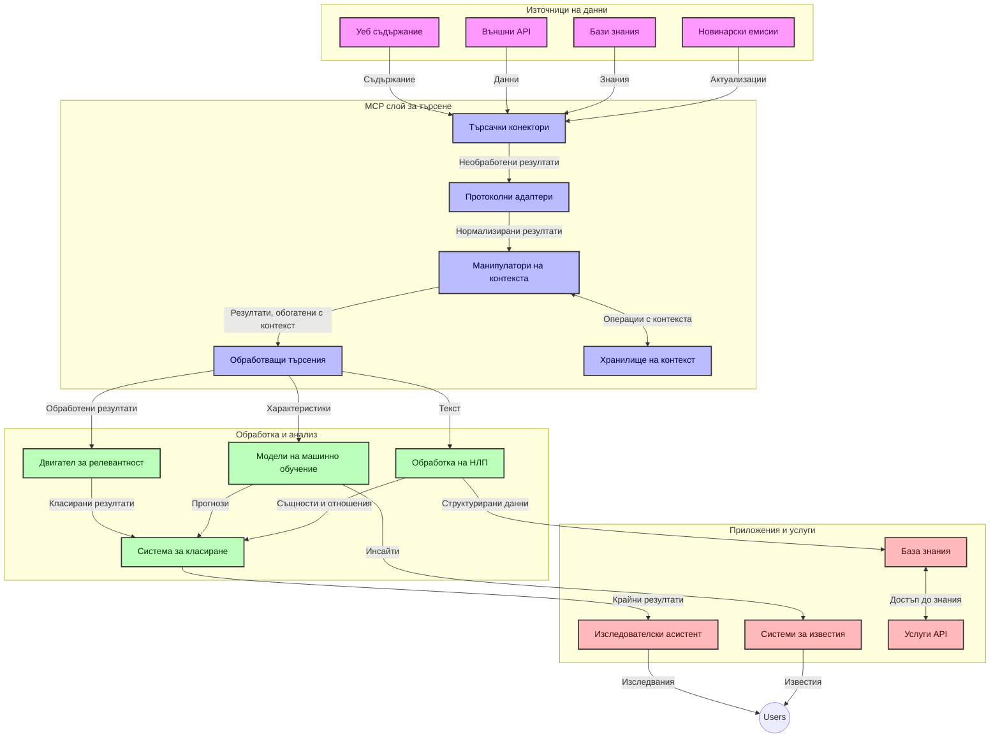
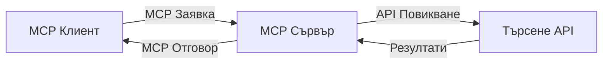
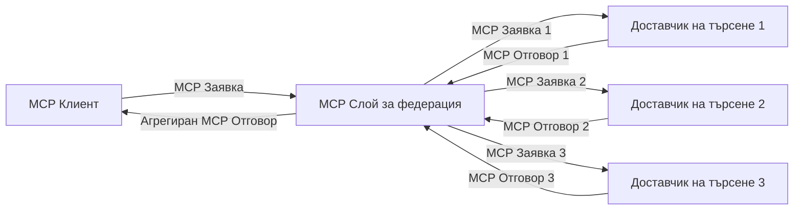
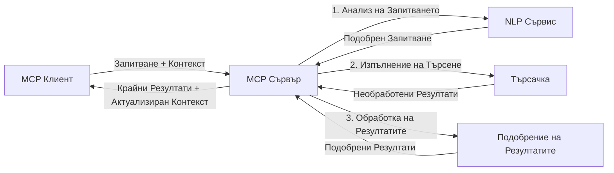

# Протокол за Контекст на Модела за Търсене в Уеб в Реално Време

## Преглед

Търсенето в уеб в реално време се превърна в съществена част от днешната информационно ориентирана среда, където приложенията се нуждаят от незабавен достъп до актуална информация в интернет, за да предоставят релевантни и навременни отговори. Протоколът за Контекст на Модела (MCP) представлява значителен напредък в оптимизирането на тези процеси за търсене в реално време, подобрявайки ефективността на търсенето, поддържането на контекстуалната цялост и общата производителност на системата.

Този модул изследва как MCP трансформира търсенето в уеб в реално време чрез предоставяне на стандартизиран подход за управление на контекста между AI модели, търсачки и приложения.

### Какво ще научите

В това изчерпателно ръководство ще откриете:

- Как MCP създава безпроблемна връзка между AI модели и възможностите за търсене в уеб в реално време
- Архитектурни модели за реализиране на ефективни и мащабируеми решения за търсене с MCP
- Техники за запазване на контекста на търсенето през множество заявки и взаимодействия
- Практически кодови реализации на Python и JavaScript за различни сценарии на търсене
- Методи за балансиране на релевантността, актуалността и производителността в търсещи системи захранвани от MCP

## Въведение в Търсенето в Уеб в Реално Време

Търсенето в уеб в реално време е технологичен подход, който позволява непрекъснато заявяване, обработка и анализ на уеб-базирана информация в момента на нейното публикуване или обновяване, позволявайки на системите да предоставят свежа и релевантна информация с минимална забавяне. За разлика от традиционните търсещи системи, които работят върху индексирани данни, които могат да бъдат на часове или дни, търсенето в реално време обработва живи данни от уеб, доставяйки прозрения и информация, които отразяват текущото състояние на онлайн съдържанието.

### Основни концепции на търсенето в уеб в реално време:

- **Непрекъсната обработка на заявки**: Търсещите заявки се обработват спрямо постоянно обновяващи се източници на данни
- **Приоритет на актуалността**: Системите са проектирани да отдават приоритет на свежата информация
- **Баланс между релевантност и актуалност**: Поддържане на равновесие между релевантност и актуалност
- **Мащабируема архитектура**: Системите трябва да обработват променливо натоварване от заявки и обеми данни
- **Контекстуално разбиране**: Поддържането на контекста на потребителя през итерациите на търсене е ключово за осмислени резултати
- **Динамично преформулиране на заявки**: Адаптивно изменяне на заявките според контекста и предишни резултати
- **Интеграция на множество източници**: Комбиниране на резултати от множество доставчици на търсене и уеб източници
- **Семантично разбиране**: Обработка на заявки и съдържание въз основа на смисъл, а не само ключови думи
- **Ранжиране в реално време**: Непрекъснато приспособяване на рангирането на резултатите при наличие на нова информация

### Протоколът за Контекст на Модела и Търсенето в Уеб в Реално Време

Протоколът за Контекст на Модела (MCP) се справя с няколко критични предизвикателства в среди за търсене в уеб в реално време:

1. **Запазване на контекста на търсенето**: MCP стандартизира начина, по който контекстът се поддържа между разпределени компоненти за търсене, осигурявайки, че AI моделите и процесинговите възли имат достъп до релевантната история на заявките и потребителските предпочитания.

2. **Ефективно управление на заявките**: Чрез предоставяне на структуриран механизъм за предаване на контекст, MCP намалява натоварването от повтаряне на контекста при всяка итерация на търсенето.

3. **Интероперативност**: MCP създава общ език за споделяне на контекст между разнообразни технологии за търсене и AI модели, позволявайки по-гъвкави и разширяеми архитектури.

4. **Оптимизиран за търсене контекст**: Реализирания MCP може да приоритизира кои елементи от контекста са най-релевантни за ефективно търсене, оптимизирайки производителността и точността.

5. **Адаптивна обработка на търсенето**: С правилно управление на контекста чрез MCP, търсещите системи могат динамично да настройват обработката според променящите се нужди на потребителя и информационните пейзажи.

В съвременни приложения, вариращи от агрегиране на новини до изследователски асистенти, интеграцията на MCP с уеб търсещи технологии позволява по-интелигентно, контекстно осъзнато търсене, което може да предостави все по-релевантни резултати с продължаващите взаимодействия на потребителя.

## Обучителни цели

Към края на този урок ще можете да:

- Разберете основите на търсенето в уеб в реално време и предизвикателствата му в съвременните приложения
- Обясните как Протоколът за Контекст на Модела (MCP) подобрява възможностите за търсене в реално време
- Реализирате решения за търсене базирани на MCP с помощта на популярни рамки и API-та
- Проектирате и внедрите мащабируеми, високопроизводителни архитектури за търсене с MCP
- Приложите концепции на MCP към различни случаи на употреба, включително семантично търсене, изследователска помощ и AI-усилено сърфиране
- Оцените нововъзникващи тенденции и бъдещи иновации в MCP-базираните технологии за търсене
- Разработите контекстно осъзнати търсещи системи, които се учат от взаимодействията на потребителя
- Интегрирате възможности за уеб търсене в AI асистенти, използвайки стандартизирани MCP протоколи
- Създадете многоетапни търсещи потоци, които постепенно усъвършенстват резултатите въз основа на контекст
- Оптимизирате производителността на търсенето, като същевременно поддържате обширна осведоменост за контекста

### Дефиниция и Значение

Търсенето в уеб в реално време включва непрекъснато заявяване, извличане и доставяне на уеб-базирана информация с минимално забавяне. За разлика от традиционните търсачки, които периодично обхождат и индексират уеб, търсенето в реално време има за цел да извежда информация веднага щом стане достъпна, осигурявайки незабавен достъп до най-актуалното съдържание.

Ключови характеристики на търсенето в уеб в реално време включват:

- **Свежест**: Приоритизиране на наскоро публикувано съдържание и обновления
- **Непрекъсната обработка**: Постоянно наблюдение за нова информация
- **Адаптация на заявките**: Прецизиране на търсещите заявки въз основа на контекст и обратна връзка
- **Незабавна доставка**: Осигуряване на резултати от търсенето с минимално забавяне
- **Запазване на контекста**: Изграждане върху предишни заявки за повишена релевантност

### Предизвикателства при традиционното уеб търсене

Традиционните методи за уеб търсене се сблъскват с няколко ограничения при прилагане в реалновременни сценарии:

1. **Фрагментация на контекста**: Трудност при поддържането на контекст на търсенето през множество заявки
2. **Свежест на информацията**: Предизвикателства при достъпа и приоритизирането на най-актуалната информация
3. **Сложност при интеграцията**: Проблеми с интероперативността между търсещите системи и приложенията
4. **Проблеми със забавянето**: Балансиране на обширното търсене с изисквания за време за реакция
5. **Настройка на релевантност**: Осигуряване на точност и релевантност при приоритизиране на актуалността

## Разбиране на Протокола за Контекст на Модела (MCP) за Търсене

### Какво е MCP в контекста на търсенето?

Протоколът за Контекст на Модела (MCP) е стандартизиран комуникационен протокол, проектиран да улеснява ефективното взаимодействие между AI модели и приложения. В контекста на търсенето в уеб в реално време, MCP предоставя рамка за:

- Запазване на контекста на търсенето през серия от заявки
- Стандартизиране на формати за заявки и резултати от търсене
- Оптимизиране на предаването на параметри и резултати от търсенето
- Подобряване на комуникацията между модел и търсеща машина

### Основни компоненти и архитектура

Архитектурата на MCP за търсене в уеб в реално време се състои от няколко ключови компонента:

1. **Мениджъри на контекст на заявката**: Управляват и поддържат контекста на търсенето през множество заявки
2. **Процесори на търсене**: Обработват входящите заявки за търсене с използване на контекстно-осъзнати техники
3. **Адаптери на протокола**: Конвертират между различни API-та за търсене, пазейки контекста
4. **Магазин за контекст**: Ефективно съхранява и извлича историята на търсенията и предпочитанията
5. **Конектори за търсене**: Свързват се с различни търсещи машини и уеб API-та



### Как MCP подобрява търсенето в уеб в реално време

MCP се справя с предизвикателствата на традиционното уеб търсене чрез:

- **Контекстуална непрекъснатост**: Поддържане на връзки между заявки през цялата сесия на търсене
- **Оптимизирано предаване**: Намаляване на излишъка в параметрите на търсенето чрез интелигентно управление на контекста
- **Стандартизирани интерфейси**: Осигуряване на консистентни API-та за търсещите компоненти
- **Намалена латентност**: Минимизиране на натоварването от обработка чрез ефективно управление на контекста
- **Подобрена релевантност**: Подобряване на релевантността на търсенето чрез запазване на намерението на потребителя през множество заявки

## Интеграция и реализация

Системите за търсене в уеб в реално време изискват внимателен архитектурен дизайн и реализация, за да поддържат както производителността, така и контекстуалната цялост. Протоколът за Контекст на Модела предлага стандартизиран подход за интеграция на AI модели и търсещи технологии, позволявайки по-сложни, контекстно-осъзнати търсещи потоци.

### Преглед на интеграцията на MCP в архитектури за търсене

Реализацията на MCP в среди за търсене в уеб в реално време включва няколко ключови аспекта:

1. **Сериализация на контекст на търсенето**: MCP предоставя ефективни механизми за кодиране на контекстуална информация в заявките за търсене, осигурявайки, че важният контекст следва заявката през целия процес. Това включва стандартизирани формати за сериализация, оптимизирани за метаданни, свързани с търсенето.

2. **Състояниево базирана обработка на търсене**: MCP позволява по-интелигентна състояниева обработка, като поддържа консистентно представяне на контекста през итерациите на търсенето. Това е особено ценно в многостепенни търсещи потоци, където усъвършенстването на контекста подобрява резултатите.

3. **Разширяване и усъвършенстване на заявки**: Реализациите на MCP могат да улеснят усъвършенствано разширяване и преработка на заявките въз основа на натрупан контекст, позволявайки все по-релевантни резултати с напредването на сесията на търсене.

4. **Кеширане на резултати и приоритизация**: Чрез стандартизиране на управлението на контекста, MCP подпомага управлението на кеша с резултати и приоритизацията, позволявайки на компонентите да се адаптират според развиващия се контекст на търсенето.

5. **Федерация и агрегиране на търсене**: MCP улеснява по-сложна федерация на търсене през множество бекенди чрез предоставяне на структурирани представяния на контекста, позволяващи по-смислено агрегиране на резултати от разнообразни източници.

Реализацията на MCP в различни търсещи технологии създава унифициран подход за управление на контекста, намалявайки нуждата от персонализиран интеграционен код, като същевременно подобрява способността на системата да поддържа смислен контекст по време на еволюцията на заявките за търсене.

### MCP в различни реализации на търсене в уеб

Тези примери следват текущата спецификация на MCP, която се фокусира върху JSON-RPC базиран протокол с различни транспортни механизми. Кодът показва как можете да реализирате персонализирани търсещи интеграции, като поддържате пълна съвместимост с протокола MCP.


<details>
<summary>Реализация на Python с универсален Search API</summary>

```python
import asyncio
import json
import aiohttp
from typing import Dict, Any, Optional, List
from contextlib import asynccontextmanager
from collections.abc import AsyncIterator

# Импортиране на стандартни MCP библиотеки
from mcp.client.session import ClientSession
from mcp.client.streamable_http import streamablehttp_client
from mcp.types import TextContent, CreateMessageRequestParams, CreateMessageResult
from mcp.server.fastmcp import FastMCP

# Създаване на FastMCP сървър за уеб търсене
search_server = FastMCP("WebSearch")

# Клас за обработка на операции по уеб търсене
class WebSearchHandler:
    def __init__(self, api_endpoint: str, api_key: str):
        self.api_endpoint = api_endpoint
        self.api_key = api_key
        self.session = None
        
    async def initialize(self):
        """Initialize the HTTP session"""
        self.session = aiohttp.ClientSession(
            headers={"Authorization": f"Bearer {self.api_key}"}
        )
    
    async def close(self):
        """Close the HTTP session"""
        if self.session:
            await self.session.close()
            
    async def perform_search(self, query: str, max_results: int = 5, 
                           include_domains: List[str] = None, 
                           exclude_domains: List[str] = None,
                           time_period: str = "any") -> Dict[str, Any]:
        """Perform web search using the search API"""
        # Конструиране на параметри за търсене
        search_params = {
            "q": query,
            "limit": max_results,
            "time": time_period
        }
        
        if include_domains:
            search_params["site"] = ",".join(include_domains)
            
        if exclude_domains:
            search_params["exclude_site"] = ",".join(exclude_domains)
        
        # Извършване на заявка за търсене
        try:
            async with self.session.get(
                self.api_endpoint,
                params=search_params
            ) as response:
                if response.status != 200:
                    error_text = await response.text()
                    raise Exception(f"Search API error: {response.status} - {error_text}")
                
                search_data = await response.json()
                
                # Преобразуване на API-специфичен отговор в стандартен формат
                results = []
                for item in search_data.get("results", []):
                    results.append({
                        "title": item.get("title", ""),
                        "url": item.get("url", ""),
                        "snippet": item.get("snippet", ""),
                        "date": item.get("published_date", ""),
                        "source": item.get("source", "")
                    })
                
                return {
                    "query": query,
                    "totalResults": len(results),
                    "results": results
                }
        except Exception as e:
            print(f"Search API request error: {e}")
            raise

# Инициализация на обработващия търсенето
search_handler = WebSearchHandler(
    api_endpoint="https://api.search-service.example/search",
    api_key="your-api-key-here"
)

# Настройка на жизнения цикъл за управление на обработващия търсенето
@asyncio.asynccontextmanager
async def app_lifespan(server: FastMCP):
    """Manage application lifecycle"""
    await search_handler.initialize()
    try:
        yield {"search_handler": search_handler}
    finally:
        await search_handler.close()

# Задаване на жизнения цикъл на сървъра
search_server = FastMCP("WebSearch", lifespan=app_lifespan)

# Регистриране на инструмент за уеб търсене
@search_server.tool()
async def web_search(query: str, max_results: int = 5, 
                   include_domains: List[str] = None,
                   exclude_domains: List[str] = None,
                   time_period: str = "any") -> Dict[str, Any]:
    """
    Search the web for information
    
    Args:
        query: The search query
        max_results: Maximum number of results to return (default: 5)
        include_domains: List of domains to include in search results
        exclude_domains: List of domains to exclude from search results
        time_period: Time period for results ("day", "week", "month", "any")
        
    Returns:
        Dictionary containing search results
    """
    ctx = search_server.get_context()
    search_handler = ctx.request_context.lifespan_context["search_handler"]
    
    results = await search_handler.perform_search(
        query=query,
        max_results=max_results,
        include_domains=include_domains,
        exclude_domains=exclude_domains,
        time_period=time_period
    )
    
    return results

# Пример за използване от клиент
async def client_example():
    # Свързване със сървъра за търсене чрез Streamable HTTP транспорт
    async with streamablehttp_client("http://localhost:8000/mcp") as (read, write, _):
        async with ClientSession(read, write) as session:
            # Инициализация на връзката
            await session.initialize()
            
            # Извикване на инструмента web_search
            search_results = await session.call_tool(
                "web_search", 
                {
                    "query": "latest developments in AI and Model Context Protocol",
                    "max_results": 5,
                    "time_period": "day",
                    "include_domains": ["github.com", "microsoft.com"]
                }
            )
            
            print(f"Search results: {search_results}")

# Пример за изпълнение на сървър
if __name__ == "__main__":
    # Стартиране на сървъра с Streamable HTTP транспорт
    search_server.run(transport="streamable-http")
```
</details> 

<details>
<summary>Реализация на JavaScript с браузър-базирано търсене</summary>


```javascript
// Имплементация на MCP сървър за уеб търсене
import { McpServer, ResourceTemplate } from '@modelcontextprotocol/sdk/server/mcp.js';
import { StreamableHTTPServerTransport } from '@modelcontextprotocol/sdk/server/streamableHttp.js';
import { z } from 'zod';

// Създаване на MCP сървър за уеб търсене
const searchServer = new McpServer({
    name: "BrowserSearch",
    description: "A server that provides web search capabilities"
});

// Клас за търсеща услуга
class SearchService {
    constructor(searchApiUrl, apiKey) {
        this.searchApiUrl = searchApiUrl;
        this.apiKey = apiKey;
    }

    async performSearch(parameters) {
        const {
            query = '',
            maxResults = 5,
            includeDomains = [],
            excludeDomains = [],
            timePeriod = 'any'
        } = parameters;
        
        // Конструиране на URL за търсене с параметри
        const url = new URL(this.searchApiUrl);
        url.searchParams.append('q', query);
        url.searchParams.append('limit', maxResults);
        url.searchParams.append('time', timePeriod);
        
        if (includeDomains.length > 0) {
            url.searchParams.append('site', includeDomains.join(','));
        }
        
        if (excludeDomains.length > 0) {
            url.searchParams.append('exclude_site', excludeDomains.join(','));
        }
        
        try {
            const response = await fetch(url.toString(), {
                method: 'GET',
                headers: {
                    'Authorization': `Bearer ${this.apiKey}`,
                    'Content-Type': 'application/json'
                }
            });
            
            if (!response.ok) {
                const errorText = await response.text();
                throw new Error(`Search API error: ${response.status} - ${errorText}`);
            }
            
            const searchData = await response.json();
            
            // Преобразуване на отговор специфичен за API в стандартен формат
            const results = searchData.results?.map(item => ({
                title: item.title || '',
                url: item.url || '',
                snippet: item.snippet || '',
                date: item.published_date || '',
                source: item.source || ''
            })) || [];
            
            return {
                query,
                totalResults: results.length,
                results
            };
        } catch (error) {
            console.error('Search API request error:', error);
            throw error;
        }
    }
}

// Инициализиране на търсещата услуга
const searchService = new SearchService(
    'https://api.search-service.example/search',
    'your-api-key-here'
);

// Настройка на доставчика на контекст за сървъра
searchServer.setContextProvider(() => {
    return {
        searchService
    };
});

// Регистриране на инструмент за уеб търсене
searchServer.tool({
    name: 'web_search',
    description: 'Search the web for information',
    parameters: {
        type: 'object',
        properties: {
            query: {
                type: 'string',
                description: 'The search query'
            },
            maxResults: {
                type: 'integer',
                description: 'Maximum number of results to return',
                default: 5
            },
            includeDomains: {
                type: 'array',
                items: { type: 'string' },
                description: 'List of domains to include in search results'
            },
            excludeDomains: {
                type: 'array',
                items: { type: 'string' },
                description: 'List of domains to exclude from search results'
            },
            timePeriod: {
                type: 'string',
                description: 'Time period for results',
                enum: ['day', 'week', 'month', 'any'],
                default: 'any'
            }
        },
        required: ['query']
    },
    handler: async (params, context) => {
        const { searchService } = context;
        return await searchService.performSearch(params);
    }
});

// Примерен клиентски код за свързване със сървъра за търсене
import { Client } from '@modelcontextprotocol/sdk/client/index.js';
import { StreamableHTTPClientTransport } from '@modelcontextprotocol/sdk/client/streamableHttp.js';

async function connectToSearchServer() {
    // Свързване със сървъра за търсене
    const transport = new StreamableHTTPClientTransport(
        new URL('http://localhost:8000/mcp')
    );
    
    const client = new Client({
        name: 'search-client',
        version: '1.0.0'
    });
    
    await client.connect(transport);
    
    // Изпълнение на търсещия инструмент
    const searchResults = await client.callTool({
        name: 'web_search',
        arguments: {
            query: 'Model Context Protocol implementation examples',
            maxResults: 10,
            timePeriod: 'week',
            includeDomains: ['github.com', 'docs.microsoft.com']
        }
    });
    
    console.log('Search results:', searchResults);
    
    // Почистване
    await client.disconnect();
}

// Стартиране на сървъра
const transport = new StreamableHTTPServerTransport();
await searchServer.connect(transport);
console.log('Search server running at http://localhost:8000/mcp');

// В отделен процес или след като сървърът е стартиран
// connectToSearchServer().catch(console.error);
```
</details> 


## Отказ от Отговорност за Кодови Примери

> **Важно Забележка**: Кодови примери по-долу демонстрират интеграцията на Протокола за Контекст на Модела (MCP) с функционалност за уеб търсене. Въпреки че следват модели и структури на официалните MCP SDK, те са опростени за образователни цели.
> 
> Тези примери показват:
> 
> 1. **Реализация на Python**: Имплементация на FastMCP сървър, която предоставя инструмент за уеб търсене и се свързва с външен търсещ API. Този пример демонстрира правилното управление на жизнения цикъл, обработка на контекста и реализация на инструменти, следвайки моделите на [официалния MCP Python SDK](https://github.com/modelcontextprotocol/python-sdk). Сървърът използва препоръчителния Streamable HTTP транспорт, който е заместил по-старата SSE транспортна технология за производствени среди.
> 
> 2. **Реализация на JavaScript**: Имплементация на TypeScript/JavaScript с използване на модела FastMCP от [официалния MCP TypeScript SDK](https://github.com/modelcontextprotocol/typescript-sdk), за създаване на търсещ сървър с правилни дефиниции на инструменти и клиентски връзки. Следва последните препоръчани модели за управление на сесии и запазване на контекста.
> 
> Тези примери биха изисквали допълнително обработване на грешки, аутентификация и специфичен код за интеграция на API при използване в продукционни системи. Показаните крайни точки на търсещото API (`https://api.search-service.example/search`) са заместители и трябва да бъдат заменени с реални крайни точки на търсещи услуги.
> 
> За пълни детайли на реализацията и най-актуалните подходи,
> вижте [официалната спецификация на MCP](https://modelcontextprotocol.io/specification/2026-07-28/)
> и документацията на SDK.

## Основни концепции

### Рамката на Протокола за Контекст на Модела (MCP)

В своята основа, Протоколът за Контекст на Модела предоставя стандартизиран начин за обмен на контекст между AI модели, приложения и услуги. В търсенето в уеб в реално време тази рамка е от съществено значение за създаване на логични, многоетапни опити за търсене. Ключови компоненти включват:

1. **Клиент-сървър архитектура**: MCP установява ясна разделителна линия между търсещи клиенти (заявители) и търсещи сървъри (доставчици), позволявайки гъвкави модели на внедряване.

2. **JSON-RPC комуникация**: Протоколът използва JSON-RPC за обмен на съобщения, правейки го съвместим с уеб технологии и лесен за реализиране на различни платформи.

3. **Управление на контекста**: MCP дефинира структурирани методи за поддържане, обновяване и използване на контекст на търсенето през множество взаимодействия.

4. **Дефиниции на инструменти**: Възможностите за търсене се излагат като стандартизирани инструменти с добре дефинирани параметри и стойности за връщане.

5. **Поддръжка на стрийминг**: Протоколът поддържа потокови резултати, което е необходимо за търсене в реално време, при което резултатите могат да пристигат последователно.

### Модели на интеграция за уеб търсене

При интегриране на MCP с уеб търсене се очертават няколко модела:

#### 1. Директна интеграция с доставчик на търсене



В този модел MCP сървърът директно комуникира с един или повече API за търсене, превеждайки MCP заявки в API-специфични повиквания и форматирайки резултатите като MCP отговори.

#### 2. Федеративно търсене с запазване на контекста



Този модел разпределя търсещите заявки между множество MCP-съвместими доставчици на търсене, всеки от които евентуално е специализиран в различен тип съдържание или възможности за търсене, като същевременно поддържа единен контекст.

#### 3. Контекстно подобрена верига за търсене



В този модел процесът на търсене е разпределен в няколко етапа, като контекстът се обогатява на всяка стъпка, което води до постепенно по-релевантни резултати.

### Компоненти на контекста за търсене

В MCP-базираното уеб търсене контекстът обикновено включва:

- **История на заявките**: Предишни търсещи заявки в сесията
- **Предпочитания на потребителя**: Език, регион, настройки за безопасно търсене
- **История на взаимодействия**: Кои резултати са били кликнати, време прекарано на резултатите
- **Параметри на търсенето**: Филтри, редове на сортиране и други модификатори на търсенето
- **Знания по предмета**: Контекст, специфичен за темата на търсенето
- **Временен контекст**: Фактори на релевантност базирани на време
- **Предпочитания за източници**: Доверени или предпочитани информационни източници

## Сценарии на употреба и приложения

### Изследване и събиране на информация

MCP подобрява изследователските работни процеси чрез:

- Запазване на контекста на изследването през търсещите сесии
- Позволяване на по-усъвършенствани и контекстуално релевантни заявки
- Поддръжка на федерация на търсене от множество източници
- Улесняване на извличането на знания от резултатите от търсенето

### Мониторинг на новини и тенденции в реално време

Търсенето с MCP осигурява предимства за мониторинг на новини:

- Почти в реално време откриване на нововъзникващи новинарски истории
- Контекстуално филтриране на релевантна информация
- Проследяване на теми и обекти в множество източници
- Персонализирани новинарски сигнали въз основа на контекста на потребителя

### AI-усилено сърфиране и изследване

MCP създава нови възможности за AI-усилено сърфиране:

- Контекстно търсещи предложения въз основа на текущата дейност в браузъра
- Безпроблемна интеграция на уеб търсене с асистенти захранвани от големи езикови модели (LLM)
- Многоетапно усъвършенстване на търсенето с поддържан контекст
- Подобрена проверка на факти и верификация на информация

## Бъдещи тенденции и иновации

### Еволюция на MCP в уеб търсенето

В бъдеще се очаква MCP да се развива, за да отговори на:


- **Мултимодално търсене**: Интегриране на търсене по текст, изображение, аудио и видео с запазен контекст
- **Децентрализирано търсене**: Поддръжка на разпределени и федерални екосистеми за търсене
- **Поверителност на търсенето**: Механизми за запазване на поверителността със съобразяване на контекста
- **Разбиране на заявки**: Дълбок семантичен анализ на заявки за търсене на естествен език

### Потенциални технологични постижения

Нови технологии, които ще оформят бъдещето на търсенето MCP:

1. **Невронни архитектури за търсене**: Системи за търсене, базирани на вграждания, оптимизирани за MCP
2. **Персонализиран контекст на търсене**: Изучаване на индивидуалните модели за търсене на потребителя във времето
3. **Интеграция на графове на знанието**: Контекстуално търсене, подобрено чрез графове на знанието от специфични домейни
4. **Крос-модален контекст**: Поддържане на контекст в различни модалности на търсене

## Практически упражнения

### Упражнение 1: Създаване на базов MCP търсач-пайплайн

В това упражнение ще научите как да:
- Конфигурирате базова среда за търсене MCP
- Имплементирате контекстуални обработващи модули за уеб търсене
- Тествате и валидирате запазването на контекста през различни итерации на търсене

### Упражнение 2: Създаване на изследователски помощник с MCP търсене

Създайте цялостно приложение, което:
- Обработва изследователски въпроси на естествен език
- Извършва контекстуално осъзнавано уеб търсене
- Синтезира информация от множество източници
- Представя организирани изследователски резултати

### Упражнение 3: Имплементиране на федерация на търсене от множество източници с MCP

Напреднало упражнение, което включва:
- Контекстуално насочване на заявки към множество търсачки
- Рангиране и агрегиране на резултати
- Контекстуално дедиупликация на резултатите от търсене
- Обработка на метаданни, специфични за източника

## Допълнителни ресурси

- [Спецификация на протокола Model Context](https://modelcontextprotocol.io/specification/2026-07-28/) - Официална спецификация MCP и подробна документация на протокола
- [Документация на протокола Model Context](https://modelcontextprotocol.io/) - Подробни уроци и ръководства за имплементация
- [MCP Python SDK](https://github.com/modelcontextprotocol/python-sdk) - Официална Python имплементация на MCP протокола
- [MCP TypeScript SDK](https://github.com/modelcontextprotocol/typescript-sdk) - Официална TypeScript имплементация на MCP протокола
- [MCP референтни сървъри](https://github.com/modelcontextprotocol/servers) - Референтни имплементации на MCP сървъри
- [Документация на Bing Web Search API](https://learn.microsoft.com/en-us/bing/search-apis/bing-web-search/overview) - Уеб търсещ API на Microsoft
- [Google Custom Search JSON API](https://developers.google.com/custom-search/v1/overview) - Програмируемият търсещ двигател на Google
- [Документация на SerpAPI](https://serpapi.com/search-api) - API за страници с резултати от търсачки
- [Документация на Meilisearch](https://www.meilisearch.com/docs) - Отворен източник за търсещ двигател
- [Документация на Elasticsearch](https://www.elastic.co/guide/index.html) - Разпределен търсещ и аналитичен двигател
- [Документация на LangChain](https://python.langchain.com/docs/get_started/introduction) - Създаване на приложения с LLM

## Очаквани резултати

След завършване на този модул ще можете:

- Да разбирате основите на уеб търсенето в реално време и предизвикателствата, свързани с него
- Да обясните как Model Context Protocol (MCP) подобрява възможностите за уеб търсене в реално време
- Да имплементирате търсещи решения, базирани на MCP, използвайки популярни рамки и API-та
- Да проектирате и внедрите мащабируеми и високоефективни архитектури за търсене с MCP
- Да прилагате концепции на MCP за различни случаи на употреба, включително семантично търсене, изследователска помощ и AI-усъвършенствано сърфиране
- Да оценявате нововъзникващи тенденции и бъдещи иновации в технологиите за търсене, базирани на MCP


### Съображения за доверие и безопасност

При имплементирането на решения за уеб търсене, базирани на MCP, имайте предвид следните важни принципи от спецификацията MCP:

1. **Съгласие и контрол на потребителя**: Потребителите трябва изрично да дадат съгласие и да разбират всички операции и достъп до данни. Това е особено важно при уеб търсене, което може да осъществява достъп до външни източници на данни.

2. **Поверителност на данните**: Осигурете подходящо третиране на заявките за търсене и резултатите, особено когато те може да съдържат чувствителна информация. Прилагайте контрол на достъпа за защита на потребителските данни.

3. **Безопасност на инструментите**: Имплементирайте подходяща авторизация и валидиране за търсещите инструменти, тъй като те представляват потенциални рискове за сигурността чрез изпълнение на произволен код. Описанията на поведението на инструментите трябва да се считат за ненадеждни, освен ако не са получени от доверен сървър.

4. **Ясна документация**: Осигурете ясна документация за възможностите, ограниченията и съображенията за сигурност на вашата имплементация за търсене, базирана на MCP, следвайки указанията от спецификацията MCP.

5. **Надеждни потоци за съгласие**: Създайте надеждни потоци за съгласие и авторизация, които ясно обясняват какво прави всеки инструмент преди да му бъде разрешено да се използва, особено за инструменти, които взаимодействат с външни уеб ресурси.

За пълни подробности относно безопасността и съображенията за доверие на MCP, вижте
[официалната документация](https://modelcontextprotocol.io/specification/2026-07-28/basic/security_best_practices).

## Какво следва

- [5.12 Автентикация чрез Entra ID за сървъри на Model Context Protocol](../mcp-security-entra/README.md)

---

<!-- CO-OP TRANSLATOR DISCLAIMER START -->
**Отказ от отговорност**:
Този документ е преведен с помощта на AI преводачески услуга [Co-op Translator](https://github.com/Azure/co-op-translator). Въпреки че се стремим към точност, моля имайте предвид, че автоматизираните преводи могат да съдържат грешки или неточности. Оригиналният документ на неговия роден език трябва да се счита за авторитетен източник. За критична информация се препоръчва професионален човешки превод. Ние не носим отговорност за каквито и да е недоразумения или неправилни тълкувания, произтичащи от използването на този превод.
<!-- CO-OP TRANSLATOR DISCLAIMER END -->