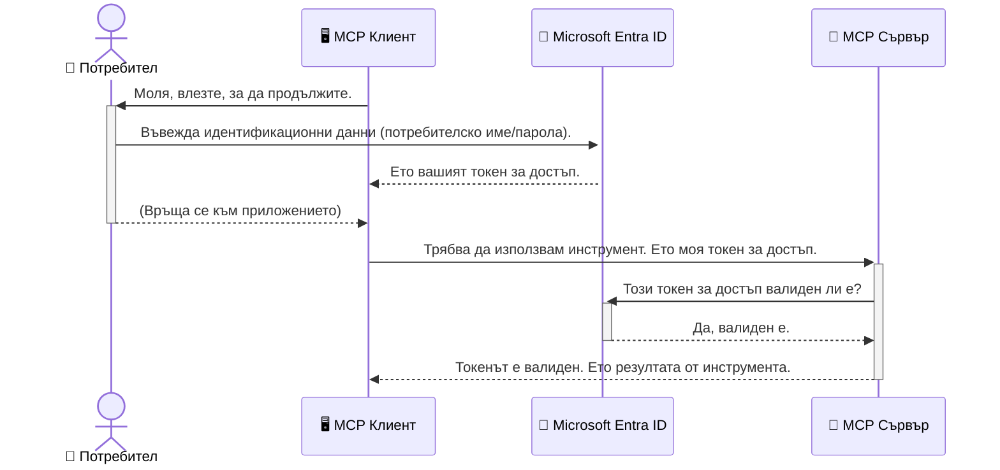

# Защита на AI работни потоци: Автентикация с Entra ID за Model Context Protocol сървъри

> [!NOTE]
> Отдалеченият сървърен код в този урок защитава наследени `/sse` и `/message`
> крайни точки и се насочва към MCP `2025-11-25`. Запазете практиките за идентичност и валидиране на токени,
> но използвайте Streamable HTTP транспорт, съвместим с `2026-07-28`, за новите реализации.


## Въведение
Защитата на вашия Model Context Protocol (MCP) сървър е толкова важна, колкото заключването на входната врата на вашата къща. Оставянето на вашия MCP сървър отворен излага вашите инструменти и данни на неупълномощен достъп, което може да доведе до пробиви в сигурността. Microsoft Entra ID предоставя мощно облачно решение за управление на идентичността и достъпа, което помага да се гарантира, че само упълномощени потребители и приложения могат да взаимодействат с вашия MCP сървър. В този раздел ще научите как да защитите вашите AI работни потоци с помощта на Entra ID автентикация.

## Цели за обучение
Към края на този раздел ще можете:

- Да разберете важността на защитата на MCP сървъри.
- Да обясните основите на Microsoft Entra ID и OAuth 2.0 автентикация.
- Да разпознаете разликата между публични и конфиденциални клиенти.
- Да приложите Entra ID автентикация както в локални (публичен клиент), така и в отдалечени (конфиденциален клиент) MCP сървър сценарии.
- Да приложите най-добрите практики за сигурност при разработване на AI работни потоци.

## Сигурност и MCP

Точно както не бихте оставили входната врата на вашата къща открехната, не трябва да оставяте вашия MCP сървър отворен за достъп на всеки. Защитата на вашите AI работни потоци е жизненоважна за създаването на надеждни, доверени и безопасни приложения. Тази глава ще ви запознае с използването на Microsoft Entra ID за защита на вашите MCP сървъри, като гарантира, че само упълномощени потребители и приложения могат да взаимодействат с вашите инструменти и данни.

## Защо сигурността е важна за MCP сървърите

Представете си, че вашият MCP сървър има инструмент, който може да изпраща имейли или да получава достъп до база данни с клиенти. Несигурен сървър би означавал, че всеки потенциално може да използва този инструмент, което може да доведе до неупълномощен достъп до данни, спам или други злонамерени дейности.

Като внедрите автентикация, вие гарантирате, че всяко искане към вашия сървър е проверено, потвърждавайки идентичността на потребителя или приложението, което прави заявката. Това е първата и най-критична стъпка за защитата на вашите AI работни потоци.

## Въведение в Microsoft Entra ID

[**Microsoft Entra ID**](https://adoption.microsoft.com/microsoft-security/entra/) е облачна услуга за управление на идентичности и достъп. Можете да я разгледате като универсален охранител за вашите приложения. Тя обработва сложния процес на проверка на потребителските идентичности (автентикация) и определяне на това, какво им е разрешено да правят (авторизация).

Използвайки Entra ID, можете да:

- Активирате сигурно влизане за потребителите.
- Защитите API и услуги.
- Управлявате политики за достъп от централен адрес.

За MCP сървърите Entra ID предлага здраво и широко доверено решение за управление на това кой може да използва възможностите на вашия сървър.

---

## Разбиране на магията: Как работи Entra ID автентикацията

Entra ID използва отворени стандарти като **OAuth 2.0** за управление на автентикацията. Макар детайлите да могат да бъдат сложни, основната концепция е проста и може да бъде разбрана чрез аналогия.

### Нежно въведение в OAuth 2.0: Ключът на паркинг слугата

Помислете за OAuth 2.0 като за услуга на паркинг слуга за вашата кола. Когато пристигате в ресторант, не давате на паркинг слугата главния си ключ. Вместо това, вие му предоставяте **ключ за паркинг**, който има ограничени разрешения — може да стартира колата и да заключва вратите, но не може да отвори багажника или жабката.

В тази аналогия:

- **Вие** сте **Потребителят**.
- **Вашата кола** е **MCP сървърът** с неговите ценни инструменти и данни.
- **Паркинг слугата** е **Microsoft Entra ID**.
- **Придружителят за паркинг** е **MCP клиентът** (приложението, което се опитва да достъпи сървъра).
- **Ключът за паркинг** е **Токенът за достъп**.

Токенът за достъп е защитен текстов низ, който MCP клиентът получава от Entra ID след вашето влизане. Клиентът след това подава този токен на MCP сървъра при всяка заявка. Сървърът може да провери токена, за да се увери, че заявката е легитимна и клиентът има необходимите разрешения, всичко това без никога да трябва да обработва вашите действителни идентификационни данни (като паролата ви).

### Поток на автентикация

Ето как протича процесът на практика:



### Запознаване с Microsoft Authentication Library (MSAL)

Преди да се потопим в кода, важно е да представим ключов компонент, който ще видите в примерите: **Microsoft Authentication Library (MSAL)**.

MSAL е библиотека, разработена от Microsoft, която улеснява много разработчиците при управлението на автентикацията. Вместо да пишете целия сложен код за обработка на защитни токени, управление на влизане и обновяване на сесии, MSAL извършва тежката работа.

Използването на библиотека като MSAL е силно препоръчително, защото:

- **Сигурна е:** Изпълнява индустриални стандарти протоколи и най-добри практики за сигурност, намалявайки риска от уязвимости в кода ви.
- **Опростява разработката:** Скрива сложността на OAuth 2.0 и OpenID Connect протоколите, позволявайки ви да добавите здрава автентикация с няколко реда код.
- **Поддържа се:** Microsoft активно поддържа и обновява MSAL, за да се справя с нови заплахи за сигурността и промени в платформите.

MSAL поддържа много езици и рамки за приложения, включително .NET, JavaScript/TypeScript, Python, Java, Go и мобилни платформи като iOS и Android. Това означава, че можете да използвате едни и същи надеждни модели за автентикация във вашия цял технологичен стек.

За да научите повече за MSAL, можете да разгледате официалната [MSAL обзорна документация](https://learn.microsoft.com/entra/identity-platform/msal-overview).

---

## Защита на вашия MCP сървър с Entra ID: Стъпка по стъпка

Сега нека разгледаме как да защитите локален MCP сървър (който комуникира през `stdio`) с помощта на Entra ID. Този пример използва **публичен клиент**, който е подходящ за приложения, работещи на машината на потребителя, като десктоп приложение или локален сървър за разработка.

### Сценарий 1: Защита на локален MCP сървър (с публичен клиент)

В този сценарий ще разгледаме MCP сървър, който работи локално, комуникира през `stdio` и използва Entra ID за автентикация на потребителя преди достъп до инструментите си. Сървърът ще има един инструмент, който извлича информация за профила на потребителя от Microsoft Graph API.

#### 1. Настройване на приложението в Entra ID

Преди да пишете код, трябва да регистрирате приложението си в Microsoft Entra ID. Това информира Entra ID за вашето приложение и му дава разрешение да използва услугата за автентикация.

1. Отидете на **[портала на Microsoft Entra](https://entra.microsoft.com/)**.
2. Отидете в **Регистрация на приложения** и кликнете **Нова регистрация**.
3. Дайте име на приложението си (например "My Local MCP Server").
4. За **Поддържани типове акаунти**, изберете **Акаунти само в този организационен директория**.
5. Можете да оставите **Пренасочващ URI** празен за този пример.
6. Кликнете **Регистрирай**.

След регистрацията си запишете **Application (client) ID** и **Directory (tenant) ID**. Ще ви трябват в кода.

#### 2. Кодът: Разглед

Нека разгледаме ключовите части от кода, които управляват автентикацията. Пълният код за този пример е наличен в папката [Entra ID - Local - WAM](https://github.com/Azure-Samples/mcp-auth-servers/tree/main/src/entra-id-local-wam) на [mcp-auth-servers GitHub хранилището](https://github.com/Azure-Samples/mcp-auth-servers).

**`AuthenticationService.cs`**

Този клас отговаря за взаимодействието с Entra ID.

- **`CreateAsync`**: Този метод инициира `PublicClientApplication` от MSAL (Microsoft Authentication Library). Конфигуриран е с `clientId` и `tenantId` на вашето приложение.
- **`WithBroker`**: Активира използването на брокер (като Windows Web Account Manager), който предоставя по-сигурно и безпроблемно влизане с един акаунт.
- **`AcquireTokenAsync`**: Основният метод. Първо се опитва да вземе токен безшумно (т.е. потребителят няма да се налага да влиза отново, ако вече има валидна сесия). Ако не успее, ще подкани потребителя за интерактивно влизане.

```csharp
// Simplified for clarity
public static async Task<AuthenticationService> CreateAsync(ILogger<AuthenticationService> logger)
{
    var msalClient = PublicClientApplicationBuilder
        .Create(_clientId) // Your Application (client) ID
        .WithAuthority(AadAuthorityAudience.AzureAdMyOrg)
        .WithTenantId(_tenantId) // Your Directory (tenant) ID
        .WithBroker(new BrokerOptions(BrokerOptions.OperatingSystems.Windows))
        .Build();

    // ... cache registration ...

    return new AuthenticationService(logger, msalClient);
}

public async Task<string> AcquireTokenAsync()
{
    try
    {
        // Try silent authentication first
        var accounts = await _msalClient.GetAccountsAsync();
        var account = accounts.FirstOrDefault();

        AuthenticationResult? result = null;

        if (account != null)
        {
            result = await _msalClient.AcquireTokenSilent(_scopes, account).ExecuteAsync();
        }
        else
        {
            // If no account, or silent fails, go interactive
            result = await _msalClient.AcquireTokenInteractive(_scopes).ExecuteAsync();
        }

        return result.AccessToken;
    }
    catch (Exception ex)
    {
        _logger.LogError(ex, "An error occurred while acquiring the token.");
        throw; // Optionally rethrow the exception for higher-level handling
    }
}
```

**`Program.cs`**

Тук е настроен MCP сървърът и е интегрирана услугата за автентикация.

- **`AddSingleton<AuthenticationService>`**: Регистрира `AuthenticationService` в контейнера за dependency injection, за да може да се използва от други части на приложението (като нашия инструмент).
- **`GetUserDetailsFromGraph` инструмент:** Този инструмент изисква инстанция на `AuthenticationService`. Преди да направи нещо, той извиква `authService.AcquireTokenAsync()`, за да получи валиден токен за достъп. Ако автентикацията е успешна, използва токена, за да извика Microsoft Graph API и да вземе подробности за потребителя.

```csharp
// Simplified for clarity
[McpServerTool(Name = "GetUserDetailsFromGraph")]
public static async Task<string> GetUserDetailsFromGraph(
    AuthenticationService authService)
{
    try
    {
        // This will trigger the authentication flow
        var accessToken = await authService.AcquireTokenAsync();

        // Use the token to create a GraphServiceClient
        var graphClient = new GraphServiceClient(
            new BaseBearerTokenAuthenticationProvider(new TokenProvider(authService)));

        var user = await graphClient.Me.GetAsync();

        return System.Text.Json.JsonSerializer.Serialize(user);
    }
    catch (Exception ex)
    {
        return $"Error: {ex.Message}";
    }
}
```

#### 3. Как всичко работи заедно

1. Когато MCP клиентът се опита да използва инструмента `GetUserDetailsFromGraph`, инструментът първо извиква `AcquireTokenAsync`.
2. `AcquireTokenAsync` задейства MSAL библиотеката да провери за валиден токен.
3. Ако токен не е намерен, MSAL чрез брокера подканава потребителя да влезе с Entra ID акаунта си.
4. След като потребителят влезе, Entra ID издава токен за достъп.
5. Инструментът получава токена и го използва за направата на защитено извикване към Microsoft Graph API.
6. Подробностите за потребителя се връщат към MCP клиента.

Този процес гарантира, че само автентикирани потребители могат да използват инструмента, което ефективно защитава вашия локален MCP сървър.

### Сценарий 2: Защита на отдалечен MCP сървър (с конфиденциален клиент)

Когато вашият MCP сървър работи на отдалечена машина (като облачен сървър) и комуникира през протокол като HTTP Streaming, изискванията за сигурност са различни. В този случай трябва да използвате **конфиденциален клиент** и **Authorization Code Flow**. Този метод е по-сигурен, защото тайните на приложението никога не се разкриват на браузъра.

Този пример използва TypeScript базиран MCP сървър, който използва Express.js за обработка на HTTP заявки.

#### 1. Настройване на приложението в Entra ID

Настройката в Entra ID е подобна на тази за публичен клиент, но има една основна разлика: трябва да създадете **клиентска тайна**.

1. Отидете на **[портала на Microsoft Entra](https://entra.microsoft.com/)**.
2. В регистрацията на приложението отидете на таба **Сертификати & тайни**.
3. Кликнете **Нова клиентска тайна**, дайте ѝ описание и натиснете **Добави**.
4. **Важно:** Копирайте стойността на тайната веднага. Няма да имате повторен достъп до нея.
5. Също така трябва да конфигурирате **Пренасочващ URI**. Отидете на таба **Автентикация**, кликнете **Добавяне на платформа**, изберете **Уеб** и въведете пренасочващия URI за вашето приложение (например `http://localhost:3001/auth/callback`).

> **⚠️ Важна бележка за сигурността:** За производствени приложения Microsoft силно препоръчва използването на **автентикация без тайни** като **Управлявана идентичност** или **Workload Identity Federation** вместо клиентски тайни. Клиентските тайни представляват рискове за сигурността, тъй като могат да бъдат разкрити или компрометирани. Управляваните идентичности предоставят по-сигурен подход, като елиминират нуждата от съхранение на идентификационни данни в кода или конфигурацията ви.
>
> За повече информация относно управляваните идентичности и тяхното прилагане, вижте [Обзор на управляваните идентичности за Azure ресурси](https://learn.microsoft.com/entra/identity/managed-identities-azure-resources/overview).

#### 2. Кодът: Разглед

Този пример използва подход базиран на сесии. Когато потребителят се автентикира, сървърът съхранява токена за достъп и токена за обновяване в сесия и дава на потребителя токен за сесия. Този токен за сесия се използва при следващи заявки. Пълният код за примера е наличен в папката [Entra ID - Confidential client](https://github.com/Azure-Samples/mcp-auth-servers/tree/main/src/entra-id-cca-session) на [mcp-auth-servers GitHub хранилището](https://github.com/Azure-Samples/mcp-auth-servers).

**`Server.ts`**

Този файл настройва Express сървъра и MCP транспортния слой.

- **`requireBearerAuth`**: Това е middleware, който защитава крайни точки `/sse` и `/message`. Проверява за валиден bearer токен в `Authorization` хедъра на заявката.
- **`EntraIdServerAuthProvider`**: Този персонализиран клас имплементира интерфейса `McpServerAuthorizationProvider`. Отговаря за управлението на OAuth 2.0 потока.
- **`/auth/callback`**: Тази крайна точка обработва пренасочването от Entra ID след като потребителят е автентикиран. Тя обменя authorization code за токен за достъп и токен за обновяване.

```typescript
// Оптимизирано за яснота
const app = express();
const { server } = createServer();
const provider = new EntraIdServerAuthProvider();

// Защитете SSE крайната точка
app.get("/sse", requireBearerAuth({
  provider,
  requiredScopes: ["User.Read"]
}), async (req, res) => {
  // ... свържете се с транспорта ...
});

// Защитете крайната точка на съобщението
app.post("/message", requireBearerAuth({
  provider,
  requiredScopes: ["User.Read"]
}), async (req, res) => {
  // ... обработете съобщението ...
});

// Обработете обратното извикване на OAuth 2.0
app.get("/auth/callback", (req, res) => {
  provider.handleCallback(req.query.code, req.query.state)
    .then(result => {
      // ... обработете успех или неуспех ...
    });
});
```

**`Tools.ts`**

Този файл дефинира инструментите, които MCP сървърът предоставя. Инструментът `getUserDetails` е подобен на предишния пример, но получава токена за достъп от сесията.

```typescript
// Оптимизирано за яснота
server.setRequestHandler(CallToolRequestSchema, async (request) => {
  const { name } = request.params;
  const context = request.params?.context as { token?: string } | undefined;
  const sessionToken = context?.token;

  if (name === ToolName.GET_USER_DETAILS) {
    if (!sessionToken) {
      throw new AuthenticationError("Authentication token is missing or invalid. Ensure the token is provided in the request context.");
    }

    // Вземете Entra ID токена от сесията
    const tokenData = tokenStore.getToken(sessionToken);
    const entraIdToken = tokenData.accessToken;

    const graphClient = Client.init({
      authProvider: (done) => {
        done(null, entraIdToken);
      }
    });

    const user = await graphClient.api('/me').get();

    // ... върнете детайлите на потребителя ...
  }
});
```

**`auth/EntraIdServerAuthProvider.ts`**

Този клас управлява логиката за:

- Пренасочване на потребителя към страницата за влизане на Entra ID.
- Обмен на authorization code за токен за достъп.
- Съхранение на токените в `tokenStore`.
- Обновяване на токена за достъп, когато изтече.


#### 3. Как всичко работи заедно

1. Когато потребителят за пръв път се опита да се свърже със сървъра MCP, middleware `requireBearerAuth` ще види, че няма валидна сесия и ще го препрати към страницата за вход в Entra ID.
2. Потребителят влиза с профила си в Entra ID.
3. Entra ID пренасочва потребителя обратно към крайна точка `/auth/callback` с код за упълномощаване.
4. Сървърът обменя кода за достъп токен и рефреш токен, съхранява ги и създава сесионен токен, който се изпраща на клиента.
5. Клиентът вече може да използва този сесионен токен в заглавката `Authorization` за всички бъдещи заявки към MCP сървъра.
6. Когато бъде извикан инструментът `getUserDetails`, той използва сесионния токен, за да намери достъпния токен на Entra ID и след това го използва за извикване на Microsoft Graph API.

Този поток е по-сложен от потока за публичен клиент, но е необходим за крайни точки, достъпни в интернет. Тъй като отдалечените MCP сървъри са достъпни през публичния интернет, те изискват по-силни мерки за сигурност, за да се предпазят от неправомерен достъп и потенциални атаки.


## Най-добри практики за сигурност

- **Винаги използвайте HTTPS**: Криптирайте комуникацията между клиента и сървъра, за да защитите токените от прихващане.
- **Прилагайте ролево базиран контрол на достъпа (RBAC)**: Не проверявайте само *дали* потребителят е удостоверен; проверявайте *какво* му е разрешено да прави. Можете да дефинирате роли в Entra ID и да ги проверявате във вашия MCP сървър.
- **Наблюдавайте и одитирайте**: Логирайте всички събития по удостоверяване, за да можете да откривате и реагирате на подозрителна активност.
- **Обработка на лимити за честота и контрол на натоварването**: Microsoft Graph и други API-та прилагат лимити за честота, за да предотвратят злоупотреби. Прилагайте експоненциално отлагане и логика за повторни опити във вашия MCP сървър, за да се справяте плавно с HTTP 429 (Твърде много заявки). Обмислете кеширане на често използвани данни, за да намалите броя на API извикванията.
- **Сигурно съхранение на токени**: Съхранявайте токените за достъп и рефреш токените сигурно. За локални приложения използвайте вградените механизми за сигурно съхранение на системата. За сървърни приложения обмислете използване на криптирано съхранение или услуги за управление на ключове като Azure Key Vault.
- **Обработка на изтичане на токени**: Токените за достъп имат ограничен срок на валидност. Реализирайте автоматично обновяване на токена с помощта на рефреш токени, за да поддържате безпроблемно потребителско изживяване без необходимост от повторно удостоверяване.
- **Обмислете използването на Azure API Management**: Докато внедряването на сигурност директно във вашия MCP сървър ви дава прецизен контрол, шлюзовете за API като Azure API Management могат да се справят с много от тези проблеми със сигурността автоматично, включително удостоверяване, упълномощаване, лимитиране на заявките и наблюдение. Те предоставят централен слой за сигурност между вашите клиенти и MCP сървърите. За повече подробности относно използването на API шлюзове с MCP вижте нашето [Azure API Management Your Auth Gateway For MCP Servers](https://techcommunity.microsoft.com/blog/integrationsonazureblog/azure-api-management-your-auth-gateway-for-mcp-servers/4402690).


## Основни изводи

- Защитата на вашия MCP сървър е от решаващо значение за опазването на данните и инструментите ви.
- Microsoft Entra ID предлага стабилно и мащабируемо решение за удостоверяване и упълномощаване.
- Използвайте **публичен клиент** за локални приложения и **конфиденциален клиент** за отдалечени сървъри.
- **Authorization Code Flow** е най-сигурният вариант за уеб приложения.


## Упражнение

1. Помислете за MCP сървър, който бихте могли да изградите. Би ли бил локален или отдалечен сървър?
2. Въз основа на отговора, бихте ли използвали публичен или конфиденциален клиент?
3. Какво разрешение би поискал вашият MCP сървър за извършване на действия срещу Microsoft Graph?


## Практически упражнения

### Упражнение 1: Регистрирайте приложение в Entra ID
Отидете в портала Microsoft Entra.
Регистрирайте ново приложение за вашия MCP сървър.
Запишете Идентификатора на приложението (client) и Идентификатора на директорията (tenant).

### Упражнение 2: Осигурете локален MCP сървър (публичен клиент)
- Следвайте примерния код за интеграция на MSAL (Microsoft Authentication Library) за удостоверяване на потребителя.
- Тествайте потока на удостоверяване като извикате MCP инструмента, който взема потребителски данни от Microsoft Graph.

### Упражнение 3: Осигурете отдалечен MCP сървър (конфиденциален клиент)
- Регистрирайте конфиденциален клиент в Entra ID и създайте клиентски таен ключ.
- Конфигурирайте вашия Express.js MCP сървър да използва Authorization Code Flow.
- Тествайте защитените крайни точки и потвърдете достъпа с токени.

### Упражнение 4: Прилагане на най-добри практики за сигурност
- Активирайте HTTPS за вашия локален или отдалечен сървър.
- Внедрете ролево базиран контрол на достъпа (RBAC) в логиката на вашия сървър.
- Добавете обработка на изтичане на токени и сигурно съхранение на токени.

## Ресурси

1. **Документация за MSAL общ преглед**  
   Научете как Microsoft Authentication Library (MSAL) осигурява сигурно получаване на токени през различни платформи:  
   [MSAL Overview on Microsoft Learn](https://learn.microsoft.com/en-gb/entra/msal/overview)

2. **GitHub хранилище Azure-Samples/mcp-auth-servers**  
   Референтни реализации на MCP сървъри, демонстриращи потоци на удостоверяване:  
   [Azure-Samples/mcp-auth-servers on GitHub](https://github.com/Azure-Samples/mcp-auth-servers)

3. **Общ преглед на управлявани идентичности за Azure ресурси**  
   Разберете как да елиминирате тайни, използвайки системно- или потребителско възложени управлявани идентичности:  
   [Managed Identities Overview on Microsoft Learn](https://learn.microsoft.com/en-us/entra/identity/managed-identities-azure-resources/)

4. **Azure API Management: Вашият шлюз за удостоверяване за MCP сървъри**  
   Подробен поглед върху използването на APIM като сигурен OAuth2 шлюз за MCP сървъри:  
   [Azure API Management Your Auth Gateway For MCP Servers](https://techcommunity.microsoft.com/blog/integrationsonazureblog/azure-api-management-your-auth-gateway-for-mcp-servers/4402690)

5. **Референции за разрешения на Microsoft Graph**  
   Обстойно изброяване на делегирани и приложни разрешения за Microsoft Graph:  
   [Microsoft Graph Permissions Reference](https://learn.microsoft.com/zh-tw/graph/permissions-reference)


## Постижения в обучението
След завършване на този раздел ще можете да:

- Обясните защо удостоверяването е критично за MCP сървъри и AI работни потоци.
- Настроите и конфигурирате удостоверяване с Entra ID за локални и отдалечени сценарии на MCP сървъри.
- Изберете подходящия тип клиент (публичен или конфиденциален) според разгръщането на вашия сървър.
- Прилагате сигурни практики за писане на код, включително съхранение на токени и ролево базирано упълномощаване.
- Сигурно защитите вашия MCP сървър и неговите инструменти от неоторизиран достъп.

## Какво следва

- [5.13 Протокол за контекст на модел (MCP) интеграция с Microsoft Foundry](../mcp-foundry-agent-integration/README.md)

---

<!-- CO-OP TRANSLATOR DISCLAIMER START -->
**Отказ от отговорност**:
Този документ е преведен с помощта на AI преводачески услуга [Co-op Translator](https://github.com/Azure/co-op-translator). Въпреки че се стремим към точност, моля имайте предвид, че автоматизираните преводи могат да съдържат грешки или неточности. Оригиналният документ на неговия роден език трябва да се счита за авторитетен източник. За критична информация се препоръчва професионален човешки превод. Ние не носим отговорност за каквито и да е недоразумения или неправилни тълкувания, произтичащи от използването на този превод.
<!-- CO-OP TRANSLATOR DISCLAIMER END -->