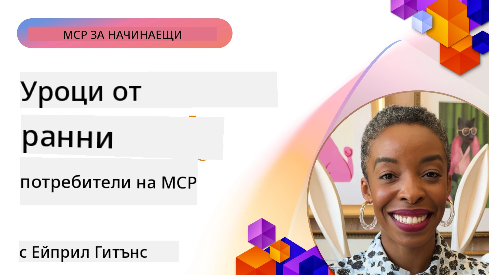

# 🌟 Уроци от Ранни Приемащи

[](https://youtu.be/jds7dSmNptE)

_(Кликнете върху изображението по-горе, за да гледате видеото на този урок)_

## 🎯 Какво покрива този модул

Този модул разглежда как реални организации и разработчици използват протокола Model Context Protocol (MCP), за да решават реални проблеми и да стимулират иновациите. Чрез подробни казуси, практически проекти и примери, ще откриете как MCP позволява сигурна, мащабируема интеграция на AI, която свързва езикови модели, инструменти и корпоративни данни.

### 📚 Вижте MCP в действие

Искате да видите как тези принципи се прилагат към готови за продукция инструменти? Разгледайте нашите [**10 Microsoft MCP сървъра, които трансформират продуктивността на разработчиците**](microsoft-mcp-servers.md), които показват реални Microsoft MCP сървъри, които можете да използвате днес.

## Преглед

Този урок разглежда как ранни приемащи са използвали протокола Model Context Protocol (MCP), за да решават реални предизвикателства и да стимулират иновации в различни индустрии. Чрез подробни казуси и практически проекти, ще видите как MCP позволява стандартизирана, сигурна и мащабируема AI интеграция — свързвайки големи езикови модели, инструменти и корпоративни данни в единна рамка. Ще придобиете практически опит в проектирането и изграждането на решения базирани на MCP, ще се научите от доказани модели за имплементация и ще откриете най-добри практики за внедряване на MCP в продукционни среди. Урокът също така подчертава нововъзникващи тенденции, бъдещи направления и ресурси с отворен код, които ще ви помогнат да останете на върха на MCP технологията и нейния развиващ се екосистема.

## Цели на обучението

- Анализиране на реални MCP реализации в различни индустрии
- Проектиране и изграждане на пълни приложения базирани на MCP
- Изследване на нововъзникващи тенденции и бъдещи направления в MCP технологията
- Прилагане на най-добри практики в реални сценарии на разработка

## Реални MCP реализации

### Казус 1: Автоматизация на клиентската поддръжка в предприятието

Многонационална корпорация внедри MCP-базирано решение за стандартизиране на AI взаимодействията в техните системи за клиентска поддръжка. Това им позволи да:

- Създадат единен интерфейс за множество доставчици на LLM
- Поддържат последователно управление на заявки в различните отдели
- Внедрят устойчиви контроли за сигурност и съответствие
- Лесно превключват между различни AI модели според специфични нужди

**Техническа имплементация:**

```python
# Имплементация на Python MCP сървър за клиентска поддръжка
import logging
import asyncio
from modelcontextprotocol import create_server, ServerConfig
from modelcontextprotocol.server import MCPServer
from modelcontextprotocol.transports import create_http_transport
from modelcontextprotocol.resources import ResourceDefinition
from modelcontextprotocol.prompts import PromptDefinition
from modelcontextprotocol.tool import ToolDefinition

# Конфигуриране на логване
logging.basicConfig(level=logging.INFO)

async def main():
    # Създаване на конфигурация на сървъра
    config = ServerConfig(
        name="Enterprise Customer Support Server",
        version="1.0.0",
        description="MCP server for handling customer support inquiries"
    )
    
    # Инициализиране на MCP сървър
    server = create_server(config)
    
    # Регистрация на ресурси от базата знания
    server.resources.register(
        ResourceDefinition(
            name="customer_kb",
            description="Customer knowledge base documentation"
        ),
        lambda params: get_customer_documentation(params)
    )
    
    # Регистрация на шаблони за подканване
    server.prompts.register(
        PromptDefinition(
            name="support_template",
            description="Templates for customer support responses"
        ),
        lambda params: get_support_templates(params)
    )
    
    # Регистрация на инструменти за поддръжка
    server.tools.register(
        ToolDefinition(
            name="ticketing",
            description="Create and update support tickets"
        ),
        handle_ticketing_operations
    )
    
    # Стартиране на сървъра с HTTP транспорт
    transport = create_http_transport(port=8080)
    await server.run(transport)

if __name__ == "__main__":
    asyncio.run(main())
```

**Резултати:** 30% намаление на разходите за модели, 45% подобрение в консистентността на отговорите и подобрено съответствие в глобалните операции.

### Казус 2: Диагностичен асистент в здравеопазването

Здравна организация разработи MCP инфраструктура за интеграция на множество специализирани медицински AI модели, като същевременно гарантира защитата на чувствителни пациентски данни:

- Безпроблемно превключване между общи и специализирани медицински модели
- Строги контроли за поверителност и следи за одит
- Интеграция със съществуващи системи за електронни здравни досиета (EHR)
- Последователно инженерство на заявки за медицинска терминология

**Техническа имплементация:**

```csharp
// C# MCP host application implementation in healthcare application
using Microsoft.Extensions.DependencyInjection;
using ModelContextProtocol.SDK.Client;
using ModelContextProtocol.SDK.Security;
using ModelContextProtocol.SDK.Resources;

public class DiagnosticAssistant
{
    private readonly MCPHostClient _mcpClient;
    private readonly PatientContext _patientContext;
    
    public DiagnosticAssistant(PatientContext patientContext)
    {
        _patientContext = patientContext;
        
        // Configure MCP client with healthcare-specific settings
        var clientOptions = new ClientOptions
        {
            Name = "Healthcare Diagnostic Assistant",
            Version = "1.0.0",
            Security = new SecurityOptions
            {
                Encryption = EncryptionLevel.Medical,
                AuditEnabled = true
            }
        };
        
        _mcpClient = new MCPHostClientBuilder()
            .WithOptions(clientOptions)
            .WithTransport(new HttpTransport("https://healthcare-mcp.example.org"))
            .WithAuthentication(new HIPAACompliantAuthProvider())
            .Build();
    }
    
    public async Task<DiagnosticSuggestion> GetDiagnosticAssistance(
        string symptoms, string patientHistory)
    {
        // Create request with appropriate resources and tool access
        var resourceRequest = new ResourceRequest
        {
            Name = "patient_records",
            Parameters = new Dictionary<string, object>
            {
                ["patientId"] = _patientContext.PatientId,
                ["requestingProvider"] = _patientContext.ProviderId
            }
        };
        
        // Request diagnostic assistance using appropriate prompt
        var response = await _mcpClient.SendPromptRequestAsync(
            promptName: "diagnostic_assistance",
            parameters: new Dictionary<string, object>
            {
                ["symptoms"] = symptoms,
                patientHistory = patientHistory,
                relevantGuidelines = _patientContext.GetRelevantGuidelines()
            });
            
        return DiagnosticSuggestion.FromMCPResponse(response);
    }
}
```

**Резултати:** Подобрени диагностични предложения за лекари с пълно съответствие с HIPAA и значително намаляване на превключването в контекста между системите.

### Казус 3: Анализ на риска във финансовите услуги

Финансова институция внедри MCP за стандартизиране на процесите си за анализ на риска в различни отдели:

- Създаден единен интерфейс за модели за кредитен риск, откриване на измами и инвестиционен риск
- Внедрени стриктни контролни достъпи и версиониране на модели
- Осигурена възможност за одит на всички AI препоръки
- Поддържано последователно форматиране на данни в различни системи

**Техническа имплементация:**

```java
// Java MCP сървър за оценка на финансовия риск
import org.mcp.server.*;
import org.mcp.security.*;

public class FinancialRiskMCPServer {
    public static void main(String[] args) {
        // Създаване на MCP сървър с функции за финансово съответствие
        MCPServer server = new MCPServerBuilder()
            .withModelProviders(
                new ModelProvider("risk-assessment-primary", new AzureOpenAIProvider()),
                new ModelProvider("risk-assessment-audit", new LocalLlamaProvider())
            )
            .withPromptTemplateDirectory("./compliance/templates")
            .withAccessControls(new SOCCompliantAccessControl())
            .withDataEncryption(EncryptionStandard.FINANCIAL_GRADE)
            .withVersionControl(true)
            .withAuditLogging(new DatabaseAuditLogger())
            .build();
            
        server.addRequestValidator(new FinancialDataValidator());
        server.addResponseFilter(new PII_RedactionFilter());
        
        server.start(9000);
        
        System.out.println("Financial Risk MCP Server running on port 9000");
    }
}
```

**Резултати:** Подобрено съответствие с регулациите, 40% по-бързи цикли на внедряване на модели и подобрена консистентност на оценките на риска в отделите.

### Казус 4: Microsoft Playwright MCP сървър за автоматизация на браузър

Microsoft разработи [Playwright MCP сървъра](https://github.com/microsoft/playwright-mcp), за да позволи сигурна, стандартизирана автоматизация на браузъра чрез протокола Model Context Protocol. Този сървър, готов за продукция, позволява на AI агенти и LLM да взаимодействат с уеб браузъри по контролиран, одитируем и разширяем начин — позволявайки случаи на употреба като автоматизирано уеб тестване, извличане на данни и крайни работни потоци.

> **🎯 Инструмент готов за продукция**
> 
> Този казус показва реален MCP сървър, който можете да използвате днес! Научете повече за Playwright MCP сървъра и други 9 продукционно готови Microsoft MCP сървъра в нашето [**Ръководство за Microsoft MCP сървъри**](microsoft-mcp-servers.md#8--playwright-mcp-server).

**Основни характеристики:**
- Излага възможности за автоматизация на браузъра (навигация, попълване на форми, заснемане на екранна снимка и др.) като MCP инструменти
- Внедрява стриктни контролирани достъпи и изолиране (sandboxing) за предотвратяване на неоторизирани действия
- Осигурява детайлни одит логове за всички браузърни взаимодействия
- Поддържа интеграция с Azure OpenAI и други доставчици на LLM за автоматизация, управлявана от агенти
- Захранва Кодиращия агент на GitHub Copilot с възможности за уеб браузинг

**Техническа имплементация:**

```typescript
// TypeScript: Регистриране на инструменти за автоматизация на браузър Playwright в MCP сървър
import { createServer, ToolDefinition } from 'modelcontextprotocol';
import { launch } from 'playwright';

const server = createServer({
  name: 'Playwright MCP Server',
  version: '1.0.0',
  description: 'MCP server for browser automation using Playwright'
});

// Регистрирайте инструмент за навигация към URL и заснемане на екранна снимка
server.tools.register(
  new ToolDefinition({
    name: 'navigate_and_screenshot',
    description: 'Navigate to a URL and capture a screenshot',
    parameters: {
      url: { type: 'string', description: 'The URL to visit' }
    }
  }),
  async ({ url }) => {
    const browser = await launch();
    const page = await browser.newPage();
    await page.goto(url);
    const screenshot = await page.screenshot();
    await browser.close();
    return { screenshot };
  }
);

// Стартирайте MCP сървъра
server.listen(8080);
```

**Резултати:**

- Позволи сигурна, програмна автоматизация на браузъра за AI агенти и LLM
- Намали усилията за ръчно тестване и подобри обхвата на тестване за уеб приложения
- Осигури повторно използваема, разширяема рамка за интеграция на браузърни инструменти в корпоративна среда
- Захранва възможностите за уеб браузинг на GitHub Copilot

**Референции:**

- [Playwright MCP Server GitHub хранилище](https://github.com/microsoft/playwright-mcp)
- [Microsoft AI и Автоматизация](https://azure.microsoft.com/en-us/products/ai-services/)

### Казус 5: Azure MCP – Предприятен Model Context Protocol като услуга

Azure MCP сървър ([https://aka.ms/azmcp](https://aka.ms/azmcp)) е управлявана, предприятна реализация на протокола Model Context Protocol на Microsoft, проектирана да осигури мащабируеми, сигурни и съвместими MCP сървърни възможности като облачна услуга. Azure MCP дава възможност на организациите бързо да внедряват, управляват и интегрират MCP сървъри с услуги на Azure AI, данни и сигурност, намалявайки оперативното натоварване и ускорявайки прилагането на AI.

> **🎯 Инструмент готов за продукция**
> 
> Това е реален MCP сървър, който можете да използвате днес! Научете повече за Microsoft Foundry MCP сървъра в нашето [**Ръководство за Microsoft MCP сървъри**](microsoft-mcp-servers.md).


- Пълно управляван хостинг на MCP сървър с вградено мащабиране, мониторинг и сигурност
- Родна интеграция с Azure OpenAI, Azure AI Search и други услуги на Azure
- Предприятна автентикация и авторизация чрез Microsoft Entra ID
- Поддръжка за персонализирани инструменти, шаблони за заявки и ресурсни конектори
- Съвместимост с корпоративни изисквания за сигурност и регулации

**Техническа имплементация:**

```yaml
# Example: Azure MCP server deployment configuration (YAML)
apiVersion: mcp.microsoft.com/v1
kind: McpServer
metadata:
  name: enterprise-mcp-server
spec:
  modelProviders:
    - name: azure-openai
      type: AzureOpenAI
      endpoint: https://<your-openai-resource>.openai.azure.com/
      apiKeySecret: <your-azure-keyvault-secret>
  tools:
    - name: document_search
      type: AzureAISearch
      endpoint: https://<your-search-resource>.search.windows.net/
      apiKeySecret: <your-azure-keyvault-secret>
  authentication:
    type: EntraID
    tenantId: <your-tenant-id>
  monitoring:
    enabled: true
    logAnalyticsWorkspace: <your-log-analytics-id>
```

**Резултати:**  
- Намалено време до стойност за корпоративни AI проекти чрез предоставяне на готова за използване, съвместима MCP платформа
- Оптимизирана интеграция на LLM, инструменти и корпоративни източници на данни
- Подобрена сигурност, наблюдаемост и оперативна ефективност за натоварвания с MCP
- Подобрено качество на кода с най-добри практики на Azure SDK и актуални модели за автентикация

**Референции:**  
- [Документация на Azure MCP](https://aka.ms/azmcp)
- [GitHub хранилище на Azure MCP Server](https://github.com/Azure/azure-mcp)
- [Azure AI услуги](https://azure.microsoft.com/en-us/products/ai-services/)
- [Microsoft MCP Център](https://mcp.azure.com)

## Казус 6: NLWeb 
MCP (Model Context Protocol) е възникващ протокол за чатботове и AI асистенти за взаимодействие с инструменти. Всеки екземпляр на NLWeb е също MCP сървър, който поддържа един основен метод, ask, който се използва за задаване на въпрос на уебсайт на естествен език. Върнатият отговор използва schema.org, широкоразпространен речник за описване на уеб данни. Грубо казано, MCP е NLWeb както Http е за HTML. NLWeb комбинира протоколи, формати на Schema.org и примерен код, за да помогне на сайтове бързо да създават тези крайни точки, за полза както на хора чрез разговорни интерфейси, така и на машини чрез естествено взаимодействие агент към агент.

Съществуват два различни компонента на NLWeb.
- Протокол, много прост в началото, за интерфейс с сайт на естествен език и формат, използващ json и schema.org за върнатия отговор. Вижте документацията за REST API за повече детайли.
- Проста имплементация на (1), която използва съществуващо маркиране, за сайтове, които могат да се абстрахират като списъци с елементи (продукти, рецепти, атракции, ревюта и др.). Заедно с набор от уиджети за потребителски интерфейс, сайтовете лесно могат да предоставят разговорни интерфейси към съдържанието си. Вижте документацията за Life of a chat query за повече детайли как работи това.
 
**Референции:**  
- [Документация на Azure MCP](https://aka.ms/azmcp)
- [NLWeb](https://github.com/microsoft/NlWeb)

### Казус 7: Microsoft Foundry MCP сървър – Интеграция на корпоративни AI агенти

Microsoft Foundry MCP сървъри демонстрират как MCP може да се използва за оркестрация и управление на AI агенти и работни потоци в корпоративни среди. Чрез интегриране на MCP с Microsoft Foundry, организациите могат да стандартизират взаимодействията с агенти, да използват управлението на работни потоци на Foundry и да осигурят сигурни, мащабируеми внедрявания.

> **🎯 Инструмент готов за продукция**
> 
> Това е реален MCP сървър, който можете да използвате днес! Научете повече за Microsoft Foundry MCP сървъра в нашето [**Ръководство за Microsoft MCP сървъри**](microsoft-mcp-servers.md#9--microsoft-foundry-mcp-server).

**Основни характеристики:**
- Пълноценен достъп до AI екосистемата на Azure, включително каталози на модели и управление на внедряването
- Индексиране на знания с Azure AI Search за RAG приложения
- Инструменти за оценка на производителността и осигуряване на качество на AI моделите
- Интеграция с Microsoft Foundry Catalog и Labs за най-съвременни изследователски модели
- Управление и оценка на агенти за продукционни сценарии

**Резултати:**
- Бързо прототипиране и стабилен мониторинг на работни потоци на AI агенти
- Безпроблемна интеграция с Azure AI услуги за напреднали сценарии
- Единен интерфейс за изграждане, внедряване и наблюдение на агентни потоци
- Подобрена сигурност, съответствие и оперативна ефективност за предприятия
- Ускорено прилагане на AI при пълно контролиране на сложните процеси, управлявани от агенти

**Референции:**
- [GitHub хранилище на Microsoft Foundry MCP сървър](https://github.com/azure-ai-foundry/mcp-foundry)
- [Интегриране на Azure AI агенти с MCP (блог на Microsoft Foundry)](https://devblogs.microsoft.com/foundry/integrating-azure-ai-agents-mcp/)

### Казус 8: Foundry MCP Playground – Експерименти и прототипиране

Foundry MCP Playground предлага готова за използване среда за експериментиране с MCP сървъри и интеграции с Microsoft Foundry. Разработчиците могат бързо да прототипират, тестват и оценяват AI модели и работни потоци на агенти, използвайки ресурси от Microsoft Foundry Catalog и Labs. Плейграундът улеснява настройката, предоставя примерни проекти и поддържа колаборативна разработка, което го прави лесен за изследване на най-добри практики и нови сценарии с минимално натоварване. Особено полезен е за екипи, които искат да валидират идеи, споделят експерименти и ускорят ученето без необходимост от сложна инфраструктура. Като намалява бариерата за влизане, плейграундът подпомага иновации и приноси от общността в MCP и екосистемата на Microsoft Foundry.

**Референции:**

- [Foundry MCP Playground GitHub хранилище](https://github.com/azure-ai-foundry/foundry-mcp-playground)

### Казус 9: Microsoft Learn Docs MCP сървър – Достъп до документация с AI

Microsoft Learn Docs MCP сървър е облачна услуга, която предоставя на AI асистенти достъп в реално време до официалната Microsoft документация чрез протокола Model Context Protocol. Този продукционно готов сървър се свързва с обширната екосистема Microsoft Learn и позволява семантично търсене в официалните Microsoft източници.

> **🎯 Инструмент готов за продукция**
> 
> Това е реален MCP сървър, който можете да използвате днес! Научете повече за Microsoft Learn Docs MCP сървъра в нашето [**Ръководство за Microsoft MCP сървъри**](microsoft-mcp-servers.md#1--microsoft-learn-docs-mcp-server).

**Основни характеристики:**
- Достъп в реално време до официална Microsoft документация, Azure документи и Microsoft 365 документация
- Разширени семантични възможности за търсене, които разбират контекст и намерения
- Винаги актуална информация, тъй като съдържанието на Microsoft Learn се публикува
- Обширно покритие на Microsoft Learn, Azure документация и източници на Microsoft 365
- Връща до 10 висококачествени сегмента съдържание с заглавия и URL адреси на статии

**Защо е критично:**
- Решава проблема със „застарялото AI знание“ за Microsoft технологии
- Осигурява на AI асистенти достъп до най-новите функции на .NET, C#, Azure и Microsoft 365
- Предоставя авторитетна, първа страна информация за точна генерация на код
- Необходим е за разработчици, работещи с бързо развиващи се Microsoft технологии

**Резултати:**
- Драстично подобрена точност на AI-генериран код за Microsoft технологии
- Намалено време за търсене на актуална документация и добри практики
- Подобрена продуктивност на разработчиците с контекстно осъзнато извличане на документация
- Безпроблемна интеграция с работни процеси на разработка без да се напуска IDE

**Референции:**
- [Microsoft Learn Docs MCP сървър GitHub хранилище](https://github.com/MicrosoftDocs/mcp)
- [Microsoft Learn документация](https://learn.microsoft.com/)

## Практически проекти

### Проект 1: Изградете MCP сървър с множество доставчици

**Цел:** Създаване на MCP сървър, който може да маршрутизира заявки към множество доставчици на AI модели според конкретни критерии.

**Изисквания:**

- Поддръжка на най-малко три различни доставчици на модели (например OpenAI, Anthropic, локални модели)
- Имплементиране на механизъм за маршрутизиране на база метаданни на заявките
- Създаване на система за конфигурация за управление на идентификационни данни на доставчиците
- Добавяне на кеширане за оптимизиране на производителност и разходи
- Изграждане на прост табло за наблюдение на използването

**Стъпки за имплементация:**

1. Настройка на базовата MCP сървърна инфраструктура
2. Имплементиране на адаптери за доставчици за всеки AI модел
3. Създаване на маршрутизиращата логика на база атрибути на заявките
4. Добавяне на механизми за кеширане при чести заявки
5. Разработка на таблото за наблюдение
6. Тестване с различни модели на заявки

**Технологии:** Изберете между Python (.NET/Java/Python според предпочитанията ви), Redis за кеширане и прост уеб фреймуърк за таблото.

### Проект 2: Система за управление на заявки в предприятието

**Цел:** Разработване на MCP-базирана система за управление, версиониране и внедряване на шаблони за заявки в организацията.

**Изисквания:**


- Създаване на централизирано хранилище за шаблони на заявки
- Имплементиране на система за версии и работни потоци за одобрение
- Изграждане на възможности за тестване на шаблоните с примерни входни данни
- Разработка на контрол на достъпа на базата на роли
- Създаване на API за извличане и внедряване на шаблони

**Стъпки за изпълнение:**

1. Проектиране на схема на база данни за съхранение на шаблони
2. Създаване на основното API за CRUD операции с шаблони
3. Имплементиране на система за версии
4. Изграждане на работен процес за одобрение
5. Разработка на рамка за тестване
6. Създаване на прост уеб интерфейс за управление
7. Интегриране с MCP сървър

**Технологии:** Избран от вас бекенд фреймуорк, SQL или NoSQL база данни, и фронтенд фреймуорк за интерфейса за управление.

### Проект 3: Платформа за генериране на съдържание на базата на MCP

**Цел:** Изграждане на платформа за генериране на съдържание, която използва MCP за осигуряване на последователни резултати за различни типове съдържание.

**Изисквания:**

- Поддръжка на множество формати за съдържание (блог постове, социални медии, маркетингови текстове)
- Имплементиране на генериране на базата на шаблони с възможности за персонализация
- Създаване на система за преглед и обратна връзка за съдържанието
- Следене на метрики за представяне на съдържанието
- Поддръжка на версиониране и итерация на съдържанието

**Стъпки за изпълнение:**

1. Настройване на инфраструктурата за MCP клиент
2. Създаване на шаблони за различни типове съдържание
3. Изграждане на конвейера за генериране на съдържание
4. Имплементиране на система за преглед
5. Разработка на система за следене на метрики
6. Създаване на потребителски интерфейс за управление на шаблони и генериране на съдържание

**Технологии:** Предпочитан програмен език, уеб фреймуорк и база данни.

## Бъдещи посоки за технологиите на MCP

### Нови тенденции

1. **Мултимодален MCP**
   - Разширяване на MCP за стандартизиране на взаимодействията с модели за изображения, аудио и видео
   - Разработка на възможности за крос-модално разсъждение
   - Стандартизирани формати на заявки за различни модалности

2. **Федеративна инфраструктура на MCP**
   - Разпределени мрежи MCP, които могат да споделят ресурси между организации
   - Стандартизирани протоколи за сигурно споделяне на модели
   - Техники за изчисления с опазване на личните данни

3. **Пазари за MCP**
   - Екосистеми за споделяне и монетизиране на MCP шаблони и приставки
   - Процеси за осигуряване на качество и сертификация
   - Интеграция с пазари на модели

4. **MCP за Edge изчисления**
   - Адаптация на MCP стандартите за устройства с ограничени ресурси на крайния ръб
   - Оптимизирани протоколи за среди с ниска честотна лента
   - Специализирани реализации на MCP за IoT екосистеми

5. **Регулаторни рамки**
   - Развитие на MCP разширения за съобразяване с нормативни изисквания
   - Стандартизирани одитни следи и интерфейси за обяснимост
   - Интеграция с нововъзникващи рамки за управление на изкуствения интелект

### MCP решения от Microsoft

Microsoft и Azure са разработили няколко отворени хранилища, които помагат на разработчиците да имплементират MCP в различни сценарии:

#### Организация Microsoft

1. [playwright-mcp](https://github.com/microsoft/playwright-mcp) - Playwright MCP сървър за автоматизация на браузъра и тестване
2. [files-mcp-server](https://github.com/microsoft/files-mcp-server) - Имплементация на OneDrive MCP сървър за локално тестване и общностен принос
3. [NLWeb](https://github.com/microsoft/NlWeb) - NLWeb е колекция от отворени протоколи и съпътстващи инструменти с отворен код. Основният му фокус е установяване на основен слой за AI уеб

#### Организация Azure-Samples

1. [mcp](https://github.com/Azure-Samples/mcp) - Връзки към примери, инструменти и ресурси за изграждане и интеграция на MCP сървъри в Azure с различни езици
2. [mcp-auth-servers](https://github.com/Azure-Samples/mcp-auth-servers) - Примерни MCP сървъри, демонстриращи удостоверяване според текущата спецификация на Model Context Protocol
3. [remote-mcp-functions](https://github.com/Azure-Samples/remote-mcp-functions) - Входна страница за имплементации на Remote MCP Server в Azure Functions с връзки към езиково-специфични хранилища
4. [remote-mcp-functions-python](https://github.com/Azure-Samples/remote-mcp-functions-python) - Шаблон за бърз старт за изграждане и внедряване на персонализирани отдалечени MCP сървъри с Azure Functions на Python
5. [remote-mcp-functions-dotnet](https://github.com/Azure-Samples/remote-mcp-functions-dotnet) - Шаблон за бърз старт за изграждане и внедряване на персонализирани отдалечени MCP сървъри с Azure Functions на .NET/C#
6. [remote-mcp-functions-typescript](https://github.com/Azure-Samples/remote-mcp-functions-typescript) - Шаблон за бърз старт за изграждане и внедряване на персонализирани отдалечени MCP сървъри с Azure Functions на TypeScript
7. [remote-mcp-apim-functions-python](https://github.com/Azure-Samples/remote-mcp-apim-functions-python) - Azure API Management като AI Gateway към отдалечени MCP сървъри с Python
8. [AI-Gateway](https://github.com/Azure-Samples/AI-Gateway) - APIM ❤️ AI експерименти с MCP възможности, интеграция с Azure OpenAI и AI Foundry

Тези хранилища предоставят различни имплементации, шаблони и ресурси за работа със Model Context Protocol на различни програмни езици и Azure услуги. Те покриват разнообразни случаи от базови сървърни имплементации до удостоверяване, облачно разгръщане и интеграция в корпоративна среда.

#### MCP директория с ресурси

Директорията [MCP Resources](https://github.com/microsoft/mcp/tree/main/Resources) в официалното Microsoft MCP хранилище предоставя подбрана колекция от примерни ресурси, шаблони на заявки и дефиниции на инструменти за използване с MCP сървъри. Тази директория е създадена, за да помогне на разработчиците бързо да започнат работа с MCP, като предлага многократно използваеми блокове и примери за добри практики за:

- **Шаблони на заявки:** Готови за използване шаблони на заявки за често срещани AI задачи и сценарии, които могат да бъдат адаптирани за вашите MCP сървърни имплементации.
- **Дефиниции на инструменти:** Примерни схеми на инструменти и метаданни за стандартизиране на интеграция и извикване на инструменти в различни MCP сървъри.
- **Примерни ресурси:** Примерни дефиниции на ресурси за връзка с източници на данни, API-та и външни услуги в рамките на MCP.
- **Референтни имплементации:** Практически примери, които демонстрират как да се структурират и организират ресурси, заявки и инструменти в реални MCP проекти.

Тези ресурси ускоряват разработката, насърчават стандартизацията и подпомагат спазването на добри практики при изграждане и внедряване на решения на базата на MCP.

#### MCP директория с ресурси

- [MCP Resources (Sample Prompts, Tools, and Resource Definitions)](https://github.com/microsoft/mcp/tree/main/Resources)

### Изследователски възможности

- Ефикасни техники за оптимизация на заявките в рамките на MCP
- Модели за сигурност при многонаемни MCP разгръщания
- Сравнителен анализ на производителността между различни имплементации на MCP
- Формални методи за верификация на MCP сървъри

## Заключение

Model Context Protocol (MCP) бързо оформя бъдещето на стандартизирана, сигурна и съвместима AI интеграция в различни индустрии. Чрез казусите и практическите проекти в този урок видяхте как първите потребители — включително Microsoft и Azure — използват MCP, за да решават реални предизвикателства, да ускорят приемането на AI и да гарантират съответствие, сигурност и мащабируемост. Модулният подход на MCP позволява на организациите да свързват големи езикови модели, инструменти и корпоративни данни в единна, проверима рамка. С развитието на MCP, останалите ангажирани с общността, изследването на отворени ресурси и прилагането на добрите практики ще бъдат ключови за изграждане на стабилни, готови за бъдещето AI решения.

## Допълнителни ресурси

- [MCP Foundry GitHub Repository](https://github.com/azure-ai-foundry/mcp-foundry)
- [Foundry MCP Playground](https://github.com/azure-ai-foundry/foundry-mcp-playground)
- [Интеграция на Azure AI агенти с MCP (Microsoft Foundry блог)](https://devblogs.microsoft.com/foundry/integrating-azure-ai-agents-mcp/)
- [MCP GitHub хранилище (Microsoft)](https://github.com/microsoft/mcp)
- [MCP Resources Directory (Sample Prompts, Tools, and Resource Definitions)](https://github.com/microsoft/mcp/tree/main/Resources)
- [MCP Общност и документация](https://modelcontextprotocol.io/introduction)
- [MCP Спецификация (2026-07-28)](https://modelcontextprotocol.io/specification/2026-07-28/)
- [Документация на Azure MCP](https://aka.ms/azmcp)
- [OWASP MCP Топ 10](https://microsoft.github.io/mcp-azure-security-guide/mcp/) - Най-добри практики за сигурност
- [Playwright MCP Server GitHub хранилище](https://github.com/microsoft/playwright-mcp)
- [Files MCP Server (OneDrive)](https://github.com/microsoft/files-mcp-server)
- [Azure-Samples MCP](https://github.com/Azure-Samples/mcp)
- [MCP Auth Servers (Azure-Samples)](https://github.com/Azure-Samples/mcp-auth-servers)
- [Remote MCP Functions (Azure-Samples)](https://github.com/Azure-Samples/remote-mcp-functions)
- [Remote MCP Functions Python (Azure-Samples)](https://github.com/Azure-Samples/remote-mcp-functions-python)
- [Remote MCP Functions .NET (Azure-Samples)](https://github.com/Azure-Samples/remote-mcp-functions-dotnet)
- [Remote MCP Functions TypeScript (Azure-Samples)](https://github.com/Azure-Samples/remote-mcp-functions-typescript)
- [Remote MCP APIM Functions Python (Azure-Samples)](https://github.com/Azure-Samples/remote-mcp-apim-functions-python)
- [AI-Gateway (Azure-Samples)](https://github.com/Azure-Samples/AI-Gateway)
- [Microsoft AI and Automation Solutions](https://azure.microsoft.com/en-us/products/ai-services/)

## Упражнения

1. Анализирайте един от казусите и предложете алтернативен подход за имплементация.
2. Изберете една от идеите за проект и създайте подробна техническа спецификация.
3. Изследвайте индустрия, която не е разгледана в казусите, и опишете как MCP може да реши специфичните ѝ предизвикателства.
4. Проучете една от бъдещите посоки и създайте концепция за ново MCP разширение, което да я поддържа.

## Какво следва

Разгледайте повече: [Microsoft MCP Servers](./microsoft-mcp-servers.md)

Продължете към: [Модул 8: Най-добри практики](../08-BestPractices/README.md)

---

<!-- CO-OP TRANSLATOR DISCLAIMER START -->
**Отказ от отговорност**:
Този документ е преведен с помощта на AI преводачески услуга [Co-op Translator](https://github.com/Azure/co-op-translator). Въпреки че се стремим към точност, моля имайте предвид, че автоматизираните преводи могат да съдържат грешки или неточности. Оригиналният документ на неговия роден език трябва да се счита за авторитетен източник. За критична информация се препоръчва професионален човешки превод. Ние не носим отговорност за каквито и да е недоразумения или неправилни тълкувания, произтичащи от използването на този превод.
<!-- CO-OP TRANSLATOR DISCLAIMER END -->