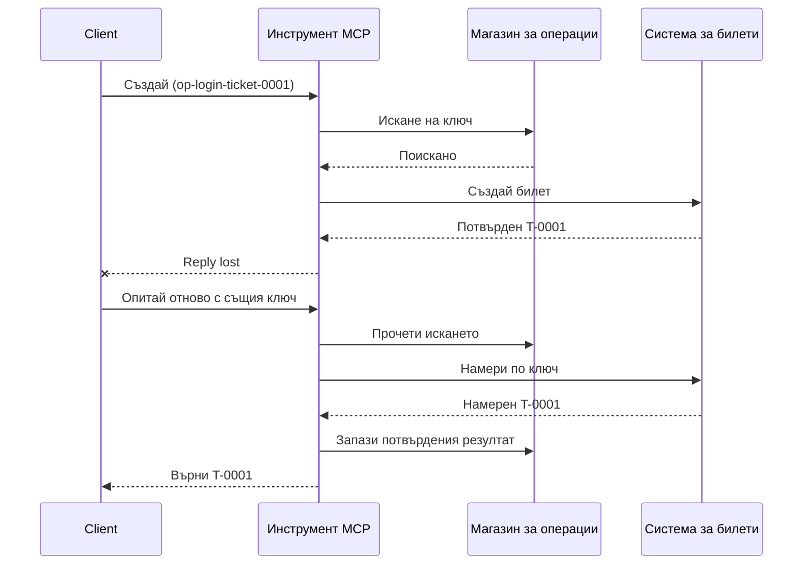
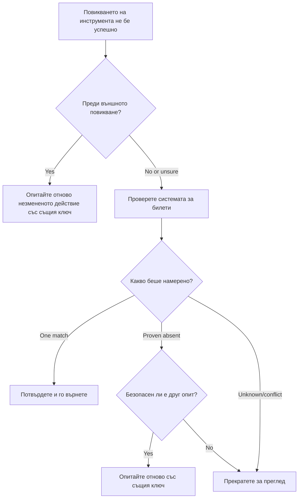

# Безопасни повторни опити за MCP инструменти: модел за надеждност Sidecar

Липсата на отговор не означава, че действието липсва. Инструмент за поддръжка с билети
може да създаде билет `T-0001` и след това да загуби връзката преди клиентът да види
резултата. Ако клиентът направи повторен опит без разсъждение, може да създаде `T-0002`.

Този урок показва как да разпознаете несигурния изход, да запазите една стабилна
идентичност за предвиденото действие и да проверите системата за билети преди да
опитате отново. Със съпътстващото упражнение на Python се изпълнява локално със стандартната
библиотека и SQLite.

## Защо таймаутът означава "изход неизвестен"

Да предположим, че клиентът извиква `create_support_ticket` с ключ на операцията
`op-login-ticket-0001`:



Връзката се прекъсва след комитването на билета, но преди резултатът да бъде получен.
Клиентът знае само, че отговорът липсва. Той не знае дали билета липсва. Повторната
употреба на ключа на операцията позволява на инструмента да намери и върне
`T-0001` вместо да създава `T-0002`.

## Какво прави надеждният Sidecar

Надеждният sidecar е код към приложението, който поддържа състояние за възстановяване около
инструмента. Той може да бъде библиотека, посреднически софтуер, услуга с база данни или
просто част от реализацията на инструмента. Не е задължително да е отделен процес,
и не е функция на протокола MCP.

Sidecar има четири задачи:

1. записва предвиденото действие преди извикване на външната система;
2. позволява само един работник да поеме това действие;
3. запомня достатъчно състояние за възстановяване след срив; и
4. проверява външната система, когато изходът е несигурен.

Този урок е насочен към окончателната спецификация на MCP `2026-07-28`. MCP няма
сесия на ниво протокол, така че ключът на операцията е обикновен аргумент на инструмента,
подкрепен от трайно състояние на приложението. Същият модел работи и с по-ранни
версии на MCP.

## Четири идентификатора, които решават различни проблеми

Тези идентификатори са свързани, но не са взаимнозаменяеми:

| Идентификатор | Какво идентифицира | Оцелява ли повторен опит? |
| --- | --- | --- |
| JSON-RPC ID | Един заявка и отговор | Не; използвай нов ID на заявката |
| MCP Task ID | Една дългосрочна задача | Да; пази го за полинг |
| Ключ на операцията | Едно предвидено действие | Да; използвай го повторно за това действие |
| Ticket ID | Запазеният резултат | Да; върни го след проверка |

Уведомленията за прогрес и контекстът на трасето помагат да се наблюдава заявката.
Отказът иска работата да спре. Нито едно от тях не предотвратява дублиран билет.

## Изграждане на защитата

Създайте ключа на операцията преди първото извикване на инструмента и го запазете с
работния процес. Всеки опит за създаване на същия предвиден билет използва същия ключ:

```json
{
  "operation_key": "op-login-ticket-0001",
  "title": "Cannot sign in"
}
```

Различен предвиден билет получава нов ключ. В продукционна среда генерирайте непрозрачен,
непредвидим стойност вместо да включвате клиентски данни в ключа.

Ето пълната MCP схема на инструмента, използвана в този урок:

```json
{
  "name": "create_support_ticket",
  "title": "Create support ticket",
  "description": "Creates or recovers one support ticket for an operation key.",
  "inputSchema": {
    "$schema": "https://json-schema.org/draft/2020-12/schema",
    "type": "object",
    "properties": {
      "operation_key": {
        "type": "string",
        "minLength": 16,
        "maxLength": 128,
        "description": "Stable key reused for the same intended action."
      },
      "title": {
        "type": "string",
        "minLength": 1,
        "maxLength": 200
      }
    },
    "required": ["operation_key", "title"],
    "additionalProperties": false
  },
  "outputSchema": {
    "$schema": "https://json-schema.org/draft/2020-12/schema",
    "type": "object",
    "properties": {
      "ticket_id": {
        "type": "string"
      },
      "operation_key": {
        "type": "string"
      },
      "status": {
        "type": "string",
        "const": "verified"
      }
    },
    "required": ["ticket_id", "operation_key", "status"],
    "additionalProperties": false
  }
}
```

Идентичността на удостоверения извиквач идва от контекста на сървъра, а не от
инструментален вход, предоставен от модела. Ограничете всяка съхранена операция до:

- този извиквач, наемател или служебна сметка;
- име и версия на инструмента; и
- хеш на нормализираните входни данни, които дефинират външното действие.

Хешът на входа отговаря на прост въпрос: „Този повторен опит иска ли същия
билет?“ Ако ключът вече принадлежи на различен заглавие, отхвърлете извикването.
Връщането на по-ранен резултат при променен вход би скрило грешка в договора.

Запазете заявката с една атомарна база данни операция. „Атомарна“ означава, че два работника
не могат и двамата да видят празен запис и да станат собственици. Локалният заключващ механизъм
в процеса не е достатъчен, когато друг сървър може да получи повторния опит.

Работният процес създава ключа, докато действието е `планирано`. Примерът после
съхранява тези състояния:

- `заявен`: един работник е резервирал операцията;
- `завършен`: билетната система е върнала резултат; и
- `проверен`: четене от билетната система потвърждава резултата.

Срив може да остави запазеното състояние на `заявен`, дори след като билетът е
създаден. Отнасяйте всеки незавършен заявен статус като несигурен, докато външните доказателства
го уточнят. Не предполагайте, че `заявен` означава „нищо не се е случило.“

## Възстановете се преди да опитате отново

Когато извикване на инструмент се провали, решете какво се знае, преди да изпратите още една външна
заявка за писане:



Валидация, която се проваля преди да е извикан API за билети, е известна грешка.
Повторете непокритото действие със същия ключ на операцията. Ако коригирането на входа
променя предвидения билет, създайте нов ключ за това ново действие.

Ако заявката може да е стигнала до билетната система, първо я съпоставете.
Съпоставянето означава сравняване на запазената заявка с авторитетния билетен
запис. Върнете съществуващия билет, ако има точно един съвпадащ запис.
Правете повторен опит само когато билетът категорично липсва и договорът на ниско ниво
прави друг опит безопасен.

„Не е намерен“ не винаги е категорично. Доставчик с евентуално консистентно
търсене може да изисква ограничено изчакване и другa проверка. Ако системата не може да бъде
търсена, дава противоречиви резултати или не може безопасно да премахне дублиране на друг
опит, спрете и докладвайте `изход неизвестен`. Спирането тук понякога се нарича
„затваряне при грешка“: работният поток отказва да гадае.

## Доказателства, задачи и отказ

Отговорът на инструмента казва какво е докладвал инструментът. Записаният контролна точка казва какво
е записал работния процес. Най-силните доказателства идват от системата, която притежава
резултата: за този пример, четене от билетната система, което намира точно един
съвпадащ билет.

Съвпаднете доказателствата с риска. ID на съобщение от доставчика може да е достатъчно за
уведомление с нисък риск. Плащанията, развъртанията и разрушителните действия може
да изискват статус от доставчика, счетоводна книга или ръчна проверка.

Разширението MCP Tasks допълва този модел за дълготрайна работа. Task
ID позволява на клиента да възобнови полинга след прекъсване, но не идентифицира
или премахва дублирането на самия билет. Когато се ползват Tasks, идентичностите се свързват
по следния начин:

```text
operation key -> Task ID -> ticket ID -> verification evidence
```

Отказът е кооперативен, не е обръщане на операцията. Билетът може още да бъде създаден
след признаване на отказа, така че несигурният резултат все още изисква
съпоставяне.

## Пуснете упражнението за инжектиране на грешки

Примера използва два SQLite файла: един представя хранилището на операциите и
другият представя външната билетна система. Няма транзакция, която обхваща
и двата файла. Грешката се инжектира след като билетът се комитне, но преди
sidecar да запише завършването.

Директният Python метод приема `caller_id` като заместител на удостоверен
сървърен контекст. Не добавяйте `caller_id` в управляваната от модела MCP входна
схема.

Предвидете резултата преди да стартирате тестовете:

| Път | Резултат след повторен опит | Брой билети |
| --- | --- | --- |
| Сляп повторен опит | Създава `T-0002` след загуба на отговор за `T-0001` | 2 |

| Защитено повторение | Намира и връща `T-0001` | 1 |

Стартирайте:

```bash
cd 08-BestPractices/reliability-sidecars/python
python -m unittest discover -p "test_*.py" -v
```

Шестте теста показват, че:

1. слепото повторение създава дубликат;
2. загуба на отговор плюс рестарт възстановява един билет от траен иск;
3. проверено повторение използва съхранения резултат;
4. променен вход или конфликтуващи външни доказателства се отхвърлят;
5. съществуващ иск без външни доказателства спира безопасно; и
6. конкурентни искове допускат един собственик без да регресират проверен резултат.

Отворете примера:

- [Python реализация](../../../../08-BestPractices/reliability-sidecars/python/reliability_sidecar.py)
- [Детерминистични тестове](../../../../08-BestPractices/reliability-sidecars/python/test_reliability_sidecar.py)

Примерът умишлено пропуска наемите за остарели искове. Политиката за поемане в продукция
изисква ограничен наем, атомарна прехвърляне на собственост и още една външна
проверка преди изпълнение.

## Опционална общностна реализация

Agent Enhancer Utilities е една общностна реализация на този
шаблон на ниво приложение. Неговият плановик избира подход за възстановяване, докато
неговият чекпойнт записва състояния на иск и несигурен резултат. Домейн инструментът или MCP
сървърът все още изпълняват и проверяват истинското действие. Тази услуга не е част
от спецификацията на MCP и не е задължителна за този урок.

| Концепция на урока | Част на Agent Enhancer | Важни ограничения |
| --- | --- | --- |
| План за възстановяване | `workflow-guard-planner` | Не извиква домейн инструмента |
| Иск и възстановяване | `workflow-checkpoint` | `external_proof` остава `false` |
| Точно повторение на sidecar | `lab.invoke_tool` | Използва отделен ключ за идемпотентност |
| Потвърждаване на истинското действие | Търсене/четене на дестинация | Домейн MCP го управлява |

За точно повторение на едно повикване на sidecar, `lab.invoke_tool` приема външен
`idempotency_key`. Този ключ идентифицира повикването на sidecar; той не е
бизнес `operation_key`, използван за билета.

Маркираният публичен договор и опционален пример в мрежата са налични
тук:

- [Reliability Sidecar Contract v1](https://github.com/artiehinz/Agent-Enhancer-Utilities/blob/v1.6.0/docs/RELIABILITY_SIDECAR_CONTRACT_V1.md)
- [Плановик и пример с мок-домейн](https://github.com/artiehinz/Agent-Enhancer-Utilities/tree/v1.6.0/examples/reliability-sidecar)

Тези линкове илюстрират шаблона на приложението. Те не твърдят, че
хостваната услуга съответства на MCP `2026-07-28`, и състоянието на чекпойнт никога не се счита
за външно доказателство за билета.

## Контролен списък за продукция

- [ ] Създайте и запазете ключа на операцията преди първия външен опит.
- [ ] Свържете ключа с подателя, версията на инструмента и нормализираното хеширане на входа.
- [ ] Отхвърлете променен вход под съществуващ ключ.
- [ ] Допуснете един собственик с атомарна операция за споделен магазин.
- [ ] Предайте ключа към по-надолу доставчик, когато поддържа идемпотентност.
- [ ] Изяснете несигурни резултати преди друго писане.
- [ ] Съхранявайте проверени резултати и доказателства за целия прозорец за повторение.
- [ ] Спирайте за преглед, когато външният резултат не може да бъде установен безопасно.

## Препратки

- [MCP Спецификация `2026-07-28`](https://modelcontextprotocol.io/specification/2026-07-28)
- [MCP `2026-07-28` ръководство за инструменти](https://modelcontextprotocol.io/specification/2026-07-28/server/tools)
- [MCP Tasks разширение](https://modelcontextprotocol.io/extensions/tasks/overview)
- [JSON-RPC 2.0 спецификация](https://www.jsonrpc.org/specification)

---

<!-- CO-OP TRANSLATOR DISCLAIMER START -->
**Отказ от отговорност**:
Този документ е преведен с помощта на AI преводачески услуга [Co-op Translator](https://github.com/Azure/co-op-translator). Въпреки че се стремим към точност, моля имайте предвид, че автоматизираните преводи могат да съдържат грешки или неточности. Оригиналният документ на неговия роден език трябва да се счита за авторитетен източник. За критична информация се препоръчва професионален човешки превод. Ние не носим отговорност за каквито и да е недоразумения или неправилни тълкувания, произтичащи от използването на този превод.
<!-- CO-OP TRANSLATOR DISCLAIMER END -->