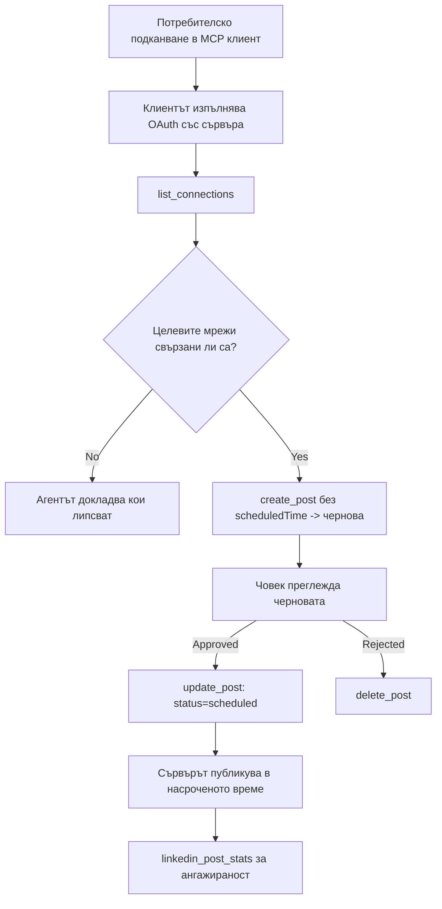

# Казус: Публикуване в социални мрежи от агент с отдалечен MCP сървър

> **Отказ от отговорност:** Няколко услуги и проекти с отворен код могат да публикуват в социални мрежи, а един екип може също така да интегрира директно API на всяка мрежа. По-долу е даден един пример как може да се проектира и консумира **отдалечен MCP сървър с възможност за писане**. Publora е търговска услуга с безплатен план; описаните тук модели се прилагат за всеки MCP сървър, който извършва необратими действия от името на потребителя.

## Преглед

Агентите са добри в създаването на чернови на съдържание и слаби в доставянето им. Модел може да напише анонс за публикация за секунди, след което работата спира: публикуването означава API за всяка мрежа, OAuth приложение за всяка мрежа и различен набор от медийни правила за всяка. Повечето екипи решават това, като копират текста ръчно в браузъра.

Този казус разглежда как този последен етап се завършва с един единствен отдалечен MCP сървър и — по-полезно за всеки, който го изгражда — какви решения за дизайн трябва да вземе сървър, който има възможност за писане. Четенето на данни е по-прощаващо. Публикуването не е: грешен повик на инструмент се вижда от аудиторията и не може да бъде отменен.

## Сценарий

Малък екип за връзки с разработчици създава чернови на публикации вътре в агент (Claude, VS Code, Cursor — клиентът няма значение). Те искат агентът да:

- вижда кои социални акаунти екипът е свързал,
- създава чернова на публикация и я запазва като чернова за одобрение от човек,
- прикачи изображение,
- насрочи публикацията за няколко мрежи в избрано време,
- и по-късно докладва за нейното представяне.

Ключово е, че те искат агентът *да не може* случайно да публикува, докато все още експериментират.

## Използвани инструменти

- [Publora MCP Server](https://github.com/publora/mcp-server) — отдалечен MCP сървър (`streamable-http`), предоставящ инструменти за публикуване, насрочване, медии и аналитика в LinkedIn. Регистриран в официалния MCP регистър като `com.publora/mcp-server`.

## Потоци на работа стъпка по стъпка

1. **Свържете сървъра.** Клиенти, които работят с OAuth, завършват потока с код за авторизация с PKCE през собствен екран за съгласие на сървъра; клиенти без това, като headless CLIs, използват Publora API ключ в хедър. Поддържат се и двата пътя и кой ще се използва зависи от клиента, а не от сървъра.
2. **Изброяване на връзките.** Агентът извиква `list_connections` и получава свързаните акаунти с техните идентификатори.
3. **Създаване на чернова.** Агентът извиква `create_post` *без* насрочено време. Публикацията се съхранява като чернова — нищо не се публикува.
4. **Прикачване на медии.** Публични URL адреси на изображения се подават в същото повикване; сървърът ги изтегля и валидира.
5. **Насрочване.** След одобрение от човек, `update_post` задава статус на насрочена с ISO 8601 време.
6. **Измерване.** За LinkedIn, `linkedin_post_stats` връща ангажираност, след като публикацията е активна.

## Примерна заявка

```text
Which social accounts do I have connected?
Draft a post announcing our new changelog page, attach the screenshot at
https://example.com/changelog.png, and keep it as a draft — do not publish it.
Once I approve, schedule it to LinkedIn and Bluesky for tomorrow at 09:00 UTC.
```

## Mermaid Flowchart



## Техническа реализация

Уроците по-долу представляват преносимата част от този казус.

### Отворено откриване, удостоверено изпълнение

`tools/list` се предоставя без удостоверяване; всяко `tools/call` изисква токен
и в противен случай връща `401` с хедъра `WWW-Authenticate`, сочещ към
метаданните на защитен ресурс. Наследената крайна точка на сървъра също отговаря на
неавторизирано повикване `initialize` за клиенти на протоколни версии преди
`2026-07-28`; текущите клиенти не използват този ръкостискане.

Тази специфична за сървъра разделителна линия позволява на регистрите, каталогите и клиентите да инспектират имената, схемите и анотациите на инструментите без тайна, докато предотвратява анонимно изпълнение. Отвореното откриване е избор при внедряване, а не изискване на MCP; защитено внедряване може да изисква и авторизация за `tools/list`.


всеки клиент се нуждаеше от предварително издаден `client_id` от доставчика.


### Анотациите на инструментите не са украса

Всеки инструмент има `title` и приложимите намеци: `readOnlyHint`, `destructiveHint`, `idempotentHint`, `openWorldHint`.

Има две причини да се инвестира в тях. Първо, клиентите използват намеците, за да решат какво да потвърдят с потребителя — клиент може автоматично да изпълни само четене и да изчака одобрение преди изтриване. Спецификацията изрично казва, че анотациите са ненадеждни намеци, а не авторизационен механизъм: те формират какво клиентът предлага да направи, не спират нищо в сървъра, и сървърът все още трябва да прилага собствените си правила. Второ, основните директории за конектори сега *изискват* анотациите за преглед; сървър без заглавия и намеци ще бъде върнат обратно, независимо колко добре работи.

### Направете идентификаторите не-измислими

Идентификаторите на платформата са непрозрачни низове, върнати от `list_connections`, и описанието на схемата изрично казва, че трябва да се копират дословно и никога да не се гадаят. Сървърът отхвърля всичко друго.

Моделите са свободни гадачи. Всеки сървър с възможност за писане трябва да предполага, че идентификаторът в крайна сметка ще бъде халюциниран и да направи този път да се проваля гласно и рано, а не да действа по правдоподобна стойност.

### Проваляйте преди публикуване с послание с указания за действие

Някои мрежи отказват публикации само с текст и изискват изображение или видео. Това се валидира при насрочването на поста и грешката посочва платформата и липсващото изискване.

Агент може да се възстанови от съобщението "Instagram изисква медии — прикачете изображение или видео" без допълнително обаждане. Не може да се възстанови от обща грешка `400`.

### Направете повторните опити безопасни

Двата инструмента за създаване на съдържание, `create_post` и `update_post`, приемат ключ за идемпотентност: повторното използване с идентична заявка възпроизвежда първоначалния отговор вместо да създава втора публикация. Стартиращите среди на агенти правят повторни опити при изтичане на време; без идемпотентност бавното забавяне води до дублирана публикация. Другите инструменти за запис — изтривания, медийни стъпки, реакции и коментари в LinkedIn — не приемат такъв ключ, затова повторният опит там не е автоматично безопасен. Добре е да знаете кои ваши собствени мутации са защитени и кои не.

### Осигурете начин за тест, който не публикува нищо


Сървърът приема резервирана цел, `publora-playground`, която се валидира и потвърждава като истинска дестинация и след това се изхвърля — нищо не достига до реална сметка. Тя е описана самата в схемата на инструмента, която всеки клиент може да прочете без удостоверения: полето `platforms` в `create_post` я документира като "цел за тест на връзка, която не изисква реална връзка — постът се потвърждава и изхвърля, нищо не се публикува". Извиква се като се подаде като единствен вход: `platforms: ["publora-playground"]`.

Оказа се, че това е една от най-полезните подробности на цялата повърхност. Рецензентите на директории с конектори, сътрудниците и CI могат да упражняват пълния път на писане от край до край без риск за реална аудитория. Всеки MCP сървър с необратими действия се възползва от документирана цел без действие.

## Резултати и Въздействие

- Стъпката на публикуване се премести от браузъра към същия разговор, където се пише съдържанието, а навикът за работа с чернова първо държи човек в цикъла. Бъдете точни какво означава това: черновата е конвенция, не граница. Същите удостоверения могат да планират или публикуват, така че всеки, който се нуждае от истинска врата за одобрение, трябва да я прилага извън повърхността на инструмента — отделни удостоверения или слой политика пред сървъра.
- Разликите според мрежата — изисквания към медии, нишкуване, контроли за отговори — се обработват веднъж в сървъра вместо във всеки агент, който комуникира с него.
- Един и същ сървър поддържа няколко MCP клиента без предварително издадени удостоверения.
    Текущите клиенти могат да използват клиентски ID метаданни документи; DCR остава резервен вариант
    за по-стари клиенти.
- Дизайнерските ограничения по-горе бяха формирани толкова от прегледите на директории с конектори, колкото и от потребителите: анотации, OAuth и безопасна цел за тестване бяха изисквани от поне един от тях.

## Референции

- [Publora MCP Server (източник)](https://github.com/publora/mcp-server)
- [Publora API и MCP документация](https://docs.publora.com)
- [Запис в MCP Регистър: `com.publora/mcp-server`](https://registry.modelcontextprotocol.io/v0/servers?search=com.publora/mcp-server)
- [MCP спецификация — Оторизация](https://modelcontextprotocol.io/specification/2026-07-28/basic/authorization)
- [MCP спецификация — Анотации в инструменти](https://modelcontextprotocol.io/docs/concepts/tools)

## Какво Следва

- Вземете MCP сървър, който изграждате, и проверете трите най-евтини печалби тук: анотации на всеки инструмент, ключ за идемпотентност на всяка операция за запис и документирана цел без действие.
- Опитайте разделянето на открито откриване: извикайте `tools/list` към публичен отдалечен сървър без удостоверения, след което извикайте инструмент и инспектирайте `401` предизвикателството.
- Обмислете какво означава "отмяна" за вашия домейн. Публикуването има чернови и изтриване; ако вашите действия нямат еквивалент, потвърждението принадлежи към дизайна на инструмента, а не към подсказката.

---

<!-- CO-OP TRANSLATOR DISCLAIMER START -->
**Отказ от отговорност**:
Този документ е преведен с помощта на AI преводачески услуга [Co-op Translator](https://github.com/Azure/co-op-translator). Въпреки че се стремим към точност, моля имайте предвид, че автоматизираните преводи могат да съдържат грешки или неточности. Оригиналният документ на неговия роден език трябва да се счита за авторитетен източник. За критична информация се препоръчва професионален човешки превод. Ние не носим отговорност за каквито и да е недоразумения или неправилни тълкувания, произтичащи от използването на този превод.
<!-- CO-OP TRANSLATOR DISCLAIMER END -->