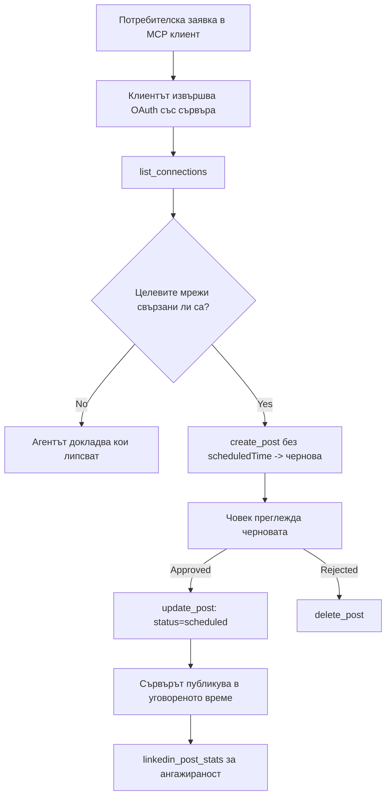

# Казус: Публикуване в социални мрежи от агент с отдалечен MCP сървър

> **Изключение от отговорност:** Няколко услуги и проекти с отворен код могат да публикуват в социални мрежи, а екипът също може директно да интегрира всеки API на мрежата. Сценарият по-долу е представен като един работещ пример за това как може да бъде проектиран и използван **отдалечен MCP сървър с възможност за писане**. Publora е търговска услуга с безплатен план; описаните тук модели са приложими за всеки MCP сървър, който извършва необратими действия от името на потребителя.

## Преглед

Агентите са добри в създаване на съдържание и слаби при неговото публикуване. Модел може да напише съобщение за излизане на продукт за секунди, но след това работата приключва: публикуване означава API за всяка мрежа, OAuth приложение за всяка мрежа и различен набор от правила за медии за всяка. Повечето екипи решават това като ръчно копират текста в браузъра.

Този казус разглежда как последната стъпка се закрива с един единствен отдалечен MCP сървър и — още по-полезно за всеки, който го създава — дизайнерските решения, които един **сървър с възможност за писане** трябва да вземе правилно. Четенето на данни е толерантно. Публикуването не е: грешно извикване на инструмент е видимо за аудитория и не може да бъде отменено.

## Сценарий

Малък екип за връзки с разработчици създава чернови на публикации вътре в агент (Claude, VS Code, Cursor — клиентът няма значение). Те искат агентът да:

- вижда кои социални акаунти екипът е свързал,
- изготвя публикация и я запазва като чернова за одобрение от човек,
- прикачи изображение,
- планира публикуването й в няколко мрежи на избрано време,
- и по-късно докладва как е представянето й.

Ключово е, че те искат агентът да *не може* да публикува случайно, докато все още експериментират.

## Използвани инструменти

- [Publora MCP сервер](https://github.com/publora/mcp-server) — отдалечен MCP сървър (`streamable-http`), който предоставя функции за публикуване, планиране, медии и анализи в LinkedIn. Регистриран в официалния MCP регистър като `com.publora/mcp-server`.

## Стъпка по стъпка работен процес

1. **Свържете сървъра.** Клиенти, които работят с OAuth, изпълняват потока за удостоверяване с код за авторизация и PKCE срещу собствения екран за съгласие на сървъра; клиенти без браузър, като headless CLI, използват API ключ на Publora в хедър. И двата пътя се поддържат и кой ще получите зависи от клиента, не от сървъра.
2. **Изброяване на връзки.** Агентът извиква `list_connections` и получава свързаните акаунти с техните идентификатори.
3. **Чернова.** Агентът извиква `create_post` *без* насрочено време. Публикацията се съхранява като чернова — нищо не се публикува.
4. **Прикачване на медия.** Публичните URL адреси на изображения се подават в същото извикване; сървърът ги изтегля и валидира.
5. **Планиране.** След одобрение от човек, `update_post` задава статус насрочен с ISO 8601 време.
6. **Измерване.** За LinkedIn, `linkedin_post_stats` връща ангажираност след като публикацията е на живо.

## Примерен подсказващ текст

```text
Which social accounts do I have connected?
Draft a post announcing our new changelog page, attach the screenshot at
https://example.com/changelog.png, and keep it as a draft — do not publish it.
Once I approve, schedule it to LinkedIn and Bluesky for tomorrow at 09:00 UTC.
```

## Диаграма в Mermaid



## Техническа реализация

Уроците по-долу са преносима част от този казус.

### Отворено откриване, удостоверено изпълнение

`tools/list` се предоставя без креденшъли; всяко `tools/call` изисква токен и при липса връща `401` с хедър `WWW-Authenticate`, указващ метаданни за защитен ресурс. (Сървърът също отговаря на неавторизирано `initialize`, което е важно само за клиенти с протоколни версии преди `2026-07-28`; тази ревизия премахна изцяло ръкостискането.)

Това разделение е важно на практика. Регистри, каталози и клиенти могат да анализират инструмента — имена, схеми, анотации — без да имат тайна, докато нищо не може да се *изпълни* анонимно. Сървър, който изисква токен за `initialize` е практически невидим за инструментите; сървър, който позволява анонимни `tools/call` е риск.

### Регистрация: динамична регистрация на клиенти и какво я замества

Сървърът рекламира `/.well-known/oauth-protected-resource` и `/.well-known/oauth-authorization-server`, и поддържа потока за код за авторизация с PKCE (`S256`), обновяване на токени и **динамична регистрация на клиенти**.

Динамичната регистрация премахва ръчната стъпка: без нея всеки клиент се нуждае от предварително издаден `client_id`, което означава извънлентова заявка към доставчика за всеки нов клиент.

Тествайте това като съвместимо поведение, а не като дизайн за копиране. Ревизията от `2026-07-28` на спецификацията премахва динамичната регистрация в полза на Документи за метаданни на клиентски идентификатори (Client ID Metadata Documents), където клиентът хоства документ с метаданни на стабилен HTTPS URL и този URL *е* `client_id`. DCR все още работи засега, но съвременен сървър трябва да планира CIMD и да запази DCR само за по-стари клиенти.

### Анотациите на инструментите не са украса

Всеки инструмент носи `title` и приложимите подсказки: `readOnlyHint`, `destructiveHint`, `idempotentHint`, `openWorldHint`.

Два са причините да инвестирате в тях. Първо, клиентите ползват подсказките, за да решат какво да потвърдят с потребителя — клиент може да изпълни автоматично заявка за четене и да спре за одобрение преди изтриване. Спецификацията е ясна, че анотациите са непълни подсказки, а не механизъм за упълномощаване: те оформят какво клиентът предлага да направи, не спират нищо на сървъра, и сървърът трябва да налага собствените си правила. Второ, основните каталози за конектори вече *изискват* анотации за преглед; сървър без заглавия и подсказки на инструментите ще бъде върнат, независимо колко добре работи.

### Направете идентификаторите неотгатваеми

Идентификаторите на платформи са непрозрачни низове, върнати от `list_connections`, и схемата изрично казва, че трябва да се копират дословно и никога да не се гадаят. Сървърът отхвърля всичко друго.

Моделите обичат да гадаят. Всеки сървър с възможност за писане трябва да предположи, че идентификатор някога ще се халюцинира и да направи този път грешка шумно и рано, а не да действа по стойност, която изглежда правдоподобна.

### Проваляйте преди публикуването, с осъществимо съобщение

Някои мрежи отказват публикации само с текст и изискват изображение или видео. Това се валидира при планиране, а грешката уточнява платформата и липсващото изискване.

Агентът може да коригира „Instagram изисква медия — прикачи изображение или видео“ без допълнително отскачане. Не може да се възстанови от общ `400`.

### Направете повторните опити безопасни

Двата инструмента, които създават съдържание, `create_post` и `update_post`, приемат ключ за идемпотентност: повторното използване с идентична заявка повтаря оригиналния отговор, вместо да създава втора публикация. Агентите повтарят при изтичане на време; без идемпотентност бавното отговаряне става дублиране на публикация. Другите писмени инструменти — изтривания, стъпки с медии, реакции и коментари в LinkedIn — не го поддържат, затова повторният опит там не е автоматично безопасен. Полезно е да знаете кои собствени промени са защитени и кои не.

### Осигурете начин да тествате, който не публикува нищо

Сървърът приема резервираната цел `publora-playground`, която се валидира и признава като реална дестинация и след това се изхвърля — нищо не достига жив акаунт. Това е описано в самата схема на инструмента, който всеки клиент може да прочете без креденшъли: полето `platforms` на `create_post` го документира като "цел за тест на връзка, която не изисква реална връзка — публикацията се признава и изхвърля, нищо не се публикува". Извикайте, като го подадете като единствен запис: `platforms: ["publora-playground"]`.

Това се оказа една от най-полезните подробности в цялата повърхност. Преглеждащите регистрите на конектори, сътрудниците и CI могат да упражняват пълния писмен път от край до край без риск за реална аудитория. Всеки MCP сървър с необратими действия печели от документирана цел, при която нищо не се прави.

## Резултати и влияние

- Стъпката на публикуване се премести от браузъра в същия разговор, в който се пише съдържанието, а навикът с първо чернова държи човека в цикъла. Бъдете прецизни какво представлява това: черновата е конвенция, а не граница. Същите креденшъли могат да планират или публикуват, така че който има нужда от истинска одобрителна врата, трябва да я налага извън инструменталната повърхност — отделни креденшъли или политика пред сървъра.
- Разликите на мрежи — изисквания за медии, нишки, контрол на отговорите — се обработват веднъж в сървъра, вместо във всеки агент, който говори с него.
- Същият сървър поддържа няколко MCP клиента без работа на клиентско ниво, защото откриването е отворено, а регистрацията е динамична.
- Ограниченията при дизайна по-горе бяха формирани както от прегледите на каталозите на конектори, така и от потребителите: анотации, OAuth и безопасна тестова цел бяха изисквани поне от един от тях.

## Литература

- [Publora MCP сървър (източник)](https://github.com/publora/mcp-server)
- [Документация на Publora API и MCP](https://docs.publora.com)
- [Запис в MCP регистър: `com.publora/mcp-server`](https://registry.modelcontextprotocol.io/v0/servers?search=com.publora/mcp-server)
- [Спецификация MCP — Упълномощаване](https://modelcontextprotocol.io/specification/draft/basic/authorization)
- [Спецификация MCP — Анотации на инструменти](https://modelcontextprotocol.io/docs/concepts/tools)

## Следващи стъпки

- Вземете MCP сървър, който изграждате, и проверете трите най-лесни подобрения: анотации на всеки инструмент, ключ за идемпотентност в крайпишещи заявки и документирана цел, при която няма действие.
- Опитайте разделението отворено-откриване: извикайте `tools/list` към публичен отдалечен сървър без креденшъли, след това извикайте инструмент и разгледайте `401` предизвикателството.
- Помислете какво означава „отмени“ за вашия домейн. Публикуването има чернови и изтриване; ако вашите действия нямат съответствие, потвърждението трябва да е в дизайна на инструмента, а не в подсказващия текст.

---

<!-- CO-OP TRANSLATOR DISCLAIMER START -->
**Отказ от отговорност**:
Този документ е преведен с помощта на AI преводачески услуга [Co-op Translator](https://github.com/Azure/co-op-translator). Въпреки че се стремим към точност, моля имайте предвид, че автоматизираните преводи могат да съдържат грешки или неточности. Оригиналният документ на неговия роден език трябва да се счита за авторитетен източник. За критична информация се препоръчва професионален човешки превод. Ние не носим отговорност за каквито и да е недоразумения или неправилни тълкувания, произтичащи от използването на този превод.
<!-- CO-OP TRANSLATOR DISCLAIMER END -->