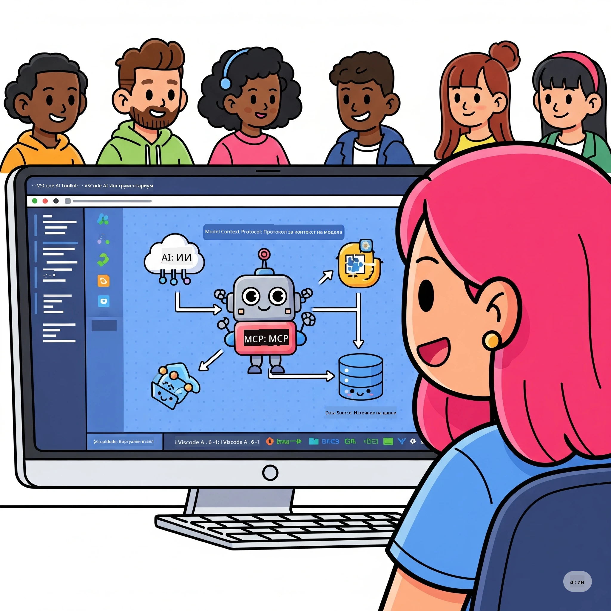
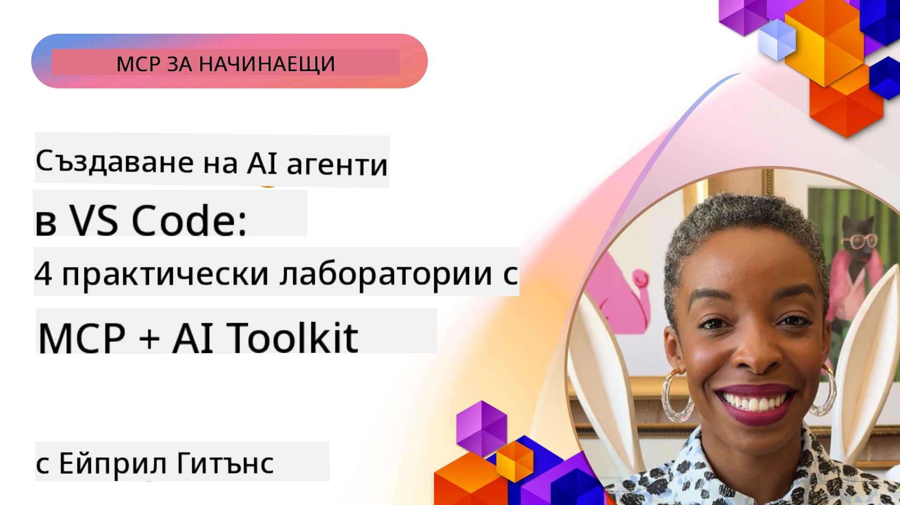

# Оптимизиране на AI Работни Потоци: Създаване на MCP Сървър с Microsoft Foundry Toolkit

## 🎯 Преглед

_(Кликнете на снимката по-горе, за да гледате видео от този урок)_

Добре дошли на **Работилницата за Model Context Protocol (MCP)**! Тази цялостна практическа работилница комбинира две иновативни технологии, за да революционизира разработката на AI приложения:

> **Бележка за съвместимост:** кодът на работилницата е създаден и тестван с MCP
> `2025-11-25`, както е показано на значката по-горе. Използвайте
> [текущата спецификация `2026-07-28`](https://modelcontextprotocol.io/specification/2026-07-28/)
> за нови реализации на протокола и преглеждайте бележките за издания на SDK преди
> да мигрирате лабораториите.

- **🔗 Model Context Protocol (MCP)**: Отворен стандарт за безпроблемна интеграция на AI инструменти
- **🛠️ Разширение Microsoft Foundry Toolkit за VS Code**: Мощно AI разработващо разширение на Microsoft

### 🎓 Какво ще научите

В края на тази работилница ще овладеете изкуството да изграждате интелигентни приложения, които свързват AI модели с реални инструменти и услуги. От автоматизирано тестване до персонализирани API интеграции, ще придобиете практически умения за решаване на сложни бизнес предизвикателства.

## 🏗️ Технологичен Стек

### 🔌 Model Context Protocol (MCP)

MCP е **"USB-C за AI"** - универсален стандарт, който свързва AI модели с външни инструменти и източници на данни.

**✨ Ключови функции:**

- 🔄 **Стандартизирана интеграция**: Универсален интерфейс за връзки AI-инструмент
- 🏛️ **Гъвкава архитектура**: Локални и отдалечени сървъри през stdio/SSE транспорт
- 🧰 **Богат екосистем**: Инструменти, подсказки и ресурси в един протокол
- 🔒 **Готов за използване в предприятия**: Вградена сигурност и надеждност

**🎯 Защо MCP е важен:**
Точно както USB-C елиминира хаоса с кабелите, MCP премахва сложността на AI интеграциите. Един протокол, безкрайни възможности.

### 🤖 Разширение Microsoft Foundry Toolkit за VS Code

Първокласното AI разработващо разширение на Microsoft, което превръща VS Code в AI мощност.

**🚀 Основни възможности:**

- 📦 **Каталог на модели**: Достъп до модели от Azure AI, GitHub, Hugging Face, Ollama
- ⚡ **Локално извеждане**: ONNX-оптимизирано изпълнение на CPU/GPU/NPU
- 🏗️ **Agent Builder**: Визуално разработване на AI агенти с MCP интеграция
- 🎭 **Мултимодален**: Поддръжка на текст, визия и структурирани резултати

**💡 Предимства за разработка:**

- Разгръщане на модели без конфигурация
- Визуално проектиране на подсказки
- Среда за тестване в реално време
- Безпроблемна интеграция на MCP сървъри

## 📚 Учебно Пътешествие

### [🚀 Модул 1: Основи на Microsoft Foundry Toolkit](./lab1/README.md)

**Продължителност**: 15 минути

- 🛠️ Инсталиране и конфигуриране на Microsoft Foundry Toolkit за VS Code
- 🗂️ Разглеждане на Каталога на модели (100+ модела от GitHub, ONNX, OpenAI, Anthropic, Google)
- 🎮 Овладяване на Интерактивната среда за тестове в реално време
- 🤖 Създаване на първия AI агент с Agent Builder
- 📊 Оценка на производителността на модели с вградени метрики (F1, релевантност, сходство, кохерация)
- ⚡ Научете обработка в пакет и мултимодална поддръжка

**🎯 Резултат от обучението**: Създайте функционален AI агент с цялостно разбиране на възможностите на Microsoft Foundry Toolkit

### [🌐 Модул 2: MCP с Microsoft Foundry Toolkit Основи](./lab2/README.md)

**Продължителност**: 20 минути

- 🧠 Овладяване на архитектурата и концепциите на Model Context Protocol (MCP)
- 🌐 Разглеждане на екосистемата на MCP сървъри на Microsoft
- 🤖 Създаване на агент за браузърна автоматизация с Playwright MCP сървър
- 🔧 Интеграция на MCP сървъри с Microsoft Foundry Toolkit Agent Builder
- 📊 Конфигуриране и тестване на MCP инструменти в агентите
- 🚀 Экспортиране и разполагане на MCP-задвижвани агенти за продукционна употреба

**🎯 Резултат от обучението**: Развържете AI агент, зареден с външни инструменти чрез MCP

### [🔧 Модул 3: Разширена MCP Разработка с Microsoft Foundry Toolkit](./lab3/README.md)

**Продължителност**: 20 минути

- 💻 Създаване на персонализирани MCP сървъри с Microsoft Foundry Toolkit
- 🐍 Конфигуриране и използване на най-новия MCP Python SDK (v1.9.3)
- 🔍 Настройване и използване на MCP Inspector за отстраняване на грешки
- 🛠️ Създаване на Weather MCP Сървър с професионални работни процеси за дебъгинг
- 🧪 Отстраняване на грешки при MCP сървъри в среди Agent Builder и Inspector

**🎯 Резултат от обучението**: Разработвайте и отстранявайте грешки на персонализирани MCP сървъри с модерни инструменти

### [🐙 Модул 4: Практическа MCP Разработка - Персонализиран GitHub Clone Сървър](./lab4/README.md)

**Продължителност**: 30 минути

- 🏗️ Създаване на реален GitHub Clone MCP Сървър за разработващи работни потоци
- 🔄 Изпълнение на интелигентно клониране на репозитории с валидация и обработка на грешки
- 📁 Създаване на интелигентно управление на директории и интеграция с VS Code
- 🤖 Използване на GitHub Copilot Agent Mode с персонализирани MCP инструменти
- 🛡️ Прилагане на производствена надеждност и кросплатформена съвместимост

**🎯 Резултат от обучението**: Разгръщане на производствен MCP сървър, който оптимизира реални работни процеси за разработка

## 💡 Приложения и Влияние в Реалния Свят

### 🏢 Бизнес случаи за предприятия

#### 🔄 Автоматизация на DevOps

Преобразете работния си процес на разработка с интелигентна автоматизация:

- **Интелигентно управление на репозитории**: AI-дирижирана проверка на кода и решения за сливане
- **Интелигентен CI/CD**: Автоматизирана оптимизация на пайплайна базирана на промени в кода
- **Триаж на проблеми**: Автоматична класификация и разпределение на грешки

#### 🧪 Революция в осигуряването на качеството

Повишете тестването с AI-задвижвана автоматизация:

- **Интелигентно създаване на тестове**: Автоматично създаване на комплексни тестови набори
- **Визуално регресионно тестване**: AI-задвижвано откриване на промени в UI
- **Мониторинг на производителността**: Проактивно откриване и разрешаване на проблеми

#### 📊 Интелигентност на процеса на данни

Създайте по-умни работни потоци за обработка на данни:

- **Адаптивни ETL процеси**: Самооптимизиращи се трансформации на данни
- **Откриване на аномалии**: Мониторинг на качеството на данните в реално време
- **Интелигентно маршрутизиране**: Умно управление на потока от данни

#### 🎧 Подобряване на клиентското изживяване

Създайте изключителни взаимодействия с клиентите:

- **Поддръжка с контекстуална осведоменост**: AI агенти с достъп до история на клиента
- **Проактивно разрешаване на проблеми**: Прогностично обслужване на клиенти
- **Мултиканална интеграция**: Унифицирано AI изживяване на всички платформи

## 🛠️ Изисквания и Настройка

### 💻 Системни изисквания

| Компонент | Изискване | Бележки |
|-----------|-------------|-------|
| **Операционна система** | Windows 10+, macOS 10.15+, Linux | Всяка модерна ОС |
| **Visual Studio Code** | Най-нова стабилна версия | Задължително за Microsoft Foundry Toolkit |
| **Node.js** | v18.0+ и npm | За разработка на MCP сървър |
| **Python** | 3.10+ | По избор за Python MCP сървъри |
| **Памет** | Минимум 8GB RAM | 16GB препоръчителни за локални модели |

### 🔧 Среда за разработка

#### Препоръчителни VS Code разширения

- **Microsoft Foundry Toolkit** (ms-windows-ai-studio.windows-ai-studio)
- **Python** (ms-python.python)
- **Python Debugger** (ms-python.debugpy)
- **GitHub Copilot** (GitHub.copilot) - По избор, но полезно

#### По избор инструменти

- **uv**: Модерен мениджър на Python пакети
- **MCP Inspector**: Визуален инструмент за дебъгване на MCP сървъри
- **Playwright**: За примери с уеб автоматизация

## 🎖️ Резултати от Обучението и Път за Сертифициране

### 🏆 Контролен списък за овладяване на умения

Като завършите тази работилница, ще постигнете майсторство в:

#### 🎯 Основни компетенции

- [ ] **Майсторство на MCP протокола**: Дълбоко разбиране на архитектура и модели на реализация
- [ ] **Професионална употреба на Microsoft Foundry Toolkit**: Експертно използване на Microsoft Foundry Toolkit за бърза разработка
- [ ] **Разработка на персонализирани сървъри**: Изграждане, разгръщане и поддръжка на MCP сървъри в продукция
- [ ] **Отлична интеграция на инструменти**: Безпроблемна свързаност на AI с налични работни процеси за разработка
- [ ] **Приложение на умения за решаване на проблеми**: Прилагане на наученото към реални бизнес предизвикателства

#### 🔧 Технически умения

- [ ] Настройване и конфигуриране на Microsoft Foundry Toolkit във VS Code
- [ ] Проектиране и реализация на персонализирани MCP сървъри
- [ ] Интегриране на GitHub модели с MCP архитектура
- [ ] Създаване на автоматизирани работни процеси за тестване с Playwright
- [ ] Разгръщане на AI агенти за продукционна употреба
- [ ] Отстраняване на грешки и оптимизация на производителността на MCP сървъра

#### 🚀 Разширени възможности

- [ ] Архитектура на AI интеграции в мащаб на предприятия
- [ ] Прилагане на най-добри практики за сигурност в AI приложения
- [ ] Проектиране на мащабируеми архитектури на MCP сървъри
- [ ] Създаване на персонализирани вериги от инструменти за специфични области
- [ ] Менторство на други в AI-родената разработка

## 📖 Допълнителни ресурси

- [MCP Спецификация (2026-07-28)](https://modelcontextprotocol.io/specification/2026-07-28/)
- [GitHub репозитория на Microsoft Foundry Toolkit](https://github.com/microsoft/vscode-ai-toolkit)
- [Колекция примерни MCP сървъри](https://github.com/modelcontextprotocol/servers)
- [Ръководство за добри практики](https://modelcontextprotocol.io/docs/best-practices)
- [OWASP MCP Топ 10](https://microsoft.github.io/mcp-azure-security-guide/mcp/) - Най-добри практики за сигурност

---

**🚀 Готови ли сте да революционизирате своя AI работен процес?**

Нека изградим бъдещето на интелигентните приложения заедно с MCP и Microsoft Foundry Toolkit!

## Какво следва

Продължете към: [Модул 11: MCP Server Hands-On Labs](../11-MCPServerHandsOnLabs/README.md)

---

<!-- CO-OP TRANSLATOR DISCLAIMER START -->
**Отказ от отговорност**:
Този документ е преведен с помощта на AI преводачески услуга [Co-op Translator](https://github.com/Azure/co-op-translator). Въпреки че се стремим към точност, моля имайте предвид, че автоматизираните преводи могат да съдържат грешки или неточности. Оригиналният документ на неговия роден език трябва да се счита за авторитетен източник. За критична информация се препоръчва професионален човешки превод. Ние не носим отговорност за каквито и да е недоразумения или неправилни тълкувания, произтичащи от използването на този превод.
<!-- CO-OP TRANSLATOR DISCLAIMER END -->