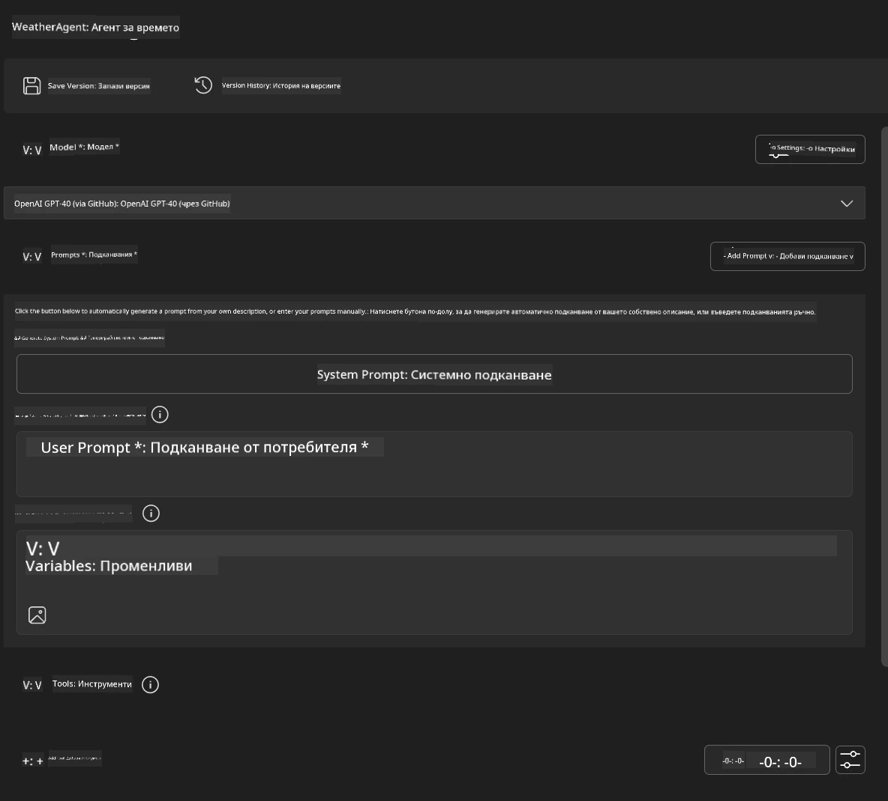
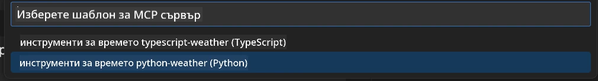
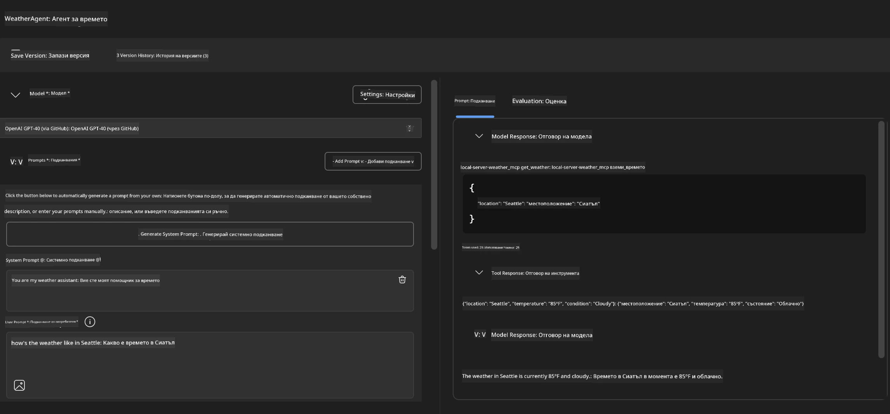
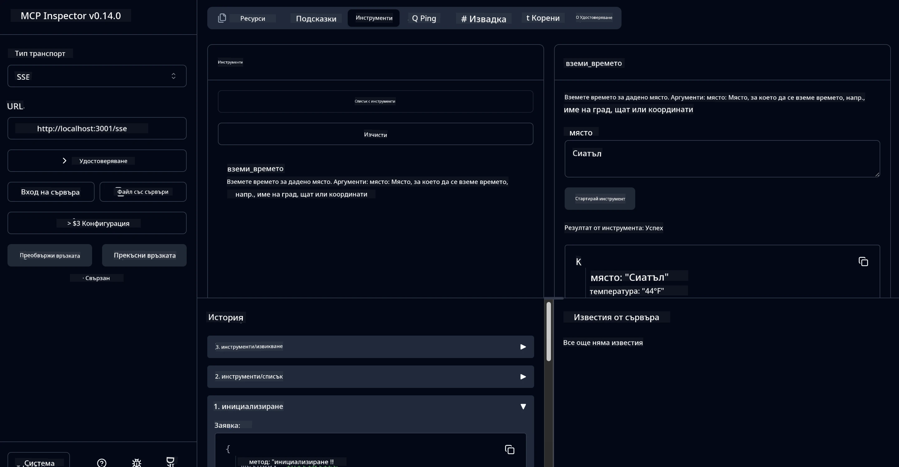

# 🔧 Модул 3: Разширена разработка на MCP с Microsoft Foundry Toolkit

> [!NOTE]
> URL адресите на Inspector в тази лаборатория използват наследствената крайна точка `/sse` и таргетират
> фиксираните зависимости MCP SDK `1.9.3` и Inspector `0.14.0`. Те не са
> актуални „2026-07-28“ Streamable HTTP примери.


## 🎯 Учебни цели

В края на тази лаборатория ще можете:

- ✅ Да създавате персонализирани MCP сървъри с Microsoft Foundry Toolkit
- ✅ Да конфигурирате и използвате най-новия MCP Python SDK (v1.9.3)
- ✅ Да настроите и използвате MCP Inspector за отстраняване на грешки
- ✅ Да отстранявате грешки в MCP сървъри в среди както на Agent Builder, така и на Inspector
- ✅ Да разбирате напреднали работни процеси за разработка на MCP сървъри

## 📋 Изисквания

- Завършване на Лаборатория 2 (Основи на MCP)
- VS Code с инсталирано разширение Microsoft Foundry Toolkit
- Python 3.10+ среда
- Node.js и npm за настройка на Inspector

## 🏗️ Какво ще създадете

В тази лаборатория ще създадете **Weather MCP сървър**, който демонстрира:
- Персонализирана реализация на MCP сървър
- Интеграция с Microsoft Foundry Toolkit Agent Builder
- Професионални работни процеси за отстраняване на грешки
- Съвременни модели на използване на MCP SDK

---

## 🔧 Преглед на основните компоненти

### 🐍 MCP Python SDK
Model Context Protocol Python SDK предоставя основата за изграждане на персонализирани MCP сървъри. Ще използвате версия 1.9.3 с разширени възможности за отстраняване на грешки.

### 🔍 MCP Inspector
Мощен инструмент за отстраняване на грешки, който предлага:
- Мониторинг на сървъра в реално време
- Визуализация на изпълнението на инструментите
- Инспекция на мрежови заявки/отговори
- Интерактивна тестова среда

---

## 📖 Стъпка по стъпка реализиране

### Стъпка 1: Създаване на WeatherAgent в Agent Builder

1. **Стартирайте Agent Builder** в VS Code чрез разширението Microsoft Foundry Toolkit
2. **Създайте нов агент** със следната конфигурация:
   - Име на агента: `WeatherAgent`



### Стъпка 2: Инициализиране на MCP сървърен проект

1. **Отидете в Tools** → **Add Tool** в Agent Builder
2. **Изберете "MCP Server"** от наличните опции
3. **Изберете "Create A new MCP Server"**
4. **Изберете шаблон `python-weather`**
5. **Наименувайте вашия сървър:** `weather_mcp`



### Стъпка 3: Отворете и разгледайте проекта

1. **Отворете генерирания проект** в VS Code
2. **Прегледайте структурата на проекта:**
   ```
   weather_mcp/
   ├── src/
   │   ├── __init__.py
   │   └── server.py
   ├── inspector/
   │   ├── package.json
   │   └── package-lock.json
   ├── .vscode/
   │   ├── launch.json
   │   └── tasks.json
   ├── pyproject.toml
   └── README.md
   ```

### Стъпка 4: Актуализиране до последната версия на MCP SDK

> **🔍 Защо актуализиране?** Искаме да използваме най-новия MCP SDK (v1.9.3) и Inspector услугата (0.14.0) за разширени функции и по-добри възможности за отстраняване на грешки.

#### 4a. Актуализирайте Python зависимостите

**Редактирайте `pyproject.toml`:** актуализирайте [./code/weather_mcp/pyproject.toml](../../../../10-StreamliningAIWorkflowsBuildingAnMCPServerWithAIToolkit/lab3/code/weather_mcp/pyproject.toml)


#### 4b. Актуализирайте конфигурацията на Inspector

**Редактирайте `inspector/package.json`:** актуализирайте [./code/weather_mcp/inspector/package.json](../../../../10-StreamliningAIWorkflowsBuildingAnMCPServerWithAIToolkit/lab3/code/weather_mcp/inspector/package.json)

#### 4c. Актуализирайте зависимостите на Inspector

**Редактирайте `inspector/package-lock.json`:** актуализирайте [./code/weather_mcp/inspector/package-lock.json](../../../../10-StreamliningAIWorkflowsBuildingAnMCPServerWithAIToolkit/lab3/code/weather_mcp/inspector/package-lock.json)

> **📝 Забележка:** Този файл съдържа подробни дефиниции на зависимости. По-долу е основната структура - пълното съдържание осигурява правилно разрешаване на зависимостите.


> **⚡ Пълен пакетен лок:** Пълният package-lock.json съдържа ~3000 реда с дефиниции на зависимости. По-горе е показана ключовата структура - използвайте предоставения файл за пълно разрешаване.

### Стъпка 5: Конфигуриране на отстраняването на грешки във VS Code

*Забележка: Моля, копирайте файла в посочения път, за да замените съответния локален файл*

#### 5a. Актуализиране на конфигурацията за стартиране

**Редактирайте `.vscode/launch.json`:**

```json
{
  "version": "0.2.0",
  "configurations": [
    {
      "name": "Attach to Local MCP",
      "type": "debugpy",
      "request": "attach",
      "connect": {
        "host": "localhost",
        "port": 5678
      },
      "presentation": {
        "hidden": true
      },
      "internalConsoleOptions": "neverOpen",
      "postDebugTask": "Terminate All Tasks"
    },
    {
      "name": "Launch Inspector (Edge)",
      "type": "msedge",
      "request": "launch",
      "url": "http://localhost:6274?timeout=60000&serverUrl=http://localhost:3001/sse#tools",
      "cascadeTerminateToConfigurations": [
        "Attach to Local MCP"
      ],
      "presentation": {
        "hidden": true
      },
      "internalConsoleOptions": "neverOpen"
    },
    {
      "name": "Launch Inspector (Chrome)",
      "type": "chrome",
      "request": "launch",
      "url": "http://localhost:6274?timeout=60000&serverUrl=http://localhost:3001/sse#tools",
      "cascadeTerminateToConfigurations": [
        "Attach to Local MCP"
      ],
      "presentation": {
        "hidden": true
      },
      "internalConsoleOptions": "neverOpen"
    }
  ],
  "compounds": [
    {
      "name": "Debug in Agent Builder",
      "configurations": [
        "Attach to Local MCP"
      ],
      "preLaunchTask": "Open Agent Builder",
    },
    {
      "name": "Debug in Inspector (Edge)",
      "configurations": [
        "Launch Inspector (Edge)",
        "Attach to Local MCP"
      ],
      "preLaunchTask": "Start MCP Inspector",
      "stopAll": true
    },
    {
      "name": "Debug in Inspector (Chrome)",
      "configurations": [
        "Launch Inspector (Chrome)",
        "Attach to Local MCP"
      ],
      "preLaunchTask": "Start MCP Inspector",
      "stopAll": true
    }
  ]
}
```

**Редактирайте `.vscode/tasks.json`:**

```
{
  "version": "2.0.0",
  "tasks": [
    {
      "label": "Start MCP Server",
      "type": "shell",
      "command": "python -m debugpy --listen 127.0.0.1:5678 src/__init__.py sse",
      "isBackground": true,
      "options": {
        "cwd": "${workspaceFolder}",
        "env": {
          "PORT": "3001"
        }
      },
      "problemMatcher": {
        "pattern": [
          {
            "regexp": "^.*$",
            "file": 0,
            "location": 1,
            "message": 2
          }
        ],
        "background": {
          "activeOnStart": true,
          "beginsPattern": ".*",
          "endsPattern": "Application startup complete|running"
        }
      }
    },
    {
      "label": "Start MCP Inspector",
      "type": "shell",
      "command": "npm run dev:inspector",
      "isBackground": true,
      "options": {
        "cwd": "${workspaceFolder}/inspector",
        "env": {
          "CLIENT_PORT": "6274",
          "SERVER_PORT": "6277",
        }
      },
      "problemMatcher": {
        "pattern": [
          {
            "regexp": "^.*$",
            "file": 0,
            "location": 1,
            "message": 2
          }
        ],
        "background": {
          "activeOnStart": true,
          "beginsPattern": "Starting MCP inspector",
          "endsPattern": "Proxy server listening on port"
        }
      },
      "dependsOn": [
        "Start MCP Server"
      ]
    },
    {
      "label": "Open Agent Builder",
      "type": "shell",
      "command": "echo ${input:openAgentBuilder}",
      "presentation": {
        "reveal": "never"
      },
      "dependsOn": [
        "Start MCP Server"
      ],
    },
    {
      "label": "Terminate All Tasks",
      "command": "echo ${input:terminate}",
      "type": "shell",
      "problemMatcher": []
    }
  ],
  "inputs": [
    {
      "id": "openAgentBuilder",
      "type": "command",
      "command": "ai-mlstudio.agentBuilder",
      "args": {
        "initialMCPs": [ "local-server-weather_mcp" ],
        "triggeredFrom": "vsc-tasks"
      }
    },
    {
      "id": "terminate",
      "type": "command",
      "command": "workbench.action.tasks.terminate",
      "args": "terminateAll"
    }
  ]
}
```


---

## 🚀 Стартиране и тестване на вашия MCP сървър

### Стъпка 6: Инсталиране на зависимости

След като направите конфигурационните промени, изпълнете следните команди:

**Инсталирайте Python зависимости:**
```bash
uv sync
```

**Инсталирайте Inspector зависимости:**
```bash
cd inspector
npm install
```

### Стъпка 7: Отстраняване на грешки с Agent Builder

1. **Натиснете F5** или използвайте конфигурацията **"Debug in Agent Builder"**
2. **Изберете съставната конфигурация** от панела за отстраняване на грешки
3. **Изчакайте стартирането на сървъра** и отварянето на Agent Builder
4. **Тествайте вашия Weather MCP сървър** с естествени езикови заявки

Входен въпрос като този

SYSTEM_PROMPT

```
You are my weather assistant
```

USER_PROMPT

```
How's the weather like in Seattle
```



### Стъпка 8: Отстраняване на грешки с MCP Inspector

1. **Използвайте конфигурацията "Debug in Inspector"** (Edge или Chrome)
2. **Отворете интерфейса на Inspector** на `http://localhost:6274`
3. **Разгледайте интерактивната тестова среда:**
   - Преглед на налични инструменти
   - Тест на изпълнението на инструментите
   - Мониторинг на мрежовите заявки
   - Отстраняване на грешки в отговорите на сървъра



---

## 🎯 Основни резултати от обучението

След завършване на тази лаборатория, вие:

- [x] **Създадохте персонализиран MCP сървър** с шаблони на Microsoft Foundry Toolkit
- [x] **Актуализирахте до най-новия MCP SDK** (v1.9.3) за разширена функционалност
- [x] **Конфигурирахте професионални работни процеси за отстраняване на грешки** както за Agent Builder, така и за Inspector
- [x] **Настроихте MCP Inspector** за интерактивно тестване на сървъра
- [x] **Управлявате VS Code конфигурации за отстраняване на грешки** за MCP разработка

## 🔧 Изследвани разширени функции

| Функция | Описание | Приложение |
|---------|-------------|----------|
| **MCP Python SDK v1.9.3** | Най-нова протоколна имплементация | Модерна разработка на сървъри |
| **MCP Inspector 0.14.0** | Интерактивен инструмент за отстраняване на грешки | Тестове на сървър в реално време |
| **VS Code Debugging** | Интегрирана развойна среда | Професионален работен процес за отстраняване на грешки |
| **Agent Builder Integration** | Директна връзка с Microsoft Foundry Toolkit | Край до край тестване на агенти |

## 📚 Допълнителни ресурси

- [Документация MCP Python SDK](https://modelcontextprotocol.io/docs/sdk/python)
- [Ръководство за разширението Microsoft Foundry Toolkit](https://code.visualstudio.com/docs/ai/ai-toolkit)
- [Документация за отстраняване на грешки във VS Code](https://code.visualstudio.com/docs/editor/debugging)
- [Спецификация на Model Context Protocol](https://modelcontextprotocol.io/docs/concepts/architecture)

---

**🎉 Поздравления!** Успешно завършихте Лаборатория 3 и сега можете да създавате, отстранявате грешки и разгръщате персонализирани MCP сървъри с професионални работни процеси за разработка.

### 🔜 Продължете към следващия модул

Готови ли сте да приложите уменията си за MCP в реална среда за разработка? Продължете към **[Модул 4: Практическа разработка на MCP - Персонализиран GitHub Clone сървър](../lab4/README.md)**, където ще:
- Създадете производствен MCP сървър, който автоматизира операции с GitHub хранилища
- Реализирате клониране на GitHub хранилища чрез MCP
- Интегрирате персонализирани MCP сървъри с VS Code и GitHub Copilot Agent Mode
- Тествате и разгръщате персонализирани MCP сървъри в производствени среди
- Научите практическа автоматизация на работни процеси за разработчици

---

<!-- CO-OP TRANSLATOR DISCLAIMER START -->
**Отказ от отговорност**:
Този документ е преведен с помощта на AI преводачески услуга [Co-op Translator](https://github.com/Azure/co-op-translator). Въпреки че се стремим към точност, моля имайте предвид, че автоматизираните преводи могат да съдържат грешки или неточности. Оригиналният документ на неговия роден език трябва да се счита за авторитетен източник. За критична информация се препоръчва професионален човешки превод. Ние не носим отговорност за каквито и да е недоразумения или неправилни тълкувания, произтичащи от използването на този превод.
<!-- CO-OP TRANSLATOR DISCLAIMER END -->