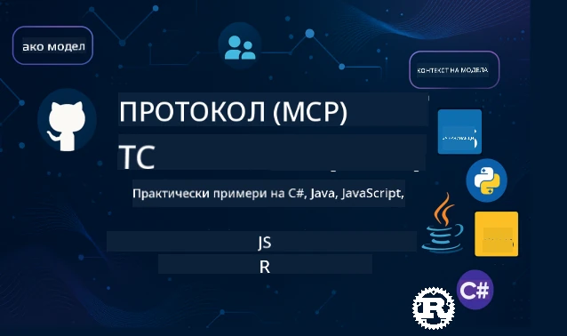

 

[](https://GitHub.com/microsoft/mcp-for-beginners/graphs/contributors)
[](https://GitHub.com/microsoft/mcp-for-beginners/issues)
[](https://GitHub.com/microsoft/mcp-for-beginners/pulls)
[](http://makeapullrequest.com)

[](https://GitHub.com/microsoft/mcp-for-beginners/watchers)
[](https://GitHub.com/microsoft/mcp-for-beginners/fork)
[](https://GitHub.com/microsoft/mcp-for-beginners/stargazers)


[](https://discord.gg/nTYy5BXMWG)

Следвайте тези стъпки, за да започнете да използвате тези ресурси:
1. **Форкнете хранилището**: Кликнете [](https://GitHub.com/microsoft/mcp-for-beginners/fork)
2. **Клонирайте хранилището**:   `git clone https://github.com/microsoft/mcp-for-beginners.git`
3. **Присъединете се към** [](https://discord.gg/nTYy5BXMWG)


### 🌐 Поддръжка на множество езици

#### Поддържа се чрез GitHub Action (Автоматично и винаги актуално)

<!-- CO-OP TRANSLATOR LANGUAGES TABLE START -->
[Arabic](../ar/README.md) | [Bengali](../bn/README.md) | [Bulgarian](./README.md) | [Burmese (Myanmar)](../my/README.md) | [Chinese (Simplified)](../zh-CN/README.md) | [Chinese (Traditional, Hong Kong)](../zh-HK/README.md) | [Chinese (Traditional, Macau)](../zh-MO/README.md) | [Chinese (Traditional, Taiwan)](../zh-TW/README.md) | [Croatian](../hr/README.md) | [Czech](../cs/README.md) | [Danish](../da/README.md) | [Dutch](../nl/README.md) | [Estonian](../et/README.md) | [Finnish](../fi/README.md) | [French](../fr/README.md) | [German](../de/README.md) | [Greek](../el/README.md) | [Hebrew](../he/README.md) | [Hindi](../hi/README.md) | [Hungarian](../hu/README.md) | [Indonesian](../id/README.md) | [Italian](../it/README.md) | [Japanese](../ja/README.md) | [Kannada](../kn/README.md) | [Korean](../ko/README.md) | [Lithuanian](../lt/README.md) | [Malay](../ms/README.md) | [Malayalam](../ml/README.md) | [Marathi](../mr/README.md) | [Nepali](../ne/README.md) | [Nigerian Pidgin](../pcm/README.md) | [Norwegian](../no/README.md) | [Persian (Farsi)](../fa/README.md) | [Polish](../pl/README.md) | [Portuguese (Brazil)](../pt-BR/README.md) | [Portuguese (Portugal)](../pt-PT/README.md) | [Punjabi (Gurmukhi)](../pa/README.md) | [Romanian](../ro/README.md) | [Russian](../ru/README.md) | [Serbian (Cyrillic)](../sr/README.md) | [Slovak](../sk/README.md) | [Slovenian](../sl/README.md) | [Spanish](../es/README.md) | [Swahili](../sw/README.md) | [Swedish](../sv/README.md) | [Tagalog (Filipino)](../tl/README.md) | [Tamil](../ta/README.md) | [Telugu](../te/README.md) | [Thai](../th/README.md) | [Turkish](../tr/README.md) | [Ukrainian](../uk/README.md) | [Urdu](../ur/README.md) | [Vietnamese](../vi/README.md)

> **Предпочитате да клонирате локално?**

> Това хранилище включва над 50 езикови превода, което значително увеличава размера на изтегляне. За да клонирате без преводи, използвайте sparse checkout:
> ```bash
> git clone --filter=blob:none --sparse https://github.com/microsoft/mcp-for-beginners.git
> cd mcp-for-beginners
> git sparse-checkout set --no-cone '/*' '!translations' '!translated_images'
> ```
> Това ви дава всичко необходимо, за да завършите курса с много по-бързо изтегляне.
<!-- CO-OP TRANSLATOR LANGUAGES TABLE END -->

# 🚀 Учебна програма за Model Context Protocol (MCP) за начинаещи

## **Научете MCP с практически примери на C#, Java, JavaScript, Rust, Python и TypeScript**

## 🧠 Преглед на учебната програма за Model Context Protocol
Добре дошли в пътуването си в света на Model Context Protocol! Ако някога сте се чудили как AI приложенията комуникират с различни инструменти и услуги, предстои да откриете елегантното решение, което променя начина, по който разработчиците създават интелигентни системи.

Представете си MCP като универсален преводач за AI приложения - точно както USB портовете ви позволяват да свържете всяко устройство към компютъра си, MCP позволява на AI модели да се свързват с всеки инструмент или услуга по стандартизиран начин. Независимо дали създавате първия си чатбот или работите по сложни AI работни потоци, разбирането на MCP ще ви даде силата да създавате по-способни и гъвкави приложения.

Тази учебна програма е създадена с търпение и грижа за вашия учебен път. Ще започнем с прости концепции, които вече разбирате, и постепенно ще изграждаме вашата експертиза чрез практически упражнения на предпочитания от вас език за програмиране. Всяка стъпка включва ясни обяснения, практични примери и много насърчение по пътя.

Когато завършите това пътуване, ще имате увереност да изградите собствен MCP сървър, да го интегрирате с популярни AI платформи и да разберете как тази технология променя бъдещето на развитието на AI. Нека започнем това вълнуващо приключение заедно!

### Официална документация и спецификации

Тези ресурси стават по-ценни с нарастването на разбирането ви, но не се чувствайте притиснати да четете всичко веднага. Започнете с областите, които ви интересуват най-много!
- 📘 [Документация на MCP](https://modelcontextprotocol.io/) – Това е вашият основен ресурс за стъпка по стъпка уроци и ръководства за потребителя. Документацията е написана с мисъл за начинаещи, предоставяйки ясни примери, които можете да следвате със свое темпо.
- 📜 [Спецификация на MCP](https://modelcontextprotocol.io/docs/) – Мислете за това като вашия обширен справочник. Докато работите по учебната програма, ще се връщате тук, за да търсите конкретни детайли и да изследвате усъвършенствани функции.
- 📜 [Оригинална спецификация на MCP](https://modelcontextprotocol.io/specification/versioning) – Тук са включени допълнителни технически детайли, които могат да са полезни за напреднали реализации. Там е, когато имате нужда от него, но не се притеснявайте за него в началото.
- 🧑‍💻 [MCP GitHub хранилище](https://github.com/modelcontextprotocol) – Тук ще намерите SDK-та, инструменти и примерен код на няколко програмни езика. Това е като съкровищница от практични примери и готови за употреба компоненти.
- 🌐 [Общност на MCP](https://github.com/orgs/modelcontextprotocol/discussions) – Присъединете се към други учащи и опитни разработчици в дискусии за MCP. Това е подкрепяща общност, където въпросите са добре дошли и знанието се споделя свободно.
  
## Учебни цели

В края на тази учебна програма ще се чувствате уверени и ентусиазирани за новите си умения. Ето какво ще постигнете:

• **Разберете основите на MCP**: Ще осъзнаете какво е Model Context Protocol и защо той революционизира начина, по който AI приложенията работят заедно, използвайки аналогии и примери, които са разбираеми.

• **Създайте първия си MCP сървър**: Ще изградите работещ MCP сървър на предпочитания от вас програмния език, започвайки с прости примери и постепенно развивайки уменията си.

• **Свържете AI модели с реални инструменти**: Ще научите как да преодолявате разликата между AI моделите и реални услуги, като придадете мощни нови възможности на приложенията си.

• **Прилагайте най-добрите практики по сигурността**: Ще разберете как да поддържате MCP реализациите си сигурни и защитени, опазвайки както приложенията, така и потребителите ви.

• **Деплойвайте с увереност**: Ще знаете как да пренесете своите MCP проекти от разработка към продукция, с практически стратегии за внедряване, които работят в реалния свят.

• **Присъединете се към общността на MCP**: Ще станете част от разрастваща се общност от разработчици, които оформят бъдещето на развитието на AI приложения. 

## Основни познания

Преди да се потопим в спецификите на MCP, нека се уверим, че се чувствате комфортно с някои основни понятия. Не се притеснявайте, ако не сте експерт в тези области – ще обясним всичко необходимо, докато напредваме!

### Разбиране на протоколите (Основата)

Мислете за протокол като правила за разговор. Когато се обаждате на приятел, и двамата знаете да кажете „здравей“ при отговора, да говорите по ред и да кажете „довиждане“ когато приключите. Компютърните програми се нуждаят от подобни правила, за да комуникират ефективно.

MCP е протокол – набор от договорени правила, които помагат на AI модели и приложения да имат продуктивни „разговори“ с инструменти и услуги. Точно както правилата на разговора правят човешката комуникация по-гладка, MCP прави комуникацията на AI приложенията много по-надеждна и мощна.

### Клиент-сървър взаимоотношения (Как работят програмите заедно)

Вие вече използвате клиент-сървър взаимоотношения ежедневно! Когато използвате уеб браузър (клиент), за да посетите уебсайт, вие се свързвате с уеб сървър, който ви изпраща съдържанието на страницата. Браузърът знае как да поиска информация, а сървърът знае как да отговори.

В MCP имаме подобна връзка: AI моделите действат като клиенти, които искат информация или действия, а MCP сървърите предоставят тези възможности. Това е като да имате помощник (сървъра), който AI може да помоли да извърши конкретни задачи.

### Защо стандартизацията е важна (Да накараме нещата да работят заедно)

Представете си, ако всеки производител на автомобили използваше различна форма на газовите помпи – щеше да ви трябва различен адаптер за всяка кола! Стандартизацията означава да се споразумеем за общи подходи, така че нещата да работят безпроблемно заедно.

MCP предоставя тази стандартизация за AI приложенията. Вместо всеки AI модел да се нуждае от персонализиран код, за да работи с всеки инструмент, MCP създава универсален начин за комуникация. Това означава, че разработчиците могат да създават инструменти веднъж и да ги използват с много различни AI системи.

## 🧭 Преглед на учебния ви път

Пътят ви в MCP е внимателно структуриран, за да изгражда постепенно вашата увереност и умения. Всяка фаза въвежда нови концепции и утвърждава наученото досега.

### 🌱 Фаза на основата: Разбиране на базовите неща (Модули 0-2)

Тук започва вашето приключение! Ще ви запознаем с MCP концепции, използвайки познати аналогии и прости примери. Ще разберете какво е MCP, защо съществува и как се вписа в по-големия свят на AI развитието.

• **Модул 0 - Въведение в MCP**: Ще започнем, като разгледаме какво е MCP и защо е толкова важно за модерните AI приложения. Ще видите реални примери как MCP работи и ще разберете как решава често срещани проблеми, пред които са изправени разработчиците.

• **Модул 1 - Обяснение на основните концепции**: Тук ще научите съществените градивни елементи на MCP. Ще използваме много аналогии и визуални примери, за да сте сигурни, че тези концепции са естествени и разбираеми.

• **Модул 2 - Сигурност в MCP**: Сигурността може да звучи плашещо, но ще ви покажем как MCP включва вградени защитни функции и ще ви научим на добри практики, които защитават приложенията ви от самото начало.

### 🔨 Фаза на изграждане: Създаване на първите ви реализации (Модул 3)

Сега започва истинското забавление! Ще получите практически опит в създаването на реални MCP сървъри и клиенти. Не се притеснявайте – ще започнем с прости неща и ще ви водим през всяка стъпка.

Този модул включва множество практически ръководства, които ви позволяват да практикувате на предпочитания от вас език за програмиране. Ще създадете първия си сървър, ще изградите клиент за връзка с него и дори ще интегрирате с популярни инструменти за разработка като VS Code.
Всеки урок включва пълни примерни кодове, съвети за отстраняване на неизправности и обяснения защо правим конкретни дизайнерски избори. В края на тази фаза ще имате работещи реализации на MCP, с които може да се гордеете!

### 🚀 Фаза на растеж: Разширени концепции и реално приложение (Модули 4-5)

След като усвоите основите, сте готови да изследвате по-усъвършенствани функции на MCP. Ще разгледаме практически стратегии за реализация, техники за отстраняване на грешки и напреднали теми като мултимодална AI интеграция.

Също така ще научите как да разширявате вашите реализации на MCP за производствено използване и как да ги интегрирате с облачни платформи като Azure. Тези модули ви подготвят да изграждате MCP решения, които могат да отговорят на реалните изисквания.

### 🌟 Фаза на майсторство: Общност и специализация (Модули 6-11)

Последната фаза се фокусира върху присъединяване към общността на MCP и специализация в области, които ви интересуват най-много. Ще научите как да допринасяте за проекти с отворен код за MCP, да прилагате усъвършенствани модели на удостоверяване и да изграждате комплексни решения с интеграция на бази данни.

Модул 11 заслужава специално внимание – той е пълен 13-лабораторен практически курс, който ви учи как да изградите MCP сървъри готови за производство с интеграция на PostgreSQL. Това е като завършващ проект, който съчетава всичко, което сте научили!

### 📚 Пълна структура на учебната програма

| Модул | Тема | Описание | Връзка |
|--------|-------|-------------|------|
| **Модул 1-3: Основи** | | | |
| 00 | Въведение в MCP | Преглед на Model Context Protocol и неговото значение в AI процесите | [Прочети повече](./00-Introduction/README.md) |
| 01 | Обяснение на основни концепции | Подробно изследване на основните концепции на MCP | [Прочети повече](./01-CoreConcepts/README.md) |
| 02 | Сигурност в MCP | Заплахи за сигурността и най-добри практики | [Прочети повече](./02-Security/README.md) |
| 03 | Първи стъпки с MCP | Настройка на средата, базови сървъри/клиенти, интеграция | [Прочети повече](./03-GettingStarted/README.md) |
| **Модул 3: Изграждане на първия сървър и клиент** | | | |
| 3.1 | Първи сървър | Създайте първия си MCP сървър | [Урок](./03-GettingStarted/01-first-server/README.md) |
| 3.2 | Първи клиент | Разработете базов MCP клиент | [Урок](./03-GettingStarted/02-client/README.md) |
| 3.3 | Клиент с LLM | Интегриране на големи езикови модели | [Урок](./03-GettingStarted/03-llm-client/README.md) |
| 3.4 | Интеграция с VS Code | Използвайте MCP сървъри в VS Code | [Урок](./03-GettingStarted/04-vscode/README.md) |
| 3.5 | stdio сървър | Създаване на сървъри с stdio транспорт | [Урок](./03-GettingStarted/05-stdio-server/README.md) |
| 3.6 | HTTP Стрийминг | Прилагане на HTTP стрийминг в MCP | [Урок](./03-GettingStarted/06-http-streaming/README.md) |
| 3.7 | AI Toolkit | Използване на AI Toolkit с MCP | [Урок](./03-GettingStarted/07-aitk/README.md) |
| 3.8 | Тестване | Тестване на вашата реализация на MCP сървър | [Урок](./03-GettingStarted/08-testing/README.md) |
| 3.9 | Деплоймънт | Деплойване на MCP сървъри в продукция | [Урок](./03-GettingStarted/09-deployment/README.md) |
| 3.10 | Напреднало използване на сървър | Използване на напреднали сървъри за усъвършенствани функции и подобрена архитектура | [Урок](./03-GettingStarted/10-advanced/README.md) |
| 3.11 | Проста автентикация | Глава, показваща удостоверяване от начало и RBAC | [Урок](./03-GettingStarted/11-simple-auth/README.md) |
| **Модул 4-5: Практически и напреднали** | | | |
| 04 | Практическа реализация | SDK-та, отстраняване на грешки, тестване, многократно използваеми шаблони за заявки | [Прочети повече](./04-PracticalImplementation/README.md) |
| 05 | Разширени теми в MCP | Мултимодална AI, мащабиране, корпоративно използване | [Прочети повече](./05-AdvancedTopics/README.md) |
| 5.1 | Интеграция с Azure | Интеграция на MCP с Azure | [Урок](./05-AdvancedTopics/mcp-integration/README.md) |
| 5.2 | Мултимодалност | Работа с множество модалности | [Урок](./05-AdvancedTopics/mcp-multi-modality/README.md) |
| 5.3 | OAuth2 Демонстрация | Прилагане на удостоверяване OAuth2 | [Урок](./05-AdvancedTopics/mcp-oauth2-demo/README.md) |
| 5.4 | Root Contexts | Разбиране и прилагане на root contexts | [Урок](./05-AdvancedTopics/mcp-root-contexts/README.md) |
| 5.5 | Маршрутизиране | Стратегии за маршрутизиране в MCP | [Урок](./05-AdvancedTopics/mcp-routing/README.md) |
| 5.6 | Семплиране | Техники за семплиране в MCP | [Урок](./05-AdvancedTopics/mcp-sampling/README.md) |
| 5.7 | Мащабиране | Мащабиране на MCP реализации | [Урок](./05-AdvancedTopics/mcp-scaling/README.md) |
| 5.8 | Сигурност | Разширени съображения за сигурност | [Урок](./05-AdvancedTopics/mcp-security/README.md) |
| 5.9 | Уеб търсене | Прилагане на уеб търсене | [Урок](./05-AdvancedTopics/web-search-mcp/README.md) |
| 5.10 | Реално време стрийминг | Изграждане на функционалност за стрийминг в реално време | [Урок](./05-AdvancedTopics/mcp-realtimestreaming/README.md) |
| 5.11 | Реално време търсене | Прилагане на търсене в реално време | [Урок](./05-AdvancedTopics/mcp-realtimesearch/README.md) |
| 5.12 | Entra ID Удостоверяване | Удостоверяване с Microsoft Entra ID | [Урок](./05-AdvancedTopics/mcp-security-entra/README.md) |
| 5.13 | Интеграция с Foundry | Интеграция с Azure AI Foundry | [Урок](./05-AdvancedTopics/mcp-foundry-agent-integration/README.md) |
| 5.14 | Контекст инженеринг | Техники за ефективен контекст инженеринг | [Урок](./05-AdvancedTopics/mcp-contextengineering/README.md) |
| 5.15 | MCP Персонализиран транспорт | Имплементации на персонализиран транспорт | [Урок](./05-AdvancedTopics/mcp-transport/README.md) |
| **Модул 6-10: Общност и най-добри практики** | | | |
| 06 | Приноси в общността | Как да допринасяте за екосистемата на MCP | [Урок](./06-CommunityContributions/README.md) |
| 07 | Уроци от ранното приемане | Реални истории от имплементации | [Урок](./07-LessonsFromEarlyAdoption/README.md) |
| 08 | Най-добри практики за MCP | Производителност, толерантност към грешки, устойчивост | [Урок](./08-BestPractices/README.md) |
| 09 | Проучвания на случаи MCP | Практически примери за имплементации | [Урок](./09-CaseStudy/README.md) |
| 10 | Практически семинар | Изграждане на MCP сървър с AI Toolkit | [Лаборатория](./10-StreamliningAIWorkflowsBuildingAnMCPServerWithAIToolkit/README.md) |
| **Модул 11: Практически лаборатории MCP сървър** | | | |
| 11 | Интеграция MCP сървър с база данни | Изчерпателен 13-лабораторен практически курс за интеграция на PostgreSQL | [Лаборатории](./11-MCPServerHandsOnLabs/README.md) |
| 11.1 | Въведение | Преглед на MCP с интеграция на база данни и случай за анализ на търговия на дребно | [Лаб 00](./11-MCPServerHandsOnLabs/00-Introduction/README.md) |
| 11.2 | Основна архитектура | Разбиране на MCP сървърна архитектура, слоеве на база данни и модели за сигурност | [Лаб 01](./11-MCPServerHandsOnLabs/01-Architecture/README.md) |
| 11.3 | Сигурност и мулти-използваемост | Редово ниво на сигурност, удостоверяване и мулти-клиентски достъп до данни | [Лаб 02](./11-MCPServerHandsOnLabs/02-Security/README.md) |
| 11.4 | Настройка на среда | Настройка на развойна среда, Docker, ресурси Azure | [Лаб 03](./11-MCPServerHandsOnLabs/03-Setup/README.md) |
| 11.5 | Дизайн на база данни | Настройка на PostgreSQL, дизайн на схема за търговия и примерни данни | [Лаб 04](./11-MCPServerHandsOnLabs/04-Database/README.md) |
| 11.6 | Реализация на MCP сървър | Изграждане на FastMCP сървър с интеграция на база данни | [Лаб 05](./11-MCPServerHandsOnLabs/05-MCP-Server/README.md) |
| 11.7 | Разработка на инструменти | Създаване на инструменти за заявки към базата и инспекция на схемата | [Лаб 06](./11-MCPServerHandsOnLabs/06-Tools/README.md) |
| 11.8 | Семантично търсене | Прилагане на векторни вграждания с Azure OpenAI и pgvector | [Лаб 07](./11-MCPServerHandsOnLabs/07-Semantic-Search/README.md) |
| 11.9 | Тестване и отстраняване на грешки | Стратегии за тестване, инструменти за дебъг и подходи за валидиране | [Лаб 08](./11-MCPServerHandsOnLabs/08-Testing/README.md) |
| 11.10 | Интеграция с VS Code | Конфигуриране на интеграция MCP с VS Code и използване на AI Chat | [Лаб 09](./11-MCPServerHandsOnLabs/09-VS-Code/README.md) |
| 11.11 | Стратегии за деплоймънт | Деплой с Docker, Azure Container Apps и съображения за мащабиране | [Лаб 10](./11-MCPServerHandsOnLabs/10-Deployment/README.md) |
| 11.12 | Мониторинг | Application Insights, логиране, мониторинг на производителността | [Лаб 11](./11-MCPServerHandsOnLabs/11-Monitoring/README.md) |
| 11.13 | Най-добри практики | Оптимизация на производителността, усилване на сигурността и съвети за продукция | [Лаб 12](./11-MCPServerHandsOnLabs/12-Best-Practices/README.md) |

### 💻 Примерни кодови проекти

Една от най-интересните части на изучаването на MCP е да наблюдавате как уменията ви в кодирането се развиват постепенно. Проектирахме примерите си за код да започват просто и да стават по-сложни с развитието на вашето разбиране. Ето как въвеждаме концепциите – с код, който е лесен за разбиране, но демонстрира реални MCP принципи, ще разберете не само какво прави този код, а и защо е структуриран по този начин и как се вписва в по-големи MCP приложения.

#### Основни примери за MCP калкулатор

| Език | Описание | Връзка |
|----------|-------------|------|
| C# | Пример MCP сървър | [Виж кода](./03-GettingStarted/samples/csharp/README.md) |
| Java | MCP Калкулатор | [Виж кода](./03-GettingStarted/samples/java/calculator/README.md) |
| JavaScript | MCP Демонстрация | [Виж кода](./03-GettingStarted/samples/javascript/README.md) |
| Python | MCP Сървър | [Виж кода](../../03-GettingStarted/samples/python/mcp_calculator_server.py) |
| TypeScript | MCP Пример | [Виж кода](./03-GettingStarted/samples/typescript/README.md) |
| Rust | MCP Пример | [Виж кода](./03-GettingStarted/samples/rust/README.md) |

#### Напреднали реализации на MCP

| Език | Описание | Връзка |
|----------|-------------|------|
| C# | Напреднал пример | [Виж кода](./04-PracticalImplementation/samples/csharp/README.md) |
| Java с Spring | Пример Container App | [Виж кода](./04-PracticalImplementation/samples/java/containerapp/README.md) |
| JavaScript | Напреднал пример | [Виж кода](./04-PracticalImplementation/samples/javascript/README.md) |
| Python | Сложна реализация | [Виж кода](../../04-PracticalImplementation/samples/python/READMEmd) |
| TypeScript | Контейнерен пример | [Виж кода](./04-PracticalImplementation/samples/typescript/README.md) |


## 🎯 Изисквания за изучаване на MCP

За да извлечете максимална полза от тази учебна програма, трябва да имате:

- Основни познания по програмиране поне в един от следните езици: C#, Java, JavaScript, Python или TypeScript
- Разбиране на клиент-сървър модел и API-та
- Запознаване с REST и HTTP концепции
- (По избор) Познания в областта на AI/ML концепциите

- Участие в дискусиите в нашата общност за подкрепа

## 📚 Учебно ръководство и ресурси

Това хранилище включва няколко ресурса, които да ви помогнат да навигирате и учите ефективно:

### Учебно ръководство

Разполага с изчерпателно [Учебно ръководство](./study_guide.md), което ще ви помогне да се ориентирате ефективно в това хранилище. Тази визуална карта на учебната програма показва как всички теми са свързани и предлага насоки как да използвате примерните проекти ефективно. Особено полезно е, ако сте визуален ученик, който обича да вижда цялостната картина.

Ръководството включва:
- Визуална карта на учебната програма, показваща всички покрити теми
- Подробно разграничение на всяка част от хранилището
- Насоки за използване на примерните проекти
- Препоръчани обучителни пътеки за различни нива на умения
- Допълнителни ресурси за подпомагане на обучението ви

### Промени и актуализации

Поддържаме детайлен [Changelog](./changelog.md), който проследява всички значими актуализации на учебните материали, за да бъдете в течение с най-новите подобрения и допълнения.
- Добавяне на ново съдържание
- Структурни промени
- Подобрения на функции
- Актуализации на документацията

## 🛠️ Как да използвате тази учебна програма ефективно

Всеки урок в това ръководство включва:
1. Ясни обяснения на концепциите на MCP  
2. Примери с жив код на множество езици  
3. Упражнения за създаване на реални MCP приложения  
4. Допълнителни ресурси за напреднали ученици

## Съдържание при поискване

### [MCP Dev Days юли 2025](https://developer.microsoft.com/en-us/reactor/series/S-1563/)
#### [➡️Гледайте при поискване - MCP Dev Days](https://developer.microsoft.com/en-us/reactor/series/S-1563/)
Подгответе се за два дни на задълбочени технически прозрения, свързване с общността и практическо обучение на MCP Dev Days – виртуално събитие, посветено на Model Context Protocol (MCP) — възникващия стандарт, който свързва AI модели и инструментите, които използват.  
Можете да гледате MCP Dev Days като се регистрирате на нашата страница за събитието: https://aka.ms/mcpdevdays.

#### [Ден 1: Производителност на MCP, DevTools и общност:](https://developer.microsoft.com/en-us/reactor/series/S-1563/)

е посветен на овластяване на разработчиците да използват MCP в своя работен поток и празнуване на невероятната общност на MCP. Ще се присъединят членове на общността и партньори като Arcade, Block, Okta и Neon, за да покажат как си сътрудничат с Microsoft за оформяне на отворена, разширяема екосистема на MCP.  
Демо от реалния свят в VS Code, Visual Studio, GitHub Copilot и популярни инструменти от общността  
Практически, контекстно ориентирани работни потоци за разработчици  
Сесии и прозрения, водени от общността  
Независимо дали току-що започвате с MCP или вече изграждате с него, Ден 1 ще постави основата с вдъхновение и приложими изводи.

#### [Ден 2: Изграждане на MCP сървъри с увереност](https://developer.microsoft.com/en-us/reactor/series/S-1563/)

е за разработчиците на MCP. Ще навлезем дълбоко в стратегии за внедряване и добри практики за създаване на MCP сървъри и интегриране на MCP във вашите AI работни потоци.

#### Теми включват:

- Изграждане на MCP сървъри и интегрирането им в агентски преживявания  
- Разработка, движена от подсказки  
- Най-добри практики за сигурност  
- Използване на компоненти като Функции, ACA и Управление на API  
- Съгласуване с регистъра и инструменти (1P + 3P)

Ако сте разработчик, създател на инструменти или стратег за AI продукти, този ден е пълен с прозрения, от които се нуждаете, за да изграждате мащабируеми, сигурни и готови за бъдещето MCP решения.

### MCP Boot Camp август 2025  
Научете в интензивни видео сесии как да създавате MCP сървъри, да интегрирате с VS Code и да внедрявате професионално в Azure въз основа на съдържанието от програмата MCP за начинаещи. Излезте с практическите умения в технология, която големи компании вече използват.

#### [➡️Гледайте при поискване MCP Bootcamp | Английски](https://developer.microsoft.com/en-us/reactor/series/s-1568/)
#### [➡️Гледайте при поискване MCP Bootcamp | Бразилия](https://developer.microsoft.com/en-us/reactor/series/S-1566/)
#### [➡️Гледайте при поискване MCP Bootcamp | Испански](https://developer.microsoft.com/en-us/reactor/series/S-1567/)

### Нека учим MCP с C# - серия уроци  
Нека се запознаем с Model Context Protocol (MCP), модерна рамка, създадена за стандартизиране на взаимодействията между AI модели и клиентски приложения. Чрез тази лесна за начинаещи сесия ще ви представим MCP и ще ви преведем през създаването на първия ви MCP сървър.  
#### C#: [https://aka.ms/letslearnmcp-csharp](https://aka.ms/letslearnmcp-csharp)  
#### Java: [https://aka.ms/letslearnmcp-java](https://aka.ms/letslearnmcp-java)  
#### JavaScript: [https://aka.ms/letslearnmcp-javascript](https://aka.ms/letslearnmcp-javascript)  
#### Python: [https://aka.ms/letslearnmcp-python](https://aka.ms/letslearnmcp-python)

## 🎓 Вашето пътуване с MCP започва

Поздравления! Вие току-що направихте първата стъпка в вълнуващо пътуване, което ще разшири вашите програмистки възможности и ще ви свърже с най-съвременните AI разработки.

### Какво вече сте постигнали

Четейки това въведение, вие вече започнахте да изграждате основите на знанията си за MCP. Разбирате какво е MCP, защо е важно и как тази учебна програма ще подкрепи вашето учене. Това е значително постижение и началото на вашия опит в тази важна технология.

### Предстоящото приключение

Докато напредвате през модулите, помнете, че всеки експерт е бил някога начинаещ. Концепциите, които може да изглеждат сложни сега, ще станат втора природа, докато практикувате и прилагате наученото. Всяка малка стъпка води към мощни възможности, които ще ви служат през цялата ви кариера в разработката.

### Вашата мрежа за подкрепа

Присъединявате се към общност от ученици и експерти, които са запалени по MCP и с желание помагат на другите да успеят. Независимо дали сте заседнали при предизвикателство в кодирането или искате да споделите пробив, общността е тук, за да подкрепи вашето пътуване.

Ако заседнете или имате въпроси за изграждането на AI приложения, присъединете се към други ученици и опитни разработчици в обсъждания за MCP. Това е подкрепяща общност, където въпросите са добре дошли и знанията се споделят свободно.

[](https://discord.gg/nTYy5BXMWG)

Ако имате обратна връзка за продукта или грешки по време на разработка, посетете: 

[](https://aka.ms/foundry/forum)

### Готови ли сте да започнете?

Вашето приключение с MCP започва сега! Започнете с Модул 0, за да навлезете в първите си практически MCP преживявания, или разгледайте примерните проекти, за да видите какво ще изграждате. Запомнете - всеки експерт е започнал точно там, където сте вие сега, и с търпение и практика ще се удивите на постигнатото.

Добре дошли в света на разработката на Model Context Protocol. Нека изградим нещо невероятно заедно!

## 🤝 Принос към учебната общност

Тази учебна програма става по-силна с приноси от ученици като вас! Независимо дали поправяте правописна грешка, предлагате по-ясно обяснение или добавяте нов пример, вашите приноси помагат на други начинаещи да успеят.

Благодарим на Microsoft Valued Professional [Shivam Goyal](https://www.linkedin.com/in/shivam2003/) за предоставените кодови примери.

Процесът на принос е проектиран да бъде приветлив и подкрепящ. Повечето приноси изискват споразумение за лицензиране на приноса (CLA), но автоматизираните инструменти ще ви преведат през процеса гладко.

## 📜 Отворено обучение с изходен код

Цялата учебна програма е достъпна под MIT [LICENSE](../../LICENSE), което означава, че можете да я използвате, модифицирате и споделяте свободно. Това подкрепя нашата мисия да направим знанията за MCP достъпни за разработчици навсякъде.

## 🤝 Правила за приноси

Този проект приветства приноси и предложения. Повечето приноси изискват да се съгласите с  
Contributor License Agreement (CLA), който декларира, че имате право и на практика предоставяте  
правата за използване на вашия принос. За подробности посетете <https://cla.opensource.microsoft.com>.  

Когато подадете pull request, CLA бот автоматично определя дали трябва да предоставите CLA  
и отговаря подходящо (например проверка на статус, коментар). Просто следвайте инструкциите на бота.  
Ще трябва да направите това само веднъж за всички хранилища, използващи нашия CLA.

Този проект прилага [Microsoft Open Source Code of Conduct](https://opensource.microsoft.com/codeofconduct/).  
За повече информация вижте [Често задавани въпроси за Кодекса на поведение](https://opensource.microsoft.com/codeofconduct/faq/) или  
се свържете с [opencode@microsoft.com](mailto:opencode@microsoft.com) за допълнителни въпроси или коментари.

---

*Готови да започнете вашето пътуване с MCP? Започнете с [Модул 00 - Въведение в MCP](./00-Introduction/README.md) и направете първите си стъпки в света на разработката на Model Context Protocol!*


## 🎒 Други курсове
Нашият екип създава и други курсове! Разгледайте:

<!-- CO-OP TRANSLATOR OTHER COURSES START -->
### LangChain
[](https://aka.ms/langchain4j-for-beginners)
[](https://aka.ms/langchainjs-for-beginners?WT.mc_id=m365-94501-dwahlin)

---

### Azure / Edge / MCP / Агенти
[](https://github.com/microsoft/AZD-for-beginners?WT.mc_id=academic-105485-koreyst)
[](https://github.com/microsoft/edgeai-for-beginners?WT.mc_id=academic-105485-koreyst)
[](https://github.com/microsoft/mcp-for-beginners?WT.mc_id=academic-105485-koreyst)
[](https://github.com/microsoft/ai-agents-for-beginners?WT.mc_id=academic-105485-koreyst)

---

### Серия за генеративен AI  
[](https://github.com/microsoft/generative-ai-for-beginners?WT.mc_id=academic-105485-koreyst)
[-9333EA?style=for-the-badge&labelColor=E5E7EB&color=9333EA)](https://github.com/microsoft/Generative-AI-for-beginners-dotnet?WT.mc_id=academic-105485-koreyst)
[-C084FC?style=for-the-badge&labelColor=E5E7EB&color=C084FC)](https://github.com/microsoft/generative-ai-for-beginners-java?WT.mc_id=academic-105485-koreyst)
[-E879F9?style=for-the-badge&labelColor=E5E7EB&color=E879F9)](https://github.com/microsoft/generative-ai-with-javascript?WT.mc_id=academic-105485-koreyst)

---

### Основно обучение  
[](https://aka.ms/ml-beginners?WT.mc_id=academic-105485-koreyst)
[](https://aka.ms/datascience-beginners?WT.mc_id=academic-105485-koreyst)
[](https://aka.ms/ai-beginners?WT.mc_id=academic-105485-koreyst)
[](https://github.com/microsoft/Security-101?WT.mc_id=academic-96948-sayoung)
[](https://aka.ms/webdev-beginners?WT.mc_id=academic-105485-koreyst)
[](https://aka.ms/iot-beginners?WT.mc_id=academic-105485-koreyst)
[](https://github.com/microsoft/xr-development-for-beginners?WT.mc_id=academic-105485-koreyst)

---
 
### Серия Copilot
[](https://aka.ms/GitHubCopilotAI?WT.mc_id=academic-105485-koreyst)
[](https://github.com/microsoft/mastering-github-copilot-for-dotnet-csharp-developers?WT.mc_id=academic-105485-koreyst)
[](https://github.com/microsoft/CopilotAdventures?WT.mc_id=academic-105485-koreyst)
<!-- CO-OP TRANSLATOR OTHER COURSES END -->

---

<!-- CO-OP TRANSLATOR DISCLAIMER START -->
**Отказ от отговорност**:  
Този документ е преведен с помощта на AI преводаческа услуга [Co-op Translator](https://github.com/Azure/co-op-translator). Въпреки че се стремим към точност, моля, имайте предвид, че автоматизираните преводи могат да съдържат грешки или неточности. Оригиналният документ на неговия роден език трябва да се счита за авторитетен източник. За критична информация се препоръчва професионален превод от човек. Не носим отговорност за каквито и да е недоразумения или погрешни тълкувания, възникнали при използването на този превод.
<!-- CO-OP TRANSLATOR DISCLAIMER END -->