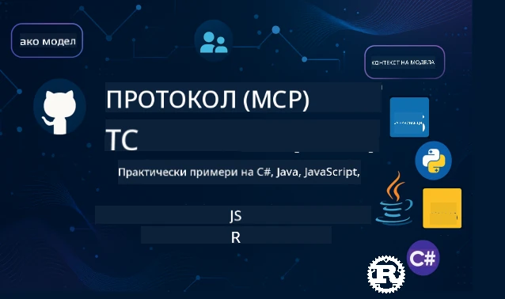

 

[](https://GitHub.com/microsoft/mcp-for-beginners/graphs/contributors)
[](https://GitHub.com/microsoft/mcp-for-beginners/issues)
[](https://GitHub.com/microsoft/mcp-for-beginners/pulls)
[](http://makeapullrequest.com)

[](https://GitHub.com/microsoft/mcp-for-beginners/watchers)
[](https://GitHub.com/microsoft/mcp-for-beginners/fork)
[](https://GitHub.com/microsoft/mcp-for-beginners/stargazers)


[](https://discord.gg/nTYy5BXMWG)

Следвайте тези стъпки, за да започнете да използвате тези ресурси:
1. **Форкнете хранилището**: Кликнете [](https://GitHub.com/microsoft/mcp-for-beginners/fork)
2. **Клонирайте хранилището**:   `git clone https://github.com/microsoft/mcp-for-beginners.git`
3. **Присъединете се към** [](https://discord.gg/nTYy5BXMWG)


### 🌐 Многоезична поддръжка

#### Поддържано чрез GitHub Action (Автоматизирано и винаги обновено)

<!-- CO-OP TRANSLATOR LANGUAGES TABLE START -->
[Арабски](../ar/README.md) | [Бенгалски](../bn/README.md) | [Български](./README.md) | [Бирмански (Мианмар)](../my/README.md) | [Китайски (опростен)](../zh-CN/README.md) | [Китайски (традиционен, Хонконг)](../zh-HK/README.md) | [Китайски (традиционен, Макао)](../zh-MO/README.md) | [Китайски (традиционен, Тайван)](../zh-TW/README.md) | [Хърватски](../hr/README.md) | [Чешки](../cs/README.md) | [Датски](../da/README.md) | [Холандски](../nl/README.md) | [Естонски](../et/README.md) | [Финландски](../fi/README.md) | [Френски](../fr/README.md) | [Немски](../de/README.md) | [Гръцки](../el/README.md) | [Еврейски](../he/README.md) | [Хинди](../hi/README.md) | [Унгарски](../hu/README.md) | [Индонезийски](../id/README.md) | [Италиански](../it/README.md) | [Японски](../ja/README.md) | [Каннада](../kn/README.md) | [Корейски](../ko/README.md) | [Литовски](../lt/README.md) | [Малайски](../ms/README.md) | [Малаялам](../ml/README.md) | [Марати](../mr/README.md) | [Непалски](../ne/README.md) | [Нигерийски пиджин](../pcm/README.md) | [Норвежки](../no/README.md) | [Персийски (Фарси)](../fa/README.md) | [Полски](../pl/README.md) | [Португалски (Бразилия)](../pt-BR/README.md) | [Португалски (Португалия)](../pt-PT/README.md) | [Пенджаби (Гурмухи)](../pa/README.md) | [Румънски](../ro/README.md) | [Руски](../ru/README.md) | [Сръбски (кирилица)](../sr/README.md) | [Словашки](../sk/README.md) | [Словенски](../sl/README.md) | [Испански](../es/README.md) | [Суахили](../sw/README.md) | [Шведски](../sv/README.md) | [Тагалог (Филипински)](../tl/README.md) | [Тамилски](../ta/README.md) | [Телугу](../te/README.md) | [Тайски](../th/README.md) | [Турски](../tr/README.md) | [Украински](../uk/README.md) | [Урду](../ur/README.md) | [Виетнамски](../vi/README.md)

> **Предпочитате да клонирате локално?**
>
> Това хранилище включва над 50 езикови превода, което значително увеличава размера за изтегляне. За да клонирате без преводи, използвайте sparse checkout:
>
> **Bash / macOS / Linux:**
> ```bash
> git clone --filter=blob:none --sparse https://github.com/microsoft/mcp-for-beginners.git
> cd mcp-for-beginners
> git sparse-checkout set --no-cone '/*' '!translations' '!translated_images'
> ```
>
> **CMD (Windows):**
> ```cmd
> git clone --filter=blob:none --sparse https://github.com/microsoft/mcp-for-beginners.git
> cd mcp-for-beginners
> git sparse-checkout set --no-cone "/*" "!translations" "!translated_images"
> ```
>
> Това ви предоставя всичко необходимо за завършване на курса с много по-бързо изтегляне.
<!-- CO-OP TRANSLATOR LANGUAGES TABLE END -->

# 🚀 Учебна програма за Model Context Protocol (MCP) за начинаещи

## **Научете MCP с практически примери на C#, Java, JavaScript, Rust, Python и TypeScript**

## 🧠 Обзор на учебната програма Model Context Protocol
Добре дошли на вашето пътешествие в света на Model Context Protocol! Ако някога сте се чудили как AI приложенията комуникират с различни инструменти и услуги, предстои да откриете елегантното решение, което преобразява начина, по който разработчиците изграждат интелигентни системи.

Мислете за MCP като универсален преводач за AI приложения – точно както USB портовете ви позволяват да свързвате всяко устройство с вашия компютър, MCP позволява на AI модели да се свързват с всеки инструмент или услуга по стандартизиран начин. Независимо дали създавате своя първи чатбот или работите върху сложни AI работни потоци, разбирането на MCP ще ви даде силата да създавате по-мощни и гъвкави приложения.

Тази учебна програма е създадена с търпение и грижа за вашето обучение. Ще започнем с прости концепции, които вече знаете, и постепенно ще изграждаме вашите умения чрез практически опит на любимия ви програмен език. Всяка стъпка включва ясни обяснения, практически примери и много подкрепа.

Когато завършите това пътешествие, ще имате увереността да изграждате свои собствени MCP сървъри, да ги интегрирате с популярни AI платформи и да разбирате как тази технология оформя бъдещето на AI разработката. Нека започнем това вълнуващо приключение заедно!

### Официална документация и спецификации

Тази учебна програма е съобразена с **MCP Спецификация 2025-11-25** (най-новото стабилно издание). MCP спецификацията използва версии, базирани на дати (формат ГГГГ-ММ-ДД), за да осигури ясна проследимост на протоколните версии.

Тези ресурси стават още по-ценни с растящото ви разбиране, но не се чувствайте принудени да четете всичко веднага. Започнете с областите, които ви интересуват най-много!
- 📘 [MCP Документация](https://modelcontextprotocol.io/) – Това е основният ви ресурс за стъпка по стъпка ръководства и потребителски упътвания. Документацията е написана с мисъл за начинаещи, предоставяйки ясни примери, които можете да следвате със собствено темпо.
- 📜 [MCP Спецификация](https://modelcontextprotocol.io/specification/2025-11-25) – Помислете за това като за вашето подробно справочно ръководство. Докато вървите през учебната програма, ще се връщате тук, за да търсите конкретни детайли и да изследвате разширени функции.
- 📜 [Версиониране на MCP Спецификацията](https://modelcontextprotocol.io/specification/versioning) – Този ресурс съдържа информация за историята на протоколните версии и как MCP използва датиран формат за версии (ГГГГ-ММ-ДД).
- 🧑‍💻 [MCP GitHub хранилище](https://github.com/modelcontextprotocol) – Тук ще намерите SDK-та, инструменти и примери за код на няколко програмни езика. Това е като съкровищница от практически примери и компоненти, готови за използване.
- 🌐 [MCP Общество](https://github.com/orgs/modelcontextprotocol/discussions) – Присъединете се към други учащи и опитни разработчици в дискусии за MCP. Това е подкрепяща общност, където въпросите са добре дошли, а знанието се споделя свободно.
  
## Цели на обучението

До края на тази учебна програма ще се чувствате уверени и развълнувани от новите си умения. Ето какво ще постигнете:

• **Разбиране на основите на MCP**: Ще усвоите какво представлява Model Context Protocol и защо революционизира начина, по който AI приложенията работят заедно, използвайки аналогии и примери, които са лесни за разбиране.

• **Създаване на вашия първи MCP сървър**: Ще изградите работещ MCP сървър на предпочитания от вас програмен език, започвайки с прости примери и постепенно разширявайки уменията си.

• **Свързване на AI модели с реални инструменти**: Ще научите как да изградите мост между AI моделите и истински услуги, като давате на приложенията си нови мощни възможности.

• **Прилагане на най-добри практики за сигурност**: Ще разберете как да пазите вашите MCP реализации безопасни, защитавйки както приложенията, така и потребителите си.

• **Деплойване с увереност**: Ще знаете как да прехвърлите вашите MCP проекти от разработка до продукция, с практични стратегии за внедряване, които работят в реалния свят.

• **Присъединяване към MCP общността**: Ще станете част от растяща общност разработчици, които оформят бъдещето на разработката на AI приложения.

## Необходима основа

Преди да се потопим в MCP специфики, нека се уверим, че сте комфортни с някои основни концепции. Не се тревожете, ако не сте експерт — ние ще обясним всичко необходимо по пътя!

### Разбиране на протоколите (Основата)

Помислете за протокола като за правилата на един разговор. Когато се обаждате на приятел, и двамата знаете да кажете „здравей“ при вдигане, да говорите по ред и да кажете „довиждане“ като приключите. Компютърните програми се нуждаят от подобни правила, за да комуникират ефективно.

MCP е протокол – набор от договорени правила, които помагат на AI модели и приложения да водят продуктивни „разговори“ с инструменти и услуги. Точно както правилата за разговор правят човешката комуникация по-гладка, MCP прави комуникацията между AI приложенията по-надеждна и мощна.

### Връзки клиент-сървър (Как програмите работят заедно)

Вие вече ежедневно използвате клиент-сървър връзки! Когато използвате уеб браузър (клиент) за посещение на уебсайт, вие се свързвате с уеб сървър, който ви изпраща съдържанието. Браузърът знае как да поиска информация, а сървърът знае как да отговори.

В MCP имаме подобна връзка: AI моделите действат като клиенти, които искат информация или действия, докато MCP сървърите предоставят тези възможности. Това е като помощник (сървър), на когото AI може да поиска изпълнение на конкретни задачи.

### Защо стандартизацията е важна (Как да работим заедно)

Представете си, ако всеки производител на коли използва различна форма на газови помпи – щеше да ви трябва по един адаптер за всяка кола! Стандартизацията означава да се съгласим на общи подходи, за да работим безпроблемно заедно.

MCP осигурява тази стандартизация за AI приложения. Вместо всеки AI модел да се нуждае от специален код за всяка услуга, MCP създава универсален начин за комуникация. Това означава, че разработчиците могат да изграждат инструменти веднъж и да работят с много различни AI системи.

## 🧭 Общ преглед на вашия обучителен път

Вашето MCP пътешествие е внимателно структурирано, за да изгражда увереност и умения постепенно. Всеки етап въвежда нови концепции, като затвърждава вече наученото.

### 🌱 Основен етап: Запознаване с основите (Модули 0-2)

Тук започва вашето приключение! Ще ви въведем в концепциите на MCP чрез познати аналогии и прости примери. Ще разберете какво е MCP, защо съществува и как се вписва в по-широкия свят на AI разработката.

• **Модул 0 - Въведение в MCP**: Започваме с изследване на това какво е MCP и защо е толкова важно за съвременните AI приложения. Ще видите реални примери на MCP в действие и ще разберете как решава често срещани проблеми за разработчиците.

• **Модул 1 - Обяснение на основните концепции**: Тук ще научите ключовите градивни елементи на MCP. Ще използваме много аналогии и визуални примери, за да направим тези концепции ясни и лесно разбираеми.

• **Модул 2 - Сигурност в MCP**: Сигурността може да звучи плашещо, но ще ви покажем как MCP включва вградени защитни функции и ще ви научим на най-добрите практики за защита на приложенията ви от самото начало.

### 🔨 Етап на изграждане: Създаване на първи реализации (Модул 3)

Сега започва истинското забавление! Ще имате практичен опит в изграждането на реални MCP сървъри и клиенти. Не се притеснявайте – започваме от лесните неща и ще ви напътстваме на всяка стъпка.
Този модул включва няколко практически ръководства, които ви позволяват да практикувате на предпочитания от вас програмен език. Ще създадете първия си сървър, ще изградите клиент за свързване с него и дори ще интегрирате с популярни инструменти за разработка като VS Code.

Всяко ръководство включва пълни примери с код, съвети за отстраняване на неизправности и обяснения защо правим конкретни дизайн избори. В края на тази фаза ще имате работещи MCP реализации, с които можете да се гордеете!

### 🚀 Фаза на развитие: Разширени концепции и реално приложение (Модули 4-5)

След като усвоите основите, сте готови да разгледате по-сложни функции на MCP. Ще обхванем практически стратегии за изпълнение, техники за отстраняване на грешки и напреднали теми като мултимодална AI интеграция.

Също така ще научите как да мащабирате вашите MCP реализации за производствена употреба и да интегрирате с облачни платформи като Azure. Тези модули ви подготвят да изграждате MCP решения, способни да се справят с реалните изисквания.

### 🌟 Фаза на майсторство: Общност и специализация (Модули 6-11)

Последната фаза се фокусира върху присъединяване към MCP общността и специализиране в области, които ви интересуват най-много. Ще научите как да допринасяте за отворени MCP проекти, да прилагате напреднали модели за удостоверяване и да изграждате цялостни решения с интеграция на бази данни.

Модул 11 заслужава специално внимание - това е пълна учебна пътека с 13 лабораторни упражнения, която ви учи как да изграждате MCP сървъри готови за производство с интеграция на PostgreSQL. Той е като крайният проект, който обединява всичко, което сте научили!

### 📚 Пълна структура на учебната програма

| Модул | Тема | Описание | Линк |
|--------|-------|-------------|------|
| **Модул 0-3: Основи** | | | |
| 00 | Въведение в MCP | Преглед на Model Context Protocol и значението му в AI пайплайни | [Прочети повече](./00-Introduction/README.md) |
| 01 | Обяснение на основните концепции | Задълбочено разглеждане на основни MCP концепции | [Прочети повече](./01-CoreConcepts/README.md) |
| 02 | Сигурност в MCP | Заплахи за сигурността и най-добри практики | [Прочети повече](./02-Security/README.md) |
| 03 | Започване с MCP | Настройка на средата, базови сървъри/клиенти, интеграция | [Прочети повече](./03-GettingStarted/README.md) |
| **Модул 3: Създаване на първия ви сървър и клиент** | | | |
| 3.1 | Първи сървър | Създайте първия си MCP сървър | [Ръководство](./03-GettingStarted/01-first-server/README.md) |
| 3.2 | Първи клиент | Разработете базов MCP клиент | [Ръководство](./03-GettingStarted/02-client/README.md) |
| 3.3 | Клиент с LLM | Интеграция на големи езикови модели | [Ръководство](./03-GettingStarted/03-llm-client/README.md) |
| 3.4 | Интеграция с VS Code | Използвайте MCP сървъри във VS Code | [Ръководство](./03-GettingStarted/04-vscode/README.md) |
| 3.5 | stdio сървър | Създайте сървъри с stdio транспорт | [Ръководство](./03-GettingStarted/05-stdio-server/README.md) |
| 3.6 | HTTP стрийминг | Реализирайте HTTP стрийминг в MCP | [Ръководство](./03-GettingStarted/06-http-streaming/README.md) |
| 3.7 | AI Toolkit | Използвайте AI Toolkit с MCP | [Ръководство](./03-GettingStarted/07-aitk/README.md) |
| 3.8 | Тестове | Тествайте реализацията на MCP сървъра си | [Ръководство](./03-GettingStarted/08-testing/README.md) |
| 3.9 | Деплоймънт | Разполагане на MCP сървъри в продукция | [Ръководство](./03-GettingStarted/09-deployment/README.md) |
| 3.10 | Разширено използване на сървъра | Използвайте разширени сървъри за усъвършенствани функции и подобрена архитектура | [Ръководство](./03-GettingStarted/10-advanced/README.md) |
| 3.11 | Просто удостоверяване | Глава, показваща ви удостоверяването от начинаещо ниво и RBAC | [Ръководство](./03-GettingStarted/11-simple-auth/README.md) |
| 3.12 | MCP хостове | Конфигурирайте Claude Desktop, Cursor, Cline и други MCP хостове | [Ръководство](./03-GettingStarted/12-mcp-hosts/README.md) |
| 3.13 | MCP инспектор | Отстранявайте и тествайте MCP сървъри с инструмента Inspector | [Ръководство](./03-GettingStarted/13-mcp-inspector/README.md) |
| 3.14 | Примерна извадка | Използвайте sampling за сътрудничество с клиента | [Ръководство](./03-GettingStarted/14-sampling/README.md) |
| 3.15 | MCP приложения | Създавайте MCP приложения | [Ръководство](./03-GettingStarted/15-mcp-apps/README.md) |

| **Модул 4-5: Практически и напреднали** | | | |
| 04 | Практическо изпълнение | SDK, отстраняване на грешки, тестове, многократно използваеми шаблони за подканване | [Прочети повече](./04-PracticalImplementation/README.md) |
| 4.1 | Пагинация | Обработвайте големи резултатни набори с курсор базирана пагинация | [Ръководство](./04-PracticalImplementation/pagination/README.md) |
| 05 | Разширени теми в MCP | Мултимодална AI, мащабиране, корпоративна употреба | [Прочети повече](./05-AdvancedTopics/README.md) |
| 5.1 | Интеграция с Azure | Интеграция на MCP с Azure | [Ръководство](./05-AdvancedTopics/mcp-integration/README.md) |
| 5.2 | Мултимодалност | Работа с множество модалности | [Ръководство](./05-AdvancedTopics/mcp-multi-modality/README.md) |
| 5.3 | Демонстрация OAuth2 | Прилагане на OAuth2 удостоверяване | [Ръководство](./05-AdvancedTopics/mcp-oauth2-demo/README.md) |
| 5.4 | Коренови контексти | Разбиране и прилагане на коренови контексти | [Ръководство](./05-AdvancedTopics/mcp-root-contexts/README.md) |
| 5.5 | Маршрутизиране | Стратегии за маршрутизиране на MCP | [Ръководство](./05-AdvancedTopics/mcp-routing/README.md) |
| 5.6 | Извадковост | Техники за извадковост в MCP | [Ръководство](./05-AdvancedTopics/mcp-sampling/README.md) |
| 5.7 | Мащабиране | Мащабиране на MCP реализации | [Ръководство](./05-AdvancedTopics/mcp-scaling/README.md) |
| 5.8 | Сигурност | Напреднали съображения за сигурност | [Ръководство](./05-AdvancedTopics/mcp-security/README.md) |
| 5.9 | Уеб търсене | Имплементиране на уеб търсене | [Ръководство](./05-AdvancedTopics/web-search-mcp/README.md) |
| 5.10 | Поточно излъчване в реално време | Създаване на функционалност за поточно излъчване в реално време | [Ръководство](./05-AdvancedTopics/mcp-realtimestreaming/README.md) |
| 5.11 | Търсене в реално време | Имплементиране на търсене в реално време | [Ръководство](./05-AdvancedTopics/mcp-realtimesearch/README.md) |
| 5.12 | Удостоверяване с Entra ID | Удостоверяване с Microsoft Entra ID | [Ръководство](./05-AdvancedTopics/mcp-security-entra/README.md) |
| 5.13 | Интеграция с Foundry | Интеграция с Azure AI Foundry | [Ръководство](./05-AdvancedTopics/mcp-foundry-agent-integration/README.md) |
| 5.14 | Контекстно инженерство | Техники за ефективно инженерство на контекста | [Ръководство](./05-AdvancedTopics/mcp-contextengineering/README.md) |
| 5.15 | Персонализиран транспорт на MCP | Имплементации на персонализиран транспорт | [Ръководство](./05-AdvancedTopics/mcp-transport/README.md) |
| 5.16 | Функции на протокола | Известия за прогрес, отмяна, шаблони за ресурси | [Ръководство](./05-AdvancedTopics/mcp-protocol-features/README.md) |
| **Модул 6-10: Общност и най-добри практики** | | | |
| 06 | Приноси от общността | Как да допринасяте за екосистемата на MCP | [Ръководство](./06-CommunityContributions/README.md) |
| 07 | Уроци от ранно приемане | Истории за реални реализации | [Ръководство](./07-LessonsfromEarlyAdoption/README.md) |
| 08 | Най-добри практики за MCP | Производителност, устойчивост на грешки, издръжливост | [Ръководство](./08-BestPractices/README.md) |
| 09 | Казуси за MCP | Практически примери за реализация | [Ръководство](./09-CaseStudy/README.md) |
| 10 | Практическа работилница | Изграждане на MCP сървър с AI Toolkit | [Лаборатория](./10-StreamliningAIWorkflowsBuildingAnMCPServerWithAIToolkit/README.md) |
| **Модул 11: MCP сървър практическа лаборатория** | | | |
| 11 | Интеграция на MCP сървър с база данни | Обширна учебна пътека с 13 лаборатории за интеграция на PostgreSQL | [Лаборатории](./11-MCPServerHandsOnLabs/README.md) |
| 11.1 | Въведение | Преглед на MCP с интеграция на база данни и сценарий с търговска аналитика | [Лаб 00](./11-MCPServerHandsOnLabs/00-Introduction/README.md) |
| 11.2 | Основна архитектура | Разбиране на архитектурата на MCP сървъра, слоеве на базата данни и модели за сигурност | [Лаб 01](./11-MCPServerHandsOnLabs/01-Architecture/README.md) |
| 11.3 | Сигурност и мулти-тенантност | Сигурност на ниво ред, удостоверяване и достъп до данни за множество наематели | [Лаб 02](./11-MCPServerHandsOnLabs/02-Security/README.md) |
| 11.4 | Настройка на средата | Настройване на средата за развитие, Docker, Azure ресурси | [Лаб 03](./11-MCPServerHandsOnLabs/03-Setup/README.md) |
| 11.5 | Проектиране на база данни | Настройка на PostgreSQL, проектиране на схемата за търговия и примерни данни | [Лаб 04](./11-MCPServerHandsOnLabs/04-Database/README.md) |
| 11.6 | Реализация на MCP сървър | Изграждане на FastMCP сървър с интеграция на база данни | [Лаб 05](./11-MCPServerHandsOnLabs/05-MCP-Server/README.md) |
| 11.7 | Разработка на инструменти | Създаване на инструменти за заявки към базата данни и интроспекция на схемата | [Лаб 06](./11-MCPServerHandsOnLabs/06-Tools/README.md) |
| 11.8 | Семантично търсене | Имплементиране на векторни вложения с Azure OpenAI и pgvector | [Лаб 07](./11-MCPServerHandsOnLabs/07-Semantic-Search/README.md) |
| 11.9 | Тестове и отстраняване на грешки | Стратегии за тестване, инструменти за дебъг и подходи за валидация | [Лаб 08](./11-MCPServerHandsOnLabs/08-Testing/README.md) |
| 11.10 | Интеграция с VS Code | Конфигуриране на MCP интеграция във VS Code и използване на AI чат | [Лаб 09](./11-MCPServerHandsOnLabs/09-VS-Code/README.md) |
| 11.11 | Стратегии за деплоймънт | Деплоймънт с Docker, Azure Container Apps и съображения за мащабиране | [Лаб 10](./11-MCPServerHandsOnLabs/10-Deployment/README.md) |
| 11.12 | Мониторинг | Application Insights, логване, мониторинг на производителността | [Лаб 11](./11-MCPServerHandsOnLabs/11-Monitoring/README.md) |
| 11.13 | Най-добри практики | Оптимизация на производителността, укрепване на сигурността и съвети за продукция | [Лаб 12](./11-MCPServerHandsOnLabs/12-Best-Practices/README.md) |

### 💻 Примерни проектни кодове

Една от най-интересните части на ученето на MCP е да наблюдавате как уменията ви за писане на код се развиват постепенно. Ние сме проектирали примерите с код да започват прости и да стават по-сложни с нарастването на разбирането ви. Ето как въвеждаме концепциите - с код, който е лесен за разбиране, но демонстрира реални MCP принципи, вие ще разберете не само какво прави този код, но и защо е структуриран по този начин и как се вписва в по-големи MCP приложения.

#### Примерни базови MCP калкулатори

| Език | Описание | Линк |
|----------|-------------|------|
| C# | Пример за MCP сървър | [Виж кода](./03-GettingStarted/samples/csharp/README.md) |
| Java | MCP калкулатор | [Виж кода](./03-GettingStarted/samples/java/calculator/README.md) |
| JavaScript | MCP демонстрация | [Виж кода](./03-GettingStarted/samples/javascript/README.md) |
| Python | MCP сървър | [Виж кода](../../03-GettingStarted/samples/python/mcp_calculator_server.py) |
| TypeScript | MCP пример | [Виж кода](./03-GettingStarted/samples/typescript/README.md) |
| Rust | MCP пример | [Виж кода](./03-GettingStarted/samples/rust/README.md) |

#### Разширени MCP реализации

| Език | Описание | Линк |
|----------|-------------|------|
| C# | Разширен пример | [Виж кода](./04-PracticalImplementation/samples/csharp/README.md) |
| Java с Spring | Пример за Container App | [Виж кода](./04-PracticalImplementation/samples/java/containerapp/README.md) |
| JavaScript | Разширен пример | [Виж кода](./04-PracticalImplementation/samples/javascript/README.md) |
| Python | Сложна реализация | [Виж кода](./04-PracticalImplementation/samples/python/README.md) |
| TypeScript | Container пример | [Виж кода](./04-PracticalImplementation/samples/typescript/README.md) |


## 🎯 Предварителни условия за учене на MCP

За да извлечете максимума от тази учебна програма, трябва да имате:
- Основни познания по програмиране поне в един от следните езици: C#, Java, JavaScript, Python или TypeScript
- Разбиране на клиент-сървърния модел и API-та
- Запознатост с концепциите REST и HTTP
- (По избор) Опит с концепции в областта на AI/ML

- Участие в нашите обществени дискусии за подкрепа

## 📚 Ръководство за обучение и ресурси

Този репозиториум включва няколко ресурса, които да ви помогнат да навигирате и учите ефективно:

### Ръководство за обучение

На разположение е изчерпателно [Ръководство за обучение](./study_guide.md), което да ви помогне да навигирате този репозиториум ефективно. Тази визуална карта на учебната програма показва как всички теми са свързани и предоставя насоки как ефективно да използвате примерните проекти. Особено полезно е, ако сте визуален ученик, който обича да вижда голямата картина.

Ръководството включва:
- Визуална карта на учебната програма, показваща всички покрити теми
- Подробно разделяне на всяка секция от репозиториума
- Насоки за използване на примерните проекти
- Препоръчани учебни пътеки за различни нива на умения
- Допълнителни ресурси, които да допълнят вашето обучително пътуване

### Дневник на промените

Поддържаме подробен [Дневник на промените](./changelog.md), който отчита всички значими обновления в учебните материали, за да сте в крак с най-новите подобрения и добавки.
- Добавяне на ново съдържание
- Структурни промени
- Подобрения на функционалностите
- Обновления на документацията

## 🛠️ Как да използвате тази учебна програма ефективно

Всяка лекция в това ръководство включва:

1. Ясни обяснения на концепциите MCP  
2. Примери с работещ код на няколко езика  
3. Упражнения за изграждане на реални MCP приложения  
4. Допълнителни ресурси за напреднали учащи

### Нека научим MCP с C# - серия уроци
Нека научим какво е Model Context Protocol (MCP), модерна рамка, създадена да стандартизира взаимодействията между AI модели и клиентски приложения. В този сесия, подходяща за начинаещи, ще ви запознаем с MCP и ще ви насочим как да създадете първия си MCP сървър.
#### C#: [https://aka.ms/letslearnmcp-csharp](https://aka.ms/letslearnmcp-csharp)
#### Java: [https://aka.ms/letslearnmcp-java](https://aka.ms/letslearnmcp-java)
#### JavaScript: [https://aka.ms/letslearnmcp-javascript](https://aka.ms/letslearnmcp-javascript)
#### Python: [https://aka.ms/letslearnmcp-python](https://aka.ms/letslearnmcp-python)

## 🎓 Вашето пътешествие с MCP започва

Честито! Току-що направихте първата стъпка в вълнуващо пътешествие, което ще разшири вашите програмистки възможности и ще ви свърже с върха на AI разработките.

### Какво вече сте постигнали

Чрез прочитането на това въведение вече започнахте да изграждате своите знания за MCP. Разбирате какво е MCP, защо е важно и как тази учебна програма ще подкрепи вашето обучение. Това е значително постижение и началото на вашата експертиза в тази важна технология.

### Приключението напред

Докато напредвате из модулите, помнете, че всеки експерт е бил някога начинаещ. Концепциите, които сега може да изглеждат сложни, ще станат втора природа с практиката и прилагането им. Всяка малка стъпка изгражда мощни способности, които ще ви служат цялата ви разработваческа кариера.

### Вашата мрежа за подкрепа

Присъединявате се към общност от учащи и експерти, които са страстни за MCP и с желание помагат на другите да успеят. Независимо дали сте заседнали в предизвикателство с кодиране или искате да споделите откритие, общността е тук, за да подкрепи вашето пътуване.

Ако изпитвате затруднения или имате въпроси за създаване на AI приложения, присъединете се към други учащи и опитни разработчици в дискусии за MCP. Това е поддържаща общност, където въпросите са добре дошли и знанието се споделя свободно.

[](https://discord.gg/nTYy5BXMWG)

Ако имате обратна връзка за продукта или грешки при разработка посетете:

[](https://aka.ms/foundry/forum)

### Готови ли сте да започнете?

Вашето приключение с MCP започва сега! Започнете с Модул 0, за да се потопите в първите си практически MCP преживявания, или разгледайте примерните проекти, за да видите какво ще създавате. Запомнете - всеки експерт е започнал точно там, където сте вие сега, и с търпение и практика ще бъдете изумени от това, което можете да постигнете.

Добре дошли в света на разработката с Model Context Protocol. Нека създадем нещо невероятно заедно!

## 🤝 Принос към учебната общност

Тази учебна програма става по-силна с приноси от учащи като вас! Независимо дали поправяте печатна грешка, предлагате по-ясно обяснение или добавяте нов пример, вашите приноси помагат на други начинаещи да успеят.

Благодарности на Microsoft Valued Professional [Shivam Goyal](https://www.linkedin.com/in/shivam2003/) за предоставените примерни кодове.

Процесът на приноса е създаден да бъде приветлив и подкрепящ. Повечето приноси изискват подписване на Contributor License Agreement (CLA), но автоматизираните инструменти ще ви преведат през процеса плавно.

## 📜 Отворено обучение с отворен код

Цялата учебна програма е налична под MIT [LICENSE](../../LICENSE), което означава, че можете свободно да я използвате, модифицирате и споделяте. Това подкрепя нашата мисия да направим знанието за MCP достъпно за разработчици навсякъде.

## 🤝 Правила за принос

Този проект приема приноси и предложения. Повечето приноси изискват да се съгласите с Contributor License Agreement (CLA), декларация, че имате право да предоставите приноса и всъщност го предоставяте на нас за използване. За подробности посетете <https://cla.opensource.microsoft.com>.

При подаване на pull request, CLA бот ще определи автоматично дали е необходимо да предоставите CLA и ще декорира PR съответно (напр. статус проверка, коментар). Просто следвайте инструкциите на бота. Ще трябва да го направите само веднъж за всички репозитории използващи нашия CLA.

Този проект е приел [Microsoft Open Source Code of Conduct](https://opensource.microsoft.com/codeofconduct/). За повече информация вижте [Code of Conduct FAQ](https://opensource.microsoft.com/codeofconduct/faq/) или се свържете с [opencode@microsoft.com](mailto:opencode@microsoft.com) за допълнителни въпроси или коментари.

---

*Готови ли сте да започнете своето MCP пътешествие? Започнете с [Module 00 - Въведение в MCP](./00-Introduction/README.md) и направете първите си стъпки в света на разработката с Model Context Protocol!*


## 🎒 Други курсове
Екипът ни създава и други курсове! Разгледайте:

<!-- CO-OP TRANSLATOR OTHER COURSES START -->
### LangChain
[](https://aka.ms/langchain4j-for-beginners)
[](https://aka.ms/langchainjs-for-beginners?WT.mc_id=m365-94501-dwahlin)
[](https://github.com/microsoft/langchain-for-beginners?WT.mc_id=m365-94501-dwahlin)
---

### Azure / Edge / MCP / Агенти
[](https://github.com/microsoft/AZD-for-beginners?WT.mc_id=academic-105485-koreyst)
[](https://github.com/microsoft/edgeai-for-beginners?WT.mc_id=academic-105485-koreyst)
[](https://github.com/microsoft/mcp-for-beginners?WT.mc_id=academic-105485-koreyst)
[](https://github.com/microsoft/ai-agents-for-beginners?WT.mc_id=academic-105485-koreyst)

---
 
### Серия за генеративен AI
[](https://github.com/microsoft/generative-ai-for-beginners?WT.mc_id=academic-105485-koreyst)
[-9333EA?style=for-the-badge&labelColor=E5E7EB&color=9333EA)](https://github.com/microsoft/Generative-AI-for-beginners-dotnet?WT.mc_id=academic-105485-koreyst)
[-C084FC?style=for-the-badge&labelColor=E5E7EB&color=C084FC)](https://github.com/microsoft/generative-ai-for-beginners-java?WT.mc_id=academic-105485-koreyst)
[-E879F9?style=for-the-badge&labelColor=E5E7EB&color=E879F9)](https://github.com/microsoft/generative-ai-with-javascript?WT.mc_id=academic-105485-koreyst)

---
 
### Основно обучение
[](https://aka.ms/ml-beginners?WT.mc_id=academic-105485-koreyst)
[](https://aka.ms/datascience-beginners?WT.mc_id=academic-105485-koreyst)
[](https://aka.ms/ai-beginners?WT.mc_id=academic-105485-koreyst)
[](https://github.com/microsoft/Security-101?WT.mc_id=academic-96948-sayoung)
[](https://aka.ms/webdev-beginners?WT.mc_id=academic-105485-koreyst)
[](https://aka.ms/iot-beginners?WT.mc_id=academic-105485-koreyst)
[](https://github.com/microsoft/xr-development-for-beginners?WT.mc_id=academic-105485-koreyst)

---
 
### Серия Copilot

[](https://aka.ms/GitHubCopilotAI?WT.mc_id=academic-105485-koreyst)
[](https://github.com/microsoft/mastering-github-copilot-for-dotnet-csharp-developers?WT.mc_id=academic-105485-koreyst)
[](https://github.com/microsoft/CopilotAdventures?WT.mc_id=academic-105485-koreyst)
<!-- CO-OP TRANSLATOR OTHER COURSES END -->

---

<!-- CO-OP TRANSLATOR DISCLAIMER START -->
**Отказ от отговорност**:  
Този документ е преведен с помощта на AI преводаческа услуга [Co-op Translator](https://github.com/Azure/co-op-translator). Въпреки че се стремим към точност, моля имайте предвид, че автоматизираните преводи могат да съдържат грешки или неточности. Оригиналният документ на неговия роден език трябва да се счита за авторитетен източник. За критична информация се препоръчва професионален човешки превод. Не носим отговорност за възможни недоразумения или погрешни тълкувания, произтичащи от използването на този превод.
<!-- CO-OP TRANSLATOR DISCLAIMER END -->