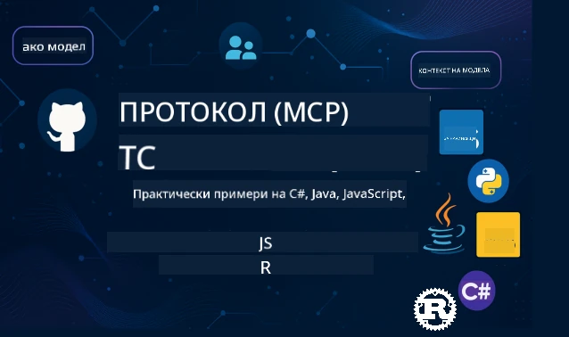

 

[](https://GitHub.com/microsoft/mcp-for-beginners/graphs/contributors)
[](https://GitHub.com/microsoft/mcp-for-beginners/issues)
[](https://GitHub.com/microsoft/mcp-for-beginners/pulls)
[](http://makeapullrequest.com)
[](https://mcptoplist.com/server/mcp.so%2Fmcp-for-beginners%2Fmicrosoft)

[](https://GitHub.com/microsoft/mcp-for-beginners/watchers)
[](https://GitHub.com/microsoft/mcp-for-beginners/fork)
[](https://GitHub.com/microsoft/mcp-for-beginners/stargazers)


[](https://discord.gg/nTYy5BXMWG)

Следвайте тези стъпки, за да започнете да използвате тези ресурси:
1. **Разклонете репозиторията**: Кликнете [](https://GitHub.com/microsoft/mcp-for-beginners/fork)
2. **Клонирайте репозиторията**:   `git clone https://github.com/microsoft/mcp-for-beginners.git`
3. **Присъединете се към** [](https://discord.gg/nTYy5BXMWG)


### 🌐 Поддръжка на множество езици

#### Поддържа се чрез GitHub Action (автоматично и винаги актуално)

<!-- CO-OP TRANSLATOR LANGUAGES TABLE START -->
[Арабски](../ar/README.md) | [Бенгалски](../bn/README.md) | [Български](./README.md) | [Бирмански (Мианмар)](../my/README.md) | [Китайски (опростен)](../zh-CN/README.md) | [Китайски (традиционен, Хонконг)](../zh-HK/README.md) | [Китайски (традиционен, Макао)](../zh-MO/README.md) | [Китайски (традиционен, Тайван)](../zh-TW/README.md) | [Хърватски](../hr/README.md) | [Чешки](../cs/README.md) | [Датски](../da/README.md) | [Холандски](../nl/README.md) | [Естонски](../et/README.md) | [Фински](../fi/README.md) | [Френски](../fr/README.md) | [Немски](../de/README.md) | [Гръцки](../el/README.md) | [Иврит](../he/README.md) | [Хинди](../hi/README.md) | [Унгарски](../hu/README.md) | [Индонезийски](../id/README.md) | [Италиански](../it/README.md) | [Японски](../ja/README.md) | [Каннада](../kn/README.md) | [Кмерски](../km/README.md) | [Корейски](../ko/README.md) | [Литовски](../lt/README.md) | [Малайски](../ms/README.md) | [Малаялам](../ml/README.md) | [Маратхи](../mr/README.md) | [Непалски](../ne/README.md) | [Нигерийски пиджин](../pcm/README.md) | [Норвежки](../no/README.md) | [Персийски (фарси)](../fa/README.md) | [Полски](../pl/README.md) | [Португалски (Бразилия)](../pt-BR/README.md) | [Португалски (Португалия)](../pt-PT/README.md) | [Пенджабски (Гурамуки)](../pa/README.md) | [Румънски](../ro/README.md) | [Руски](../ru/README.md) | [Сръбски (кирилица)](../sr/README.md) | [Словашки](../sk/README.md) | [Словенски](../sl/README.md) | [Испански](../es/README.md) | [Суахили](../sw/README.md) | [Шведски](../sv/README.md) | [Тагалог (Филипински)](../tl/README.md) | [Тамилски](../ta/README.md) | [Телугу](../te/README.md) | [Тайски](../th/README.md) | [Турски](../tr/README.md) | [Украински](../uk/README.md) | [Урду](../ur/README.md) | [Виетнамски](../vi/README.md)

> **Предпочитате да клонирате локално?**
>
> Този репозиторий включва над 50 превода на езици, което значително увеличава размера на изтеглянето. За да клонирате без преводи, използвайте sparse checkout:
>
> **Bash / macOS / Linux:**
> ```bash
> git clone --filter=blob:none --sparse https://github.com/microsoft/mcp-for-beginners.git
> cd mcp-for-beginners
> git sparse-checkout set --no-cone '/*' '!translations' '!translated_images'
> ```
>
> **CMD (Windows):**
> ```cmd
> git clone --filter=blob:none --sparse https://github.com/microsoft/mcp-for-beginners.git
> cd mcp-for-beginners
> git sparse-checkout set --no-cone "/*" "!translations" "!translated_images"
> ```
>
> Това ви осигурява всичко необходимо за завършване на курса с много по-бързо изтегляне.
<!-- CO-OP TRANSLATOR LANGUAGES TABLE END -->

# 🚀 Учебна програма за Model Context Protocol (MCP) за Начинаещи

## **Научете MCP чрез практически примери с код на C#, Java, JavaScript, Rust, Python и TypeScript**

## 🧠 Обзор на учебната програма за Model Context Protocol
Добре дошли в пътешествието си в Model Context Protocol! Ако някога сте се чудили как приложенията с изкуствен интелект комуникират с различни инструменти и услуги, предстои да откриете елегантното решение, което променя начина, по който разработчиците изграждат интелигентни системи.

Помислете за MCP като универсален преводач за AI приложения - точно както USB портовете ви позволяват да свържете всяко устройство към вашия компютър, MCP позволява на AI модели да се свързват с всеки инструмент или услуга по стандартизиран начин. Независимо дали изграждате своя първи чатбот или работите по сложни AI работни потоци, разбирането на MCP ще ви даде силата да създавате по-способни и гъвкави приложения.

Тази учебна програма е проектирана с търпение и грижа за вашето обучение. Ще започнем с прости концепции, които вече разбирате, и постепенно ще изграждаме вашите умения чрез практическа работа на предпочитания от вас програмен език. Всеки етап включва ясни обяснения, практични примери и много насърчение по пътя.

Когато завършите това пътуване, ще имате увереността да изграждате собствени MCP сървъри, да ги интегрирате с популярни AI платформи и да разбирате как тази технология променя бъдещето на развитието на AI. Нека започнем това вълнуващо приключение заедно!

### Официална документация и спецификации

Тази учебна програма е съгласувана с **MCP Спецификация 2025-11-25** (най-новото стабилно издание). Спецификацията на MCP използва версиониране, базирано на дата (формат ГГГГ-ММ-ДД), за да гарантира ясно проследяване на версиите на протокола.

> **Поглед напред:** кандидат за издание на следващата версия на спецификацията, **2026-07-28**, е планиран да бъде пуснат на 28 юли 2026 г. Той прави протокола безсъстояниев на транспортния слой, формализира рамка за разширения (MCP Apps, Tasks), затяга авторизацията и премахва Roots, Sampling и Logging. Вижте [Какво се променя в MCP: Кандидат за издание 2026-07-28](./01-CoreConcepts/mcp-2026-07-28-release-candidate.md) за пълно обяснение.

Тези ресурси стават по-ценни, докато разбирате повече, но не се чувствайте задължени да прочетете всичко наведнъж. Започнете с областите, които най-много ви интересуват!
- 📘 [MCP Документация](https://modelcontextprotocol.io/) – Това е вашият ресурс за стъпка по стъпка уроци и ръководства за потребителя. Документацията е написана с оглед на начинаещите, предоставяйки ясни примери, които можете да следвате със свое собствено темпо.
- 📜 [MCP Спецификация](https://modelcontextprotocol.io/specification/2025-11-25) – Помислете за това като вашето изчерпателно ръководство за справка. Докато преминавате през учебната програма, ще се връщате тук, за да търсите конкретни детайли и да разглеждате напреднали функции.
- 📜 [Версиониране на MCP Спецификация](https://modelcontextprotocol.io/specification/versioning) – Тук има информация за историята на версиите на протокола и как MCP използва версиониране, базирано на дата (формат ГГГГ-ММ-ДД).
- 🧑‍💻 [MCP GitHub Репозитория](https://github.com/modelcontextprotocol) – Тук ще намерите SDK-та, инструменти и примери с код на множество програмни езици. Това е като съкровищница от практични примери и готови за използване компоненти.
- 🌐 [MCP Общество](https://github.com/orgs/modelcontextprotocol/discussions) – Присъединете се към други учащи и опитни разработчици в дискусии за MCP. Това е подкрепяща общност, където въпросите са добре дошли и знанието се споделя свободно.
  
## Учебни цели

Към края на тази учебна програма ще се чувствате уверени и развълнувани от новите си умения. Ето какво ще постигнете:

• **Разберете основите на MCP**: Ще разберете какво е Model Context Protocol и защо той революционизира начина, по който AI приложенията работят заедно, използвайки аналогии и примери, които имат смисъл.

• **Създайте първия си MCP сървър**: Ще създадете работещ MCP сървър на предпочитания програмен език, започвайки с прости примери и постепенно развивайки уменията си стъпка по стъпка.

• **Свържете AI модели с реални инструменти**: Ще научите как да създадете мост между AI модели и реални услуги, давайки на вашите приложения мощни нови възможности.

• **Прилагайте най-добрите практики за сигурност**: Ще разберете как да пазите вашите MCP реализации безопасни и защитени, като опазвате както приложенията, така и потребителите си.

• **Разгръщайте с увереност**: Ще знаете как да прехвърлите MCP проектите си от разработка в продукция с практически стратегии за разгръщане, които работят в реалния свят.

• **Присъединете се към MCP общността**: Ще станете част от растяща общност от разработчици, които оформят бъдещето на развитието на AI приложения.

## Важна основа

Преди да се потопим в конкретиката на MCP, нека се уверим, че се чувствате комфортно с някои основни концепции. Не се тревожете, ако не сте експерт в тези области - ще обясним всичко необходимо, докато напредваме!

### Разбиране на протоколи (Основата)

Помислете за протокол като за правилата на един разговор. Когато се обаждате на приятел, и двамата знаете да кажете „здравей“ когато отговорите, да говорите по ред и да кажете „довиждане“ когато приключите. Компютърните програми имат нужда от подобни правила, за да комуникират ефективно.

MCP е протокол - набор от споразумени правила, които помагат на AI модели и приложения да водят продуктивни „разговори“ с инструменти и услуги. Точно както правилата за разговор улесняват човешката комуникация, MCP прави комуникацията на AI приложенията много по-надеждна и мощна.

### Клиент-сървър взаимоотношения (Как програмите работят заедно)

Вие вече използвате клиент-сървър взаимоотношения всеки ден! Когато използвате уеб браузър (клиент) за посещение на уебсайт, вие се свързвате с уеб сървър, който ви изпраща съдържанието на страницата. Браузърът знае как да поиска информация, а сървърът знае как да отговори.

В MCP имаме подобно взаимоотношение: AI моделите действат като клиенти, които искат информация или действия, докато MCP сървърите предоставят тези възможности. Това е като да имате полезен асистент (сървъра), на когото AI може да поиска да изпълни конкретни задачи.

### Защо стандартизацията е важна (За да работят нещата заедно)

Представете си, че всеки производител на автомобили използва различни форми на бензинови помпи - ще ви трябва различен адаптер за всяка кола! Стандартизацията означава споразумение за общи подходи, така че нещата да работят безпроблемно заедно.

MCP осигурява тази стандартизация за AI приложенията. Вместо всеки AI модел да има собствен код да работи с всеки инструмент, MCP създава универсален начин за комуникация. Това означава, че разработчиците могат да изграждат инструменти веднъж и те да работят с много различни AI системи.

## 🧭 Обзор на вашия учебен път

Вашето пътуване с MCP е внимателно структуирано, за да изгражда вашето доверие и умения постепенно. Всяка фаза въвежда нови концепции, като подсилва вече наученото.

### 🌱 Фаза основи: Разбиране на базовите неща (Модули 0-2)

Тук започва вашето приключение! Ще ви запознаем с концепциите на MCP чрез познати аналогии и прости примери. Ще разберете какво е MCP, защо съществува и как се вписва в по-големия свят на AI разработката.


• **Модул 0 - Въведение в MCP**: Ще започнем с изследване на това какво е MCP и защо е толкова важно за съвременните AI приложения. Ще видите реални примери за MCP в действие и ще разберете как то решава често срещани проблеми, с които се сблъскват разработчиците.

• **Модул 1 - Обяснени основни концепции**: Тук ще научите основните градивни блокове на MCP. Ще използваме много аналогии и визуални примери, за да сте сигурни, че тези концепции ви се струват естествени и разбираеми.

• **Модул 2 - Сигурност в MCP**: Сигурността може да звучи плашещо, но ще ви покажем как MCP включва вградени функции за безопасност и ще ви научим на най-добрите практики, които защитават вашите приложения от самото начало.

### 🔨 Фаза на изграждане: Създаване на първите ви реализации (Модул 3)

Сега започва истинското забавление! Ще получите практическо изживяване, като изграждате реални MCP сървъри и клиенти. Не се притеснявайте - ще започнем просто и ще ви водим през всяка стъпка.

Този модул включва множество ръководства с практически упражнения, които ви позволяват да практикувате на предпочитания от вас програмен език. Ще създадете първия си сървър, ще изградите клиент за връзка с него и дори ще го интегрирате с популярни инструменти за създаване, като VS Code.

Всяко ръководство включва пълни примери с код, съвети за отстраняване на проблеми и обяснения защо правим конкретни дизайнерски избори. В края на тази фаза ще имате работещи MCP реализации, с които можете да се гордеете!

### 🚀 Фаза на разрастване: Разширени концепции и реални приложения (Модули 4-5)

След като основите са усвоени, сте готови да изследвате по-усъвършенствани функции на MCP. Ще покрием практически стратегии за имплементация, техники за отстраняване на грешки и напреднали теми като мултимодална AI интеграция.

Също така ще научите как да мащабирате своите MCP реализации за производствена употреба и да ги интегрирате с облачни платформи като Azure. Тези модули ви подготвят да изграждате MCP решения, които могат да се справят с изискванията на реалния свят.

### 🌟 Фаза на усъвършенстване: Общество и специализация (Модули 6-11)

Последната фаза се фокусира върху присъединяването към общността на MCP и специализирането в области, които ви интересуват най-много. Ще научите как да допринасяте за open-source MCP проекти, да внедрявате усъвършенствани модели за автентикация и да изграждате комплексни решения, интегрирани с бази данни.

Модул 11 заслужава специално споменаване - това е пълна 13-лабораторна ръководена учебна пътека, която ви учи да изграждате производствени MCP сървъри с интеграция на PostgreSQL. Това е като заключителен проект, който събира всичко, което сте научили!

### 📚 Пълна структура на учебната програма

| Модул | Тема | Описание | Връзка |
|--------|-------|-------------|------|
| **Модул 0-3: Основи** | | | |
| 00 | Въведение в MCP | Обзор на протокола Model Context Protocol и неговото значение в AI процесите | [Прочети повече](./00-Introduction/README.md) |
| 01 | Обяснени основни концепции | Задълбочено изследване на основните концепции на MCP | [Прочети повече](./01-CoreConcepts/README.md) |
| 1.1 | Какво се променя в MCP (2026-07-28 RC) | Безсъстоянен протокол, рамка за разширения и премахване на функции в следващата версия на спецификацията | [Ръководство](./01-CoreConcepts/mcp-2026-07-28-release-candidate.md) |
| 02 | Сигурност в MCP | Заплахи за сигурността и най-добри практики | [Прочети повече](./02-Security/README.md) |
| 03 | Започване с MCP | Настройка на средата, основни сървъри/клиенти, интеграция | [Прочети повече](./03-GettingStarted/README.md) |
| **Модул 3: Изграждане на първия ви сървър и клиент** | | | |
| 3.1 | Първи сървър | Създайте първия си MCP сървър | [Ръководство](./03-GettingStarted/01-first-server/README.md) |
| 3.2 | Първи клиент | Разработване на основен MCP клиент | [Ръководство](./03-GettingStarted/02-client/README.md) |
| 3.3 | Клиент с LLM | Интегриране на големи езикови модели | [Ръководство](./03-GettingStarted/03-llm-client/README.md) |
| 3.4 | Интеграция с VS Code | Използване на MCP сървъри във VS Code | [Ръководство](./03-GettingStarted/04-vscode/README.md) |
| 3.5 | stdio сървър | Създаване на сървъри чрез stdio транспорт | [Ръководство](./03-GettingStarted/05-stdio-server/README.md) |
| 3.6 | HTTP стрийминг | Имплементиране на HTTP стрийминг в MCP | [Ръководство](./03-GettingStarted/06-http-streaming/README.md) |
| 3.7 | Microsoft Foundry Toolkit | Използване на Microsoft Foundry Toolkit с MCP | [Ръководство](./03-GettingStarted/07-aitk/README.md) |
| 3.8 | Тестване | Тестване на вашата MCP сървърна имплементация | [Ръководство](./03-GettingStarted/08-testing/README.md) |
| 3.9 | Пускане в експлоатация | Разгръщане на MCP сървъри в продукция | [Ръководство](./03-GettingStarted/09-deployment/README.md) |
| 3.10 | Използване на разширени сървъри | Използване на усъвършенствани сървъри за напреднали функции и подобрена архитектура | [Ръководство](./03-GettingStarted/10-advanced/README.md) |
| 3.11 | Простa автентикация | Глава, която ви показва автентикацията от началото и RBAC | [Ръководство](./03-GettingStarted/11-simple-auth/README.md) |
| 3.12 | MCP хостовe | Конфигуриране на Claude Desktop, Cursor, Cline и други MCP хостове | [Ръководство](./03-GettingStarted/12-mcp-hosts/README.md) |
| 3.13 | MCP инспектор | Отстраняване на грешки и тестване на MCP сървъри с инструмента Inspector | [Ръководство](./03-GettingStarted/13-mcp-inspector/README.md) |
| 3.14 | Избор на проби | Използване на избор на проби за сътрудничество с клиента | [Ръководство](./03-GettingStarted/14-sampling/README.md) |
| 3.15 | MCP приложения | Изграждане на MCP приложения | [Ръководство](./03-GettingStarted/15-mcp-apps/README.md) |
| **Модул 4-5: Практически & Разширени** | | | |
| 04 | Практическа имплементация | SDK-та, отстраняване на грешки, тестване, повторно използваеми шаблони за заявки | [Прочети повече](./04-PracticalImplementation/README.md) |
| 4.1 | Пагинация | Обработка на големи резултати с курсор-базирана пагинация | [Ръководство](./04-PracticalImplementation/pagination/README.md) |
| 05 | Разширени теми в MCP | Мултимодална AI, мащабиране, корпоративна употреба | [Прочети повече](./05-AdvancedTopics/README.md) |
| 5.1 | Интеграция с Azure | MCP интеграция с Azure | [Ръководство](./05-AdvancedTopics/mcp-integration/README.md) |
| 5.2 | Мултимодалност | Работа с множество модалности | [Ръководство](./05-AdvancedTopics/mcp-multi-modality/README.md) |
| 5.3 | Демонстрация OAuth2 | Имплементиране на OAuth2 автентикация | [Ръководство](./05-AdvancedTopics/mcp-oauth2-demo/README.md) |
| 5.4 | Основни контексти | Разбиране и имплементиране на основни контексти | [Ръководство](./05-AdvancedTopics/mcp-root-contexts/README.md) |
| 5.5 | Маршрутизиране | Стратегии за маршрутизиране в MCP | [Ръководство](./05-AdvancedTopics/mcp-routing/README.md) |
| 5.6 | Избор на проби | Техники за избор на проби в MCP | [Ръководство](./05-AdvancedTopics/mcp-sampling/README.md) |
| 5.7 | Мащабиране | Мащабиране на MCP имплементации | [Ръководство](./05-AdvancedTopics/mcp-scaling/README.md) |
| 5.8 | Сигурност | Разширени съображения за сигурност | [Ръководство](./05-AdvancedTopics/mcp-security/README.md) |
| 5.9 | Уеб търсене | Имплементиране на възможности за уеб търсене | [Ръководство](./05-AdvancedTopics/web-search-mcp/README.md) |
| 5.10 | Реално време стрийминг | Изграждане на функционалност за стрийминг в реално време | [Ръководство](./05-AdvancedTopics/mcp-realtimestreaming/README.md) |
| 5.11 | Търсене в реално време | Имплементиране на търсене в реално време | [Ръководство](./05-AdvancedTopics/mcp-realtimesearch/README.md) |
| 5.12 | Avtentikacia s Entra ID | Аутентикация с Microsoft Entra ID | [Ръководство](./05-AdvancedTopics/mcp-security-entra/README.md) |
| 5.13 | Интеграция с Foundry | Интеграция с Microsoft Foundry | [Ръководство](./05-AdvancedTopics/mcp-foundry-agent-integration/README.md) |
| 5.14 | Инженеринг на контекста | Техники за ефективно инженерство на контекста | [Ръководство](./05-AdvancedTopics/mcp-contextengineering/README.md) |
| 5.15 | Потребителски трансфер на MCP | Собствени реализации на транспорт | [Ръководство](./05-AdvancedTopics/mcp-transport/README.md) |
| 5.16 | Функции на протокола | Известия за напредък, анулиране, шаблони за ресурси | [Ръководство](./05-AdvancedTopics/mcp-protocol-features/README.md) |
| 5.17 | Противостоящо многоагентно разсъждение | Два агента спорят противоположни страни, използвайки споделени MCP инструменти, оценявани от съдия-агент | [Ръководство](./05-AdvancedTopics/mcp-adversarial-agents/README.md) |
| **Модул 6-10: Общество и най-добри практики** | | | |
| 06 | Приноси от общността | Как да допринасяте за MCP екосистемата | [Ръководство](./06-CommunityContributions/README.md) |
| 07 | Уроци от ранното приемане | Истории за реални внедрявания | [Ръководство](./07-LessonsfromEarlyAdoption/README.md) |
| 08 | Най-добри практики за MCP | Производителност, устойчивост на грешки, устойчивост | [Ръководство](./08-BestPractices/README.md) |
| 09 | Казуси на MCP | Примери за практически имплементации | [Ръководство](./09-CaseStudy/README.md) |
| 10 | Практически уъркшоп | Изграждане на MCP сървър с Microsoft Foundry Toolkit | [Лаборатория](./10-StreamliningAIWorkflowsBuildingAnMCPServerWithAIToolkit/README.md) |
| **Модул 11: MCP Server Hands On Lab** | | | |
| 11 | Интеграция на MCP сървър с база данни | Обширна 13-лабораторна ръководена учебна пътека за интеграция на PostgreSQL | [Лаборатории](./11-MCPServerHandsOnLabs/README.md) |
| 11.1 | Въведение | Преглед на MCP с интеграция на база данни и казус за ритейл анализи | [Лаборатория 00](./11-MCPServerHandsOnLabs/00-Introduction/README.md) |
| 11.2 | Основна архитектура | Разбиране на архитектурата на MCP сървъра, слоевете на базата данни и модели за сигурност | [Лаборатория 01](./11-MCPServerHandsOnLabs/01-Architecture/README.md) |
| 11.3 | Сигурност и многонаемност | Сигурност на ниво ред, автентикация и многонаемен достъп до данни | [Лаборатория 02](./11-MCPServerHandsOnLabs/02-Security/README.md) |
| 11.4 | Настройка на средата | Настройка на среда за разработка, Docker, Azure ресурси | [Лаборатория 03](./11-MCPServerHandsOnLabs/03-Setup/README.md) |
| 11.5 | Дизайн на базата данни | Настройка на PostgreSQL, дизайн на ритейл схема и примерни данни | [Лаборатория 04](./11-MCPServerHandsOnLabs/04-Database/README.md) |
| 11.6 | Имплементация на MCP сървър | Изграждане на FastMCP сървъра с интеграция на база данни | [Лаборатория 05](./11-MCPServerHandsOnLabs/05-MCP-Server/README.md) |
| 11.7 | Разработка на инструменти | Създаване на инструменти за заявка към база данни и инстроспекция на схема | [Лаборатория 06](./11-MCPServerHandsOnLabs/06-Tools/README.md) |
| 11.8 | Семантично търсене | Имплементиране на векторни вградки с Azure OpenAI и pgvector | [Лаборатория 07](./11-MCPServerHandsOnLabs/07-Semantic-Search/README.md) |
| 11.9 | Тестване и отстраняване на грешки | Стратегии за тестване, инструменти за отстраняване на грешки и подходи за валидация | [Лаборатория 08](./11-MCPServerHandsOnLabs/08-Testing/README.md) |
| 11.10 | Интеграция с VS Code | Конфигуриране на VS Code MCP интеграция и използване на AI чат | [Лаборатория 09](./11-MCPServerHandsOnLabs/09-VS-Code/README.md) |
| 11.11 | Стратегии за пускане в експлоатация | Docker разгръщане, Azure Container Apps и съображения за мащабиране | [Лаборатория 10](./11-MCPServerHandsOnLabs/10-Deployment/README.md) |
| 11.12 | Мониторинг | Application Insights, логване, мониторинг на производителността | [Лаборатория 11](./11-MCPServerHandsOnLabs/11-Monitoring/README.md) |
| 11.13 | Най-добри практики | Оптимизация на производителността, усилване на сигурността и съвети за продукция | [Лаборатория 12](./11-MCPServerHandsOnLabs/12-Best-Practices/README.md) |
| **Модул 12: Инструменти за MCP** | | | |
| 12.1 | Инструменти | Използване на MCP в Copilot App | [ Ръководство ](./12-tooling/README.md) |

### 💻 Примерни проекти с код

Една от най-вълнуващите части при изучаването на MCP е постепенното развитие на вашите умения за писане на код. Проектирали сме нашите примери с код да започват просто и да стават по-сложни с натрупване на разбирането ви. Ето как въвеждаме концепциите - с код, който е лесен за разбиране, но показва реални MCP принципи, ще разберете не само какво прави този код, но и защо е структуриран по този начин и как пасва към по-големи MCP приложения.

#### Основни примери за MCP калкулатор

| Език | Описание | Връзка |
|----------|-------------|------|

| C# | Пример за MCP сървър | [Виж кода](./03-GettingStarted/samples/csharp/README.md) |
| Java | MCP калкулатор | [Виж кода](./03-GettingStarted/samples/java/calculator/README.md) |
| JavaScript | MCP демонстрация | [Виж кода](./03-GettingStarted/samples/javascript/README.md) |
| Python | MCP сървър | [Виж кода](../../03-GettingStarted/samples/python/mcp_calculator_server.py) |
| TypeScript | MCP пример | [Виж кода](./03-GettingStarted/samples/typescript/README.md) |
| Rust | MCP пример | [Виж кода](./03-GettingStarted/samples/rust/README.md) |

#### Разширени реализации на MCP

| Език | Описание | Връзка |
|----------|-------------|------|
| C# | Разширен пример | [Виж кода](./04-PracticalImplementation/samples/csharp/README.md) |
| Java със Spring | Пример за контейнерно приложение | [Виж кода](./04-PracticalImplementation/samples/java/containerapp/README.md) |
| JavaScript | Разширен пример | [Виж кода](./04-PracticalImplementation/samples/javascript/README.md) |
| Python | Комплексна реализация | [Виж кода](./04-PracticalImplementation/samples/python/README.md) |
| TypeScript | Пример за контейнер | [Виж кода](./04-PracticalImplementation/samples/typescript/README.md) |


## 🎯 Предварителни изисквания за изучаване на MCP

За да извлечете максимума от тази учебна програма, трябва да имате:

- Основни знания по програмиране поне в един от следните езици: C#, Java, JavaScript, Python или TypeScript
- Разбиране на клиент-сървърния модел и API-та
- Запознатост с концепциите REST и HTTP
- (По избор) Познания в областта на AI/ML концепции

- Участие в нашите общностни дискусии за подкрепа

## 📚 Учебно ръководство и ресурси

Това хранилище включва няколко ресурса, които ще ви помогнат да се ориентирате и учите ефективно:

### Учебно ръководство

Има налично подробно [Учебно ръководство](./study_guide.md), което ще ви помогне да се ориентирате в това хранилище ефективно. Тази визуална карта на учебната програма показва как всички теми са свързани и дава насоки как да използвате примерните проекти ефективно. Особено полезно е за визуални ученици, които обичат да виждат общата картина.

Ръководството включва:
- Визуална карта на учебната програма, показваща всички разгледани теми
- Подробен разбор на всеки раздел в хранилището
- Насоки за използване на примерните проекти
- Препоръчани учебни пътеки за различни нива на умения
- Допълнителни ресурси за допълване на учебния ви път

### Промени в съдържанието

Поддържаме подробно [Списък с промени](./changelog.md), който следи всички значими обновления в учебните материали, за да сте в крак с най-новите подобрения и допълнения.
- Добавяне на ново съдържание
- Структурни промени
- Подобрения на функции
- Обновления на документацията

## 🛠️ Как да използвате тази учебна програма ефективно

Всеки урок в това ръководство включва:

1. Ясни обяснения на концепциите на MCP  
2. Живи примери с код на няколко езика  
3. Упражнения за изграждане на реални MCP приложения  
4. Допълнителни ресурси за напреднали учащи се

### Нека учим MCP с C# - серия от уроци
Нека научим за Model Context Protocol (MCP), иновативна рамка, създадена за стандартизиране на взаимодействията между AI модели и клиентски приложения. В тази сесия за начинаещи ще ви запознаем с MCP и ще ви водим в създаването на първия ви MCP сървър.
#### C#: [https://aka.ms/letslearnmcp-csharp](https://aka.ms/letslearnmcp-csharp)
#### Java: [https://aka.ms/letslearnmcp-java](https://aka.ms/letslearnmcp-java)
#### JavaScript: [https://aka.ms/letslearnmcp-javascript](https://aka.ms/letslearnmcp-javascript)
#### Python: [https://aka.ms/letslearnmcp-python](https://aka.ms/letslearnmcp-python)

## 🎓 Вашето MCP пътешествие започва

Поздравления! Току-що направихте първата стъпка в едно вълнуващо пътешествие, което ще разшири вашите програмистки умения и ще ви свърже с най-новите постижения в AI развитието.

### Какво вече сте постигнали

Чрез прочитането на това въведение, вие вече започнахте да изграждате основата на вашите знания за MCP. Разбирате какво е MCP, защо е важно и как тази учебна програма ще подкрепи вашето обучително пътешествие. Това е значително постижение и началото на вашата експертиза в тази важна технология.

### Приключението напред

Докато напредвате през модулите, не забравяйте, че всеки експерт някога е бил начинаещ. Концепциите, които сега може да изглеждат сложни, ще станат втора природа, докато практикувате и ги прилагате. Всяка малка стъпка изгражда мощни умения, които ще ви служат през цялата ви програмистка кариера.

### Вашата мрежа за подкрепа

Вие се присъединявате към общност от учащи и експерти, които са страстни за MCP и с готовност помагат на другите да успеят. Независимо дали сте заседнали в кодинг задача или искате да споделите откритие, общността е тук, за да подкрепя вашето пътешествие.

Ако се затруднявате или имате въпроси относно разработването на AI приложения, присъединете се към други учащи и опитни разработчици в дискусии за MCP. Това е подкрепяща общност, където въпросите са добре дошли и знанията се споделят свободно.

[](https://discord.gg/nTYy5BXMWG)

Ако имате обратна връзка за продукта или грешки по време на разработка, посетете:

[](https://aka.ms/foundry/forum)

### Готови ли сте да започнете?

Вашето MCP приключение започва сега! Започнете с Модул 0, за да се потопите в първия си практически опит с MCP, или разгледайте примерните проекти, за да видите какво ще изграждате. Запомнете - всеки експерт е започнал точно там, където сте сега, и с търпение и практика ще се удивите на постиженията си.

Добре дошли в света на разработването с Model Context Protocol. Нека изградим нещо удивително заедно!

## 🤝 Принос към учебната общност

Тази учебна програма става по-силна благодарение на приносите на учащи като вас! Независимо дали поправяте печатна грешка, предлагате по-ясно обяснение или добавяте нов пример, вашите приноси помагат на други начинаещи да успеят.

Благодарности на Microsoft Valued Professional [Shivam Goyal](https://www.linkedin.com/in/shivam2003/) за предоставените кодови примери.

Процесът на принос е проектиран да е приветлив и подкрепящ. Повечето приноси изискват споразумение за лицензиране на приносител (CLA), но автоматизираните инструменти ще ви насочват гладко през процеса.

## 📜 Отворено обучение

Цялата тази учебна програма е достъпна под MIT [ЛИЦЕНЗ](../../LICENSE), което означава, че можете да я използвате, модифицирате и споделяте свободно. Това подкрепя нашата мисия да направим знанието за MCP достъпно за разработчици навсякъде.
## 🤝 Правила за приноси

Този проект приема приноси и предложения. Повечето приноси изискват да се съгласите с
Споразумението за лицензиране на приносител (CLA), с което декларирате, че имате право и наистина предоставяте
правата върху вашия принос. За подробности посетете <https://cla.opensource.microsoft.com>.

Когато подадете pull request, бот за CLA автоматично ще определи дали трябва да предоставите
CLA и ще маркира PR подходящо (например статус проверка, коментар). Просто следвайте инструкциите,
предоставени от бота. Ще трябва да го направите само веднъж за всички хранилища, използващи нашия CLA.

Този проект е приел [Кодекса за поведение на Microsoft Open Source](https://opensource.microsoft.com/codeofconduct/).
За повече информация вижте [FAQ за кодекса за поведение](https://opensource.microsoft.com/codeofconduct/faq/) или
се свържете с [opencode@microsoft.com](mailto:opencode@microsoft.com) за допълнителни въпроси или коментари.

---

*Готови ли сте да започнете своето MCP пътешествие? Започнете с [Модул 00 - Въведение в MCP](./00-Introduction/README.md) и направете първите си стъпки в света на разработката с Model Context Protocol!*


## 🎒 Други курсове
Нашият екип предлага и други курсове! Разгледайте:

<!-- CO-OP TRANSLATOR OTHER COURSES START -->
### LangChain
[](https://aka.ms/langchain4j-for-beginners)
[](https://aka.ms/langchainjs-for-beginners?WT.mc_id=m365-94501-dwahlin)
[](https://github.com/microsoft/langchain-for-beginners?WT.mc_id=m365-94501-dwahlin)
---

### Azure / Edge / MCP / Агенти
[](https://github.com/microsoft/AZD-for-beginners?WT.mc_id=academic-105485-koreyst)
[](https://github.com/microsoft/edgeai-for-beginners?WT.mc_id=academic-105485-koreyst)
[](https://github.com/microsoft/mcp-for-beginners?WT.mc_id=academic-105485-koreyst)
[](https://github.com/microsoft/ai-agents-for-beginners?WT.mc_id=academic-105485-koreyst)

---
 
### Серия за генеративен AI
[](https://github.com/microsoft/generative-ai-for-beginners?WT.mc_id=academic-105485-koreyst)
[-9333EA?style=for-the-badge&labelColor=E5E7EB&color=9333EA)](https://github.com/microsoft/Generative-AI-for-beginners-dotnet?WT.mc_id=academic-105485-koreyst)
[-C084FC?style=for-the-badge&labelColor=E5E7EB&color=C084FC)](https://github.com/microsoft/generative-ai-for-beginners-java?WT.mc_id=academic-105485-koreyst)
[-E879F9?style=for-the-badge&labelColor=E5E7EB&color=E879F9)](https://github.com/microsoft/generative-ai-with-javascript?WT.mc_id=academic-105485-koreyst)

---
 
### Основно обучение
[](https://aka.ms/ml-beginners?WT.mc_id=academic-105485-koreyst)
[](https://aka.ms/datascience-beginners?WT.mc_id=academic-105485-koreyst)
[](https://aka.ms/ai-beginners?WT.mc_id=academic-105485-koreyst)

[](https://github.com/microsoft/Security-101?WT.mc_id=academic-96948-sayoung)
[](https://aka.ms/webdev-beginners?WT.mc_id=academic-105485-koreyst)
[](https://aka.ms/iot-beginners?WT.mc_id=academic-105485-koreyst)
[](https://github.com/microsoft/xr-development-for-beginners?WT.mc_id=academic-105485-koreyst)

---
 
### Серия Copilot
[](https://aka.ms/GitHubCopilotAI?WT.mc_id=academic-105485-koreyst)
[](https://github.com/microsoft/mastering-github-copilot-for-dotnet-csharp-developers?WT.mc_id=academic-105485-koreyst)
[](https://github.com/microsoft/CopilotAdventures?WT.mc_id=academic-105485-koreyst)
<!-- CO-OP TRANSLATOR OTHER COURSES END -->

---

<!-- CO-OP TRANSLATOR DISCLAIMER START -->
**Отказ от отговорност**:
Този документ е преведен с помощта на AI преводачески услуга [Co-op Translator](https://github.com/Azure/co-op-translator). Въпреки че се стремим към точност, моля имайте предвид, че автоматизираните преводи могат да съдържат грешки или неточности. Оригиналният документ на неговия роден език трябва да се счита за авторитетен източник. За критична информация се препоръчва професионален човешки превод. Ние не носим отговорност за каквито и да е недоразумения или неправилни тълкувания, произтичащи от използването на този превод.
<!-- CO-OP TRANSLATOR DISCLAIMER END -->