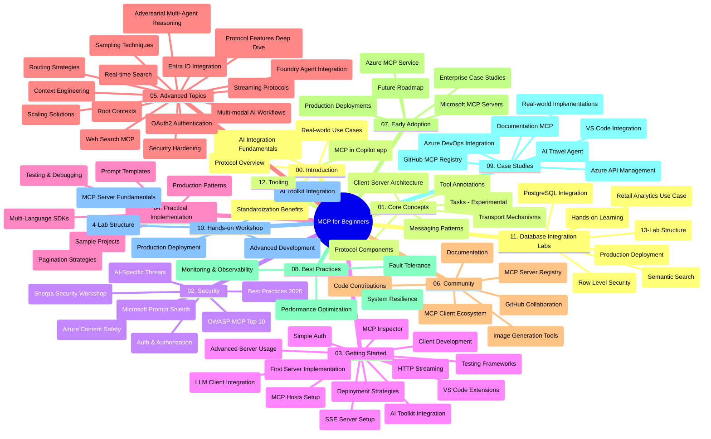

# Протокол за контекст на модела (MCP) за начинаещи - учебно ръководство

Това учебно ръководство предоставя преглед на структурата и съдържанието на хранилището за учебната програма "Протокол за контекст на модела (MCP) за начинаещи". Използвайте това ръководство, за да навигирате ефективно из хранилището и да извлечете максимума от наличните ресурси.

## Преглед на хранилището

Протоколът за контекст на модела (MCP) е стандартизиран рамков модел за взаимодействие между AI модели и клиентски приложения. Първоначално създаден от Anthropic, MCP сега се поддържа от по-широката MCP общност чрез официалната организация в GitHub. Това хранилище предлага изчерпателна учебна програма с практически кодови примери на C#, Java, JavaScript, Python и TypeScript, предназначени за AI разработчици, системни архитекти и софтуерни инженери.

## Визуална учебна карта

## Структура на хранилището

Хранилището е организирано в дванадесет основни секции, като всяка се фокусира върху различни аспекти на MCP:

1. **Въведение (00-Introduction/)**
   - Преглед на Протокола за контекст на модела
   - Защо е важна стандартизацията в AI процесите
   - Практически случаи на използване и ползи

2. **Основни концепции (01-CoreConcepts/)**
   - Клиент-сървър архитектура
   - Ключови компоненти на протокола
   - Модели на съобщенията в MCP
   - Текуща спецификация: [Какво се промени в MCP: Спецификация 2026-07-28](./01-CoreConcepts/mcp-2026-07-28.md) — безсъстоянното ядро на протокола, рамка за разширения и отпадания на Roots/Sampling/Logging

3. **Сигурност (02-Security/)**
   - Заплахи за сигурността в системи, базирани на MCP
   - Най-добри практики за обезопасяване на реализации
   - Стратегии за удостоверяване и авторизация
   - Практически [пример за CIMD и DCR авторизация](./02-Security/samples/cimd-dcr-auth/README.md)
   - **Изчерпателна документация за сигурността**:
     - Най-добри практики за сигурност в MCP
     - Ръководство за имплементация на Azure Content Safety
     - Контроли и техники за сигурност в MCP
     - Кратък справочник за MCP най-добри практики
   - **Ключови теми за сигурността**:
     - Атаки с инжектиране на prompt и отравяне на инструменти
     - Кражба на сесии и проблеми с объркан заместник
     - Уязвимости при преминаване на токени
     - Прекалени разрешения и контрол на достъпа
     - Сигурност на веригата на доставки за AI компоненти
     - Интеграция на Microsoft Prompt Shields

4. **Започване (03-GettingStarted/)**
   - Настройка и конфигурация на средата
   - Създаване на базови MCP сървъри и клиенти
   - Интеграция с вече съществуващи приложения
   - Включва секции за:
     - Първа имплементация на сървър
     - Разработка на клиент
     - Интеграция с LLM клиент
     - Интеграция с VS Code
     - Сървър със събития, изпращани към клиента (SSE)
     - Напреднало използване на сървъра
     - HTTP поточно предаване
     - Интеграция с AI комплект от инструменти
     - Стратегии за тестване
     - Насоки за внедряване

5. **Практическа реализация (04-PracticalImplementation/)**
   - Използване на SDK-та в различни програмни езици
   - Техники за отстраняване на грешки, тестване и валидация
   - Създаване на реусабъл шаблони за промптове и работни потоци
   - Примерни проекти с примери за изпълнение

6. **Разширени теми (05-AdvancedTopics/)**
   - Техники за инженеринг на контекст
   - Интеграция с Foundry агент
   - Мулти-модални AI работни потоци
   - Демонстрации на OAuth2 удостоверяване
   - Възможности за търсене в реално време
   - Поточно предаване в реално време
   - Имплементация на коренови контексти
   - Стратегии за маршрутизиране
   - Техники за семплиране
   - Подходи за мащабиране
   - Сигурност и съображения
   - Интеграция със сигурността на Entra ID
   - Интеграция на уеб търсене
   - Адвесериално многоагентско разсъждение (модели на дебати)

7. **Приноси от общността (06-CommunityContributions/)**
   - Как да допринасяте с код и документация
   - Сътрудничество чрез GitHub
   - Подобрения и обратна връзка от общността
   - Използване на различни MCP клиенти (Claude Desktop, Cline, VSCode)
   - Работа с популярни MCP сървъри, включително генериране на изображения

8. **Уроци от ранно възприемане (07-LessonsfromEarlyAdoption/)**
   - Реални реализации и успехи
   - Изграждане и внедряване на решения, базирани на MCP
   - Тенденции и бъдещ план за развитие
   - **Ръководство за Microsoft MCP сървъри**: Изчерпателен наръчник за 10 готови за продукция Microsoft MCP сървъра, включително:
     - Microsoft Learn Docs MCP сървър
     - Azure MCP сървър (15+ специализирани конектори)
     - GitHub MCP сървър
     - Azure DevOps MCP сървър
     - MarkItDown MCP сървър
     - SQL Server MCP сървър
     - Playwright MCP сървър
     - Dev Box MCP сървър
     - Microsoft Foundry MCP сървър
     - Microsoft 365 Agents Toolkit MCP сървър

9. **Най-добри практики (08-BestPractices/)**
   - Фина настройка на производителността и оптимизация
   - Проектиране на отказоустойчиви MCP системи
   - Стратегии за тестване и устойчивост

10. **Казуси (09-CaseStudy/)**
    - **Седем изчерпателни казуси**, демонстриращи универсалността на MCP в различни сценарии:
    - **Azure AI туристически агенти**: Мултиагентска оркестрация с Azure OpenAI и AI Search
    - **Интеграция с Azure DevOps**: Автоматизиране на работни процеси с актуализации от YouTube данни
    - **Извличане на документация в реално време**: Python конзолен клиент с HTTP поточно предаване
    - **Интерактивен генератор на учебни планове**: Chainlit уеб приложение с разговорен AI
    - **Документация в редактора**: Интеграция с VS Code и GitHub Copilot работни потоци
    - **Azure API управление**: Внедряване на корпоративен API с MCP сървър
    - **GitHub MCP регистър**: Платформа за развитие на екосистеми и агенцки интеграции
    - Примери за изпълнение, обхващащи корпоративни интеграции, продуктивност на разработчиците и развитие на екосистеми

11. **Практически уъркшоп (10-StreamliningAIWorkflowsBuildingAnMCPServerWithAIToolkit/)**
    - Изчерпателен практически уъркшоп, комбиниращ MCP с AI комплект от инструменти
    - Изграждане на интелигентни приложения, свързващи AI модели с реални инструменти
    - Практически модули, обхващащи основи, разработка на персонализиран сървър и стратегии за продукционно внедряване
    - **Структура на лабораториите**:
      - Лаборатория 1: Основи на MCP сървъра
      - Лаборатория 2: Разширена разработка на MCP сървъра
      - Лаборатория 3: Интеграция с AI комплект от инструменти
      - Лаборатория 4: Продукционно внедряване и мащабиране
    - Обучение чрез лаборатории с инструкции стъпка по стъпка

12. **Лаборатории за интеграция на MCP сървъри с база данни (11-MCPServerHandsOnLabs/)**
    - **Изчерпателен учебен път от 13 лаборатории** за изграждане на готови за продукция MCP сървъри с интеграция на PostgreSQL
    - **Реално приложение за аналитика в търговията на дребно** с помощта на случая за употреба Zava Retail
    - **Корпоративни модели**, включително Row Level Security (RLS), семантично търсене и достъп до мулти-tenant данни
    - **Пълна структура на лабораториите**:
      - **Лаборатории 00-03: Основи** - Въведение, Архитектура, Сигурност, Настройка на средата
      - **Лаборатории 04-06: Изграждане на MCP сървъра** - Дизайн на база данни, Имплементация на MCP сървър, Разработка на инструменти
      - **Лаборатории 07-09: Разширени функции** - Семантично търсене, Тестване и отстраняване на грешки, Интеграция с VS Code
      - **Лаборатории 10-12: Продукция & Най-добри практики** - Внедряване, Мониторинг, Оптимизация
    - **Обхванати технологии**: FastMCP рамка, PostgreSQL, Azure OpenAI, Azure Container Apps, Application Insights
    - **Резултати от обучението**: Готови за продукция MCP сървъри, модели за интеграция на бази данни, AI анализи, корпоративна сигурност

13. **Инструменти (12-tooling/)**
    - Научете как да използвате MCP в Copilot приложението и други инструменти

## Допълнителни ресурси

Хранилището включва подпомагащи ресурси:

- **Папка със снимки**: Съдържа диаграми и илюстрации, използвани в цялата учебна програма
- **Преводи**: Многоезична поддръжка с автоматизирани преводи на документацията
- **Официални MCP ресурси**:
  - [MCP документация](https://modelcontextprotocol.io/)
  - [MCP спецификация](https://modelcontextprotocol.io/specification/2026-07-28/)
  - [MCP GitHub хранилище](https://github.com/modelcontextprotocol)

## Как да използвате това хранилище

1. **Последователно обучение**: Следвайте главите по ред (от 00 до 11) за структуриран учебен процес.
2. **Фокус върху конкретен език**: Ако ви интересува определен програмен език, разгледайте папките със семпли за реализации на предпочитания от вас език.
3. **Практическа реализация**: Започнете със секцията "Започване", за да настроите средата си и да създадете първия си MCP сървър и клиент.
4. **Разширено изследване**: След като усвоите основите, разгледайте разширените теми, за да разширите знанията си.
5. **Ангажираност в общността**: Присъединете се към MCP общността чрез GitHub дискусии и Discord канали за връзка с експерти и колеги разработчици.

## MCP клиенти и инструменти

Учебната програма обхваща различни MCP клиенти и инструменти:

1. **Официални клиенти**:
   - Visual Studio Code
   - MCP в Visual Studio Code
   - Claude Desktop
   - Claude в VSCode
   - Claude API

2. **Клиенти от общността**:
   - Cline (терминален)
   - Cursor (редактор на код)
   - ChatMCP
   - Windsurf

3. **Инструменти за управление на MCP**:
   - MCP CLI
   - MCP Manager
   - MCP Linker
   - MCP Router

## Популярни MCP сървъри

Хранилището представя различни MCP сървъри, включително:

1. **Официални Microsoft MCP сървъри**:
   - Microsoft Learn Docs MCP сървър
   - Azure MCP сървър (15+ специализирани конектори)
   - GitHub MCP сървър
   - Azure DevOps MCP сървър
   - MarkItDown MCP сървър
   - SQL Server MCP сървър
   - Playwright MCP сървър
   - Dev Box MCP сървър
   - Microsoft Foundry MCP сървър
   - Microsoft 365 Agents Toolkit MCP сървър

2. **Официални референтни сървъри**:
   - Файлова система
   - Fetch
   - Памет
   - Последователно мислене

3. **Генериране на изображения**:
   - Azure OpenAI DALL-E 3
   - Stable Diffusion WebUI
   - Replicate

4. **Инструменти за разработка**:
   - Git MCP
   - Terminal Control
   - Code Assistant

5. **Специализирани сървъри**:
   - Salesforce
   - Microsoft Teams
   - Jira & Confluence

## Сътрудничество

Това хранилище приветства приноси от общността. Вижте секцията Приноси от общността за насоки как да допринасяте ефективно за MCP екосистемата.

----

*Това учебно ръководство беше последно актуализирано на 9 септември 2026 г. Отразява MCP
Спецификация `2026-07-28`, текущата ревизия на протокола. Някои практически
примери остават изрично версионирани към `2025-11-25`, докато SDK-тата и инструментите
приемат безсъстоянните API на протокола.*

---

<!-- CO-OP TRANSLATOR DISCLAIMER START -->
**Отказ от отговорност**:
Този документ е преведен с помощта на AI преводачески услуга [Co-op Translator](https://github.com/Azure/co-op-translator). Въпреки че се стремим към точност, моля имайте предвид, че автоматизираните преводи могат да съдържат грешки или неточности. Оригиналният документ на неговия роден език трябва да се счита за авторитетен източник. За критична информация се препоръчва професионален човешки превод. Ние не носим отговорност за каквито и да е недоразумения или неправилни тълкувания, произтичащи от използването на този превод.
<!-- CO-OP TRANSLATOR DISCLAIMER END -->