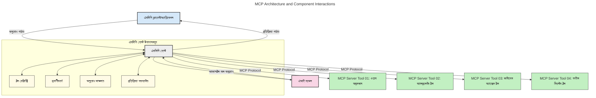
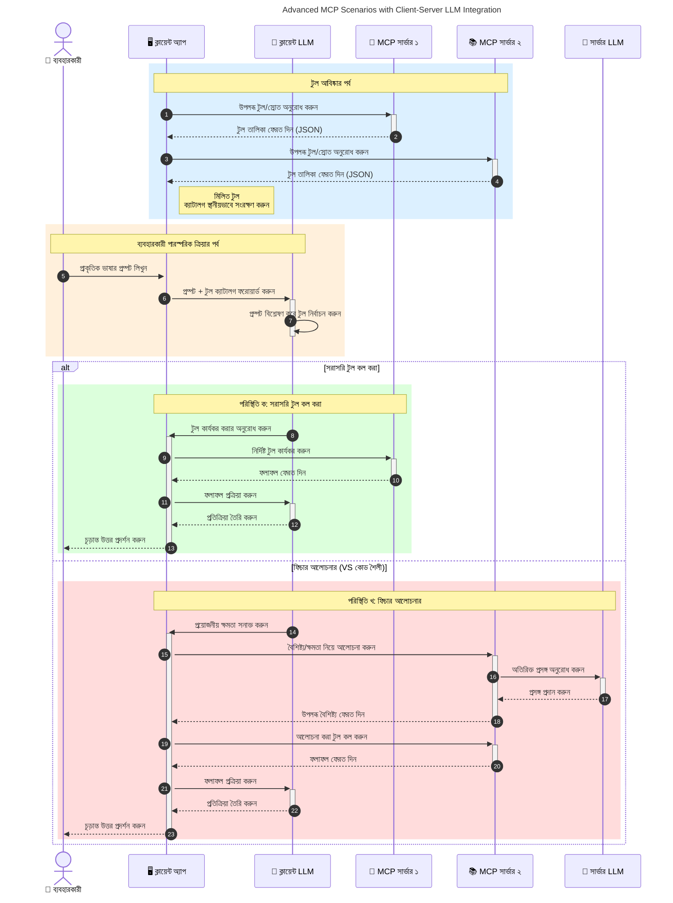

# মডেল কন্টেক্সট প্রটোকল (MCP) পরিচিতি: স্কেলযোগ্য AI অ্যাপ্লিকেশনগুলির জন্য কেন এটি গুরুত্বপূর্ণ

[](https://youtu.be/agBbdiOPLQA)

_(এই পাঠের ভিডিও দেখতে উপরের ছবিতে ক্লিক করুন)_

জেনারেটিভ AI অ্যাপ্লিকেশনগুলি একটি মহান অগ্রগতি কারণ এগুলি প্রায়ই ব্যবহারকারীকে প্রাকৃতিক ভাষার প্রম্পট ব্যবহার করে অ্যাপটির সাথে ইন্টারঅ্যাক্ট করার সুযোগ দেয়। তবে, যত বেশি সময় এবং সম্পদ এই ধরনের অ্যাপে বিনিয়োগ করা হয়, আপনি চাইবেন যে আপনি সহজে ফাংশনালিটি এবং রিসোর্সগুলি একত্রিত করতে পারেন এমনভাবে যাতে এটি সহজে সম্প্রসারিত করা যায়, আপনার অ্যাপ একাধিক মডেল ব্যবহার করতে পারে, এবং বিভিন্ন মডেলগত জটিলতাগুলি পরিচালনা করতে পারে। সংক্ষিপ্তভাবে, জেন AI অ্যাপ্লিকেশন তৈরি করা সহজ, কিন্তু যখন সেগুলি বৃদ্ধি পায় এবং আরও জটিল হয়ে ওঠে, তখন আপনাকে একটি আর্কিটেকচার সংজ্ঞায়িত করা শুরু করতে হবে এবং সম্ভবত একটি স্ট্যান্ডার্ডের ওপর নির্ভর করতে হবে যাতে আপনার অ্যাপগুলি সঙ্গতিপূর্ণ ভাবে তৈরি হয়। এই জায়গায় MCP আসে ব্যবস্থা করার জন্য এবং একটি স্ট্যান্ডার্ড প্রদান করতে।

---

## **🔍 মডেল কন্টেক্সট প্রটোকল (MCP) কী?**

**মডেল কন্টেক্সট প্রটোকল (MCP)** একটি **উন্মুক্ত, স্ট্যান্ডার্ডাইজড ইন্টারফেস** যা বড় ভাষা মডেলগুলিকে (LLMs) তাদের প্রশিক্ষণ ডেটার বাইরেও বাইরের টুল, API, এবং ডেটা সোর্সগুলির সাথে নির্বিঘ্নে ইন্টারঅ্যাক্ট করার সুযোগ দেয়। এটি একটি সঙ্গতিপূর্ণ আর্কিটেকচার প্রদান করে AI মডেলের কার্যকারিতা উন্নত করার জন্য, যা স্মার্টার, স্কেলযোগ্য এবং আরও প্রতিক্রিয়াশীল AI সিস্টেম সক্ষম করে।

---

## **🎯 কেন AI-তে স্ট্যান্ডার্ডাইজেশন গুরুত্বপূর্ণ**

যখন জেনারেটিভ AI অ্যাপ্লিকেশন আরও জটিল হয়ে ওঠে, তখন স্ট্যান্ডার্ড গ্রহণ করা অপরিহার্য হয় যা নিশ্চিত করে **স্কেলেবিলিটি, সম্প্রসারণযোগ্যতা, রক্ষণাবেক্ষণযোগ্যতা,** এবং **ভেন্ডর লক-ইন এড়ানো।** MCP এসব চাহিদা পূরণ করে:

- মডেল-টুল সংযোগকে একত্রিত করা
- নাজুক, এককালীন কাস্টম সমাধান কমানো
- বিভিন্ন ভেন্ডরের একাধিক মডেলকে একই ইকোসিস্টেমে সহঅবস্থান করার সুযোগ দেওয়া

**নোট:** যদিও MCP নিজেকে একটি উন্মুক্ত স্ট্যান্ডার্ড হিসাবে উপস্থাপন করে, কোন বিদ্যমান স্ট্যান্ডার্ড বডি যেমন IEEE, IETF, W3C, ISO বা অন্য কোনো স্ট্যান্ডার্ড বডির মাধ্যমে MCP স্ট্যান্ডার্ডাইজ করার পরিকল্পনা নেই।

---

## **📚 শেখার উদ্দেশ্য**

এই নিবন্ধের শেষে, আপনি সক্ষম হবেন:

- **মডেল কন্টেক্সট প্রটোকল (MCP)** সংজ্ঞায়িত করা এবং এর ব্যবহারের ক্ষেত্র বুঝতে
- কীভাবে MCP মডেল-টু-টুল যোগাযোগ স্ট্যান্ডার্ড করে তা বোঝা
- MCP আর্কিটেকচারের মূল উপাদানগুলি সনাক্ত করা
- এন্টারপ্রাইজ এবং ডেভেলপমেন্ট প্রেক্ষাপটে MCP এর বাস্তব ব্যবহারগুলি অন্বেষণ করা

---

## **💡 কেন মডেল কন্টেক্সট প্রটোকল (MCP) একটি গেম-চেঞ্জার**

### **🔗 MCP AI ইন্টারঅ্যাকশনে ফ্র্যাগমেন্টেশন সমাধান করে**

MCP আসার আগে, মডেলগুলিকে টুলের সাথে সংযুক্ত করতে হয়েছিল:

- প্রতিটি টুল-মডেল যুগলের জন্য কাস্টম কোড
- প্রতিটি ভেন্ডরের জন্য অ-স্ট্যান্ডার্ড API
- আপডেটের কারণে ঘনঘন বিভ্রাট
- বেশি টুল থাকলে খারাপ স্কেলেবিলিটি

### **✅ MCP স্ট্যান্ডার্ডাইজেশনের সুবিধাসমূহ**

| **সুবিধা**                | **বর্ণনা**                                                     |
|--------------------------|----------------------------------------------------------------|
| আন্তঃক্রিয়াশীলতা       | LLM গুলি বিভিন্ন ভেন্ডরের টুলের সাথে নির্বিঘ্নে কাজ করে       |
| সঙ্গতি                    | প্ল্যাটফর্ম এবং টুল জুড়ে একরকম আচরণ                          |
| পুনঃব্যবহারযোগ্যতা       | একবার তৈরি টুলগুলি প্রকল্প এবং সিস্টেম জুড়ে ব্যবহারযোগ্য     |
| দ্রুত উন্নয়ন             | স্ট্যান্ডার্ডকৃত এবং প্লাগ-অ্যান্ড-প্লে ইন্টারফেস ব্যবহার করে ডেভেলপমেন্ট টাইম কমায় |

---

## **🧱 উচ্চ-স্তরের MCP আর্কিটেকচার ওভারভিউ**

MCP একটি **ক্লায়েন্ট-সার্ভার মডেল** অনুসরণ করে, যেখানে:

- **MCP হোস্টস** AI মডেলগুলি চালায়
- **MCP ক্লায়েন্টস** অনুরোধ শুরু করে
- **MCP সার্ভারস** কন্টেক্সট, টুল এবং ক্ষমতা সরবরাহ করে

### **মূল উপাদান:**

- **রিসোর্সেস** – মডেলের জন্য স্ট্যাটিক বা ডায়নামিক ডেটা  
- **প্রম্পটস** – গাইডেড জেনারেশনের জন্য পূর্বনির্ধারিত ওয়ার্কফ্লো  
- **টুলস** – সার্চ, গণনা ইত্যাদি নির্বাহযোগ্য ফাংশন  
- **স্যাম্পলিং** – recursive ইন্টারঅ্যাকশনের মাধ্যমে এজেন্টিক আচরণ (MCP `2026-07-28` এ পরিত্যাজ্য; নতুন বাস্তবায়ন সরাসরি LLM প্রদানকারীর সঙ্গে ইন্টিগ্রেট করতে হবে)  
 
 
- **এলিসিটেশন** – সার্ভার-শুরু করা ব্যবহারকারীর ইনপুটের জন্য অনুরোধ  
- **রুটস** – সার্ভারের সাথে সম্পর্কিত তথ্যগত ফাইল সিস্টেম লোকেশন (MCP `2026-07-28` এ পরিত্যাজ্য; টুল প্যারামিটার, রিসোর্স URI বা সার্ভার কনফিগারেশন প্রাধান্য পাবে)  
 
 

### **প্রটোকল আর্কিটেকচার:**

MCP দুটি স্তরের আর্কিটেকচার ব্যবহার করে:
- **ডেটা লেয়ার**: JSON-RPC 2.0 বার্তা, প্রতি-অনুরোধ মেটাডেটা, ডিসকভারি এবং প্রটোকল প্রিমিটিভস
- **ট্রান্সপোর্ট লেয়ার**: স্থানীয় সাবপ্রসেসের জন্য stdio এবং দূরবর্তী সার্ভারের জন্য Streamable HTTP। Streamable HTTP স্ট্রিমড রেসপন্সের জন্য SSE ফ্রেমিং ব্যবহার করতে পারে, তবে পুরাতন HTTP+SSE ট্রান্সপোর্ট পরিত্যাজ্য।


---

## MCP সার্ভারগুলি কীভাবে কাজ করে

MCP সার্ভারগুলি নিম্নলিখিতভাবে কাজ করে:

- **অনুরোধ প্রবাহ**:
    1. একটি অনুরোধ একজন শেষ ব্যবহারকারী বা তাদের পক্ষ থেকে কাজ করা সফটওয়্যার দ্বারা শুরু করা হয়।
    2. **MCP ক্লায়েন্ট** অনুরোধটি **MCP হোস্ট** এ পাঠায়, যা AI মডেল রuntime পরিচালনা করে।
    3. **AI মডেল** ব্যবহারকারীর প্রম্পট গ্রহণ করে এবং এক বা একাধিক টুল কলের মাধ্যমে বাইরের টুল বা ডেটা অ্যাক্সেসের অনুরোধ করতে পারে।
    4. **MCP হোস্ট**, মডেলের সরাসরি নয়, উপযুক্ত **MCP সার্ভার(গুলি)** স্ট্যান্ডার্ড প্রটোকল ব্যবহার করে যোগাযোগ করে।
- **MCP হোস্ট কার্যকারিতা**:
    - **টুল রেজিস্ট্রি**: উপলব্ধ টুল এবং তাদের ক্ষমতার তালিকা বজায় রাখে।
    - **প্রমাণীকরণ**: টুল অ্যাক্সেসের জন্য অনুমতি যাচাই করে।
    - **অনুরোধ হ্যান্ডলার**: মডেল থেকে আসা টুল অনুরোধ প্রক্রিয়া করে।
    - **রেসপন্স ফরম্যাটার**: টুল আউটপুটগুলি এমন ফরম্যাটে গঠন করে যা মডেল বুঝতে পারে।
- **MCP সার্ভার এক্সিকিউশন**:
    - **MCP হোস্ট** একটি বা একাধিক **MCP সার্ভার** এ টুল কল রুটিং করে, প্রতিটি বিশেষায়িত ফাংশন (যেমন সার্চ, গণনা, ডেটাবেস কোয়েরি) প্রদান করে।
    - **MCP সার্ভার** তাদের সংশ্লিষ্ট অপারেশন সম্পাদন করে এবং ফলাফলগুলি সঙ্গতিপূর্ণ ফরম্যাটে **MCP হোস্ট** এ ফেরত দেয়।
    - **MCP হোস্ট** ফলাফলগুলি ফরম্যাট করে এবং **AI মডেল** এ প্রেরণ করে।
- **রেসপন্স সমাপ্তি**:
    - **AI মডেল** টুল আউটপুটকে একটি চূড়ান্ত উত্তর হিসাবে অন্তর্ভুক্ত করে।
    - **MCP হোস্ট** এই উত্তরটি **MCP ক্লায়েন্ট** এ পাঠায়, যা এটি শেষ ব্যবহারকারী বা কল করা সফটওয়্যারে পৌঁছে দেয়।
    



## 👨‍💻 কীভাবে একটি MCP সার্ভার তৈরি করবেন (উদাহরণ সহ)

MCP সার্ভারগুলি ডেটা এবং কার্যকারিতা প্রদান করে LLM ক্ষমতাগুলি সম্প্রসারিত করতে দেয়।

চেষ্টা করতে প্রস্তুত? এখানে বিভিন্ন ভাষা এবং স্ট্যাকের জন্য SDK এবং সেগুলিতে সহজ MCP সার্ভার তৈরির উদাহরণ রয়েছে:

- **Python SDK**: https://github.com/modelcontextprotocol/python-sdk

- **TypeScript SDK**: https://github.com/modelcontextprotocol/typescript-sdk

- **Java SDK**: https://github.com/modelcontextprotocol/java-sdk

- **C#/.NET SDK**: https://github.com/modelcontextprotocol/csharp-sdk


## 🌍 MCP এর বাস্তব জগতের ব্যবহারের ক্ষেত্র

MCP এআই ক্ষমতা বাড়িয়ে বিভিন্ন ধরণের অ্যাপ্লিকেশন সক্ষম করে:

| **অ্যাপ্লিকেশন**             | **বর্ণনা**                                                    |
|------------------------------|----------------------------------------------------------------|
| এন্টারপ্রাইজ ডেটা ইন্টিগ্রেশন | LLM গুলিকে ডেটাবেস, CRM অথবা অভ্যন্তরীণ টুলের সাথে সংযুক্ত করা  |
| এজেন্টিক AI সিস্টেমস         | টুল অ্যাক্সেস এবং সিদ্ধান্তগ্রহণের ওয়ার্কফ্লো সহ স্বায়ত্তশাসিত এজেন্ট সক্ষম করা  |
| মাল্টি-মোডাল অ্যাপ্লিকেশনস | একক ঐক্যবদ্ধ AI অ্যাপে টেক্সট, ছবি, এবং অডিও টুল একত্রিত করা  |
| রিয়েল-টাইম ডেটা ইন্টিগ্রেশন | AI ইন্টারঅ্যাকশনে লাইভ ডেটা নিয়ে আসা, আরও সঠিক এবং বর্তমান আউটপুটের জন্য |


### 🧠 MCP = AI ইন্টারঅ্যাকশনের জন্য সর্বজনীন স্ট্যান্ডার্ড

মডেল কন্টেক্সট প্রটোকল (MCP) AI ইন্টারঅ্যাকশনের জন্য একটি সর্বজনীন স্ট্যান্ডার্ড হিসেবে কাজ করে, যেমন USB-C ডিভাইসের জন্য শারীরিক সংযোগ স্থাপনের স্ট্যান্ডার্ড। AI জগতে MCP একটি সঙ্গতিপূর্ণ ইন্টারফেস প্রদান করে, মডেল (ক্লায়েন্ট) এবং বাইরের টুল ও ডেটা প্রদানকারী (সার্ভার) কে নির্বিঘ্নে একত্রিত করার সুযোগ দেয়। এতে প্রতিটি API বা ডেটা সোর্সের জন্য বিভিন্ন কাস্টম প্রটোকলের প্রয়োজনীয়তা দূর হয়।

MCP এর অধীনে, একটি MCP-সঙ্গত টুল (যাকে MCP সার্ভার বলা হয়) একটি একক স্ট্যান্ডার্ড অনুসরণ করে। এই সার্ভারগুলি তাদের সরবরাহকৃত টুল বা ক্রিয়াকলাপের তালিকা দেয় এবং AI এজেন্টের অনুরোধে সেগুলি কার্যকর করে। MCP সমর্থনকারী AI এজেন্ট প্ল্যাটফর্মগুলি সার্ভার থেকে উপলব্ধ টুলগুলি আবিষ্কার করতে এবং এই স্ট্যান্ডার্ড প্রটোকল দ্বারা তাদের আহ্বান করতে পারে।

### 💡 জ্ঞানে প্রবেশাধিকার সহজ করে

শুধুমাত্র টুল সরবরাহ না করে, MCP জ্ঞানে প্রবেশাধারকেও সহজ করে। এটি অ্যাপ্লিকেশনগুলিকে বড় ভাষা মডেল (LLM) কে বিভিন্ন ডেটা সোর্সের সাথে সংযুক্ত করে প্রসঙ্গ প্রদান করতে সক্ষম করে। উদাহরণস্বরূপ, একটি MCP সার্ভার হতে পারে একটি কোম্পানির ডকুমেন্ট রিপোজিটরি, যা এজেন্টকে প্রয়োজনীয় তথ্য গ্রহণ করতে দেয়। অন্য একটি সার্ভার ইমেইল পাঠানো বা রেকর্ড আপডেটের মতো নির্দিষ্ট কাজ পরিচালনা করতে পারে। এজেন্টের দৃষ্টিভঙ্গিতে এগুলি হল কেবল টুলস—কিছু টুল তথ্য (জ্ঞান প্রসঙ্গ) প্রদান করে, অন্যগুলি কাজ সম্পাদন করে। MCP দক্ষতার সাথে উভয় পরিচালনা করে।

একটি এজেন্ট যখন একটি MCP সার্ভারের সঙ্গে সংযুক্ত হয়, তখন স্বয়ংক্রিয়ভাবে সেই সার্ভারের উপলব্ধ ক্ষমতা এবং অ্যাক্সেসযোগ্য ডেটা স্ট্যান্ডার্ড ফরম্যাটের মাধ্যমে শেখে। এই স্ট্যান্ডার্ডাইজেশন গতিশীল টুল উপলব্ধতা সক্ষম করে। উদাহরণস্বরূপ, একটি নতুন MCP সার্ভার এজেন্ট সিস্টেমে যুক্ত করলে এর কার্যকারিতা সঙ্গে সঙ্গেই ব্যবহারযোগ্য হয়, এজেন্টের নির্দেশাবলীর অতিরিক্ত কাস্টমাইজেশনের প্রয়োজন ছাড়াই।

এই সুসংগঠিত ইন্টিগ্রেশন নিম্নলিখিত চিত্রে প্রদর্শিত প্রবাহের সাথে সামঞ্জস্যপূর্ণ, যেখানে সার্ভারগুলি টুল এবং জ্ঞান উভয়ই সরবরাহ করে, সিস্টেমগুলির মধ্যে নির্বিঘ্ন সহযোগিতা নিশ্চিত করে।

### 👉 উদাহরণ: স্কেলেবল এজেন্ট সমাধান

```mermaid
---
title: Scalable Agent Solution with MCP
description: A diagram illustrating how a user interacts with an LLM that connects to multiple MCP servers, with each server providing both knowledge and tools, creating a scalable AI system architecture
---
graph TD
    User -->|প্রম্পট| LLM
    LLM -->|উত্তর| User
    LLM -->|এমসিপি| ServerA
    LLM -->|এমসিপি| ServerB
    ServerA -->|সার্বজনীন সংযোগকারী| ServerB
    ServerA --> KnowledgeA
    ServerA --> ToolsA
    ServerB --> KnowledgeB
    ServerB --> ToolsB

    subgraph সার্ভার এ
        KnowledgeA[জ্ঞান]
        ToolsA[সরঞ্জাম]
    end

    subgraph সার্ভার বি
        KnowledgeB[জ্ঞান]
        ToolsB[সরঞ্জাম]
    end
```
 ইউনিভার্সাল কানেক্টর MCP সার্ভারদের একে অপরের সাথে যোগাযোগ এবং ক্ষমতা ভাগ করতে সক্ষম করে, যার মাধ্যমে ServerA ServerB কে কাজ প্রেরণ করতে পারে বা তার টুল এবং জ্ঞান অ্যাক্সেস করতে পারে। এটি সার্ভার জুড়ে টুল ও ডেটা ফেডারেট করে, স্কেলেবল এবং মডুলার এজেন্ট আর্কিটেকচারের সমর্থন করে। যেহেতু MCP টুল এক্সপোজার স্ট্যান্ডার্ড করে, এজেন্টগুলি ডাইনামিকভাবে সার্ভার থেকে টুল আবিষ্কার ও অনুরোধ রাউট করতে পারে, হার্ডকোডেড ইন্টিগ্রেশনের প্রয়োজন ছাড়াই।


টুল এবং জ্ঞান ফেডারেশন: সার্ভার জুড়ে টুল এবং ডেটা অ্যাক্সেসযোগ্য, বেশি স্কেলযোগ্য এবং মডুলার এজেন্টিক আর্কিটেকচার সক্ষম করে।

### 🔄 ক্লায়েন্ট-সাইড LLM ইন্টিগ্রেশনের সঙ্গে উন্নত MCP দৃশ্যপট

বেসিক MCP আর্কিটেকচারের বাইরে, এমন কিছু উন্নত দৃশ্যপট রয়েছে যেখানে ক্লায়েন্ট এবং সার্ভার উভয়ই LLM ধারণ করে, যা আরও জটিল ইন্টারঅ্যাকশন সক্ষম করে। নিচের চিত্রে, **ক্লায়েন্ট অ্যাপ** হতে পারে একটি IDE যেখানে LLM দ্বারা ব্যবহারের জন্য অনেক MCP টুল উপলব্ধ:



## 🔐 MCP এর বাস্তব সুবিধাসমূহ

MCP ব্যবহারের বাস্তব সুবিধাগুলি নিম্নরূপ:

- **তাজা তথ্য**: মডেলগুলি তাদের প্রশিক্ষণ ডেটার বাইরের সর্বশেষ তথ্য অ্যাক্সেস করতে পারে
- **ক্ষমতা সম্প্রসারণ**: মডেলগুলি তাদের প্রশিক্ষণের বাইরে নির্দিষ্ট টুল ব্যবহার করতে সক্ষম হয়
- **হ্যালুসিনেশন হ্রাস**: বাইরের তথ্যসূত্র সত্য ভিত্তি প্রদান করে
- **গোপনীয়তা**: সংবেদনশীল তথ্য প্রম্পটে অন্তর্ভুক্ত না করে সুরক্ষিত পরিবেশে রাখতে পারে

## 📌 মূল বিষয়সমূহ

MCP ব্যবহারের মূল বিষয়গুলো হলো:

- **MCP** স্ট্যান্ডার্ড করে কিভাবে AI মডেল টুল এবং ডেটার সাথে ইন্টারঅ্যাক্ট করে
- **সম্প্রসারণযোগ্যতা, সঙ্গতি এবং আন্তঃক্রিয়াশীলতা** প্রচার করে
- MCP সাহায্য করে **উন্নয়ন সময় কমাতে, নির্ভরযোগ্যতা বাড়াতে, এবং মডেল ক্ষমতা সম্প্রসারণ করতে**
- ক্লায়েন্ট-সার্ভার আর্কিটেকচার **নমনীয়, সম্প্রসারিত AI অ্যাপ্লিকেশন সক্ষম করে**

## 🧠 অনুশীলন

আপনি যে AI অ্যাপ্লিকেশন তৈরি করতে আগ্রহী তা ভাবুন।

- কোন **বাইরের টুল বা ডেটা** এর মাধ্যমে এর ক্ষমতা বাড়ানো যায়?
- MCP কিভাবে ইন্টিগ্রেশনকে **সহজ এবং নির্ভরযোগ্য** করতে পারে?

## অতিরিক্ত সম্পদ

- [MCP GitHub Repository](https://github.com/modelcontextprotocol)


## পরবর্তী কি

পরবর্তী: [চ্যাপ্টার ১: মূল ধারণা](../01-CoreConcepts/README.md)

---

<!-- CO-OP TRANSLATOR DISCLAIMER START -->
**অস্বীকৃতি**:
এই নথিটি AI অনুবাদ পরিষেবা [Co-op Translator](https://github.com/Azure/co-op-translator) ব্যবহার করে অনূদিত হয়েছে। যদিও আমরা শুদ্ধতার জন্য চেষ্টা করি, অনুগ্রহ করে মনে রাখবেন যে স্বয়ংক্রিয় অনুবাদে ত্রুটি বা অসঙ্গতি থাকতে পারে। মূল নথিটি তার স্বভাষায় কর্তৃত্বপূর্ণ উৎস হিসেবে বিবেচিত হওয়া উচিত। গুরুত্বপূর্ণ তথ্যের জন্য পেশাদার মানব অনুবাদ সুপারিশ করা হয়। এই অনুবাদের ব্যবহারে প্রয়োজনীয় ভুল বোঝাবুঝি বা ভুল ব্যাখ্যার জন্য আমরা দায়বদ্ধ নই।
<!-- CO-OP TRANSLATOR DISCLAIMER END -->