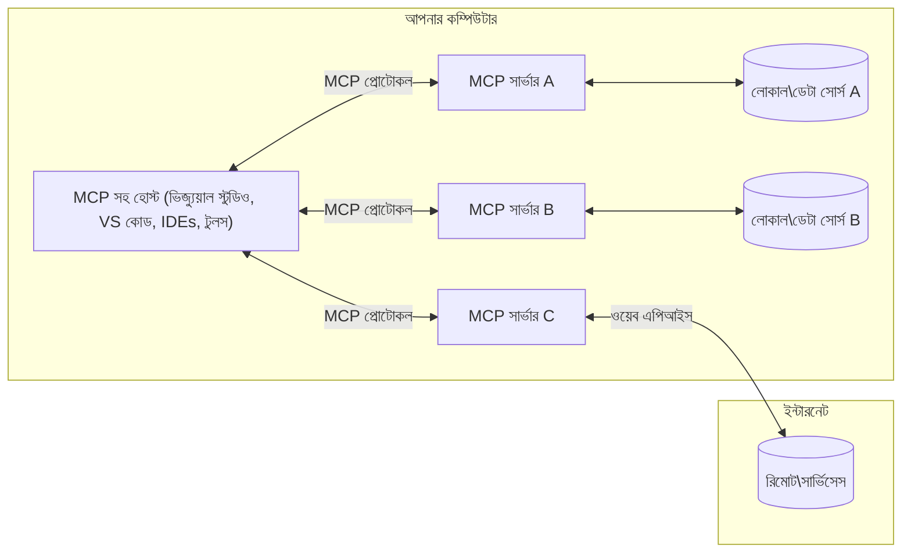

# MCP মূল ধারণা: AI ইন্টিগ্রেশনের জন্য মডেল কনটেক্সট প্রোটোকল আয়ত্ত করা

[](https://youtu.be/earDzWGtE84)

_(এই পাঠের ভিডিও দেখতে উপরের ছবিতে ক্লিক করুন)_

[Model Context Protocol (MCP)](https://github.com/modelcontextprotocol) একটি শক্তিশালী, মানকৃত ফ্রেমওয়ার্ক যা বড় ভাষা মডেল (LLMs) এবং বাহ্যিক টুল, অ্যাপ্লিকেশন, এবং ডেটা উৎসের মধ্যে যোগাযোগকে অপ্টিমাইজ করে।  
এই গাইডটি আপনাকে MCP এর মূল ধারণাগুলো সম্পর্কে জানাবে। আপনি এর ক্লায়েন্ট-সার্ভার আর্কিটেকচার, প্রয়োজনীয় উপাদান, যোগাযোগের প্রক্রিয়া, এবং বাস্তবায়নের সেরা অনুশীলন সম্পর্কে শিখবেন।

- **স্পষ্ট ব্যবহারকারী সম্মতি**: সমস্ত ডেটা অ্যাক্সেস এবং অপারেশন কার্যকর করার আগে স্পষ্ট ব্যবহারকারী অনুমোদন প্রয়োজন। ব্যবহারকারীদের অবশ্যই পরিষ্কারভাবে বুঝতে হবে কোন ডেটা অ্যাক্সেস করা হবে এবং কোন কাজগুলি সম্পাদিত হবে, অনুমতি এবং অনুমোদনের উপর সূক্ষ্ম নিয়ন্ত্রণ সহ।

- **ডেটা গোপনীয়তা সুরক্ষা**: ব্যবহারকারীর ডেটা শুধুমাত্র স্পষ্ট সম্মতির মাধ্যমে প্রকাশ করা হয় এবং পুরো ইন্টারঅ্যাকশন লাইফসাইকেলের সময় শক্তিশালী অ্যাক্সেস নিয়ন্ত্রণ দ্বারা সুরক্ষিত থাকতে হবে। বাস্তবায়নগুলি অননুমোদিত ডেটা প্রেরণ প্রতিরোধ করতে হবে এবং কঠোর গোপনীয়তা সীমানা বজায় রাখতে হবে।

- **টুল কার্যকরী নিরাপত্তা**: প্রতিটি টুল আহ্বানে স্পষ্ট ব্যবহারকারী সম্মতি প্রয়োজন, টুলের কার্যকারিতা, প্যারামিটার এবং সম্ভাব্য প্রভাব স্পষ্টভাবে বোঝার সাথে। শক্তিশালী নিরাপত্তা সীমানা অনিচ্ছাকৃত, অসুরক্ষিত, বা ক্ষতিকারক টুল কার্যকরী প্রতিরোধ করবে।

- **ট্রান্সপোর্ট লেয়ার সিকিউরিটি**: সমস্ত যোগাযোগ চ্যানেল উপযুক্ত এনক্রিপশন এবং প্রমাণীকরণ পদ্ধতি ব্যবহার করা উচিত। রিমোট সংযোগগুলি নিরাপদ ট্রান্সপোর্ট প্রোটোকল এবং সঠিক ক্রেডেনশিয়াল ব্যবস্থাপনা বাস্তবায়ন করা উচিত।

#### বাস্তবায়ন নির্দেশিকা:

- **অনুমতি ব্যবস্থাপনা**: সূক্ষ্ম-গ্রেনুলার অনুমতি সিস্টেম বাস্তবায়ন করুন যা ব্যবহারকারীদের নিয়ন্ত্রণ করতে দেয় কোন সার্ভার, টুল, এবং রিসোর্স অ্যাক্সেসযোগ্য
- **প্রমাণীকরণ ও অনুমোদন**: নিরাপদ প্রমাণীকরণ পদ্ধতি (OAuth, API কী) ব্যবহার করুন সঠিক টোকেন ব্যবস্থাপনা এবং মেয়াদ উত্তীর্ণ সহ  
- **ইনপুট যাচাই**: সংজ্ঞায়িত স্কিমা অনুযায়ী সমস্ত প্যারামিটার এবং ডেটা ইনপুট যাচাই করুন ইনজেকশন আক্রমণ প্রতিরোধে
- **অডিট লগিং**: নিরাপত্তা পর্যবেক্ষণ এবং সম্মতির জন্য সমস্ত অপারেশনের বিস্তৃত লগ বজায় রাখুন

## ওভারভিউ

এই পাঠে MCP ইকোসিস্টেমের মৌলিক আর্কিটেকচার এবং উপাদানগুলি অন্বেষণ করা হবে। আপনি ক্লায়েন্ট-সার্ভার আর্কিটেকচার, মূল উপাদান, এবং MCP ইন্টারঅ্যাকশনের যোগাযোগ প্রক্রিয়া সম্পর্কে শিখবেন।

## মূল শেখার উদ্দেশ্য

এই পাঠের শেষে, আপনি:

- MCP ক্লায়েন্ট-সার্ভার আর্কিটেকচার বুঝতে পারবেন।
- হোস্ট, ক্লায়েন্ট, এবং সার্ভারের ভূমিকা ও দায়িত্ব চিহ্নিত করতে পারবেন।
- MCP কে একটি নমনীয় ইন্টিগ্রেশন স্তর করে তোলার মূল বৈশিষ্ট্য বিশ্লেষণ করতে পারবেন।
- MCP ইকোসিস্টেমের মধ্যে তথ্য প্রবাহ কিভাবে হয় তা শিখবেন।
- .NET, Java, Python, এবং JavaScript এ কোড উদাহরণের মাধ্যমে ব্যবহারিক অন্তর্দৃষ্টি অর্জন করবেন।

## MCP আর্কিটেকচার: গভীর দৃষ্টিভঙ্গি

MCP ইকোসিস্টেম একটি ক্লায়েন্ট-সার্ভার মডেলের উপর নির্মিত। এই মডুলার কাঠামো AI অ্যাপ্লিকেশনগুলোকে টুল, ডেটাবেস, API, এবং প্রাসঙ্গিক রিসোর্সের সাথে দক্ষতার সাথে ইন্টারঅ্যাক্ট করতে দেয়। আসুন এই আর্কিটেকচারকে এর মূল উপাদানে ভাগ করি।

মূলত, MCP একটি ক্লায়েন্ট-সার্ভার আর্কিটেকচার অনুসরণ করে যেখানে একটি হোস্ট অ্যাপ্লিকেশন একাধিক সার্ভারের সাথে সংযোগ করতে পারে:


- **MCP হোস্টস**: VSCode, Claude Desktop, IDEs, বা AI টুলের মতো প্রোগ্রাম যা MCP এর মাধ্যমে ডেটা অ্যাক্সেস করতে চায়
- **MCP ক্লায়েন্টস**: প্রোটোকল ক্লায়েন্ট যারা সার্ভারের সাথে ১:১ সংযোগ বজায় রাখে
- **MCP সার্ভারস**: হালকা ওজনের প্রোগ্রাম যা প্রতিটি নির্দিষ্ট ক্ষমতা MCP প্রোটোকলের মাধ্যমে প্রকাশ করে
- **লোকাল ডেটা সোর্স**: আপনার কম্পিউটারের ফাইল, ডেটাবেস, এবং সার্ভিস যা MCP সার্ভার নিরাপদে অ্যাক্সেস করতে পারে
- **রিমোট সার্ভিসেস**: ইন্টারনেটের মাধ্যমে উপলব্ধ বাহ্যিক সিস্টেম যা MCP সার্ভার API এর মাধ্যমে সংযোগ করতে পারে।

MCP প্রোটোকল একটি বিকাশমান স্ট্যান্ডার্ড যা তারিখ-ভিত্তিক সংস্করণ ব্যবহার করে (YYYY-MM-DD ফরম্যাট)। বর্তমান প্রোটোকল সংস্করণ হল **2025-11-25**। আপনি [প্রোটোকল স্পেসিফিকেশন](https://modelcontextprotocol.io/specification/2025-11-25/) এ সর্বশেষ আপডেট দেখতে পারেন।

### ১. হোস্টস

Model Context Protocol (MCP) এ, **হোস্টস** হল AI অ্যাপ্লিকেশন যা ব্যবহারকারীরা প্রোটোকলের সাথে ইন্টারঅ্যাক্ট করার জন্য প্রধান ইন্টারফেস হিসেবে কাজ করে। হোস্টস একাধিক MCP সার্ভারের সাথে সংযোগ সমন্বয় এবং পরিচালনা করে প্রতিটি সার্ভার সংযোগের জন্য নিবেদিত MCP ক্লায়েন্ট তৈরি করে। হোস্টসের উদাহরণ:

- **AI অ্যাপ্লিকেশন**: Claude Desktop, Visual Studio Code, Claude Code
- **ডেভেলপমেন্ট এনভায়রনমেন্ট**: MCP ইন্টিগ্রেশন সহ IDE এবং কোড এডিটর  
- **কাস্টম অ্যাপ্লিকেশন**: উদ্দেশ্যনির্দিষ্ট AI এজেন্ট এবং টুল

**হোস্টস** হল অ্যাপ্লিকেশন যা AI মডেল ইন্টারঅ্যাকশন সমন্বয় করে। তারা:

- **AI মডেল পরিচালনা করে**: LLMs এর সাথে ইন্টারঅ্যাক্ট করে প্রতিক্রিয়া তৈরি এবং AI ওয়ার্কফ্লো সমন্বয় করে
- **ক্লায়েন্ট সংযোগ পরিচালনা করে**: প্রতিটি MCP সার্ভার সংযোগের জন্য একটি MCP ক্লায়েন্ট তৈরি ও বজায় রাখে
- **ইউজার ইন্টারফেস নিয়ন্ত্রণ করে**: কথোপকথনের প্রবাহ, ব্যবহারকারী ইন্টারঅ্যাকশন, এবং প্রতিক্রিয়া উপস্থাপন পরিচালনা করে  
- **নিরাপত্তা প্রয়োগ করে**: অনুমতি, নিরাপত্তা সীমাবদ্ধতা, এবং প্রমাণীকরণ নিয়ন্ত্রণ করে
- **ব্যবহারকারী সম্মতি পরিচালনা করে**: ডেটা শেয়ারিং এবং টুল কার্যকরীর জন্য ব্যবহারকারী অনুমোদন পরিচালনা করে

### ২. ক্লায়েন্টস

**ক্লায়েন্টস** হল গুরুত্বপূর্ণ উপাদান যা হোস্ট এবং MCP সার্ভারের মধ্যে নিবেদিত এক-এক সংযোগ বজায় রাখে। প্রতিটি MCP ক্লায়েন্ট হোস্ট দ্বারা একটি নির্দিষ্ট MCP সার্ভারের সাথে সংযোগ করার জন্য তৈরি হয়, যা সংগঠিত এবং নিরাপদ যোগাযোগ চ্যানেল নিশ্চিত করে। একাধিক ক্লায়েন্ট হোস্টকে একাধিক সার্ভারের সাথে একযোগে সংযোগ করতে সক্ষম করে।

**ক্লায়েন্টস** হল হোস্ট অ্যাপ্লিকেশনের মধ্যে সংযোগকারী উপাদান। তারা:

- **প্রোটোকল যোগাযোগ**: সার্ভারে JSON-RPC 2.0 অনুরোধ পাঠায় প্রম্পট এবং নির্দেশাবলী সহ
- **ক্ষমতা আলোচনা**: ইনিশিয়ালাইজেশনের সময় সার্ভারের সাথে সমর্থিত বৈশিষ্ট্য এবং প্রোটোকল সংস্করণ নিয়ে আলোচনা করে
- **টুল কার্যকরী**: মডেল থেকে টুল কার্যকরী অনুরোধ পরিচালনা করে এবং প্রতিক্রিয়া প্রক্রিয়া করে
- **রিয়েল-টাইম আপডেট**: সার্ভার থেকে বিজ্ঞপ্তি এবং রিয়েল-টাইম আপডেট পরিচালনা করে
- **প্রতিক্রিয়া প্রক্রিয়াকরণ**: ব্যবহারকারীদের প্রদর্শনের জন্য সার্ভারের প্রতিক্রিয়া প্রক্রিয়া এবং ফরম্যাট করে

### ৩. সার্ভারস

**সার্ভারস** হল প্রোগ্রাম যা MCP ক্লায়েন্টদের প্রাসঙ্গিকতা, টুল, এবং ক্ষমতা প্রদান করে। তারা লোকালি (হোস্টের একই মেশিনে) বা রিমোটলি (বাহ্যিক প্ল্যাটফর্মে) চালানো যেতে পারে এবং ক্লায়েন্ট অনুরোধ পরিচালনা ও কাঠামোবদ্ধ প্রতিক্রিয়া প্রদান করার জন্য দায়ী। সার্ভাররা MCP এর মানকৃত প্রোটোকলের মাধ্যমে নির্দিষ্ট কার্যকারিতা প্রকাশ করে।

**সার্ভারস** হল সার্ভিস যা প্রাসঙ্গিকতা এবং ক্ষমতা প্রদান করে। তারা:

- **বৈশিষ্ট্য নিবন্ধন**: ক্লায়েন্টদের জন্য উপলব্ধ প্রিমিটিভ (রিসোর্স, প্রম্পট, টুল) নিবন্ধন এবং প্রকাশ করে
- **অনুরোধ প্রক্রিয়াকরণ**: ক্লায়েন্ট থেকে টুল কল, রিসোর্স অনুরোধ, এবং প্রম্পট অনুরোধ গ্রহণ ও কার্যকর করে
- **প্রাসঙ্গিকতা প্রদান**: মডেল প্রতিক্রিয়া উন্নত করার জন্য প্রাসঙ্গিক তথ্য এবং ডেটা প্রদান করে
- **স্টেট ম্যানেজমেন্ট**: সেশন স্টেট বজায় রাখে এবং প্রয়োজনে স্টেটফুল ইন্টারঅ্যাকশন পরিচালনা করে
- **রিয়েল-টাইম বিজ্ঞপ্তি**: ক্ষমতা পরিবর্তন এবং আপডেট সম্পর্কে সংযুক্ত ক্লায়েন্টদের বিজ্ঞপ্তি পাঠায়

সার্ভারগুলি বিশেষায়িত কার্যকারিতার মাধ্যমে মডেল ক্ষমতা বাড়ানোর জন্য যেকেউ তৈরি করতে পারে এবং তারা লোকাল ও রিমোট উভয় ডিপ্লয়মেন্ট সাপোর্ট করে।

### ৪. সার্ভার প্রিমিটিভস

Model Context Protocol (MCP) এর সার্ভারগুলি তিনটি মূল **প্রিমিটিভ** প্রদান করে যা ক্লায়েন্ট, হোস্ট, এবং ভাষা মডেলের মধ্যে সমৃদ্ধ ইন্টারঅ্যাকশনের মৌলিক নির্মাণ ব্লক নির্ধারণ করে। এই প্রিমিটিভগুলি প্রোটোকলের মাধ্যমে উপলব্ধ প্রাসঙ্গিক তথ্য এবং ক্রিয়াকলাপের ধরন নির্ধারণ করে।

MCP সার্ভারগুলি নিম্নলিখিত তিনটি মূল প্রিমিটিভের যেকোনো সংমিশ্রণ প্রকাশ করতে পারে:

#### রিসোর্সেস

**রিসোর্সেস** হল ডেটা উৎস যা AI অ্যাপ্লিকেশনকে প্রাসঙ্গিক তথ্য প্রদান করে। এগুলো স্থির বা গতিশীল বিষয়বস্তু প্রতিনিধিত্ব করে যা মডেলের বোঝাপড়া এবং সিদ্ধান্ত গ্রহণ উন্নত করতে পারে:

- **প্রাসঙ্গিক ডেটা**: AI মডেল ব্যবহারের জন্য কাঠামোবদ্ধ তথ্য এবং প্রাসঙ্গিকতা
- **জ্ঞানভাণ্ডার**: ডকুমেন্ট রিপোজিটরি, নিবন্ধ, ম্যানুয়াল, এবং গবেষণা পত্র
- **লোকাল ডেটা সোর্স**: ফাইল, ডেটাবেস, এবং লোকাল সিস্টেম তথ্য  
- **বাহ্যিক ডেটা**: API প্রতিক্রিয়া, ওয়েব সার্ভিস, এবং রিমোট সিস্টেম ডেটা
- **গতিশীল বিষয়বস্তু**: বাহ্যিক শর্তের উপর ভিত্তি করে আপডেট হওয়া রিয়েল-টাইম ডেটা

রিসোর্সগুলি URI দ্বারা সনাক্ত করা হয় এবং `resources/list` এর মাধ্যমে আবিষ্কার এবং `resources/read` পদ্ধতির মাধ্যমে প্রাপ্তি সমর্থন করে:

```text
file://documents/project-spec.md
database://production/users/schema
api://weather/current
```

#### প্রম্পটস

**প্রম্পটস** হল পুনঃব্যবহারযোগ্য টেমপ্লেট যা ভাষা মডেলের সাথে ইন্টারঅ্যাকশন গঠন করতে সাহায্য করে। এগুলো মানকৃত ইন্টারঅ্যাকশন প্যাটার্ন এবং টেমপ্লেটেড ওয়ার্কফ্লো প্রদান করে:

- **টেমপ্লেট-ভিত্তিক ইন্টারঅ্যাকশন**: পূর্ব-গঠিত বার্তা এবং কথোপকথন শুরু
- **ওয়ার্কফ্লো টেমপ্লেট**: সাধারণ কাজ এবং ইন্টারঅ্যাকশনের জন্য মানকৃত সিকোয়েন্স
- **ফিউ-শট উদাহরণ**: মডেল নির্দেশনার জন্য উদাহরণ-ভিত্তিক টেমপ্লেট
- **সিস্টেম প্রম্পটস**: মডেল আচরণ এবং প্রাসঙ্গিকতা নির্ধারণকারী মৌলিক প্রম্পট
- **গতিশীল টেমপ্লেট**: নির্দিষ্ট প্রাসঙ্গিকতার সাথে খাপ খাওয়ানো প্যারামিটারযুক্ত প্রম্পট

প্রম্পটগুলি ভেরিয়েবল প্রতিস্থাপন সমর্থন করে এবং `prompts/list` এর মাধ্যমে আবিষ্কার এবং `prompts/get` এর মাধ্যমে প্রাপ্তি করা যায়:

```markdown
Generate a {{task_type}} for {{product}} targeting {{audience}} with the following requirements: {{requirements}}
```

#### টুলস

**টুলস** হল কার্যকরী ফাংশন যা AI মডেল নির্দিষ্ট কাজ সম্পাদনের জন্য আহ্বান করতে পারে। এগুলো MCP ইকোসিস্টেমের "ক্রিয়া" প্রতিনিধিত্ব করে, মডেলকে বাহ্যিক সিস্টেমের সাথে ইন্টারঅ্যাক্ট করার সুযোগ দেয়:

- **কার্যকরী ফাংশন**: নির্দিষ্ট প্যারামিটার সহ মডেলগুলি যেগুলো আহ্বান করতে পারে এমন পৃথক অপারেশন
- **বাহ্যিক সিস্টেম ইন্টিগ্রেশন**: API কল, ডেটাবেস অনুসন্ধান, ফাইল অপারেশন, গণনা
- **অনন্য পরিচয়**: প্রতিটি টুলের একটি স্বতন্ত্র নাম, বর্ণনা, এবং প্যারামিটার স্কিমা থাকে
- **কাঠামোবদ্ধ ইনপুট/আউটপুট**: টুলগুলি যাচাইকৃত প্যারামিটার গ্রহণ করে এবং কাঠামোবদ্ধ, টাইপকৃত প্রতিক্রিয়া প্রদান করে
- **কর্মক্ষমতা**: মডেলকে বাস্তব বিশ্বের কাজ সম্পাদন এবং লাইভ ডেটা পুনরুদ্ধার করতে সক্ষম করে

টুলগুলি প্যারামিটার যাচাইয়ের জন্য JSON স্কিমা সহ সংজ্ঞায়িত এবং `tools/list` এর মাধ্যমে আবিষ্কার এবং `tools/call` এর মাধ্যমে কার্যকর করা হয়:

```typescript
server.tool(
  "search_products", 
  {
    query: z.string().describe("Search query for products"),
    category: z.string().optional().describe("Product category filter"),
    max_results: z.number().default(10).describe("Maximum results to return")
  }, 
  async (params) => {
    // অনুসন্ধান সম্পাদন করুন এবং কাঠামোবদ্ধ ফলাফল ফেরত দিন
    return await productService.search(params);
  }
);
```

## ক্লায়েন্ট প্রিমিটিভস

Model Context Protocol (MCP) এ, **ক্লায়েন্টস** এমন প্রিমিটিভ প্রকাশ করতে পারে যা সার্ভারকে হোস্ট অ্যাপ্লিকেশন থেকে অতিরিক্ত ক্ষমতা অনুরোধ করার সুযোগ দেয়। এই ক্লায়েন্ট-সাইড প্রিমিটিভগুলি আরও সমৃদ্ধ, ইন্টারেক্টিভ সার্ভার বাস্তবায়ন সক্ষম করে যা AI মডেল ক্ষমতা এবং ব্যবহারকারী ইন্টারঅ্যাকশনে অ্যাক্সেস পায়।

### স্যাম্পলিং

**স্যাম্পলিং** সার্ভারকে ক্লায়েন্টের AI অ্যাপ্লিকেশন থেকে ভাষা মডেল সম্পূর্ণতা অনুরোধ করার সুযোগ দেয়। এই প্রিমিটিভ সার্ভারকে তাদের নিজস্ব মডেল নির্ভরতা ছাড়াই LLM ক্ষমতায় অ্যাক্সেস করতে সক্ষম করে:

- **মডেল-স্বাধীন অ্যাক্সেস**: সার্ভারগুলি LLM SDK অন্তর্ভুক্ত না করেই সম্পূর্ণতা অনুরোধ করতে পারে বা মডেল অ্যাক্সেস পরিচালনা করতে হয় না
- **সার্ভার-উদ্বোধিত AI**: সার্ভারকে স্বায়ত্তশাসিতভাবে ক্লায়েন্টের AI মডেল ব্যবহার করে বিষয়বস্তু তৈরি করতে সক্ষম করে
- **পুনরাবৃত্ত LLM ইন্টারঅ্যাকশন**: জটিল পরিস্থিতি সমর্থন করে যেখানে সার্ভারকে প্রক্রিয়াকরণের জন্য AI সহায়তা প্রয়োজন
- **গতিশীল বিষয়বস্তু তৈরি**: সার্ভারকে হোস্টের মডেল ব্যবহার করে প্রাসঙ্গিক প্রতিক্রিয়া তৈরি করতে দেয়

স্যাম্পলিং `sampling/complete` পদ্ধতির মাধ্যমে শুরু হয়, যেখানে সার্ভার ক্লায়েন্টকে সম্পূর্ণতা অনুরোধ পাঠায়।

### এলিসিটেশন

**এলিসিটেশন** সার্ভারকে ক্লায়েন্ট ইন্টারফেসের মাধ্যমে ব্যবহারকারীর কাছ থেকে অতিরিক্ত তথ্য বা নিশ্চিতকরণ অনুরোধ করার সুযোগ দেয়:

- **ব্যবহারকারী ইনপুট অনুরোধ**: টুল কার্যকরীর জন্য প্রয়োজন হলে সার্ভার অতিরিক্ত তথ্য চাইতে পারে
- **নিশ্চিতকরণ ডায়ালগ**: সংবেদনশীল বা প্রভাবশালী অপারেশনের জন্য ব্যবহারকারী অনুমোদন চাওয়া
- **ইন্টারেক্টিভ ওয়ার্কফ্লো**: ধাপে ধাপে ব্যবহারকারী ইন্টারঅ্যাকশন তৈরি করতে সক্ষম করে
- **গতিশীল প্যারামিটার সংগ্রহ**: টুল কার্যকরীর সময় অনুপস্থিত বা ঐচ্ছিক প্যারামিটার সংগ্রহ করে

এলিসিটেশন অনুরোধগুলি `elicitation/request` পদ্ধতি ব্যবহার করে ক্লায়েন্টের ইন্টারফেসের মাধ্যমে ব্যবহারকারী ইনপুট সংগ্রহের জন্য করা হয়।

### লগিং

**লগিং** সার্ভারকে ক্লায়েন্টকে কাঠামোবদ্ধ লগ বার্তা পাঠানোর সুযোগ দেয় ডিবাগিং, পর্যবেক্ষণ, এবং অপারেশনাল দৃশ্যমানতার জন্য:

- **ডিবাগিং সমর্থন**: সমস্যা সমাধানের জন্য বিস্তারিত কার্যকরী লগ প্রদান করতে সক্ষম করে
- **অপারেশনাল মনিটরিং**: ক্লায়েন্টকে অবস্থা আপডেট এবং কর্মক্ষমতা পরিমাপ পাঠায়
- **ত্রুটি রিপোর্টিং**: বিস্তারিত ত্রুটি প্রেক্ষাপট এবং নির্ণায়ক তথ্য প্রদান করে
- **অডিট ট্রেইল**: সার্ভার অপারেশন এবং সিদ্ধান্তের বিস্তৃত লগ তৈরি করে

লগিং বার্তাগুলো ক্লায়েন্টকে পাঠানো হয় সার্ভার অপারেশনের স্বচ্ছতা এবং ডিবাগিং সহজ করার জন্য।

## MCP তে তথ্য প্রবাহ

Model Context Protocol (MCP) হোস্ট, ক্লায়েন্ট, সার্ভার, এবং মডেলের মধ্যে তথ্যের কাঠামোবদ্ধ প্রবাহ নির্ধারণ করে। এই প্রবাহ বোঝা ব্যবহারকারী অনুরোধ কীভাবে প্রক্রিয়াকৃত হয় এবং কিভাবে বাহ্যিক টুল ও ডেটা মডেল প্রতিক্রিয়ায় সংযুক্ত হয় তা স্পষ্ট করে।

- **হোস্ট সংযোগ শুরু করে**  
  হোস্ট অ্যাপ্লিকেশন (যেমন IDE বা চ্যাট ইন্টারফেস) একটি MCP সার্ভারের সাথে সংযোগ স্থাপন করে, সাধারণত STDIO, WebSocket, বা অন্য সমর্থিত ট্রান্সপোর্টের মাধ্যমে।

- **ক্ষমতা আলোচনা**  
  ক্লায়েন্ট (হোস্টে এমবেড করা) এবং সার্ভার তাদের সমর্থিত বৈশিষ্ট্য, টুল, রিসোর্স, এবং প্রোটোকল সংস্করণ সম্পর্কে তথ্য বিনিময় করে। এটি নিশ্চিত করে উভয় পক্ষ সেশনটির জন্য উপলব্ধ ক্ষমতা বুঝতে পারে।

- **ব্যবহারকারী অনুরোধ**  
  ব্যবহারকারী হোস্টের সাথে ইন্টারঅ্যাক্ট করে (যেমন প্রম্পট বা কমান্ড প্রবেশ করায়)। হোস্ট এই ইনপুট সংগ্রহ করে ক্লায়েন্টকে প্রক্রিয়াকরণের জন্য পাঠায়।

- **রিসোর্স বা টুল ব্যবহার**  
  - ক্লায়েন্ট মডেলের বোঝাপড়া উন্নত করার জন্য সার্ভার থেকে অতিরিক্ত প্রাসঙ্গিকতা বা রিসোর্স অনুরোধ করতে পারে (যেমন ফাইল, ডেটাবেস এন্ট্রি, বা জ্ঞানভাণ্ডার নিবন্ধ)।
  - যদি মডেল নির্ধারণ করে যে একটি টুল প্রয়োজন (যেমন ডেটা আনতে, গণনা করতে, বা API কল করতে), ক্লায়েন্ট টুলের নাম এবং প্যারামিটার উল্লেখ করে সার্ভারে টুল আহ্বানের অনুরোধ পাঠায়।

- **সার্ভার কার্যকরী**  
  সার্ভার রিসোর্স বা টুল অনুরোধ গ্রহণ করে, প্রয়োজনীয় অপারেশন সম্পাদন করে (যেমন ফাংশন চালানো, ডেটাবেস অনুসন্ধান, বা ফাইল পুনরুদ্ধার), এবং কাঠামোবদ্ধ ফরম্যাটে ফলাফল ক্লায়েন্টকে ফেরত দেয়।

- **প্রতিক্রিয়া তৈরি**  
  ক্লায়েন্ট সার্ভারের প্রতিক্রিয়া (রিসোর্স ডেটা, টুল আউটপুট ইত্যাদি) চলমান মডেল ইন্টারঅ্যাকশনে সংযুক্ত করে। মডেল এই তথ্য ব্যবহার করে একটি বিস্তৃত এবং প্রাসঙ্গিক প্রতিক্রিয়া তৈরি করে।

- **ফলাফল উপস্থাপন**  
  হোস্ট ক্লায়েন্ট থেকে চূড়ান্ত আউটপুট গ্রহণ করে ব্যবহারকারীর কাছে উপস্থাপন করে, প্রায়ই মডেলের তৈরি টেক্সট এবং টুল কার্যকরী বা রিসোর্স অনুসন্ধানের ফলাফল উভয়ই অন্তর্ভুক্ত করে।

এই প্রবাহ MCP কে উন্নত, ইন্টারেক্টিভ, এবং প্রাসঙ্গিক AI অ্যাপ্লিকেশন সমর্থন করতে সক্ষম করে মডেলকে বাহ্যিক টুল এবং ডেটা উৎসের সাথে নির্বিঘ্নে সংযুক্ত করে।

## প্রোটোকল আর্কিটেকচার ও স্তরসমূহ

MCP দুটি পৃথক আর্কিটেকচারাল স্তর নিয়ে গঠিত যা একসাথে কাজ করে একটি সম্পূর্ণ যোগাযোগ ফ্রেমওয়ার্ক প্রদান করে:

### ডেটা লেয়ার

**ডেটা লেয়ার** MCP প্রোটোকলের মূল বাস্তবায়ন করে যা **JSON-RPC 2.0** এর উপর ভিত্তি করে। এই স্তর বার্তা কাঠামো, অর্থবোধ, এবং ইন্টারঅ্যাকশন প্যাটার্ন নির্ধারণ করে:

#### মূল উপাদান:

- **JSON-RPC 2.0 প্রোটোকল**: সমস্ত যোগাযোগ পদ্ধতি কল, প্রতিক্রিয়া, এবং বিজ্ঞপ্তির জন্য মানকৃত JSON-RPC 2.0 বার্তা ফরম্যাট ব্যবহার করে
- **লাইফসাইকেল ম্যানেজমেন্ট**: ক্লায়েন্ট এবং সার্ভারের মধ্যে সংযোগ আরম্ভ, সক্ষমতা আলোচনা, এবং সেশন সমাপ্তি পরিচালনা করে  
- **সার্ভার প্রিমিটিভস**: সার্ভারকে টুল, রিসোর্স, এবং প্রম্পটের মাধ্যমে মূল কার্যকারিতা প্রদান করতে সক্ষম করে  
- **ক্লায়েন্ট প্রিমিটিভস**: সার্ভারকে LLM থেকে স্যাম্পলিং অনুরোধ করতে, ব্যবহারকারীর ইনপুট আহ্বান করতে, এবং লগ মেসেজ পাঠাতে সক্ষম করে  
- **রিয়েল-টাইম নোটিফিকেশন**: পোলিং ছাড়াই গতিশীল আপডেটের জন্য অ্যাসিঙ্ক্রোনাস নোটিফিকেশন সমর্থন করে  

#### মূল বৈশিষ্ট্যসমূহ:

- **প্রোটোকল ভার্সন আলোচনা**: সামঞ্জস্য নিশ্চিত করতে তারিখ-ভিত্তিক ভার্সনিং (YYYY-MM-DD) ব্যবহার করে  
- **ক্ষমতা আবিষ্কার**: ক্লায়েন্ট এবং সার্ভার ইনিশিয়ালাইজেশনের সময় সমর্থিত ফিচার তথ্য বিনিময় করে  
- **স্টেটফুল সেশন**: প্রেক্ষাপট ধারাবাহিকতার জন্য একাধিক ইন্টারঅ্যাকশনের মধ্যে সংযোগের অবস্থা বজায় রাখে  

### ট্রান্সপোর্ট লেয়ার

**ট্রান্সপোর্ট লেয়ার** MCP অংশগ্রহণকারীদের মধ্যে যোগাযোগ চ্যানেল, মেসেজ ফ্রেমিং, এবং প্রমাণীকরণ পরিচালনা করে:

#### সমর্থিত ট্রান্সপোর্ট মেকানিজম:

1. **STDIO ট্রান্সপোর্ট**:  
   - সরাসরি প্রসেস যোগাযোগের জন্য স্ট্যান্ডার্ড ইনপুট/আউটপুট স্ট্রিম ব্যবহার করে  
   - একই মেশিনে লোকাল প্রসেসের জন্য আদর্শ, কোন নেটওয়ার্ক ওভারহেড নেই  
   - সাধারণত লোকাল MCP সার্ভার ইমপ্লিমেন্টেশনের জন্য ব্যবহৃত হয়  

2. **স্ট্রিমেবল HTTP ট্রান্সপোর্ট**:  
   - ক্লায়েন্ট থেকে সার্ভারে মেসেজের জন্য HTTP POST ব্যবহার করে  
   - সার্ভার থেকে ক্লায়েন্ট স্ট্রিমিংয়ের জন্য ঐচ্ছিক সার্ভার-সেন্ট ইভেন্টস (SSE)  
   - নেটওয়ার্ক জুড়ে রিমোট সার্ভার যোগাযোগ সক্ষম করে  
   - স্ট্যান্ডার্ড HTTP প্রমাণীকরণ (বিয়ারার টোকেন, API কী, কাস্টম হেডার) সমর্থন করে  
   - MCP নিরাপদ টোকেন-ভিত্তিক প্রমাণীকরণের জন্য OAuth সুপারিশ করে  

#### ট্রান্সপোর্ট বিমূর্ততা:

ট্রান্সপোর্ট লেয়ার ডেটা লেয়ার থেকে যোগাযোগের বিবরণ বিমূর্ত করে, যা সমস্ত ট্রান্সপোর্ট মেকানিজমে একই JSON-RPC 2.0 মেসেজ ফরম্যাট ব্যবহার করতে দেয়। এই বিমূর্ততা অ্যাপ্লিকেশনগুলোকে লোকাল এবং রিমোট সার্ভারের মধ্যে নির্বিঘ্নে পরিবর্তন করতে সক্ষম করে।

### নিরাপত্তা বিবেচনা

MCP ইমপ্লিমেন্টেশনগুলোকে নিরাপদ, বিশ্বাসযোগ্য, এবং সুরক্ষিত ইন্টারঅ্যাকশনের জন্য বেশ কয়েকটি গুরুত্বপূর্ণ নিরাপত্তা নীতিমালা অনুসরণ করতে হবে:

- **ব্যবহারকারীর সম্মতি এবং নিয়ন্ত্রণ**:  
  কোন ডেটা অ্যাক্সেস বা অপারেশন করার আগে ব্যবহারকারীর স্পষ্ট সম্মতি প্রয়োজন। তারা কী ডেটা শেয়ার করছে এবং কোন কাজ অনুমোদিত তা স্পষ্টভাবে নিয়ন্ত্রণ করতে পারবে, এবং কার্যক্রম পর্যালোচনা ও অনুমোদনের জন্য সহজবোধ্য ইউজার ইন্টারফেস থাকবে।  

- **ডেটা গোপনীয়তা**:  
  ব্যবহারকারীর ডেটা শুধুমাত্র স্পষ্ট সম্মতির মাধ্যমে প্রকাশ করা উচিত এবং যথাযথ অ্যাক্সেস নিয়ন্ত্রণ দ্বারা সুরক্ষিত থাকতে হবে। MCP ইমপ্লিমেন্টেশনগুলোকে অননুমোদিত ডেটা প্রেরণ থেকে রক্ষা করতে হবে এবং সমস্ত ইন্টারঅ্যাকশনে গোপনীয়তা বজায় রাখতে হবে।  

- **টুল সুরক্ষা**:  
  যেকোনো টুল কল করার আগে স্পষ্ট ব্যবহারকারীর সম্মতি আবশ্যক। ব্যবহারকারীরা প্রতিটি টুলের কার্যকারিতা সম্পর্কে পরিষ্কার ধারণা পাবে, এবং অনিচ্ছাকৃত বা অনিরাপদ টুল এক্সিকিউশনের বিরুদ্ধে শক্তিশালী নিরাপত্তা সীমা প্রয়োগ করা হবে।  

এই নিরাপত্তা নীতিমালা অনুসরণ করে MCP ব্যবহারকারীর বিশ্বাস, গোপনীয়তা, এবং সুরক্ষা নিশ্চিত করে, একই সাথে শক্তিশালী AI ইন্টিগ্রেশন সক্ষম করে।

## কোড উদাহরণ: মূল উপাদানসমূহ

নিচে কয়েকটি জনপ্রিয় প্রোগ্রামিং ভাষায় MCP সার্ভারের মূল উপাদান এবং টুল ইমপ্লিমেন্টেশন দেখানো হয়েছে।

### .NET উদাহরণ: টুল সহ একটি সহজ MCP সার্ভার তৈরি

এখানে একটি ব্যবহারিক .NET কোড উদাহরণ রয়েছে যা কাস্টম টুল সহ একটি সহজ MCP সার্ভার ইমপ্লিমেন্টেশন প্রদর্শন করে। এই উদাহরণে টুল ডিফাইন এবং রেজিস্টার করা, অনুরোধ পরিচালনা করা, এবং Model Context Protocol ব্যবহার করে সার্ভার সংযোগ দেখানো হয়েছে।

```csharp
using System;
using System.Threading.Tasks;
using ModelContextProtocol.Server;
using ModelContextProtocol.Server.Transport;
using ModelContextProtocol.Server.Tools;

public class WeatherServer
{
    public static async Task Main(string[] args)
    {
        // Create an MCP server
        var server = new McpServer(
            name: "Weather MCP Server",
            version: "1.0.0"
        );
        
        // Register our custom weather tool
        server.AddTool<string, WeatherData>("weatherTool", 
            description: "Gets current weather for a location",
            execute: async (location) => {
                // Call weather API (simplified)
                var weatherData = await GetWeatherDataAsync(location);
                return weatherData;
            });
        
        // Connect the server using stdio transport
        var transport = new StdioServerTransport();
        await server.ConnectAsync(transport);
        
        Console.WriteLine("Weather MCP Server started");
        
        // Keep the server running until process is terminated
        await Task.Delay(-1);
    }
    
    private static async Task<WeatherData> GetWeatherDataAsync(string location)
    {
        // This would normally call a weather API
        // Simplified for demonstration
        await Task.Delay(100); // Simulate API call
        return new WeatherData { 
            Temperature = 72.5,
            Conditions = "Sunny",
            Location = location
        };
    }
}

public class WeatherData
{
    public double Temperature { get; set; }
    public string Conditions { get; set; }
    public string Location { get; set; }
}
```

### Java উদাহরণ: MCP সার্ভার উপাদানসমূহ

এই উদাহরণটি উপরের .NET উদাহরণের মতো MCP সার্ভার এবং টুল রেজিস্ট্রেশন দেখায়, তবে Java-তে ইমপ্লিমেন্ট করা হয়েছে।

```java
import io.modelcontextprotocol.server.McpServer;
import io.modelcontextprotocol.server.McpToolDefinition;
import io.modelcontextprotocol.server.transport.StdioServerTransport;
import io.modelcontextprotocol.server.tool.ToolExecutionContext;
import io.modelcontextprotocol.server.tool.ToolResponse;

public class WeatherMcpServer {
    public static void main(String[] args) throws Exception {
        // একটি MCP সার্ভার তৈরি করুন
        McpServer server = McpServer.builder()
            .name("Weather MCP Server")
            .version("1.0.0")
            .build();
            
        // একটি আবহাওয়া টুল নিবন্ধন করুন
        server.registerTool(McpToolDefinition.builder("weatherTool")
            .description("Gets current weather for a location")
            .parameter("location", String.class)
            .execute((ToolExecutionContext ctx) -> {
                String location = ctx.getParameter("location", String.class);
                
                // আবহাওয়ার ডেটা পান (সরলীকৃত)
                WeatherData data = getWeatherData(location);
                
                // ফরম্যাট করা প্রতিক্রিয়া ফেরত দিন
                return ToolResponse.content(
                    String.format("Temperature: %.1f°F, Conditions: %s, Location: %s", 
                    data.getTemperature(), 
                    data.getConditions(), 
                    data.getLocation())
                );
            })
            .build());
        
        // stdio ট্রান্সপোর্ট ব্যবহার করে সার্ভারের সাথে সংযোগ করুন
        try (StdioServerTransport transport = new StdioServerTransport()) {
            server.connect(transport);
            System.out.println("Weather MCP Server started");
            // প্রক্রিয়া শেষ না হওয়া পর্যন্ত সার্ভার চালু রাখুন
            Thread.currentThread().join();
        }
    }
    
    private static WeatherData getWeatherData(String location) {
        // বাস্তবায়ন একটি আবহাওয়া API কল করবে
        // উদাহরণস্বরূপ সরলীকৃত
        return new WeatherData(72.5, "Sunny", location);
    }
}

class WeatherData {
    private double temperature;
    private String conditions;
    private String location;
    
    public WeatherData(double temperature, String conditions, String location) {
        this.temperature = temperature;
        this.conditions = conditions;
        this.location = location;
    }
    
    public double getTemperature() {
        return temperature;
    }
    
    public String getConditions() {
        return conditions;
    }
    
    public String getLocation() {
        return location;
    }
}
```

### Python উদাহরণ: MCP সার্ভার তৈরি

এই উদাহরণটি fastmcp ব্যবহার করে, তাই প্রথমে এটি ইনস্টল করা নিশ্চিত করুন:

```python
pip install fastmcp
```
কোড নমুনা:

```python
#!/usr/bin/env python3
import asyncio
from fastmcp import FastMCP
from fastmcp.transports.stdio import serve_stdio

# একটি FastMCP সার্ভার তৈরি করুন
mcp = FastMCP(
    name="Weather MCP Server",
    version="1.0.0"
)

@mcp.tool()
def get_weather(location: str) -> dict:
    """Gets current weather for a location."""
    return {
        "temperature": 72.5,
        "conditions": "Sunny",
        "location": location
    }

# একটি ক্লাস ব্যবহার করে বিকল্প পদ্ধতি
class WeatherTools:
    @mcp.tool()
    def forecast(self, location: str, days: int = 1) -> dict:
        """Gets weather forecast for a location for the specified number of days."""
        return {
            "location": location,
            "forecast": [
                {"day": i+1, "temperature": 70 + i, "conditions": "Partly Cloudy"}
                for i in range(days)
            ]
        }

# ক্লাস টুলস নিবন্ধন করুন
weather_tools = WeatherTools()

# সার্ভার শুরু করুন
if __name__ == "__main__":
    asyncio.run(serve_stdio(mcp))
```

### JavaScript উদাহরণ: MCP সার্ভার তৈরি

এই উদাহরণটি JavaScript-এ MCP সার্ভার তৈরি এবং দুটি আবহাওয়া-সম্পর্কিত টুল রেজিস্টার করার পদ্ধতি দেখায়।

```javascript
// অফিসিয়াল মডেল কনটেক্সট প্রোটোকল SDK ব্যবহার করা হচ্ছে
import { McpServer } from "@modelcontextprotocol/sdk/server/mcp.js";
import { StdioServerTransport } from "@modelcontextprotocol/sdk/server/stdio.js";
import { z } from "zod"; // প্যারামিটার যাচাইয়ের জন্য

// একটি MCP সার্ভার তৈরি করুন
const server = new McpServer({
  name: "Weather MCP Server",
  version: "1.0.0"
});

// একটি আবহাওয়া টুল সংজ্ঞায়িত করুন
server.tool(
  "weatherTool",
  {
    location: z.string().describe("The location to get weather for")
  },
  async ({ location }) => {
    // এটি সাধারণত একটি আবহাওয়া API কল করবে
    // প্রদর্শনের জন্য সরলীকৃত
    const weatherData = await getWeatherData(location);
    
    return {
      content: [
        { 
          type: "text", 
          text: `Temperature: ${weatherData.temperature}°F, Conditions: ${weatherData.conditions}, Location: ${weatherData.location}` 
        }
      ]
    };
  }
);

// একটি পূর্বাভাস টুল সংজ্ঞায়িত করুন
server.tool(
  "forecastTool",
  {
    location: z.string(),
    days: z.number().default(3).describe("Number of days for forecast")
  },
  async ({ location, days }) => {
    // এটি সাধারণত একটি আবহাওয়া API কল করবে
    // প্রদর্শনের জন্য সরলীকৃত
    const forecast = await getForecastData(location, days);
    
    return {
      content: [
        { 
          type: "text", 
          text: `${days}-day forecast for ${location}: ${JSON.stringify(forecast)}` 
        }
      ]
    };
  }
);

// সহায়ক ফাংশনসমূহ
async function getWeatherData(location) {
  // API কল অনুকরণ করুন
  return {
    temperature: 72.5,
    conditions: "Sunny",
    location: location
  };
}

async function getForecastData(location, days) {
  // API কল অনুকরণ করুন
  return Array.from({ length: days }, (_, i) => ({
    day: i + 1,
    temperature: 70 + Math.floor(Math.random() * 10),
    conditions: i % 2 === 0 ? "Sunny" : "Partly Cloudy"
  }));
}

// stdio ট্রান্সপোর্ট ব্যবহার করে সার্ভারের সাথে সংযোগ করুন
const transport = new StdioServerTransport();
server.connect(transport).catch(console.error);

console.log("Weather MCP Server started");
```

এই JavaScript উদাহরণটি দেখায় কিভাবে MCP ক্লায়েন্ট তৈরি করা যায় যা সার্ভারের সাথে সংযোগ করে, প্রম্পট পাঠায়, এবং প্রাপ্ত প্রতিক্রিয়া প্রক্রিয়া করে, যার মধ্যে যেকোনো টুল কল অন্তর্ভুক্ত থাকে।

## নিরাপত্তা এবং অনুমোদন

MCP প্রোটোকলের নিরাপত্তা এবং অনুমোদন ব্যবস্থাপনার জন্য বেশ কয়েকটি অন্তর্নির্মিত ধারণা এবং মেকানিজম অন্তর্ভুক্ত করে:

1. **টুল পারমিশন নিয়ন্ত্রণ**:  
   ক্লায়েন্ট সেশন চলাকালীন কোন টুল ব্যবহার করা যাবে তা নির্দিষ্ট করতে পারে। এটি নিশ্চিত করে যে শুধুমাত্র স্পষ্টভাবে অনুমোদিত টুলগুলোই অ্যাক্সেসযোগ্য, যা অনিচ্ছাকৃত বা অনিরাপদ অপারেশনের ঝুঁকি কমায়। পারমিশন ব্যবহারকারীর পছন্দ, সংস্থার নীতি, বা ইন্টারঅ্যাকশনের প্রেক্ষাপট অনুযায়ী গতিশীলভাবে কনফিগার করা যায়।  

2. **প্রমাণীকরণ**:  
   সার্ভার টুল, রিসোর্স, বা সংবেদনশীল অপারেশনে অ্যাক্সেস দেওয়ার আগে প্রমাণীকরণ দাবি করতে পারে। এর মধ্যে API কী, OAuth টোকেন, বা অন্যান্য প্রমাণীকরণ পদ্ধতি থাকতে পারে। সঠিক প্রমাণীকরণ নিশ্চিত করে যে শুধুমাত্র বিশ্বাসযোগ্য ক্লায়েন্ট এবং ব্যবহারকারীরাই সার্ভার-সাইড সক্ষমতা কল করতে পারে।  

3. **ভ্যালিডেশন**:  
   সব টুল কলের জন্য প্যারামিটার ভ্যালিডেশন বাধ্যতামূলক। প্রতিটি টুল তার প্যারামিটারের প্রত্যাশিত টাইপ, ফরম্যাট, এবং সীমাবদ্ধতা নির্ধারণ করে, এবং সার্ভার ইনকামিং অনুরোধ সেগুলো যাচাই করে। এটি ভুল বা ক্ষতিকর ইনপুট থেকে টুল ইমপ্লিমেন্টেশন রক্ষা করে এবং অপারেশনের অখণ্ডতা বজায় রাখে।  

4. **রেট লিমিটিং**:  
   অপব্যবহার প্রতিরোধ এবং সার্ভার রিসোর্সের ন্যায্য ব্যবহার নিশ্চিত করতে MCP সার্ভারগুলো টুল কল এবং রিসোর্স অ্যাক্সেসের জন্য রেট লিমিটিং প্রয়োগ করতে পারে। রেট লিমিট ব্যবহারকারী, সেশন, বা গ্লোবালি প্রয়োগ করা যেতে পারে, যা ডিনায়াল-অফ-সার্ভিস আক্রমণ বা অতিরিক্ত রিসোর্স ব্যবহারের বিরুদ্ধে সুরক্ষা দেয়।  

এই মেকানিজমগুলো একত্রিত করে MCP ভাষা মডেলকে বাহ্যিক টুল এবং ডেটা সোর্সের সাথে নিরাপদভাবে সংযুক্ত করার জন্য একটি সুরক্ষিত ভিত্তি প্রদান করে, এবং ব্যবহারকারী ও ডেভেলপারদের অ্যাক্সেস ও ব্যবহারের উপর সূক্ষ্ম নিয়ন্ত্রণ দেয়।

## প্রোটোকল মেসেজ এবং যোগাযোগ প্রবাহ

MCP যোগাযোগ স্পষ্ট এবং নির্ভরযোগ্য ইন্টারঅ্যাকশনের জন্য গঠনমূলক **JSON-RPC 2.0** মেসেজ ব্যবহার করে, যা হোস্ট, ক্লায়েন্ট, এবং সার্ভারের মধ্যে হয়। প্রোটোকল বিভিন্ন অপারেশনের জন্য নির্দিষ্ট মেসেজ প্যাটার্ন সংজ্ঞায়িত করে:

### মূল মেসেজ টাইপসমূহ:

#### **ইনিশিয়ালাইজেশন মেসেজ**  
- **`initialize` রিকোয়েস্ট**: সংযোগ স্থাপন এবং প্রোটোকল ভার্সন ও সক্ষমতা আলোচনা করে  
- **`initialize` রেসপন্স**: সমর্থিত ফিচার এবং সার্ভার তথ্য নিশ্চিত করে  
- **`notifications/initialized`**: ইনিশিয়ালাইজেশন সম্পন্ন এবং সেশন প্রস্তুত হওয়ার সংকেত দেয়  

#### **আবিষ্কার মেসেজ**  
- **`tools/list` রিকোয়েস্ট**: সার্ভার থেকে উপলব্ধ টুল আবিষ্কার করে  
- **`resources/list` রিকোয়েস্ট**: উপলব্ধ রিসোর্স (ডেটা সোর্স) তালিকা করে  
- **`prompts/list` রিকোয়েস্ট**: উপলব্ধ প্রম্পট টেমপ্লেট সংগ্রহ করে  

#### **এক্সিকিউশন মেসেজ**  
- **`tools/call` রিকোয়েস্ট**: নির্দিষ্ট টুল প্যারামিটারসহ চালায়  
- **`resources/read` রিকোয়েস্ট**: নির্দিষ্ট রিসোর্স থেকে কনটেন্ট আনে  
- **`prompts/get` রিকোয়েস্ট**: ঐচ্ছিক প্যারামিটারসহ প্রম্পট টেমপ্লেট আনে  

#### **ক্লায়েন্ট-সাইড মেসেজ**  
- **`sampling/complete` রিকোয়েস্ট**: সার্ভার ক্লায়েন্ট থেকে LLM সম্পূর্ণতা অনুরোধ করে  
- **`elicitation/request`**: সার্ভার ক্লায়েন্ট ইন্টারফেসের মাধ্যমে ব্যবহারকারীর ইনপুট চায়  
- **লগিং মেসেজ**: সার্ভার ক্লায়েন্টকে গঠনমূলক লগ মেসেজ পাঠায়  

#### **নোটিফিকেশন মেসেজ**  
- **`notifications/tools/list_changed`**: টুল পরিবর্তনের নোটিফিকেশন সার্ভার থেকে ক্লায়েন্টে  
- **`notifications/resources/list_changed`**: রিসোর্স পরিবর্তনের নোটিফিকেশন  
- **`notifications/prompts/list_changed`**: প্রম্পট পরিবর্তনের নোটিফিকেশন  

### মেসেজ কাঠামো:

সমস্ত MCP মেসেজ JSON-RPC 2.0 ফরম্যাট অনুসরণ করে:  
- **রিকোয়েস্ট মেসেজ**: `id`, `method`, এবং ঐচ্ছিক `params` থাকে  
- **রেসপন্স মেসেজ**: `id` এবং `result` অথবা `error` থাকে  
- **নোটিফিকেশন মেসেজ**: `method` এবং ঐচ্ছিক `params` থাকে (কোন `id` বা রেসপন্স প্রত্যাশিত নয়)  

এই গঠনমূলক যোগাযোগ নির্ভরযোগ্য, ট্রেসযোগ্য, এবং সম্প্রসারিত ইন্টারঅ্যাকশন নিশ্চিত করে, যা রিয়েল-টাইম আপডেট, টুল চেইনিং, এবং শক্তিশালী ত্রুটি পরিচালনার মতো উন্নত পরিস্থিতি সমর্থন করে।

## মূল বিষয়সমূহ

- **আর্কিটেকচার**: MCP ক্লায়েন্ট-সার্ভার আর্কিটেকচার ব্যবহার করে যেখানে হোস্ট একাধিক ক্লায়েন্ট সংযোগ সার্ভার পরিচালনা করে  
- **অংশগ্রহণকারীরা**: ইকোসিস্টেমে হোস্ট (AI অ্যাপ্লিকেশন), ক্লায়েন্ট (প্রোটোকল কানেক্টর), এবং সার্ভার (ক্ষমতা প্রদানকারী) অন্তর্ভুক্ত  
- **ট্রান্সপোর্ট মেকানিজম**: STDIO (লোকাল) এবং স্ট্রিমেবল HTTP সহ ঐচ্ছিক SSE (রিমোট) সমর্থন করে  
- **মূল প্রিমিটিভস**: সার্ভার টুল (এক্সিকিউটেবল ফাংশন), রিসোর্স (ডেটা সোর্স), এবং প্রম্পট (টেমপ্লেট) প্রকাশ করে  
- **ক্লায়েন্ট প্রিমিটিভস**: সার্ভার স্যাম্পলিং (LLM সম্পূর্ণতা), ইলিসিটেশন (ব্যবহারকারী ইনপুট), এবং লগিং অনুরোধ করতে পারে  
- **প্রোটোকল ভিত্তি**: JSON-RPC 2.0 ভিত্তিক, তারিখ-ভিত্তিক ভার্সনিং (বর্তমান: 2025-11-25)  
- **রিয়েল-টাইম সক্ষমতা**: গতিশীল আপডেট এবং রিয়েল-টাইম সিঙ্ক্রোনাইজেশনের জন্য নোটিফিকেশন সমর্থন করে  
- **নিরাপত্তা প্রথম**: স্পষ্ট ব্যবহারকারীর সম্মতি, ডেটা গোপনীয়তা সুরক্ষা, এবং নিরাপদ ট্রান্সপোর্ট মূল প্রয়োজনীয়তা  

## অনুশীলন

আপনার ডোমেইনে উপযোগী একটি সহজ MCP টুল ডিজাইন করুন। সংজ্ঞায়িত করুন:  
1. টুলটির নাম কী হবে  
2. এটি কোন প্যারামিটার গ্রহণ করবে  
3. এটি কী আউটপুট প্রদান করবে  
4. একটি মডেল কীভাবে এই টুল ব্যবহার করে ব্যবহারকারীর সমস্যা সমাধান করতে পারে  

---

## পরবর্তী কী

পরবর্তী: [অধ্যায় ২: নিরাপত্তা](../02-Security/README.md)

---

<!-- CO-OP TRANSLATOR DISCLAIMER START -->
**অস্বীকৃতি**:  
এই নথিটি AI অনুবাদ সেবা [Co-op Translator](https://github.com/Azure/co-op-translator) ব্যবহার করে অনূদিত হয়েছে। আমরা যথাসাধ্য সঠিকতার চেষ্টা করি, তবে স্বয়ংক্রিয় অনুবাদে ত্রুটি বা অসঙ্গতি থাকতে পারে। মূল নথিটি তার নিজস্ব ভাষায়ই কর্তৃত্বপূর্ণ উৎস হিসেবে বিবেচিত হওয়া উচিত। গুরুত্বপূর্ণ তথ্যের জন্য পেশাদার মানব অনুবাদ গ্রহণ করার পরামর্শ দেওয়া হয়। এই অনুবাদের ব্যবহারে সৃষ্ট কোনো ভুল বোঝাবুঝি বা ভুল ব্যাখ্যার জন্য আমরা দায়ী নই।
<!-- CO-OP TRANSLATOR DISCLAIMER END -->