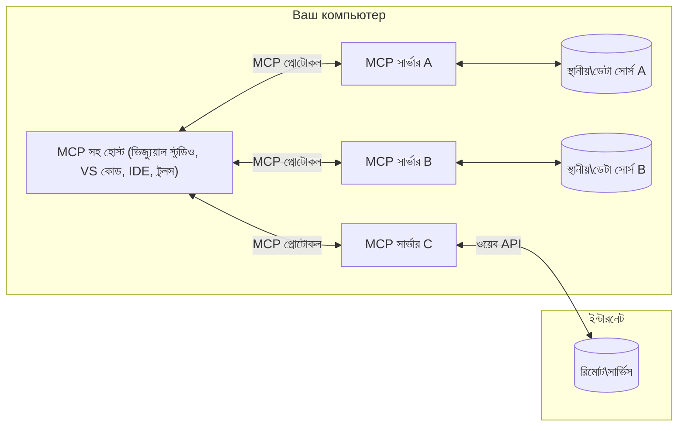

# MCP কোর ধারণা: AI ইন্টিগ্রেশনের জন্য মডেল কন্টেক্সট প্রোটোকল মাস্টারিং

[](https://youtu.be/earDzWGtE84)

_(এই পাঠের ভিডিও দেখতে উপরোক্ত ছবিতে ক্লিক করুন)_

[Model Context Protocol (MCP)](https://github.com/modelcontextprotocol) একটি শক্তিশালী, স্ট্যান্ডার্ডাইজড ফ্রেমওয়ার্ক যা বড় ল্যাঙ্গুয়েজ মডেল (LLMs) এবং বাহ্যিক টুলস, অ্যাপ্লিকেশন এবং ডেটা সোর্সগুলোর মাঝে যোগাযোগ উন্নত করে।  
এই গাইডটি আপনাকে MCP-এর মূল ধারণাগুলো থেকে পরিচিত করবে। আপনি এর ক্লায়েন্ট-সার্ভার আর্কিটেকচার, গুরুত্বপূর্ণ উপাদান, যোগাযোগ প্রক্রিয়া এবং বাস্তবায়নের সেরা অনুশীলন সম্পর্কে শিখবেন।

- **স্পষ্ট ব্যবহারকারী সম্মতি**: সমস্ত ডেটা অ্যাক্সেস এবং অপারেশনগুলি কার্যকর করার আগে স্পষ্ট ব্যবহারকারী অনুমোদন প্রয়োজন। ব্যবহারকারীদের অবশ্যই পরিষ্কারভাবে বুঝতে হবে কোন ডেটা অ্যাক্সেস করা হবে এবং কোন কর্ম সম্পাদিত হবে, যথাযথ অনুমতি এবং অথরাইজেশন নিয়ন্ত্রণসহ।

- **ডেটা গোপনীয়তার সুরক্ষা**: ব্যবহারকারীর ডেটা শুধুমাত্র স্পষ্ট সম্মতির মাধ্যমে প্রকাশ করা হয় এবং সম্পূর্ণ ইন্টারঅ্যাকশন লাইফসাইকেল জুড়ে শক্তিশালী অ্যাক্সেস নিয়ন্ত্রণ দ্বারা সুরক্ষিত থাকতে হবে। বাস্তবায়নগুলোকে অননুমোদিত ডেটা প্রেরণ বন্ধ করতে হবে এবং কঠোর গোপনীয়তা সীমা বজায় রাখতে হবে।

- **টুল এক্সিকিউশন নিরাপত্তা**: প্রতিটি টুল আহ্বানে স্পষ্ট ব্যবহারকারী সম্মতি প্রয়োজন, যেখানে টুলের কার্যকারিতা, প্যারামিটার এবং সম্ভাব্য প্রভাব স্পষ্ট হতে হবে। দৃঢ় নিরাপত্তা সীমা অনিচ্ছাকৃত, অনিরাপদ বা ক্ষতিকর টুল এক্সিকিউশন প্রতিরোধ করবে।

- **ট্রান্সপোর্ট লেয়ার সিকিউরিটি**: সমস্ত যোগাযোগ চ্যানেলগুলিতে উপযুক্ত এনক্রিপশন এবং অথেনটিকেশন প্রক্রিয়া ব্যবহার করা উচিত। রিমোট সংযোগগুলো সুরক্ষিত ট্রান্সপোর্ট প্রোটোকল এবং সঠিক প্রমাণপত্র ব্যবস্থাপনাগুলি বাস্তবায়ন করবে।

#### বাস্তবায়ন নির্দেশিকা:

- **অনুমতি ব্যবস্থাপনা**: সূক্ষ্ম নিয়ন্ত্রণ দেয় এমন অনুমতি সিস্টেম বাস্তবায়ন করুন, যা ব্যবহারকারীদের নিয়ন্ত্রণ দেয় কোন সার্ভার, টুল এবং রিসোর্স অ্যাক্সেসযোগ্য হবে
- **অথেনটিকেশন ও অথরাইজেশন**: নিরাপদ অথেনটিকেশন পদ্ধতি (OAuth, API কী) ব্যবহার করুন, সঠিক টোকেন ব্যবস্থাপনা এবং মেয়াদউত্তীর্ণকরণ সহ  
- **ইনপুট যাচাইকরণ**: সংজ্ঞায়িত স্কিমা অনুযায়ী সমস্ত প্যারামিটার এবং ডেটা ইনপুট যাচাই করুন ইনজেকশন আক্রমণ প্রতিরোধে
- **অডিট লগিং**: নিরাপত্তা পর্যবেক্ষণ এবং নিয়মাবলী অনুসরণের জন্য সমস্ত অপারেশনের বিস্তৃত লগ বজায় রাখুন

## ওভারভিউ

এই পাঠে আমরা Model Context Protocol (MCP) ইকোসিস্টেমের মৌলিক স্থাপত্য এবং উপাদানগুলো পরীক্ষা করব। আপনি শিখবেন ক্লায়েন্ট-সার্ভার আর্কিটেকচার, প্রধান উপাদান এবং MCP ইন্টারঅ্যাকশনের যোগাযোগ প্রক্রিয়া সম্পর্কে।

## প্রধান শেখার উদ্দেশ্যসমূহ

এই পাঠের শেষে, আপনি:

- MCP ক্লায়েন্ট-সার্ভার আর্কিটেকচার বুঝতে পারবেন।
- হোস্ট, ক্লায়েন্ট এবং সার্ভারের ভূমিকা ও দায়িত্ব চিনতে পারবেন।
- MCP-এর নমনীয় ইন্টিগ্রেশন স্তর গঠনে মূল বৈশিষ্ট্যগুলো বিশ্লেষণ করতে পারবেন।
- MCP ইকোসিস্টেমে তথ্যের প্রবাহ শিখবেন।
- .NET, Java, Python, এবং JavaScript কোড উদাহরণের মাধ্যমে প্র্যাকটিক্যাল ধারণা অর্জন করবেন।

## MCP আর্কিটেকচার: গভীর বিশ্লেষণ

MCP ইকোসিস্টেম একটি ক্লায়েন্ট-সার্ভার মডেলের ওপর নির্মিত। এই মডিউলার কাঠামো AI অ্যাপ্লিকেশনগুলোকে টুলস, ডেটাবেস, API, এবং প্রাসঙ্গিক রিসোর্সগুলোর সঙ্গে দক্ষতার সঙ্গে ইন্টারঅ্যাক্ট করার সুযোগ দেয়। আসুন এই স্থাপত্যের মূল উপাদানগুলো বিশ্লেষণ করি।

মূলত, MCP একটি ক্লায়েন্ট-সার্ভার আর্কিটেকচার অনুসরণ করে যেখানে একটি হোস্ট অ্যাপ্লিকেশন একাধিক সার্ভারের সাথে সংযোগ করতে পারে:


```mermaid
flowchart LR
    subgraph "Ваш компьютер"
        Host["MCP সহ হোস্ট (ভিজ্যুয়াল স্টুডিও, VS কোড, IDE, টুলস)"]
        S1["MCP সার্ভার A"]
        S2["MCP সার্ভার B"]
        S3["MCP সার্ভার C"]
        Host <-->|"MCP প্রোটোকল"| S1
        Host <-->|"MCP প্রোটোকল"| S2
        Host <-->|"MCP প্রোটোকল"| S3
        S1 <--> D1[("স্থানীয়\ডেটা সোর্স A")]
        S2 <--> D2[("স্থানীয়\ডেটা সোর্স B")]
    end
    subgraph "ইন্টারনেট"
        S3 <-->|"ওয়েব API"| D3[("রিমোট\সার্ভিস")]
    end
```
- **MCP Hosts**: VSCode, Claude Desktop, IDEs, অথবা AI টুলস এর মত প্রোগ্রাম যা MCP-এর মাধ্যমে ডেটা অ্যাক্সেস করতে চায়
- **MCP Clients**: প্রোটোকল ক্লায়েন্ট যারা সার্ভারের সঙ্গে ১:১ সংযোগ বজায় রাখে
- **MCP Servers**: হালকা ওজনের প্রোগ্রাম যারা Model Context Protocol-এর মাধ্যমে নির্দিষ্ট ক্ষমতা প্রকাশ করে
- **লোকাল ডেটা সোর্স**: আপনার কম্পিউটারের ফাইল, ডেটাবেস, এবং সার্ভিস যা MCP সার্ভারগুলো নিরাপদে অ্যাক্সেস করতে পারে
- **রিমোট সার্ভিসেস**: ইন্টারনেটে উপলব্ধ বহিঃস্থ সিস্টেম যা MCP সার্ভার API এর মাধ্যমে সংযুক্ত হতে পারে।

MCP প্রোটোকল একটি বিকাশমান স্ট্যান্ডার্ড, যা তারিখ ভিত্তিক সংস্করণ (YYYY-MM-DD ফরম্যাট) ব্যবহার করে। বর্তমান প্রোটোকল সংস্করণ হলো **2025-11-25**। আপনি সর্বশেষ আপডেটগুলো দেখতে পারেন [প্রোটোকল স্পেসিফিকেশন](https://modelcontextprotocol.io/specification/2025-11-25/)

### ১. হোস্টস

Model Context Protocol (MCP)-এ, **Hosts** হলো AI অ্যাপ্লিকেশন যা ব্যবহারকারীরা প্রোটোকলের সাথে ইন্টারঅ্যাক্ট করার প্রধান ইন্টারফেস হিসেবে কাজ করে। Hosts MCP সার্ভারগুলোতে সংযোগ তৈরি এবং ব্যবস্থাপনা করে প্রতিটি সার্ভারের জন্য ডেডিকেটেড MCP ক্লায়েন্ট তৈরি করে। Hosts এর উদাহরণসমূহ:

- **AI অ্যাপ্লিকেশন**: Claude Desktop, Visual Studio Code, Claude Code
- **ডেভেলপমেন্ট পরিবেশ**: MCP ইন্টিগ্রেশনসহ IDEs এবং কোড এডিটর  
- **কাস্টম অ্যাপ্লিকেশন**: উদ্দেশ্যমূলক AI এজেন্ট এবং টুলস

**Hosts** হলো সেই অ্যাপ্লিকেশন যা AI মডেলগুলোর ইন্টারঅ্যাকশন সমন্বয় করে। তারা:

- **AI মডেল অর্কেস্ট্রেশন**: LLM-এর মাধ্যমে রেসপন্স তৈরি বা ইন্টারঅ্যাকট করে AI ওয়ার্কফ্লো সমন্বয় করে
- **ক্লায়েন্ট সংযোগ পরিচালনা**: প্রতিটি MCP সার্ভার সংযোগ জন্য একটি MCP ক্লায়েন্ট তৈরি ও রক্ষণাবেক্ষণ করে
- **ইউজার ইন্টারফেস নিয়ন্ত্রণ**: কথোপকথনের প্রবাহ, ব্যবহারকারী ইন্টারঅ্যাকশন এবং রেসপন্স উপস্থাপন পরিচালনা করে  
- **নিরাপত্তা নিশ্চিতকরণ**: অনুমতি, নিরাপত্তা সীমাবদ্ধতা, এবং প্রমাণীকরণ নিয়ন্ত্রণ করে
- **ব্যবহারকারী সম্মতি হ্যান্ডলিং**: ডেটা শেয়ারিং এবং টুল এক্সিকিউশনের জন্য ব্যবহারকারী অনুমোদন পরিচালনা করে


### ২. ক্লায়েন্টস

**Clients** হলো গুরুত্বপূর্ণ উপাদান যা Hosts এবং MCP সার্ভারের মধ্যে ১:১ সংযোগ রক্ষা করে। প্রতিটি MCP ক্লায়েন্ট বিশেষ MCP সার্ভারের সাথে সংযোগ করার জন্য হোস্ট দ্বারা উদ্ভূত হয়, যা সংগঠিত এবং নিরাপদ যোগাযোগ চ্যানেল নিশ্চিত করে। একাধিক ক্লায়েন্ট হোস্টকে একাধিক সার্ভার সাথে একই সময়ে সংযোগ করতে সক্ষম করে।

**Clients** হলো হোস্ট অ্যাপ্লিকেশনের সংযোগকারী উপাদান। তারা:

- **প্রোটোকল যোগাযোগ**: JSON-RPC 2.0 অনুরোধ সার্ভারের কাছে প্রম্পট এবং নির্দেশাবলীসহ প্রেরণ করে
- **ক্ষমতা আলোচনাসভা**: ইনিশিয়ালাইজেশনের সময় সার্ভারের সঙ্গে সমর্থিত ফিচার এবং প্রোটোকল সংস্করণ নিয়ে আলোচনা করে
- **টুল এক্সিকিউশন**: মডেলের টুল এক্সিকিউশন অনুরোধ পরিচালনা এবং রেসপন্স প্রক্রিয়াজাত করে
- **রিয়েল-টাইম আপডেট**: সার্ভার থেকে নোটিফিকেশন এবং রিয়েল-টাইম আপডেট হ্যান্ডল করে
- **রেসপন্স প্রক্রিয়াকরণ**: ব্যবহারকারীদের প্রদর্শনের জন্য সার্ভারের রেসপন্স প্রক্রিয়া এবং ফরম্যাট করে

### ৩. সার্ভারস

**Servers** হলো প্রোগ্রাম যা MCP ক্লায়েন্টদের জন্য প্রসঙ্গ, টুলস এবং ক্ষমতা প্রদান করে। তারা স্থানীয় (হোস্টের একই মেশিনে) বা রিমোট (বাহ্যিক প্ল্যাটফর্মে) এক্সিকিউট হতে পারে, এবং ক্লায়েন্টের অনুরোধ হ্যান্ডল করে কাঠামোবদ্ধ রেসপন্স প্রদান করার জন্য দায়ী। সার্ভারগুলো স্ট্যান্ডার্ডাইজড Model Context Protocol-এর মাধ্যমে নির্দিষ্ট কার্যকারিতা প্রকাশ করে।

**Servers** হলো সেই সার্ভিস যা প্রসঙ্গ এবং ক্ষমতা প্রদান করে। তারা:

- **ফিচার রেজিস্ট্রেশন**: উপলব্ধ প্রিমিটিভ (রিসোর্স, প্রম্পট, টুল) ক্লায়েন্টদের জন্য রেজিস্টার এবং প্রকাশ করে
- **রিকুয়েস্ট প্রসেসিং**: ক্লায়েন্ট থেকে টুল কল, রিসোর্স অনুরোধ এবং প্রম্পট অনুরোধ গ্রহণ এবং সম্পাদন করে
- **প্রসঙ্গ provision**: মডেল রেসপন্স উন্নত করতে প্রসঙ্গগত তথ্য এবং ডেটা প্রদান করে
- **স্টেট ম্যানেজমেন্ট**: সেশন স্টেট বজায় রাখে এবং প্রয়োজনে স্টেটফুল ইন্টারঅ্যাকশন হ্যান্ডল করে
- **রিয়েল-টাইম নোটিফিকেশন**: সক্ষমতা পরিবর্তন ও আপডেট সম্পর্কিত নোটিফিকেশন সংযুক্ত ক্লায়েন্টদের পাঠায়

সার্ভারগুলো যেকোনো কেউ তৈরি করতে পারে মডেলের কার্যকারিতা বিশেষায়িত ফাংশনালিটির মাধ্যমে বাড়ানোর জন্য, এবং তারা স্থানীয় ও রিমোট উভয় ডেপ্লয়মেন্ট সাপোর্ট করে।

### ৪. সার্ভার প্রিমিটিভস

Model Context Protocol (MCP)-এ সার্ভারগুলো তিনটি মূল **প্রিমিটিভ** প্রদান করে যা ক্লায়েন্ট, হোস্ট এবং ভাষা মডেলের মধ্যে সমৃদ্ধ ইন্টারঅ্যাকশনের মৌলিক নির্মাণ ব্লক নির্ধারণ করে। এই প্রিমিটিভগুলো প্রোটোকলের মাধ্যমে উপলব্ধ প্রসঙ্গগত তথ্য এবং ক্রিয়াকলাপের ধরন নির্ধারণ করে।

MCP সার্ভাররা নিম্নলিখিত তিনটি মূল প্রিমিটিভের যেকোনো সংমিশ্রণ প্রকাশ করতে পারে:

#### রিসোর্সেস

**রিসোর্সেস** হলো ডেটা সোর্স যা AI অ্যাপ্লিকেশনগুলোকে প্রসঙ্গগত তথ্য প্রদান করে। এগুলো স্থির বা গতিশীল বিষয়বস্তু প্রতিনিধিত্ব করে যা মডেল বোঝাপড়া এবং সিদ্ধান্ত গ্রহণ উন্নত করে:

- **প্রসঙ্গগত ডেটা**: AI মডেল ব্যবহারের জন্য কাঠামোবদ্ধ তথ্য এবং প্রসঙ্গ
- **জ্ঞানভিত্তি**: ডকুমেন্ট রেপোজিটরি, আর্টিকেল, ম্যানুয়াল এবং গবেষণা পত্র
- **লোকাল ডেটা সোর্স**: ফাইল, ডেটাবেস, এবং লোকাল সিস্টেম তথ্য  
- **বাহ্যিক ডেটা**: API রেসপন্স, ওয়েব সার্ভিস, এবং রিমোট সিস্টেম ডেটা
- **গতিশীল বিষয়বস্তু**: বাহ্যিক পরিস্থিতির উপর ভিত্তি করে আপডেট হওয়া রিয়েল-টাইম ডেটা

রিসোর্সগুলো URI দ্বারা শনাক্ত করা হয় এবং `resources/list` এর মাধ্যমে আবিষ্কার এবং `resources/read` পদ্ধতিতে প্রাপ্ত হয়:

```text
file://documents/project-spec.md
database://production/users/schema
api://weather/current
```

#### প্রম্পটস

**প্রম্পটস** হলো পুনর্ব্যবহারযোগ্য টেম্পলেট যা ভাষা মডেলের সঙ্গে ইন্টারঅ্যাকশন গঠন করতে সাহায্য করে। এগুলো স্ট্যান্ডার্ডাইজড ইন্টারঅ্যাকশন প্যাটার্ন এবং টেম্পলেটেড ওয়ার্কফ্লো প্রদান করে:

- **টেম্পলেট-ভিত্তিক ইন্টারঅ্যাকশন**: পূর্বগঠিত মেসেজ এবং কথোপকথন শুরুকারী
- **ওয়ার্কফ্লো টেম্পলেটস**: সাধারণ কাজ এবং ইন্টারঅ্যাকশনের জন্য স্ট্যান্ডার্ড সিকোয়েন্স
- **ফিউ-শট উদাহরণ**: মডেল নির্দেশনার জন্য উদাহরণভিত্তিক টেম্পলেট
- **সিস্টেম প্রম্পটস**: মডেলের আচরণ এবং প্রসঙ্গ নির্ধারণকারী মূল প্রম্পট
- **ডাইনামিক টেম্পলেটস**: নির্দিষ্ট প্রসঙ্গ অনুযায়ী খাপ খাওয়ানো প্যারামিটারাইজড প্রম্পটস

প্রম্পটস ভেরিয়েবল সাবস্টিটিউশন সাপোর্ট করে এবং `prompts/list` এর মাধ্যমে আবিষ্কার ও `prompts/get` দিয়ে প্রাপ্ত হতে পারে:

```markdown
Generate a {{task_type}} for {{product}} targeting {{audience}} with the following requirements: {{requirements}}
```

#### টুলস

**টুলস** হলো এক্সিকিউটেবল ফাংশন যা AI মডেলগুলো নির্দিষ্ট কাজ সম্পাদনের জন্য কল করতে পারে। এগুলো MCP ইকোসিস্টেমে "ক্রিয়া" হিসেবে কাজ করে, মডেলকে বাহ্যিক সিস্টেমের সাথে ইন্টারঅ্যাক্ট করার সুযোগ দেয়:

- **এক্সিকিউটেবল ফাংশন**: নির্দিষ্ট প্যারামিটারসহ মডেল কল করতে পারে এমন বিচ্ছিন্ন অপারেশন
- **বাহ্যিক সিস্টেম ইন্টিগ্রেশন**: API কল, ডেটাবেস কুয়েরি, ফাইল অপারেশন, হিসাব-নিকাশ
- **স্বতন্ত্র পরিচয়**: প্রতিটি টুলের একটি নির্দিষ্ট নাম, বিবরণ, এবং প্যারামিটার স্কিমা থাকে
- **গঠিত ইনপুট/আউটপুট**: টুলসমূহ যাচাইকৃত প্যারামিটার গ্রহণ করে এবং কাঠামোবদ্ধ, টাইপকৃত রেসপন্স প্রদান করে
- **অ্যাকশন ক্ষমতা**: মডেলকে বাস্তব ক্রিয়া সম্পাদন এবং লাইভ ডেটা পুনরুদ্ধারের সুযোগ দেয়

টুলস JSON স্কিমা দ্বারা প্যারামিটার যাচাইকরণের জন্য সংজ্ঞায়িত এবং `tools/list` এর মাধ্যমে আবিষ্কৃত, `tools/call` এর মাধ্যমে এক্সিকিউটেড হয়। UI উপস্থাপনার উন্নতির জন্য টুলস অতিরিক্ত মেটাডেটা হিসেবে **আইকন**ও অন্তর্ভুক্ত করতে পারে।

**টুল এনোটেশনস**: টুলস বিভিন্ন আচরণগত এনোটেশন (যেমন, `readOnlyHint`, `destructiveHint`) সাপোর্ট করে যা নির্দেশ করে টুলটি শুধুমাত্র পড়ার জন্য বা ধ্বংসাত্মক কিনা, যা ক্লায়েন্টকে টুল এক্সিকিউশনের বিষয়ে সচেতন সিদ্ধান্ত নিতে সাহায্য করে।

টুলের উদাহরণ সংজ্ঞা:

```typescript
server.tool(
  "search_products", 
  {
    query: z.string().describe("Search query for products"),
    category: z.string().optional().describe("Product category filter"),
    max_results: z.number().default(10).describe("Maximum results to return")
  }, 
  async (params) => {
    // অনুসন্ধান সম্পাদন করুন এবং গঠনভিত্তিক ফলাফল প্রদান করুন
    return await productService.search(params);
  }
);
```

## ক্লায়েন্ট প্রিমিটিভস

Model Context Protocol (MCP)-এ, **ক্লায়েন্টরা** এমন প্রিমিটিভ প্রকাশ করতে পারে যা সার্ভারগুলোকে হোস্ট অ্যাপ্লিকেশন থেকে অতিরিক্ত ক্ষমতা অনুরোধ করার সুযোগ দেয়। এই ক্লায়েন্ট-সাইড প্রিমিটিভগুলো আরও সমৃদ্ধ, ইন্টারঅ্যাকটিভ সার্ভার ইমপ্লিমেন্টেশন সক্ষম করে যা AI মডেল ক্ষমতা এবং ব্যবহারকারী ইন্টারঅ্যাকশনে প্রবেশাধিকার দেয়।

### স্যাম্পলিং

**স্যাম্পলিং** সার্ভারকে ক্লায়েন্টের AI অ্যাপ্লিকেশন থেকে ভাষা মডেল সম্পূর্ণতা অনুরোধ করার সুযোগ দেয়। এই প্রিমিটিভ সার্ভারকে তাদের নিজস্ব মডেল ডিপেনডেন্স না রেখেই LLM ক্ষমতা অ্যাক্সেস করার সুযোগ দেয়:

- **মডেল-স্বাধীন অ্যাক্সেস**: সার্ভারগুলো সম্পূর্ণতা অনুরোধ করতে পারে LLM SDK অন্তর্ভুক্ত বা মডেল ব্যবস্থাপনা ছাড়াই
- **সার্ভার-প্রবর্তিত AI**: সার্ভারকে স্বায়ত্তশাসিতভাবে ক্লায়েন্টের AI মডেল ব্যবহার করে বিষয়বস্তু তৈরি করার সুযোগ দেয়
- **পুনরাবৃত্ত LLM ইন্টারঅ্যাকশন**: জটিল পরিস্থিতিতে যেখানে সার্ভার AI সাহায্যের জন্য প্রক্রিয়াকরণের প্রয়োজন, সেগুলো সাপোর্ট করে
- **ডাইনামিক বিষয়বস্তু সৃজন**: হোস্টের মডেল ব্যবহার করে প্রসঙ্গগত রেসপন্স তৈরির সুযোগ দেয়
- **টুল কলিং সাপোর্ট**: সার্ভার `tools` এবং `toolChoice` প্যারামিটার অন্তর্ভুক্ত করতে পারে যাতে ক্লায়েন্টের মডেল স্যাম্পলিং চলাকালীন টুলস কল করতে পারে

স্যাম্পলিং `sampling/complete` পদ্ধতির মাধ্যমে শুরু হয়, যেখানে সার্ভার ক্লায়েন্টকে সম্পূর্ণতা অনুরোধ প্রেরণ করে।

### রুটস

**রুটস** ক্লায়েন্টকে সার্ভারদের ফাইলসিস্টেম সীমা প্রকাশের স্ট্যান্ডার্ড উপায় প্রদান করে, যা সার্ভারকে বুঝতে সাহায্য করে তারা কোন ডিরেক্টরি এবং ফাইলে প্রবেশাধিকার পেয়েছে:

- **ফাইলসিস্টেম সীমা**: সার্ভার যেখানে কাজ করতে পারে সেই সীমা সংজ্ঞায়িত করে
- **অ্যাক্সেস নিয়ন্ত্রণ**: সার্ভার বুঝতে সাহায্য করে কোন ডিরেক্টরি ও ফাইলে তাদের অনুমতি রয়েছে
- **ডাইনামিক আপডেটস**: ক্লায়েন্ট রুটস পরিবর্তিত হলে সার্ভারকে বিজ্ঞপ্তি দিতে পারে
- **URI-ভিত্তিক সনাক্তকরণ**: রুটস `file://` URI ব্যবহার করে প্রবেশাধিকারযোগ্য ডিরেক্টরি ও ফাইল চিহ্নিত করে

রুটস `roots/list` পদ্ধতির মাধ্যমে আবিষ্কৃত হয়, ক্লায়েন্ট পরিবর্তনের সময় `notifications/roots/list_changed` পাঠায়।

### ইলিসিটেশন  

**ইলিসিটেশন** সার্ভারকে ব্যবহারকারীদের কাছ থেকে অতিরিক্ত তথ্য বা নিশ্চিতকরণ ক্লায়েন্ট ইন্টারফেসের মাধ্যমে অনুরোধ করার সুযোগ দেয়:

- **ব্যবহারকারী ইনপুট অনুরোধ**: টুল কার্যকর করার জন্য প্রয়োজনীয় অতিরিক্ত তথ্য সার্ভার চাইতে পারে
- **নিশ্চিতকরণ ডায়ালগ**: সংবেদনশীল বা প্রভাবশালী অপারেশনের জন্য ব্যবহারকারী অনুমোদন অনুরোধ করে
- **ইন্টারঅ্যাকটিভ ওয়ার্কফ্লো**: ধাপে ধাপে ব্যবহারকারী ইন্টারঅ্যাকশন তৈরি করার সুযোগ দেয়
- **ডাইনামিক প্যারামিটার সংগ্রহ**: টুল কার্যকর করার সময় অনুপস্থিত বা ঐচ্ছিক প্যারামিটার সংগ্রহ করা

ইলিসিটেশন অনুরোধ `elicitation/request` পদ্ধতির মাধ্যমে ক্লায়েন্টের ইন্টারফেসে ব্যবহারকারী ইনপুট সংগ্রহ করে।

**URL মোড ইলিসিটেশন**: সার্ভারগুলো URL-ভিত্তিক ব্যবহারকারী ইন্টারঅ্যাকশনও অনুরোধ করতে পারে, যা সার্ভারকে ব্যবহারকারীকে বাহ্যিক ওয়েব পেজে প্রমাণীকরণ, নিশ্চিতকরণ, বা ডেটা প্রবেশের জন্য নির্দেশ দিতে দেয়।

### লগিং

**লগিং** সার্ভারকে কাঠামোবদ্ধ লগ মেসেজ ক্লায়েন্টদের কাছে প্রেরণের সুযোগ দেয় যা ডিবাগিং, মনিটরিং, এবং অপারেশনাল দৃশ্যমানতার জন্য প্রয়োজন:

- **ডিবাগিং সাপোর্ট**: ট্রাবলশুটিংয়ের জন্য বিস্তারিত এক্সিকিউশন লগ প্রদান করে
- **অপারেশনাল মনিটরিং**: ক্লায়েন্টে স্ট্যাটাস আপডেট এবং পারফরমেন্স মেট্রিক পাঠায়
- **এরর রিপোর্টিং**: বিস্তারিত এরর প্রসঙ্গ এবং ডায়াগনোস্টিক তথ্য প্রদান করে
- **অডিট ট্রেইল**: সার্ভার অপারেশন এবং সিদ্ধান্তের বিস্তৃত লগ তৈরী করে

লগিং মেসেজ ক্লায়েন্টকে পাঠানো হয় সার্ভারের কার্যক্রমে স্বচ্ছতা এবং ডিবাগিং সহজ করার জন্য।

## MCP-তে তথ্যের প্রবাহ

Model Context Protocol (MCP) হোস্ট, ক্লায়েন্ট, সার্ভার এবং মডেলগুলির মধ্যে তথ্যের কাঠামোবদ্ধ প্রবাহ নির্ধারণ করে। এই প্রবাহ বোঝা ব্যবহারকারী অনুরোধ কীভাবে প্রক্রিয়াকৃত হয় এবং কীভাবে বাহ্যিক টুল এবং ডেটা মডেল রেসপন্সে ইন্টিগ্রেট হয় তা স্পষ্ট করে।
- **হোস্ট সংযোগ আরম্ভ করে**  
  হোস্ট অ্যাপ্লিকেশন (যেমন একটি IDE বা চ্যাট ইন্টারফেস) সাধারণত STDIO, WebSocket, বা অন্য কোনো সমর্থিত ট্রান্সপোর্টের মাধ্যমে MCP সার্ভারের সাথে সংযোগ স্থাপন করে।

- **ক্ষমতা আলোচনা**  
  ক্লায়েন্ট (হোস্টে এম্বেড করা) এবং সার্ভারের মধ্যে তাদের সমর্থিত বৈশিষ্ট্য, সরঞ্জাম, সম্পদ এবং প্রোটোকল সংস্করণ সম্পর্কে তথ্য বিনিময় হয়। এটি নিশ্চিত করে যে উভয় পক্ষ সেশনটির জন্য উপলব্ধ ক্ষমতাগুলো বুঝতে পারে।

- **ব্যবহারকারীর অনুরোধ**  
  ব্যবহারকারী হোস্টের সাথে ইন্টারঅ্যাক্ট করে (যেমন, একটি প্রম্পট বা কমান্ড প্রবেশ করানো)। হোস্ট এই ইনপুট সংগ্রহ করে ক্লায়েন্টকে প্রক্রিয়াজাতকরণের জন্য প্রেরণ করে।

- **সম্পদ বা সরঞ্জাম ব্যবহার**  
  - ক্লায়েন্ট মডেলের বোঝাপড়া বৃদ্ধি করার জন্য সার্ভার থেকে অতিরিক্ত প্রসঙ্গ বা সম্পদ (যেমন ফাইল, ডাটাবেস এন্ট্রি, বা জ্ঞানভিত্তিক নিবন্ধ) অনুরোধ করতে পারে।  
  - যদি মডেল নির্ধারণ করে যে একটি সরঞ্জাম প্রয়োজন (যেমন তথ্য আহরণ করা, গণনা করা, বা API কল করা), তাহলে ক্লায়েন্ট সার্ভারকে একটি সরঞ্জাম আহ্বানের অনুরোধ পাঠায়, যেখানে সরঞ্জামের নাম এবং প্যারামিটার উল্লেখ থাকে।

- **সার্ভার কার্যকরীতা**  
  সার্ভার সম্পদ বা সরঞ্জামের অনুরোধ গ্রহণ করে, প্রয়োজনীয় কাজ সম্পাদন করে (যেমন একটি ফাংশন চালানো, ডাটাবেস অনুসন্ধান, বা একটি ফাইল উদ্ধার করা), এবং ফলাফলগুলি গঠিত কাঠামোয় ক্লায়েন্টকে ফেরত দেয়।

- **প্রতিক্রিয়া সৃষ্টিকরণ**  
  ক্লায়েন্ট সার্ভারের প্রতিক্রিয়া (সম্পদ তথ্য, সরঞ্জাম আউটপুট ইত্যাদি) অন্তর্ভুক্ত করে চলমান মডেল ইন্টারঅ্যাকশনে। মডেল এই তথ্য ব্যবহার করে ব্যাপক ও প্রসঙ্গভিত্তিক প্রাসঙ্গিক প্রতিক্রিয়া তৈরি করে।

- **ফলাফল উপস্থাপন**  
  হোস্ট ক্লায়েন্ট থেকে চূড়ান্ত আউটপুট গ্রহণ করে এবং ব্যবহারকারীর কাছে প্রদর্শন করে, যা প্রায়শই মডেলের তৈরি টেক্সট এবং সরঞ্জাম কার্যকরীতা বা সম্পদ অনুসন্ধানের ফলাফল উভয়ই অন্তর্ভুক্ত করে।

এই প্রবাহ MCP কে উন্নত, ইন্টারঅ্যাকটিভ এবং প্রসঙ্গ-সচেতন AI অ্যাপ্লিকেশনগুলোকে প্রকাশ্য সরঞ্জাম ও ডেটা উৎসের সাথে নির্বিঘ্নে সংযুক্ত করার মাধ্যমে সহায়তা করে।

## প্রোটোকল আর্কিটেকচার ও স্তরসমূহ

MCP দুটি স্বতন্ত্র আর্কিটেকচারাল স্তর নিয়ে গঠিত যেগুলো একত্রে সম্পূর্ণ যোগাযোগ কাঠামো প্রদান করে:

### ডেটা লেয়ার

**ডেটা লেয়ার** MCP প্রোটোকলের মূল বাস্তবায়ন করে যা ভিত্তি হিসাবে **JSON-RPC 2.0** ব্যবহার করে। এই স্তর বার্তার গঠন, অর্থবোধ এবং পারস্পরিক ক্রিয়াকলাপের রূপরেখা নির্ধারণ করে:

#### প্রধান উপাদানসমূহ:

- **JSON-RPC 2.0 প্রোটোকল**: সব যোগাযোগ প্রক্রিয়া পদ্ধতি কল, উত্তর, এবং নোটিফিকেশনের জন্য মানক JSON-RPC 2.0 বার্তা ফর্ম্যাট ব্যবহার করে  
- **লাইফসাইকেল ব্যবস্থাপনা**: ক্লায়েন্ট ও সার্ভারের মধ্যে সংযোগ সঞ্চালন, ক্ষমতা আলোচনা এবং সেশন সমাপ্তি পরিচালনা করে  
- **সার্ভার প্রিমিটিভস**: সরঞ্জাম, সম্পদ, এবং প্রম্পটের মাধ্যমে সার্ভারকে মূল কার্যকারিতা প্রদান সক্ষম করে  
- **ক্লায়েন্ট প্রিমিটিভস**: LLM স্যাম্পলিং, ব্যবহারকারী ইনপুট আহ্বান, এবং লগ মেসেজ পাঠানোর সুবিধা দেয়  
- **রিয়েল-টাইম বিজ্ঞপ্তি**: পোলিং ছাড়া গতিশীল আপডেটের জন্য অ্যাসিঙ্ক্রোনাস নোটিফিকেশন সমর্থন করে  

#### মূল বৈশিষ্ট্য:

- **প্রোটোকল সংস্করণ আলোচনা**: তারিখভিত্তিক সংস্করণ (YYYY-MM-DD) ব্যবহার করে সামঞ্জস্য নিশ্চিত করে  
- **ক্ষমতা আবিষ্কার**: আরম্ভে ক্লায়েন্ট ও সার্ভারের মধ্যে সমর্থিত ফিচার তথ্য বিনিময় হয়  
- **অবস্থাসম্পন্ন সেশন**: প্রসঙ্গ ধারাবাহিকতার জন্য একাধিক ইন্টারঅ্যাকশনের মাধ্যমে সংযোগ অবস্থা ধরে রাখে  

### ট্রান্সপোর্ট লেয়ার

**ট্রান্সপোর্ট লেয়ার** MCP অংশগ্রহণকারীদের মধ্যে যোগাযোগ চ্যানেল, বার্তা ফ্রেমিং এবং প্রমাণীকরণ পরিচালনা করে:

#### সমর্থিত ট্রান্সপোর্ট পদ্ধতিসমূহ:

1. **STDIO ট্রান্সপোর্ট**:  
   - সরাসরি প্রক্রিয়া যোগাযোগের জন্য স্ট্যান্ডার্ড ইনপুট/আউটপুট স্ট্রিম ব্যবহার করে  
   - একই মেশিনে স্থানীয় প্রক্রিয়াগুলির জন্য উপযোগী, কোনও নেটওয়ার্ক ওভারহেড নেই  
   - সাধারণত স্থানীয় MCP সার্ভার বাস্তবায়নের জন্য ব্যবহৃত হয়  

2. **স্ট্রিমযোগ্য HTTP ট্রান্সপোর্ট**:  
   - ক্লায়েন্ট থেকে সার্ভারে বার্তা পাঠাতে HTTP POST ব্যবহার করে  
   - সার্ভার থেকে ক্লায়েন্টের জন্য ঐচ্ছিক সার্ভার-সেন্ট ইভেন্টস (SSE) স্ট্রিমিং  
   - নেটওয়ার্ক জুড়ে দূরবর্তী সার্ভার যোগাযোগ সক্ষম করে  
   - মানক HTTP প্রমাণীকরণ (বিয়ারার টোকেন, API কী, কাস্টম হেডার) সমর্থন করে  
   - নিরাপত্তার জন্য MCP OAuth ব্যবহার করার পরামর্শ দেয়  

#### ট্রান্সপোর্ট বিমূর্তকরণ:

ট্রান্সপোর্ট লেয়ার ডেটা লেয়ার থেকে যোগাযোগের বিবরণ বিমূর্ত করে, ফলে একই JSON-RPC 2.0 বার্তা ফর্ম্যাট সব ট্রান্সপোর্ট পদ্ধতির ওপর প্রযোজ্য থাকে। এর মাধ্যমে স্থানীয় ও দূরবর্তী সার্ভারের মধ্যে অ্যাপ্লিকেশনগুলো নির্বিঘ্নে স্থানান্তর করতে পারে।

### নিরাপত্তার দিকসমূহ

MCP বাস্তবায়নগুলো প্রোটোকলের সব অপারেশনের সময় নিরাপদ, বিশ্বাসযোগ্য এবং সুরক্ষিত ইন্টারঅ্যাকশন নিশ্চিত করার জন্য বেশ কয়েকটি গুরুত্বপূর্ণ নিরাপত্তা নীতি অনুসরণ করতে হবে:

- **ব্যবহারকারীর সম্মতি ও নিয়ন্ত্রণ**: কোনো তথ্য অ্যাক্সেস বা অপারেশন সম্পাদনের আগে ব্যবহারকারীর স্পষ্ট সম্মতি আবশ্যক। ব্যবহারকারীরা কোন তথ্য শেয়ার করা হবে এবং কোন কাজ অনুমোদিত সেই বিষয়ে স্পষ্ট নিয়ন্ত্রণ রাখতে পারে, সহায়ক ইউজার ইন্টারফেসের মাধ্যমে কার্যকলাপ পর্যালোচনা ও অনুমোদন করতে পারে।

- **তথ্যের গোপনীয়তা**: ব্যবহারকারীর তথ্য শুধুমাত্র স্পষ্ট সম্মতির মাধ্যমে প্রকাশ করা উচিত এবং যথাযথ প্রবেশাধিকার নিয়ন্ত্রণ দ্বারা সুরক্ষিত থাকতে হবে। MCP নিশ্চিত করে যে অননুমোদিত তথ্য প্রেরণ এড়ানো হয় এবং গোপনীয়তা সব ইন্টারঅ্যাকশনে রক্ষা পায়।

- **সরঞ্জামের নিরাপত্তা**: কোনো সরঞ্জাম আহ্বানের আগে স্পষ্ট ব্যবহারকারী সম্মতি প্রয়োজন। ব্যবহারকারীগণ প্রতিটি সরঞ্জামের কার্যকারিতা স্পষ্টভাবে বুঝতে পারা উচিত এবং ভুল বা небезопас সরঞ্জাম চলানোর জন্য দৃঢ় নিরাপত্তা সীমা বজায় রাখতে হবে।

এই নিরাপত্তা নীতিগুলো অনুসরণ করে MCP ব্যবহারকারীর বিশ্বাস, গোপনীয়তা, এবং নিরাপত্তা নিশ্চিত করে প্রোটোকল ইন্টারঅ্যাকশনের সবটিতে শক্তিশালী AI ইন্টিগ্রেশন সক্ষম করে।

## কোড উদাহরণ: মূল উপাদানসমূহ

নিচে বিভিন্ন জনপ্রিয় প্রোগ্রামিং ভাষায় কিছু কোড উদাহরণ রয়েছে যা দেখায় কিভাবে MCP সার্ভারের মূল উপাদান এবং সরঞ্জাম বাস্তবায়ন করা যায়।

### .NET উদাহরণ: সরঞ্জামসহ একটি সহজ MCP সার্ভার নির্মাণ

এখানে একটি ব্যবহারিক .NET কোড উদাহরণ দেওয়া হয়েছে যা কীভাবে কাস্টম সরঞ্জামসহ একটি সহজ MCP সার্ভার তৈরি করা যায় তা প্রদর্শন করে। এই উদাহরণে সরঞ্জাম সংজ্ঞায়িত ও নিবন্ধন, অনুরোধগুলি পরিচালনা, এবং মডেল কনটেক্সট প্রোটোকল ব্যবহার করে সার্ভার সংযোগের পদ্ধতি দেখানো হয়েছে।

```csharp
using System;
using System.Threading.Tasks;
using ModelContextProtocol.Server;
using ModelContextProtocol.Server.Transport;
using ModelContextProtocol.Server.Tools;

public class WeatherServer
{
    public static async Task Main(string[] args)
    {
        // Create an MCP server
        var server = new McpServer(
            name: "Weather MCP Server",
            version: "1.0.0"
        );
        
        // Register our custom weather tool
        server.AddTool<string, WeatherData>("weatherTool", 
            description: "Gets current weather for a location",
            execute: async (location) => {
                // Call weather API (simplified)
                var weatherData = await GetWeatherDataAsync(location);
                return weatherData;
            });
        
        // Connect the server using stdio transport
        var transport = new StdioServerTransport();
        await server.ConnectAsync(transport);
        
        Console.WriteLine("Weather MCP Server started");
        
        // Keep the server running until process is terminated
        await Task.Delay(-1);
    }
    
    private static async Task<WeatherData> GetWeatherDataAsync(string location)
    {
        // This would normally call a weather API
        // Simplified for demonstration
        await Task.Delay(100); // Simulate API call
        return new WeatherData { 
            Temperature = 72.5,
            Conditions = "Sunny",
            Location = location
        };
    }
}

public class WeatherData
{
    public double Temperature { get; set; }
    public string Conditions { get; set; }
    public string Location { get; set; }
}
```

### Java উদাহরণ: MCP সার্ভার উপাদানসমূহ

এই উদাহরণটি উপরের .NET উদাহরণটির মতো MCP সার্ভার এবং সরঞ্জাম নিবন্ধন প্রদর্শন করে, তবে Java তে বাস্তবায়িত।

```java
import io.modelcontextprotocol.server.McpServer;
import io.modelcontextprotocol.server.McpToolDefinition;
import io.modelcontextprotocol.server.transport.StdioServerTransport;
import io.modelcontextprotocol.server.tool.ToolExecutionContext;
import io.modelcontextprotocol.server.tool.ToolResponse;

public class WeatherMcpServer {
    public static void main(String[] args) throws Exception {
        // একটি MCP সার্ভার তৈরি করুন
        McpServer server = McpServer.builder()
            .name("Weather MCP Server")
            .version("1.0.0")
            .build();
            
        // একটি আবহাওয়া টুল নিবন্ধন করুন
        server.registerTool(McpToolDefinition.builder("weatherTool")
            .description("Gets current weather for a location")
            .parameter("location", String.class)
            .execute((ToolExecutionContext ctx) -> {
                String location = ctx.getParameter("location", String.class);
                
                // আবহাওয়ার তথ্য পান (সরলীকৃত)
                WeatherData data = getWeatherData(location);
                
                // ফরম্যাট করা উত্তর প্রদান করুন
                return ToolResponse.content(
                    String.format("Temperature: %.1f°F, Conditions: %s, Location: %s", 
                    data.getTemperature(), 
                    data.getConditions(), 
                    data.getLocation())
                );
            })
            .build());
        
        // stdio ট্রান্সপোর্ট ব্যবহার করে সার্ভারের সাথে সংযোগ করুন
        try (StdioServerTransport transport = new StdioServerTransport()) {
            server.connect(transport);
            System.out.println("Weather MCP Server started");
            // প্রক্রিয়া বন্ধ না হওয়া পর্যন্ত সার্ভার চালু রাখুন
            Thread.currentThread().join();
        }
    }
    
    private static WeatherData getWeatherData(String location) {
        // বাস্তবায়নে একটি আবহাওয়া API কল করা হবে
        // উদাহরণের উদ্দেশ্যে সরলীকৃত
        return new WeatherData(72.5, "Sunny", location);
    }
}

class WeatherData {
    private double temperature;
    private String conditions;
    private String location;
    
    public WeatherData(double temperature, String conditions, String location) {
        this.temperature = temperature;
        this.conditions = conditions;
        this.location = location;
    }
    
    public double getTemperature() {
        return temperature;
    }
    
    public String getConditions() {
        return conditions;
    }
    
    public String getLocation() {
        return location;
    }
}
```

### Python উদাহরণ: একটি MCP সার্ভার তৈরি

এই উদাহরণে fastmcp ব্যবহার করা হয়েছে, তাই আগে এটি ইনস্টল করা নিশ্চিত করুন:

```python
pip install fastmcp
```
কোড নমুনা:

```python
#!/usr/bin/env python3
import asyncio
from fastmcp import FastMCP
from fastmcp.transports.stdio import serve_stdio

# একটি FastMCP সার্ভার তৈরি করুন
mcp = FastMCP(
    name="Weather MCP Server",
    version="1.0.0"
)

@mcp.tool()
def get_weather(location: str) -> dict:
    """Gets current weather for a location."""
    return {
        "temperature": 72.5,
        "conditions": "Sunny",
        "location": location
    }

# একটি ক্লাস ব্যবহার করে বিকল্প পদ্ধতি
class WeatherTools:
    @mcp.tool()
    def forecast(self, location: str, days: int = 1) -> dict:
        """Gets weather forecast for a location for the specified number of days."""
        return {
            "location": location,
            "forecast": [
                {"day": i+1, "temperature": 70 + i, "conditions": "Partly Cloudy"}
                for i in range(days)
            ]
        }

# ক্লাস টুলস রেজিস্টার করুন
weather_tools = WeatherTools()

# সার্ভার শুরু করুন
if __name__ == "__main__":
    asyncio.run(serve_stdio(mcp))
```

### JavaScript উদাহরণ: একটি MCP সার্ভার তৈরি

এই উদাহরণে JavaScript-এ MCP সার্ভার তৈরি এবং দুটি আবহাওয়া-সংক্রান্ত সরঞ্জামের নিবন্ধনের পদ্ধতি দেখানো হয়েছে।

```javascript
// অফিসিয়াল মডেল কনটেক্সট প্রটোকল SDK ব্যবহার করে
import { McpServer } from "@modelcontextprotocol/sdk/server/mcp.js";
import { StdioServerTransport } from "@modelcontextprotocol/sdk/server/stdio.js";
import { z } from "zod"; // প্যারামিটার যাচাইয়ের জন্য

// একটি MCP সার্ভার তৈরি করুন
const server = new McpServer({
  name: "Weather MCP Server",
  version: "1.0.0"
});

// একটি আবহাওয়া টুল সংজ্ঞায়িত করুন
server.tool(
  "weatherTool",
  {
    location: z.string().describe("The location to get weather for")
  },
  async ({ location }) => {
    // এটি সাধারণত একটি আবহাওয়া API কল করবে
    // প্রদর্শনের জন্য সরলীকৃত
    const weatherData = await getWeatherData(location);
    
    return {
      content: [
        { 
          type: "text", 
          text: `Temperature: ${weatherData.temperature}°F, Conditions: ${weatherData.conditions}, Location: ${weatherData.location}` 
        }
      ]
    };
  }
);

// একটি পূর্বাভাস টুল সংজ্ঞায়িত করুন
server.tool(
  "forecastTool",
  {
    location: z.string(),
    days: z.number().default(3).describe("Number of days for forecast")
  },
  async ({ location, days }) => {
    // এটি সাধারণত একটি আবহাওয়া API কল করবে
    // প্রদর্শনের জন্য সরলীকৃত
    const forecast = await getForecastData(location, days);
    
    return {
      content: [
        { 
          type: "text", 
          text: `${days}-day forecast for ${location}: ${JSON.stringify(forecast)}` 
        }
      ]
    };
  }
);

// সাহায্যকারী ফাংশনসমূহ
async function getWeatherData(location) {
  // API কল সিমুলেট করুন
  return {
    temperature: 72.5,
    conditions: "Sunny",
    location: location
  };
}

async function getForecastData(location, days) {
  // API কল সিমুলেট করুন
  return Array.from({ length: days }, (_, i) => ({
    day: i + 1,
    temperature: 70 + Math.floor(Math.random() * 10),
    conditions: i % 2 === 0 ? "Sunny" : "Partly Cloudy"
  }));
}

// stdio পরিবহন ব্যবহার করে সার্ভারের সাথে সংযোগ করুন
const transport = new StdioServerTransport();
server.connect(transport).catch(console.error);

console.log("Weather MCP Server started");
```

এই JavaScript উদাহরণ MCP সার্ভার তৈরি করার প্রক্রিয়া প্রদর্শন করে যা আবহাওয়া-সংক্রান্ত সরঞ্জাম নিবন্ধন করে এবং stdio ট্রান্সপোর্ট ব্যবহার করে ক্লায়েন্ট অনুরোধ হ্যান্ডেল করে।

## নিরাপত্তা এবং অনুমোদন

MCP প্রোটোকলের নিরাপত্তা এবং অনুমোদন ব্যবস্থাপনা নিশ্চিত করতে বেশ কিছু অন্তর্নির্মিত ধারণা এবং পদ্ধতি অন্তর্ভুক্ত করে:

1. **সরঞ্জামের অনুমতি নিয়ন্ত্রণ**:  
  ক্লায়েন্ট নির্দিষ্ট করতে পারে কোন সরঞ্জাম মডেল সেশন চলাকালে ব্যবহার করতে পারবে। এটি নিশ্চিত করে যে শুধুমাত্র স্পষ্ট অনুমোদিত সরঞ্জামই প্রবেশযোগ্য, যা অনাকাঙ্ক্ষিত বা অসুরক্ষিত অপারেশনের ঝুঁকি কমায়। অনুমতিগুলো ব্যবহারকারীর পছন্দ, সংস্থার নীতি, বা ইন্টারঅ্যাকশনের প্রসঙ্গ অনুযায়ী গতিশীলভাবে কনফিগার করা যায়।

2. **প্রমাণীকরণ**:  
  সরঞ্জাম, সম্পদ বা সংবেদনশীল অপারেশনের প্রবেশাধিকার পেতে সার্ভার প্রমাণীকরণের দাবি রাখতে পারে। এটির জন্য API কী, OAuth টোকেন অথবা অন্যান্য প্রমাণীকরণ পদ্ধতি ব্যবহৃত হতে পারে। সঠিক প্রমাণীকরণ নিশ্চিত করে শুধুমাত্র বিশ্বাসযোগ্য ক্লায়েন্ট ও ব্যবহারকারীগণ সার্ভার-সাইড ক্ষমতা আহ্বান করতে পারে।

3. **বৈধকরণ**:  
  সমস্ত সরঞ্জাম আহ্বানের জন্য প্যারামিটার বৈধকরণ চালু থাকে। প্রতিটি সরঞ্জাম তার প্যারামিটারসমূহের প্রত্যাশিত ধরন, ফরম্যাট, এবং সীমাবদ্ধতা নির্ধারণ করে, এবং সার্ভার ইনকামিং অনুরোধ যথাযথভাবে যাচাই করে। এটি অবৈধ বা ক্ষতিকর ইনপুট সরঞ্জাম বাস্তবায়নে পৌঁছানো থেকে বাধা দেয় এবং অপারেশনের অভিন্নতা রক্ষা করে।

4. **রেট লিমিটিং**:  
  অপব্যবহার প্রতিরোধ এবং সার্ভার সম্পদের ন্যায্য ব্যবহার নিশ্চিত করতে MCP সার্ভার সরঞ্জাম কল এবং সম্পদ প্রবেশাধিকারের জন্য রেট লিমিটিং প্রয়োগ করতে পারে। রেট লিমিট ব্যবহারকারী ভিত্তিক, সেশন ভিত্তিক, অথবা গ্লোবাল প্রয়োগ করা যায় এবং DDoS আক্রমণ অথবা অতিরিক্ত সম্পদ ব্যবহারেরোধে সহায়তা করে।

এই পদ্ধতিগুলো একত্রিত করে MCP ভাষা মডেলগুলোকে বাহ্যিক সরঞ্জাম এবং ডেটা উৎসের সাথে সংহত করার জন্য একটি নিরাপদ ভিত্তি প্রদান করে, ব্যবহারকারী ও ডেভেলপার দের নিয়ন্ত্রণক্ষমতা প্রদান করে।

## প্রোটোকল বার্তা ও যোগাযোগ প্রবাহ

MCP যোগাযোগ স্পষ্ট এবং নির্ভরযোগ্য ইন্টারঅ্যাকশনের জন্য গঠনমূলক **JSON-RPC 2.0** বার্তা ব্যবহার করে হোস্ট, ক্লায়েন্ট এবং সার্ভারের মধ্যে। প্রোটোকল বিভিন্ন ধরণের অপারেশনের জন্য নির্দিষ্ট বার্তা প্যাটার্ন নির্ধারণ করে:

### প্রধান বার্তা প্রকার:

#### **Initialization Messages**  
- **`initialize` অনুরোধ**: সংযোগ স্থাপন করে এবং প্রোটোকল সংস্করণ ও ক্ষমতা আলোচনা করে  
- **`initialize` প্রতিক্রিয়া**: সমর্থিত বৈশিষ্ট্য এবং সার্ভার তথ্য নিশ্চিত করে  
- **`notifications/initialized`**: সূচিত করে যে initialization সম্পন্ন এবং সেশন প্রস্তুত  

#### **Discovery Messages**  
- **`tools/list` অনুরোধ**: সার্ভার থেকে উপলব্ধ সরঞ্জাম আবিষ্কার করে  
- **`resources/list` অনুরোধ**: উপলব্ধ সম্পদ (ডেটা উৎস) তালিকাভুক্ত করে  
- **`prompts/list` অনুরোধ**: উপলব্ধ প্রম্পট টেমপ্লেটগুলি সংগ্রহ করে  

#### **Execution Messages**  
- **`tools/call` অনুরোধ**: প্রদত্ত প্যারামিটার সহ নির্দিষ্ট সরঞ্জাম কার্যকর করে  
- **`resources/read` অনুরোধ**: নির্দিষ্ট একটি সম্পদের বিষয়বস্তু আহরণ করে  
- **`prompts/get` অনুরোধ**: ঐচ্ছিক প্যারামিটার সহ প্রম্পট টেমপ্লেট নেয়  

#### **Client-side Messages**  
- **`sampling/complete` অনুরোধ**: সার্ভার ক্লায়েন্ট থেকে LLM পূর্ণাঙ্গতা অনুরোধ করে  
- **`elicitation/request`**: ব্যবহারকারীর ইনপুট আহ্বান ক্লায়েন্ট ইন্টারফেসের মাধ্যমে  
- **লগিং বার্তা**: সার্ভার ক্লায়েন্টকে গঠিত লগ বার্তা পাঠায়  

#### **Notification Messages**  
- **`notifications/tools/list_changed`**: সরঞ্জামের পরিবর্তনের তথ্য ক্লায়েন্টকে জানায়  
- **`notifications/resources/list_changed`**: সম্পদের পরিবর্তনের তথ্য ক্লায়েন্টকে জানায়  
- **`notifications/prompts/list_changed`**: প্রম্পটের পরিবর্তনের তথ্য ক্লায়েন্টকে জানায়  

### বার্তা কাঠামো:

সমস্ত MCP বার্তা JSON-RPC 2.0 ফরম্যাট অনুসরণ করে:  
- **অনুরোধ বার্তা**: `id`, `method` এবং ঐচ্ছিক `params` অন্তর্ভুক্ত করে  
- **প্রতিক্রিয়া বার্তা**: `id` এবং `result` অথবা `error` অন্তর্ভুক্ত করে  
- **নোটিফিকেশন বার্তা**: `method` এবং ঐচ্ছিক `params` থাকে (কোনো `id` বা উত্তর প্রত্যাশিত নয়)  

এই গঠিত যোগাযোগ নিশ্চিত করে নির্ভরযোগ্য, অনুসরণযোগ্য, এবং সম্প্রসারিতযোগ্য ইন্টারঅ্যাকশন যা রিয়েল-টাইম আপডেট, সরঞ্জাম চেইনিং, এবং শক্তিশালী ত্রুটি হ্যান্ডলিংয়ের মতো উন্নত পরিস্থিতিকে সমর্থন করে।

### টাস্কসমূহ (প্রযুক্তিগত)

**টাস্ক** একটি প্রযুক্তিগত বৈশিষ্ট্য যা টেকসই এক্সিকিউশন র‍্যাপার সরবরাহ করে যা MCP অনুরোধের জন্য বিলম্বিত ফলাফল প্রাপ্তি এবং অবস্থা ট্র্যাকিং সক্ষম করে:

- **দীর্ঘমেয়াদি অপারেশন**: ব্যয়বহুল গণনা, ওয়ার্কফ্লো অটোমেশন, এবং ব্যাচ প্রসেসিং ট্র্যাক করে  
- **বিলম্বিত ফলাফল**: টাস্ক অবস্থা পোল করে এবং অপারেশন সম্পন্ন হলে ফলাফল সংগ্রহ করে  
- **অবস্থা ট্র্যাকিং**: সংজ্ঞায়িত লাইফসাইকেল স্টেট দ্বারা টাস্ক অগ্রগতি পর্যবেক্ষণ করে  
- **মাল্টি-স্টেপ অপারেশন**: বহু ইন্টারঅ্যাকশনের সীমিত জটিল ওয়ার্কফ্লো সমর্থন করে  

টাস্কগুলো স্ট্যান্ডার্ড MCP অনুরোধগুলোর জন্য অ্যাসিঙ্ক্রোনাস এক্সিকিউশন প্যাটার্ন সক্ষম করে যা অবিলম্বে সম্পন্ন হতে পারে না।

## মূলবিন্দুসমূহ

- **আর্কিটেকচার**: MCP একটি ক্লায়েন্ট-সার্ভার আর্কিটেকচার ব্যবহার করে যেখানে হোস্টেরা সার্ভারের সাথে একাধিক ক্লায়েন্ট সংযোগ পরিচালনা করে  
- **অংশগ্রহণকারী**: ইকোসিস্টেমে রয়েছে হোস্ট (AI অ্যাপ্লিকেশন), ক্লায়েন্ট (প্রোটোকল সংযোগকারী), এবং সার্ভার (ক্ষমতা প্রদানকারী)  
- **ট্রান্সপোর্ট পদ্ধতি**: STDIO (স্থানীয়) এবং স্ট্রিমযোগ্য HTTP (ঐচ্ছিক SSE সহ, দূরবর্তী) সমর্থন করে  
- **প্রধান প্রিমিটিভস**: সার্ভার সরঞ্জাম (কার্যকরী ফাংশন), সম্পদ (ডেটা উৎস), এবং প্রম্পট (টেমপ্লেট) প্রকাশ করে  
- **ক্লায়েন্ট প্রিমিটিভস**: সার্ভার ক্লায়েন্ট থেকে স্যাম্পলিং, ইলিসিটেশন (URL মোড সহ ব্যবহারকারী ইনপুট), রুট (ফাইলসিস্টেম সীমা), এবং লগিং অনুরোধ করতে পারে  
- **প্রযুক্তিগত বৈশিষ্ট্য**: টাস্ক দীর্ঘমেয়াদি অপারেশনের জন্য টেকসই এক্সিকিউশন র‍্যাপার প্রদান করে  
- **প্রোটোকল ভিত্তি**: JSON-RPC 2.0 ভিত্তিক, তারিখভিত্তিক সংস্করণ (বর্তমান: 2025-11-25)  
- **রিয়েল-টাইম সক্ষমতা**: গতিশীল আপডেট এবং রিয়েল-টাইম সিঙ্ক্রোনাইজেশনের জন্য নোটিফিকেশন সমর্থন করে  
- **নিরাপত্তা প্রথমে**: স্পষ্ট ব্যবহারকারী সম্মতি, তথ্য গোপনীয়তা সুরক্ষা, এবং সুরক্ষিত ট্রান্সপোর্ট প্রধান আবশ্যকতা

## অনুশীলন

আপনার ক্ষেত্রে উপযোগী একটি সহজ MCP সরঞ্জামের নকশা করুন। সংজ্ঞায়িত করুন:  
1. সরঞ্জামটির নাম কি হবে  
2. এটি কোন প্যারামিটার গ্রহণ করবে  
3. এটি কি আউটপুট দেবে  
4. মডেল কীভাবে এই সরঞ্জাম ব্যবহার করে ব্যবহারকারীর সমস্যা সমাধান করতে পারে  

---

## পরবর্তী ধাপে

পরবর্তী: [Chapter 2: Security](../02-Security/README.md)

---

<!-- CO-OP TRANSLATOR DISCLAIMER START -->
**অস্বীকৃতি**:  
এই নথিটি কৃত্রিম বুদ্ধিমত্তা অনুবাদ সেবা [Co-op Translator](https://github.com/Azure/co-op-translator) ব্যবহার করে অনূদিত হয়েছে। যদিও আমরা যথাসাধ্য সঠিকতার চেষ্টা করি, তবে স্বয়ংক্রিয় অনুবাদে ত্রুটি বা অসঙ্গতি থাকতে পারে দয়া করে সচেতন থাকুন। নথিটির মুল ভাষায় থাকা আসল কাগজপত্রকেই কর্তৃপক্ষ সূত্র হিসেবে বিবেচনা করা উচিত। গুরুত্বপূর্ণ তথ্যের জন্য পেশাদার মানুষের অনুবাদ গ্রহণ করা উচিৎ। এই অনুবাদের ব্যবহারে কোনো ভুলবোঝাবুঝি বা ভুল ব্যাখ্যার জন্য আমরা দায়ী নই।
<!-- CO-OP TRANSLATOR DISCLAIMER END -->