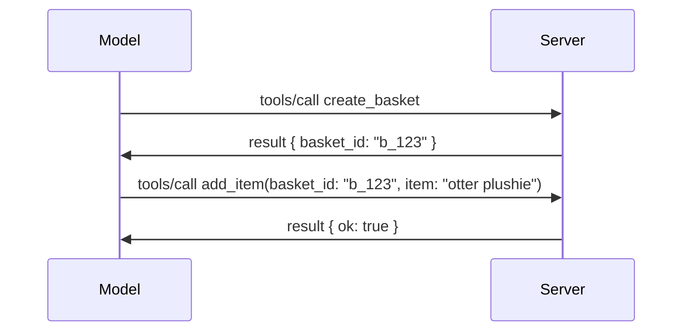

# MCP-তে কী পরিবর্তন হয়েছে: 2026-07-28 স্পেসিফিকেশন

> **স্থিতি:** চূড়ান্ত। MCP স্পেসিফিকেশন `2026-07-28` ২৮ জুলাই, ২০২৬-এ প্রকাশিত হয়েছে
> এবং এটি বর্তমান প্রোটোকল সংস্করণ। এই পাঠে চূড়ান্ত
> স্পেসিফিকেশনটি বর্ণনা করা হয়েছে। কিছু কারিকুলাম উদাহরণ স্পষ্টভাবে সংস্করণকৃত রয়েছে
> `2025-11-25` এ কারণ তাদের SDK এখনও নতুন স্টেটলেস API গ্রহণ করেনি;
> সেগুলোকে পুরাতন সামঞ্জস্য নির্দেশিকা হিসেবে বিবেচনা করুন।

## ওভারভিউ

`2026-07-28` MCP এর বৃহত্তম সংস্করণ যেহেতু এটি চালু হয়। ছয়টি
স্পেসিফিকেশন উন্নতির প্রস্তাব (SEPs) প্রোটোকল-স্তরের সেশনগুলো অপসারণ করে এবং
MCP-কে ট্রান্সপোর্ট স্তরে স্টেটলেস করে তোলে, এক্সটেনশনগুলো প্রথম-শ্রেণীর,
সংস্করণযুক্ত পদ্ধতি হয়ে ওঠে, এবং এই কারিকুলামের আগে আলোচিত কয়েকটি বৈশিষ্ট্য
(রুটস, স্যাম্পলিং, লগিং) নতুন জীবনচক্র নীতির আওতায় অব্যবহৃত ঘোষণা করা হয়। এই
পাঠে সংক্ষেপে বলা হয়েছে কী পরিবর্তন হয়েছে, কেন তা গুরুত্বপূর্ণ, এবং এর অর্থ কী
কোডের জন্য যা `2025-11-25` এর বিরুদ্ধে লেখা হয়েছে।

উৎস: [The 2026-07-28 MCP Specification Release Candidate](https://blog.modelcontextprotocol.io/posts/2026-07-28-release-candidate/) (মডেল কনটেক্সট প্রোটোকল ব্লগ, ডেভিড সোরিয়া প্যার্রা এবং ডেন ডেলিমার্সকি)।

## শেখার উদ্দেশ্য

এই পাঠ শেষ পর্যন্ত, আপনি সক্ষম হবেন:

- ব্যাখ্যা করতে কেন MCP একটি স্টেটলেস প্রোটোকল কোরে যাচ্ছে এবং এটি অনুভূরিত সমস্যা কী যা অনুভূমিকভাবে স্কেলড ডিপ্লয়মেন্টে সমাধান করে।
- বর্ণনা করতে কীভাবে `initialize`/`initialized` হ্যান্ডশেক এবং `Mcp-Session-Id` হেডার প্রতিস্থাপিত হয়েছে।
- চিহ্নিত করতে নতুন `Mcp-Method` এবং `Mcp-Name` হেডার এবং `ttlMs`/`cacheScope` ক্যাশিং মেটাডেটা।
- এক্সটেনশন্স ফ্রেমওয়ার্ক এবং এই রিলিজের সঙ্গে যা দুইটি এক্সটেনশন শিপ হচ্ছে: MCP অ্যাপস এবং টাস্কস।
- অনুমোদন কড়াকড়ি ও ডাইনামিক ক্লায়েন্ট রেজিস্ট্রেশন অব্যবহৃতকরণ সংক্ষেপে তুলে ধরা।

- কোন কোন মূল বৈশিষ্ট্য (রুটস, স্যাম্পলিং, লগিং) এখন অব্যবহৃত, এবং এর ব্যবহারিক মানে কী।
- টুল `inputSchema`/`outputSchema` এর জন্য ফুল JSON স্কিমা 2020-12 পরিবর্তন ব্যাখ্যা করা।

## একটি স্টেটলেস প্রোটোকল

প্রধান পরিবর্তন: MCP প্রোটোকল স্তরে স্টেটলেস হয়ে যায়।

### আগে (2025-11-25): সেশনগুলো আপনাকে এক সার্ভার ইনস্ট্যান্সের সাথে পিন করে রাখতো

স্ট্রিমেবল HTTP এর মাধ্যমে টুল কল করার সময় একটি `initialize` হ্যান্ডশেক দিয়ে শুরু হয়। সার্ভার একটি `Mcp-Session-Id` হেডার দিয়ে সাড়া দেয় যা প্রতিটি পরবর্তী অনুরোধ বহন করতে হবে:

```http
POST /mcp HTTP/1.1
Mcp-Session-Id: 1868a90c-3a3f-4f5b
Content-Type: application/json

{"jsonrpc":"2.0","id":2,"method":"tools/call",
 "params":{"name":"search","arguments":{"q":"otters"}}}
```

কারণ সেশন যেই সার্ভার ইনস্ট্যান্সটি জারি করেছে তার সাথে বাঁধা, অনুভূমিকভাবে স্কেলড ডিপ্লয়মেন্টে লোড ব্যালেন্সারে **স্টিকি রাউটিং** এবং ইনস্ট্যান্সগুলোর মধ্যে একটি **শেয়ার্ড সেশন স্টোর** প্রয়োজন।

### পরে (2026-07-28): প্রতিটি অনুরোধ স্বয়ংসম্পূর্ণ

```http
POST /mcp HTTP/1.1
MCP-Protocol-Version: 2026-07-28
Mcp-Method: tools/call
Mcp-Name: search
Content-Type: application/json

{"jsonrpc":"2.0","id":1,"method":"tools/call",
 "params":{"name":"search","arguments":{"q":"otters"},
           "_meta":{"io.modelcontextprotocol/protocolVersion":"2026-07-28",
                    "io.modelcontextprotocol/clientInfo":{"name":"my-app","version":"1.0"},
                    "io.modelcontextprotocol/clientCapabilities":{}}}}
```

যে কোনো সার্ভার ইনস্ট্যান্স এই অনুরোধটি পরিচালনা করতে পারে। মূল পরিবর্তনগুলো:

- **`initialize`/`initialized` হ্যান্ডশেকটি সরিয়ে দেওয়া হয়েছে** ([SEP-2575](https://github.com/modelcontextprotocol/modelcontextprotocol/pull/2575))। প্রোটোকল সংস্করণ, ক্লায়েন্ট তথ্য, এবং ক্লায়েন্ট ক্ষমতাগুলো প্রতিটি অনুরোধে `_meta` তে চলে গিয়েছে। একটি নতুন `server/discover` মেথড ক্লায়েন্টকে প্রারম্ভিকভাবে সার্ভার ক্ষমতাগুলো সংগ্রহ করতে দেয় যখন এটি তাদের প্রয়োজন হয়।

- **`Mcp-Session-Id` হেডার এবং প্রোটোকল-স্তরের সেশন অপসারণ করা হয়েছে** ([SEP-2567](https://github.com/modelcontextprotocol/modelcontextprotocol/pull/2567))। প্রোটোকল স্তরে স্টিকি রাউটিং এবং শেয়ার্ড সেশন স্টোর আর প্রয়োজন নেই।

### Stateless প্রোটোকল, stateful অ্যাপ্লিকেশন

প্রোটোকল-স্তরের সেশন সরানো মানে এই নয় যে আপনার সার্ভার stateful হতে পারে না। সুপারিশকৃত প্যাটার্ন হলো HTTP API গুলো যেভাবে সবসময় ব্যবহার করত: একটি টুল কল থেকে একটি স্পষ্ট হ্যান্ডেল (যেমন `basket_id`, `browser_id`) তৈরি করা এবং পরে কল গুলোতে সাধারান আর্গুমেন্ট হিসাবে মডেল ওই হ্যান্ডেল ফেরত পাঠায়।



এতে স্টেট মডেলের কাছে দৃশ্যমান এবং যুক্তিযুক্ত হয়, পরিবহন মেটাডেটার মধ্যে লুকিয়ে না রেখে, এবং এটি যেকোনো সার্ভার ইনস্ট্যান্সকে যেকোনো কল পরিচালনা করতে দেয়।

### সার্ভার-টু-ক্লায়েন্ট অনুরোধ, পুনর্গঠিত

একটি Stateless প্রোটোকল সার্ভারকে কলের মাঝপথে ক্লায়েন্টের কাছ থেকে কিছু চাওয়ার উপায় এখনও প্রয়োজন (যেমন, একটি elicitation prompt):

- **সার্ভার দ্বারা শুরুকৃত অনুরোধ শুধুমাত্র তখনই ইস্যু করা যেতে পারে যখন সার্ভার সক্রিয়ভাবে একটি ক্লায়েন্ট অনুরোধ প্রক্রিয়াকরণ করছে** ([SEP-2260](https://github.com/modelcontextprotocol/modelcontextprotocol/pull/2260)) — আগে এটি একটি সুপারিশ ছিল, এখন বাধ্যতামূলক। কোনো ব্যবহারকারী হঠাৎ করে কোন কিছু অনুরোধ করা হয় না।
- **মাল্টি রাউন্ড-ট্রিপ অনুরোধ** ([SEP-2322](https://github.com/modelcontextprotocol/modelcontextprotocol/pull/2322)) SSE স্ট্রিম খোলা রাখার বিকল্প হিসেবে এসেছে। এর পরিবর্তে, সার্ভার একটি `InputRequiredResult` ফেরত দেয়:

  ```json
  {
    "resultType": "input_required",
    "inputRequests": {
      "confirm": {
        "type": "elicitation",
        "message": "Delete 3 files?",
        "schema": { "type": "boolean" }
      }
    },
    "requestState": "eyJzdGVwIjoxLCJmaWxlcyI6WyJhIiwiYiIsImMiXX0="
  }
  ```

  ক্লায়েন্ট উত্তরগুলো সংগ্রহ করে এবং `inputResponses` সহ এবং ইকো করা `requestState` ফিল্ডসহ মূল কলটি পুনরায় পাঠায়। যেকোনো সার্ভার ইনস্ট্যান্স পুনরায় চেষ্টা গ্রহণ করতে পারে কারণ প্রয়োজনীয় সবকিছু পে-লোডে আছে।

### Routable, cacheable, traceable

Stateless ট্রাফিক পরিচালনা সহজ করতে তিনটি ছোট পরিবর্তন আনা হয়েছে:

- **Streamable HTTP-তে `Mcp-Method` এবং `Mcp-Name` হেডার বাধ্যতামূলক** ([SEP-2243](https://github.com/modelcontextprotocol/modelcontextprotocol/pull/2243)), যাতে লোড ব্যালান্সার, গেটওয়ে, এবং রেট লিমিটার অপারেশন দেখে JSON বডি ইন্সপেক্ট না করে রাউট করতে পারে। সার্ভারগুলো ঐ অনুরোধগুলো প্রত্যাখ্যান করে যেখানে হেডার এবং বডি অসঙ্গত।
- **`tools/list` এবং রিসোর্স রিড ফলাফলে `ttlMs` এবং `cacheScope` থাকে** ([SEP-2549](https://github.com/modelcontextprotocol/modelcontextprotocol/pull/2549)), HTTP `Cache-Control` এর অনুকরণে। ক্লায়েন্ট জানে একটি লিস্ট রেজাল্ট কতক্ষণ পর্যন্ত নতুন এবং এটি ব্যবহারকারীদের মধ্যে শেয়ার করা নিরাপদ কিনা, দীর্ঘমেয়াদী SSE স্ট্রিম ছাড়াই পরিবর্তনসমূহ সম্পর্কে জানতে পারে।
- **বৃহত W3C Trace Context প্রচলন `_meta` এ ডকুমেন্টেড** ([SEP-414](https://github.com/modelcontextprotocol/modelcontextprotocol/pull/414)), `traceparent`, `tracestate`, এবং `baggage` কী নাম ঠিক করে যাতে একটি বিতরণকৃত ট্রেস একটি কল অনুসরণ করতে পারে ক্লায়েন্ট SDK, MCP সার্ভার এবং ডাউনস্ট্রিম সিস্টেম জুড়ে একটি [OpenTelemetry](https://opentelemetry.io/)-সঙ্গত ব্যাকএন্ডে।

## এক্সটেনশন প্রথম-শ্রেণির হয়

এক্সটেনশন `2025-11-25` এ আনুষ্ঠানিকভাবে ছিল না। [SEP-2133](https://github.com/modelcontextprotocol/modelcontextprotocol/pull/2133) এগুলো আনুষ্ঠানিক করেছে:

- এক্সটেনশনগুলো রিভার্স-ডিএনএস আইডি দ্বারা সনাক্ত করা হয়।
- এগুলো ক্লায়েন্ট এবং সার্ভার ক্ষমতার `extensions` ম্যাপের মাধ্যমে আলোচনাকৃত হয়।

- তারা তাদের নিজস্ব `ext-*` রেপোসিটোরিগুলিতে থাকে, যেখানে ডেলিগেটেড মেইনটেনার রয়েছে এবং মূল স্পেসিফিকেশন থেকে স্বতন্ত্রভাবে সংস্করণ করে।
- SEP প্রক্রিয়াতে একটি নতুন এক্সটেনশন্স ট্র্যাক তাদের পরীক্ষামূলক থেকে অফিসিয়াল পর্যায়ে যাওয়ার পথ দেয়।

এই রিলিজে দুটি অফিসিয়াল এক্সটেনশন সরবরাহ করা হয়েছে।


### MCP অ্যাপস: সার্ভার-রেন্ডারড ব্যবহারকারী ইন্টারফেস

[MCP অ্যাপস](https://blog.modelcontextprotocol.io/posts/2026-01-26-mcp-apps/) ([SEP-1865](https://github.com/modelcontextprotocol/modelcontextprotocol/pull/1865)) সার্ভারকে ইন্টারেক্টিভ HTML ইন্টারফেস চালানোর সুযোগ দেয় যা হোস্টরা স্যান্ডবক্সড iframe-এ রেন্ডার করে। টুলস তাদের UI টেমপ্লেট আগে থেকে ডিক্লেয়ার করে যাতে হোস্টরা এগুলো প্রিফেচ, ক্যাশ ও সিকিউরিটি রিভিউ করতে পারে কোন কিছু চলার আগে। আপনি ইতিমধ্যেই [Lesson 15: MCP Apps](../03-GettingStarted/15-mcp-apps/README.md) এ এর মৌলিক বিষয়বস্তু শিখেছেন — এক্সটেনশন্স ফ্রেমওয়ার্কের অধীনে, MCP অ্যাপস এখন আনুষ্ঠানিকভাবে একটি এক্সটেনশন, পরীক্ষামূলক মূল ফিচার নয়।

### টাস্ক এক্সটেনশনে উত্তীর্ণ

`2025-11-25` এ টাস্কস পরীক্ষামূলক মূল ফিচার হিসেবে চালু হয়েছিল। প্রোডাকশন ব্যবহারে এত পুনঃনকশার প্রয়োজনীয়তা দেখা দিয়েছে যে, এর সঠিক ঠাঁই এখন একটি এক্সটেনশন: [টাস্কস এক্সটেনশন](https://github.com/modelcontextprotocol/modelcontextprotocol/pull/2663) স্টেটলেস মডেল চারপাশে লাইফসাইকেল পুনর্গঠন করে — একটি সার্ভার `tools/call` এর মাধ্যমে একটি টাস্ক হ্যান্ডেল দিতে পারে, এবং ক্লায়েন্ট `tasks/get`, `tasks/update`, ও `tasks/cancel` এর মাধ্যমে এগিয়ে নিয়ে যায়। টাস্ক তৈরি সার্ভার-নির্দেশিত: ক্লায়েন্ট এক্সটেনশন বিজ্ঞাপন করে, এবং সার্ভার সিদ্ধান্ত নেয় কখন একটি কল টাস্ক হিসেবে চালানো উচিত। `tasks/list` সম্পূর্ণ রূপে অপসারিত হয়েছে কারণ এটি সেফলি সেশন ছাড়া স্কোপড করা যায় না।

> **মাইগ্রেশন নোট:** আপনি যদি পরীক্ষামূলক `2025-11-25` টাস্কস API বাস্তবায়িত হয়ে থাকেন, তাহলে আপনাকে নতুন এক্সটেনশন লাইফসাইকেলে মাইগ্রেট করতে হবে — এটি ব্যাকওয়ার্ড কম্প্যাটিবল নয়।

## অনুমোদন কঠোরীকরণ

কয়েকটি SEP হালনাগাদ করেছে
[অনুমোদন স্পেসিফিকেশন](https://modelcontextprotocol.io/specification/2026-07-28/basic/authorization)
যাতে বাস্তব OAuth 2.0 / OpenID Connect ডিপ্লয়মেন্টের সাথে আরো ঘনিষ্ঠভাবে সামঞ্জস্য হয়:

| SEP | পরিবর্তন |
|---|---|
| [SEP-2468](https://github.com/modelcontextprotocol/modelcontextprotocol/pull/2468) | ক্লায়েন্টকে অনুমোদন প্রতিক্রিয়ায় থাকা `iss` প্যারামিটারটি যাচাই করতে হবে [RFC 9207](https://www.rfc-editor.org/rfc/rfc9207) অনুযায়ী, যা MCP-এর একক ক্লায়েন্ট, বহু সার্ভার প্যাটার্নে প্রচলিত মিক্স-আপ আক্রমণ কমায়। ভবিষ্যতে একটি সংস্করণে `iss` অনুপস্থিত প্রতিক্রিয়া প্রত্যাখ্যান বাধ্যতামূলক হবে। |
| [SEP-837](https://github.com/modelcontextprotocol/modelcontextprotocol/pull/837) | সামঞ্জস্যতা-বিশেষ ডায়নামিক ক্লায়েন্ট রেজিস্ট্রেশন ক্লায়েন্টরা তাদের OpenID Connect `application_type` ঘোষণা করবে, ডেস্কটপ ও CLI ক্লায়েন্টের জন্য ভুল `"web"` ডিফল্ট এড়াতে। |
| [SEP-2352](https://github.com/modelcontextprotocol/modelcontextprotocol/pull/2352) | সামঞ্জস্যতা-বিশেষ রেজিস্টার্ড ক্রেডেনশিয়ালগুলি ইস্যুকারী অনুমোদন সার্ভারের `issuer` এর সাথে আবদ্ধ; দলিলের স্থানান্তর হলে ক্লায়েন্ট নতুন করে রেজিস্টার করবে। |
| [SEP-2207](https://github.com/modelcontextprotocol/modelcontextprotocol/pull/2207) | OpenID Connect-স্টাইল অনুমোদন সার্ভার থেকে রিফ্রেশ টোকেন অনুরোধ করার পদ্ধতি উল্লিখিত হয়েছে। |
| [SEP-2350](https://github.com/modelcontextprotocol/modelcontextprotocol/pull/2350) | ধাপে-ধাপে অনুমোদনের সময় স্কোপ সঞ্চয়ের বিষয়টি স্পষ্ট করেছে। |
| [SEP-2351](https://github.com/modelcontextprotocol/modelcontextprotocol/pull/2351) | `.well-known` ডিসকভারি সাফিক্স পরিষ্কার করেছে। |

যদি আপনি MCP-এর জন্য অনুমোদন সার্ভার তৈরি করে থাকেন, অনুমোদন প্রতিক্রিয়ায় `iss` যোগ করুন এবং চূড়ান্ত অনুমোদন স্পেসিফিকেশন অনুসরণ করুন। 
[02-Security](../02-Security/README.md) এ বাস্তবায়ন নির্দেশনা দেখুন।


## অবহেলিত ফিচারসমূহ

নতুন
[ফিচার লাইফসাইকেল নীতি](https://github.com/modelcontextprotocol/modelcontextprotocol/pull/2577) অনুসারে,
রুটস, স্যাম্পলিং, লগিং, এবং ডায়নামিক ক্লায়েন্ট রেজিস্ট্রেশন **অবহেলিত**:

| ফিচার | প্রস্তাবিত বিকল্প |
|---|---|
| রুটস | টুল প্যারামিটার, রিসোর্স URIs, অথবা সার্ভার কনফিগারেশন |
| স্যাম্পলিং | সরাসরি LLM প্রোভাইডার API-এর সাথে ইন্টিগ্রেশন |
| লগিং | stdio ট্রান্সপোর্টের জন্য `stderr`; কাঠামোবদ্ধ অবজারভেবিলিটির জন্য OpenTelemetry |
| ডায়নামিক ক্লায়েন্ট রেজিস্ট্রেশন | Client ID Metadata ডকুমেন্টস |

এই ফিচারগুলো `2026-07-28` এ সামঞ্জস্যতার জন্য রয়েছে। এগুলো ২৮ জুলাই, ২০২৭ অথবা তার পরের প্রথম স্পেসিফিকেশন সংস্করণে অপসারিত হতে পারে; প্রকৃত অপসারণ পরে হতে পারে। নতুন বাস্তবায়নগুলো উপরের বিকল্প প্যাটার্ন ব্যবহার করা উচিত।


## টুলসের জন্য সম্পূর্ণ JSON Schema 2020-12

টুল `inputSchema` ও `outputSchema` এখন সম্পূর্ণ [JSON Schema 2020-12](https://json-schema.org/draft/2020-12) ([SEP-2106](https://github.com/modelcontextprotocol/modelcontextprotocol/pull/2106)) অনুসরণ করে:

- ইনপুট স্কিমাগুলো `type: "object"` মূল সীমাবদ্ধতা রাখে কিন্তু এখন কম্পোজিশন (`oneOf`, `anyOf`, `allOf`), শর্ত, এবং রেফারেন্স (`$ref`, `$defs`) অনুমোদন করে।
- আউটপুট স্কিমাগুলো কোনো সীমাবদ্ধতা ছাড়াই হয়েছে, এবং `structuredContent` এখন শুধুমাত্র একটি অবজেক্ট নয়, যেকোন JSON মান হতে পারে।
- বাস্তবায়নগুলিকে বাইরের `$ref` URI অটো-ডিরেফারেন্স করা যাবে না এবং স্কিমা গভীরতা ও যাচাইকরণের সময় সীমিত রাখার পরামর্শ দেয়া হয় (একটি সার্ভার-সাইড যাচাইকরণের ক্ষেত্রে ডিনায়াল-অফ-সার্ভিস প্রতিরোধের বিবেচনা)।

আলাদা করে, একটি অনুপস্থিত রিসোর্সের জন্য ত্রুটি কোড MCP-কাস্টম `-32002` থেকে JSON-RPC স্ট্যান্ডার্ড `-32602` (Invalid Params) এ পরিবর্তিত হয়েছে ([SEP-2164](https://github.com/modelcontextprotocol/modelcontextprotocol/pull/2164))। আপনার ক্লায়েন্ট যদি সরাসরি `-32002` এর উপর ম্যাচ করে, তাহলে আপডেট করতে হবে।

## এখান থেকে প্রোটোকল কিভাবে বিকশিত হচ্ছে

এই রিলিজে ভাঙ্গনমূলক পরিবর্তন রয়েছে, যা MCP রক্ষণাবেক্ষকরা ভবিষ্যতে নিয়ম হিসেবে রাখতে চায় না। তিনটি গভর্নেন্স SEP পুনরাবৃত্তি প্রতিরোধের লক্ষ্যে:

- **ফিচার লাইফসাইকেল নীতি** প্রতিটি ফিচারের জন্য Active → Deprecated → Removed টাইমলাইন দেয়, যেখানে অপসারণের আগে অন্তত বারো মাস ডিপ্রেকেশন থাকে।
- **এক্সটেনশন্স ফ্রেমওয়ার্ক** নতুন সক্ষমতাগুলো অপট-ইন এক্সটেনশন হিসেবে চালু করার সুযোগ দেয় এবং সেগুলো স্টেবিলাইজ হওয়া পর্যন্ত (যদি আর কখনো হয়) মূল স্পেসিফিকেশনে নিয়ে যাওয়া হয়।
- একটি স্ট্যান্ডার্ডস ট্র্যাক SEP চূড়ান্ত মর্যাদা পাবে না যতক্ষণ না মিলিত পরিস্থিতি [conformance suite](https://github.com/modelcontextprotocol/conformance) এ অন্তর্ভুক্ত হয় ([SEP-2484](https://github.com/modelcontextprotocol/modelcontextprotocol/pull/2484)) — যে স্যুট [SDK tier system](https://github.com/modelcontextprotocol/modelcontextprotocol/pull/1777) অফিসিয়াল SDK-গুলোর স্কোরিং করে।

## রিলিজ টাইমলাইন এবং ভ্যালিডেশন

- রিলিজ প্রার্থী স্থির হয়েছিল ২১ মে, ২০২৬।
- চূড়ান্ত স্পেসিফিকেশন চালু হয় ২৮ জুলাই, ২০২৬।

- SDK সাপোর্ট স্পেসিফিকেশনের থেকে পিছিয়ে থাকতে পারে। মাইগ্রেট করার আগে
  [SDK ডকুমেন্টেশন](https://modelcontextprotocol.io/docs/sdk) এবং SDK এর
  রিলিজ নোটগুলো চেক করুন।
- চূড়ান্ত পরিবর্তনগুলি ট্র্যাক করুন
  [2026-07-28 স্পেসিফিকেশন](https://modelcontextprotocol.io/specification/2026-07-28/)
  এবং এর
  [চেঞ্জলগ](https://modelcontextprotocol.io/specification/2026-07-28/changelog)।

## এই পাঠ্যক্রমের জন্য এর অর্থ কী

পাঠ্যক্রম `2025-11-25` নমুনা থেকে বর্তমান
`2026-07-28` স্পেসিফিকেশনের দিকে রূপান্তরিত হচ্ছে। সুনির্দিষ্টভাবে:

- **সেশন এবং `initialize` হ্যান্ডশেক** যা স্পষ্টভাবে
  `2025-11-25` লক্ষ্য করে নির্মিত, সেগুলো লিগেসি আচরণ। `2026-07-28` প্রোটোকল
  এগুলোকে উপরে বর্ণিত স্টেটলেস রিকুয়েস্ট মডেলের সাথে প্রতিস্থাপন করে।
- **স্যাম্পলিং এবং রুটস** অনুকূলতার জন্য এখনও উপলব্ধ কিন্তু প্রচলিত নয়।
  নতুন ডিজাইনগুলোর উচিত উপরে দেওয়া প্রতিস্থাপন প্যাটার্নগুলি ব্যবহার করা।
- **প্রায়োগিক টাস্ক ফিচার**, যদি আপনি এটি ব্যবহার করে থাকেন, তাহলে টাস্ক এক্সটেনশনের নতুন লাইফসাইকেলে মাইগ্রেট করতে হবে।
- **MCP অ্যাপস** ([Lesson 15](../03-GettingStarted/15-mcp-apps/README.md)) বাস্তবে অপরিবর্তিত; এটি শুধু আনুষ্ঠানিক এক্সটেনশন ফ্রেমওয়ার্কের আওতায় চলে এসেছে।

## অতিরিক্ত সম্পদ

- [MCP স্পেসিফিকেশন 2026-07-28](https://modelcontextprotocol.io/specification/2026-07-28/)
- [2026-07-28 চেঞ্জলগ](https://modelcontextprotocol.io/specification/2026-07-28/changelog)
- [2026-07-28 MCP স্পেসিফিকেশন রিলিজ ক্যান্ডিডেট (ঐতিহাসিক ব্লগ পোস্ট)](https://blog.modelcontextprotocol.io/posts/2026-07-28-release-candidate/)
- [MCP ট্রান্সপোর্টগুলির ভবিষ্যত](https://blog.modelcontextprotocol.io/posts/2025-12-19-mcp-transport-future/)
- [SEP নির্দেশিকা](https://modelcontextprotocol.io/community/sep-guidelines)
- [MCP SDK টিয়ার সিস্টেম](https://modelcontextprotocol.io/docs/sdk)

## পরবর্তী ধাপ

ফিরে যান [Core Concepts](./README.md) এ বা চালিয়ে যান
[Security](../02-Security/README.md) তে বর্তমান `2026-07-28` নির্দেশনা অনুসরণ করতে।

---

<!-- CO-OP TRANSLATOR DISCLAIMER START -->
**অস্বীকৃতি**:
এই নথিটি AI অনুবাদ পরিষেবা [Co-op Translator](https://github.com/Azure/co-op-translator) ব্যবহার করে অনূদিত হয়েছে। যদিও আমরা শুদ্ধতার জন্য চেষ্টা করি, অনুগ্রহ করে মনে রাখবেন যে স্বয়ংক্রিয় অনুবাদে ত্রুটি বা অসঙ্গতি থাকতে পারে। মূল নথিটি তার স্বভাষায় কর্তৃত্বপূর্ণ উৎস হিসেবে বিবেচিত হওয়া উচিত। গুরুত্বপূর্ণ তথ্যের জন্য পেশাদার মানব অনুবাদ সুপারিশ করা হয়। এই অনুবাদের ব্যবহারে প্রয়োজনীয় ভুল বোঝাবুঝি বা ভুল ব্যাখ্যার জন্য আমরা দায়বদ্ধ নই।
<!-- CO-OP TRANSLATOR DISCLAIMER END -->