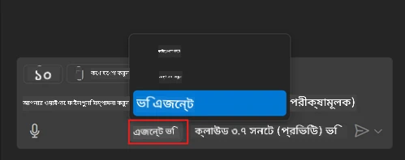
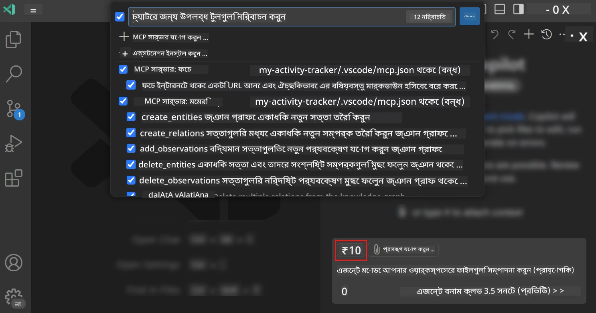
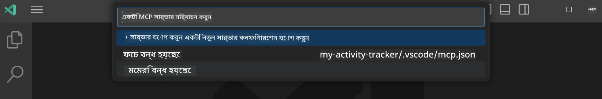
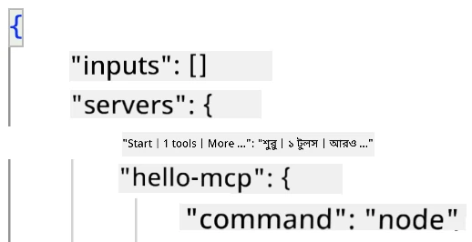
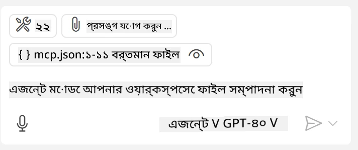
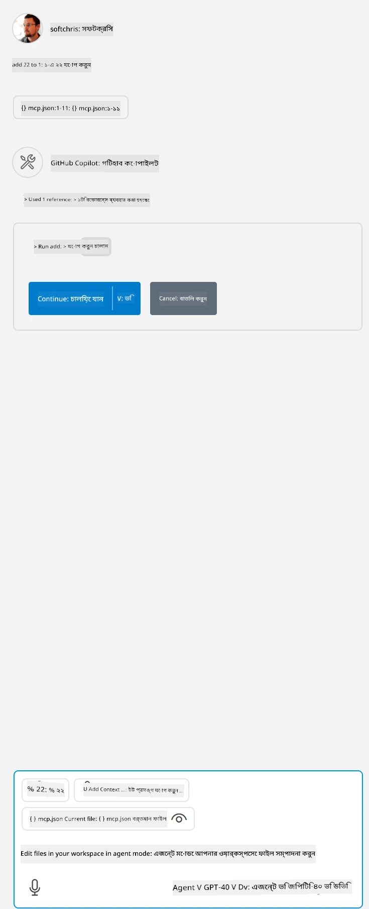

# GitHub Copilot Agent মোড থেকে একটি সার্ভার ব্যবহার করা

Visual Studio Code এবং GitHub Copilot একটি ক্লায়েন্ট হিসাবে কাজ করতে পারে এবং একটি MCP সার্ভার ব্যবহার করতে পারে। আপনি হয়তো জিজ্ঞাসা করতে পারেন কেন আমরা এটি করতে চাই? ঠিক আছে, এর মানে হলো MCP সার্ভারের যে কোন ফিচার এখন আপনার IDE থেকে ব্যবহার করা যাবে। উদাহরণস্বরূপ, আপনি GitHub এর MCP সার্ভার যোগ করছেন, তাহলে এটি আপনাকে টার্মিনালে নির্দিষ্ট কমান্ড টাইপ করার পরিবর্তে প্রম্পটের মাধ্যমে GitHub নিয়ন্ত্রণ করার সুযোগ দেবে। অথবা যেকোন কিছু যা আপনার ডেভেলপার অভিজ্ঞতা উন্নত করতে পারে, প্রাকৃতিক ভাষা ব্যবহার করে নিয়ন্ত্রিত হবে। এখন আপনি বিজয় দেখতে শুরু করছেন, তাই তো?

## সারাংশ

এই পাঠে কিভাবে Visual Studio Code এবং GitHub Copilot এর Agent মোড ব্যবহার করে MCP সার্ভারের ক্লায়েন্ট হিসেবে ব্যবহার করা যায় তা আলোচনা করা হয়েছে।

## শেখার লক্ষ্য

এই পাঠ শেষে আপনি সক্ষম হবেন:

- Visual Studio Code এর মাধ্যমে একটি MCP সার্ভার ব্যবহার করতে।
- GitHub Copilot এর মাধ্যমে টুলস মত ক্ষমতাগুলো চালাতে।
- MCP সার্ভার সনাক্তকরণ ও পরিচালনার জন্য Visual Studio Code কনফিগার করতে।

## ব্যবহার

আপনি দুইটি ভিন্ন উপায়ে আপনার MCP সার্ভার নিয়ন্ত্রণ করতে পারেন:

- ব্যবহারকারী ইন্টারফেস, এটি কিভাবে করা হয় পরে এই ভাগে দেখা হবে।
- টার্মিনাল, `code` এক্সিকিউটেবল ব্যবহার করে টার্মিনাল থেকে নিয়ন্ত্রণ সম্ভব:

  আপনার ব্যবহারকারী প্রোফাইলে একটি MCP সার্ভার যোগ করতে, --add-mcp কমান্ড লাইন অপশন ব্যবহার করুন এবং JSON সার্ভার কনফিগারেশন দিন যেমন {"name":"server-name","command":...}।

  ```
  code --add-mcp "{\"name\":\"my-server\",\"command\": \"uvx\",\"args\": [\"mcp-server-fetch\"]}"
  ```

### স্ক্রিনশট





চলুন পরবর্তী অংশে ভিজ্যুয়াল ইন্টারফেস ব্যবহার সম্পর্কে আরও আলোচনা করি।

## পদ্ধতি

উচ্চ স্তরে আমাদের পদ্ধতি হলো:

- MCP সার্ভার খুঁজে পাওয়ার জন্য একটি ফাইল কনফিগার করা।
- উক্ত সার্ভার চালু/যোগযোগ করে তার ক্ষমতাগুলো তালিকা করা।
- GitHub Copilot Chat ইন্টারফেসের মাধ্যমে সেই ক্ষমতাগুলো ব্যবহার করা।

খুব ভাল, এখন যে প্রবাহটি বুঝেছি, আসুন Visual Studio Code এর মাধ্যমে MCP সার্ভার ব্যবহার করার একটি অনুশীলন করি।

## অনুশীলন: একটি সার্ভার ব্যবহার করা

এই অনুশীলনে, আমরা Visual Studio Code কনফিগার করব যাতে এটি আপনার MCP সার্ভার খুঁজে পায় এবং GitHub Copilot Chat ইন্টারফেস থেকে ব্যবহার করা যায়।

### -0- প্রাকপদক্ষেপ, MCP সার্ভার আবিষ্কারের সক্ষমকরণ

আপনাকে MCP সার্ভার আবিষ্কার সক্ষম করতে হতে পারে।

১. Visual Studio Code এ `File -> Preferences -> Settings` এ যান।

২. "MCP" অনুসন্ধান করুন এবং settings.json ফাইলে `chat.mcp.discovery.enabled` সক্ষম করুন।

### -1- কনফিগ ফাইল তৈরি করুন

আপনার প্রকল্পের মূল ফোল্ডারে একটি কনফিগ ফাইল তৈরি করুন, MCP.json নামে একটি ফাইল .vscode নামে একটি ফোল্ডারে রাখতে হবে। এটি এমন দেখতে হবে:

```text
.vscode
|-- mcp.json
```

এবার দেখি কিভাবে আমরা একটি সার্ভার এন্ট্রি যোগ করতে পারি।

### -2- সার্ভার কনফিগার করুন

*mcp.json* এ নিম্নলিখিত বিষয়বস্তু যোগ করুন:

```json
{
    "inputs": [],
    "servers": {
       "hello-mcp": {
           "command": "node",
           "args": [
               "build/index.js"
           ]
       }
    }
}
```

উপরে একটি সাদামাটা উদাহরণ দেওয়া হয়েছে Node.js এ লেখা সার্ভার চালুর, অন্যান্য রানটাইমের জন্য `command` এবং `args` ব্যবহার করে সঠিক কমান্ড উল্লেখ করুন সার্ভার শুরু করার জন্য।

### -3- সার্ভার শুরু করুন

এখন আপনি একটি এন্ট্রি যোগ করেছেন, আসুন সার্ভার শুরু করি:

১. *mcp.json* এ আপনার এন্ট্রি খুঁজে বের করুন এবং নিশ্চিত করুন "play" আইকন দেখতে পাচ্ছেন:

    

২. "play" আইকনে ক্লিক করুন, GitHub Copilot Chat এ টুলস আইকনে উপলব্ধ টুলসের সংখ্যা বৃদ্ধি পাবে। ওই টুলস আইকনে ক্লিক করলে নিবন্ধিত টুলগুলোর একটি তালিকা দেখতে পাবেন। আপনি প্রতিটি টুল চেক/আনচেক করতে পারেন যদি GitHub Copilot কে সেগুলো প্রসঙ্গ হিসেবে ব্যবহার করতে চান বা না চান:

  

৩. একটি টুল চালাতে, এমন একটি প্রম্পট টাইপ করুন যা আপনার টুলগুলোর বর্ণনার সাথে মেলে, উদাহরণস্বরূপ "add 22 to 1" যেমন একটি প্রম্পট:

  

  একটি সাড়া হিসাবে ২৩ দেখতে পাবেন।

## অ্যাসাইনমেন্ট

আপনার *mcp.json* ফাইলে একটি সার্ভার এন্ট্রি যোগ করার চেষ্টা করুন এবং নিশ্চিত করুন সার্ভার শুরু/বন্ধ করতে পারেন। নিশ্চিত করুন GitHub Copilot Chat ইন্টারফেসের মাধ্যমে আপনার সার্ভারের টুলগুলোর সাথে আপনি যোগাযোগ করতে পারেন।

## সমাধান

[সমাধান](./solution/README.md)

## মূল ধারণা

এই অধ্যায় থেকে মূল ধারণাগুলো হলো:

- Visual Studio Code একটি চমৎকার ক্লায়েন্ট যা আপনাকে একাধিক MCP সার্ভার এবং তাদের টুলস ব্যবহার করতে দেয়।
- GitHub Copilot Chat ইন্টারফেস হলো সার্ভারের সাথে আপনি যেভাবে ইন্টারঅ্যাক্ট করবেন।
- আপনি ব্যবহারকারীর কাছ থেকে API কী-এর মত ইনপুট চাইতে পারেন যা *mcp.json* ফাইলে সার্ভার এন্ট্রি কনফিগার করার সময় MCP সার্ভারে পাঠানো যেতে পারে।

## নমুনাসমূহ

- [Java Calculator](../samples/java/calculator/README.md)
- [.Net Calculator](../../../../03-GettingStarted/samples/csharp)
- [JavaScript Calculator](../samples/javascript/README.md)
- [TypeScript Calculator](../samples/typescript/README.md)
- [Python Calculator](../../../../03-GettingStarted/samples/python)

## অতিরিক্ত সম্পদ

- [Visual Studio ডকুমেন্টেশন](https://code.visualstudio.com/docs/copilot/chat/mcp-servers)

## পরবর্তী ধাপ

- পরবর্তী: [একটি stdio সার্ভার তৈরি করা](../05-stdio-server/README.md)

---

<!-- CO-OP TRANSLATOR DISCLAIMER START -->
**অস্বীকৃতি**:
এই নথিটি AI অনুবাদ পরিষেবা [Co-op Translator](https://github.com/Azure/co-op-translator) ব্যবহার করে অনূদিত হয়েছে। যদিও আমরা শুদ্ধতার জন্য চেষ্টা করি, অনুগ্রহ করে মনে রাখবেন যে স্বয়ংক্রিয় অনুবাদে ত্রুটি বা অসঙ্গতি থাকতে পারে। মূল নথিটি তার স্বভাষায় কর্তৃত্বপূর্ণ উৎস হিসেবে বিবেচিত হওয়া উচিত। গুরুত্বপূর্ণ তথ্যের জন্য পেশাদার মানব অনুবাদ সুপারিশ করা হয়। এই অনুবাদের ব্যবহারে প্রয়োজনীয় ভুল বোঝাবুঝি বা ভুল ব্যাখ্যার জন্য আমরা দায়বদ্ধ নই।
<!-- CO-OP TRANSLATOR DISCLAIMER END -->