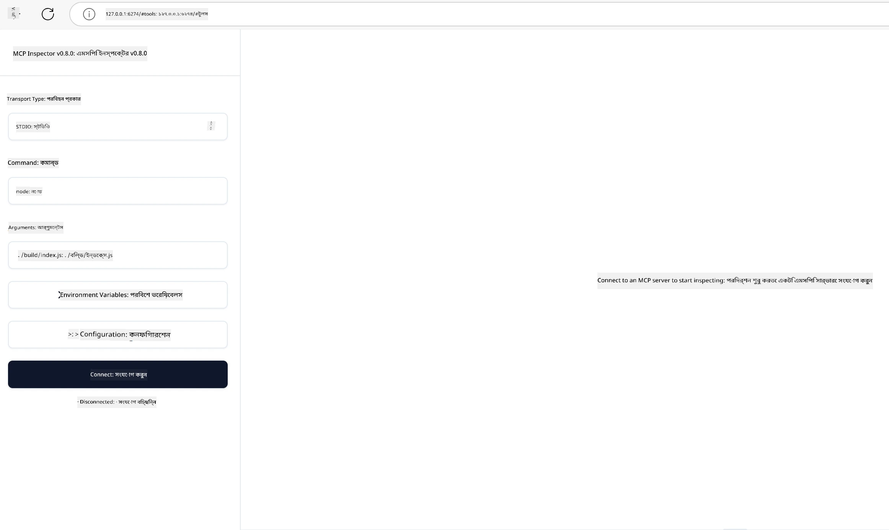

## টেস্টিং এবং ডিবাগিং

আপনি যখন আপনার MCP সার্ভার টেস্ট করতে শুরু করবেন, তখন উপলব্ধ সরঞ্জাম এবং ডিবাগিং এর সেরা পদ্ধতিগুলি বোঝা গুরুত্বপূর্ণ। কার্যকর টেস্টিং নিশ্চিত করে যে আপনার সার্ভার প্রত্যাশিতভাবে কাজ করছে এবং আপনাকে দ্রুত সমস্যা সনাক্ত ও সমাধান করতে সাহায্য করে। নিম্নলিখিত বিভাগে আপনার MCP ইমপ্লিমেন্টেশন যাচাই করার জন্য প্রস্তাবিত পদ্ধতিগুলি বর্ণনা করা হয়েছে।

## ওভারভিউ

এই অধ্যায়ে কীভাবে সঠিক টেস্টিং পদ্ধতি নির্বাচন করবেন এবং সবচেয়ে কার্যকর টেস্টিং টুল ব্যবহারের বিষয়ে আলোচনা করা হয়েছে।

## শেখার উদ্দেশ্য

এই পাঠের শেষে, আপনি সক্ষম হবেন:

- বিভিন্ন পদ্ধতি ব্যবহার করে টেস্টিং বর্ণনা করতে।
- বিভিন্ন সরঞ্জাম ব্যবহার করে আপনার কোড কার্যকরভাবে পরীক্ষা করতে।


## MCP সার্ভার টেস্টিং

MCP আপনাকে আপনার সার্ভারগুলো টেস্ট এবং ডিবাগ করার জন্য সরঞ্জাম সরবরাহ করে:

- **MCP Inspector**: একটি কমান্ড লাইন টুল যা CLI টুল এবং ভিজ্যুয়াল টুল উভয় হিসাবে চালানো যায়।
- **ম্যানুয়াল টেস্টিং**: আপনি curl-এর মতো একটি টুল ব্যবহার করে ওয়েব রিকুয়েস্ট চালাতে পারেন, কিন্তু HTTP চালাতে সক্ষম যে কোনো টুল ব্যবহার করা যাবে।
- **ইউনিট টেস্টিং**: আপনার পছন্দের টেস্টিং ফ্রেমওয়ার্ক ব্যবহার করে সার্ভার এবং ক্লায়েন্ট উভয়ের ফিচার টেস্ট করা সম্ভব।

### MCP Inspector ব্যবহার

আমরা পূর্ববর্তী পাঠে এই টুলের ব্যবহার বর্ণনা করেছি, তবে এবার একটি উচ্চ স্তরের আলোচনা করা যাক। এটি Node.js-এ নির্মিত একটি টুল এবং আপনি এটি ব্যবহার করতে পারেন `npx` এক্সিকিউটেবল কল করে, যা টুলটি স্বল্প সময়ের জন্য ডাউনলোড ও ইনস্টল করবে এবং রিকুয়েস্ট শেষ হলে নিজেই পরিষ্কার হয়ে যাবে।

[MCP Inspector](https://github.com/modelcontextprotocol/inspector) আপনাকে সাহায্য করে:

- **সার্ভারের ক্ষমতা আবিষ্কার করুন**: স্বয়ংক্রিয়ভাবে উপলব্ধ রিসোর্স, টুল এবং প্রম্পট সনাক্ত করা
- **টুল এক্সিকিউশন টেস্ট করুন**: বিভিন্ন প্যারামিটার চেষ্টা করুন এবং রিয়েল-টাইমে প্রতিক্রিয়া দেখুন
- **সার্ভার মেটাডেটা দেখুন**: সার্ভারের তথ্য, স্কিমা এবং কনফিগারেশন পরীক্ষা করুন

একটি সাধারণ টুল রান এরকম দেখতে পারে:

```bash
npx @modelcontextprotocol/inspector node build/index.js
```

উপরের কমান্ডটি একটি MCP এবং তার ভিজ্যুয়াল ইন্টারফেস শুরু করে এবং আপনার ব্রাউজারে একটি লোকাল ওয়েব ইন্টারফেস চালু করে। আপনাকে একটি ড্যাশবোর্ড দেখতে পাবেন যাতে নিবন্ধিত MCP সার্ভার, তাদের উপলব্ধ টুল, রিসোর্স এবং প্রম্পট প্রদর্শিত হয়। ইন্টারফেসটি আপনাকে ইন্টারেক্টিভভাবে টুল এক্সিকিউশন টেস্ট, সার্ভার মেটাডেটা ইন্সপেকশন, এবং রিয়েল-টাইম প্রতিক্রিয়া দেখার সুযোগ দেয়, যা আপনার MCP সার্ভার ইমপ্লিমেন্টেশন যাচাই এবং ডিবাগ করা সহজ করে তোলে।

এটি দেখতে এরকম হতে পারে: 

আপনি এই টুলটি CLI মোডেও চালাতে পারেন, তখন `--cli` অ্যাট্রিবিউট যোগ করতে হবে। এখানে "CLI" মোডে টুলটি চালানোর একটি উদাহরণ দেওয়া হলো যা সার্ভারের সব টুল তালিকাভুক্ত করে:

```sh
npx @modelcontextprotocol/inspector --cli node build/index.js --method tools/list
```

### ম্যানুয়াল টেস্টিং

সার্ভারের ক্ষমতা পরীক্ষার জন্য inspector টুল চালানোর পাশাপাশি, একটি অনুরূপ পদ্ধতি হলো HTTP ব্যবহার করতে সক্ষম ক্লায়েন্ট যেমন curl চালানো।

curl ব্যবহার করে আপনি সরাসরি MCP সার্ভার HTTP রিকুয়েস্টের মাধ্যমে পরীক্ষা করতে পারেন:

```bash
# উদাহরণ: টেস্ট সার্ভারের মেটাডেটা
curl http://localhost:3000/v1/metadata

# উদাহরণ: একটি টুল চালান
curl -X POST http://localhost:3000/v1/tools/execute \
  -H "Content-Type: application/json" \
  -d '{"name": "calculator", "parameters": {"expression": "2+2"}}'
```

উপরের curl ব্যবহারের উদাহরণ থেকে দেখতে পাচ্ছেন, আপনি POST রিকুয়েস্ট ব্যবহার করে একটি টুল চালু করছেন যেটি টুলের নাম এবং প্যারামিটার নিয়ে একটি পে-লোড পাঠায়। আপনার জন্য সবচেয়ে উপযুক্ত পদ্ধতি ব্যবহার করুন। সাধারণত CLI টুলগুলো ব্যবহার দ্রুত হয় এবং সেগুলো স্ক্রিপ্টেড হতে পারে, যা CI/CD পরিবেশে কার্যকর।

### ইউনিট টেস্টিং

আপনার টুল এবং রিসোর্সের জন্য ইউনিট টেস্ট তৈরি করুন যাতে নিশ্চিত হয় যে সেগুলো প্রত্যাশা অনুযায়ী কাজ করছে। এখানে কিছু পরীক্ষার কোডের উদাহরণ দেওয়া হলো।

```python
import pytest

from mcp.server.fastmcp import FastMCP
from mcp.shared.memory import (
    create_connected_server_and_client_session as create_session,
)

# পুরো মডিউলটি অ্যাসিঙ্ক পরীক্ষার জন্য চিহ্নিত করুন
pytestmark = pytest.mark.anyio


async def test_list_tools_cursor_parameter():
    """Test that the cursor parameter is accepted for list_tools.

    Note: FastMCP doesn't currently implement pagination, so this test
    only verifies that the cursor parameter is accepted by the client.
    """

 server = FastMCP("test")

    # একটি বা দুটি টেস্ট টুল তৈরি করুন
    @server.tool(name="test_tool_1")
    async def test_tool_1() -> str:
        """First test tool"""
        return "Result 1"

    @server.tool(name="test_tool_2")
    async def test_tool_2() -> str:
        """Second test tool"""
        return "Result 2"

    async with create_session(server._mcp_server) as client_session:
        # কার্সর প্যারামিটার ছাড়া (বাদ দেওয়া) পরীক্ষা করুন
        result1 = await client_session.list_tools()
        assert len(result1.tools) == 2

        # কার্সর=None দিয়ে পরীক্ষা করুন
        result2 = await client_session.list_tools(cursor=None)
        assert len(result2.tools) == 2

        # স্ট্রিং হিসাবে কার্সর দিয়ে পরীক্ষা করুন
        result3 = await client_session.list_tools(cursor="some_cursor_value")
        assert len(result3.tools) == 2

        # খালি স্ট্রিং কার্সর দিয়ে পরীক্ষা করুন
        result4 = await client_session.list_tools(cursor="")
        assert len(result4.tools) == 2
    
```

উপরের কোড যা করে:

- pytest ফ্রেমওয়ার্ক ব্যবহার করে যা আপনাকে ফাংশন হিসেবে টেস্ট তৈরি করতে এবং assert স্টেটমেন্ট ব্যবহার করতে দেয়।
- দুইটি ভিন্ন টুল সহ একটি MCP সার্ভার তৈরি করে।
- যাচাই করার জন্য `assert` স্টেটমেন্ট ব্যবহার করে যে নির্দিষ্ট শর্ত পূরণ হয়েছে কিনা।

[এখানে পুরো ফাইলটি দেখুন](https://github.com/modelcontextprotocol/python-sdk/blob/main/tests/client/test_list_methods_cursor.py)

উপরের ফাইল দেওয়া থাকলে, আপনি আপনার নিজস্ব সার্ভার টেস্ট করতে পারেন এবং নিশ্চিত করতে পারেন যে ক্ষমতাগুলো সঠিকভাবে তৈরি হয়েছে।

সব প্রধান SDK-র কাছাকাছি টেস্টিং অংশ থাকে, তাই আপনি আপনার পছন্দসই রানটাইম অনুযায়ী সামঞ্জস্য করতে পারেন।

## নমুনা 

- [Java Calculator](../samples/java/calculator/README.md)
- [.Net Calculator](../../../../03-GettingStarted/samples/csharp)
- [JavaScript Calculator](../samples/javascript/README.md)
- [TypeScript Calculator](../samples/typescript/README.md)
- [Python Calculator](../../../../03-GettingStarted/samples/python) 

## অতিরিক্ত সম্পদ

- [Python SDK](https://github.com/modelcontextprotocol/python-sdk)

## পরবর্তী কী

- পরবর্তী: [ডিপ্লয়মেন্ট](../09-deployment/README.md)

---

<!-- CO-OP TRANSLATOR DISCLAIMER START -->
**বিজ্ঞপ্তি**:  
এই নথিটি AI অনুবাদ সেবা [Co-op Translator](https://github.com/Azure/co-op-translator) ব্যবহার করে অনূদিত হয়েছে। যদিও আমরা সঠিকতার জন্য চেষ্টা করি, স্বয়ংক্রিয় অনুবাদে ভুল বা অস্পষ্টতা থাকতে পারে। মূল নথিটি তার নিজস্ব ভাষায়ই প্রাধান্যপ্রাপ্ত উৎস হিসেবে বিবেচিত হওয়া উচিত। গুরুত্বপূর্ণ তথ্যের জন্য পেশাদার মানব অনুবাদ সুপারিশ করা হয়। এই অনুবাদের ব্যবহার থেকে উদ্ভূত যে কোনো ভুল বোঝাবুঝি বা ভুল ব্যাখ্যার জন্য আমরা কোনো দায়িত্ব গ্রহণ করি না।
<!-- CO-OP TRANSLATOR DISCLAIMER END -->