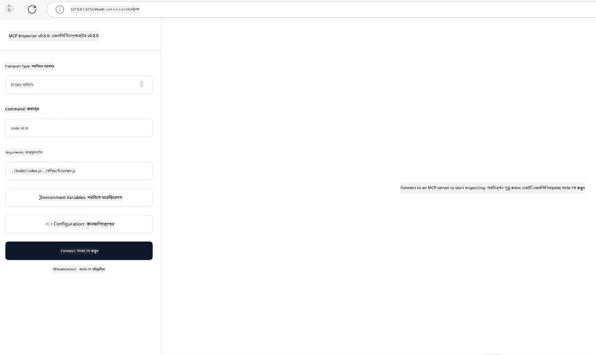

## পরীক্ষা এবং ডিবাগিং

আপনার MCP সার্ভার পরীক্ষা শুরু করার আগে, উপলব্ধ সরঞ্জাম এবং ডিবাগিংয়ের জন্য সেরা অনুশীলনগুলি বোঝা গুরুত্বপূর্ণ। কার্যকরী পরীক্ষণ নিশ্চিত করে যে আপনার সার্ভার প্রত্যাশিত আচরণ করে এবং আপনাকে দ্রুত সমস্যা শনাক্ত এবং সমাধান করতে সহায়তা করে। নিম্নলিখিত অংশে আপনার MCP বাস্তবায়ন যাচাই করার জন্য সুপারিশকৃত পদ্ধতিগুলি বর্ণনা করা হয়েছে।

## ওভারভিউ

এই পাঠে শেখানো হবে সঠিক পরীক্ষার পদ্ধতি এবং সবচেয়ে কার্যকর পরীক্ষার সরঞ্জাম নির্বাচন কিভাবে করবেন।

## শেখার উদ্দেশ্য

এই পাঠ শেষ হওয়ার সময়, আপনি সক্ষম হবেন:

- বিভিন্ন পরীক্ষার পদ্ধতি বর্ণনা করতে।
- আপনার কোড কার্যকরভাবে পরীক্ষা করতে বিভিন্ন সরঞ্জাম ব্যবহার করতে।


## MCP সার্ভার পরীক্ষা

MCP সরঞ্জাম প্রদান করে যা আপনাকে সার্ভার পরীক্ষা এবং ডিবাগ করতে সাহায্য করে:

- **MCP Inspector**: একটি কমান্ড লাইন টুল যা CLI টুল হিসেবে এবং ভিজ্যুয়াল টুল হিসেবে উভয়ভাবে চালানো যায়।
- **ম্যানুয়াল টেস্টিং**: curl-এর মতো একটি টুল ব্যবহার করতে পারেন ওয়েব রিকোয়েস্ট চালানোর জন্য, তবে যেকোনো HTTP চালানো সক্ষম টুল ব্যবহার করা যাবে।
- **ইউনিট টেস্টিং**: আপনার প্রিয় টেস্টিং ফ্রেমওয়ার্ক ব্যবহার করে সার্ভার এবং ক্লায়েন্ট উভয় ফিচার পরীক্ষা করা সম্ভব।

### MCP Inspector ব্যবহার করা

আমরা পূর্ববর্তী পাঠে এই টুলটির ব্যবহার বর্ণনা করেছি, কিন্তু এখন এটি সামগ্রিক উচ্চস্তরে আলোচনা করা যাক। এটি Node.js-এ নির্মিত একটি টুল এবং আপনি `npx` এক্সিকিউটেবল কল করে এটি ব্যবহার করতে পারেন, যা টুলটি অস্থায়ীভাবে ডাউনলোড ও ইনস্টল করবে এবং আপনার রিকোয়েস্ট শেষ হলে নিজে পরিষ্কার হয়ে যাবে।

[MCP Inspector](https://github.com/modelcontextprotocol/inspector) আপনাকে সাহায্য করে:

- **সার্ভার সক্ষমতা আবিষ্কার**: স্বয়ংক্রিয়ভাবে উপলব্ধ রিসোর্স, টুল এবং প্রম্পট সনাক্ত করুন
- **টুল কার্যকরী পরীক্ষা**: বিভিন্ন প্যারামিটার চেষ্টা করুন এবং রিয়েল-টাইম প্রতিক্রিয়া দেখুন
- **সার্ভার মেটাডেটা দেখুন**: সার্ভারের তথ্য, স্কিমা এবং কনফিগারেশন পরীক্ষা করুন

টুলটি একটি সাধারণ চালানো দেখতে এরূপ হয়:

```bash
npx @modelcontextprotocol/inspector node build/index.js
```

উপরোক্ত কমান্ডটি একটি MCP এবং তার ভিজ্যুয়াল ইন্টারফেস চালু করে এবং আপনার ব্রাউজারে একটি লোকাল ওয়েব ইন্টারফেস শুরু করে। আপনি একটি ড্যাশবোর্ড দেখতে পাবেন যা আপনার নিবন্ধিত MCP সার্ভারগুলি, তাদের উপলব্ধ টুল, রিসোর্স এবং প্রম্পট প্রদর্শন করে। ইন্টারফেস আপনাকে ইন্টারেক্টিভভাবে টুল কার্যকরী পরীক্ষা করতে, সার্ভার মেটাডেটা পরিদর্শন করতে এবং রিয়েল-টাইম প্রতিক্রিয়া দেখতে দেয়, যা আপনার MCP সার্ভার বাস্তবায়নগুলি যাচাই ও ডিবাগ করা সহজ করে তোলে।

এরূপ দেখতে পারে: 

আপনি এই টুলটি CLI মোডেও চালাতে পারেন, যেখানে আপনি `--cli` অ্যাট্রিবিউট যোগ করবেন। এখানে "CLI" মোডে টুলটি চালানোর একটি উদাহরণ দেওয়া হয়েছে যা সার্ভারের সমস্ত টুল তালিকা করে:

```sh
npx @modelcontextprotocol/inspector --cli node build/index.js --method tools/list
```

### ম্যানুয়াল টেস্টিং

সার্ভার সক্ষমতা পরীক্ষা করার জন্য inspector টুল চালানো ছাড়াও, আরেকটি অনুরূপ পদ্ধতি হল HTTP চালাতে সক্ষম ক্লায়েন্ট যেমন curl ব্যবহার করা।

curl ব্যবহার করে আপনি সরাসরি HTTP রিকোয়েস্ট দিয়ে MCP সার্ভারগুলি পরীক্ষা করতে পারেন:

```bash
# উদাহরণ: টেস্ট সার্ভারের মেটাডেটা
curl http://localhost:3000/v1/metadata

# উদাহরণ: একটি টুল চালানো
curl -X POST http://localhost:3000/v1/tools/execute \
  -H "Content-Type: application/json" \
  -d '{"name": "calculator", "parameters": {"expression": "2+2"}}'
```

উপরের curl ব্যবহারের মতো, আপনি একটি POST রিকোয়েস্ট দিয়ে একটি টুলের নাম এবং প্যারামিটার নিয়ে টুল কল করেন। আপনার জন্য সবচেয়ে উপযোগী পদ্ধতি ব্যবহার করুন। CLI টুলগুলি সাধারণত দ্রুত এবং স্ক্রিপ্টের জন্য উপযুক্ত, যা CI/CD পরিবেশে কার্যকর হতে পারে।

### ইউনিট টেস্টিং

আপনার টুল এবং রিসোর্সের জন্য ইউনিট টেস্ট তৈরি করুন যাতে তারা প্রত্যাশিতভাবে কাজ করে তা নিশ্চিত হয়। এখানে কিছু উদাহরণমূলক টেস্টিং কোড দেওয়া হলো।

```python
import pytest

from mcp.server.fastmcp import FastMCP
from mcp.shared.memory import (
    create_connected_server_and_client_session as create_session,
)

# পুরো মডিউলটি অ্যাসিঙ্ক পরীক্ষার জন্য চিহ্নিত করুন
pytestmark = pytest.mark.anyio


async def test_list_tools_cursor_parameter():
    """Test that the cursor parameter is accepted for list_tools.

    Note: FastMCP doesn't currently implement pagination, so this test
    only verifies that the cursor parameter is accepted by the client.
    """

 server = FastMCP("test")

    # কয়েকটি পরীক্ষার উপকরণ তৈরি করুন
    @server.tool(name="test_tool_1")
    async def test_tool_1() -> str:
        """First test tool"""
        return "Result 1"

    @server.tool(name="test_tool_2")
    async def test_tool_2() -> str:
        """Second test tool"""
        return "Result 2"

    async with create_session(server._mcp_server) as client_session:
        # কার্সর প্যারামিটার ছাড়া পরীক্ষা করুন (অপসারণ করা হয়েছে)
        result1 = await client_session.list_tools()
        assert len(result1.tools) == 2

        # কার্সর=None সহ পরীক্ষা করুন
        result2 = await client_session.list_tools(cursor=None)
        assert len(result2.tools) == 2

        # কার্সর স্ট্রিং হিসেবে পরীক্ষা করুন
        result3 = await client_session.list_tools(cursor="some_cursor_value")
        assert len(result3.tools) == 2

        # খালি স্ট্রিং কার্সরসহ পরীক্ষা করুন
        result4 = await client_session.list_tools(cursor="")
        assert len(result4.tools) == 2
    
```

উপরের কোড নিম্নলিখিত কাজ করে:

- pytest ফ্রেমওয়ার্ক ব্যবহার করে যা আপনাকে ফাংশন হিসেবে টেস্ট তৈরি করতে এবং assert স্টেটমেন্ট ব্যবহার করতে দেয়।
- দুটি আলাদা টুলসহ একটি MCP সার্ভার তৈরি করে।
- নির্দিষ্ট শর্ত পূরণ হয়েছে কিনা তা পরীক্ষা করতে `assert` স্টেটমেন্ট ব্যবহার করে।

সম্পূর্ণ ফাইলটি দেখতে এখানে ক্লিক করুন: [full file here](https://github.com/modelcontextprotocol/python-sdk/blob/main/tests/client/test_list_methods_cursor.py)

উপরের ফাইল দেখে, আপনি আপনার নিজস্ব সার্ভার পরীক্ষা করতে পারেন যাতে নিশ্চিত হওয়া যায় যে সক্ষমতাগুলি যথাযথভাবে তৈরি হয়েছে।

সকল প্রধান SDK তেই অনুরূপ পরীক্ষার বিভাগ রয়েছে, তাই আপনি আপনার নির্বাচিত রানটাইম অনুযায়ী সামঞ্জস্য করতে পারেন।

## নমুনা

- [Java Calculator](../samples/java/calculator/README.md)
- [.Net Calculator](../../../../03-GettingStarted/samples/csharp)
- [JavaScript Calculator](../samples/javascript/README.md)
- [TypeScript Calculator](../samples/typescript/README.md)
- [Python Calculator](../../../../03-GettingStarted/samples/python)

## অতিরিক্ত রিসোর্স

- [Python SDK](https://github.com/modelcontextprotocol/python-sdk)

## পরবর্তী কি

- পরবর্তী: [Deployment](../09-deployment/README.md)

---

<!-- CO-OP TRANSLATOR DISCLAIMER START -->
**অস্বীকৃতি**:
এই নথিটি AI অনুবাদ পরিষেবা [Co-op Translator](https://github.com/Azure/co-op-translator) ব্যবহার করে অনূদিত হয়েছে। যদিও আমরা শুদ্ধতার জন্য চেষ্টা করি, অনুগ্রহ করে মনে রাখবেন যে স্বয়ংক্রিয় অনুবাদে ত্রুটি বা অসঙ্গতি থাকতে পারে। মূল নথিটি তার স্বভাষায় কর্তৃত্বপূর্ণ উৎস হিসেবে বিবেচিত হওয়া উচিত। গুরুত্বপূর্ণ তথ্যের জন্য পেশাদার মানব অনুবাদ সুপারিশ করা হয়। এই অনুবাদের ব্যবহারে প্রয়োজনীয় ভুল বোঝাবুঝি বা ভুল ব্যাখ্যার জন্য আমরা দায়বদ্ধ নই।
<!-- CO-OP TRANSLATOR DISCLAIMER END -->