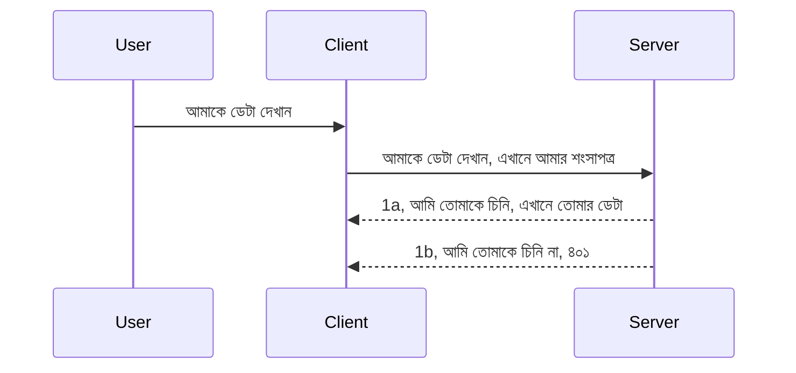

# Simple auth

MCP SDKs OAuth 2.1 ব্যবহারের সমর্থন করে যা একজন সত্যিকার অর্থে জটিল প্রক্রিয়া যার মধ্যে রয়েছে auth সার্ভার, resource সার্ভার, credential পোস্ট করা, একটি কোড পাওয়া, সেই কোডের বিনিময়ে bearer token নেওয়া যতক্ষণ না আপনি অবশেষে আপনার resource ডেটা পেতে পারেন। আপনি যদি OAuth-এ অভ্যস্ত না হন যা বাস্তবায়নের জন্য একটি দুর্দান্ত বিষয়, তবে মৌলিক স্তরের auth দিয়ে শুরু করা এবং ক্রমাগত উন্নত সুরক্ষা গড়ে তোলা একটি ভাল ধারণা। এই কারণেই এই অধ্যায়টি আছে, আপনাকে আরও উন্নত auth-এ উন্নীত করার জন্য।

## Auth, আমরা কী বুঝাই?

Auth হলো authentication এবং authorization এর সংক্ষিপ্ত রূপ। ধারণাটি হলো আমাদের দুইটি কাজ করতে হবে:

- **Authentication**, যা হল এই প্রক্রিয়া নির্ধারণ করার জন্য যে আমরা একজন ব্যক্তিকে আমাদের বাড়িতে প্রবেশের অনুমতি দিই কিনা, তারা "এখানে" আসার অধিকার রাখে কিনা অর্থাৎ আমাদের resource সার্ভারে অ্যাক্সেস রয়েছে যেখানে আমাদের MCP Server ফিচার থাকে।
- **Authorization**, হল এটি নির্ণয় করার প্রক্রিয়া যে একজন ব্যবহারকারী কি নির্দিষ্ট রিসোর্সের জন্য প্রবেশাধিকার থাকা উচিত যা তারা অনুরোধ করছে, উদাহরণস্বরূপ এই অর্ডারগুলি বা এই পণ্যগুলি বা তারা কি কন্টেন্ট পড়তে পারে কিন্তু মুছে ফেলতে পারবে না, অন্য উদাহরণ স্বরূপ।

## Credentials: আমরা কিভাবে সিস্টেমকে বলি আমরা কারা

সাধারণত বেশিরভাগ ওয়েব ডেভেলপাররা ভাবতে শুরু করেন সার্ভারকে একটি credential প্রদান করার কথা, সাধারণত একটি গোপনীয় তথ্য যা বলে তারা এখানে "Authentication" অনুমতি পেয়েছে কিনা। এই credential সাধারণত ব্যবহারকারী নাম এবং পাসওয়ার্ডের একটি base64 এনকোডেড সংস্করণ বা একটি API কী যা একটি নির্দিষ্ট ব্যবহারকারীকে অনন্যভাবে শনাক্ত করে।

এই credential একটি হেডারের মাধ্যমে পাঠানো হয় যার নাম "Authorization" এভাবে:

```json
{ "Authorization": "secret123" }
```

এটি সাধারণত basic authentication হিসাবে পরিচিত। মোট দিকনির্দেশনা নিম্নরূপ কাজ করে:


এখন যখন আমরা একটি ফ্লো দৃষ্টিকোণ থেকে বুঝতে পারি কিভাবে এটি কাজ করে, তাহলে আমরা কিভাবে এটি বাস্তবায়ন করব? বেশিরভাগ ওয়েব সার্ভারে middleware নামে একটি ধারণা থাকে, একটি কোডের অংশ যা রিকুয়েস্টের অংশ হিসেবে চলে এবং credential যাচাই করতে পারে, যদি credential বৈধ হয় তবে রিকুয়েস্টটিকে অনুমতি দেয়া হয়। যদি রিকুয়েস্ট বৈধ credential না থাকে তবে একটি auth ত্রুটি পাওয়া যায়। চলুন দেখি কিভাবে এটি বাস্তবায়িত হতে পারে:

**Python**

```python
class AuthMiddleware(BaseHTTPMiddleware):
    async def dispatch(self, request, call_next):

        has_header = request.headers.get("Authorization")
        if not has_header:
            print("-> Missing Authorization header!")
            return Response(status_code=401, content="Unauthorized")

        if not valid_token(has_header):
            print("-> Invalid token!")
            return Response(status_code=403, content="Forbidden")

        print("Valid token, proceeding...")
       
        response = await call_next(request)
        # যেকোনো গ্রাহক শিরোনাম যোগ করুন বা প্রতিক্রিয়াতে কোনও রকম পরিবর্তন করুন
        return response


starlette_app.add_middleware(CustomHeaderMiddleware)
```

এখানে আমাদের আছে:

- `AuthMiddleware` নামে একটি middleware তৈরি করা হয়েছে যেখানে এর `dispatch` মেথড ওয়েব সার্ভার দ্বারা আহ্বান করা হচ্ছে।
- middleware টিকে ওয়েব সার্ভারে যোগ করা হয়েছে:

    ```python
    starlette_app.add_middleware(AuthMiddleware)
    ```

- একটি ভ্যালিডেশন লজিক লেখা হয়েছে যা যাচাই করে Authorization হেডার উপস্থিত আছে কিনা এবং পাঠানো গোপনীয় তথ্য বৈধ কিনা:

    ```python
    has_header = request.headers.get("Authorization")
    if not has_header:
        print("-> Missing Authorization header!")
        return Response(status_code=401, content="Unauthorized")

    if not valid_token(has_header):
        print("-> Invalid token!")
        return Response(status_code=403, content="Forbidden")
    ```

    যদি গোপনীয় তথ্য উপস্থিত এবং বৈধ হয় তবে আমরা `call_next` কল করে রিকুয়েস্ট পাস করি এবং রেসপন্স ফেরত দিয়ে থাকি।

    ```python
    response = await call_next(request)
    # কোনও গ্রাহক হেডার যুক্ত করুন বা প্রতিক্রিয়ায় কিছু পরিবর্তন করুন
    return response
    ```

কাজ করার পন্থা হল, যদি একটি ওয়েব রিকুয়েস্ট সার্ভারের প্রতি করা হয় middleware চালানো হবে এবং তার বাস্তবায়নের উপর নির্ভর করে এটি হয় রিকুয়েস্টকে পার পাস করবে অথবা একটি ত্রুটি ফেরত দেবে যা ক্লায়েন্টকে জানাবে যে এগিয়ে যাওয়ার অনুমতি নেই।

**TypeScript**

এখানে আমরা জনপ্রিয় Express ফ্রেমওয়ার্ক দিয়ে middleware তৈরি করব এবং MCP Server পৌঁছানোর আগেই রিকুয়েস্ট আটকাব। এর জন্য কোড নিচে:

```typescript
function isValid(secret) {
    return secret === "secret123";
}

app.use((req, res, next) => {
    // 1. অথোরাইজেশন হেডার উপস্থিত আছে?
    if(!req.headers["Authorization"]) {
        res.status(401).send('Unauthorized');
    }
    
    let token = req.headers["Authorization"];

    // 2. বৈধতা পরীক্ষা করুন।
    if(!isValid(token)) {
        res.status(403).send('Forbidden');
    }

   
    console.log('Middleware executed');
    // 3. রিকোয়েস্ট পাইলাইনের পরবর্তী ধাপে রিকোয়েস্টটি পাঠায়।
    next();
});
```

এই কোডে আমরা:

1. প্রথমেই যাচাই করি Authorization হেডার আছে কি না, যদি না থাকে তবে 401 ত্রুটি পাঠাই।
2. যাচাই করি credential/token বৈধ কিনা, যদি না হয় তবে 403 ত্রুটি পাঠাই।
3. অবশেষে রিকুয়েস্ট পাইপলাইনে রিকুয়েস্ট চালিয়ে দিয়ে চাওয়া রিসোর্স ফেরত দেই।

## অনুশীলন: Authentication বাস্তবায়ন

চলুন আমাদের জ্ঞান নিয়ে চেষ্টা করি এটি বাস্তবায়ন করতে। পরিকল্পনাটি হলো:

Server

- একটি ওয়েব সার্ভার এবং MCP instance তৈরি করা।
- সার্ভারের জন্য একটি middleware বাস্তবায়ন করা।

Client

- credential সহ হেডারের মাধ্যমে ওয়েব রিকুয়েস্ট পাঠানো।

### -1- একটি ওয়েব সার্ভার এবং MCP instance তৈরি করুন

আমাদের প্রথম ধাপে, আমাদের একটি ওয়েব সার্ভার instance এবং MCP Server তৈরি করতে হবে।

**Python**

এখানে আমরা একটি MCP server instance তৈরি করি, একটি starlette ওয়েব অ্যাপ তৈরি করি এবং uvicorn দিয়ে হোস্ট করি।

```python
# MCP সার্ভার তৈরি করা হচ্ছে

app = FastMCP(
    name="MCP Resource Server",
    instructions="Resource Server that validates tokens via Authorization Server introspection",
    host=settings["host"],
    port=settings["port"],
    debug=True
)

# স্টারলেট ওয়েব অ্যাপ তৈরি করা হচ্ছে
starlette_app = app.streamable_http_app()

# uvicorn এর মাধ্যমে অ্যাপ সার্ভ করা হচ্ছে
async def run(starlette_app):
    import uvicorn
    config = uvicorn.Config(
            starlette_app,
            host=app.settings.host,
            port=app.settings.port,
            log_level=app.settings.log_level.lower(),
        )
    server = uvicorn.Server(config)
    await server.serve()

run(starlette_app)
```

এই কোডে আমরা:

- MCP Server তৈরি করেছি।
- MCP Server থেকে starlette ওয়েব অ্যাপ তৈরি করেছি, `app.streamable_http_app()`।
- uvicorn দিয়ে ওয়েব অ্যাপ হোস্ট এবং সার্ভ করেছি `server.serve()`।

**TypeScript**

এখানে আমরা একটি MCP Server instance তৈরি করছি।

```typescript
const server = new McpServer({
      name: "example-server",
      version: "1.0.0"
    });

    // ... সার্ভার রিসোর্স, সরঞ্জাম, এবং প্রম্পট সেট আপ করুন ...
```

এই MCP Server তৈরি POST /mcp রুট ডেফিনিশনের মধ্যে হওয়া দরকার, তাই উপরের কোড নেয়া হচ্ছে এবং এভাবে সরানো হচ্ছে:

```typescript
import express from "express";
import { randomUUID } from "node:crypto";
import { McpServer } from "@modelcontextprotocol/sdk/server/mcp.js";
import { StreamableHTTPServerTransport } from "@modelcontextprotocol/sdk/server/streamableHttp.js";
import { isInitializeRequest } from "@modelcontextprotocol/sdk/types.js"

const app = express();
app.use(express.json());

// সেশন আইডি দ্বারা পরিবহন সংরক্ষণের মানচিত্র
const transports: { [sessionId: string]: StreamableHTTPServerTransport } = {};

// ক্লায়েন্ট-টু-সার্ভার যোগাযোগের জন্য POST অনুরোধগুলি পরিচালনা করুন
app.post('/mcp', async (req, res) => {
  // বিদ্যমান সেশন আইডি পরীক্ষা করুন
  const sessionId = req.headers['mcp-session-id'] as string | undefined;
  let transport: StreamableHTTPServerTransport;

  if (sessionId && transports[sessionId]) {
    // বিদ্যমান পরিবহন পুনঃব্যবহার করুন
    transport = transports[sessionId];
  } else if (!sessionId && isInitializeRequest(req.body)) {
    // নতুন প্রাথমিককরণ অনুরোধ
    transport = new StreamableHTTPServerTransport({
      sessionIdGenerator: () => randomUUID(),
      onsessioninitialized: (sessionId) => {
        // সেশন আইডি দ্বারা পরিবহন সংরক্ষণ করুন
        transports[sessionId] = transport;
      },
      // DNS রিবাইন্ডিং সুরক্ষা পূর্ববর্তী সামঞ্জস্যতার জন্য অনির্ধারিতভাবে অক্ষম থাকে। আপনি যদি এই সার্ভারটি
      // লোকালি চালান, নিশ্চিত করুন নির্ধারণ করতে:
      // enableDnsRebindingProtection: true,
      // allowedHosts: ['127.0.0.1'],
    });

    // বন্ধ করার সময় পরিবহন পরিষ্কার করুন
    transport.onclose = () => {
      if (transport.sessionId) {
        delete transports[transport.sessionId];
      }
    };
    const server = new McpServer({
      name: "example-server",
      version: "1.0.0"
    });

    // ... সার্ভার সম্পদ, সরঞ্জাম এবং প্রম্পট প্রস্তুত করুন ...

    // MCP সার্ভারের সাথে সংযোগ স্থাপন করুন
    await server.connect(transport);
  } else {
    // অবৈধ অনুরোধ
    res.status(400).json({
      jsonrpc: '2.0',
      error: {
        code: -32000,
        message: 'Bad Request: No valid session ID provided',
      },
      id: null,
    });
    return;
  }

  // অনুরোধ পরিচালনা করুন
  await transport.handleRequest(req, res, req.body);
});

// GET এবং DELETE অনুরোধের জন্য পুনঃব্যবহারযোগ্য হ্যান্ডলার
const handleSessionRequest = async (req: express.Request, res: express.Response) => {
  const sessionId = req.headers['mcp-session-id'] as string | undefined;
  if (!sessionId || !transports[sessionId]) {
    res.status(400).send('Invalid or missing session ID');
    return;
  }
  
  const transport = transports[sessionId];
  await transport.handleRequest(req, res);
};

// সার্ভার-টু-ক্লায়েন্ট বিজ্ঞপ্তির জন্য SSE মাধ্যমে GET অনুরোধ পরিচালনা করুন
app.get('/mcp', handleSessionRequest);

// সেশন সমাপ্তির জন্য DELETE অনুরোধ পরিচালনা করুন
app.delete('/mcp', handleSessionRequest);

app.listen(3000);
```

এখন আপনি দেখতে পাচ্ছেন MCP Server তৈরি করা হয়েছে `app.post("/mcp")` এর ভিতরে।

চলুন middleware তৈরির পরবর্তী ধাপে যাই যাতে আসা credential যাচাই করতে পারি।

### -2- সার্ভারের জন্য middleware বাস্তবায়ন

পরবর্তী middleware অংশে যাই। এখানে আমরা একটি middleware তৈরি করব যা `Authorization` হেডারে credentials খুঁজবে এবং যাচাই করবে। যদি গ্রহণযোগ্য হয়, তাহলে রিকুয়েস্ট যা দরকার করবে (যেমন টুল লিস্ট করা, কোনো রিসোর্স পড়া বা যেকোন MCP ফাংশনালিটি যা ক্লায়েন্ট চেয়েছিল) সেগুলো করবে।

**Python**

middleware তৈরি করতে আমরা `BaseHTTPMiddleware` থেকে উত্তরাধিকারসূত্রে প্রাপ্ত একটি ক্লাস তৈরি করব। এখানে দুটি গুরুত্বপূর্ণ অংশ:

- রিকুয়েস্ট `request` , যার থেকে আমরা হেডার তথ্য পড়ব।
- `call_next` কলব্যাক যা আমরা কল করব যদি ক্লায়েন্ট একটি গ্রহণযোগ্য credential নিয়ে আসে।

প্রথমে, যদি `Authorization` হেডার অনুপস্থিত থাকে তা হ্যান্ডেল করতে হবে:

```python
has_header = request.headers.get("Authorization")

# কোন হেডার উপস্থিত নেই, ৪০১ ত্রুটিতে ব্যর্থ হবে, অন্যথায় চালিয়ে যাবে।
if not has_header:
    print("-> Missing Authorization header!")
    return Response(status_code=401, content="Unauthorized")
```

এখানে আমরা 401 unauthorized বার্তা পাঠাচ্ছি কারণ ক্লায়েন্ট authentication এ ব্যর্থ হচ্ছে।

পরবর্তীতে, যদি credential জমা দেওয়া হয়, তার বৈধতা যাচাই করতে হবে এভাবে:

```python
 if not valid_token(has_header):
    print("-> Invalid token!")
    return Response(status_code=403, content="Forbidden")
```

উপরের কোডে আমরা 403 forbidden বার্তা পাঠাচ্ছি। নিচে পুরো middleware দেখা যাক যা আমরা আগের সব কথা বাস্তবায়ন করলাম:

```python
class AuthMiddleware(BaseHTTPMiddleware):
    async def dispatch(self, request, call_next):

        has_header = request.headers.get("Authorization")
        if not has_header:
            print("-> Missing Authorization header!")
            return Response(status_code=401, content="Unauthorized")

        if not valid_token(has_header):
            print("-> Invalid token!")
            return Response(status_code=403, content="Forbidden")

        print("Valid token, proceeding...")
        print(f"-> Received {request.method} {request.url}")
        response = await call_next(request)
        response.headers['Custom'] = 'Example'
        return response

```

দারুণ, কিন্তু `valid_token` ফাংশনটা কী? এখানে এটি:

```python
# প্রোডাকশনের জন্য ব্যবহার করবেন না - এটি উন্নত করুন !!
def valid_token(token: str) -> bool:
    # "Bearer " প্রিফিক্সটি সরান
    if token.startswith("Bearer "):
        token = token[7:]
        return token == "secret-token"
    return False
```

এটি অবশ্যই উন্নত হওয়া উচিত।

[!IMPORTANT] আপনাকে কখনো কোডে এরকম গোপনীয় তথ্য রাখা উচিত নয়। এটি তুলনা করার জন্য একটি ডেটা সোর্স থেকে বা কোনো IDP (identity service provider) থেকে মানটি গ্রহণ করা উচিত, অথবা ভাল হয় IDP নিজে যাচাই করে।

**TypeScript**

Express দিয়ে এটি বাস্তবায়নের জন্য আমাদের `use` মেথড কল করতে হবে যা middleware ফাংশন নেয়।

আমাদের দরকার:

- রিকুয়েস্ট ভেরিয়েবল থেকে `Authorization` প্রপার্টিতে পাঠানো credential পরীক্ষা করা।
- credential যাচাই করা এবং যদি বৈধ হয় তাহলে রিকুয়েস্ট আর এগিয়ে যেতে দেয়া যাতে ক্লায়েন্টের MCP রিকুয়েস্ট যা চাইবে যথাযথ কাজ করে (যেমন টুল লিস্ট করা, রিসোর্স পড়া বা অন্য MCP সম্পর্কিত কিছু)।

এখানে আমরা যাচাই করছি `Authorization` হেডার আছে কিনা, যদি না থাকে, আমরা রিকুয়েস্ট রোধ করছি:

```typescript
if(!req.headers["authorization"]) {
    res.status(401).send('Unauthorized');
    return;
}
```

যদি হেডার প্রথম থেকেই না পাঠানো হয়, আপনি 401 পাবেন।

পরবর্তীতে, আমরা যাচাই করছি credential বৈধ কিনা, যদি না হয় আবার রিকুয়েস্ট বন্ধ করছি একটু ভিন্ন বার্তা দিয়ে:

```typescript
if(!isValid(token)) {
    res.status(403).send('Forbidden');
    return;
} 
```

এবার আপনি 403 ত্রুটি পাবেন।

এখানে পুরো কোড:

```typescript
app.use((req, res, next) => {
    console.log('Request received:', req.method, req.url, req.headers);
    console.log('Headers:', req.headers["authorization"]);
    if(!req.headers["authorization"]) {
        res.status(401).send('Unauthorized');
        return;
    }
    
    let token = req.headers["authorization"];

    if(!isValid(token)) {
        res.status(403).send('Forbidden');
        return;
    }  

    console.log('Middleware executed');
    next();
});
```

আমরা ওয়েব সার্ভার সেট করেছি যাতে middleware গ্রহণ করে credential যাচাই করার জন্য যা ক্লায়েন্ট সম্ভবত আমাদের পাঠাচ্ছে। ক্লায়েন্ট কেমন হবে?

### -3- credential সহ হেডারের মাধ্যমে ওয়েব রিকুয়েস্ট পাঠান

আমাদের নিশ্চিত করতে হবে ক্লায়েন্ট credential হেডারের মাধ্যমে পাঠাচ্ছে। আমরা MCP ক্লায়েন্ট ব্যবহার করব, তাই জানতে হবে কিভাবে করা হয়।

**Python**

ক্লায়েন্টের জন্য, credential সহ হেডার পাঠাতে হবে এভাবে:

```python
# মানটি হার্ডকোড করবেন না, এটি কমপক্ষে একটি পরিবেশ ভেরিয়েবল বা আরও সুরক্ষিত স্টোরেজে রাখুন
token = "secret-token"

async with streamablehttp_client(
        url = f"http://localhost:{port}/mcp",
        headers = {"Authorization": f"Bearer {token}"}
    ) as (
        read_stream,
        write_stream,
        session_callback,
    ):
        async with ClientSession(
            read_stream,
            write_stream
        ) as session:
            await session.initialize()
      
            # TODO, ক্লায়েন্টে আপনি কী করতে চান, যেমন টুলগুলি তালিকা করা, টুল কল করা ইত্যাদি।
```

এখানে লক্ষ্য করুন আমরা `headers` প্রপার্টি এভাবে পূরণ করছি ` headers = {"Authorization": f"Bearer {token}"}`।

**TypeScript**

আমরা এটি দুই ধাপে করতে পারি:

1. একটি configuration অবজেক্ট তৈরি করা এবং আমাদের credential সেখানে রাখা।
2. সেই configuration অবজেক্ট ট্রান্সপোর্টে পাস করা।

```typescript

// এখানে দেখানো মতো মানটি সরাসরি কোডে লিখবেন না। সর্বনিম্ন এটিকে একটি পরিবেশ ভেরিয়েবল হিসাবে রাখুন এবং ডেভ মোডে dotenv-এর মতো কিছু ব্যবহার করুন।
let token = "secret123"

// একটি ক্লায়েন্ট ট্রান্সপোর্ট অপশন অবজেক্ট সংজ্ঞায়িত করুন
let options: StreamableHTTPClientTransportOptions = {
  sessionId: sessionId,
  requestInit: {
    headers: {
      "Authorization": "secret123"
    }
  }
};

// অপশন অবজেক্টটি ট্রান্সপোর্টে পাস করুন
async function main() {
   const transport = new StreamableHTTPClientTransport(
      new URL(serverUrl),
      options
   );
```

এখানে আপনি দেখতে পাচ্ছেন কীভাবে একটি `options` অবজেক্ট তৈরি করেছি এবং হেডারগুলি `requestInit` প্রপার্টির অধীনে রেখেছি।

[!IMPORTANT] এখান থেকে আমরা কিভাবে উন্নত করব? বর্তমান বাস্তবায়নে কিছু সমস্যা আছে। প্রথমে, credential এর মতো তথ্য এভাবে পাঠানো ঝুঁকিপূর্ণ যদি না HTTPS থাকে। এমনকি তখন ও credential চুরি হতে পারে তাই একটি সিস্টেম দরকার যেখানে টোকেন প্রত্যাহার করা যায় এবং অতিরিক্ত পরীক্ষা থাকে যেমন কোথা থেকে আসছে, রিকুয়েস্ট খুব ঘন ঘন হচ্ছে কিনা (বট মত আচরণ), সংক্ষেপে অনেক ধরনের উদ্বেগ রয়েছে।

তবে এটি বলা উচিত যে, খুব সাধারণ API এর জন্য যেখানে আপনি চান না কেউ অনুমোদন ছাড়া আপনার API কল করুক, এখানে যা আছে তা একটি ভাল শুরু।

এই কথাগুলো বলার পর, চলুন নিরাপত্তা কিছুটা বাড়াই JSON Web Token (JWT) বা "JOT" টোকেনের মত একটি স্ট্যান্ডার্ডাইজড ফরম্যাট ব্যবহার করে।

## JSON Web Tokens, JWT

সুতরাং, আমরা খুব সাধারণ credential পাঠানো থেকে উন্নতি করার চেষ্টা করছি। JWT গ্রহণ করার তাৎক্ষণিক উপকারিতা কি?

- **নিরাপত্তা উন্নতি**। basic auth এ আপনি ব্যবহারকারী নাম এবং পাসওয়ার্ড বার বার base64 এনকোডেড টোকেন হিসেবে পাঠান (অথবা API কী পাঠান) যা ঝুঁকি বাড়ায়। JWT এ আপনি ব্যবহারকারী নাম ও পাসওয়ার্ড পাঠান এবং একটি টোকেন পান যা সময়সীমাবদ্ধ অর্থাৎ মেয়াদ শেষ হয়। JWT আপনাকে রোল, স্কোপ এবং অনুমতিসহ সূক্ষ্ম পর্যায়ক্রমিক নিয়ন্ত্রণ ব্যবস্থার সাহায্য দেয়।
- **Statelessness এবং scalability**। JWT স্বয়ংসম্পূর্ণ, এতে ব্যবহারকারীর সমস্ত তথ্য থাকে এবং সার্ভার সাইড সেশন স্টোরেজ প্রয়োজনীয়তা কমিয়ে দেয়। টোকেন স্থানীয়ভাবে যাচাই করা যায়।
- **Interoperability এবং federation**। JWT Open ID Connect এর কেন্দ্র এবং Entra ID, Google Identity ও Auth0 এর মত পরিচিত পরিচয় প্রদানকারীসহ ব্যবহৃত হয়। এছাড়াও এটি সিঙ্গেল সাইন-অন এবং অন্যান্য উন্নত বিষয়ক সমর্থন দেয় যা এটিকে এন্টারপ্রাইজ-গ্রেড করে তোলে।
- **মডুলারিটি এবং নমনীয়তা**। JWT API Gateways যেমন Azure API Management, NGINX ইত্যাদির সঙ্গে ব্যবহার করা যায়। এটি ব্যবহারকারী প্রমাণীকরণ এবং সার্ভার-টু-সার্ভিস যোগাযোগ সহ ছদ্মবেশ ও ডেলিগেশন মাধ্যমেও সাহায্য করে।
- **পারফরম্যান্স এবং ক্যাশিং**। JWT ডিকোড করার পরে ক্যাশ করা যায় যা পার্সিং এর প্রয়োজন কমায়। এটি উচ্চ ট্রাফিক অ্যাপ্লিকেশনগুলোর জন্য সাহায্য করে কারণ এটি থ্রুপুট উন্নত করে এবং অবকাঠামোর লোড কমায়।
- **অগ্রগামী ফিচারসমূহ**। এটি introspection (সার্ভারে বৈধতা যাচাই) এবং revocation (টোকেন অবৈধ করা) সমর্থন করে।

এই সব সুবিধাসমূহ নিয়ে আসুন দেখি আমাদের বাস্তবায়ন কিভাবে আরও উন্নত করা যায়।

## Basic auth কে JWT তে রূপান্তরিত করা

সুতরাং, আমাদের করতে হবে:

- **JWT টোকেন তৈরি করা** এবং ক্লায়েন্ট থেকে সার্ভারে পাঠানোর জন্য প্রস্তুত করা।
- **JWT টোকেন যাচাই করা**, এবং যদি বৈধ হয়, ক্লায়েন্টকে রিসোর্স অ্যাক্সেস দেওয়া।
- **টোকেন সুরক্ষিত সংরক্ষণ**। টোকেন কোথায় এবং কিভাবে সংরক্ষণ করব।
- **রুট সুরক্ষা**। আমাদের রুটগুলিকে সুরক্ষিত করতে হবে, বিশেষ MCP ফিচার ও রুট সুরক্ষা।
- **রিফ্রেশ টোকেন যোগ করা**। গড়ে তুলতে হবে সাময়িক টোকেন এবং দীর্ঘমেয়াদি রিফ্রেশ টোকেন যা মেয়াদ শেষ হলে নতুন টোকেন পেতে ব্যবহৃত হবে। রিফ্রেশ এন্ডপয়েন্ট ও রোটেশন কৌশল থাকতে হবে।

### -1- JWT টোকেন তৈরি করা

প্রথমত, একটি JWT টোকেনের নিম্নলিখিত অংশ থাকে:

- **header**, ব্যবহৃত অ্যালগরিদম এবং টোকেনের টাইপ।
- **payload**, ক্লেইমস, যেমন sub (ব্যবহারকারী বা যাকে টোকেন প্রতিনিধিত্ব করে, auth সিচুয়েশনে সাধারণত userid), exp (মেয়াদ শেষের সময়), role (রোল)
- **signature**, একটি সিক্রেট বা প্রাইভেট কী দিয়ে স্বাক্ষরিত।

এর জন্য আমাদের header, payload তৈরি করে এনকোডেড টোকেন তৈরি করতে হবে।

**Python**

```python

import jwt
import jwt
from jwt.exceptions import ExpiredSignatureError, InvalidTokenError
import datetime

# JWT সাইন করার জন্য ব্যবহৃত প্রাইভেট কী
secret_key = 'your-secret-key'

header = {
    "alg": "HS256",
    "typ": "JWT"
}

# ব্যবহারকারীর তথ্য এবং এর দাবিসমূহ ও মেয়াদ উত্তীর্ণ সময়
payload = {
    "sub": "1234567890",               # বিষয় (ব্যবহারকারীর আইডি)
    "name": "User Userson",                # কাস্টম দাবি
    "admin": True,                     # কাস্টম দাবি
    "iat": datetime.datetime.utcnow(),# জারি করা সময়
    "exp": datetime.datetime.utcnow() + datetime.timedelta(hours=1)  # মেয়াদ উত্তীর্ণ
}

# এটি এনকোড করুন
encoded_jwt = jwt.encode(payload, secret_key, algorithm="HS256", headers=header)
```

উপরের কোডে আমরা:

- HS256 অ্যালগরিদম এবং JWT টাইপ দিয়ে header সংজ্ঞায়িত করেছি।
- একটি payload তৈরি করেছি যাতে সাবজেক্ট বা user id, ইউজারনেম, রোল, কখন ইস্যু হয়েছে এবং কখন মেয়াদ শেষ হবে তার তারিখ রয়েছে যা সময়সীমাবদ্ধতা বাস্তবায়ন করে।

**TypeScript**

এখানে আমাদের কিছু dependencies লাগবে যা JWT টোকেন গঠন সাহায্য করবে।

Dependencies

```sh

npm install jsonwebtoken
npm install --save-dev @types/jsonwebtoken
```

এখন যা হয়েছে, চলুন header, payload তৈরি করি এবং এনকোডেড টোকেন তৈরি করি।

```typescript
import jwt from 'jsonwebtoken';

const secretKey = 'your-secret-key'; // প্রোডাকশন-এ পরিবেশ ভেরিয়েবল ব্যবহার করুন

// পেলোড নির্ধারণ করুন
const payload = {
  sub: '1234567890',
  name: 'User usersson',
  admin: true,
  iat: Math.floor(Date.now() / 1000), // ইস্যু হয়েছে
  exp: Math.floor(Date.now() / 1000) + 60 * 60 // ১ ঘন্টা পরে মেয়াদ উত্তীর্ণ হবে
};

// হেডার নির্ধারণ করুন (ঐচ্ছিক, jsonwebtoken ডিফল্ট সেট করে)
const header = {
  alg: 'HS256',
  typ: 'JWT'
};

// টোকেন তৈরি করুন
const token = jwt.sign(payload, secretKey, {
  algorithm: 'HS256',
  header: header
});

console.log('JWT:', token);
```

এই টোকেন হল:

HS256 ব্যবহার করে স্বাক্ষরিত
১ ঘণ্টা সময়সীমার বৈধতা
sub, name, admin, iat, এবং exp মত ক্লেইমস অন্তর্ভুক্ত।

### -2- টোকেন যাচাই করা

আমাদের টোকেন যাচাই করতেও হবে, এটা সার্ভারে করা উচিত যাতে নিশ্চিত হওয়া যায় ক্লায়েন্ট যা পাঠাচ্ছে তা প্রকৃতপক্ষে বৈধ। অনেক যাচাই করার বিষয় আছে যেমন গঠন যাচাই, বৈধতা ইত্যাদি। আরও পরীক্ষা যোগ করতে উৎসাহিত, যেন নিশ্চিত হয় ব্যবহারকারী আমাদের সিস্টেমে আছে এবং তার দাবিকৃত অধিকার রয়েছে।

টোকেন যাচাই করার জন্য প্রথমে কোড থেকে ডিকোড করতে হবে যাতে পড়া যায় এবং তা যাচাই শুরু করতে পারে:

**Python**

```python

# JWT ডিকোড এবং যাচাই করুন
try:
    decoded = jwt.decode(token, secret_key, algorithms=["HS256"])
    print("✅ Token is valid.")
    print("Decoded claims:")
    for key, value in decoded.items():
        print(f"  {key}: {value}")
except ExpiredSignatureError:
    print("❌ Token has expired.")
except InvalidTokenError as e:
    print(f"❌ Invalid token: {e}")

```

এই কোডে আমরা `jwt.decode` কল করছি টোকেন, সিক্রেট কী এবং অ্যালগরিদম দিয়ে। লক্ষ্য করুন try-catch ব্যবহার করা হয়েছে কারণ ব্যর্থ যাচাইতে ত্রুটি উঠে।

**TypeScript**

এখানে `jwt.verify` কল করা হবে যা ফিরিয়ে দেয় টোকেনের ডিকোডেড সংস্করণ যা বিশ্লেষণ করা যাবে। ব্যর্থ হলে টোকেনের গঠন ভুল বা বৈধ নয়।

```typescript

try {
  const decoded = jwt.verify(token, secretKey);
  console.log('Decoded Payload:', decoded);
} catch (err) {
  console.error('Token verification failed:', err);
}
```

[!NOTE] যেমন আগে বলা হয়েছে, অতিরিক্ত যাচাই করা উচিত যেন নিশ্চিত হয় এই টোকেন আমাদের সিস্টেমের ব্যবহারকারী নির্দেশ করে এবং ব্যবহারকারীর দাবি করা অধিকার রয়েছে।

পরবর্তী, চলুন পদভিত্তিক অ্যাক্সেস নিয়ন্ত্রণ বা RBAC নিয়ে আলোচনা করি।
## রোল ভিত্তিক অ্যাক্সেস নিয়ন্ত্রণ যোগ করা

ধারণাটি হল আমরা প্রকাশ করতে চাই যে বিভিন্ন ভূমিকার বিভিন্ন অনুমতি রয়েছে। উদাহরণস্বরূপ, আমরা ধরে নিই যে একজন অ্যাডমিন সবকিছু করতে পারে এবং একটি সাধারণ ব্যবহারকারী পড়া/লিখতে পারে এবং একজন অতিথি কেবল পড়তে পারে। তাই, এখানে কিছু সম্ভাব্য অনুমতি স্তর রয়েছে:

- Admin.Write 
- User.Read
- Guest.Read

চলুন দেখি আমরা কিভাবে মধ্য়স্থতা দিয়ে (middleware) এমন একটি নিয়ন্ত্রণ বাস্তবায়ন করতে পারি। মধ্য়স্থতাগুলি প্রতি রুটে বা সব রুটের জন্য যোগ করা যেতে পারে।

**Python**

```python
from starlette.middleware.base import BaseHTTPMiddleware
from starlette.responses import JSONResponse
import jwt

# কোডে সিক্রেট রাখবেন না, এটি শুধুমাত্র প্রদর্শনের জন্য। এটি একটি নিরাপদ স্থান থেকে পড়ুন।
SECRET_KEY = "your-secret-key" # এটি env ভেরিয়েবলে রাখুন।
REQUIRED_PERMISSION = "User.Read"

class JWTPermissionMiddleware(BaseHTTPMiddleware):
    async def dispatch(self, request, call_next):
        auth_header = request.headers.get("Authorization")
        if not auth_header or not auth_header.startswith("Bearer "):
            return JSONResponse({"error": "Missing or invalid Authorization header"}, status_code=401)

        token = auth_header.split(" ")[1]
        try:
            decoded = jwt.decode(token, SECRET_KEY, algorithms=["HS256"])
        except jwt.ExpiredSignatureError:
            return JSONResponse({"error": "Token expired"}, status_code=401)
        except jwt.InvalidTokenError:
            return JSONResponse({"error": "Invalid token"}, status_code=401)

        permissions = decoded.get("permissions", [])
        if REQUIRED_PERMISSION not in permissions:
            return JSONResponse({"error": "Permission denied"}, status_code=403)

        request.state.user = decoded
        return await call_next(request)


```

নীচের মতো middleware যোগ করার কয়েকটি ভিন্ন উপায় রয়েছে:

```python

# বিকল্প ১: স্টারলেট অ্যাপ তৈরি করার সময় মিডলওয়্যার যোগ করুন
middleware = [
    Middleware(JWTPermissionMiddleware)
]

app = Starlette(routes=routes, middleware=middleware)

# বিকল্প ২: স্টারলেট অ্যাপ ইতিমধ্যে তৈরি হওয়ার পরে মিডলওয়্যার যোগ করুন
starlette_app.add_middleware(JWTPermissionMiddleware)

# বিকল্প ৩: প্রতি রুটে মিডলওয়্যার যোগ করুন
routes = [
    Route(
        "/mcp",
        endpoint=..., # হ্যান্ডলার
        middleware=[Middleware(JWTPermissionMiddleware)]
    )
]
```

**TypeScript**

আমরা `app.use` ব্যবহার করতে পারি এবং একটি middleware যা সব রিকোয়েস্টে চালু হবে।

```typescript
app.use((req, res, next) => {
    console.log('Request received:', req.method, req.url, req.headers);
    console.log('Headers:', req.headers["authorization"]);

    // 1. যাচাই করুন অনুমোদন হেডার পাঠানো হয়েছে কিনা

    if(!req.headers["authorization"]) {
        res.status(401).send('Unauthorized');
        return;
    }
    
    let token = req.headers["authorization"];

    // 2. যাচাই করুন টোকেনটি বৈধ কিনা
    if(!isValid(token)) {
        res.status(403).send('Forbidden');
        return;
    }  

    // 3. যাচাই করুন টোকেন ব্যবহারকারী আমাদের সিস্টেমে উপস্থিত আছে কিনা
    if(!isExistingUser(token)) {
        res.status(403).send('Forbidden');
        console.log("User does not exist");
        return;
    }
    console.log("User exists");

    // 4. যাচাই করুন টোকেনের সঠিক অনুমতি রয়েছে কিনা
    if(!hasScopes(token, ["User.Read"])){
        res.status(403).send('Forbidden - insufficient scopes');
    }

    console.log("User has required scopes");

    console.log('Middleware executed');
    next();
});

```

আমাদের middleware এ অনেক কিছু রাখতে পারি এবং যা আমাদের middleware অবশ্যই করা উচিত, যথা:

1. চেক করা যে authorization header উপস্থিত আছে কি না
2. চেক করা যে token বৈধ কি না, আমরা `isValid` কল করি যা একটি মেথড যা আমরা লিখেছি এবং JWT টোকেনের অখণ্ডতা ও বৈধতা পরীক্ষা করে।
3. নিশ্চিত করা যে ব্যবহারকারী আমাদের সিস্টেমে বিদ্যমান, এটি পরীক্ষা করা উচিত।

   ```typescript
    // ডাটাবেসে ব্যবহারকারী
   const users = [
     "user1",
     "User usersson",
   ]

   function isExistingUser(token) {
     let decodedToken = verifyToken(token);

     // TODO, ডাটাবেসে ব্যবহারকারী আছে কিনা পরীক্ষা করুন
     return users.includes(decodedToken?.name || "");
   }
   ```

   উপরে, আমরা একটি খুব সাধারণ `users` তালিকা তৈরি করেছি, যা অবশ্যই একটি ডাটাবেসে থাকা উচিত।

4. এছাড়াও, টোকেনের সঠিক অনুমতি আছে কিনা সেটা পরীক্ষা করা উচিত।

   ```typescript
   if(!hasScopes(token, ["User.Read"])){
        res.status(403).send('Forbidden - insufficient scopes');
   }
   ```

   উপরের কোডে middleware থেকে, আমরা চেক করেছি যে টোকেনে User.Read অনুমতি আছে, না থাকলে আমরা ৪০৩ এরর পাঠাই। নিচে হলো `hasScopes` সহায়ক মেথড।

   ```typescript
   function hasScopes(scope: string, requiredScopes: string[]) {
     let decodedToken = verifyToken(scope);
    return requiredScopes.every(scope => decodedToken?.scopes.includes(scope));
  }
   ```

Have a think which additional checks you should be doing, but these are the absolute minimum of checks you should be doing.

Using Express as a web framework is a common choice. There are helpers library when you use JWT so you can write less code.

- `express-jwt`, helper library that provides a middleware that helps decode your token.
- `express-jwt-permissions`, this provides a middleware `guard` that helps check if a certain permission is on the token.

Here's what these libraries can look like when used:

```typescript
const express = require('express');
const jwt = require('express-jwt');
const guard = require('express-jwt-permissions')();

const app = express();
const secretKey = 'your-secret-key'; // put this in env variable

// Decode JWT and attach to req.user
app.use(jwt({ secret: secretKey, algorithms: ['HS256'] }));

// Check for User.Read permission
app.use(guard.check('User.Read'));

// multiple permissions
// app.use(guard.check(['User.Read', 'Admin.Access']));

app.get('/protected', (req, res) => {
  res.json({ message: `Welcome ${req.user.name}` });
});

// Error handler
app.use((err, req, res, next) => {
  if (err.code === 'permission_denied') {
    return res.status(403).send('Forbidden');
  }
  next(err);
});

```

এখন আপনি দেখেছেন middleware কিভাবে authentication এবং authorization এর জন্য ব্যবহার করা যেতে পারে, তবে MCP কীভাবে? এটি কি auth কিভাবে করি তা পরিবর্তন করে? আসুন পরবর্তী অংশে জানি।

### -3- MCP তে RBAC যোগ করা

এখন পর্যন্ত আপনি দেখেছেনmiddleware এর মাধ্যমে কিভাবে RBAC যোগ করা যায়, কিন্তু MCP এর জন্য MCP বৈশিষ্ট্যের উপর ভিত্তি করে RBAC যোগ করার সহজ উপায় নেই, তাহলে আমরা কি করব? ভাল, আমরা এমন কোড যোগ করতে হবে যা চেক করে ক্লায়েন্ট একটি নির্দিষ্ট টুল কল করার অধিকার আছে কিনা:

প্রতি বৈশিষ্ট্যের জন্য RBAC কিভাবে সম্পাদন করবেন তার কয়েকটি বিকল্প রয়েছে, যেমন:

- প্রতিটি টুল, রিসোর্স, প্রম্পট এর জন্য একটি চেক যোগ করুন যেখানে অনুমতির স্তর পরীক্ষা করা প্রয়োজন।

   **python**

   ```python
   @tool()
   def delete_product(id: int):
      try:
          check_permissions(role="Admin.Write", request)
      catch:
        pass # ক্লায়েন্ট অনুমোদন ব্যর্থ হয়েছে, অনুমোদন ত্রুটি উত্তোলন করুন
   ```

   **typescript**

   ```typescript
   server.registerTool(
    "delete-product",
    {
      title: Delete a product",
      description: "Deletes a product",
      inputSchema: { id: z.number() }
    },
    async ({ id }) => {
      
      try {
        checkPermissions("Admin.Write", request);
        // করতে হবে, productService এবং remote entry তে আইডি পাঠাতে হবে
      } catch(Exception e) {
        console.log("Authorization error, you're not allowed");  
      }

      return {
        content: [{ type: "text", text: `Deletected product with id ${id}` }]
      };
    }
   );
   ```


- অ্যাডভান্সড সার্ভার পদ্ধতি ব্যবহার করুন এবং রিকোয়েস্ট হ্যান্ডলার ব্যবহার করুন যাতে চেক করার স্থানগুলো কমিয়ে আনা যায়।

   **Python**

   ```python
   
   tool_permission = {
      "create_product": ["User.Write", "Admin.Write"],
      "delete_product": ["Admin.Write"]
   }

   def has_permission(user_permissions, required_permissions) -> bool:
      # user_permissions: ব্যবহারকারীর থাকা অনুমতিগুলির তালিকা
      # required_permissions: টুলটির জন্য প্রয়োজনীয় অনুমতিগুলির তালিকা
      return any(perm in user_permissions for perm in required_permissions)

   @server.call_tool()
   async def handle_call_tool(
     name: str, arguments: dict[str, str] | None
   ) -> list[types.TextContent]:
    # ধরা যাক request.user.permissions হলো ব্যবহারকারীর অনুমতিগুলির তালিকা
     user_permissions = request.user.permissions
     required_permissions = tool_permission.get(name, [])
     if not has_permission(user_permissions, required_permissions):
        # ত্রুটি তোলুন "আপনার টুল {name} কল করার অনুমতি নেই"
        raise Exception(f"You don't have permission to call tool {name}")
     # চালিয়ে যান এবং টুল কল করুন
     # ...
   ```   
   

   **TypeScript**

   ```typescript
   function hasPermission(userPermissions: string[], requiredPermissions: string[]): boolean {
       if (!Array.isArray(userPermissions) || !Array.isArray(requiredPermissions)) return false;
       // ব্যবহারকারীর কমপক্ষে একটি প্রয়োজনীয় অনুমতি থাকলে সত্য ফেরত দিন
       
       return requiredPermissions.some(perm => userPermissions.includes(perm));
   }
  
   server.setRequestHandler(CallToolRequestSchema, async (request) => {
      const { params: { name } } = request;
  
      let permissions = request.user.permissions;
  
      if (!hasPermission(permissions, toolPermissions[name])) {
         return new Error(`You don't have permission to call ${name}`);
      }
  
      // চালিয়ে যান..
   });
   ```

   নোট করুন, আপনাকে নিশ্চিত করতে হবে যে আপনার middleware ডিকোড করা টোকেন রিকোয়েস্টের user প্রপার্টিতে অ্যাসাইন করে যাতে উপরের কোডটি সহজ হয়।

### সারসংক্ষেপ

এখন আমরা RBAC সাধারণভাবে এবং বিশেষ করে MCP জন্য কিভাবে যোগ করা যায় তা আলোচনা করেছি, এখন আপনার নিজের হাতে সুরক্ষা বাস্তবায়ন করার চেষ্টা করার সময় এসেছে যাতে আপনি উপস্থাপিত ধারণাগুলো বুঝতে পারেন।

## অ্যাসাইনমেন্ট ১: বেসিক অথেনটিকেশন ব্যবহার করে একটি mcp সার্ভার এবং mcp ক্লায়েন্ট তৈরি করুন

এখানে আপনি হেডার মাধ্যমে কিভাবে ক্রেডেনশিয়াল পাঠানো যায় তা শিখবেন।

## সমাধান ১

[সমাধান ১](./code/basic/README.md)

## অ্যাসাইনমেন্ট ২: অ্যাসাইনমেন্ট ১ এর সমাধান আপগ্রেড করে JWT ব্যবহার করুন

প্রথম সমাধানটি নিন তবে এবার চলুন এটি উন্নত করি।

বেসিক অথের পরিবর্তে, চলুন JWT ব্যবহার করি।

## সমাধান ২

[সমাধান ২](./solution/jwt-solution/README.md)

## চ্যালেঞ্জ

"Add RBAC to MCP" অংশে বর্ণিত প্রতিটি টুলের জন্য RBAC যোগ করুন।

## সারাংশ

আপনি আশা করি এই অধ্যায়ে অনেক কিছু শিখেছেন, কোনো সুরক্ষা না থাকা থেকে শুরু করে বেসিক সুরক্ষা, JWT এবং কিভাবে এটি MCP তে যোগ করা যায়।

আমরা কাস্টম JWT দিয়ে একটি মজবুত ভিত্তি তৈরি করেছি, কিন্তু যখন আমরা বড় হই, তখন আমরা একটি মানক-ভিত্তিক পরিচয় মডেলের দিকে এগিয়ে যাচ্ছি। Entra বা Keycloak-এর মতো IdP গ্রহণ করার মাধ্যমে আমরা টোকেন ইস্যু, যাচাই এবং লাইফসাইকেল ব্যবস্থাপনাকে একটি বিশ্বাসযোগ্য প্ল্যাটফর্মে স্থানান্তর করতে পারি — যা আমাদের অ্যাপ্লিকেশন লজিক এবং ব্যবহারকারী অভিজ্ঞতার দিকে মনোযোগ দেয়ার সুযোগ দেয়।

তার জন্য, আমাদের একটি আরও [উন্নত অধ্যায় Entra সম্পর্কে](../../05-AdvancedTopics/mcp-security-entra/README.md) আছে।

## পরবর্তী ধাপ

- পরবর্তী: [MCP হোস্ট সেট আপ করা](../12-mcp-hosts/README.md)

---

<!-- CO-OP TRANSLATOR DISCLAIMER START -->
**অস্বীকারোক্তি**:  
এই ডকুমেন্টটি [Co-op Translator](https://github.com/Azure/co-op-translator) নামক AI অনুবাদ সেবা ব্যবহার করে অনূদিত হয়েছে। আমরা যথাসম্ভব সঠিকতা বজায় রাখার চেষ্টা করি, তবে স্বয়ংক্রিয় অনুবাদে ভুল বা অসঙ্গতি থাকতে পারে। মূল ডকুমেন্টের স্থানীয় ভাষাটি সর্বত্তোম উৎস হিসেবে বিবেচনা করা উচিত। গুরুত্বপূর্ণ তথ্যের জন্য পেশাদার মানব অনুবাদের সুপারিশ করা হয়। এই অনুবাদ ব্যবহারের ফলে উদ্ভূত কোনো ভুল বোঝাবুঝি বা ব্যাখ্যার জন্য আমরা দায়বদ্ধ নই।
<!-- CO-OP TRANSLATOR DISCLAIMER END -->