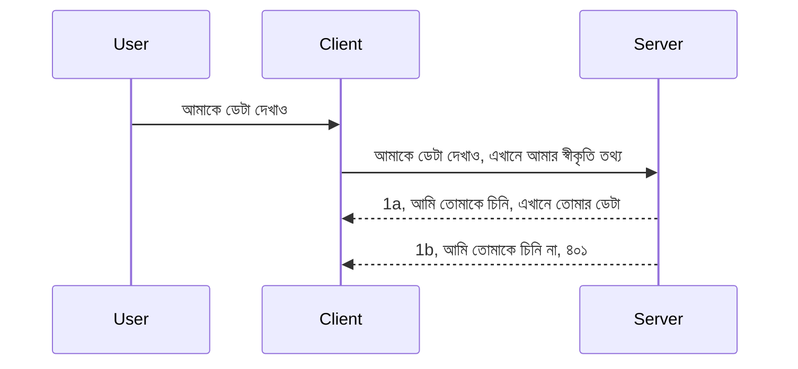

# সহজ প্রমাণীকরণ

MCP SDK গুলো OAuth 2.1 ব্যবহার সমর্থন করে যা সত্যি বলতে একটি জটিল প্রক্রিয়া যা প্রমাণীকরণ সার্ভার, রিসোর্স সার্ভার, শংসাপত্র পোস্ট করা, একটি কোড পাওয়া, কোড পরিবর্তন করে বেয়ার টোকেন পাওয়া পর্যন্ত বিভিন্ন ধারণাকে অন্তর্ভুক্ত করে যতক্ষণ না আপনি অবশেষে আপনার রিসোর্স ডেটা পেতে পারেন। যদি আপনি OAuth এর সাথে অপরিচিত হন যা একটি চমৎকার জিনিস প্রয়োগ করার জন্য, তবে নিম্নমানের প্রমাণীকরণ দিয়ে শুরু করা এবং ধীরে ধীরে উন্নত ও উন্নত সুরক্ষা গড়ে তোলা একটি ভাল ধারণা। এই কারণে এই অধ্যায়টি আছে, যাতে আপনাকে আরো উন্নত প্রমাণীকরণের দিকে নিয়ে যাওয়া যায়।

## প্রমাণীকরণ, আমরা কি বোঝাতে চাই?

প্রমাণীকরণ শব্দটি Authentication এবং Authorization এর সংক্ষিপ্ত রূপ। ধারণাটি হল আমাদের দুটি কাজ করতে হবে:

- **Authentication**, অর্থাৎ এই প্রক্রিয়া যাচাই করা আমরা কি একজন ব্যক্তিকে আমাদের বাড়িতে প্রবেশ করতে দেব, তাদের "এখানে" থাকার অধিকার আছে কিনা, অর্থাৎ আমাদের রিসোর্স সার্ভারে অ্যাক্সেস আছে যেখানে আমাদের MCP সার্ভারের বৈশিষ্ট্যগুলো থাকে।
- **Authorization**, হল এই প্রক্রিয়া যাচাই করা, ব্যবহারকারীকে তারা যে নির্দিষ্ট রিসোর্স চান, যেমন এই অর্ডারগুলো বা এই প্রোডাক্টগুলো, বা তারা কন্টেন্ট পড়তে পারবে কিনা কিন্তু মুছতে পারবে না এই ধরনের অনুমতি দেওয়া হয়েছে কিনা।

## শংসাপত্র: আমরা কিভাবে সিস্টেমকে বলে দি আমরা কে

ঠিক আছে, বেশিরভাগ ওয়েব ডেভেলপার যখন ভাবতে শুরু করেন তখন তারা সাধারণত সের্ভারে একটি শংসাপত্র প্রদান সম্পর্কে চিন্তা করেন, সাধারণত একটি গোপন যা বলে তারা এখানে থাকতে পারবে কিনা "Authentication"। এই শংসাপত্র সাধারণত ইউজারনেম এবং পাসওয়ার্ডের একটি base64 এঙ্কোডেড সংস্করণ অথবা একটি API কী যা একটি নির্দিষ্ট ব্যবহারকারীকে অনন্যভাবে সনাক্ত করে থাকে।

এটি সাধারণত "Authorization" নামক একটি হেডার মাধ্যমে পাঠানো হয়, এরকম:

```json
{ "Authorization": "secret123" }
```

সাধারণত এটিকে basic authentication বলা হয়। সামগ্রিক প্রবাহটি নিম্নরূপ ভাবে কাজ করে:


```mermaid
sequenceDiagram
   participant User
   participant Client
   participant Server

   User->>Client: আমাকে ডেটা দেখাও
   Client->>Server: আমাকে ডেটা দেখাও, এখানে আমার স্বীকৃতি তথ্য
   Server-->>Client: 1a, আমি তোমাকে চিনি, এখানে তোমার ডেটা
   Server-->>Client: 1b, আমি তোমাকে চিনি না, ৪০১ 
```

এখন যেহেতু আমরা বুঝেছি এটি প্রবাহের দৃষ্টিকোণ থেকে কিভাবে কাজ করে, আমরা কিভাবে এটি বাস্তবায়ন করব? বেশিরভাগ ওয়েব সার্ভারে middleware নামক ধারণা থাকে, যেটি রিকোয়েস্ট এর অংশ হিসাবে কোডের একটি অংশ চালায় যা শংসাপত্র যাচাই করতে পারে, এবং যদি শংসাপত্র বৈধ হয় তবে রিকোয়েস্ট পাশ করতে দেয়। যদি রিকোয়েস্টে বৈধ শংসাপত্র না থাকে তবে একটি auth ত্রুটি আসে। চলুন দেখি এটি কিভাবে বাস্তবায়ন করা যেতে পারে:

**Python**

```python
class AuthMiddleware(BaseHTTPMiddleware):
    async def dispatch(self, request, call_next):

        has_header = request.headers.get("Authorization")
        if not has_header:
            print("-> Missing Authorization header!")
            return Response(status_code=401, content="Unauthorized")

        if not valid_token(has_header):
            print("-> Invalid token!")
            return Response(status_code=403, content="Forbidden")

        print("Valid token, proceeding...")
       
        response = await call_next(request)
        # কোনো কাস্টমার হেডার যোগ করুন বা প্রতিক্রিয়ায় কিছু পরিবর্তন করুন
        return response


starlette_app.add_middleware(CustomHeaderMiddleware)
```

এখানে আমাদের আছে:

- একটি middleware তৈরি করা হয়েছে যার নাম `AuthMiddleware` যেখানে এর `dispatch` মেথড ওয়েব সার্ভার দ্বারা আহ্বান করা হয়।
- middleware কে ওয়েব সার্ভারে যুক্ত করা হয়েছে:

    ```python
    starlette_app.add_middleware(AuthMiddleware)
    ```

- শংসাপত্র যাচাই করার লজিক লেখা হয়েছে যা চেক করে Authorization হেডারটি উপস্থিত আছে কিনা এবং প্রেরিত সিক্রেটটি বৈধ কিনা:

    ```python
    has_header = request.headers.get("Authorization")
    if not has_header:
        print("-> Missing Authorization header!")
        return Response(status_code=401, content="Unauthorized")

    if not valid_token(has_header):
        print("-> Invalid token!")
        return Response(status_code=403, content="Forbidden")
    ```

    যদি সিক্রেট উপস্থিত এবং বৈধ হয় তবে আমরা `call_next` কল করে রিকোয়েস্টটা পাশ করতে দিই এবং রেসপন্স রিটার্ন করি।

    ```python
    response = await call_next(request)
    # কোনো গ্রাহক হেডার যোগ করুন বা প্রতিক্রিয়ায় কিছু পরিবর্তন করুন
    return response
    ```

কাজটি হলো, যদি ওয়েব রিকোয়েস্ট সার্ভারের দিকে আসে, middleware কার্যকর হবে এবং তার বাস্তবায়নের উপর ভিত্তি করে রিকোয়েস্ট পাশ করতে দিবে অথবা একটি ত্রুটি রিটার্ন করবে যা ক্লায়েন্টকে জানাবে যে সামনে যাওয়ার অনুমতি নেই।

**TypeScript**

এখানে আমরা জনপ্রিয় ফ্রেমওয়ার্ক Express দিয়ে একটি middleware তৈরি করছি এবং MCP সার্ভারে যাওয়ার আগে রিকোয়েস্টটিকে ইন্টারসেপ্ট করছি। কোডটি এখানে:

```typescript
function isValid(secret) {
    return secret === "secret123";
}

app.use((req, res, next) => {
    // ১। অনুমোদন হেডার আছে কি?
    if(!req.headers["Authorization"]) {
        res.status(401).send('Unauthorized');
    }
    
    let token = req.headers["Authorization"];

    // ২। বৈধতা যাচাই করুন।
    if(!isValid(token)) {
        res.status(403).send('Forbidden');
    }

   
    console.log('Middleware executed');
    // ৩। অনুরোধ পাইপলাইনের পরবর্তী ধাপে অনুরোধ পাঠায়।
    next();
});
```

এই কোডে আমরা:

1. প্রথমে চেক করি Authorization হেডারটি আছে কিনা, না থাকলে 401 এয়ারর পাঠাই।
2. নিশ্চিত করি শংসাপত্র/টোকেনটি বৈধ কিনা, না হলে 403 এয়ারর পাঠাই।
3. অবশেষে রিকোয়েস্ট পাশ করতে দিই এবং চাওয়া রিসোর্স রিটার্ন করি।

## অনুশীলন: প্রমাণীকরণ বাস্তবায়ন করা

আমাদের জ্ঞান নিয়ে চেষ্টা করি এটি বাস্তবায়ন করতে। পরিকল্পনা হলো:

সার্ভার

- একটি ওয়েব সার্ভার ও MCP ইন্সট্যান্স তৈরি করা।
- সার্ভারের জন্য একটি middleware বাস্তবায়ন করা।

ক্লায়েন্ট

- হেডার মাধ্যমে শংসাপত্র সহ ওয়েব রিকোয়েস্ট পাঠানো।

### -1- একটি ওয়েব সার্ভার এবং MCP ইন্সট্যান্স তৈরি করা

> [!WARNING]
> নিচের TypeScript উদাহরণ MCP `2025-11-25` টার্গেট করে। এটি ট্রান্সপোর্ট ট্র্যাক করে
> `mcp-session-id` দ্বারা এবং এটি বর্তমান `2026-07-28` ট্রান্সপোর্ট উদাহরণ নয়। MCP
> `2026-07-28` এ `initialize` হ্যান্ডশেক এবং প্রোটোকল সেশন আইডি সরিয়ে ফেলা হয়েছে; নতুন
> বাস্তবায়নগুলো স্বতন্ত্র রিকোয়েস্ট ব্যবহার করে। দেখুন
> [What's Changed in MCP: The 2026-07-28 Specification](../../01-CoreConcepts/mcp-2026-07-28.md)।

প্রথম ধাপে আমাদের ওয়েব সার্ভার ইন্সট্যান্স ও MCP সার্ভার তৈরি করতে হবে।

**Python**

এখানে আমরা একটি MCP সার্ভার ইন্সট্যান্স তৈরি করেছি, একটি starlette ওয়েব অ্যাপ তৈরি করেছি এবং uvicorn দিয়ে এটি হোস্ট করেছি।

```python
# MCP সার্ভার তৈরি করা হচ্ছে

app = FastMCP(
    name="MCP Resource Server",
    instructions="Resource Server that validates tokens via Authorization Server introspection",
    host=settings["host"],
    port=settings["port"],
    debug=True
)

# স্টারলেট ওয়েব অ্যাপ তৈরি করা হচ্ছে
starlette_app = app.streamable_http_app()

# uvicorn এর মাধ্যমে অ্যাপ সার্ভিং করা হচ্ছে
async def run(starlette_app):
    import uvicorn
    config = uvicorn.Config(
            starlette_app,
            host=app.settings.host,
            port=app.settings.port,
            log_level=app.settings.log_level.lower(),
        )
    server = uvicorn.Server(config)
    await server.serve()

run(starlette_app)
```

এই কোডে আমরা:

- MCP সার্ভার তৈরি করেছি।
- MCP সার্ভার থেকে starlette ওয়েব অ্যাপ তৈরি করেছি, `app.streamable_http_app()`।
- uvicorn ব্যবহার করে ওয়েব অ্যাপ হোস্ট ও সার্ভ করেছি `server.serve()`।

**TypeScript**

এখানে আমরা একটি MCP সার্ভার ইন্সট্যান্স তৈরি করেছি।

```typescript
const server = new McpServer({
      name: "example-server",
      version: "1.0.0"
    });

    // ... সার্ভার রিসোর্স, সরঞ্জাম, এবং প্রম্পট সেট আপ করুন ...
```

এই MCP সার্ভার তৈরি আমাদের POST /mcp রুট ডেফিনিশনের মধ্যে করতে হবে, তাই উপরের কোড নিচের মত সরিয়ে নেই:

```typescript
import express from "express";
import { randomUUID } from "node:crypto";
import { McpServer } from "@modelcontextprotocol/sdk/server/mcp.js";
import { StreamableHTTPServerTransport } from "@modelcontextprotocol/sdk/server/streamableHttp.js";
import { isInitializeRequest } from "@modelcontextprotocol/sdk/types.js"

const app = express();
app.use(express.json());

// সেশন আইডি দ্বারা ট্রান্সপোর্ট সংরক্ষণ করার জন্য মানচিত্র
const transports: { [sessionId: string]: StreamableHTTPServerTransport } = {};

// ক্লায়েন্ট থেকে সার্ভার যোগাযোগের জন্য POST অনুরোধগুলি পরিচালনা করুন
app.post('/mcp', async (req, res) => {
  // বিদ্যমান সেশন আইডি চেক করুন
  const sessionId = req.headers['mcp-session-id'] as string | undefined;
  let transport: StreamableHTTPServerTransport;

  if (sessionId && transports[sessionId]) {
    // বিদ্যমান ট্রান্সপোর্ট পুনরায় ব্যবহার করুন
    transport = transports[sessionId];
  } else if (!sessionId && isInitializeRequest(req.body)) {
    // নতুন 초기করণ অনুরোধ
    transport = new StreamableHTTPServerTransport({
      sessionIdGenerator: () => randomUUID(),
      onsessioninitialized: (sessionId) => {
        // সেশন আইডি দ্বারা ট্রান্সপোর্ট সংরক্ষণ করুন
        transports[sessionId] = transport;
      },
      // বিগত সামঞ্জস্যতা জন্য DNS রিবাইন্ডিং প্রতিরোধ ডিফল্টভাবে নিষ্ক্রিয় থাকে। যদি আপনি এই সার্ভারটি
      // স্থানীয়ভাবে চালাচ্ছেন, নিশ্চিত করুন সেট করতে:
      // enableDnsRebindingProtection: true,
      // allowedHosts: ['127.0.0.1'],
    });

    // বন্ধ হলে ট্রান্সপোর্ট পরিস্কার করুন
    transport.onclose = () => {
      if (transport.sessionId) {
        delete transports[transport.sessionId];
      }
    };
    const server = new McpServer({
      name: "example-server",
      version: "1.0.0"
    });

    // ... সার্ভার সম্পদ, সরঞ্জাম এবং প্রম্পট গঠন করুন ...

    // MCP সার্ভারের সাথে সংযোগ করুন
    await server.connect(transport);
  } else {
    // অবৈধ অনুরোধ
    res.status(400).json({
      jsonrpc: '2.0',
      error: {
        code: -32000,
        message: 'Bad Request: No valid session ID provided',
      },
      id: null,
    });
    return;
  }

  // অনুরোধ পরিচালনা করুন
  await transport.handleRequest(req, res, req.body);
});

// GET এবং DELETE অনুরোধের জন্য পুনঃব্যবহারযোগ্য হ্যান্ডলার
const handleSessionRequest = async (req: express.Request, res: express.Response) => {
  const sessionId = req.headers['mcp-session-id'] as string | undefined;
  if (!sessionId || !transports[sessionId]) {
    res.status(400).send('Invalid or missing session ID');
    return;
  }
  
  const transport = transports[sessionId];
  await transport.handleRequest(req, res);
};

// SSE এর মাধ্যমে সার্ভার-থেকে-ক্লায়েন্ট বিজ্ঞপ্তির জন্য GET অনুরোধগুলি পরিচালনা করুন
app.get('/mcp', handleSessionRequest);

// সেশন সমাপ্তির জন্য DELETE অনুরোধগুলি পরিচালনা করুন
app.delete('/mcp', handleSessionRequest);

app.listen(3000);
```

এখন দেখছেন MCP সার্ভার তৈরি হয়েছে `app.post("/mcp")` এর মধ্যে সরানো হয়েছে।

চলুন middleware তৈরি করার পরবর্তী ধাপে যাই যাতে আমরা আসা শংসাপত্র যাচাই করতে পারি।

### -2- সার্ভারের জন্য একটি middleware বাস্তবায়ন করা

এবার middleware অংশ দেখি। এখানে আমরা একটি middleware তৈরি করব যা `Authorization` হেডারে একটি শংসাপত্র খোঁজে এবং যাচাই করে। যদি গ্রহণযোগ্য হয় তবে রিকোয়েস্ট যা করতে চায় তা করতে পারবে (যেমন টুলস তালিকা, রিসোর্স পড়া বা MCP এর যেকোন ফাংশনালিটি যা ক্লায়েন্ট চেয়েছিল)।

**Python**

middleware তৈরি করতে আমাদের একটি ক্লাস তৈরি করতে হবে যা `BaseHTTPMiddleware` থেকে উত্তরাধিকারসূত্রে পাওয়া। দুটি গুরুত্বপূর্ণ অংশ আছে:

- রিকোয়েস্ট `request`, যেখান থেকে আমরা হেডার তথ্য পড়ব।
- `call_next`, একটি কলব্যাক যা আমরা কল করব যদি ক্লায়েন্ট এমন একটি শংসাপত্র নিয়ে এসেছে যা আমরা গ্রহণ করি।

প্রথমেই, যদি `Authorization` হেডার না থাকে তা হ্যান্ডেল করতে হবে:

```python
has_header = request.headers.get("Authorization")

# কোনো হেডার নেই, ৪০১ সহ ব্যর্থ হবে, অন্যথায় এগিয়ে যান।
if not has_header:
    print("-> Missing Authorization header!")
    return Response(status_code=401, content="Unauthorized")
```

এখানে আমরা 401 unauthorized বার্তা পাঠাই কারণ ক্লায়েন্ট প্রমাণীকরণ ব্যর্থ করছে।

এরপর, যদি শংসাপত্র পাঠানো হয়, তার বৈধতা যাচাই করতে হবে:

```python
 if not valid_token(has_header):
    print("-> Invalid token!")
    return Response(status_code=403, content="Forbidden")
```

উপরে দেখতে পাচ্ছেন, আমরা 403 forbidden বার্তা পাঠাচ্ছি। নিচে পুরো middleware দেওয়া হলো যা উপরে বর্ণিত সবকিছু বাস্তবায়ন করেছে:

```python
class AuthMiddleware(BaseHTTPMiddleware):
    async def dispatch(self, request, call_next):

        has_header = request.headers.get("Authorization")
        if not has_header:
            print("-> Missing Authorization header!")
            return Response(status_code=401, content="Unauthorized")

        if not valid_token(has_header):
            print("-> Invalid token!")
            return Response(status_code=403, content="Forbidden")

        print("Valid token, proceeding...")
        print(f"-> Received {request.method} {request.url}")
        response = await call_next(request)
        response.headers['Custom'] = 'Example'
        return response

```

দারুণ, কিন্তু `valid_token` ফাংশনটি কেমন? নিচে আছে:

```python
# উৎপাদনের জন্য ব্যবহার করবেন না - এটি উন্নত করুন !!
def valid_token(token: str) -> bool:
    # "Bearer " প্রিফিক্সটি সরান
    if token.startswith("Bearer "):
        token = token[7:]
        return token == "secret-token"
    return False
```

এটি অবশ্যই উন্নত করা উচিত।

গুরুত্বপূর্ণ: কোডে কখনো এধরণের গোপনীয়তা রাখা উচিত নয়। আদর্শভাবে তুলনা করার মানটি একটি ডাটা সোর্স থেকে বা একটি IDP (identity service provider) থেকে আনা উচিত অথবা আরো ভালো, IDP নিজেই যাচাই করবে।

**TypeScript**

Express দিয়ে এটি বাস্তবায়ন করতে `use` মেথড কল করতে হবে যা middleware ফাংশন নেয়।

আমাদের করতে হবে:

- রিকোয়েস্ট obj এর সাথে ইন্টারঅ্যাক্ট করে হেডারের `Authorization` প্রপার্টিতে প্রেরিত শংসাপত্র চেক করা।
- শংসাপত্র যাচাই করা, এবং যদি বৈধ হয়, রিকোয়েস্ট চালিয়ে দেওয়া যাতে ক্লায়েন্টের MCP রিকোয়েস্ট চাহিদা অনুসারে কাজ করতে পারে (যেমন টুলস তালিকা, রিসোর্স পড়া বা MCP এর অন্য যেকোন কাজ)।

এখানে, আমরা চেক করছি `Authorization` হেডারটি আছে কিনা, না থাকলে রিকোয়েস্ট আড়াল করছি:

```typescript
if(!req.headers["authorization"]) {
    res.status(401).send('Unauthorized');
    return;
}
```

যদি হেডার প্রথম থেকেই না পাঠানো হয়, তাহলে 401 রেসপন্স পাবেন।

এরপর যাচাই করছি শংসাপত্র বৈধ কিনা, না হলে আবার রিকোয়েস্ট থামিয়ে দিচ্ছি কিন্তু একটু ভিন্ন বার্তা সহ:

```typescript
if(!isValid(token)) {
    res.status(403).send('Forbidden');
    return;
} 
```

এখানে আপনি এখন একটি 403 এরর পেয়েছেন।

নিচে পুরো কোড:

```typescript
app.use((req, res, next) => {
    console.log('Request received:', req.method, req.url, req.headers);
    console.log('Headers:', req.headers["authorization"]);
    if(!req.headers["authorization"]) {
        res.status(401).send('Unauthorized');
        return;
    }
    
    let token = req.headers["authorization"];

    if(!isValid(token)) {
        res.status(403).send('Forbidden');
        return;
    }  

    console.log('Middleware executed');
    next();
});
```

আমরা ওয়েব সার্ভারটি এমনভাবে সেটআপ করেছি যাতে middleware শংসাপত্র যাচাই করতে পারে যা ক্লায়েন্ট আমাদের পাঠানোর চেষ্টা করছে। ক্লায়েন্ট সম্পর্কে কী?

### -3- হেডার মাধ্যমে শংসাপত্র সহ ওয়েব রিকোয়েস্ট পাঠানো

নিশ্চিত করতে হবে ক্লায়েন্ট শংসাপত্র হেডারের মাধ্যমে পাঠাচ্ছে। আমরা একটি MCP ক্লায়েন্ট ব্যবহার করব, তাই জানতে হবে এটি কিভাবে হয়।

**Python**

ক্লায়েন্টের জন্য হেডার সহ শংসাপত্র পাঠাতে হবে এমনভাবে:

```python
# মানটি হার্ডকোড করবেন না, এটি নূন্যতম একটি পরিবেশ পরিবর্তনশীল বা আরও সুরক্ষিত স্টোরেজে রাখুন
token = "secret-token"

async with streamablehttp_client(
        url = f"http://localhost:{port}/mcp",
        headers = {"Authorization": f"Bearer {token}"}
    ) as (
        read_stream,
        write_stream,
        session_callback,
    ):
        async with ClientSession(
            read_stream,
            write_stream
        ) as session:
            await session.initialize()
      
            # TODO, ক্লায়েন্টে আপনি কী করতে চান, যেমন টুল লিস্ট করা, টুল কল করা ইত্যাদি।
```

লক্ষ্য করুন আমরা `headers` প্রপার্টি এভাবে পূরণ করেছি: ` headers = {"Authorization": f"Bearer {token}"}`।

**TypeScript**

আমরা এটি দুই ধাপে সমাধান করতে পারি:

1. কনফিগারেশন অবজেক্ট তৈরি করে শংসাপত্র সেখানে রাখব।
2. কনফিগারেশন অবজেক্ট ট্রান্সপোর্টে পাঠাব।

```typescript

// এখানে দেখানো মানটি হার্ডকোড করবেন না। কমপক্ষে এটিকে একটি এনভিariableেবল হিসাবে রাখুন এবং ডেভ মোডে dotenv এর মতো কিছু ব্যবহার করুন।
let token = "secret123"

// একটি ক্লায়েন্ট ট্রান্সপোর্ট অপশন অবজেক্ট সংজ্ঞায়িত করুন
let options: StreamableHTTPClientTransportOptions = {
  sessionId: sessionId,
  requestInit: {
    headers: {
      "Authorization": "secret123"
    }
  }
};

// ট্রান্সপোর্টে অপশন অবজেক্টটি পাঠান
async function main() {
   const transport = new StreamableHTTPClientTransport(
      new URL(serverUrl),
      options
   );
```

এখানে দেখুন কিভাবে `options` অবজেক্ট তৈরি করলাম এবং হেডার `requestInit` প্রপার্টির আওতায় দিয়েছি।

গুরুত্বপূর্ণ: এটা কিভাবে উন্নত করা যায়? বর্তমান বাস্তবায়নে কিছু ঝুঁকি আছে। প্রথমত, এমনভাবে শংসাপত্র প্রেরণ করা ঝুঁকিপূর্ণ যদি না আপনার HTTPS থাকে। এমনকি থাকলেও শংসাপত্র চুরি হতে পারে তাই এমন একটি ব্যবস্থা থাকা দরকার যেখানে সহজেই টোকেন বাতিল করা যায় এবং অতিরিক্ত যাচাই যেমন কোথা থেকে আসছে, রিকয়েস্ট অতিরিক্ত হচ্ছে কিনা (বট যেমন আচরণ), সংক্ষেপে অনেক চিন্তা থাকতে পারে।

তবে বলতে হয়, খুব সাধারণ API এর জন্য যেখানে কেউ আপনার API কল করতে পারে না যদি সে প্রমাণীকৃত না হয়, এবং এখানে যা আছে তা একটি ভাল শুরু।

এই কথা বলেই আসুন সুরক্ষা একটু শক্তিশালী করি একটি মানক ফরম্যাট ব্যবহার করে যেমন JSON Web Token, যা JWT বা "JOT" টোকেন হিসেবেও পরিচিত।

## JSON Web Tokens, JWT

আমরা সহজ শংসাপত্র পাঠানো থেকে উন্নতি করছো। JWT গ্রহণ করার সঙ্গে সঙ্গে আমরা কি সোজাসুজি উন্নতি পাই?

- **সুরক্ষা উন্নতি**। Basic auth এ, আপনি ইউজারনেম এবং পাসওয়ার্ড বারবার base64 কোডেড টোকেনে পাঠান (বা API কী পাঠান) যা ঝুঁকি বাড়ায়। JWT-তে, আপনি ইউজারনেম ও পাসওয়ার্ড পাঠিয়ে একটি টোকেন পান যা সময়সীমাবদ্ধ অর্থাৎ মেয়াদ উত্তীর্ণ হয়। JWT আপনাকে সহজেই রোল, স্কোপ ও পারমিশন ব্যবহার করে সূক্ষ্ম-গ্রেন অ্যাক্সেস নিয়ন্ত্রণ দিতে দেয়।
- **স্টেটলেসনেস ও স্কেলেবিলিটি**। JWT স্ব-সম্পূর্ণ, এতে সমস্ত ব্যবহারকারী তথ্য থাকে এবং সার্ভার-সাইড সেশন স্টোরেজের প্রয়োজন শেষ করে। টোকেন স্থানীয়ভাবে যাচাই করা যায়।
- **ইন্টারঅপারেবিলিটি ও ফেডারেশন**। JWT Open ID Connect এর কেন্দ্রবিন্দু এবং পরিচিত আইডেন্টিটি প্রোভাইডার যেমন Entra ID, Google Identity এবং Auth0-এর সাথে ব্যবহৃত হয়। এগুলো একক সাইন-অন সম্ভব করে এবং আরও অনেক কিছু করে যাতে এটি এন্টারপ্রাইজ-গ্রেড হয়।
- **মডুলারিটি ও নমনীয়তা**। JWT API গেটওয়ের যেমন Azure API Management, NGINX এর সাথেও ব্যবহার করা যায়। এটি ব্যবহারকারী প্রমাণীকরণ এবং সার্ভার-টু-সার্ভিস কমিউনিকেশন, ইম্পারসনেশন ও ডেলিগেশন ক্ষেত্রেও সমর্থন করে।
- **পারফরমেন্স ও ক্যাশিং**। JWT ডিকোড করার পর ক্যাশ করা যায় যা পার্সিং প্রয়োজন কমায়। উচ্চ ট্রাফিক অ্যাপের জন্য এটি উপকারী কারণ এটি থ্রুপুট বাড়ায় ও আপনার নির্বাচিত অবকাঠামোর লোড কমায়।
- **উন্নত বৈশিষ্ট্য**। এটি ইনট্রোস্পেকশন (সার্ভারে বৈধতা পরীক্ষা) এবং রিভোকেশন (টোকেন অবৈধ করা) সমর্থন করে।

এই সব সুবিধা নিয়ে চলুন দেখা যাক কিভাবে আমরা আমাদের বাস্তবায়নকে পরবর্তী স্তরে নিয়ে যেতে পারি।

## বেসিক অথকে JWT তে রূপান্তর করা

তাই, প্রধান পরিবর্তন হলো:

- **JWT টোকেন তৈরি করার শেখা** এবং ক্লায়েন্ট থেকে সার্ভারে পাঠানোর জন্য প্রস্তুত করা।
- **JWT টোকেন যাচাই** করা, এবং যদি বৈধ হয়, ক্লায়েন্টকে আমাদের রিসোর্স দিতে পারা।
- **টোকেন নিরাপদে সংরক্ষণ**। আমরা কীভাবে টোকেন সংরক্ষণ করব।
- **রুটগুলো সংরক্ষণ**। আমাদের রুট এবং নির্দিষ্ট MCP ফিচারগুলিকে সুরক্ষিত করতে হবে।
- **রিফ্রেশ টোকেন যোগ করা**। নিশ্চিত করা যেন আমরা শর্ট-লাইভড টোকেন তৈরি করি এবং লং-লাইভড রিফ্রেশ টোকেন যাতে মেয়াদ শেষ হলে নতুন টোকেন নিতে ব্যবহার করা যায়। এছাড়াও একটি রিফ্রেশ এন্ডপয়েন্ট ও ঘূর্ণন কৌশল নিশ্চিত করা।

### -1- JWT টোকেন তৈরি করা

প্রথমেই, JWT টোকেনের অংশগুলো হলো:

- **header**, ব্যবহারকৃত অ্যালগরিদম এবং টোকেন টাইপ।
- **payload**, দাবীসমূহ, যেমন sub (ব্যবহারকারী বা সত্তা যা টোকেন প্রতিনিধিত্ব করে, সাধারণত userid), exp (মেয়াদ উত্তীর্ণের সময়), role (রোল)
- **signature**, একটি গোপন বা প্রাইভেট কী দিয়ে স্বাক্ষর করা।

এর জন্য আমাদের header, payload ও এনকোড করা টোকেন তৈরি করতে হবে।

**Python**

```python

import jwt
import jwt
from jwt.exceptions import ExpiredSignatureError, InvalidTokenError
import datetime

# JWT স্বাক্ষরের জন্য ব্যবহৃত গোপন কী
secret_key = 'your-secret-key'

header = {
    "alg": "HS256",
    "typ": "JWT"
}

# ব্যবহারকারীর তথ্য এবং এর দাবি এবং মেয়াদ শেষ হওয়ার সময়
payload = {
    "sub": "1234567890",               # বিষয় (ব্যবহারকারীর আইডি)
    "name": "User Userson",                # কাস্টম দাবি
    "admin": True,                     # কাস্টম দাবি
    "iat": datetime.datetime.utcnow(),# প্রকাশের সময়
    "exp": datetime.datetime.utcnow() + datetime.timedelta(hours=1)  # মেয়াদ শেষ হওয়ার সময়
}

# এটিকে এনকোড করুন
encoded_jwt = jwt.encode(payload, secret_key, algorithm="HS256", headers=header)
```

উপরের কোডে আমরা:

- HS256 অ্যালগরিদম এবং type হিসেবে JWT দিয়ে একটি হেডার নির্ধারণ করেছি।
- একটি payload তৈরি করেছি যার মধ্যে একটি সাবজেক্ট বা ইউজার আইডি, ইউজারনেম, রোল, মেয়াদ শুরু ও মেয়াদ শেষের সময় আছে যা আমরা আগে উল্লিখিত সময়সীমাবদ্ধ অংশ বাস্তবায়ন করে।

**TypeScript**

এখানে আমাদের কিছু ডিপেন্ডেন্সি লাগবে যা JWT টোকেন তৈরি করতে সাহায্য করবে।

ডিপেন্ডেন্সি

```sh

npm install jsonwebtoken
npm install --save-dev @types/jsonwebtoken
```

এখন যেগুলো আছে, চলুন header, payload তৈরি করে এনকোডকৃত টোকেন তৈরি করি।

```typescript
import jwt from 'jsonwebtoken';

const secretKey = 'your-secret-key'; // উৎপাদনে env vars ব্যবহার করুন

// পে লোড সংজ্ঞায়িত করুন
const payload = {
  sub: '1234567890',
  name: 'User usersson',
  admin: true,
  iat: Math.floor(Date.now() / 1000), // ইস্যু করা হয়েছে
  exp: Math.floor(Date.now() / 1000) + 60 * 60 // ১ ঘণ্টার মধ্যে মেয়াদ শেষ হবে
};

// হেডার সংজ্ঞায়িত করুন (ঐচ্ছিক, jsonwebtoken ডিফল্টগুলি সেট করে)
const header = {
  alg: 'HS256',
  typ: 'JWT'
};

// টোকেন তৈরি করুন
const token = jwt.sign(payload, secretKey, {
  algorithm: 'HS256',
  header: header
});

console.log('JWT:', token);
```

এই টোকেন হলো:

HS256 দিয়ে স্বাক্ষর করা
১ ঘন্টার জন্য বৈধ
দাবীসমূহ যেমন sub, name, admin, iat, এবং exp অন্তর্ভুক্ত।

### -2- একটি টোকেন যাচাই করা

আমাদের টোকেন যাচাই করতেও হবে, এটি সার্ভারে করা উচিত যেন নিশ্চিত হওয়া যায় ক্লায়েন্ট যা পাঠাচ্ছে তা প্রকৃতপক্ষে বৈধ। এখানে অনেকগুলো যাচাই আছে, কাঠামো থেকে শুরু করে বৈধতা যাচাই ও অন্যান্য চেক যেমন ব্যবহারকারী আপনার সিস্টেমে আছে কিনা আরো যোগ করতে উৎসাহিত করা হচ্ছে।

টোকেন যাচাই করার জন্য আমাদের এটি ডিকোড করতে হবে যাতে পড়া যায় এবং তারপর বৈধতা পরীক্ষা শুরু করতে পারি:

**Python**

```python

# JWT ডিকোড এবং যাচাই করুন
try:
    decoded = jwt.decode(token, secret_key, algorithms=["HS256"])
    print("✅ Token is valid.")
    print("Decoded claims:")
    for key, value in decoded.items():
        print(f"  {key}: {value}")
except ExpiredSignatureError:
    print("❌ Token has expired.")
except InvalidTokenError as e:
    print(f"❌ Invalid token: {e}")

```


এই কোডে, আমরা টোকেন, সিক্রেট কী এবং নির্বাচিত অ্যালগরিদমকে ইনপুট হিসাবে দিয়ে `jwt.decode` কল করি। লক্ষ্য করুন কীভাবে আমরা একটি try-catch কাঠামো ব্যবহার করি কারণ একটি ব্যর্থ যাচাই ত্রুটি তৈরি করে।

**টাইপস্ক্রিপ্ট**

এখানে আমাদের `jwt.verify` কল করতে হবে যাতে টোকেনের একটি ডিকোডেড সংস্করণ পাওয়া যায় যা আমরা আরও বিশ্লেষণ করতে পারি। যদি এই কল ব্যর্থ হয়, তাহলে এর মানে টোকেনের গঠন সঠিক নয় বা এটি আর বৈধ নয়।

```typescript

try {
  const decoded = jwt.verify(token, secretKey);
  console.log('Decoded Payload:', decoded);
} catch (err) {
  console.error('Token verification failed:', err);
}
```

নোট: আগেও উল্লেখ করা হয়েছে, আমাদের আরও পরীক্ষা করতে হবে যাতে এই টোকেন আমাদের সিস্টেমে একজন ব্যবহারকারী নির্দেশ করে এবং নিশ্চিত করতে হবে যে ব্যবহারকারীর দাবি করা অধিকারগুলি আছে।

পরবর্তীতে, আসুন রোল ভিত্তিক অ্যাক্সেস কন্ট্রোল, যা RBAC নামে পরিচিত, দেখি।

## রোল ভিত্তিক অ্যাক্সেস কন্ট্রোল যোগ করা

ধারণাটি হল আমরা প্রকাশ করতে চাই যে ভিন্ন ভিন্ন রোলের ভিন্ন ভিন্ন অনুমতি থাকে। উদাহরণস্বরূপ, আমরা ধরে নিই একজন অ্যাডমিন সবকিছু করতে পারেন এবং একজন সাধারণ ব্যবহারকারী পড়া/লিখা করতে পারেন এবং একজন অতিথি শুধু পড়তে পারেন। তাই, এখানে কিছু সম্ভাব্য অনুমতি স্তর রয়েছে:

- অ্যাডমিন.লিখন 
- ব্যবহারকারী.পড়া
- অতিথি.পড়া

আসুন দেখি আমরা কিভাবে একটি মিডলওয়্যার দিয়ে এমন কন্ট্রোল বাস্তবায়ন করতে পারি। মিডলওয়্যারগুলো প্রতিটি রুটে এবং সব রুটেই যোগ করা যায়।

**পাইথন**

```python
from starlette.middleware.base import BaseHTTPMiddleware
from starlette.responses import JSONResponse
import jwt

# কোডে সিক্রেটটি রাখবেন না, এটি শুধুমাত্র প্রদর্শনের উদ্দেশ্যে। এটি একটি নিরাপদ স্থান থেকে পড়ুন।
SECRET_KEY = "your-secret-key" # এটিকে env ভেরিয়েবলে রাখুন।
REQUIRED_PERMISSION = "User.Read"

class JWTPermissionMiddleware(BaseHTTPMiddleware):
    async def dispatch(self, request, call_next):
        auth_header = request.headers.get("Authorization")
        if not auth_header or not auth_header.startswith("Bearer "):
            return JSONResponse({"error": "Missing or invalid Authorization header"}, status_code=401)

        token = auth_header.split(" ")[1]
        try:
            decoded = jwt.decode(token, SECRET_KEY, algorithms=["HS256"])
        except jwt.ExpiredSignatureError:
            return JSONResponse({"error": "Token expired"}, status_code=401)
        except jwt.InvalidTokenError:
            return JSONResponse({"error": "Invalid token"}, status_code=401)

        permissions = decoded.get("permissions", [])
        if REQUIRED_PERMISSION not in permissions:
            return JSONResponse({"error": "Permission denied"}, status_code=403)

        request.state.user = decoded
        return await call_next(request)


```

নিচের মতো কয়েকটি ভিন্ন পদ্ধতিতে মিডলওয়্যার যোগ করা যেতে পারে:

```python

# বিকল্প ১: স্টারলেট অ্যাপ নির্মাণের সময় মিডলওয়্যার যুক্ত করুন
middleware = [
    Middleware(JWTPermissionMiddleware)
]

app = Starlette(routes=routes, middleware=middleware)

# বিকল্প ২: স্টারলেট অ্যাপ ইতিমধ্যেই নির্মিত হওয়ার পর মিডলওয়্যার যুক্ত করুন
starlette_app.add_middleware(JWTPermissionMiddleware)

# বিকল্প ৩: প্রতিটি রুট অনুযায়ী মিডলওয়্যার যুক্ত করুন
routes = [
    Route(
        "/mcp",
        endpoint=..., # হ্যান্ডলার
        middleware=[Middleware(JWTPermissionMiddleware)]
    )
]
```

**টাইপস্ক্রিপ্ট**

আমরা `app.use` এবং একটি মিডলওয়্যার ব্যবহার করতে পারি যা সব রিকোয়েস্টের জন্য চলবে।

```typescript
app.use((req, res, next) => {
    console.log('Request received:', req.method, req.url, req.headers);
    console.log('Headers:', req.headers["authorization"]);

    // 1. যাচাই করুন যে অনুমোদন হেডার পাঠানো হয়েছে কিনা

    if(!req.headers["authorization"]) {
        res.status(401).send('Unauthorized');
        return;
    }
    
    let token = req.headers["authorization"];

    // 2. যাচাই করুন যে টোকেন বৈধ কিনা
    if(!isValid(token)) {
        res.status(403).send('Forbidden');
        return;
    }  

    // 3. যাচাই করুন যে আমাদের সিস্টেমে টোকেন ব্যবহারকারী বিদ্যমান কিনা
    if(!isExistingUser(token)) {
        res.status(403).send('Forbidden');
        console.log("User does not exist");
        return;
    }
    console.log("User exists");

    // 4. যাচাই করুন যে টোকেনের সঠিক অনুমতি রয়েছে কিনা
    if(!hasScopes(token, ["User.Read"])){
        res.status(403).send('Forbidden - insufficient scopes');
    }

    console.log("User has required scopes");

    console.log('Middleware executed');
    next();
});

```

কিছু জিনিস আছে যা আমরা আমাদের মিডলওয়্যার দিয়ে করতে পারি এবং যা আমাদের মিডলওয়্যার অবশ্যই করা উচিত, যথাক্রমে:

১. যাচাই করা যে authorization header উপস্থিত আছে কিনা
২. যাচাই করা যে টোকেনটি বৈধ কিনা, আমরা `isValid` মেথড কল করি যা আমরা লিখেছি যা JWT টোকেনের অখণ্ডতা এবং বৈধতা পরীক্ষা করে।
৩. যাচাই করা যে ব্যবহারকারী আমাদের সিস্টেমে আছে, আমাদের এটি পরীক্ষা করা উচিত।

   ```typescript
    // ডাটাবেজে ব্যবহারকারীগণ
   const users = [
     "user1",
     "User usersson",
   ]

   function isExistingUser(token) {
     let decodedToken = verifyToken(token);

     // করণীয়, ডাটাবেজে ব্যবহারকারী আছে কিনা পরীক্ষা করুন
     return users.includes(decodedToken?.name || "");
   }
   ```

উপরে, আমরা একটি খুব সাদামাটা `users` তালিকা তৈরি করেছি, যা স্পষ্টতই একটি ডাটাবেসে থাকা উচিত।

৪. অতিরিক্তভাবে, আমাদের অবশ্যই পরীক্ষা করতে হবে টোকেনটির যথাযথ অনুমতি আছে কিনা।

   ```typescript
   if(!hasScopes(token, ["User.Read"])){
        res.status(403).send('Forbidden - insufficient scopes');
   }
   ```

উপরোক্ত মিডলওয়্যার কোডে আমরা পরীক্ষা করি যে টোকেনের মধ্যে User.Read অনুমতি আছে কিনা, যদি না থাকে তবে আমরা ৪০৩ ত্রুটি পাঠাই। নিচে `hasScopes` হেল্পার মেথড রয়েছে।

   ```typescript
   function hasScopes(scope: string, requiredScopes: string[]) {
     let decodedToken = verifyToken(scope);
    return requiredScopes.every(scope => decodedToken?.scopes.includes(scope));
  }
   ```

Have a think which additional checks you should be doing, but these are the absolute minimum of checks you should be doing.

Using Express as a web framework is a common choice. There are helpers library when you use JWT so you can write less code.

- `express-jwt`, helper library that provides a middleware that helps decode your token.
- `express-jwt-permissions`, this provides a middleware `guard` that helps check if a certain permission is on the token.

Here's what these libraries can look like when used:

```typescript
const express = require('express');
const jwt = require('express-jwt');
const guard = require('express-jwt-permissions')();

const app = express();
const secretKey = 'your-secret-key'; // put this in env variable

// Decode JWT and attach to req.user
app.use(jwt({ secret: secretKey, algorithms: ['HS256'] }));

// Check for User.Read permission
app.use(guard.check('User.Read'));

// multiple permissions
// app.use(guard.check(['User.Read', 'Admin.Access']));

app.get('/protected', (req, res) => {
  res.json({ message: `Welcome ${req.user.name}` });
});

// Error handler
app.use((err, req, res, next) => {
  if (err.code === 'permission_denied') {
    return res.status(403).send('Forbidden');
  }
  next(err);
});

```

এখন আপনি দেখেছেন কিভাবে মিডলওয়্যার ব্যবহার করে অটেনটিকেশন এবং অথরাইজেশন দুটোই করা যায়, MCP এর ক্ষেত্রে কী, এটা কি আমাদের অথরাইজেশনে পরিবর্তন আনে? আসুন পরবর্তী অংশে দেখি।

### -৩- MCP তে RBAC যোগ করা

আপনি এখন পর্যন্ত দেখতে পেয়েছেন কিভাবে মিডলওয়্যারের মাধ্যমে RBAC যোগ করা যায়, তবে MCP এর জন্য প্রতি MCP ফিচার ভিত্তিক RBAC যোগ করার সহজ উপায় নেই, তাহলে আমরা কী করব? ভালো, আমরা এমন কোড যোগ করব যা এই ক্ষেত্রে পরীক্ষা করবে ক্লায়েন্টের নির্দিষ্ট টুল কল করার অধিকার আছে কিনা:

প্রতি ফিচার RBAC অর্জনের জন্য আপনার কয়েকটি ভিন্ন পছন্দ আছে, যেগুলো হলো:

- প্রতিটি টুল, রিসোর্স, প্রম্পট এর জন্য একটি চেক যোগ করুন যেখানে আপনাকে অনুমতির স্তর পরীক্ষা করতে হবে।

   **পাইথন**

   ```python
   @tool()
   def delete_product(id: int):
      try:
          check_permissions(role="Admin.Write", request)
      catch:
        pass # ক্লায়েন্ট অনুমোদনে ব্যর্থ হয়েছে, অনুমোদন এরর উঠান
   ```

   **টাইপস্ক্রিপ্ট**

   ```typescript
   server.registerTool(
    "delete-product",
    {
      title: Delete a product",
      description: "Deletes a product",
      inputSchema: { id: z.number() }
    },
    async ({ id }) => {
      
      try {
        checkPermissions("Admin.Write", request);
        // করণীয়, productService এবং রিমোট এন্ট্রিতে আইডি পাঠান
      } catch(Exception e) {
        console.log("Authorization error, you're not allowed");  
      }

      return {
        content: [{ type: "text", text: `Deletected product with id ${id}` }]
      };
    }
   );
   ```


- উন্নত সার্ভার অপ্রোচ এবং রিকোয়েস্ট হ্যান্ডলার ব্যবহার করুন যাতে আপনার পরীক্ষার জন্য খুব বেশি জায়গা প্রয়োজন না হয়।

   **পাইথন**

   ```python
   
   tool_permission = {
      "create_product": ["User.Write", "Admin.Write"],
      "delete_product": ["Admin.Write"]
   }

   def has_permission(user_permissions, required_permissions) -> bool:
      # user_permissions: ব্যবহারকারীর কাছে থাকা অনুমতির তালিকা
      # required_permissions: টুলের জন্য প্রয়োজনীয় অনুমতির তালিকা
      return any(perm in user_permissions for perm in required_permissions)

   @server.call_tool()
   async def handle_call_tool(
     name: str, arguments: dict[str, str] | None
   ) -> list[types.TextContent]:
    # ধরে নিন request.user.permissions হলো ব্যবহারকারীর অনুমতির একটি তালিকা
     user_permissions = request.user.permissions
     required_permissions = tool_permission.get(name, [])
     if not has_permission(user_permissions, required_permissions):
        # ত্রুটি উত্থাপন করুন "আপনার টুল {name} কল করার অনুমতি নেই"
        raise Exception(f"You don't have permission to call tool {name}")
     # চালিয়ে যান এবং টুল কল করুন
     # ...
   ```   
   

   **টাইপস্ক্রিপ্ট**

   ```typescript
   function hasPermission(userPermissions: string[], requiredPermissions: string[]): boolean {
       if (!Array.isArray(userPermissions) || !Array.isArray(requiredPermissions)) return false;
       // ব্যবহারকারীর কমপক্ষে একটিমাত্র প্রয়োজনীয় অনুমতি থাকলে সত্য ফেরত দিন
       
       return requiredPermissions.some(perm => userPermissions.includes(perm));
   }
  
   server.setRequestHandler(CallToolRequestSchema, async (request) => {
      const { params: { name } } = request;
  
      let permissions = request.user.permissions;
  
      if (!hasPermission(permissions, toolPermissions[name])) {
         return new Error(`You don't have permission to call ${name}`);
      }
  
      // চালিয়ে যান..
   });
   ```

   লক্ষ্য করুন, আপনাকে নিশ্চিত করতে হবে যে আপনার মিডলওয়্যার একটি ডিকোডেড টোকেন রিকোয়েস্টের user প্রপার্টিতে সেট করছে যাতে উপরের কোডটি সহজ হয়।

### সারসংক্ষেপ

এখন আমরা সাধারণভাবে এবং বিশেষত MCP জন্য কিভাবে RBAC যোগ করতে হয় তা আলোচনা করেছি, নিজেরা নিরাপত্তা বাস্তবায়ন করার চেষ্টা করার সময় এসেছে যাতে আপনি উপস্থাপিত ধারণাগুলো বুঝতে পারেন।

## অ্যাসাইনমেন্ট ১: মৌলিক প্রমাণীকরণ ব্যবহার করে একটি MCP সার্ভার এবং MCP ক্লায়েন্ট তৈরি করুন

এখানে আপনি শিখেছেন কিভাবে হেডারের মাধ্যমে পরিচয় পত্র প্রেরণ করা যায়।

## সমাধান ১

[সমাধান ১](./code/basic/README.md)

## অ্যাসাইনমেন্ট ২: অ্যাসাইনমেন্ট ১ থেকে সমাধানটি আপগ্রেড করে JWT ব্যবহার করুন

প্রথম সমাধান নিন কিন্তু এবার, আসুন এটি উন্নত করি।

Basic Auth ব্যবহার করার পরিবর্তে, আসুন JWT ব্যবহার করি।

## সমাধান ২

[সমাধান ২](./solution/jwt-solution/README.md)

## চ্যালেঞ্জ

"MCP তে RBAC যোগ করা" অধ্যায়ে বর্ণিত per-tool RBAC যোগ করুন।

## সারসংক্ষেপ

আশা করি আপনি এই অধ্যায়ে অনেক কিছু শিখেছেন, নিরাপত্তাহীনতা থেকে শুরু করে মৌলিক নিরাপত্তা, JWT এবং কিভাবে এটিকে MCP তে যোগ করা যায়।

আমরা কাস্টম JWT দিয়ে একটি মজবুত ভিত্তি তৈরি করেছি, তবে আমরা বড় হওয়ার সঙ্গে সঙ্গে স্ট্যান্ডার্ড ভিত্তিক পরিচয় মডেলের দিকে অগ্রসর হচ্ছি। Entra বা Keycloak এর মত IdP গ্রহণ করলে আমরা টোকেন ইস্যু, যাচাই এবং জীবনচক্র ব্যবস্থাপনাকে একটি বিশ্বস্ত প্ল্যাটফর্মে স্থানান্তর করতে পারি — ফলে আমরা অ্যাপ লজিক এবং ব্যবহারকারী অভিজ্ঞতার দিকে মনোনিবেশ করতে পারি।

এজন্য আমাদের একটি আরো [উন্নত অধ্যায় Entra নিয়ে](../../05-AdvancedTopics/mcp-security-entra/README.md) রয়েছে।

## পরবর্তী কী

- পরবর্তী: [MCP হোস্ট সেটআপ](../12-mcp-hosts/README.md)

---

<!-- CO-OP TRANSLATOR DISCLAIMER START -->
**অস্বীকৃতি**:
এই নথিটি AI অনুবাদ পরিষেবা [Co-op Translator](https://github.com/Azure/co-op-translator) ব্যবহার করে অনূদিত হয়েছে। যদিও আমরা শুদ্ধতার জন্য চেষ্টা করি, অনুগ্রহ করে মনে রাখবেন যে স্বয়ংক্রিয় অনুবাদে ত্রুটি বা অসঙ্গতি থাকতে পারে। মূল নথিটি তার স্বভাষায় কর্তৃত্বপূর্ণ উৎস হিসেবে বিবেচিত হওয়া উচিত। গুরুত্বপূর্ণ তথ্যের জন্য পেশাদার মানব অনুবাদ সুপারিশ করা হয়। এই অনুবাদের ব্যবহারে প্রয়োজনীয় ভুল বোঝাবুঝি বা ভুল ব্যাখ্যার জন্য আমরা দায়বদ্ধ নই।
<!-- CO-OP TRANSLATOR DISCLAIMER END -->