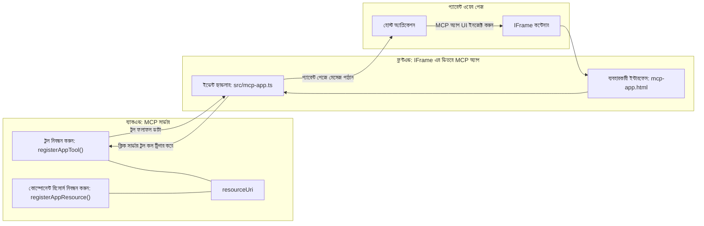
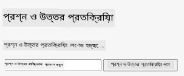
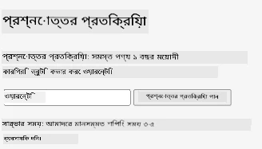
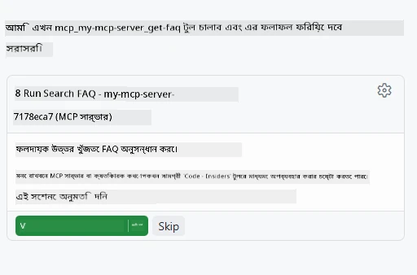
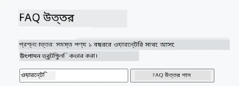

# MCP অ্যাপস

MCP অ্যাপস MCP-র একটি নতুন ধারণা। ধারণাটি হল আপনি শুধু একটি টুল কল থেকে ডেটা ফিরিয়ে দেবেন না, আপনি এই তথ্যটির সাথে কীভাবে ইন্টারঅ্যাক্ট করা উচিত তার তথ্যও প্রদান করবেন। এর মানে টুলের ফলাফল এখন UI তথ্যও থাকতে পারে। তবে কেন আমরা এটা চাইব? ভাবুন আজ আপনি কীভাবে কাজ করেন। সম্ভবত আপনি MCP সার্ভারের ফলাফল গ্রহণ করছেন একটি ফ্রন্টেন্ড মাধ্যমে, যা কোড আপনি লিখতে এবং রক্ষণাবেক্ষণ করতে হবে। কিছু সময় এটি আপনি চাচ্ছেন, কিন্তু কিছু সময় এটা দারুন হবে যদি আপনি শুধুমাত্র একটি স্নিপেট আনতে পারেন যা স্বয়ংসম্পূর্ণ এবং যা ডেটা থেকে ইউজার ইন্টারফেস সবকিছু ধারণ করে।

## ওভারভিউ

এই পাঠটি MCP অ্যাপস সম্পর্কে ব্যবহারিক নির্দেশনা দেয়, কিভাবে শুরু করবেন এবং কিভাবে এটিকে আপনার বিদ্যমান ওয়েব অ্যাপসের সাথে ইন্টিগ্রেট করবেন। MCP অ্যাপস MCP স্ট্যান্ডার্ডের একটি নতুন সংযোজন।

## শেখার উদ্দেশ্য

এই পাঠের শেষে, আপনি সক্ষম হবেন:

- MCP অ্যাপস কী তা ব্যাখ্যা করতে।
- কখন MCP অ্যাপস ব্যবহার করবেন।
- নিজস্ব MCP অ্যাপ তৈরি এবং একত্রীকরণ করতে।

## MCP অ্যাপস - এটা কিভাবে কাজ করে

MCP অ্যাপস-এর ধারণা হল এমন একটি রেসপন্স প্রদান করা যা মৌলিকভাবে একটি কম্পোনেন্ট হিসেবে রেন্ডার করা হয়। এমন একটি কম্পোনেন্টে ভিজ্যুয়াল এবং ইন্টারঅ্যাক্টিভিটি থাকতে পারে, যেমন বাটন ক্লিক, ব্যবহারকারীর ইনপুট এবং আরও অনেক কিছু। চলুন সার্ভার সাইড এবং আমাদের MCP সার্ভার থেকে শুরু করি। একটি MCP অ্যাপ কম্পোনেন্ট তৈরি করতে, আপনাকে একটি টুল এবং অ্যাপ্লিকেশন রিসোর্স উভয়ই তৈরি করতে হবে। এই দুইটি অংশ সংযুক্ত থাকে resourceUri দ্বারা।

এখানে একটি উদাহরণ। চলুন দেখি কোন কি অংশের কাজ কী এবং তা কিভাবে কাজ করে:

```text
server.ts -- responsible for registering tools and the component as a UI component
src/
  mcp-app.ts -- wiring up event handlers
mcp-app.html -- the user interface
```

এই ভিজ্যুয়ালটি একটি কম্পোনেন্ট তৈরি করার আর্কিটেকচার এবং তার লজিক বর্ণনা করে।


পরবর্তী আমরা ব্যাকএন্ড এবং ফ্রন্টএন্ডের দায়িত্বগুলো বর্ণনা করার চেষ্টা করব।

### ব্যাকএন্ড

এখানে আমাদের দুইটি কাজ করতে হবে:

- আমরা যেসব টুলের সাথে ইন্টারঅ্যাক্ট করতে চাই, সেগুলো রেজিস্টার করা।
- কম্পোনেন্টটি সংজ্ঞায়িত করা।

**টুল রেজিস্টার করা**

```typescript
registerAppTool(
    server,
    "get-time",
    {
      title: "Get Time",
      description: "Returns the current server time.",
      inputSchema: {},
      _meta: { ui: { resourceUri } }, // এই টুলটিকে এর UI রিসোর্সের সাথে লিঙ্ক করে
    },
    async () => {
      const time = new Date().toISOString();
      return { content: [{ type: "text", text: time }] };
    },
  );

```

উপরের কোডটি আচরণ ব্যাখ্যা করে, যেখানে এটি একটি টুল `get-time` নামে প্রকাশ করে। এটি কোন ইনপুট নেয় না কিন্তু বর্তমান সময় উৎপন্ন করে। আমাদের টুলগুলোর জন্য `inputSchema` সংজ্ঞায়িত করার ক্ষমতাও আছে যেখানে ব্যবহারকারীর ইনপুট গ্রহণ দরকার।

**কম্পোনেন্ট রেজিস্টার করা**

একই ফাইলে, আমাদের কম্পোনেন্টটিও রেজিস্টার করতে হবে:

```typescript
const resourceUri = "ui://get-time/mcp-app.html";

// রিসোর্সটি রেজিস্টার করুন, যা UI এর জন্য বান্ডল করা HTML/JavaScript রিটার্ন করে।
registerAppResource(
  server,
  resourceUri,
  resourceUri,
  { mimeType: RESOURCE_MIME_TYPE },
  async () => {
    const html = await fs.readFile(path.join(DIST_DIR, "mcp-app.html"), "utf-8");

    return {
    contents: [
        { uri: resourceUri, mimeType: RESOURCE_MIME_TYPE, text: html },
    ],
    };
  },
);
```

দেখুন কিভাবে আমরা `resourceUri` উল্লেখ করেছি কম্পোনেন্টটিকে তার টুলের সাথে সংযুক্ত করতে। আগ্রহের বিষয় হল সেই কলব্যাক যেখানে আমরা UI ফাইল লোড করে কম্পোনেন্ট রিটার্ন করি।

### কম্পোনেন্ট ফ্রন্টএন্ড

ব্যাকএন্ডের মতই, এখানে দুইটি অংশ আছে:

- একটি ফ্রন্টএন্ড যা শুধু HTML-এ লেখা।
- কোড যা ইভেন্টগুলো হ্যান্ডেল করে এবং কী করব তা বলে, যেমন টুল কল বা প্যারেন্ট উইন্ডোকে মেসেজ পাঠানো।

**ইউজার ইন্টারফেস**

চলুন ইউজার ইন্টারফেস দেখেন।

```html
<!-- mcp-app.html -->
<!DOCTYPE html>
<html lang="en">
  <head>
    <meta charset="UTF-8" />
    <title>Get Time App</title>
  </head>
  <body>
    <p>
      <strong>Server Time:</strong> <code id="server-time">Loading...</code>
    </p>
    <button id="get-time-btn">Get Server Time</button>
    <script type="module" src="/src/mcp-app.ts"></script>
  </body>
</html>
```

**ইভেন্ট ওয়ারআপ**

শেষ অংশ হল ইভেন্ট ওয়ারআপ। অর্থাৎ আমরা আমাদের UI-র কোন অংশে ইভেন্ট হ্যান্ডলার লাগাতে হবে এবং ইভেন্ট উঠলে কী করতে হবে তা নির্ধারণ করি:

```typescript
// mcp-app.ts

import { App } from "@modelcontextprotocol/ext-apps";

// উপাদান রেফারেন্সগুলি পান
const serverTimeEl = document.getElementById("server-time")!;
const getTimeBtn = document.getElementById("get-time-btn")!;

// অ্যাপ ইনস্ট্যান্স তৈরি করুন
const app = new App({ name: "Get Time App", version: "1.0.0" });

// সার্ভার থেকে টুল ফলাফল পরিচালনা করুন। শুরুতে `app.connect()` এর আগে সেট করুন যাতে
// প্রাথমিক টুল ফলাফল মিস না হয়।
app.ontoolresult = (result) => {
  const time = result.content?.find((c) => c.type === "text")?.text;
  serverTimeEl.textContent = time ?? "[ERROR]";
};

// বোতামের ক্লিক সংযোগ করুন
getTimeBtn.addEventListener("click", async () => {
  // `app.callServerTool()` UI-কে সার্ভার থেকে নতুন ডেটা অনুরোধ করার সুযোগ দেয়
  const result = await app.callServerTool({ name: "get-time", arguments: {} });
  const time = result.content?.find((c) => c.type === "text")?.text;
  serverTimeEl.textContent = time ?? "[ERROR]";
});

// হোস্টের সাথে সংযোগ করুন
app.connect();
```

উপরের থেকে দেখা যাচ্ছে এটি DOM উপাদানগুলোর সাথে ইভেন্ট সংযোগ করার সাধারণ কোড। উল্লেখযোগ্য বিষয় হচ্ছে `callServerTool` কল যা ব্যাকএন্ডে একটি টুল কল করে।

## ব্যবহারকারীর ইনপুট পরিচালনা

এখন পর্যন্ত আমরা এমন একটি কম্পোনেন্ট দেখেছি যেটিতে একটি বোতাম আছে যা ক্লিক করলে একটি টুল কল হয়। এবার দেখি আমরা আরও UI উপাদান যোগ করতে পারি কিনা যেমন ইনপুট ফিল্ড এবং টুলকে আর্গুমেন্ট পাঠাতে পারি কিনা। আসুন একটি FAQ ফাংশনালিটি তৈরি করি। এটি এরকম কাজ করবে:

- একটি বোতাম এবং একটি ইনপুট এলিমেন্ট থাকবে যেখানে ব্যবহারকারী একটি কিওয়ার্ড যেমন "Shipping" টাইপ করে সার্চ করবে। এটা ব্যাকএন্ডের একটি টুল কল করবে যা FAQ ডেটাতে সার্চ করবে।
- একটি টুল থাকবে যা উল্লেখিত FAQ সার্চ সাপোর্ট করবে।

প্রথমে ব্যাকএন্ডে দরকারি সাপোর্ট যোগ করি:

```typescript
const faq: { [key: string]: string } = {
    "shipping": "Our standard shipping time is 3-5 business days.",
    "return policy": "You can return any item within 30 days of purchase.",
    "warranty": "All products come with a 1-year warranty covering manufacturing defects.",
  }

registerAppTool(
    server,
    "get-faq",
    {
      title: "Search FAQ",
      description: "Searches the FAQ for relevant answers.",
      inputSchema: zod.object({
        query: zod.string().default("shipping"),
      }),
      _meta: { ui: { resourceUri: faqResourceUri } }, // এই টুলটিকে এর UI রিসোর্সের সাথে সংযুক্ত করে
    },
    async ({ query }) => {
      const answer: string = faq[query.toLowerCase()] || "Sorry, I don't have an answer for that.";
      return { content: [{ type: "text", text: answer }] };
    },
  );
```

এখানে আমরা দেখতে পাচ্ছি কিভাবে `inputSchema` পূরণ করি এবং `zod` স্কিমা দেওয়া হয় এইভাবে:

```typescript
inputSchema: zod.object({
  query: zod.string().default("shipping"),
})
```

উপরের স্কিমায় আমরা ঘোষণা করি একটি ইনপুট প্যারামিটার `query` আছে যা ঐচ্ছিক এবং ডিফল্ট মান "shipping"।

এখন *mcp-app.html* ফাইলে যাই এবং দেখি কি UI তৈরি করতে হবে:

```html
<div class="faq">
    <h1>FAQ response</h1>
    <p>FAQ Response: <code id="faq-response">Loading...</code></p>
    <input type="text" id="faq-query" placeholder="Enter FAQ query" />
    <button id="get-faq-btn">Get FAQ Response</button>
  </div>
```

দারুন, এখন আমাদের একটি ইনপুট এলিমেন্ট এবং একটি বোতাম আছে। পরবর্তীতে *mcp-app.ts* এ যাই এবং এই ইভেন্টগুলো বেঁধে দিই:

```typescript
const getFaqBtn = document.getElementById("get-faq-btn")!;
const faqQueryInput = document.getElementById("faq-query") as HTMLInputElement;

getFaqBtn.addEventListener("click", async () => {
  const query = faqQueryInput.value;
  const result = await app.callServerTool({ name: "get-faq", arguments: { query } });
  const faq = result.content?.find((c) => c.type === "text")?.text;
  faqResponseEl.textContent = faq ?? "[ERROR]";
});
```

উপরের কোডে আমরা:

- গুরুত্বপূর্ণ UI এলিমেন্টগুলোর জন্য রেফারেন্স তৈরি করি।
- বোতাম ক্লিক হ্যান্ডেল করি, ইনপুটের মান পার্স করি এবং `app.callServerTool()` কল করি যেখানে `name` এবং `arguments` পাস করি। `arguments`-এ `query` মান দেওয়া হয়।

`callServerTool` কল করলে আসলে কী হয় তা হল এটি প্যারেন্ট উইন্ডোতে একটি মেসেজ পাঠায় এবং সেই উইন্ডো MCP সার্ভার কল করে।

### পরীক্ষা করে দেখুন

এখন এটি চালালে আমরা নিম্নলিখিত দেখতে পাব:



এবং এখানে আমরা "warranty" ইনপুট দিয়ে চেষ্টা করছি:



এই কোড চালানোর জন্য [Code section](./code/README.md)-এ যান।

## Visual Studio Code-এ পরীক্ষা

Visual Studio Code MCP অ্যাপসের চমৎকার সমর্থন দেয় এবং সম্ভবত MCP অ্যাপস পরীক্ষা করার সবচেয়ে সহজ উপায়গুলোর এক। Visual Studio Code ব্যবহারের জন্য *mcp.json*-এ সার্ভার এন্ট্রি যোগ করুন:

```json
"my-mcp-server-7178eca7": {
    "url": "http://localhost:3001/mcp",
    "type": "http"
  }
```

তারপর সার্ভার শুরু করুন, MCP অ্যাপের সাথে চ্যাট উইন্ডোর মাধ্যমে যোগাযোগ করতে পারবেন যদি আপনার কাছে GitHub Copilot ইনস্টল থাকে।

উদাহরণস্বরূপ, "#get-faq" কমান্ড ট্রিগার করা হয়:



আর ওয়েব ব্রাউজারে চালানোর মত একইভাবে UI রেন্ডার হয়:



## অ্যাসাইনমেন্ট

একটি রক পেপার সিজার গেম তৈরি করুন। এতে থাকতে হবে:

UI:

- অপশনের একটি ড্রপডাউন তালিকা
- একটি বোতাম পছন্দ সাবমিট করার জন্য
- একটি লেবেল দেখাবে কে কী পছন্দ করেছে এবং কে জিতেছে

সার্ভার:

- একটি রক পেপার সিজার টুল থাকবে যা "choice" ইনপুট নেয়। এটি একটি কম্পিউটার পছন্দও রেন্ডার করবে এবং বিজয়ী নির্ধারণ করবে।

## সমাধান

[সমাধান](./assignment/README.md)

## সারসংক্ষেপ

আমরা এই নতুন MCP অ্যাপস ধারণা সম্পর্কে শিখেছি। এটি একটি নতুন ধারণা যা MCP সার্ভারকে ডেটা ছাড়াও কীভাবে ডেটা উপস্থাপন করা উচিত তা নিয়ে মতামত দেয়।

অতিরিক্তভাবে, আমরা শিখেছি যে MCP অ্যাপস একটি IFrame-এ হোস্ট করা হয় এবং MCP সার্ভারের সাথে যোগাযোগ করতে প্যারেন্ট ওয়েব অ্যাপকে মেসেজ পাঠাতে হয়। সাদামাটা JavaScript, React এবং অন্যান্য অনেক লাইব্রেরি এ ধরনের যোগাযোগ সহজ করে তোলে।

## মূল শিক্ষা

আপনি যা শিখলেন:

- MCP অ্যাপস হল একটি নতুন স্ট্যান্ডার্ড যা তখন দরকার যখন আপনি ডেটা এবং UI ফিচার দুইই পাঠাতে চান।
- এই ধরনের অ্যাপগুলি নিরাপত্তার জন্য IFrame-এ চলে।

## পরবর্তী ধাপ

- [অধ্যায় ৪](../../04-PracticalImplementation/README.md)

---

<!-- CO-OP TRANSLATOR DISCLAIMER START -->
**অনুগ্রহপত্র**:  
এই ডকুমেন্টটি AI অনুবাদ সেবা [Co-op Translator](https://github.com/Azure/co-op-translator) ব্যবহার করে অনূদিত হয়েছে। আমরা যতটা পারি যথার্থতার চেষ্টা করি, তবুও দয়া করে বুঝতে হবে যে স্বয়ংক্রিয় অনুবাদে ভুল বা অপ্রাসঙ্গিক তথ্য থাকতে পারে। মূল নথিটি তার নিজ ভাষায় প্রামাণিক উৎস হিসেবে বিবেচিত হওয়া উচিত। গুরুত্বপূর্ণ তথ্যের জন্য, পেশাদার মানব অনুবাদ গ্রহণ করার পরামর্শ দেওয়া হয়। এই অনুবাদের ব্যবহারে যে কোনও ভুলবোঝাবুঝি বা ভুল ব্যাখ্যার জন্য আমরা দায়বদ্ধ নই।
<!-- CO-OP TRANSLATOR DISCLAIMER END -->