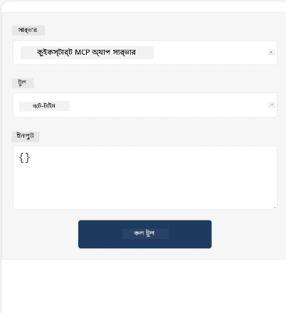
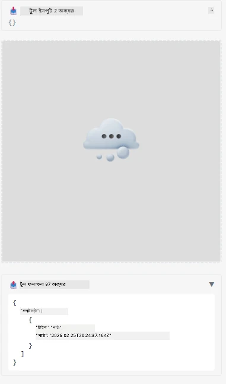

Here's a sample demonstrating MCP App

## ইনস্টল করুন

1. *mcp-app* ফোল্ডারে যান
1. `npm install` চালান, এটি ফ্রন্টএন্ড এবং ব্যাকএন্ড নির্ভরতা ইনস্টল করবে

ব্যাকএন্ড কম্পাইল হয় কিনা যাচাই করতে চালান:

```sh
npx tsc --noEmit
```

সবকিছু ঠিকঠাক হলে কোন আউটপুট থাকা উচিত নয়।

## ব্যাকএন্ড চালান

> আপনি যদি উইন্ডোজ মেশিনে থাকেন, তবে এটি একটু অতিরিক্ত কাজ লাগে কারণ MCP অ্যাপ্লিকেশন `concurrently` লাইব্রেরি ব্যবহার করে যা চালানোর জন্য আপনাকে বিকল্প খুঁজতে হবে। MCP অ্যাপে *package.json* এ এই লাইনটি আছে:

    ```json
    "start": "concurrently \"cross-env NODE_ENV=development INPUT=mcp-app.html vite build --watch\" \"tsx watch main.ts\""
    ```

এই অ্যাপের দুটি অংশ আছে, একটি ব্যাকএন্ড অংশ এবং একটি হোস্ট অংশ।

ব্যাকএন্ড চালু করতে কল করুন:

```sh
npm start
```

এটি `http://localhost:3001/mcp` এ ব্যাকএন্ড শুরু করবে।

> লক্ষ্য করুন, আপনি যদি Codespace এ থাকেন, তবে পোর্ট ভিজিবিলিটি পাবলিক করতে হতে পারে। https://<name of Codespace>.app.github.dev/mcp এর মাধ্যমে ব্রাউজারে এন্ডপয়েন্ট পৌঁছতে পারেন কিনা পরীক্ষা করুন।

## পছন্দ -1 Visual Studio Code এ অ্যাপ পরীক্ষা করুন

Visual Studio Code এ সমাধান পরীক্ষা করতে নিম্নলিখিত করুন:

- `mcp.json` এ একটি সার্ভার এন্ট্রি যোগ করুন এভাবে:

    ```json
    {
        "servers": {
            "my-mcp-server-7178eca7": {
                "url": "http://localhost:3001/mcp",
                "type": "http"
            }
        },
        "inputs": []
    }
    ```

1. *mcp.json* এ "start" বাটনে ক্লিক করুন
1. একটি চ্যাট উইন্ডো খোলা আছে তা নিশ্চিত করুন এবং `get-faq` টাইপ করুন, আপনি এমন একটি ফলাফল দেখতে পাবেন:

    

## পছন্দ -২- হোস্ট দিয়ে অ্যাপ পরীক্ষা করুন

রেপো <https://github.com/modelcontextprotocol/ext-apps>-এ বেশ কয়েকটি ভিন্ন হোস্ট আছে যা আপনি আপনার MVP Apps পরীক্ষা করার জন্য ব্যবহার করতে পারেন।

এখানে দুইটি বিকল্প দেওয়া হলো:

### লোকাল মেশিন

- রেপো ক্লোন করার পর *ext-apps* এ যান।

- নির্ভরতাগুলো ইনস্টল করুন

   ```sh
   npm install
   ```

- একটি পৃথক টার্মিনাল উইন্ডোতে *ext-apps/examples/basic-host* এ যান

    > যদি আপনি Codespace ব্যবহার করেন, তবে serve.ts ফাইলে লাইনে 27 যান এবং http://localhost:3001/mcp কে আপনার Codespace URL দিয়ে প্রতিস্থাপন করুন, যেমন https://psychic-xylophone-657rpjgvxpc5g64-3001.app.github.dev/mcp

- হোস্ট চালান:

    ```sh
    npm start
    ```

    এটি হোস্টকে ব্যাকএন্ডের সাথে সংযুক্ত করবে এবং আপনি নিচের মত অ্যাপ চলমান দেখতে পাবেন:

    

### Codespace

Codespace পরিবেশ কাজ করানোর জন্য কিছু অতিরিক্ত কাজ লাগে। Codespace এর মাধ্যমে হোস্ট ব্যবহার করতে:

- *ext-apps* ডিরেক্টরিতে যান এবং *examples/basic-host* এ যান।
- নির্ভরতাগুলো ইনস্টল করতে `npm install` চালান
- হোস্ট শুরু করতে `npm start` চালান।

## অ্যাপ পরীক্ষা করুন

নিম্নলিখিতভাবে অ্যাপটি পরীক্ষা করুন:

- "Call Tool" বোতাম নির্বাচন করুন এবং আপনি এমন ফলাফল দেখতে পাবেন:

    

দারুণ, সবকিছু কাজ করছে।

---

<!-- CO-OP TRANSLATOR DISCLAIMER START -->
**অস্বীকৃতি**:  
এই দস্তাবেজটি AI অনুবাদ সেবা [Co-op Translator](https://github.com/Azure/co-op-translator) ব্যবহার করে অনূদিত হয়েছে। আমরা যথাসাধ্য সঠিকতার জন্য চেষ্টা করি, তবে দয়া করে জেনে রাখুন যে স্বয়ংক্রিয় অনুবাদে ভুল বা অসঙ্গতি থাকতে পারে। মূল দস্তাবেজটি তার নিজ ভাষায় কর্তৃতিক উৎস হিসেবে গণ্য করা উচিত। গুরুত্বপূর্ণ তথ্যের জন্য পেশাদার মানুষ দ্বারা অনুবাদ করানোই উত্তম। এই অনুবাদের ব্যবহারে সৃষ্ট কোনো ভুল বোঝাবুঝি বা ব্যাখ্যার জন্য আমরা দায়ী নই।
<!-- CO-OP TRANSLATOR DISCLAIMER END -->