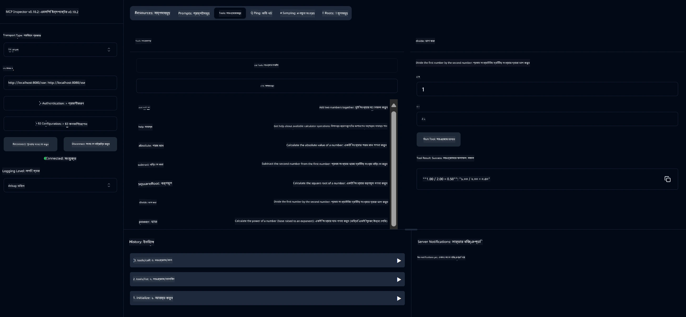

# বেসিক ক্যালকুলেটর MCP সার্ভিস

> [!NOTE]
> এই উদাহরণটি লিগ্যাসি HTTP+SSE ট্রান্সপোর্ট ব্যবহার করে এবং MCP `2025-11-25` এর সাথে সামঞ্জস্যপূর্ণ একটি SDK লক্ষ্য করে। নতুন রিমোট সার্ভারগুলোর জন্য `2026-07-28` স্ট্রিমেবল HTTP সাপোর্ট ব্যবহার করা উচিত।
> 
>

এই সার্ভিসটি Spring Boot সহ WebFlux ট্রান্সপোর্ট ব্যবহার করে Model Context Protocol (MCP) মাধ্যমে বেসিক ক্যালকুলেটর অপারেশন প্রদান করে। এটি MCP ইমপ্লিমেন্টেশন সম্পর্কে জানার জন্য নবীনদের জন্য একটি সহজ উদাহরণ হিসেবে তৈরি করা হয়েছে।

আরও তথ্যের জন্য দেখুন [MCP Server Boot Starter](https://docs.spring.io/spring-ai/reference/api/mcp/mcp-server-boot-starter-docs.html) রেফারেন্স ডকুমেন্টেশন।

## ওভারভিউ

সার্ভিসটি প্রদর্শন করে:
- SSE (Server-Sent Events) সাপোর্ট
- Spring AI এর `@Tool` অ্যানোটেশন ব্যবহার করে স্বয়ংক্রিয় টুল রেজিস্ট্রেশন
- বেসিক ক্যালকুলেটর ফাংশনসমূহ:
  - যোগ, বিয়োগ, গুণ, ভাগ
  - পাওয়ার ক্যালকুলেশন এবং বর্গমূল
  - মডুলাস (শেষাংশ) এবং আপেক্ষিক মান (absolute value)
  - অপারেশন বর্ণনার জন্য সাহায্য ফাংশন

## বৈশিষ্ট্য

এই ক্যালকুলেটর সার্ভিস নিম্নলিখিত ক্ষমতা প্রদান করে:

1. **বেসিক অ্যারিথমেটিক অপারেশনসমূহ**:
   - দুই সংখ্যার যোগফল
   - এক সংখ্যার থেকে অন্য সংখ্যার বিয়োগ
   - দুই সংখ্যার গুণফল
   - একটি সংখ্যাকে অন্য দ্বারা ভাগ (শূন্য ভাগের চেকসহ)

2. **উন্নত অপারেশনসমূহ**:
   - পাওয়ার ক্যালকুলেশন (বেসকে এক্সপোনেন্টে উত্তোলন)
   - বর্গমূল ক্যালকুলেশন (নেগেটিভ সংখ্যার চেকসহ)
   - মডুলাস (শেষাংশ) নির্ণয়
   - আপেক্ষিক মান নির্ণয়

3. **সাহায্য ব্যবস্থা**:
   - সকল উপলভ্য অপারেশন নিয়ে বিল্ট-ইন সাহায্য ফাংশন

## সার্ভিস ব্যবহার করা

MCP প্রোটোকলের মাধ্যমে এই সার্ভিস নিম্নলিখিত API এন্ডপয়েন্ট সরবরাহ করে:

- `add(a, b)`: দুই সংখ্যা যোগ করা
- `subtract(a, b)`: দ্বিতীয় সংখ্যাকে প্রথম থেকে বিয়োগ করা
- `multiply(a, b)`: দুই সংখ্যার গুণফল
- `divide(a, b)`: প্রথম সংখ্যাকে দ্বিতীয় দ্বারা ভাগ করা (শূন্য ভাগের চেকসহ)
- `power(base, exponent)`: একটি সংখ্যার পাওয়ার ক্যালকুলেশন
- `squareRoot(number)`: বর্গমূল নির্ণয় (নেগেটিভ সংখ্যার চেকসহ)
- `modulus(a, b)`: ভাগশেষ নির্ণয়
- `absolute(number)`: আপেক্ষিক মান নির্ণয়
- `help()`: উপলভ্য অপারেশন সম্পর্কে তথ্য পাওয়া

## টেস্ট ক্লায়েন্ট

একটি সিম্পল টেস্ট ক্লায়েন্ট `com.microsoft.mcp.sample.client` প্যাকেজে অন্তর্ভুক্ত। `SampleCalculatorClient` ক্লাস ক্যালকুলেটর সার্ভিসের উপলভ্য অপারেশনগুলো প্রদর্শন করে।

## LangChain4j ক্লায়েন্ট ব্যবহার

প্রকল্পটিতে একটি LangChain4j উদাহরণ ক্লায়েন্ট অন্তর্ভুক্ত `com.microsoft.mcp.sample.client.LangChain4jClient` যা ক্যালকুলেটর সার্ভিসকে LangChain4j এবং GitHub মডেলগুলোর সাথে কিভাবে ইন্টিগ্রেট করতে হয় তা দেখায়:

### পূর্বশর্ত

1. **GitHub টোকেন সেটআপ**:
   
   GitHub এর AI মডেলগুলো (যেমন phi-4) ব্যবহার করতে হলে একটি GitHub ব্যক্তিগত অ্যাক্সেস টোকেন প্রয়োজন:

   a. আপনার GitHub অ্যাকাউন্ট সেটিংসে যান: https://github.com/settings/tokens
   
   b. "Generate new token" → "Generate new token (classic)" এ ক্লিক করুন
   
   c. টোকেনটির জন্য একটি বর্ণনামূলক নাম দিন
   
   d. নিম্নলিখিত স্কোপগুলো নির্বাচন করুন:
      - `repo` (প্রাইভেট রিপোজিটরির পূর্ণ নিয়ন্ত্রণ)
      - `read:org` (অর্গানাইজেশন এবং টিম মেম্বারশিপ পড়ুন, অর্গানাইজেশন প্রোজেক্ট পড়ুন)
      - `gist` (গিস্ট তৈরি করা)
      - `user:email` (ব্যবহারকারীর ইমেল ঠিকানা অ্যাক্সেস (শুধুমাত্র-পঠন))
   
   e. "Generate token" ক্লিক করে নতুন টোকেনটি কপি করুন
   
   f. এটিকে একটি পরিবেশ ভেরিয়েবল হিসেবে সেট করুন:
      
      উইন্ডোজে:
      ```
      set GITHUB_TOKEN=your-github-token
      ```
      
      ম্যাকওএস/লিনাক্সে:
      ```bash
      export GITHUB_TOKEN=your-github-token
      ```

   g. স্থায়ী সেটআপের জন্য, সিস্টেম সেটিংস থেকে পরিবেশ ভেরিয়েবল হিসেবে এটি যোগ করুন

2. আপনার প্রোজেক্টে LangChain4j GitHub ডিপেনডেন্সি যোগ করুন (pom.xml-এ ইতিমধ্যেই অন্তর্ভুক্ত):
   ```xml
   <dependency>
       <groupId>dev.langchain4j</groupId>
       <artifactId>langchain4j-github</artifactId>
       <version>${langchain4j.version}</version>
   </dependency>
   ```

3. নিশ্চিত করুন ক্যালকুলেটর সার্ভার `localhost:8080` এ চলছে

### LangChain4j ক্লায়েন্ট চালানো

এই উদাহরণে দেখানো হয়েছে:
- SSE ট্রান্সপোর্টের মাধ্যমে ক্যালকুলেটর MCP সার্ভারে সংযোগ স্থাপন
- LangChain4j ব্যবহার করে একটি চ্যাট বট তৈরি যা ক্যালকুলেটর অপারেশন ব্যবহার করে
- GitHub AI মডেলগুলোর সাথে ইন্টিগ্রেশন (এখন phi-4 মডেল ব্যবহার)

ক্লায়েন্ট কার্যকারিতা প্রদর্শনের জন্য নিম্নলিখিত নমুনা প্রশ্ন পাঠায়:
1. দুই সংখ্যার যোগফল নির্ণয়
2. একটি সংখ্যার বর্গমূল নির্ণয়
3. উপলভ্য ক্যালকুলেটর অপারেশন সম্পর্কে সাহায্য তথ্য পাওয়া

উদাহরণটি চালান এবং কনসোল আউটপুট পরীক্ষা করুন কীভাবে AI মডেল ক্যালকুলেটর টুলগুলো ব্যবহার করে প্রশ্নের উত্তর দেয়।

### GitHub মডেল কনফিগারেশন

LangChain4j ক্লায়েন্ট GitHub এর phi-4 মডেল ব্যবহারের জন্য নিম্নলিখিত সেটিংস সহ কনফিগার করা হয়েছে:

```java
ChatLanguageModel model = GitHubChatModel.builder()
    .apiKey(System.getenv("GITHUB_TOKEN"))
    .timeout(Duration.ofSeconds(60))
    .modelName("phi-4")
    .logRequests(true)
    .logResponses(true)
    .build();
```

বিভিন্ন GitHub মডেল ব্যবহার করতে, কেবল `modelName` প্যারামিটার অন্য সমর্থিত মডেলে (যেমন "claude-3-haiku-20240307", "llama-3-70b-8192", ইত্যাদি) পরিবর্তন করুন।

## নির্ভরতা

প্রকল্পটির জন্য নিম্নলিখিত প্রধান ডিপেনডেন্সি দরকার:

```xml
<!-- For MCP Server -->
<dependency>
    <groupId>org.springframework.ai</groupId>
    <artifactId>spring-ai-starter-mcp-server-webflux</artifactId>
</dependency>

<!-- For LangChain4j integration -->
<dependency>
    <groupId>dev.langchain4j</groupId>
    <artifactId>langchain4j-mcp</artifactId>
    <version>${langchain4j.version}</version>
</dependency>

<!-- For GitHub models support -->
<dependency>
    <groupId>dev.langchain4j</groupId>
    <artifactId>langchain4j-github</artifactId>
    <version>${langchain4j.version}</version>
</dependency>
```

## প্রোজেক্ট বিল্ড করা

Maven ব্যবহার করে প্রোজেক্টটি তৈরি করুন:
```bash
./mvnw clean install -DskipTests
```

## সার্ভার চালানো

### জাভা ব্যবহার করে

```bash
java -jar target/calculator-server-0.0.1-SNAPSHOT.jar
```

### MCP Inspector ব্যবহার করে

MCP Inspector MCP সার্ভিসের সাথে ইন্টারঅ্যাক্ট করার জন্য একটি সাহায্যকারী টুল। এই ক্যালকুলেটর সার্ভিসের জন্য এটি ব্যবহার করতে:

1. **MCP Inspector ইনস্টল ও চালান** একটি নতুন টার্মিনাল উইন্ডোতে:
   ```bash
   npx @modelcontextprotocol/inspector
   ```

2. **ওয়েব UI অ্যাক্সেস করুন** অ্যাপ প্রদর্শিত URL-এ ক্লিক করে (সাধারণত http://localhost:6274)

3. **কানেকশন কনফিগার করুন**:
   - ট্রান্সপোর্ট টাইপ "SSE" সেট করুন
   - আপনার চলমান সার্ভারের SSE এন্ডপয়েন্ট URL দিন: `http://localhost:8080/sse`
   - "Connect" এ ক্লিক করুন

4. **টুলগুলো ব্যবহার করুন**:
   - "List Tools" এ ক্লিক করে উপলভ্য ক্যালকুলেটর অপারেশন দেখুন
   - একটি টুল নির্বাচন করে "Run Tool" ক্লিক করে অপারেশন চালান



### ডকার ব্যবহার করে

প্রকল্পে একটি Dockerfile অন্তর্ভুক্ত যা কন্টেইনারে ডিপ্লয়মেন্টের জন্য:

1. **ডকার ইমেজ তৈরি করুন**:
   ```bash
   docker build -t calculator-mcp-service .
   ```

2. **ডকার কন্টেইনার চালান**:
   ```bash
   docker run -p 8080:8080 calculator-mcp-service
   ```

এতে হবে:
- Maven 3.9.9 এবং Eclipse Temurin 24 JDK সহ একটি মাল্টি-স্টেজ ডকার ইমেজ নির্মাণ
- একটি অপ্টিমাইজড কন্টেইনার ইমেজ তৈরি
- ৮০৮০ পোর্টে সার্ভিস এক্সপোজ করা
- কন্টেইনারের ভিতরে MCP ক্যালকুলেটর সার্ভিস শুরু করা

কন্টেইনার চালু হলে আপনি `http://localhost:8080` এ সার্ভিস অ্যাক্সেস করতে পারবেন।

## সমস্যা সমাধান

### GitHub টোকেন সম্পর্কিত সাধারণ সমস্যা


1. **টোকেন অনুমতির সমস্যা**: যদি আপনি 403 Forbidden ত্রুটি পান, নিশ্চিত করুন যে আপনার টোকেনের সঠিক অনুমতি রয়েছে যা প্রয়োজনীয়তার মধ্যে নির্দিষ্ট করা হয়েছে।

2. **টোকেন পাওয়া যায়নি**: যদি আপনি "No API key found" ত্রুটি পান, নিশ্চিত করুন যে GITHUB_TOKEN পরিবেশ পরিবর্তনশীল সঠিকভাবে সেট করা হয়েছে।

3. **রেট সীমাবদ্ধতা**: GitHub API-র রেট সীমা রয়েছে। যদি আপনি রেট সীমা ত্রুটি (স্ট্যাটাস কোড 429) সম্মুখীন হন, কিছুক্ষণ অপেক্ষা করুন তারপর পুনরায় চেষ্টা করুন।

4. **টোকেনের মেয়াদ উত্তীর্ণ**: GitHub টোকেনের মেয়াদ শেষ হতে পারে। কিছু সময় পর যদি আপনি প্রমাণীকরণ ত্রুটি পান, একটি নতুন টোকেন তৈরি করুন এবং আপনার পরিবেশ পরিবর্তনশীল আপডেট করুন।

যদি আপনার আরও সাহায্যের প্রয়োজন হয়, তাহলে দেখুন [LangChain4j ডকুমেন্টেশন](https://github.com/langchain4j/langchain4j) অথবা [GitHub API ডকুমেন্টেশন](https://docs.github.com/en/rest)।

---

<!-- CO-OP TRANSLATOR DISCLAIMER START -->
**অস্বীকৃতি**:
এই নথিটি AI অনুবাদ পরিষেবা [Co-op Translator](https://github.com/Azure/co-op-translator) ব্যবহার করে অনূদিত হয়েছে। যদিও আমরা শুদ্ধতার জন্য চেষ্টা করি, অনুগ্রহ করে মনে রাখবেন যে স্বয়ংক্রিয় অনুবাদে ত্রুটি বা অসঙ্গতি থাকতে পারে। মূল নথিটি তার স্বভাষায় কর্তৃত্বপূর্ণ উৎস হিসেবে বিবেচিত হওয়া উচিত। গুরুত্বপূর্ণ তথ্যের জন্য পেশাদার মানব অনুবাদ সুপারিশ করা হয়। এই অনুবাদের ব্যবহারে প্রয়োজনীয় ভুল বোঝাবুঝি বা ভুল ব্যাখ্যার জন্য আমরা দায়বদ্ধ নই।
<!-- CO-OP TRANSLATOR DISCLAIMER END -->