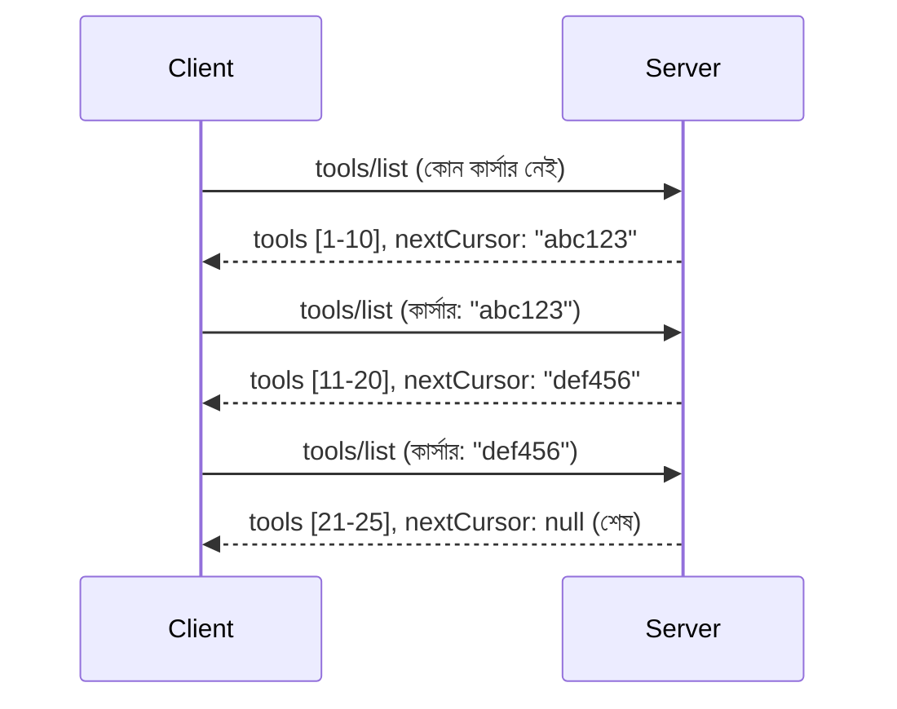

# MCP-তে পেজিনেশন এবং বড় ফলাফল সেট

যখন আপনার MCP সার্ভার বড় ডেটাসেট পরিচালনা করে - হাজার হাজার ফাইল, ডেটাবেস রেকর্ড বা সার্চ ফলাফল তালিকা করতে - তখন আপনাকে মেমরি স 효율ে ব্যবস্থাপনার জন্য এবং দ্রুত প্রতিক্রিয়াশীল ব্যবহারকারীর অভিজ্ঞতা প্রদানের জন্য পেজিনেশন দরকার। এই গাইডটি MCP-তে কীভাবে পেজিনেশন বাস্তবায়ন এবং ব্যবহার করবেন তা ব্যাখ্যা করে।

## কেন পেজিনেশন গুরুত্বপূর্ণ

পেজিনেশন ছাড়া, বড় উত্তরগুলো কারণ হতে পারে:

- **মেমরি শেষ হয়ে যাওয়া** - একবারে কোটি কোটি রেকর্ড লোড করা
- **ধীর প্রতিক্রিয়া সময়** - ব্যবহারকারীরা সমস্ত ডেটা লোড হওয়া পর্যন্ত অপেক্ষা করে
- **টাইমআউট এরর** - অনুরোধ সময়সীমা ছাড়িয়ে যায়
- **খারাপ AI পারফরম্যান্স** - LLMগুলো বৃহৎ প্রসঙ্গের সাথে সংগ্রাম করে

MCP নির্ভরযোগ্য, ধারাবাহিক ফলাফল সেট পেজিংয়ের জন্য **কার্সার-ভিত্তিক পেজিনেশন** ব্যবহার করে।

---

## MCP পেজিনেশন কীভাবে কাজ করে

### কার্সার ধারণা

একটি **কার্সার** হল একটি অপ্যাক্ট স্ট্রিং যা আপনার অবস্থানকে একটি ফলাফল সেটে চিহ্নিত করে। এটিকে একটি দীর্ঘ বইয়ে বুকমার্কের মতো ভাবুন।



### MCP পদ্ধতিতে পেজিনেশন

এই MCP পদ্ধতিগুলো পেজিনেশন সাপোর্ট করে:

| পদ্ধতি | ফেরত দেয় | কার্সার সাপোর্ট |
|--------|---------|----------------|
| `tools/list` | টুল সংজ্ঞা | ✅ |
| `resources/list` | রিসোর্স সংজ্ঞা | ✅ |
| `prompts/list` | প্রম্পট সংজ্ঞা | ✅ |
| `resources/templates/list` | রিসোর্স টেমপ্লেট | ✅ |

---

## সার্ভার বাস্তবায়ন

### পাইথন (FastMCP)

```python
from mcp.server import Server
from mcp.types import Tool, ListToolsResult
import math

app = Server("paginated-server")

# অনুকরণ করা বড় ডেটাসেট
ALL_TOOLS = [
    Tool(name=f"tool_{i}", description=f"Tool number {i}", inputSchema={})
    for i in range(100)
]

PAGE_SIZE = 10

@app.list_tools()
async def list_tools(cursor: str | None = None) -> ListToolsResult:
    """List tools with pagination support."""
    
    # শুরু সূচি পেতে কার্সর ডিকোড করুন
    start_index = 0
    if cursor:
        try:
            start_index = int(cursor)
        except ValueError:
            start_index = 0
    
    # ফলাফলের পৃষ্ঠা পান
    end_index = min(start_index + PAGE_SIZE, len(ALL_TOOLS))
    page_tools = ALL_TOOLS[start_index:end_index]
    
    # পরবর্তী কার্সর হিসাব করুন
    next_cursor = None
    if end_index < len(ALL_TOOLS):
        next_cursor = str(end_index)
    
    return ListToolsResult(
        tools=page_tools,
        nextCursor=next_cursor
    )
```

### টাইপস্ক্রিপ্ট

```typescript
import { Server } from "@modelcontextprotocol/sdk/server/index.js";
import { ListToolsResultSchema } from "@modelcontextprotocol/sdk/types.js";

const server = new Server({
  name: "paginated-server",
  version: "1.0.0"
});

// সিমুলেটেড বড় ডেটাসেট
const ALL_TOOLS = Array.from({ length: 100 }, (_, i) => ({
  name: `tool_${i}`,
  description: `Tool number ${i}`,
  inputSchema: { type: "object", properties: {} }
}));

const PAGE_SIZE = 10;

server.setRequestHandler(ListToolsResultSchema, async (request) => {
  // কার্সর ডিকোড করুন
  let startIndex = 0;
  if (request.params?.cursor) {
    startIndex = parseInt(request.params.cursor, 10) || 0;
  }
  
  // ফলাফলের পৃষ্ঠা পান
  const endIndex = Math.min(startIndex + PAGE_SIZE, ALL_TOOLS.length);
  const pageTools = ALL_TOOLS.slice(startIndex, endIndex);
  
  // পরবর্তী কার্সর গণনা করুন
  const nextCursor = endIndex < ALL_TOOLS.length ? String(endIndex) : undefined;
  
  return {
    tools: pageTools,
    nextCursor
  };
});
```

### জাভা (Spring MCP)

```java
@Service
public class PaginatedToolService {
    
    private static final int PAGE_SIZE = 10;
    private final List<Tool> allTools;
    
    public PaginatedToolService() {
        // বড় ডেটাসেট শুরু করুন
        this.allTools = IntStream.range(0, 100)
            .mapToObj(i -> new Tool("tool_" + i, "Tool number " + i, Map.of()))
            .collect(Collectors.toList());
    }
    
    @McpMethod("tools/list")
    public ListToolsResult listTools(@Param("cursor") String cursor) {
        // কার্সর ডিকোড করুন
        int startIndex = 0;
        if (cursor != null && !cursor.isEmpty()) {
            try {
                startIndex = Integer.parseInt(cursor);
            } catch (NumberFormatException e) {
                startIndex = 0;
            }
        }
        
        // ফলাফলের পৃষ্ঠা পান
        int endIndex = Math.min(startIndex + PAGE_SIZE, allTools.size());
        List<Tool> pageTools = allTools.subList(startIndex, endIndex);
        
        // পরবর্তী কার্সর গণনা করুন
        String nextCursor = endIndex < allTools.size() ? String.valueOf(endIndex) : null;
        
        return new ListToolsResult(pageTools, nextCursor);
    }
}
```

---

## ক্লায়েন্ট বাস্তবায়ন

### পাইথন ক্লায়েন্ট

```python
from mcp import ClientSession

async def get_all_tools(session: ClientSession) -> list:
    """Fetch all tools using pagination."""
    all_tools = []
    cursor = None
    
    while True:
        result = await session.list_tools(cursor=cursor)
        all_tools.extend(result.tools)
        
        if result.nextCursor is None:
            break
        cursor = result.nextCursor
    
    return all_tools

# ব্যবহার
async with client_session as session:
    tools = await get_all_tools(session)
    print(f"Found {len(tools)} tools")
```

### টাইপস্ক্রিপ্ট ক্লায়েন্ট

```typescript
import { Client } from "@modelcontextprotocol/sdk/client/index.js";

async function getAllTools(client: Client): Promise<Tool[]> {
  const allTools: Tool[] = [];
  let cursor: string | undefined = undefined;
  
  do {
    const result = await client.listTools({ cursor });
    allTools.push(...result.tools);
    cursor = result.nextCursor;
  } while (cursor);
  
  return allTools;
}

// ব্যবহার
const tools = await getAllTools(client);
console.log(`Found ${tools.length} tools`);
```

### অলস লোডিং প্যাটার্ন

খুব বড় ডেটাসেটের জন্য, অন-ডিমান্ডে পেজ লোড করুন:

```python
class PaginatedToolIterator:
    """Lazily iterate through paginated tools."""
    
    def __init__(self, session: ClientSession):
        self.session = session
        self.cursor = None
        self.buffer = []
        self.exhausted = False
    
    async def __anext__(self):
        # বাফার থেকে প্রাপ্তি থাকলে ফেরত দিন
        if self.buffer:
            return self.buffer.pop(0)
        
        # পরীক্ষা করুন আমরা সব পৃষ্ঠা শেষ করেছি কি না
        if self.exhausted:
            raise StopAsyncIteration
        
        # পরবর্তী পৃষ্ঠা আনুন
        result = await self.session.list_tools(cursor=self.cursor)
        self.buffer = list(result.tools)
        self.cursor = result.nextCursor
        
        if self.cursor is None:
            self.exhausted = True
        
        if not self.buffer:
            raise StopAsyncIteration
        
        return self.buffer.pop(0)
    
    def __aiter__(self):
        return self

# ব্যবহার - বড় ডেটাসেটের জন্য মেমরি দক্ষ
async for tool in PaginatedToolIterator(session):
    process_tool(tool)
```

---

## রিসোর্সের জন্য পেজিনেশন

ডিরেক্টরি বা বড় ডেটাসেটের জন্য প্রায়ই রিসোর্সগুলোর পেজিনেশন প্রয়োজন:

```python
from mcp.server import Server
from mcp.types import Resource, ListResourcesResult
import os

app = Server("file-server")

@app.list_resources()
async def list_resources(cursor: str | None = None) -> ListResourcesResult:
    """List files in directory with pagination."""
    
    directory = "/data/files"
    all_files = sorted(os.listdir(directory))
    
    # কার্সর ডিকোড করুন (ফাইল সূচক)
    start_index = int(cursor) if cursor else 0
    page_size = 20
    end_index = min(start_index + page_size, len(all_files))
    
    # এই পৃষ্ঠার জন্য রিসোর্স তালিকা তৈরি করুন
    resources = []
    for filename in all_files[start_index:end_index]:
        filepath = os.path.join(directory, filename)
        resources.append(Resource(
            uri=f"file://{filepath}",
            name=filename,
            mimeType="application/octet-stream"
        ))
    
    # পরবর্তী কার্সর হিসাব করুন
    next_cursor = str(end_index) if end_index < len(all_files) else None
    
    return ListResourcesResult(
        resources=resources,
        nextCursor=next_cursor
    )
```

---

## কার্সার ডিজাইন কৌশল

### কৌশল ১: ইনডেক্স-ভিত্তিক (সরল)

```python
# কর্সর কেবল সূচক
cursor = "50"  # আইটেম ৫০ থেকে শুরু করুন
```

**সুবিধা:** সহজ, স্টেটলেস
**অসুবিধা:** আইটেম যোগ বা বাদ দিলে ফলাফল স্থানান্তরিত হতে পারে

### কৌশল ২: আইডি-ভিত্তিক (স্থিতিশীল)

```python
# কার্সর হল সর্বশেষ দেখা আইডি
cursor = "item_abc123"  # এই আইটেমের পরে শুরু করুন
```

**সুবিধা:** আইটেম পরিবর্তন হলেও স্থিতিশীল থাকে
**অসুবিধা:** ক্রমানুসার আইডি প্রয়োজন

### কৌশল ৩: এনকোড করা অবস্থা (জটিল)

```python
import base64
import json

def encode_cursor(state: dict) -> str:
    return base64.b64encode(json.dumps(state).encode()).decode()

def decode_cursor(cursor: str) -> dict:
    return json.loads(base64.b64decode(cursor).decode())

# কার্সরে একাধিক স্টেট ফিল্ড রয়েছে
cursor = encode_cursor({
    "offset": 50,
    "filter": "active",
    "sort": "name"
})
```

**সুবিধা:** জটিল অবস্থা এনকোড করা যায়
**অসুবিধা:** আরো জটিল, বড় কার্সার স্ট্রিং

---

## সেরা অভ্যাস

### ১. উপযুক্ত পেজ সাইজ নির্বাচন করুন

```python
# ডেটা আকার বিবেচনা করুন
PAGE_SIZE_SMALL_ITEMS = 100   # সাধারণ মেটাডেটা
PAGE_SIZE_MEDIUM_ITEMS = 20   # সমৃদ্ধ অবজেক্ট
PAGE_SIZE_LARGE_ITEMS = 5     # জটিল বিষয়বস্তু
```

### ২. অবৈধ কার্সার সুষ্ঠুভাবে পরিচালনা করুন

```python
@app.list_tools()
async def list_tools(cursor: str | None = None) -> ListToolsResult:
    try:
        start_index = int(cursor) if cursor else 0
        if start_index < 0 or start_index >= len(ALL_TOOLS):
            start_index = 0  # শুরুতে রিসেট করুন
    except (ValueError, TypeError):
        start_index = 0  # অবৈধ কার্সর, নতুন করে শুরু করুন
    # ...
```

### ৩. মোট গননা অন্তর্ভুক্ত করুন (ঐচ্ছিক)

```python
return ListToolsResult(
    tools=page_tools,
    nextCursor=next_cursor,
    # কিছু বাস্তবায়নে UI অগ্রগতির জন্য মোট অন্তর্ভুক্ত থাকে
    _meta={"total": len(ALL_TOOLS)}
)
```

### ৪. এড্জ কেস পরীক্ষা করুন

```python
async def test_pagination():
    # ফাঁকা ফলাফল সেট
    result = await session.list_tools()
    assert result.tools == []
    assert result.nextCursor is None
    
    # একক পৃষ্ঠা
    result = await session.list_tools()
    assert len(result.tools) <= PAGE_SIZE
    
    # অবৈধ কার্সার
    result = await session.list_tools(cursor="invalid")
    assert result.tools  # প্রথম পৃষ্ঠা ফেরত দেওয়া উচিত
```

---

## সাধারণ ভুল

### ❌ সব ফলাফল ফেরত দিয়ে তারপর ক্লায়েন্ট-পারে পেজিনেশন করা

```python
# খারাপ: সবকিছু মেমরিতে লোড করে
@app.list_tools()
async def list_tools() -> ListToolsResult:
    all_tools = load_all_tools()  # ১ মিলিয়ন সরঞ্জাম!
    return ListToolsResult(tools=all_tools)
```

### ✅ ডেটা সোর্সেই পেজিনেশন করুন

```python
# ভাল: শুধুমাত্র যা প্রয়োজন তা লোড করে
@app.list_tools()
async def list_tools(cursor: str | None = None) -> ListToolsResult:
    offset = int(cursor) if cursor else 0
    tools = await db.query_tools(offset=offset, limit=PAGE_SIZE)
    return ListToolsResult(tools=tools, nextCursor=...)
```

---

## পরবর্তী কী

- [মডিউল 5.14 - কনটেক্সট ইঞ্জিনিয়ারিং](../../05-AdvancedTopics/mcp-contextengineering/README.md)
- [মডিউল 8 - সেরা অভ্যাস](../../08-BestPractices/README.md)
- [3.8 - আপনার MCP সার্ভার পরীক্ষা করা](../../03-GettingStarted/08-testing/README.md)

---

## অতিরিক্ত রিসোর্স

- [MCP স্পেসিফিকেশন - পেজিনেশন](https://modelcontextprotocol.io/specification/2026-07-28/)
- [কার্সার-ভিত্তিক পেজিনেশন ব্যাখ্যা](https://slack.engineering/evolving-api-pagination-at-slack/)
- [Python SDK পেজিনেশন পরীক্ষা](https://github.com/modelcontextprotocol/python-sdk/blob/main/tests/client/test_list_methods_cursor.py)

---

<!-- CO-OP TRANSLATOR DISCLAIMER START -->
**অস্বীকৃতি**:
এই নথিটি AI অনুবাদ পরিষেবা [Co-op Translator](https://github.com/Azure/co-op-translator) ব্যবহার করে অনূদিত হয়েছে। যদিও আমরা শুদ্ধতার জন্য চেষ্টা করি, অনুগ্রহ করে মনে রাখবেন যে স্বয়ংক্রিয় অনুবাদে ত্রুটি বা অসঙ্গতি থাকতে পারে। মূল নথিটি তার স্বভাষায় কর্তৃত্বপূর্ণ উৎস হিসেবে বিবেচিত হওয়া উচিত। গুরুত্বপূর্ণ তথ্যের জন্য পেশাদার মানব অনুবাদ সুপারিশ করা হয়। এই অনুবাদের ব্যবহারে প্রয়োজনীয় ভুল বোঝাবুঝি বা ভুল ব্যাখ্যার জন্য আমরা দায়বদ্ধ নই।
<!-- CO-OP TRANSLATOR DISCLAIMER END -->