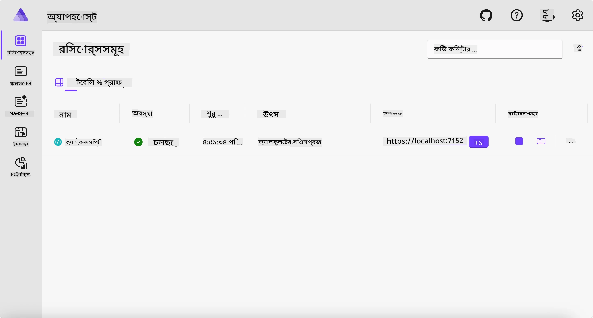
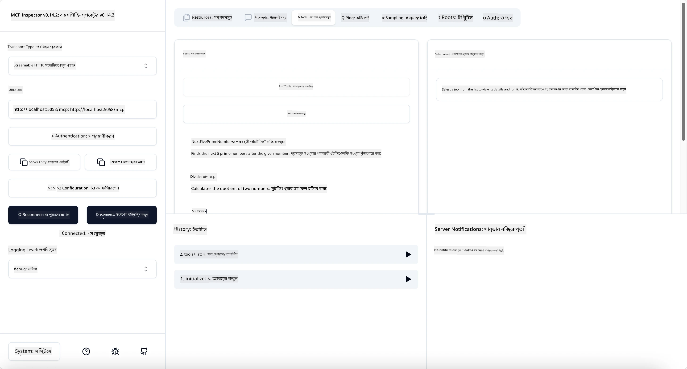
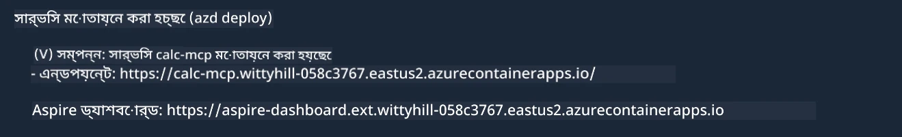

# নমুনা

আগের উদাহরণটি দেখায় কীভাবে একটি লোকাল .NET প্রকল্প `stdio` টাইপ দিয়ে ব্যবহার করা যায়। এবং কীভাবে একটি কন্টেইনারে সার্ভার লোকালি চালানো যায়। এটি অনেক পরিস্থিতিতে একটি ভাল সমাধান। তবে, সার্ভারটি দূরবর্তীভাবে চালানো যেমন ক্লাউড পরিবেশে থাকা সুবিধাজনক হতে পারে। এ ক্ষেত্রেই `http` টাইপ ব্যবহৃত হয়।

`04-PracticalImplementation` ফোল্ডারের সমাধানটি দেখলে এটি আগেরটির চেয়ে অনেক বেশি জটিল মনে হতে পারে। তবে বাস্তবে তা নয়। যদি আপনি প্রকল্প `src/Calculator` এর দিকে খেয়াল করে দেখেন, আপনি দেখতে পাবেন এটি বেশিরভাগই আগের উদাহরণের কোডের মত। পার্থক্য মাত্র এই যে আমরা HTTP অনুরোধগুলি পরিচালনার জন্য একটি ভিন্ন লাইব্রেরি `ModelContextProtocol.AspNetCore` ব্যবহার করছি। এবং আমরা `IsPrime` পদ্ধতিটি প্রাইভেট করেছি, শুধু দেখানোর জন্য যে আপনার কোডে প্রাইভেট পদ্ধতিও থাকতে পারে। বাকি কোড আগের মতোই।

অন্যান্য প্রকল্পগুলি [Aspire](https://aspire.dev/get-started/what-is-aspire/) থেকে এসেছে। সমাধানে Aspire থাকা ডেভেলপারদের ডেভেলপিং এবং টেস্টিং অভিজ্ঞতা উন্নত করে এবং পর্যবেক্ষণ সহজ করে। এটি সার্ভার চালানোর জন্য আবশ্যক নয়, তবে সমাধানে এটি থাকা ভাল অভ্যাস।

## সার্ভার লোকালি চালু করুন

1. VS Code (C# DevKit এক্সটেনশন সহ) থেকে `04-PracticalImplementation/samples/csharp` ডিরেক্টরিতে নেভিগেট করুন।
1. সার্ভার চালু করতে নিচের কমান্ডটি চালান:

   ```bash
    dotnet watch run --project ./src/AppHost
   ```

1. যখন একটি ওয়েব ব্রাউজার Aspire ড্যাশবোর্ড খুলবে, সেখানে `http` URL লক্ষ্য করুন। এটি সম্ভবত `http://localhost:5058/` এর মতো কিছু হবে।

   

## MCP Inspector দিয়ে Streamable HTTP পরীক্ষা করুন

যদি আপনার কাছে Node.js 22.7.5 বা এর উপরে থাকে, আপনি MCP Inspector ব্যবহার করে আপনার সার্ভার পরীক্ষা করতে পারেন।

সার্ভার চালু করুন এবং একটি টার্মিনালে নিচের কমান্ডটি চালান:

```bash
npx @modelcontextprotocol/inspector http://localhost:5058
```



- `Streamable HTTP` ট্রান্সপোর্ট টাইপ হিসেবে নির্বাচন করুন।
- Url ক্ষেত্রটিতে আগের নোট করা সার্ভারের URL প্রবেশ করান এবং শেষে `/mcp` যোগ করুন। এটি `http` (না `https`) হওয়া উচিত, উদাহরণস্বরূপ `http://localhost:5058/mcp`।
- Connect বাটনে ক্লিক করুন।

Inspector-এর একটি সুন্দর সুবিধা হলো এটি ঘটছে এমন ঘটনাগুলি সুন্দরভাবে দৃশ্যমান করে।

- উপলব্ধ টুলগুলো তালিকাভুক্ত করার চেষ্টা করুন
- এর মধ্যে কিছু ব্যবহার করে দেখুন, এটি আগের মতোই কাজ করবে।

## VS Code এ GitHub Copilot Chat দিয়ে MCP সার্ভার পরীক্ষা করুন

Streamable HTTP ট্রান্সপোর্ট GitHub Copilot Chat-এ ব্যবহার করতে, পূর্বে তৈরি `calc-mcp` সার্ভারের কনফিগারেশন নিচের মত পরিবর্তন করুন:

```jsonc
// .vscode/mcp.json
{
  "servers": {
    "calc-mcp": {
      "type": "http",
      "url": "http://localhost:5058/mcp"
    }
  }
}
```

কিছু পরীক্ষা করুন:

- "6780 পরবর্তী 3 টি মৌলিক সংখ্যা" জিজ্ঞাসা করুন। লক্ষ্য করুন কিভাবে Copilot নতুন টুল `NextFivePrimeNumbers` ব্যবহার করে প্রথম 3 টি মৌলিক সংখ্যা ফেরত দিচ্ছে।
- "111 পরবর্তী 7 টি মৌলিক সংখ্যা" জিজ্ঞাসা করুন, কী হয় দেখার জন্য।
- "জনের 24 টি ললি আছে এবং সে সেগুলো তার 3 সন্তানের মধ্যে বন্টন করতে চায়। প্রতি সন্তানের কাছে কত ললি থাকবে?" জিজ্ঞাসা করুন, কী হয় দেখার জন্য।

## সার্ভারটি Azure-এ স্থাপন করুন

চলুন সার্ভারটি Azure-এ স্থাপন করি যাতে আরো অনেক লোক এটি ব্যবহার করতে পারে।

একটি টার্মিনাল থেকে `04-PracticalImplementation/samples/csharp` ফোল্ডারে যান এবং নিচের কমান্ডটি চালান:

```bash
azd up
```

স্থাপন প্রক্রিয়া শেষ হলে, আপনাকে নিচের মত একটি বার্তা দেখতে হবে:



URL টি নিন এবং MCP Inspector ও GitHub Copilot Chat-এ ব্যবহার করুন।

```jsonc
// .vscode/mcp.json
{
  "servers": {
    "calc-mcp": {
      "type": "http",
      "url": "https://calc-mcp.gentleriver-3977fbcf.australiaeast.azurecontainerapps.io/mcp"
    }
  }
}
```

## পরবর্তী কি?

আমরা বিভিন্ন ট্রান্সপোর্ট টাইপ এবং টেস্টিং টুল পরীক্ষা করেছি। আমরা MCP সার্ভারটিকে Azure-এ স্থাপন করেছি। কিন্তু যদি আমাদের সার্ভারের ব্যক্তিগত রিসোর্সের অ্যাক্সেস দরকার হয়? যেমন একটি ডাটাবেস বা ব্যক্তিগত API? পরবর্তী অধ্যায়ে আমরা দেখব কীভাবে আমাদের সার্ভারের সিকিউরিটি উন্নত করা যায়।

---

<!-- CO-OP TRANSLATOR DISCLAIMER START -->
**অস্বীকৃতি**:
এই নথিটি AI অনুবাদ পরিষেবা [Co-op Translator](https://github.com/Azure/co-op-translator) ব্যবহার করে অনূদিত হয়েছে। যদিও আমরা শুদ্ধতার জন্য চেষ্টা করি, অনুগ্রহ করে মনে রাখবেন যে স্বয়ংক্রিয় অনুবাদে ত্রুটি বা অসঙ্গতি থাকতে পারে। মূল নথিটি তার স্বভাষায় কর্তৃত্বপূর্ণ উৎস হিসেবে বিবেচিত হওয়া উচিত। গুরুত্বপূর্ণ তথ্যের জন্য পেশাদার মানব অনুবাদ সুপারিশ করা হয়। এই অনুবাদের ব্যবহারে প্রয়োজনীয় ভুল বোঝাবুঝি বা ভুল ব্যাখ্যার জন্য আমরা দায়বদ্ধ নই।
<!-- CO-OP TRANSLATOR DISCLAIMER END -->