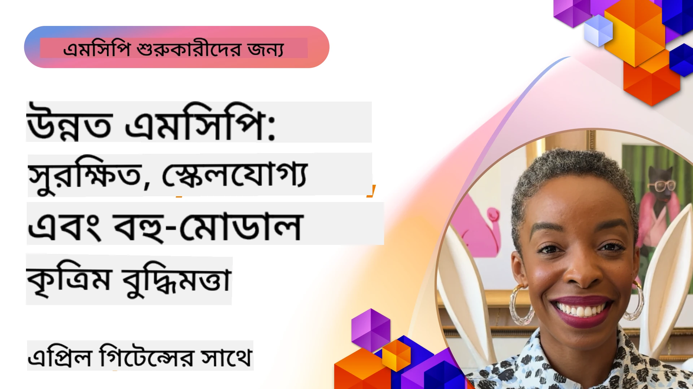

# এমসিপিতে উন্নত বিষয়সমূহ

_(এই পাঠের ভিডিও দেখতে উপরের ছবিতে ক্লিক করুন)_

এই অধ্যায়টি মডেল প্রসঙ্গ প্রোটোকল (MCP) বাস্তবায়নের একটি ধারাবাহিক উন্নত বিষয়সমূহ কভার করে, যার মধ্যে রয়েছে মাল্টি-মোডাল ইন্টিগ্রেশন, স্কেলেবিলিটি, নিরাপত্তা সর্বোত্তম অনুশীলন এবং এন্টারপ্রাইজ ইন্টিগ্রেশন। এই বিষয়গুলি আধুনিক AI সিস্টেমের দাবি পূরণে সক্ষম টেকসই এবং প্রোডাকশন-রেডি MCP অ্যাপ্লিকেশন তৈরির জন্য অত্যন্ত গুরুত্বপূর্ণ।

## ওভারভিউ

এই পাঠে মডেল প্রসঙ্গ প্রোটোকল বাস্তবায়নের উন্নত ধারণাগুলি অন্বেষণ করা হবে, যা প্রধানত মাল্টি-মোডাল ইন্টিগ্রেশন, স্কেলেবিলিটি, নিরাপত্তার সর্বোত্তম অনুশীলন এবং এন্টারপ্রাইজ ইন্টিগ্রেশনের উপর মনোনিবেশ করে। এই বিষয়গুলো এমন প্রোডাকশন-গ্রেড MCP অ্যাপ্লিকেশন তৈরির জন্য অপরিহার্য যা এন্টারপ্রাইজ পরিবেশে জটিল চাহিদাগুলি পরিচালনা করতে সক্ষম।

> **বর্তমান স্পেসিফিকেশন নোট:** MCP `2026-07-28` রুটস এবং
> স্যাম্পলিং প্রিমিটিভগুলি বাতিল করেছে যা পাঠ 5.4 এবং 5.6 এ আলোচনা হয়েছে। এটি
> প্রোটোকল ফিচারস (5.16)-এ উল্লেখিত পরীক্ষামূলক টাস্ক ফিচারটিকে একটি
> বিশেষায়িত টাস্ক এক্সটেনশনে স্থানান্তর করেছে। ঐ পাঠগুলো `2025-11-25`
> লেগেসি বাস্তবায়নের জন্য রক্ষা করা হয়েছে এবং স্থানান্তর নির্দেশিকা অন্তর্ভুক্ত। দেখুন
> [MCP-এ পরিবর্তনসমূহ: 2026-07-28 স্পেসিফিকেশন](../01-CoreConcepts/mcp-2026-07-28.md)।

## শেখার উদ্দেশ্য

এই পাঠের শেষে, আপনি সক্ষম হবেন:

- MCP ফ্রেমওয়ার্কে মাল্টি-মোডাল সক্ষমতা বাস্তবায়ন করতে
- উচ্চ চাহিদার পরিস্থিতির জন্য স্কেলেবেল MCP আর্কিটেকচার ডিজাইন করতে
- MCP এর নিরাপত্তা নীতির সাথে সঙ্গতিপূর্ণ নিরাপত্তা সর্বোত্তম অনুশীলন প্রয়োগ করতে
- এন্টারপ্রাইজ AI সিস্টেম এবং ফ্রেমওয়ার্কের সাথে MCP ইন্টিগ্রেট করতে
- প্রোডাকশন পরিবেশে পারফরম্যান্স এবং নির্ভরযোগ্যতা অপ্টিমাইজ করতে

## পাঠসমূহ এবং নমুনা প্রকল্পসমূহ

| লিঙ্ক | শিরোনাম | বর্ণনা |
|------|-------|-------------|
| [5.1 Integration with Azure](./mcp-integration/README.md) | Azure এর সাথে ইন্টিগ্রেশন | শিখুন কিভাবে Azure এ আপনার MCP সার্ভার ইন্টিগ্রেট করবেন |
| [5.2 Multi modal sample](./mcp-multi-modality/README.md) | MCP মাল্টি মোডাল নমুনা | অডিও, চিত্র এবং মাল্টি মোডাল রেসপন্সের নমুনাসমূহ |
| [5.3 MCP OAuth2 sample](../../../05-AdvancedTopics/mcp-oauth2-demo) | MCP OAuth2 ডেমো | OAuth2 সহ MCP দেখানোর জন্য একটি ন্যূনতম Spring Boot অ্যাপ, যা অথরাইজেশন এবং রিসোর্স সার্ভার হিসাবে কাজ করে। নিরাপদ টোকেন ইস্যু, সুরক্ষিত এন্ডপয়েন্ট, Azure Container Apps ডিপ্লয়মেন্ট এবং API ম্যানেজমেন্ট ইন্টিগ্রেশন প্রদর্শন করে। |
| [5.4 Root Contexts](./mcp-root-contexts/README.md) | রুট প্রসঙ্গসমূহ | লেগেসি `2025-11-25` রুট প্রিমিটিভ এবং বর্তমান স্থানান্তর অপশনগুলি শিখুন (`2026-07-28` এ বাতিল) |
| [5.5 Routing](./mcp-routing/README.md) | রাউটিং | বিভিন্ন ধরনের রাউটিং শিখুন |
| [5.6 Sampling](./mcp-sampling/README.md) | স্যাম্পলিং | লেগেসি `2025-11-25` স্যাম্পলিং প্রিমিটিভ এবং বর্তমান স্থানান্তর অপশনগুলি শিখুন (`2026-07-28` এ বাতিল) |
| [5.7 Scaling](./mcp-scaling/README.md) | স্কেলিং | স্কেলিং সম্পর্কিত শিখুন |
| [5.8 Security](./mcp-security/README.md) | নিরাপত্তা | আপনার MCP সার্ভার সুরক্ষিত করুন |
| [5.9 Web Search sample](./web-search-mcp/README.md) | ওয়েব সার্চ MCP | Python MCP সার্ভার এবং ক্লায়েন্ট যা SerpAPI এর সাথে ইন্টিগ্রেট করে রিয়েল-টাইম ওয়েব, সংবাদ, পণ্য অনুসন্ধান এবং Q&A এর জন্য। মাল্টি-টুল অর্কেস্ট্রেশন, বাহ্যিক API ইন্টিগ্রেশন এবং দৃঢ় ত্রুটি পরিচালনা প্রদর্শন করে। |
| [5.10 Realtime Streaming](./mcp-realtimestreaming/README.md) | স্ট্রিমিং | আজকের তথ্য-চালিত বিশ্বের জন্য রিয়েল-টাইম ডেটা স্ট্রিমিং অপরিহার্য, যেখানে ব্যবসা এবং অ্যাপ্লিকেশন সময়মতো সিদ্ধান্ত নিতে তথ্যের তাৎক্ষণিক প্রবেশাধিকার প্রয়োজন। |
| [5.11 Realtime Web Search](./mcp-realtimesearch/README.md) | ওয়েব সার্চ | কিভাবে MCP রিয়েল-টাইম ওয়েব সার্চকে রূপান্তরিত করে AI মডেল, সার্চ ইঞ্জিন এবং অ্যাপ্লিকেশনের মধ্যে প্রসঙ্গ ব্যবস্থাপনার জন্য একটি মানসম্মত পন্থা প্রদান করে। |
| [5.12  Entra ID Authentication for Model Context Protocol Servers](./mcp-security-entra/README.md) | Entra ID Authentication | Microsoft Entra ID একটি দৃঢ় ক্লাউড-ভিত্তিক পরিচয় ও প্রবেশাধিকার ব্যবস্থাপনা সমাধান প্রদান করে, যা নিশ্চিত করে শুধুমাত্র অনুমোদিত ব্যবহারকারী এবং অ্যাপ্লিকেশনই আপনার MCP সার্ভারের সাথে ইন্টারঅ্যাক্ট করতে পারে। |
| [5.13 Microsoft Foundry Agent Integration](./mcp-foundry-agent-integration/README.md) | Microsoft Foundry Integration | শিখুন কিভাবে মডেল প্রসঙ্গ প্রোটোকল সার্ভারগুলো Microsoft Foundry এজেন্টের সাথে ইন্টিগ্রেট করবেন, যাতে শক্তিশালী টুল অর্কেস্ট্রেশন এবং এন্টারপ্রাইজ AI সক্ষমতা স্ট্যান্ডার্ড বাহ্যিক ডেটা উত্স সংযোগসহ সম্ভব হয়। |
| [5.14 Context Engineering](./mcp-contextengineering/README.md) | Context Engineering | MCP সার্ভারগুলোর জন্য প্রসঙ্গ ইঞ্জিনিয়ারিং কৌশলগুলোর ভবিষ্যত সুযোগ, যার মধ্যে প্রসঙ্গ অপ্টিমাইজেশন, গতিশীল প্রসঙ্গ ব্যবস্থাপনা, এবং MCP ফ্রেমওয়ার্কের মধ্যে কার্যকর প্রম্পট ইঞ্জিনিয়ারিং কৌশল অন্তর্ভুক্ত। |
| [5.15 MCP Custom Transport](./mcp-transport/README.md) | কাস্টম ট্রান্সপোর্ট | বিশেষায়িত MCP যোগাযোগ পরিস্থিতির জন্য কাস্টম ট্রান্সপোর্ট মেকানিজম কিভাবে বাস্তবায়ন করবেন শিখুন। |
| [5.16 Protocol Features Deep Dive](./mcp-protocol-features/README.md) | প্রোটোকল ফিচারস | উন্নত প্রোটোকল ফিচারগুলি আয়ত্ত করুন, যার মধ্যে রয়েছে অগ্রগতি বিজ্ঞপ্তি, অনুরোধ বাতিল, রিসোর্স টেমপ্লেট, এবং ত্রুটি পরিচালনার ধরন। |
| [5.17 Adversarial Multi-Agent Reasoning](./mcp-adversarial-agents/README.md) | প্রতিদ্বন্দ্বী এজেন্ট | দুইটি এমন এজেন্ট ব্যবহার করুন যারা বিপরীত অবস্থানে থাকে, একটি MCP টুল সেট শেয়ার করে, হ্যালুসিনেশন ধরার, প্রান্তিক কেস সনাক্তকরণ এবং কাঠামোবদ্ধ বিতর্কের মাধ্যমে আরও ভাল-ক্যালিব্রেটেড আউটপুট তৈরি করার জন্য। |

> **ঐতিহাসিক `2025-11-25` নোট:** ঐ সংস্করণ পরীক্ষামূলক
> টাস্ক এবং বেশ কিছু প্রোটোকল ফিচার সম্প্রসারিত করেছিল। `2026-07-28` এ,
> টাস্ক আনুষ্ঠানিক এক্সটেনশনে স্থানান্তরিত হয়েছে এবং রুটস বাতিল হয়েছে। `2025-11-25`
> বৈশিষ্ট্য স্ট্যাটাস বর্তমানে নির্দেশিকা হিসেবে ব্যবহার করবেন না; দেখুন
> [2026-07-28 চেঞ্জলগ](https://modelcontextprotocol.io/specification/2026-07-28/changelog)।

## অতিরিক্ত রেফারেন্সসমূহ

উন্নত MCP বিষয়গুলির উপর সর্বশেষ তথ্যের জন্য দেখুন:
- [MCP ডকুমেন্টেশন](https://modelcontextprotocol.io/)
- [MCP স্পেসিফিকেশন (2026-07-28)](https://modelcontextprotocol.io/specification/2026-07-28/)
- [GitHub রিপোজিটরি](https://github.com/modelcontextprotocol)
- [OWASP MCP শীর্ষ ১০](https://microsoft.github.io/mcp-azure-security-guide/mcp/) - নিরাপত্তা ঝুঁকি এবং প্রতিকার
- [MCP Security Summit ওয়ার্কশপ (Sherpa)](https://azure-samples.github.io/sherpa/) - হাতে কলমে নিরাপত্তা প্রশিক্ষণ

## মূল উপসংহারসমূহ

- মাল্টি-মোডাল MCP বাস্তবায়নগুলি AI সক্ষমতাকে শুধুমাত্র টেক্সট প্রক্রিয়াকরণ থেকে বিস্তৃত করে
- স্কেলেবিলিটি এন্টারপ্রাইজ ডিপ্লয়মেন্টের জন্য অপরিহার্য এবং অনুভূমিক ও উল্লম্ব স্কেলিং এর মাধ্যমে ঠিক করা যেতে পারে
- ব্যাপক নিরাপত্তা ব্যবস্থা ডেটাকে সুরক্ষিত রাখে এবং সঠিক প্রবেশাধিকার নিয়ন্ত্রণ নিশ্চিত করে
- Azure OpenAI এবং Microsoft AI Foundry এর মতো প্ল্যাটফর্মের সাথে এন্টারপ্রাইজ ইন্টিগ্রেশন MCP সক্ষমতাকে বাড়ায়
- উন্নত MCP বাস্তবায়নগুলি অপ্টিমাইজড আর্কিটেকচার এবং যত্নশীল রিসোর্স ব্যবস্থাপনার থেকে উপকৃত হয়

## অনুশীলনী

একটি নির্দিষ্ট ব্যবহার ক্ষেত্রে জন্য একটি এন্টারপ্রাইজ-গ্রেড MCP বাস্তবায়ন ডিজাইন করুন:

1. আপনার ব্যবহার ক্ষেত্রের মাল্টি-মোডাল প্রয়োজনীয়তা নির্ধারণ করুন
2. সংবেদনশীল ডেটা সুরক্ষার জন্য প্রয়োজনীয় নিরাপত্তা নিয়ন্ত্রণের রূপরেখা তৈরি করুন
3. পরিবর্তিত লোড পরিচালনা করার জন্য একটি স্কেলেবল আর্কিটেকচার ডিজাইন করুন
4. এন্টারপ্রাইজ AI সিস্টেমের সাথে ইন্টিগ্রেশন পয়েন্ট পরিকল্পনা করুন
5. সম্ভাব্য পারফরম্যান্স বাধাসমূহ এবং প্রতিকার কৌশল ডকুমেন্ট করুন

## অতিরিক্ত রিসোর্সসমূহ

- [Azure OpenAI ডকুমেন্টেশন](https://learn.microsoft.com/en-us/azure/ai-services/openai/)
- [Microsoft AI Foundry ডকুমেন্টেশন](https://learn.microsoft.com/en-us/ai-services/)

---

## পরবর্তী ধাপ

এই মডিউলের পাঠসমূহ অন্বেষণ করুন শুরু করে: [5.1 MCP Integration](./mcp-integration/README.md)

এই মডিউল সম্পন্ন করার পর, এগিয়ে যান: [মডিউল 6: কমিউনিটি অবদান](../06-CommunityContributions/README.md)

---

<!-- CO-OP TRANSLATOR DISCLAIMER START -->
**অস্বীকৃতি**:
এই নথিটি AI অনুবাদ পরিষেবা [Co-op Translator](https://github.com/Azure/co-op-translator) ব্যবহার করে অনূদিত হয়েছে। যদিও আমরা শুদ্ধতার জন্য চেষ্টা করি, অনুগ্রহ করে মনে রাখবেন যে স্বয়ংক্রিয় অনুবাদে ত্রুটি বা অসঙ্গতি থাকতে পারে। মূল নথিটি তার স্বভাষায় কর্তৃত্বপূর্ণ উৎস হিসেবে বিবেচিত হওয়া উচিত। গুরুত্বপূর্ণ তথ্যের জন্য পেশাদার মানব অনুবাদ সুপারিশ করা হয়। এই অনুবাদের ব্যবহারে প্রয়োজনীয় ভুল বোঝাবুঝি বা ভুল ব্যাখ্যার জন্য আমরা দায়বদ্ধ নই।
<!-- CO-OP TRANSLATOR DISCLAIMER END -->