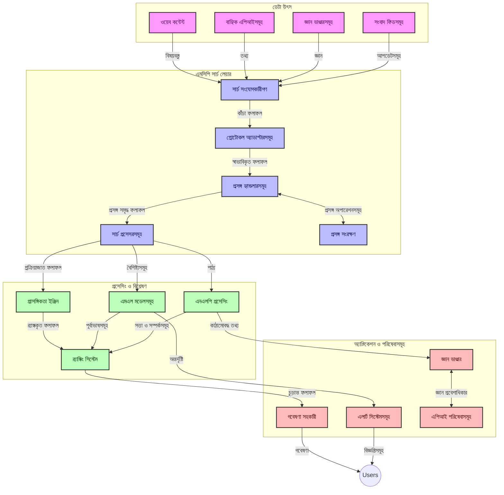
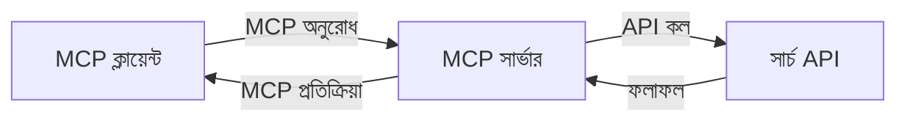
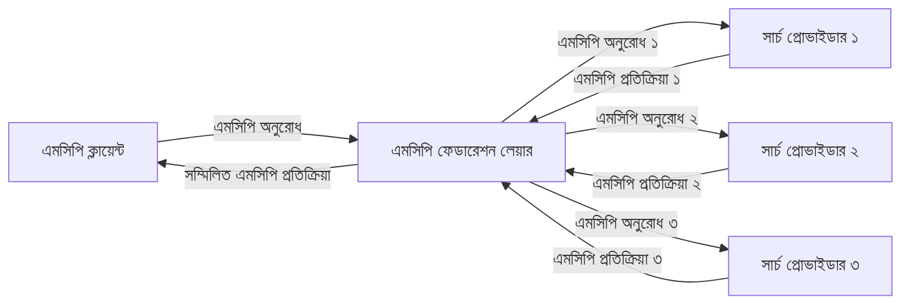
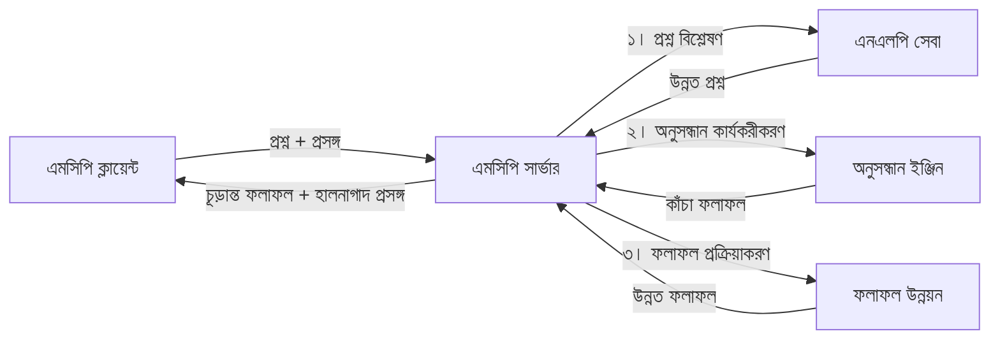

# রিয়েল-টাইম ওয়েব সার্চের জন্য মডেল প্রসঙ্গ প্রোটোকল

## ওভারভিউ

তথ্যনির্ভর বর্তমান পরিবেশে রিয়েল-টাইম ওয়েব সার্চ অপরিহার্য হয়ে উঠেছে, যেখানে অ্যাপ্লিকেশনগুলিকে প্রাসঙ্গিক এবং সময়োপযোগী প্রতিক্রিয়া প্রদানের জন্য ইন্টারনেট জুড়ে সর্বশেষ তথ্যের সঙ্গে অবিলম্বে অ্যাক্সেস করতে হয়। মডেল প্রসঙ্গ প্রোটোকল (MCP) এই রিয়েল-টাইম সার্চ প্রক্রিয়াগুলিকে অপ্টিমাইজ করার ক্ষেত্রে একটি গুরুত্বপূর্ণ অগ্রগতি উপস্থাপন করে, যা সার্চ দক্ষতা বাড়ায়, প্রসঙ্গগত অখণ্ডতা রক্ষা করে এবং সামগ্রিক সিস্টেম কার্যক্ষমতা উন্নত করে।

এই মডিউলটি অনুসন্ধান করবে কিভাবে MCP কৃত্রিম বুদ্ধিমত্তা মডেল, সার্চ ইঞ্জিন এবং অ্যাপ্লিকেশন জুড়ে প্রসঙ্গ ব্যবস্থাপনার একটি মানসম্পন্ন পদ্ধতি প্রদান করে রিয়েল-টাইম ওয়েব সার্চকে রূপান্তর করে।

### আপনি যা শিখবেন

এই বিস্তৃত গাইডে, আপনি জানতে পারবেন:

- MCP কিভাবে AI মডেল এবং রিয়েল-টাইম ওয়েব সার্চ ক্ষমতার মধ্যে একটি সেতু তৈরি করে
- MCP এর মাধ্যমে দক্ষ ও স্কেলেবল সার্চ সমাধান বাস্তবায়নের আর্কিটেকচারাল প্যাটার্ন
- একাধিক প্রশ্ন এবং ইন্টারঅ্যাকশনে সার্চ প্রসঙ্গ সংরক্ষণের কৌশল
- বিভিন্ন সার্চ পরিস্থিতির জন্য পাইথন এবং জাভাস্ক্রিপ্টে ব্যবহারিক কোড বাস্তবায়ন
- MCP-চালিত সার্চ সিস্টেমে প্রাসঙ্গিকতা, সাম্প্রতিকতা এবং পারফরম্যান্সের মধ্যে সঠিক সমতা বজায় রাখার পদ্ধতি

## রিয়েল-টাইম ওয়েব সার্চের পরিচিতি

রিয়েল-টাইম ওয়েব সার্চ একটি প্রযুক্তিগত পন্থা যা ওয়েব ভিত্তিক তথ্যের ধারাবাহিক প্রশ্ন, প্রক্রিয়াকরণ এবং বিশ্লেষণ সক্ষম করে যেমনটি প্রকাশিত বা আপডেট হয়, সিস্টেমগুলিকে ন্যূনতম বিলম্বে নতুন এবং প্রাসঙ্গিক তথ্য প্রদান করতে দেয়। ঐতিহ্যবাহী সার্চ সিস্টেমের বিপরীতে, যা ঘন্টা বা দিন পুরনো সূচীকৃত তথ্যের উপর কাজ করে, রিয়েল-টাইম সার্চ জীবন্ত ওয়েব ডেটা থেকে প্রক্রিয়া করে, যা অনলাইন সামগ্রীর বর্তমান অবস্থা প্রতিফলিত তথ্য এবং অন্তর্দৃষ্টি সরবরাহ করে।

### রিয়েল-টাইম ওয়েব সার্চের মূল ধারণাগুলি:

- **ধারাবাহিক প্রশ্ন প্রক্রিয়াকরণ**: সার্চ প্রশ্নগুলো ক্রমাগত আপডেট হওয়া তথ্য উৎসের বিরুদ্ধে প্রক্রিয়াকৃত হয়
- **সাম্প্রতিকতার প্রাধান্য**: সিস্টেমগুলি নতুন তথ্যকে অগ্রাধিকার দিতে ডিজাইন করা হয়েছে
- **প্রাসঙ্গিকতা ভারসাম্য**: প্রাসঙ্গিকতা এবং সাম্প্রতিকতার মধ্যে ভারসাম্য বজায় রাখা
- **স্কেলযোগ্য আর্কিটেকচার**: সিস্টেমগুলিকে পরিবর্তনশীল প্রশ্ন লোড এবং ডেটা ভলিউম সামলাতে হবে
- **প্রসঙ্গগত বোঝাপড়া**: সার্চ পুনরাবৃত্তিতে ব্যবহারকারীর প্রসঙ্গ বজায় রাখা অর্থবহ ফলাফলের জন্য গুরুত্বপূর্ণ
- **গতিশীল প্রশ্ন পুনর্গঠন**: প্রসঙ্গ এবং পূর্ববর্তী ফলাফল অনুসারে প্রশ্নগুলিকে অভিযোজিতভাবে পরিবর্তন করা
- **বহু-স्रोत সংহতকরণ**: একাধিক সার্চ প্রদানকারী এবং ওয়েব সূত্র থেকে ফলাফল সংযুক্ত করা
- **অর্থগত বোঝাপড়া**: কিওয়ার্ডের বদলে অর্থের ভিত্তিতে প্রশ্ন এবং বিষয়বস্তু প্রক্রিয়াকরণ
- **রিয়েল-টাইম র‍্যাঙ্কিং**: নতুন তথ্য পাওয়া মাত্র ফলাফলের র‌্যাঙ্ক ক্রমাগত সামঞ্জস্য করা

### মডেল প্রসঙ্গ প্রোটোকল এবং রিয়েল-টাইম ওয়েব সার্চ

মডেল প্রসঙ্গ প্রোটোকল (MCP) রিয়েল-টাইম ওয়েব সার্চ পরিবেশে বেশ কয়েকটি গুরুত্বপূর্ণ চ্যালেঞ্জ মোকাবিলা করে:

1. **সার্চ প্রসঙ্গ সংরক্ষণ**: MCP বিতরণকৃত সার্চ উপাদান জুড়ে প্রসঙ্গ বজায় রাখার জন্য মানসম্পন্ন পদ্ধতি তৈরি করে, নিশ্চিত করে যে AI মডেল এবং প্রক্রিয়াকরণ নোডগুলির কাছে প্রাসঙ্গিক প্রশ্ন ইতিহাস এবং ব্যবহারকারীর পছন্দ থাকে।

2. **কার্যকর প্রশ্ন ব্যবস্থাপনা**: প্রসঙ্গ স্থানান্তরের জন্য কাঠামোবদ্ধ পদ্ধতি প্রদান করে, MCP প্রত্যেক সার্চ পুনরাবৃত্তিতে প্রসঙ্গ পুনরাবৃত্তির ওভারহেড কমায়।

3. **অন্তঃসংযোগযোগ্যতা**: MCP বিভিন্ন সার্চ প্রযুক্তি এবং AI মডেলের মধ্যে প্রসঙ্গ ভাগাভাগির জন্য সাধারণ ভাষা তৈরি করে, আরও নমনীয় ও সম্প্রসারিত আর্কিটেকচার সক্ষম করে।

4. **সার্চ-অপ্টিমাইজড প্রসঙ্গ**: MCP বাস্তবায়ন গুলি সবচেয়ে কার্যকর সার্চের জন্য প্রাসঙ্গিক প্রসঙ্গ উপাদান গুলিকে অগ্রাধিকার দিতে পারে, পারফরম্যান্স এবং নির্ভুলতার জন্য উন্নত করে।

5. **অভিযোজিত সার্চ প্রক্রিয়াকরণ**: MCP এর মাধ্যমে যথাযথ প্রসঙ্গ ব্যবস্থাপনার সাহায্যে, সার্চ সিস্টেমগুলি পরিবর্তিত ব্যবহারকারীর চাহিদা এবং তথ্য অবকাঠামোর উপর ভিত্তি করে গতিশীলভাবে প্রক্রিয়াকরণ সমন্বয় করতে পারে।

আধুনিক অ্যাপ্লিকেশনগুলিতে, সংবাদ সংগ্রহ থেকে গবেষণা সহকারী পর্যন্ত, MCP এর ওয়েব সার্চ প্রযুক্তির সাথে সংযোজন আরও বুদ্ধিমত্তাসম্পন্ন, প্রসঙ্গ-সচেতন সার্চ সক্ষম করে যা ব্যবহারকারী ইন্টারঅ্যাকশন চলতে থাকা অবস্থায় ক্রমবর্ধমান প্রাসঙ্গিক ফলাফল প্রদান করতে পারে।

## শিক্ষার উদ্দেশ্য

এই পাঠ শেষে, আপনি সক্ষম হবেন:

- রিয়েল-টাইম ওয়েব সার্চের মৌলিক বিষয় এবং আধুনিক অ্যাপ্লিকেশনে এর চ্যালেঞ্জ বুঝতে
- ব্যাখ্যা করতে কিভাবে মডেল প্রসঙ্গ প্রোটোকল (MCP) রিয়েল-টাইম ওয়েব সার্চ ক্ষমতা উন্নত করে
- জনপ্রিয় ফ্রেমওয়ার্ক এবং API ব্যবহার করে MCP-ভিত্তিক সার্চ সমাধান বাস্তবায়ন করতে
- MCP এর সঙ্গে স্কেলযোগ্য, উচ্চ কার্যকর সার্চ আর্কিটেকচার ডিজাইন এবং মোতায়েন করতে
- MCP ধারণাগুলি বিভিন্ন ব্যবহারের ক্ষেত্রে যেমন অর্থগত সার্চ, গবেষণা সহায়তা এবং AI-Augmented ব্রাউজিং এ প্রয়োগ করতে
- MCP-ভিত্তিক সার্চ প্রযুক্তিতে উদীয়মান প্রবণতা এবং ভবিষ্যত উদ্ভাবন মূল্যায়ন করতে
- ব্যবহারকারী ইন্টারঅ্যাকশন থেকে শেখার জন্য প্রসঙ্গ-সচেতন সার্চ সিস্টেমগুলি উন্নয়ন করতে
- MCP প্রোটোকল ব্যবহার করে AI সহকারীতেও ওয়েব সার্চ ক্ষমতা সংহত করতে
- প্রসঙ্গ অনুসারে ক্রমাগত ফলাফল উন্নত করতে বহু-পর্যায়ের সার্চ পাইপলাইন তৈরি করতে
- প্রসঙ্গ সচেতনতা বজায় রেখে সার্চ পারফরম্যান্স অপটিমাইজ করতে

### সংজ্ঞা এবং তাৎপর্য

রিয়েল-টাইম ওয়েব সার্চ হল ধারাবাহিকভাবে প্রশ্ন করা, অনুসন্ধান এবং ওয়েব ভিত্তিক তথ্য সরবরাহ যা ন্যূনতম বিলম্বে হয়। ঐতিহ্যবাহী সার্চ ইঞ্জিনগুলি নির্দিষ্ট সময় অন্তর ওয়েব ক্রল ও সূচীকরণ করে, যেখানে রিয়েল-টাইম সার্চ তথ্য পাওয়া মাত্র উপস্থিত করার লক্ষ্যে কাজ করে সর্বাধিক সাম্প্রতিক সামগ্রীতে অবিলম্বে প্রবেশাধিকার নিশ্চিত করতে।

রিয়েল-টাইম ওয়েব সার্চের মূল বৈশিষ্ট্যগুলি অন্তর্ভুক্ত:

- **তাজাতা**: সাম্প্রতিক সামগ্রী এবং আপডেট অগ্রাধিকার দেওয়া
- **ধারাবাহিক প্রক্রিয়াকরণ**: নতুন তথ্যের জন্য ক্রমাগত পর্যবেক্ষণ
- **প্রশ্ন অভিযোজন**: প্রসঙ্গ এবং প্রতিক্রিয়ার ভিত্তিতে সার্চ প্রশ্ন পরিমার্জন
- **অবিলম্বে সরবরাহ**: ন্যূনতম বিলম্বে সার্চ ফলাফল প্রদান
- **প্রসঙ্গ ধারণা**: উন্নত প্রাসঙ্গিকতার জন্য পূর্ববর্তী প্রশ্নের উপর ভিত্তি করে

### ঐতিহ্যবাহী ওয়েব সার্চের চ্যালেঞ্জসমূহ

ঐতিহ্যবাহী ওয়েব সার্চ পদ্ধতিগুলি রিয়েল-টাইম পরিস্থিতিতে প্রয়োগ করলে বেশ কয়েকটি সীমাবদ্ধতার সম্মুখীন হয়:

1. **প্রসঙ্গ খণ্ডন**: একাধিক প্রশ্ন জুড়ে সার্চ প্রসঙ্গ বজায় রাখতে কষ্টকর
2. **তথ্যের তাজাতা**: সর্বশেষ তথ্য অ্যাক্সেস এবং অগ্রাধিকার দেওয়ার চ্যালেঞ্জ
3. **সংহতকরণের জটিলতা**: সার্চ সিস্টেম এবং অ্যাপ্লিকেশনগুলির মধ্যে আন্তঃক্রিয়ার সমস্যা
4. **বিলম্ব সমস্যা**: পূর্ণাঙ্গ সার্চ এবং প্রতিক্রিয়া সময়ের মধ্যে ভারসাম্য সাধন
5. **প্রাসঙ্গিকতা টিউনিং**: সাম্প্রতিকতা অগ্রাধিকার দেওয়ার সময় নির্ভুলতা ও প্রাসঙ্গিকতা নিশ্চিতকরণ

## সার্চের জন্য মডেল প্রসঙ্গ প্রোটোকল (MCP) বোঝা

### সার্চ প্রসঙ্গে MCP কী?

মডেল প্রসঙ্গ প্রোটোকল (MCP) একটি মানসম্মত যোগাযোগ প্রোটোকল যা AI মডেল এবং অ্যাপ্লিকেশনগুলির মধ্যে কার্যকর আন্তঃক্রিয়া সহজতর করার জন্য ডিজাইন করা হয়েছে। রিয়েল-টাইম ওয়েব সার্চ প্রসঙ্গে, MCP একটি ফ্রেমওয়ার্ক প্রদান করে:

- সার্চ প্রসঙ্গ প্রশ্ন ক্রম জুড়ে সংরক্ষণ করা
- সার্চ প্রশ্ন এবং ফলাফলের বিন্যাস মানসম্পন্ন করা
- সার্চ প্যারামিটার এবং ফলাফল প্রেরণ অপ্টিমাইজ করা
- মডেল থেকে সার্চ ইঞ্জিন কমিউনিকেশন উন্নত করা

### মূল উপাদান এবং আর্কিটেকচার

রিয়েল-টাইম ওয়েব সার্চের জন্য MCP আর্কিটেকচারে কয়েকটি প্রধান উপাদান রয়েছে:

1. **কোয়েরি প্রসঙ্গ হ্যান্ডলার**: একাধিক প্রশ্ন জুড়ে সার্চ প্রসঙ্গ পরিচালনা ও রক্ষা করে
2. **সার্চ প্রসেসর**: প্রসঙ্গ-সচেতন কৌশল ব্যবহার করে আসন্ন সার্চ অনুরোধগুলি প্রক্রিয়া করে
3. **প্রোটোকল অ্যাডাপ্টার**: ভিন্ন সার্চ API গুলির মধ্যে রূপান্তর করে প্রসঙ্গ সংরক্ষণ করে
4. **প্রসঙ্গ সংরক্ষণাগার**: দক্ষতার সঙ্গে সার্চ ইতিহাস এবং পছন্দ সংরক্ষণ ও পুনরুদ্ধার করে
5. **সার্চ কানেক্টর**: বিভিন্ন সার্চ ইঞ্জিন এবং ওয়েব API এর সাথে সংযোগ করে



### MCP কিভাবে রিয়েল-টাইম ওয়েব সার্চ উন্নত করে

MCP ঐতিহ্যবাহী ওয়েব সার্চের চ্যালেঞ্জগুলি মোকাবিলা করে:

- **প্রসঙ্গগত ধারাবাহিকতা**: সার্চ সেশনের পুরো সময় প্রশ্নগুলির মধ্যে সম্পর্ক রক্ষা করা
- **অপ্টিমাইজড প্রেরণ**: বুদ্ধিমান প্রসঙ্গ ব্যবস্থাপনার মাধ্যমে সার্চ প্যারামিটারে অতিরিক্ততা কমানো
- **মানসম্মত ইন্টারফেস**: সার্চ উপাদানগুলির জন্য সঙ্গতিপূর্ণ API প্রদান
- **লো ল্যাটেন্সি**: দক্ষ প্রসঙ্গ পরিচালনার মাধ্যমে প্রক্রিয়াকরণ ওভারহেড হ্রাস
- **উন্নত প্রাসঙ্গিকতা**: একাধিক প্রশ্ন জুড়ে ব্যবহারকারীর উদ্দেশ্য সংরক্ষণ করে সার্চ প্রাসঙ্গিকতা বৃদ্ধি

## সংহতকরণ এবং বাস্তবায়ন

রিয়েল-টাইম ওয়েব সার্চ সিস্টেমগুলি পারফরম্যান্স এবং প্রসঙ্গগত অখণ্ডতা বজায় রাখতে যত্নশীল আর্কিটেকচারাল ডিজাইন এবং বাস্তবায়ন প্রয়োজন। মডেল প্রসঙ্গ প্রোটোকল AI মডেল এবং সার্চ প্রযুক্তি সংহত করার জন্য মানসম্মত পদ্ধতি প্রদান করে, যা আরও বুদ্ধিমান, প্রসঙ্গ-সচেতন সার্চ পাইপলাইনগুলো সম্ভব করে তোলে।

### সার্চ আর্কিটেকচারে MCP সংহতকরণের ওভারভিউ

রিয়েল-টাইম ওয়েব সার্চ পরিবেশে MCP বাস্তবায়ন সম্পর্কিত কিছু মূল বিষয়:

1. **সার্চ প্রসঙ্গ সিরিয়ালাইজেশন**: MCP সার্চ অনুরোধ জুড়ে প্রসঙ্গ তথ্য সংরক্ষণের জন্য দক্ষ পদ্ধতি প্রদান করে, নিশ্চিত করে যে অপরিহার্য প্রসঙ্গ সম্পূর্ণ প্রক্রিয়াকরণ পাইপলাইনের মধ্য দিয়ে প্রশ্নের সঙ্গে বহন হয়। এতে সার্চ-সম্পর্কিত মেটাডেটার জন্য অপ্টিমাইজড মানসম্মত সিরিয়ালাইজেশন ফরম্যাট অন্তর্ভুক্ত।

2. **স্টেটফুল সার্চ প্রক্রিয়াকরণ**: MCP ধারাবাহিক প্রসঙ্গ প্রতিনিধিত্ব বজায় রেখে আরও বুদ্ধিমান স্টেটফুল প্রক্রিয়াকরণ সক্ষম করে। এটি বিশেষ করে বহু-পর্যায় সার্চ পাইপলাইনে মূল্যবান যেখানে প্রসঙ্গ পরিমার্জন ফলাফল উন্নত করে।

3. **কোয়েরি সম্প্রসারণ এবং পরিমার্জন**: MCP বাস্তবায়ন সার্চ সিস্টেমগুলিতে সঞ্চিত প্রসঙ্গের ভিত্তিতে পরিশীলিত কোয়েরি সম্প্রসারণ ও পরিমার্জন করে, সার্চ সেশন এগিয়ে যাওয়ার সাথে সাথে ক্রমবর্ধমান প্রাসঙ্গিক ফলাফল প্রদান সম্ভব করে।

4. **ফলাফল ক্যাশিং এবং অগ্রাধিকার নির্ধারণ**: MCP প্রসঙ্গ পরিচালনাকে মানসম্মত করে ফলাফল ক্যাশিং ও অগ্রাধিকার ব্যবস্থাপনায় সাহায্য করে, উপাদানগুলোকে পরিবর্তনশীল সার্চ প্রসঙ্গের ওপর ভিত্তি করে অভিযোজিত হতে দেয়।

5. **সার্চ ফেডারেশন এবং একতারকরণ**: MCP কাঠামোবদ্ধ সার্চ প্রসঙ্গ উপস্থাপনা সরবরাহের মাধ্যমে একাধিক ব্যাকেন্ড জুড়ে আরো জটিল ফেডারেশনকে সহজ করে, বিভিন্ন উৎস থেকে ফলাফলগুলো অর্থবহভাবে একত্রিত করা সম্ভব করে।

বিভিন্ন সার্চ প্রযুক্তিতে MCP বাস্তবায়নের ফলে প্রসঙ্গ ব্যবস্থাপনার জন্য একটি ঐক্যবদ্ধ পদ্ধতি তৈরি হয়, যা কাস্টম সংহতকরণ কোডের প্রয়োজন কমায় এবং সার্চ প্রশ্নের বিকাশের সাথে অর্থবহ প্রসঙ্গ ধরে রাখার সিস্টেমের ক্ষমতা বাড়ায়।

### বিভিন্ন ওয়েব সার্চ বাস্তবায়নে MCP

এই উদাহরণগুলি বর্তমানে MCP স্পেসিফিকেশনের অনুসরণ করে যা একটি JSON-RPC ভিত্তিক প্রোটোকলকে আলাদা পরিবহন পদ্ধতির সঙ্গে কেন্দ্র করে। কোডটি দেখায় কিভাবে আপনি সম্পূর্ণ MCP প্রোটোকলের সামঞ্জস্য বজায় রেখে কাস্টম সার্চ সংমিশ্রণ বাস্তবায়ন করতে পারেন।


<details>
<summary>জেনেরিক সার্চ API সহ পাইথন বাস্তবায়ন</summary>

```python
import asyncio
import json
import aiohttp
from typing import Dict, Any, Optional, List
from contextlib import asynccontextmanager
from collections.abc import AsyncIterator

# স্ট্যান্ডার্ড MCP লাইব্রেরি আমদানি করুন
from mcp.client.session import ClientSession
from mcp.client.streamable_http import streamablehttp_client
from mcp.types import TextContent, CreateMessageRequestParams, CreateMessageResult
from mcp.server.fastmcp import FastMCP

# ওয়েব সার্চের জন্য একটি FastMCP সার্ভার তৈরি করুন
search_server = FastMCP("WebSearch")

# ওয়েব সার্চ অপারেশনগুলি পরিচালনার জন্য ক্লাস
class WebSearchHandler:
    def __init__(self, api_endpoint: str, api_key: str):
        self.api_endpoint = api_endpoint
        self.api_key = api_key
        self.session = None
        
    async def initialize(self):
        """Initialize the HTTP session"""
        self.session = aiohttp.ClientSession(
            headers={"Authorization": f"Bearer {self.api_key}"}
        )
    
    async def close(self):
        """Close the HTTP session"""
        if self.session:
            await self.session.close()
            
    async def perform_search(self, query: str, max_results: int = 5, 
                           include_domains: List[str] = None, 
                           exclude_domains: List[str] = None,
                           time_period: str = "any") -> Dict[str, Any]:
        """Perform web search using the search API"""
        # সার্চ প্যারামিটার তৈরি করুন
        search_params = {
            "q": query,
            "limit": max_results,
            "time": time_period
        }
        
        if include_domains:
            search_params["site"] = ",".join(include_domains)
            
        if exclude_domains:
            search_params["exclude_site"] = ",".join(exclude_domains)
        
        # সার্চ অনুরোধ সম্পাদন করুন
        try:
            async with self.session.get(
                self.api_endpoint,
                params=search_params
            ) as response:
                if response.status != 200:
                    error_text = await response.text()
                    raise Exception(f"Search API error: {response.status} - {error_text}")
                
                search_data = await response.json()
                
                # API-সুনির্দিষ্ট প্রতিক্রিয়া একটি স্ট্যান্ডার্ড ফরম্যাটে রূপান্তর করুন
                results = []
                for item in search_data.get("results", []):
                    results.append({
                        "title": item.get("title", ""),
                        "url": item.get("url", ""),
                        "snippet": item.get("snippet", ""),
                        "date": item.get("published_date", ""),
                        "source": item.get("source", "")
                    })
                
                return {
                    "query": query,
                    "totalResults": len(results),
                    "results": results
                }
        except Exception as e:
            print(f"Search API request error: {e}")
            raise

# সার্চ হ্যান্ডলার ইনিশিয়ালাইজ করুন
search_handler = WebSearchHandler(
    api_endpoint="https://api.search-service.example/search",
    api_key="your-api-key-here"
)

# সার্চ হ্যান্ডলার পরিচালনার জন্য lifespan সেট আপ করুন
@asyncio.asynccontextmanager
async def app_lifespan(server: FastMCP):
    """Manage application lifecycle"""
    await search_handler.initialize()
    try:
        yield {"search_handler": search_handler}
    finally:
        await search_handler.close()

# সার্ভারের জন্য lifespan সেট করুন
search_server = FastMCP("WebSearch", lifespan=app_lifespan)

# একটি ওয়েব সার্চ টুল নিবন্ধন করুন
@search_server.tool()
async def web_search(query: str, max_results: int = 5, 
                   include_domains: List[str] = None,
                   exclude_domains: List[str] = None,
                   time_period: str = "any") -> Dict[str, Any]:
    """
    Search the web for information
    
    Args:
        query: The search query
        max_results: Maximum number of results to return (default: 5)
        include_domains: List of domains to include in search results
        exclude_domains: List of domains to exclude from search results
        time_period: Time period for results ("day", "week", "month", "any")
        
    Returns:
        Dictionary containing search results
    """
    ctx = search_server.get_context()
    search_handler = ctx.request_context.lifespan_context["search_handler"]
    
    results = await search_handler.perform_search(
        query=query,
        max_results=max_results,
        include_domains=include_domains,
        exclude_domains=exclude_domains,
        time_period=time_period
    )
    
    return results

# উদাহরণ ক্লায়েন্ট ব্যবহার
async def client_example():
    # Streamable HTTP ট্রান্সপোর্ট ব্যবহার করে সার্চ সার্ভারের সাথে সংযুক্ত করুন
    async with streamablehttp_client("http://localhost:8000/mcp") as (read, write, _):
        async with ClientSession(read, write) as session:
            # সংযোগ ইনিশিয়ালাইজ করুন
            await session.initialize()
            
            # ওয়েব_সার্চ টুল কল করুন
            search_results = await session.call_tool(
                "web_search", 
                {
                    "query": "latest developments in AI and Model Context Protocol",
                    "max_results": 5,
                    "time_period": "day",
                    "include_domains": ["github.com", "microsoft.com"]
                }
            )
            
            print(f"Search results: {search_results}")

# সার্ভার চালানোর উদাহরণ
if __name__ == "__main__":
    # Streamable HTTP ট্রান্সপোর্ট দিয়ে সার্ভার চালান
    search_server.run(transport="streamable-http")
```
</details> 

<details>
<summary>ব্রাউজার-ভিত্তিক সার্চ সহ জাভাস্ক্রিপ্ট বাস্তবায়ন</summary>


```javascript
// ওয়েব অনুসন্ধানের জন্য MCP সার্ভার বাস্তবায়ন
import { McpServer, ResourceTemplate } from '@modelcontextprotocol/sdk/server/mcp.js';
import { StreamableHTTPServerTransport } from '@modelcontextprotocol/sdk/server/streamableHttp.js';
import { z } from 'zod';

// ওয়েব অনুসন্ধানের জন্য MCP সার্ভার তৈরি করুন
const searchServer = new McpServer({
    name: "BrowserSearch",
    description: "A server that provides web search capabilities"
});

// অনুসন্ধান সার্ভিস ক্লাস
class SearchService {
    constructor(searchApiUrl, apiKey) {
        this.searchApiUrl = searchApiUrl;
        this.apiKey = apiKey;
    }

    async performSearch(parameters) {
        const {
            query = '',
            maxResults = 5,
            includeDomains = [],
            excludeDomains = [],
            timePeriod = 'any'
        } = parameters;
        
        // প্যারামিটার সহ অনুসন্ধান URL নির্মাণ করুন
        const url = new URL(this.searchApiUrl);
        url.searchParams.append('q', query);
        url.searchParams.append('limit', maxResults);
        url.searchParams.append('time', timePeriod);
        
        if (includeDomains.length > 0) {
            url.searchParams.append('site', includeDomains.join(','));
        }
        
        if (excludeDomains.length > 0) {
            url.searchParams.append('exclude_site', excludeDomains.join(','));
        }
        
        try {
            const response = await fetch(url.toString(), {
                method: 'GET',
                headers: {
                    'Authorization': `Bearer ${this.apiKey}`,
                    'Content-Type': 'application/json'
                }
            });
            
            if (!response.ok) {
                const errorText = await response.text();
                throw new Error(`Search API error: ${response.status} - ${errorText}`);
            }
            
            const searchData = await response.json();
            
            // API-বিশেষ প্রতিক্রিয়াকে একটি মানক ফরম্যাটে রূপান্তর করুন
            const results = searchData.results?.map(item => ({
                title: item.title || '',
                url: item.url || '',
                snippet: item.snippet || '',
                date: item.published_date || '',
                source: item.source || ''
            })) || [];
            
            return {
                query,
                totalResults: results.length,
                results
            };
        } catch (error) {
            console.error('Search API request error:', error);
            throw error;
        }
    }
}

// অনুসন্ধান সার্ভিস শুরু করুন
const searchService = new SearchService(
    'https://api.search-service.example/search',
    'your-api-key-here'
);

// সার্ভারের জন্য প্রসঙ্গ প্রদানকারী সেটআপ করুন
searchServer.setContextProvider(() => {
    return {
        searchService
    };
});

// ওয়েব অনুসন্ধান টুল নিবন্ধন করুন
searchServer.tool({
    name: 'web_search',
    description: 'Search the web for information',
    parameters: {
        type: 'object',
        properties: {
            query: {
                type: 'string',
                description: 'The search query'
            },
            maxResults: {
                type: 'integer',
                description: 'Maximum number of results to return',
                default: 5
            },
            includeDomains: {
                type: 'array',
                items: { type: 'string' },
                description: 'List of domains to include in search results'
            },
            excludeDomains: {
                type: 'array',
                items: { type: 'string' },
                description: 'List of domains to exclude from search results'
            },
            timePeriod: {
                type: 'string',
                description: 'Time period for results',
                enum: ['day', 'week', 'month', 'any'],
                default: 'any'
            }
        },
        required: ['query']
    },
    handler: async (params, context) => {
        const { searchService } = context;
        return await searchService.performSearch(params);
    }
});

// অনুসন্ধান সার্ভারের সাথে সংযোগ করার উদাহরণ ক্লায়েন্ট কোড
import { Client } from '@modelcontextprotocol/sdk/client/index.js';
import { StreamableHTTPClientTransport } from '@modelcontextprotocol/sdk/client/streamableHttp.js';

async function connectToSearchServer() {
    // অনুসন্ধান সার্ভারের সাথে সংযোগ করুন
    const transport = new StreamableHTTPClientTransport(
        new URL('http://localhost:8000/mcp')
    );
    
    const client = new Client({
        name: 'search-client',
        version: '1.0.0'
    });
    
    await client.connect(transport);
    
    // অনুসন্ধান টুল চালান
    const searchResults = await client.callTool({
        name: 'web_search',
        arguments: {
            query: 'Model Context Protocol implementation examples',
            maxResults: 10,
            timePeriod: 'week',
            includeDomains: ['github.com', 'docs.microsoft.com']
        }
    });
    
    console.log('Search results:', searchResults);
    
    // পরিষ্কার করুন
    await client.disconnect();
}

// সার্ভার শুরু করুন
const transport = new StreamableHTTPServerTransport();
await searchServer.connect(transport);
console.log('Search server running at http://localhost:8000/mcp');

// একটি পৃথক প্রক্রিয়ায় বা সার্ভার শুরু হওয়ার পরে
// connectToSearchServer().catch(console.error);
```
</details> 


## কোড উদাহরণের অস্বীকৃতি

> **গুরুত্বপূর্ণ নোট**: নিম্নলিখিত কোড উদাহরণগুলি মডেল প্রসঙ্গ প্রোটোকল (MCP) কে ওয়েব সার্চ কার্যকারিতার সঙ্গে সংহত করার অভ্যাস প্রদর্শন করে। যদিও এগুলি অফিসিয়াল MCP SDK গুলির প্যাটার্ন ও কাঠামো অনুসরণ করে, শিক্ষা উদ্দেশ্যে সেগুলি সরলীকৃত হয়েছে।
> 
> এই উদাহরণগুলি প্রদর্শন করে:
> 
> 1. **পাইথন বাস্তবায়ন**: একটি FastMCP সার্ভার বাস্তবায়ন যা একটি ওয়েব সার্চ টুল প্রদান করে এবং একটি বাহ্যিক সার্চ API এর সঙ্গে সংযোগ করে। এই উদাহরণটি যথাযথ জীবনকাল ব্যবস্থাপনা, প্রসঙ্গ হ্যান্ডলিং এবং সরঞ্জাম বাস্তবায়ন প্রদর্শন করে যা [অফিসিয়াল MCP পাইথন SDK](https://github.com/modelcontextprotocol/python-sdk) এর প্যাটার্ন অনুসরণ করে। সার্ভার সুপারিশকৃত Streamable HTTP পরিবহন ব্যবহার করে যা উৎপাদন মোতায়েনের জন্য পুরানো SSE পরিবহনকে প্রতিস্থাপিত করেছে।
> 
> 2. **জাভাস্ক্রিপ্ট বাস্তবায়ন**: [অফিসিয়াল MCP টাইপস্ক্রিপ্ট SDK](https://github.com/modelcontextprotocol/typescript-sdk) থেকে FastMCP প্যাটার্ন ব্যবহার করে একটি টাইপস্ক্রিপ্ট/জাভাস্ক্রিপ্ট বাস্তবায়ন, যা যথাযথ সরঞ্জাম সংজ্ঞা এবং ক্লায়েন্ট সংযোগ সহ একটি সার্চ সার্ভার তৈরি করে। এটি সেশন ব্যবস্থাপনা এবং প্রসঙ্গ সংরক্ষণের সর্বশেষ সুপারিশকৃত প্যাটার্ন অনুসরণ করে।
> 
> এই উদাহরণগুলির জন্য উৎপাদন ব্যবহারের জন্য অতিরিক্ত ত্রুটি হ্যান্ডলিং, প্রমাণীকরণ এবং নির্দিষ্ট API সংহতকরণ কোডের প্রয়োজন হবে। প্রদর্শিত সার্চ API এন্ডপয়েন্টগুলি (`https://api.search-service.example/search`) প্লেসহোল্ডার এবং প্রকৃত সার্চ সার্ভিস এন্ডপয়েন্ট দিয়ে প্রতিস্থাপন করা প্রয়োজন।
> 
> পূর্ণ বাস্তবায়ন বিবরণ এবং সর্বশেষ পদ্ধতিগুলোর জন্য,
> দেখুন [অফিসিয়াল MCP স্পেসিফিকেশন](https://modelcontextprotocol.io/specification/2026-07-28/)
> এবং SDK ডকুমেন্টেশন।

## মূল ধারণাগুলি

### মডেল প্রসঙ্গ প্রোটোকল (MCP) ফ্রেমওয়ার্ক

এর ভিত্তিতে, মডেল প্রসঙ্গ প্রোটোকল AI মডেল, অ্যাপ্লিকেশন এবং সেবাগুলোর মধ্যে প্রসঙ্গ বিনিময়ের জন্য একটি মানসম্মত উপায় প্রদান করে। রিয়েল-টাইম ওয়েব সার্চে, এই ফ্রেমওয়ার্ক সুসংগত, বহু-পর্যায়ের সার্চ অভিজ্ঞতা তৈরি করার জন্য অপরিহার্য। প্রধান উপাদানগুলো হল:

1. **ক্লায়েন্ট-সার্ভার আর্কিটেকচার**: MCP সার্চ ক্লায়েন্ট (অনুরোধকারী) এবং সার্চ সার্ভার (প্রদানকারী) এর মধ্যে স্পষ্ট পৃথকতা প্রতিষ্ঠা করে, নমনীয় মোতায়েন মডেল সম্ভব করে।

2. **JSON-RPC যোগাযোগ**: প্রোটোকলটি JSON-RPC ব্যবহার করে বার্তা বিনিময় করে, যা ওয়েব প্রযুক্তির সঙ্গে সামঞ্জস্যপূর্ণ এবং বিভিন্ন প্ল্যাটফর্মে বাস্তবায়ন সহজতর করে।

3. **প্রসঙ্গ ব্যবস্থাপনা**: MCP একাধিক ইন্টারঅ্যাকশন জুড়ে সার্চ প্রসঙ্গ বজায় রাখা, আপডেট এবং ব্যবহার করার জন্য কাঠামোবদ্ধ পদ্ধতি সংজ্ঞায়িত করে।

4. **টুল সংজ্ঞা**: সার্চ ক্ষমতাগুলিকে মানসম্মত সরঞ্জাম হিসেবে প্রকাশ করা হয়, সুন্দরভাবে সংজ্ঞায়িত প্যারামিটার এবং রিটার্ন ভ্যালু সহ।

5. **স্ট্রিমিং সহায়তা**: প্রোটোকল স্ট্রিমিং ফলাফল সমর্থন করে, যা রিয়েল-টাইম সার্চের জন্য অপরিহার্য যেখানে ফলাফলগুলি পর্যায়ক্রমে পৌঁছে।

### ওয়েব সার্চ সংহতকরণ প্যাটার্নসমূহ

MCP এর সাথে ওয়েব সার্চ একত্রিত করার সময় কিছু প্যাটার্ন দেখা যায়:

#### 1. সরাসরি সার্চ প্রদানকারী সংযোগ



এই প্যাটার্নে MCP সার্ভার সরাসরি এক বা একাধিক সার্চ API এর সঙ্গে ইন্টারফেস করে, MCP অনুরোধগুলো API-নির্দিষ্ট কল এ রূপান্তর করে এবং ফলাফল MCP প্রতিক্রিয়া হিসেবে ফরম্যাট করে।

#### 2. প্রসঙ্গ সংরক্ষণসহ ফেডারেটেড সার্চ



এই প্যাটার্ন সার্চ প্রশ্নগুলো একাধিক MCP-সঙ্গত সার্চ প্রদানকারী জুড়ে বিতরণ করে, প্রতিটি ভিন্ন ধরনের বিষয়বস্তু বা সার্চ ক্ষমতা বিশেষায়িত হতে পারে, যখন একক প্রসঙ্গ বজায় থাকে।

#### 3. প্রসঙ্গ-বর্ধিত সার্চ চেইন



এই প্যাটার্নে, সার্চ প্রক্রিয়াটি বহু-পর্যায় বিভক্ত হয়, প্রতিটি ধাপে প্রসঙ্গ সমৃদ্ধ করা হয়, যার ফলে ক্রমশ প্রাসঙ্গিক ফলাফলগুলো পাওয়া যায়।

### সার্চ প্রসঙ্গ উপাদানসমূহ

MCP-ভিত্তিক ওয়েব সার্চে, প্রসঙ্গ সাধারণত অন্তর্ভুক্ত করে:

- **কোয়েরি ইতিহাস**: সেশনের পূর্ববর্তী সার্চ প্রশ্নসমূহ
- **ব্যবহারকারীর পছন্দসমূহ**: ভাষা, অঞ্চল, সেফ সার্চ সেটিংস
- **ইন্টারঅ্যাকশন ইতিহাস**: কোন ফলাফল ক্লিক করা হয়েছে, ফলাফলে সময় ব্যয়
- **সার্চ প্যারামিটার**: ফিল্টার, সর্ট অর্ডার এবং অন্যান্য সার্চ সংশোধক
- **ডোমেইন জ্ঞান**: সার্চের সাথে সম্পর্কিত বিষয়ভিত্তিক প্রসঙ্গ
- **কালগত প্রসঙ্গ**: সময়-ভিত্তিক প্রাসঙ্গিকতা উপাদান
- **সোর্স পছন্দ**: বিশ্বাসযোগ্য বা প্রাধান্যপ্রাপ্ত তথ্য উৎসসমূহ

## ব্যবহারের ক্ষেত্রে এবং অ্যাপ্লিকেশন

### গবেষণা এবং তথ্য সংগ্রহ

MCP গবেষণা কর্মপ্রবাহকে উন্নত করে:

- সার্চ সেশনের মধ্যে গবেষণা প্রসঙ্গ সংরক্ষণ করে
- আরও উন্নত এবং প্রসঙ্গ-সম্মত প্রশ্ন সক্ষম করে
- বহুসংবাদী সার্চ ফেডারেশন সমর্থন করে
- সার্চ ফলাফল থেকে জ্ঞান আহরণ সহজতর করে

### রিয়েল-টাইম সংবাদ এবং প্রবণতা পর্যবেক্ষণ

MCP-চালিত সার্চ সংবাদ পর্যবেক্ষণ জন্য সুবিধা প্রদান করে:

- উদীয়মান সংবাদ কাহিনী প্রায় রিয়েল-টাইম আবিষ্কার
- প্রাসঙ্গিক তথ্যের প্রাসঙ্গিক ফিল্টারিং
- একাধিক উৎস জুড়ে বিষয় এবং সত্ত্বা অনুসরণ
- ব্যবহারকারীর প্রসঙ্গভিত্তিক ব্যক্তিগতকৃত সংবাদ সতর্কবার্তা

### AI-Augmented ব্রাউজিং এবং গবেষণা

MCP AI-Augmented ব্রাউজিংয়ে নতুন সুযোগ তৈরি করে:

- বর্তমান ব্রাউজার ক্রিয়াকলাপের ভিত্তিতে প্রসঙ্গগত সার্চ প্রস্তাবনা
- LLM-চালিত সহকারী সাথে ওয়েব সার্চের নির্বিঘ্ন সংমিশ্রণ
- প্রসঙ্গ বজায় রেখে বহু-পর্যায়ের সার্চ পরিমার্জন
- উন্নত তথ্য যাচাই এবং সত্যতা নিশ্চিতকরণ

## ভবিষ্যত প্রবণতা এবং উদ্ভাবন

### ওয়েব সার্চে MCP এর বিবর্তন

সামনে তাকিয়ে, আমরা MCP কে নিম্নলিখিত বিষয়গুলি মোকাবিলা করার জন্য বিবর্তন ঘটাতে প্রত্যাশা করি:


- **মাল্টিমোডাল সার্চ**: সংরক্ষিত প্রসঙ্গের সাথে টেক্সট, ইমেজ, অডিও, এবং ভিডিও অনুসন্ধান একত্রীকরণ
- **ডিসেন্ট্রালাইজড সার্চ**: বিতরণকৃত এবং ফেডারেটেড সার্চ ইকোসিস্টেম সমর্থন
- **সার্চ প্রাইভেসি**: প্রসঙ্গ-সচেতন গোপনীয়তা-সংরক্ষণকারী সার্চ মেকানিজম
- **কোয়েরি বোঝাপড়া**: প্রাকৃতিক ভাষার সার্চ কোয়েরির গভীর অর্থপূর্ণ বিশ্লেষণ

### প্রযুক্তিতে সম্ভাব্য অগ্রগতি

উদীয়মান প্রযুক্তি যা MCP সার্চের ভবিষ্যত গঠন করবে:

1. **নিউরাল সার্চ আর্কিটেকচার**: MCP-র জন্য এমবেডিং-ভিত্তিক সার্চ সিস্টেমগুলি অপ্টিমাইজড
2. **ব্যক্তিগতকৃত সার্চ প্রসঙ্গ**: সময়ের সঙ্গে ব্যবহারকারীর সার্চ প্যাটার্ন শেখা
3. **নলেজ গ্রাফ ইন্টিগ্রেশন**: ডোমেন-নির্দিষ্ট জ্ঞান গ্রাফ দ্বারা প্রসঙ্গগত সার্চ উন্নতকরণ
4. **ক্রস-মোডাল প্রসঙ্গ**: বিভিন্ন সার্চ মোডালিটির মধ্যে প্রসঙ্গ বজায় রাখা

## হাতে-কলমে অনুশীলন

### অনুশীলন ১: একটি মৌলিক MCP সার্চ পাইপলাইন সেট আপ করা

এই অনুশীলনে, আপনি শিখবেন কীভাবে:
- একটি মৌলিক MCP সার্চ পরিবেশ কনফিগার করবেন
- ওয়েব সার্চের জন্য প্রসঙ্গ হ্যান্ডলার প্রয়োগ করবেন
- সার্চ পুনরাবৃত্তির মধ্যে প্রসঙ্গ সংরক্ষণ পরীক্ষা ও যাচাই করবেন

### অনুশীলন ২: MCP সার্চ দিয়ে একটি গবেষণা সহকারী নির্মাণ

একটি পূর্ণাঙ্গ অ্যাপ্লিকেশন তৈরি করুন যা:
- প্রাকৃতিক ভাষার গবেষণা প্রশ্ন প্রক্রিয়া করে
- প্রসঙ্গ-সচেতন ওয়েব সার্চ সম্পাদন করে
- একাধিক উৎস থেকে তথ্য সংশ্লেষণ করে
- সংগঠিত গবেষণা ফলাফল উপস্থাপন করে

### অনুশীলন ৩: MCP দিয়ে মাল্টি-সোর্স সার্চ ফেডারেশন বাস্তবায়ন

অগ্রসর অনুশীলন যা অন্তর্ভুক্ত:
- একাধিক সার্চ ইঞ্জিনে প্রসঙ্গ-সচেতন কোয়েরি প্রেরণ
- ফলাফল র ranking ঙ্কিং এবং সংগ্রহ
- সার্চ ফলাফলের প্রসঙ্গগত ডুপ্লিকেশন অপসারণ
- উৎস-নির্দিষ্ট মেটাডেটা পরিচালনা

## অতিরিক্ত সম্পদ

- [Model Context Protocol Specification](https://modelcontextprotocol.io/specification/2026-07-28/) - অফিসিয়াল MCP স্পেসিফিকেশন এবং বিস্তারিত প্রোটোকল ডকুমেন্টেশন
- [Model Context Protocol Documentation](https://modelcontextprotocol.io/) - বিস্তারিত টিউটোরিয়াল এবং বাস্তবায়ন গাইড
- [MCP Python SDK](https://github.com/modelcontextprotocol/python-sdk) - MCP প্রোটোকলের অফিসিয়াল পাইথন ইমপ্লিমেন্টেশন
- [MCP TypeScript SDK](https://github.com/modelcontextprotocol/typescript-sdk) - MCP প্রোটোকলের অফিসিয়াল টাইপস্ক্রিপ্ট ইমপ্লিমেন্টেশন
- [MCP Reference Servers](https://github.com/modelcontextprotocol/servers) - MCP সার্ভারগুলির রেফারেন্স ইমপ্লিমেন্টেশন
- [Bing Web Search API Documentation](https://learn.microsoft.com/en-us/bing/search-apis/bing-web-search/overview) - মাইক্রোসফটের ওয়েব সার্চ এপিআই
- [Google Custom Search JSON API](https://developers.google.com/custom-search/v1/overview) - গুগলের প্রোগ্রামেবল সার্চ ইঞ্জিন
- [SerpAPI Documentation](https://serpapi.com/search-api) - সার্চ ইঞ্জিন রেজাল্ট পেজ এপিআই
- [Meilisearch Documentation](https://www.meilisearch.com/docs) - ওপেন-সোর্স সার্চ ইঞ্জিন
- [Elasticsearch Documentation](https://www.elastic.co/guide/index.html) - বিতরণকৃত সার্চ ও অ্যানালিটিক্স ইঞ্জিন
- [LangChain Documentation](https://python.langchain.com/docs/get_started/introduction) - LLM দিয়ে অ্যাপ্লিকেশন তৈরি করা

## শেখার ফলাফল

এই মডিউল সম্পন্ন করে, আপনি সক্ষম হবেন:

- রিয়েল-টাইম ওয়েব সার্চের মৌলিক বিষয় এবং তার চ্যালেঞ্জগুলো বোঝা
- কীভাবে Model Context Protocol (MCP) রিয়েল-টাইম ওয়েব সার্চ দক্ষতা উন্নত করে তা ব্যাখ্যা করা
- জনপ্রিয় ফ্রেমওয়ার্ক ও এপিআই ব্যবহার করে MCP-ভিত্তিক সার্চ সমাধান প্রয়োগ করা
- MCP দিয়ে স্কেলেবল, উচ্চ-প্রদর্শন ক্ষমতার সার্চ আর্কিটেকচার ডিজাইন এবং ডেপ্লয় করা
- MCP ধারণাকে ব্যবহার করে বিভিন্ন ব্যবহারে প্রয়োগ করা, যেমন সেম্যান্টিক সার্চ, গবেষণা সহায়ক, এবং AI-সাহায্যকৃত ব্রাউজিং
- MCP-ভিত্তিক সার্চ প্রযুক্তিতে উদীয়মান প্রবণতা এবং ভবিষ্যত উদ্ভাবন মূল্যায়ন করা


### বিশ্বাস এবং নিরাপত্তা বিবেচনা

MCP-ভিত্তিক ওয়েব সার্চ সমাধান বাস্তবায়নের সময়, MCP স্পেসিফিকেশন থেকে এই গুরুত্বপূর্ণ নীতিমালা মনে রাখবেন:

1. **ব্যবহারকারীর সম্মতি এবং নিয়ন্ত্রণ**: ব্যবহারকারীদের অবশ্যই স্পষ্টভাবে সম্মতি দিতে হবে এবং সব ডেটা অ্যাক্সেস ও অপারেশন বুঝতে হবে। ওয়েব সার্চ বাস্তবায়নে এটি বিশেষভাবে গুরুত্বপূর্ণ যা বাহ্যিক ডেটা উৎস অ্যাক্সেস করতে পারে।

2. **ডেটা গোপনীয়তা**: সার্চ কোয়েরি এবং ফলাফল যথাযথভাবে পরিচালনা করতে হবে, বিশেষত যখন এতে সংবেদনশীল তথ্য থাকতে পারে। ব্যবহারকারীর তথ্য সুরক্ষায় উপযুক্ত অ্যাক্সেস নিয়ন্ত্রণ প্রয়োগ করুন।

3. **টুল নিরাপত্তা**: সার্চ টুলগুলির জন্য যথাযথ অনুমোদন এবং যাচাই প্রয়োগ করুন, কারণ এগুলো ইচ্ছামতো কোড এক্সিকিউশনের মাধ্যমে সম্ভাব্য সুরক্ষা ঝুঁকি বহন করে। টুলের আচরণের বর্ণনা বিশ্বাসযোগ্য নয় যতক্ষণ না তা বিশ্বস্ত সার্ভার থেকে প্রাপ্ত।

4. **পরিষ্কার ডকুমেন্টেশন**: MCP স্পেসিফিকেশনের বাস্তবায়ন নির্দেশিকা অনুসরণ করে আপনার MCP-ভিত্তিক সার্চ বাস্তবায়নের সক্ষমতা, সীমাবদ্ধতা এবং সুরক্ষা বিবেচনার ব্যাপারে পরিষ্কার ডকুমেন্টেশন প্রদান করুন।

5. **দৃঢ় সম্মতি প্রবাহ**: শক্তিশালী সম্মতি এবং অনুমোদন প্রবাহ তৈরি করুন যা প্রতিটি টুল কী কাজ করে তা স্পষ্টভাবে ব্যাখ্যা করে ব্যবহারকে অনুমোদন করার আগে, বিশেষত যেসব টুল বাহ্যিক ওয়েব সম্পদগুলির সঙ্গে যুক্ত।

MCP নিরাপত্তা এবং বিশ্বাস বিবেচনা সম্পর্কে সম্পূর্ণ বিবরণের জন্য, দেখুন
[অফিসিয়াল ডকুমেন্টেশন](https://modelcontextprotocol.io/specification/2026-07-28/basic/security_best_practices)।

## পরবর্তীতে কী

- [5.12 Entra ID Authentication for Model Context Protocol Servers](../mcp-security-entra/README.md)

---

<!-- CO-OP TRANSLATOR DISCLAIMER START -->
**অস্বীকৃতি**:
এই নথিটি AI অনুবাদ পরিষেবা [Co-op Translator](https://github.com/Azure/co-op-translator) ব্যবহার করে অনূদিত হয়েছে। যদিও আমরা শুদ্ধতার জন্য চেষ্টা করি, অনুগ্রহ করে মনে রাখবেন যে স্বয়ংক্রিয় অনুবাদে ত্রুটি বা অসঙ্গতি থাকতে পারে। মূল নথিটি তার স্বভাষায় কর্তৃত্বপূর্ণ উৎস হিসেবে বিবেচিত হওয়া উচিত। গুরুত্বপূর্ণ তথ্যের জন্য পেশাদার মানব অনুবাদ সুপারিশ করা হয়। এই অনুবাদের ব্যবহারে প্রয়োজনীয় ভুল বোঝাবুঝি বা ভুল ব্যাখ্যার জন্য আমরা দায়বদ্ধ নই।
<!-- CO-OP TRANSLATOR DISCLAIMER END -->