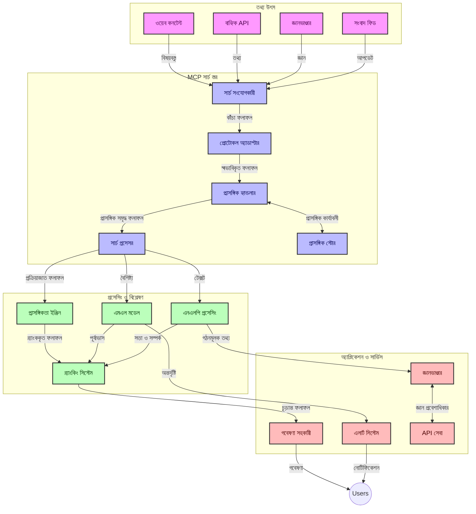
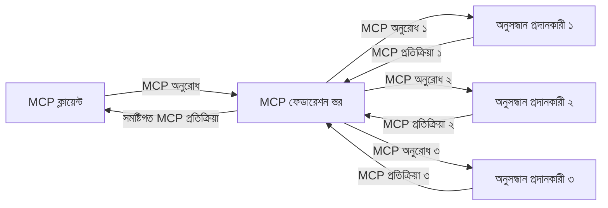
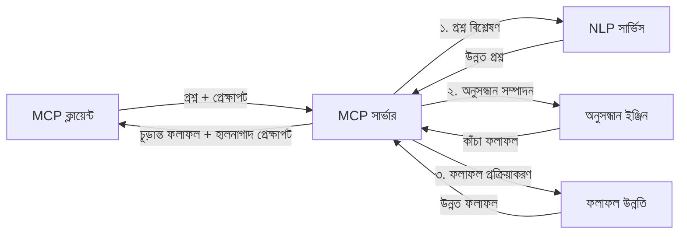

# রিয়েল-টাইম ওয়েব সার্চের জন্য মডেল প্রসঙ্গ প্রোটোকল

## সংক্ষিপ্ত বিবরণ

আজকের তথ্যচালিত পরিবেশে, যেখানে অ্যাপ্লিকেশনগুলিকে ইন্টারনেট জুড়ে সর্বশেষ তথ্যের সঙ্গে অবিলম্বে প্রবেশাধিকার প্রয়োজন প্রাসঙ্গিক এবং সময়োপযোগী প্রতিক্রিয়া প্রদানের জন্য, রিয়েল-টাইম ওয়েব সার্চ অপরিহার্য হয়ে উঠেছে। মডেল প্রসঙ্গ প্রোটোকল (MCP) এই রিয়েল-টাইম সার্চ প্রক্রিয়াগুলিকে অনুকূলিতকরণে একটি উল্লেখযোগ্য অগ্রগতি উপস্থাপন করে, সার্চের দক্ষতা বৃদ্ধি করে, প্রসঙ্গগত অখণ্ডতা বজায় রাখে এবং সামগ্রিক সিস্টেমের কর্মক্ষমতা উন্নত করে।

এই মডিউলটি অন্বেষণ করে কিভাবে MCP AI মডেল, সার্চ ইঞ্জিন এবং অ্যাপ্লিকেশনগুলির মধ্যে প্রসঙ্গ ব্যবস্থাপনায় একটি মানক পদ্ধতি প্রদান করে রিয়েল-টাইম ওয়েব সার্চকে রূপান্তরিত করে।

### যা আপনি শিখবেন

এই বিস্তৃত গাইডটিতে, আপনি জেনে নিবেন:

- কিভাবে MCP AI মডেল এবং রিয়েল-টাইম ওয়েব সার্চ সক্ষমতার মধ্যে একটি অব্যাহত সেতু তৈরি করে
- MCP সহ দক্ষ এবং স্কেলযোগ্য সার্চ সমাধান বাস্তবায়নের আর্কিটেকচারাল প্যাটার্নসমূহ
- একাধিক প্রশ্ন এবং ইন্টারঅ্যাকশনের মধ্যে সার্চ প্রসঙ্গ সংরক্ষণের কৌশলসমূহ
- বিভিন্ন সার্চ পরিস্থিতির জন্য পাইথন এবং জাভাস্ক্রিপ্টে ব্যবহারিক কোড বাস্তবায়ন
- MCP-চালিত সার্চ সিস্টেমে প্রাসঙ্গিকতা, সাম্প্রতিকতা এবং পারফরম্যান্সের ভারসাম্য রক্ষা করার পদ্ধতি

## রিয়েল-টাইম ওয়েব সার্চের পরিচিতি

রিয়েল-টাইম ওয়েব সার্চ একটি প্রযুক্তিগত পদ্ধতি যা ওয়েব-ভিত্তিক তথ্যের অবিরাম প্রশ্ন, প্রক্রিয়াকরণ এবং বিশ্লেষণ সক্ষম করে জানানো বা আপডেট করা হলে, যাতে সিস্টেমগুলি সর্বনিম্ন বিলম্বে নতুন এবং প্রাসঙ্গিক তথ্য সরবরাহ করতে পারে। প্রচলিত সার্চ সিস্টেমের বিপরীতে যা সূচিপত্রভুক্ত তথ্যের উপর কাজ করে যা কয়েক ঘণ্টা বা দিনের পুরনো হতে পারে, রিয়েল-টাইম সার্চ ওয়েব থেকে সোজাসুজি তথ্য প্রক্রিয়াকরণ করে, যা অনলাইনে সামগ্রীর বর্তমান অবস্থার প্রতিফলন করে।

### রিয়েল-টাইম ওয়েব সার্চের মূল ধারণা:

- **অবিচ্ছিন্ন প্রশ্ন প্রক্রিয়াকরণ**: সার্চ প্রশ্নগুলি অবিরত আপডেট হওয়া তথ্য উৎসের বিরুদ্ধে প্রক্রিয়াকরণ করা হয়
- **সাম্প্রতিকতা অগ্রাধিকার**: সিস্টেমগুলি নতুন তথ্যকে অগ্রাধিকার দিতে ডিজাইন করা হয়
- **প্রাসঙ্গিকতার ভারসাম্য**: প্রাসঙ্গিকতা এবং সাম্প্রতিকতার মধ্যে ভারসাম্য রক্ষা করা
- **স্কেলযোগ্য আর্কিটেকচার**: সিস্টেমগুলি পরিবর্তনশীল প্রশ্ন লোড এবং ডেটা ভলিউম মোকাবেলা করতে হবে
- **প্রসঙ্গগত বোঝাপড়া**: অর্থবহ ফলাফলের জন্য সার্চ পুনরাবৃত্তির মধ্য দিয়ে ব্যবহারকারীর প্রসঙ্গ বজায় রাখা গুরুত্বপূর্ণ
- **গতি-সম্প্রসারণ প্রশ্ন পুনর্গঠন**: প্রসঙ্গ এবং পূর্ববর্তী ফলাফলের উপর ভিত্তি করে প্রশ্নগুলিকে অভিযোজিতভাবে পরিবর্তন করা
- **বহু-উৎস সমন্বয়**: একাধিক সার্চ প্রদানকারী এবং ওয়েব উৎস থেকে ফলাফল একত্রিত করা
- **অর্থগত বোঝাপড়া**: শুধুমাত্র কীওয়ার্ডের চেয়ে অর্থের ভিত্তিতে প্রশ্ন এবং সামগ্রী প্রক্রিয়াকরণ
- **রিয়েল-টাইম র‌্যাঙ্কিং**: নতুন তথ্য আসার সঙ্গে সঙ্গে ফলাফলের র‌্যাঙ্কিং ক্রমাগত সামঞ্জস্য করা

### মডেল প্রসঙ্গ প্রোটোকল এবং রিয়েল-টাইম ওয়েব সার্চ

মডেল প্রসঙ্গ প্রোটোকল (MCP) রিয়েল-টাইম ওয়েব সার্চ পরিবেশে বেশ কিছু গুরুত্বপূর্ণ চ্যালেঞ্জ মোকাবেলা করে:

1. **সার্চ প্রসঙ্গ সংরক্ষণ**: MCP একটি মানক পদ্ধতি তৈরি করে কিভাবে প্রসঙ্গ বিতরণকৃত সার্চ উপাদানগুলিতে রক্ষিত হয়, নিশ্চিত করে যে AI মডেল এবং প্রক্রিয়াকরণ নোডগুলি প্রাসঙ্গিক প্রশ্ন ইতিহাস এবং ব্যবহারকারীর পছন্দে অ্যাক্সেস রাখতে পারে।

2. **কার্যকর প্রশ্ন ব্যবস্থাপনা**: প্রসঙ্গ প্রেরণের জন্য কাঠামোবদ্ধ প্রক্রিয়া সরবরাহ করে MCP প্রতিটি সার্চ পুনরাবৃত্তিতে প্রসঙ্গ পুনরাবৃত্তির অতিরিক্ত বোঝা কমায়।

3. **অন্তঃপরিচালনশীলতা**: MCP ভিন্ন সার্চ প্রযুক্তি এবং AI মডেলের মধ্যে প্রসঙ্গ ভাগাভাগির জন্য একটি সাধারণ ভাষা তৈরি করে, আরও নমনীয় এবং সম্প্রসারণযোগ্য আর্কিটেকচার সক্ষম করে।

4. **সার্চ-অপটিমাইজড প্রসঙ্গ**: MCP বাস্তবায়নগুলি এমন প্রসঙ্গ উপাদানগুলিকে অগ্রাধিকার দিতে পারে যা কার্যকর সার্চের জন্য সবচেয়ে প্রাসঙ্গিক, কর্মক্ষমতা এবং নির্ভুলতা উভয়ের জন্য অপ্টিমাইজ করে।

5. **অভিযোজিত সার্চ প্রক্রিয়াকরণ**: MCP-এর মাধ্যমে সঠিক প্রসঙ্গ ব্যবস্থাপনার সাহায্যে, সার্চ সিস্টেম ব্যবহারকারীর পরিবর্তিত প্রয়োজন এবং তথ্য পারিপার্শ্বিকতার উপর ভিত্তি করে গতিময়ভাবে প্রক্রিয়াকরণ সামঞ্জস্য করতে পারে।

সংবাদ একত্রিকরণ থেকে গবেষণা সহকারী পর্যন্ত আধুনিক অ্যাপ্লিকেশনগুলিতে, MCP-এর ওয়েব সার্চ প্রযুক্তির সাথে ইন্টিগ্রেশন আরও বুদ্ধিমান, প্রসঙ্গ-সচেতন সার্চ সক্ষম করে যা ব্যবহারকারীর ইন্টারঅ্যাকশন বৃদ্ধি পাওয়ার সঙ্গে আরও প্রাসঙ্গিক ফলাফল দিতে পারে।

## শেখার উদ্দেশ্যসমূহ

এই পাঠের শেষে, আপনি সক্ষম হবেন:

- রিয়েল-টাইম ওয়েব সার্চের মৌলিক বিষয় এবং আধুনিক অ্যাপ্লিকেশনগুলির চ্যালেঞ্জ বোঝা
- ব্যাখ্যা করা কিভাবে মডেল প্রসঙ্গ প্রোটোকল (MCP) রিয়েল-টাইম ওয়েব সার্চ ক্ষমতাগুলি উন্নত করে
- জনপ্রিয় ফ্রেমওয়ার্ক এবং API ব্যবহার করে MCP-ভিত্তিক সার্চ সমাধান বাস্তবায়ন
- MCP সহ স্কেলযোগ্য, উচ্চ-পারফরম্যান্স সার্চ আর্কিটেকচার ডিজাইন এবং স্থাপন
- MCP ধারণাগুলি বিভিন্ন ব্যবহার ক্ষেত্রে প্রয়োগ যেমন অর্থগত সার্চ, গবেষণা সহায়িকা, এবং AI-সম্প্রসারিত ব্রাউজিং
- MCP-ভিত্তিক সার্চ প্রযুক্তিতে উদীয়মান প্রবণতা এবং ভবিষ্যৎ উদ্ভাবন মূল্যায়ণ
- ব্যবহারকারীর ইন্টারঅ্যাকশন থেকে শিখে প্রসঙ্গ-সচেতন সার্চ সিস্টেম উন্নয়ন
- MCP মানক প্রোটোকলের মাধ্যমে AI সহায়কদের মধ্যে ওয়েব সার্চ সক্ষমতা সংযুক্তকরণ
- প্রসঙ্গের ভিত্তিতে ক্রমানুসারে ফলাফল উন্নত করে বহু-স্তরের সার্চ পাইপলাইন তৈরি
- বিস্তৃত প্রসঙ্গ সচেতনতা বজায় রেখে সার্চ কর্মক্ষমতা অপ্টিমাইজ করা

### সংজ্ঞা এবং তাৎপর্য

রিয়েল-টাইম ওয়েব সার্চের মধ্যে অন্তর্ভুক্ত হলো অবিরাম প্রশ্ন, পুনরুদ্ধার এবং সর্বনিম্ন বিলম্বে ওয়েব-ভিত্তিক তথ্যের প্রেরণ। ঐতিহ্যবাহী সার্চ ইঞ্জিন যা সময়ে সময়ে ওয়েব ক্রল ও সূচিপত্র তৈরি করে তার থেকে আলাদা, রিয়েল-টাইম সার্চ তথ্য যত তাড়াতাড়ি পাওয়া যায় তা প্রকাশ করতে চেষ্টা করে, যার ফলে সর্বাধিক সাম্প্রতিক সামগ্রীতে অবিলম্বে প্রবেশাধিকার সম্ভব হয়।

রিয়েল-টাইম ওয়েব সার্চের মূল বৈশিষ্ট্যসমূহ অন্তর্ভুক্ত:

- **তাজা**: সাম্প্রতিক সামগ্রী এবং আপডেটকে অগ্রাধিকার দেয়া
- **অবিচ্ছিন্ন প্রক্রিয়াকরণ**: নতুন তথ্যের জন্য ক্রমাগত পর্যবেক্ষণ করা
- **প্রশ্ন অভিযোজন**: প্রসঙ্গ এবং প্রতিক্রিয়ার ভিত্তিতে সার্চ প্রশ্ন উন্নত করা
- **অবিলম্বে প্রেরণ**: সর্বনিম্ন বিলম্বে সার্চ ফলাফল প্রদান
- **প্রসঙ্গ রক্ষা**: উন্নত প্রাসঙ্গিকতার জন্য পূর্ববর্তী প্রশ্নের উপর ভিত্তি করে গঠন

### ঐতিহ্যবাহী ওয়েব সার্চের চ্যালেঞ্জসমূহ

ঐতিহ্যবাহী ওয়েব সার্চ পদ্ধতিগুলো রিয়েল-টাইম সার্চ পরিস্থিতিতে প্রয়োগ করার সময় বেশ কিছু সীমাবদ্ধতার মুখোমুখি হয়:

1. **প্রসঙ্গের বিচ্ছিন্নতা**: একাধিক প্রশ্নের মধ্যে সার্চ প্রসঙ্গ বজায় রাখার অসুবিধা
2. **তথ্যের তাজা অবস্থা**: সর্বশেষ তথ্য অ্যাক্সেস এবং অগ্রাধিকার দেওয়ার চ্যালেঞ্জ
3. **সমন্বয় জটিলতা**: সার্চ সিস্টেম এবং অ্যাপ্লিকেশনগুলির মধ্যে আন্তঃপরিচালন প্রক্রিয়ার সমস্যা
4. **বিলম্ব সমস্যা**: প্রায়োগিক সময়ের সঙ্গে বিস্তৃত সার্চের ভারসাম্য
5. **প্রাসঙ্গিকতা সামঞ্জস্য**: সাম্প্রতিকতাকে অগ্রাধিকার দেওয়ার সাথে সাথে নির্ভুলতা ও প্রাসঙ্গিকতা নিশ্চিতকরণ

## সার্চের জন্য মডেল প্রসঙ্গ প্রোটোকল (MCP) বোঝা

### সার্চ প্রসঙ্গে MCP কী?

মডেল প্রসঙ্গ প্রোটোকল (MCP) একটি মানক যোগাযোগ প্রোটোকল যা AI মডেল এবং অ্যাপ্লিকেশনগুলির মধ্যে দক্ষ ইন্টারঅ্যাকশন সহজতর করার জন্য ডিজাইন করা হয়েছে। রিয়েল-টাইম ওয়েব সার্চ প্রসঙ্গে, MCP নিম্নলিখিত ফ্রেমওয়ার্ক প্রদান করে:

- সার্চ প্রসঙ্গ সারিতে সংরক্ষণ করা
- সার্চ প্রশ্ন এবং ফলাফলের ফরম্যাট মানক করা
- সার্চ প্যারামিটার এবং ফলাফলের সংক্রমণ অপ্টিমাইজ করা
- মডেল থেকে সার্চ ইঞ্জিনের যোগাযোগ উন্নত করা

### মূল উপাদান এবং আর্কিটেকচার

রিয়েল-টাইম ওয়েব সার্চের জন্য MCP আর্কিটেকচারে কয়েকটি মূল উপাদান রয়েছে:

1. **প্রশ্ন প্রসঙ্গ হ্যান্ডলার**: একাধিক প্রশ্নের মধ্যে সার্চ প্রসঙ্গ পরিচালনা ও রক্ষা করে
2. **সার্চ প্রসেসর**: প্রসঙ্গ-সচেতন প্রযুক্তি ব্যবহার করে আসা সার্চ অনুরোধ প্রক্রিয়াকরণ করে
3. **প্রোটোকল অ্যাডাপ্টার**: বিভিন্ন সার্চ API-এর মধ্যে প্রসঙ্গ রক্ষা করে রূপান্তর করে
4. **প্রসঙ্গ স্টোর**: সার্চ ইতিহাস এবং পছন্দগুলো কার্যকরভাবে সংরক্ষণ এবং পুনরুদ্ধার করে
5. **সার্চ কানেক্টর**: বিভিন্ন সার্চ ইঞ্জিন এবং ওয়েব API-র সাথে সংযোগ স্থাপন করে



### MCP কিভাবে রিয়েল-টাইম ওয়েব সার্চ উন্নত করে

MCP ঐতিহ্যবাহী ওয়েব সার্চ চ্যালেঞ্জগুলো মোকাবেলা করে:

- **প্রসঙ্গগত ধারাবাহিকতা**: পুরো সার্চ সেশন ধরে প্রশ্নগুলোর মধ্যে সম্পর্ক বজায় রাখা
- **অপ্টিমাইজড সংক্রমণ**: বুদ্ধিমত্তাপূর্ণ প্রসঙ্গ ব্যবস্থাপনার মাধ্যমে সার্চ প্যারামিটারগুলোর পুনরাবৃত্তি কমানো
- **মানকৃত ইন্টারফেস**: সার্চ উপাদানের জন্য নিয়মিত API প্রদান করা
- **বিলম্ব হ্রাস**: দক্ষ প্রসঙ্গ হ্যান্ডলিং মাধ্যমে প্রক্রিয়াকরণ অতিরিক্ত ব্যয় কমানো
- **উন্নত প্রাসঙ্গিকতা**: একাধিক প্রশ্নের মাধ্যমে ব্যবহারকারীর অভিপ্রায় সংরক্ষণ করে সার্চ প্রাসঙ্গিকতা বাড়ানো

## সংযোজন ও বাস্তবায়ন

রিয়েল-টাইম ওয়েব সার্চ সিস্টেমগুলো পারফরম্যান্স এবং প্রসঙ্গগত অখণ্ডতা বজায় রাখার জন্য সতর্ক আর্কিটেকচার ডিজাইন এবং বাস্তবায়ন প্রয়োজন। মডেল প্রসঙ্গ প্রোটোকল AI মডেল এবং সার্চ প্রযুক্তির সংযোগের জন্য একটি মানক পদ্ধতি প্রদান করে, আরও পরিশীলিত, প্রসঙ্গ-সচেতন সার্চ পাইপলাইন সক্ষম করে।

### সার্চ আর্কিটেকচারে MCP সংযোজনের সারাংশ

রিয়েল-টাইম ওয়েব সার্চ পরিবেশে MCP বাস্তবায়নের কয়েকটি মূল বিবেচনা বিষয় রয়েছে:

1. **সার্চ প্রসঙ্গ সেরিয়ালাইজেশন**: MCP সার্চ অনুরোধের মধ্যে প্রসঙ্গ তথ্য এংকোড করার জন্য কার্যকর প্রক্রিয়া প্রদান করে, নিশ্চিত করে যে প্রয়োজনীয় প্রসঙ্গ প্রশ্ন পুরো প্রক্রিয়াকরণ পাইপলাইনের মাধ্যমে অনুসরণ করে। এতে সার্চ-সম্পর্কিত মেটাডেটার জন্য অপ্টিমাইজড মানক সেরিয়ালাইজেশন ফরম্যাট অন্তর্ভুক্ত।

2. **অবস্থামূলক সার্চ প্রক্রিয়াকরণ**: MCP প্রাসঙ্গিক উপস্থাপনা ধারাবাহিক রাখার মাধ্যমে আরও বুদ্ধিমান অবস্থামূলক প্রক্রিয়াকরণ সক্ষম করে। এটি বিশেষ করে বহু-স্তর সার্চ পাইপলাইনে মূল্যবান যেখানে প্রসঙ্গ পরিমার্জন ফলাফল উন্নত করে।

3. **প্রশ্ন সম্প্রসারণ এবং পরিমার্জন**: সার্চ সিস্টেমে MCP বাস্তবায়নগুলি সঞ্চিত প্রসঙ্গের ভিত্তিতে উন্নত প্রশ্ন সম্প্রসারণ এবং পরিমার্জন সম্ভব করে, সার্চ সেশন যেমন এগিয়ে যায় তেমন আরও প্রাসঙ্গিক ফলাফল নিয়ে আসে।

4. **ফলাফল ক্যাশিং এবং অগ্রাধিকার**: MCP মানক প্রসঙ্গ পরিচালনার মাধ্যমে ফলাফল ক্যাশিং এবং অগ্রাধিকার ব্যবস্থাপনায় সহায়তা করে, উপাদানগুলো বিকশিত সার্চ প্রসঙ্গের ভিত্তিতে অভিযোজিত হতে পারে।

5. **সার্চ ফেডারেশন এবং সমষ্টি**: MCP বহু ব্যাকএন্ড জুড়ে আরও পরিশীলিত সার্চ ফেডারেশন সক্ষম করে সার্চ প্রসঙ্গের কাঠামোবদ্ধ উপস্থাপনা প্রদান করে, বিভিন্ন উৎস থেকে ফলাফলগুলির আরও অর্থবহ সমষ্টি সম্ভব করে।

বিভিন্ন সার্চ প্রযুক্তিতে MCP বাস্তবায়ন প্রসঙ্গ ব্যবস্থাপনায় একটি সুসংগত পদ্ধতি তৈরি করে, কাস্টম সংযোজন কোডের প্রয়োজন কমায় এবং সার্চ প্রশ্নগুলির পরিবর্তনের সঙ্গে অর্থবহ প্রসঙ্গ বজায় রাখার সিস্টেমের ক্ষমতা উন্নত করে।

### বিভিন্ন ওয়েব সার্চ বাস্তবায়নে MCP

এই উদাহরণগুলি বর্তমান MCP স্পেসিফিকেশন অনুসরণ করে যা JSON-RPC ভিত্তিক প্রোটোকল এবং স্বতন্ত্র পরিবহন প্রক্রিয়ার উপর কেন্দ্রীভূত। কোড প্রদর্শন করে কিভাবে আপনি MCP প্রোটোকলের সাথে সম্পূর্ণ সামঞ্জস্য রেখে কাস্টম সার্চ সংযোজন বাস্তবায়িত করতে পারেন।


<details>
<summary>জেনেরিক সার্চ API দিয়ে পাইথন বাস্তবায়ন</summary>

```python
import asyncio
import json
import aiohttp
from typing import Dict, Any, Optional, List
from contextlib import asynccontextmanager
from collections.abc import AsyncIterator

# স্ট্যান্ডার্ড MCP লাইব্রেরি আমদানি করুন
from mcp.client.session import ClientSession
from mcp.client.streamable_http import streamablehttp_client
from mcp.types import TextContent, CreateMessageRequestParams, CreateMessageResult
from mcp.server.fastmcp import FastMCP

# ওয়েব অনুসন্ধানের জন্য একটি FastMCP সার্ভার তৈরি করুন
search_server = FastMCP("WebSearch")

# ওয়েব অনুসন্ধান অপারেশন পরিচালনার জন্য একটি ক্লাস
class WebSearchHandler:
    def __init__(self, api_endpoint: str, api_key: str):
        self.api_endpoint = api_endpoint
        self.api_key = api_key
        self.session = None
        
    async def initialize(self):
        """Initialize the HTTP session"""
        self.session = aiohttp.ClientSession(
            headers={"Authorization": f"Bearer {self.api_key}"}
        )
    
    async def close(self):
        """Close the HTTP session"""
        if self.session:
            await self.session.close()
            
    async def perform_search(self, query: str, max_results: int = 5, 
                           include_domains: List[str] = None, 
                           exclude_domains: List[str] = None,
                           time_period: str = "any") -> Dict[str, Any]:
        """Perform web search using the search API"""
        # অনুসন্ধানের প্যারামিটারগুলি গঠন করুন
        search_params = {
            "q": query,
            "limit": max_results,
            "time": time_period
        }
        
        if include_domains:
            search_params["site"] = ",".join(include_domains)
            
        if exclude_domains:
            search_params["exclude_site"] = ",".join(exclude_domains)
        
        # অনুসন্ধান অনুরোধটি সম্পাদন করুন
        try:
            async with self.session.get(
                self.api_endpoint,
                params=search_params
            ) as response:
                if response.status != 200:
                    error_text = await response.text()
                    raise Exception(f"Search API error: {response.status} - {error_text}")
                
                search_data = await response.json()
                
                # API-নির্দিষ্ট প্রতিক্রিয়াকে একটি স্ট্যান্ডার্ড ফরম্যাটে রূপান্তর করুন
                results = []
                for item in search_data.get("results", []):
                    results.append({
                        "title": item.get("title", ""),
                        "url": item.get("url", ""),
                        "snippet": item.get("snippet", ""),
                        "date": item.get("published_date", ""),
                        "source": item.get("source", "")
                    })
                
                return {
                    "query": query,
                    "totalResults": len(results),
                    "results": results
                }
        except Exception as e:
            print(f"Search API request error: {e}")
            raise

# অনুসন্ধান হ্যান্ডলার আরম্ভ করুন
search_handler = WebSearchHandler(
    api_endpoint="https://api.search-service.example/search",
    api_key="your-api-key-here"
)

# অনুসন্ধান হ্যান্ডলার পরিচালনার জন্য লাইফস্প্যান সেটআপ করুন
@asyncio.asynccontextmanager
async def app_lifespan(server: FastMCP):
    """Manage application lifecycle"""
    await search_handler.initialize()
    try:
        yield {"search_handler": search_handler}
    finally:
        await search_handler.close()

# সার্ভারের জন্য লাইফস্প্যান সেট করুন
search_server = FastMCP("WebSearch", lifespan=app_lifespan)

# একটি ওয়েব অনুসন্ধান টুল নিবন্ধন করুন
@search_server.tool()
async def web_search(query: str, max_results: int = 5, 
                   include_domains: List[str] = None,
                   exclude_domains: List[str] = None,
                   time_period: str = "any") -> Dict[str, Any]:
    """
    Search the web for information
    
    Args:
        query: The search query
        max_results: Maximum number of results to return (default: 5)
        include_domains: List of domains to include in search results
        exclude_domains: List of domains to exclude from search results
        time_period: Time period for results ("day", "week", "month", "any")
        
    Returns:
        Dictionary containing search results
    """
    ctx = search_server.get_context()
    search_handler = ctx.request_context.lifespan_context["search_handler"]
    
    results = await search_handler.perform_search(
        query=query,
        max_results=max_results,
        include_domains=include_domains,
        exclude_domains=exclude_domains,
        time_period=time_period
    )
    
    return results

# ক্লায়েন্ট ব্যবহারের উদাহরণ
async def client_example():
    # Streamable HTTP ট্রান্সপোর্ট ব্যবহার করে অনুসন্ধান সার্ভারের সাথে সংযোগ করুন
    async with streamablehttp_client("http://localhost:8000/mcp") as (read, write, _):
        async with ClientSession(read, write) as session:
            # সংযোগ আরম্ভ করুন
            await session.initialize()
            
            # web_search টুলটি কল করুন
            search_results = await session.call_tool(
                "web_search", 
                {
                    "query": "latest developments in AI and Model Context Protocol",
                    "max_results": 5,
                    "time_period": "day",
                    "include_domains": ["github.com", "microsoft.com"]
                }
            )
            
            print(f"Search results: {search_results}")

# সার্ভারের কার্যকররণের উদাহরণ
if __name__ == "__main__":
    # Streamable HTTP ট্রান্সপোর্ট সহ সার্ভার চালান
    search_server.run(transport="streamable-http")
```
</details> 

<details>
<summary>ব্রাউজার-ভিত্তিক সার্চের জন্য জাভাস্ক্রিপ্ট বাস্তবায়ন</summary>


```javascript
// ওয়েব সার্চের জন্য MCP সার্ভার বাস্তবায়ন
import { McpServer, ResourceTemplate } from '@modelcontextprotocol/sdk/server/mcp.js';
import { StreamableHTTPServerTransport } from '@modelcontextprotocol/sdk/server/streamableHttp.js';
import { z } from 'zod';

// ওয়েব সার্চের জন্য একটি MCP সার্ভার তৈরি করুন
const searchServer = new McpServer({
    name: "BrowserSearch",
    description: "A server that provides web search capabilities"
});

// সার্চ সার্ভিস ক্লাস
class SearchService {
    constructor(searchApiUrl, apiKey) {
        this.searchApiUrl = searchApiUrl;
        this.apiKey = apiKey;
    }

    async performSearch(parameters) {
        const {
            query = '',
            maxResults = 5,
            includeDomains = [],
            excludeDomains = [],
            timePeriod = 'any'
        } = parameters;
        
        // প্যারামিটার সহ সার্চ URL গঠন করুন
        const url = new URL(this.searchApiUrl);
        url.searchParams.append('q', query);
        url.searchParams.append('limit', maxResults);
        url.searchParams.append('time', timePeriod);
        
        if (includeDomains.length > 0) {
            url.searchParams.append('site', includeDomains.join(','));
        }
        
        if (excludeDomains.length > 0) {
            url.searchParams.append('exclude_site', excludeDomains.join(','));
        }
        
        try {
            const response = await fetch(url.toString(), {
                method: 'GET',
                headers: {
                    'Authorization': `Bearer ${this.apiKey}`,
                    'Content-Type': 'application/json'
                }
            });
            
            if (!response.ok) {
                const errorText = await response.text();
                throw new Error(`Search API error: ${response.status} - ${errorText}`);
            }
            
            const searchData = await response.json();
            
            // API-নির্দিষ্ট রেসপন্সকে একটি স্ট্যান্ডার্ড ফরম্যাটে রূপান্তর করুন
            const results = searchData.results?.map(item => ({
                title: item.title || '',
                url: item.url || '',
                snippet: item.snippet || '',
                date: item.published_date || '',
                source: item.source || ''
            })) || [];
            
            return {
                query,
                totalResults: results.length,
                results
            };
        } catch (error) {
            console.error('Search API request error:', error);
            throw error;
        }
    }
}

// সার্চ সার্ভিস শুরু করুন
const searchService = new SearchService(
    'https://api.search-service.example/search',
    'your-api-key-here'
);

// সার্ভারের জন্য কনটেক্সট প্রোভাইডার সেটআপ করুন
searchServer.setContextProvider(() => {
    return {
        searchService
    };
});

// ওয়েব সার্চ টুল নিবন্ধন করুন
searchServer.tool({
    name: 'web_search',
    description: 'Search the web for information',
    parameters: {
        type: 'object',
        properties: {
            query: {
                type: 'string',
                description: 'The search query'
            },
            maxResults: {
                type: 'integer',
                description: 'Maximum number of results to return',
                default: 5
            },
            includeDomains: {
                type: 'array',
                items: { type: 'string' },
                description: 'List of domains to include in search results'
            },
            excludeDomains: {
                type: 'array',
                items: { type: 'string' },
                description: 'List of domains to exclude from search results'
            },
            timePeriod: {
                type: 'string',
                description: 'Time period for results',
                enum: ['day', 'week', 'month', 'any'],
                default: 'any'
            }
        },
        required: ['query']
    },
    handler: async (params, context) => {
        const { searchService } = context;
        return await searchService.performSearch(params);
    }
});

// সার্চ সার্ভারের সাথে সংযোগ করার উদাহরণ ক্লায়েন্ট কোড
import { Client } from '@modelcontextprotocol/sdk/client/index.js';
import { StreamableHTTPClientTransport } from '@modelcontextprotocol/sdk/client/streamableHttp.js';

async function connectToSearchServer() {
    // সার্চ সার্ভারের সাথে সংযোগ করুন
    const transport = new StreamableHTTPClientTransport(
        new URL('http://localhost:8000/mcp')
    );
    
    const client = new Client({
        name: 'search-client',
        version: '1.0.0'
    });
    
    await client.connect(transport);
    
    // সার্চ টুল চালান
    const searchResults = await client.callTool({
        name: 'web_search',
        arguments: {
            query: 'Model Context Protocol implementation examples',
            maxResults: 10,
            timePeriod: 'week',
            includeDomains: ['github.com', 'docs.microsoft.com']
        }
    });
    
    console.log('Search results:', searchResults);
    
    // পরিষ্কার পরিচ্ছন্নতা
    await client.disconnect();
}

// সার্ভার শুরু করুন
const transport = new StreamableHTTPServerTransport();
await searchServer.connect(transport);
console.log('Search server running at http://localhost:8000/mcp');

// একটি পৃথক প্রসেসে অথবা সার্ভার চালু হওয়ার পর
// connectToSearchServer().catch(console.error);
```
</details> 


## কোড উদাহরণের দায়িত্বপূর্ণতা

> **গুরুত্বপূর্ণ নোট**: নিচের কোড উদাহরণসমূহ মডেল প্রসঙ্গ প্রোটোকল (MCP) ওয়েব সার্চ ফাংশনালিটির সংযোজন প্রদর্শন করে। যদিও এগুলো সরকারি MCP SDK-এর প্যাটার্ন এবং কাঠামো অনুসরণ করে, শিক্ষামূলক উদ্দেশ্যে সহজতর করা হয়েছে।
> 
> এই উদাহরণগুলো দেখায়:
> 
> 1. **পাইথন বাস্তবায়ন**: একটি FastMCP সার্ভার বাস্তবায়ন যা ওয়েব সার্চ সরঞ্জাম প্রদান করে এবং একটি বহিরাগত সার্চ API-র সাথে সংযোগ স্থাপন করে। এই উদাহরণটি [সরকারি MCP পাইথন SDK](https://github.com/modelcontextprotocol/python-sdk)-এর প্যাটার্ন অনুসরণ করে সঠিক জীবনকাল ব্যবস্থাপনা, প্রসঙ্গ হ্যান্ডলিং এবং সরঞ্জাম বাস্তবায়ন প্রদর্শন করে। সার্ভারটি প্রযোজ্য উৎপাদন পরিবেশে পুরাতন SSE পরিবহনের পরিবর্তে সুপারিশকৃত Streamable HTTP পরিবহন ব্যবহার করে।
> 
> 2. **জাভাস্ক্রিপ্ট বাস্তবায়ন**: [সরকারি MCP টাইপস্ক্রিপ্ট SDK](https://github.com/modelcontextprotocol/typescript-sdk) থেকে FastMCP প্যাটার্ন ব্যবহার করে একটি সার্চ সার্ভার তৈরির জন্য টাইপস্ক্রিপ্ট/জাভাস্ক্রিপ্ট বাস্তবায়ন, যেখানে সঠিক সরঞ্জাম সংজ্ঞা এবং ক্লায়েন্ট সংযোগ অন্তর্ভুক্ত। এটি সেশন ব্যবস্থাপনা এবং প্রসঙ্গ সংরক্ষণের সর্বশেষ সুপারিশকৃত প্যাটার্ন অনুসরণ করে।
> 
> এই উদাহরণগুলির জন্য উৎপাদন ব্যবহারের জন্য অতিরিক্ত ত্রুটি হ্যান্ডলিং, প্রমাণীকরণ এবং নির্দিষ্ট API সংযোজন কোডের প্রয়োজন হবে। প্রদর্শিত সার্চ API এন্ডপয়েন্ট (`https://api.search-service.example/search`) প্লেসহোল্ডার এবং প্রকৃত সার্চ সার্ভিস এন্ডপয়েন্ট দিয়ে প্রতিস্থাপন করতে হবে।
> 
> সম্পূর্ণ বাস্তবায়ন বিবরণ এবং সর্বশেষ পদ্ধতিগুলির জন্য, দয়া করে [সরকারি MCP স্পেসিফিকেশন](https://spec.modelcontextprotocol.io/) এবং SDK ডকুমেন্টেশন দেখুন।

## মূল ধারণাসমূহ

### মডেল প্রসঙ্গ প্রোটোকল (MCP) ফ্রেমওয়ার্ক

ভিত্তিতে, মডেল প্রসঙ্গ প্রোটোকল AI মডেল, অ্যাপ্লিকেশন এবং সেবাগুলির মধ্যে প্রসঙ্গ বিনিময়ের জন্য একটি মানক পদ্ধতি প্রদান করে। রিয়েল-টাইম ওয়েব সার্চে, এই ফ্রেমওয়ার্ক সংহত, বহু-বার সার্চ অভিজ্ঞতা তৈরির জন্য অপরিহার্য। মূল উপাদানসমূহ অন্তর্ভুক্ত:

1. **ক্লায়েন্ট-সার্ভার আর্কিটেকচার**: MCP সার্চ ক্লায়েন্ট (অনুরোধকারী) এবং সার্চ সার্ভার (প্রদানকারী) এর মধ্যে পরিষ্কার পৃথকীকরণ প্রতিষ্ঠা করে, নমনীয় স্থাপনার মডেল সম্ভব করে।

2. **JSON-RPC যোগাযোগ**: প্রোটোকলটি JSON-RPC ব্যবহার করে বার্তা বিনিময়ের জন্য, যা ওয়েব প্রযুক্তির সাথে সামঞ্জস্যপূর্ণ এবং বিভিন্ন প্ল্যাটফর্মে সহজে বাস্তবায়নযোগ্য।

3. **প্রসঙ্গ পরিচালনা**: একাধিক ইন্টারঅ্যাকশনের মধ্যে সার্চ প্রসঙ্গ রক্ষা, হালনাগাদ এবং ব্যবহারের জন্য কাঠামোবদ্ধ পদ্ধতি MCP দ্বারা সংজ্ঞায়িত।

4. **সরঞ্জাম সংজ্ঞা**: সার্চ সক্ষমতাগুলো মানক সরঞ্জাম হিসেবে উন্মুক্ত করা হয়, সুপরিকল্পিত প্যারামিটার এবং রিটার্ন মান সহ।

5. **স্ট্রিমিং সাপোর্ট**: প্রোটোকলটি ফলাফল স্ট্রিমিং সমর্থন করে, যা রিয়েল-টাইম সার্চে ফলাফল ক্রমান্বয়ে আসার জন্য অপরিহার্য।

### ওয়েব সার্চ সংযোগ প্যাটার্ন

MCP ওয়েব সার্চের সাথে সংযুক্তির সময় কয়েকটি প্যাটার্ন উদ্ভূত হয়:

#### 1. সরাসরি সার্চ প্রদানকারী সংযোগ


এই প্যাটার্নে, MCP সার্ভার সরাসরি এক বা একাধিক সার্চ API-এর সাথে ইন্টারফেস করে, MCP অনুরোধ API-নির্দিষ্ট কলগুলিতে অনুবাদ করে এবং ফলাফল MCP প্রতিক্রিয়াস্বরূপ ফরম্যাট করে।

#### 2. প্রসঙ্গ সংরক্ষণের সাথে ফেডারেটেড সার্চ



এই প্যাটার্নটি একাধিক MCP-সঙ্গত সার্চ প্রদানকারীর মধ্যে সার্চ প্রশ্ন বিতরণ করে, যারা পৃথক সামগ্রী বা সার্চ দক্ষতায় বিশেষজ্ঞ হতে পারে, একীভূত প্রসঙ্গ বজায় রেখে।

#### 3. প্রসঙ্গ-বর্ধিত সার্চ চেইন



এই প্যাটার্নে, সার্চ প্রক্রিয়া একাধিক স্তরে বিভক্ত হয়, প্রতিটি ধাপে প্রসঙ্গ উন্নত হয়, যার ফলে ক্রমবর্ধমান প্রাসঙ্গিক ফলাফল আসে।

### সার্চ প্রসঙ্গ উপাদানসমূহ

MCP-ভিত্তিক ওয়েব সার্চে, প্রসঙ্গ সাধারনত অন্তর্ভুক্ত:

- **প্রশ্ন ইতিহাস**: সেশনের পূর্ববর্তী সার্চ প্রশ্নসমূহ
- **ব্যবহারকারীর পছন্দসমূহ**: ভাষা, অঞ্চল, নিরাপদ সার্চ সেটিংস
- **ইন্টারঅ্যাকশন ইতিহাস**: কোন ফলাফল ক্লিক করা হয়েছে, ফলাফলে বিয়তৃত সময়
- **সার্চ প্যারামিটার**: ফিল্টার, সাজানোর আদেশ এবং অন্যান্য সার্চ পরিবর্তনকারী
- **ডোমেন জ্ঞান**: সার্চের সাথে সম্পর্কিত বিষয়ভিত্তিক প্রসঙ্গ
- **কালাচার প্রসঙ্গ**: সময়ভিত্তিক প্রাসঙ্গিকতা উপাদান
- **উৎসের পছন্দ**: বিশ্বস্ত বা পছন্দকৃত তথ্য উৎসসমূহ

## ব্যবহার ক্ষেত্র এবং অ্যাপ্লিকেশনসমূহ

### গবেষণা এবং তথ্য সংগ্রহ

MCP গবেষণা ওয়ার্কফ্লোকে উন্নত করে:

- সার্চ সেশনের মধ্যে গবেষণা প্রসঙ্গ সংরক্ষণ
- আরও পরিশীলিত এবং প্রসঙ্গগতভাবে প্রাসঙ্গিক প্রশ্ন সক্ষমকরণ
- বহু-উৎস সার্চ ফেডারেশনের সহায়তা
- সার্চ ফলাফল থেকে জ্ঞান আহরণ সহজতর করা

### রিয়েল-টাইম সংবাদ এবং ট্রেন্ড পর্যবেক্ষণ

MCP-চালিত সার্চ সংবাদ পর্যবেক্ষণের জন্য সুবিধা প্রদান করে:

- উদীয়মান সংবাদ কাহিনীর নিকট-রিয়েল-টাইম আবিষ্কার
- প্রাসঙ্গিক তথ্যের প্রসঙ্গভিত্তিক ফিল্টারিং
- একাধিক উৎস জুড়ে বিষয় এবং সত্তা ট্র্যাকিং
- ব্যবহারকারী প্রসঙ্গের ভিত্তিতে ব্যক্তিগতকৃত সংবাদ সতর্কতা

### AI-সম্প্রসারিত ব্রাউজিং এবং গবেষণা

MCP AI-সম্প্রসারিত ব্রাউজিংয়ের জন্য নতুন সম্ভাবনা তৈরি করে:

- বর্তমান ব্রাউজার কার্যকলাপের ভিত্তিতে প্রসঙ্গভিত্তিক সার্চ পরামর্শ
- LLM-চালিত সহায়কদের সাথে ওয়েব সার্চের নির্বিঘ্ন সংযোজন
- রক্ষণাবেক্ষণকৃত প্রসঙ্গ সহ বহু-বার সার্চ পরিশোধন
- উন্নত বাস্তবতা যাচাই এবং তথ্য সত্যায়ন

## ভবিষ্যৎ প্রবণতা এবং উদ্ভাবন

### ওয়েব সার্চে MCP-এর বিকাশ

সামনে তাকিয়ে, আমরা MCP-এর বিকাশ প্রত্যাশা করছি যেন তা মোকাবেলা করে:


- **মাল্টিমোডাল অনুসন্ধান**: টেক্সট, চিত্র, অডিও, এবং ভিডিও অনুসন্ধান সংরক্ষিত প্রসঙ্গসহ সংহতকরণ
- **বিকেন্দ্রিত অনুসন্ধান**: বিতরণকৃত এবং ঐক্যবদ্ধ অনুসন্ধান ইকোসিস্টেমসমূহকে সমর্থন
- **অনুসন্ধান গোপনীয়তা**: প্রসঙ্গ-সচেতন গোপনীয়তা সংরক্ষণকারী অনুসন্ধান পদ্ধতি
- **কোয়েরি বোঝাপড়া**: প্রাকৃতিক ভাষার অনুসন্ধান প্রশ্নের গভীর সিমান্টিক প্যার্সিং

### প্রযুক্তিতে সম্ভাব্য অগ্রগতি

উদীয়মান প্রযুক্তিগুলো যা MCP অনুসন্ধানের ভবিষ্যত গঠন করবে:

১. **নিউরাল সার্চ আর্কিটেকচার**: এমসিপি-র জন্য এম্বেডিং-ভিত্তিক অনুসন্ধান সিস্টেমসমূহের অপ্টিমাইজেশন
২. **ব্যক্তিগত অনুসন্ধান প্রসঙ্গ**: সময়ের সাথে ব্যক্তিগত ব্যবহারকারীর অনুসন্ধান প্যাটার্ন শেখা
৩. **জ্ঞান গ্রাফ ইন্টিগ্রেশন**: ডোমেইন-নির্দিষ্ট জ্ঞান গ্রাফ দ্বারা প্রসঙ্গ ভিত্তিক অনুসন্ধান উন্নতি
৪. **ক্রস-মোডাল প্রসঙ্গ**: বিভিন্ন অনুসন্ধান মোডালিটির মধ্যে প্রসঙ্গ রক্ষা

## হাতে-কলমে অনুশীলনসমূহ

### অনুশীলন ১: একটি মৌলিক MCP অনুসন্ধান পাইপলাইন তৈরি

এই অনুশীলনে, আপনি শিখবেন কিভাবে:
- একটি মৌলিক MCP অনুসন্ধান পরিবেশ কনফিগার করবেন
- ওয়েব অনুসন্ধানের জন্য প্রসঙ্গ হ্যান্ডলার প্রয়োগ করবেন
- অনুসন্ধানের বিভিন্ন ধাপে প্রসঙ্গ সংরক্ষণ পরীক্ষা ও যাচাই করবেন

### অনুশীলন ২: MCP অনুসন্ধান দ্বারা একটি গবেষণা সহকারী তৈরি

একটি সম্পূর্ণ অ্যাপ্লিকেশন তৈরি করুন যা:
- প্রাকৃতিক ভাষার গবেষণা প্রশ্নগুলি প্রক্রিয়াকরণ করে
- প্রসঙ্গ-সচেতন ওয়েব অনুসন্ধান সম্পাদন করে
- একাধিক উৎস থেকে তথ্য সংশ্লেষণ করে
- সংগঠিত গবেষণা তথ্য উপস্থাপন করে

### অনুশীলন ৩: MCP দিয়ে বহু-উৎস অনুসন্ধান একত্রীকরণ প্রয়োগ

উন্নত অনুশীলন যেখানে অন্তর্ভুক্ত:
- বহু অনুসন্ধান ইঞ্জিনে প্রসঙ্গ-সচেতন কোয়েরি প্রেরণ
- ফলাফল র‌্যাঙ্কিং ও সমন্বয়
- অনুসন্ধান ফলাফলের প্রসঙ্গভিত্তিক ডেডুপ্লিকেশন
- উৎস-নির্দিষ্ট মেটাডাটা পরিচালনা

## অতিরিক্ত সম্পদসমূহ

- [Model Context Protocol Specification](https://spec.modelcontextprotocol.io/) - MCP এর অফিসিয়াল স্পেসিফিকেশন এবং বিস্তারিত প্রোটোকল ডকুমেন্টেশন
- [Model Context Protocol Documentation](https://modelcontextprotocol.io/) - বিস্তারিত টিউটোরিয়াল এবং প্রয়োগ নির্দেশিকা
- [MCP Python SDK](https://github.com/modelcontextprotocol/python-sdk) - MCP প্রোটোকলের অফিসিয়াল পাইথন ইমপ্লিমেন্টেশন
- [MCP TypeScript SDK](https://github.com/modelcontextprotocol/typescript-sdk) - MCP প্রোটোকলের অফিসিয়াল টাইপস্ক্রিপ্ট ইমপ্লিমেন্টেশন
- [MCP Reference Servers](https://github.com/modelcontextprotocol/servers) - MCP সার্ভারের রেফারেন্স ইমপ্লিমেন্টেশন
- [Bing Web Search API Documentation](https://learn.microsoft.com/en-us/bing/search-apis/bing-web-search/overview) - মাইক্রোসফটের ওয়েব সার্চ API
- [Google Custom Search JSON API](https://developers.google.com/custom-search/v1/overview) - গুগলের প্রোগ্রামেবল সার্চ ইঞ্জিন
- [SerpAPI Documentation](https://serpapi.com/search-api) - সার্চ ইঞ্জিন রেজাল্টস পেজ API
- [Meilisearch Documentation](https://www.meilisearch.com/docs) - ওপেন-সোর্স সার্চ ইঞ্জিন
- [Elasticsearch Documentation](https://www.elastic.co/guide/index.html) - বিতরণকৃত অনুসন্ধান ও বিশ্লেষণ মেশিন
- [LangChain Documentation](https://python.langchain.com/docs/get_started/introduction) - LLM ব্যবহার করে অ্যাপ্লিকেশন তৈরি

## শেখার ফলাফল

এই মডিউল সম্পন্ন করার মাধ্যমে, আপনি সক্ষম হবেন:

- বাস্তব-সময়ের ওয়েব অনুসন্ধানের মূলনীতি এবং তার চ্যালেঞ্জগুলি বুঝতে
- কিভাবে Model Context Protocol (MCP) বাস্তব-সময়ের ওয়েব অনুসন্ধান ক্ষমতা বৃদ্ধি করে তা ব্যাখ্যা করতে
- জনপ্রিয় ফ্রেমওয়ার্ক এবং API ব্যবহার করে MCP-ভিত্তিক অনুসন্ধান সমাধান প্রয়োগ করতে
- MCP ব্যবহার করে স্কেলেবল, উচ্চ-প্রদর্শনকারী অনুসন্ধান আর্কিটেকচার ডিজাইন ও প্রচলিত করতে
- MCP ধারণাগুলো বিভিন্ন ব্যবহারে প্রয়োগ করতে যেমন সিমান্টিক অনুসন্ধান, গবেষণা সহকারী, এবং AI-অগমেন্টেড ব্রাউজিং
- উদীয়মান প্রবণতা এবং ভবিষ্যত উদ্ভাবনসমূহ মূল্যায়ন করতে MCP-ভিত্তিক অনুসন্ধান প্রযুক্তিতে


### বিশ্বাস এবং নিরাপত্তা বিবেচনা

MCP-ভিত্তিক ওয়েব অনুসন্ধান সমাধান প্রয়োগ করার সময়, MCP স্পেসিফিকেশন থেকে নিচের গুরুত্বপূর্ণ নীতিসমূহ মনে রাখবেন:

১. **ব্যবহারকারীর সম্মতি ও নিয়ন্ত্রণ**: ব্যবহারকারীরা অবশ্যই সমস্ত ডেটা অ্যাক্সেস এবং অপারেশন সম্পর্কে স্পষ্ট সম্মতি এবং বোঝাপড়া প্রদান করবেন। এটি বিশেষ গুরুত্বপূর্ণ যখন ওয়েব অনুসন্ধানে বাহ্যিক ডেটা উৎস অ্যাক্সেস করা হয়।

২. **ডেটা গোপনীয়তা**: অনুসন্ধান কোয়েরি এবং ফলাফলের যথোপযুক্ত হ্যান্ডলিং নিশ্চিত করুন, বিশেষ করে যখন তাতে সংবেদনশীল তথ্য থাকতে পারে। ব্যবহারকারীদের ডেটা সুরক্ষার জন্য যথার্থ অ্যাক্সেস নিয়ন্ত্রণ প্রয়োগ করুন।

৩. **টুল সুরক্ষা**: অনুসন্ধান সরঞ্জামগুলির জন্য যথাযথ অনুমোদন ও যাচাই প্রয়োগ করুন, কারণ এগুলো সম্ভাব্য নিরাপত্তা ঝুঁকির উৎস হতে পারে যেমন ইচ্ছাকৃত কোড এক্সিকিউশন। টুলের বর্ণনা বিনা বিশ্বাসযোগ্য হিসেবে বিবেচনা করা উচিত যদি তা বিশ্বাসযোগ্য সার্ভার থেকে না পাওয়া হয়।

৪. **পরিষ্কার ডকুমেন্টেশন**: আপনার MCP-ভিত্তিক অনুসন্ধান ইমপ্লিমেন্টেশনের ক্ষমতা, সীমাবদ্ধতা এবং নিরাপত্তা বিবেচনা সম্পর্কে পরিষ্কার ডকুমেন্টেশন প্রদান করুন, MCP স্পেসিফিকেশন অনুযায়ী গাইডলাইন অনুসরণ করে।

৫. **দৃঢ় সম্মতি প্রবাহ**: দৃঢ় সম্মতি এবং অনুমোদন প্রবাহ তৈরি করুন যা প্রতিটি টুল ব্যবহারের আগে স্পষ্টভাবে ব্যাখ্যা করে, বিশেষ করে যেগুলো বাহ্যিক ওয়েব রিসোর্সের সাথে ইন্টারঅ্যাক্ট করে।

MCP নিরাপত্তা এবং বিশ্বাস বিবেচনার সম্পূর্ণ বিবরণের জন্য, [অফিসিয়াল ডকুমেন্টেশন](https://modelcontextprotocol.io/specification/2025-11-25/basic/security_best_practices) দেখুন।

## পরবর্তী ধাপ

- [5.12 Entra ID Authentication for Model Context Protocol Servers](../mcp-security-entra/README.md)

---

<!-- CO-OP TRANSLATOR DISCLAIMER START -->
**অস্বীকৃতি**:
এই নথিটি AI অনুবাদ পরিষেবা [Co-op Translator](https://github.com/Azure/co-op-translator) ব্যবহার করে অনূদিত হয়েছে। যদিও আমরা শুদ্ধতার জন্য চেষ্টা করি, অনুগ্রহ করে মনে রাখবেন যে স্বয়ংক্রিয় অনুবাদে ত্রুটি বা অসঙ্গতি থাকতে পারে। মূল নথিটি তার স্বভাষায় কর্তৃত্বপূর্ণ উৎস হিসেবে বিবেচিত হওয়া উচিত। গুরুত্বপূর্ণ তথ্যের জন্য পেশাদার মানব অনুবাদ সুপারিশ করা হয়। এই অনুবাদের ব্যবহারে প্রয়োজনীয় ভুল বোঝাবুঝি বা ভুল ব্যাখ্যার জন্য আমরা দায়বদ্ধ নই।
<!-- CO-OP TRANSLATOR DISCLAIMER END -->