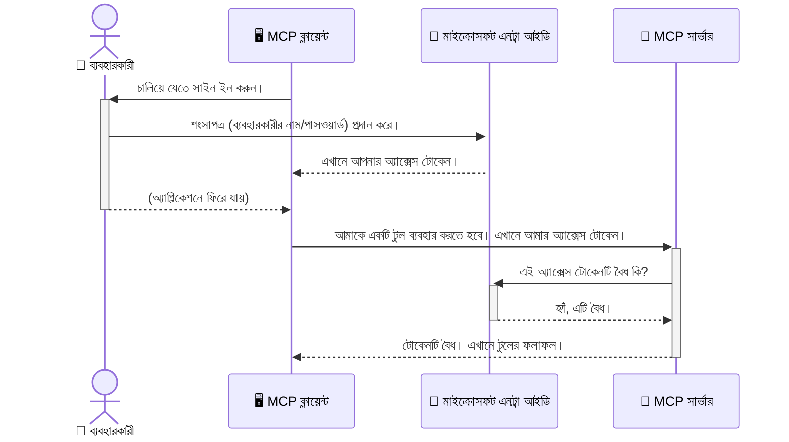

# AI ওয়ার্কফ্লোগুলিকে সুরক্ষিত করা: মডেল কনটেক্সট প্রোটোকল সার্ভারগুলির জন্য Entra ID প্রমাণীকরণ

> [!NOTE]
> এই পাঠের রিমোট সার্ভার কোডটি পুরানো `/sse` এবং `/message` এন্ডপয়েন্টগুলিকে সুরক্ষিত করে এবং MCP `2025-11-25` টার্গেট করে। এর পরিচয় ও টোকেন-যাচাই পদ্ধতিগুলি বজায় রাখবেন, তবে নতুন বাস্তবায়নের জন্য `2026-07-28`-অনুকূল Streamable HTTP পরিবহন ব্যবহার করুন।
> 
> 
> 

## পরিচিতি
আপনার মডেল কনটেক্সট প্রোটোকল (MCP) সার্ভার সুরক্ষিত করা, যেমন আপনার বাড়ির সামনের দরজা বন্ধ রাখা গুরুত্বপূর্ণ। MCP সার্ভার খোলা রেখে দিলে আপনার টুলস এবং ডেটা অননুমোদিত অ্যাক্সেসের জন্য উন্মুক্ত হয়, যা নিরাপত্তা লঙ্ঘনের কারণ হতে পারে। Microsoft Entra ID একটি শক্তিশালী ক্লাউড-ভিত্তিক পরিচয় ও প্রবেশাধিকার ব্যবস্থাপনা সমাধান প্রদান করে, যা নিশ্চিত করে যে শুধুমাত্র অনুমোদিত ব্যবহারকারী ও অ্যাপ্লিকেশনই আপনার MCP সার্ভারের সাথে যোগাযোগ করতে পারে। এই অংশে, আপনি শিখবেন কিভাবে Entra ID প্রমাণীকরণ ব্যবহার করে আপনার AI ওয়ার্কফ্লোগুলিকে সুরক্ষিত করবেন।

## শেখার লক্ষ্যসমূহ
এই অংশের শেষে, আপনি সক্ষম হবেন:

- MCP সার্ভার সুরক্ষার গুরুত্ব বুঝতে।
- Microsoft Entra ID এবং OAuth 2.0 প্রমাণীকরণের মৌলিক বিষয় ব্যাখ্যা করতে।
- পাবলিক এবং কনফিডেনশিয়াল ক্লায়েন্টের মধ্যে পার্থক্য চিনতে।
- লক্যাল (পাবলিক ক্লায়েন্ট) এবং রিমোট (কনফিডেনশিয়াল ক্লায়েন্ট) MCP সার্ভার প্রেক্ষাপটে Entra ID প্রমাণীকরণ বাস্তবায়ন করতে।
- AI ওয়ার্কফ্লো ডেভেলপ করার সময় সুরক্ষা সেরা প্রচলন প্রয়োগ করতে।

## নিরাপত্তা এবং MCP

যেমন আপনি আপনার বাড়ির সামনের দরজা খোলা রাখবেন না, তেমনি MCP সার্ভার যেকেউ অ্যাক্সেস করতে পারে তা ছেড়ে দেওয়াও ঠিক নয়। আপনার AI ওয়ার্কফ্লোগুলি সুরক্ষিত রাখা প্রয়োজন, যাতে দৃঢ়, বিশ্বাসযোগ্য এবং নিরাপদ অ্যাপ্লিকেশন তৈরি করা যায়। এই অধ্যায়ে Microsoft Entra ID ব্যবহার করে MCP সার্ভার সুরক্ষিত করার পদ্ধতি শিক্ষিত করা হবে, যা নিশ্চিত করে যে শুধুমাত্র অনুমোদিত ব্যবহারকারী ও অ্যাপ্লিকেশনই আপনার টুলস ও ডেটার সাথে যোগাযোগ করতে পারবে।

## MCP সার্ভারের জন্য নিরাপত্তা কেন গুরুত্বপূর্ণ

ভাবুন, আপনার MCP সার্ভারে এমেইল পাঠানোর বা গ্রাহক ডেটাবেস অ্যাক্সেস করার একটি টুল রয়েছে। যদি সার্ভার সুরক্ষিত না থাকে, তবে যেকেউ ঐ টুল ব্যবহার করতে পারবে, যার ফলে অননুমোদিত ডেটা অ্যাক্সেস, স্প্যাম বা অন্যান্য ক্ষতিকর কার্যকলাপ ঘটতে পারে।

প্রমাণীকরণ সম্পাদনের মাধ্যমে, আপনি নিশ্চিত করেন যে সার্ভারে প্রতিটি অনুরোধ যাচাই করা হচ্ছে, ব্যবহারকারী বা অ্যাপ্লিকেশনের পরিচয় নিশ্চিত করা হচ্ছে। এটি আপনার AI ওয়ার্কফ্লোগুলিকে সুরক্ষিত করার প্রথম ও সবচেয়ে গুরুত্বপূর্ণ ধাপ।

## Microsoft Entra ID পরিচিতি

[**Microsoft Entra ID**](https://adoption.microsoft.com/microsoft-security/entra/) একটি ক্লাউড-ভিত্তিক পরিচয় ও প্রবেশাধিকার ব্যবস্থাপনা পরিষেবা। এটিকে আপনার অ্যাপ্লিকেশনগুলির জন্য একটি সার্বজনীন সিকিউরিটি গার্ড হিসেবে ভাবুন। এটি ব্যবহারকারীদের পরিচয় যাচাই (প্রমাণীকরণ) এবং তারা কী করতে পারবে তা নির্ধারণ (অনুমোদন) করার জটিল প্রক্রিয়া পরিচালনা করে।

Entra ID ব্যবহার করে আপনি করতে পারবেন:

- ব্যবহারকারীদের জন্য নিরাপদ সাইন-ইন সক্ষম করা।
- API এবং সার্ভিসগুলিকে সুরক্ষিত করা।
- কেন্দ্রীয় স্থানে থেকে প্রবেশাধিকার নীতি পরিচালনা করা।

MCP সার্ভারের ক্ষেত্রে, Entra ID একটি শক্তিশালী এবং ব্যাপকভাবে বিশ্বাসযোগ্য সমাধান প্রদান করে, যেটি নির্ধারণ করে কে আপনার সার্ভারের সক্ষমতাগুলিতে প্রবেশ করতে পারে।

---

## যাদু বোঝা: Entra ID প্রমাণীকরণ কিভাবে কাজ করে

Entra ID প্রমাণীকরণের জন্য ওপেন স্ট্যান্ডার্ড যেমন **OAuth 2.0** ব্যবহার করে। যদিও বিস্তারিত জটিল হতে পারে, মূল ধারণাটি সহজ এবং একটি উপমা দিয়ে বোঝা যায়।

### OAuth 2.0 এর সহজ পরিচিতি: ভ্যালেট কী

OAuth 2.0 কে ভাবুন আপনার গাড়ির জন্য একটি ভ্যালেট পরিষেবা হিসেবে। যখন আপনি একটি রেস্টুরেন্টে পৌঁছান, আপনি আপনার মূল চাবি ভ্যালেটকে দেন না। পরিবর্তে আপনি একটি **ভ্যালেট কী** প্রদান করেন যার সীমাবদ্ধ অনুমতি থাকে—এটি গাড়ি চালু করতে এবং দরজা লক করতে পারে, কিন্তু ট্রাঙ্ক বা গ্লোভ কম্পার্টমেন্ট খুলতে পারে না।

এই উপমায়:

- **আপনি** হচ্ছেন **ব্যবহারকারী**।
- **আপনার গাড়ি** হল মূল্যবান টুলস ও ডেটাসংবলিত **MCP সার্ভার**।
- **ভ্যালেট** হল **Microsoft Entra ID**।
- **পার্কিং অ্যাটেন্ড্যান্ট** হল **MCP ক্লায়েন্ট** (সার্ভারে অ্যাক্সেসের চেষ্টা করছে এমন অ্যাপ্লিকেশন)।
- **ভ্যালেট কী** হলো **অ্যাক্সেস টোকেন**।

অ্যাক্সেস টোকেন হল একটি নিরাপদ স্ট্রিং যা MCP ক্লায়েন্ট Entra ID থেকে সাইন-ইন করার পর পায়। ক্লায়েন্ট প্রতিটি অনুরোধে MCP সার্ভারে এই টোকেনটি উপস্থাপন করে। সার্ভার টোকেন যাচাই করে নিশ্চিত করে যে অনুরোধ বৈধ এবং ক্লায়েন্টের প্রয়োজনীয় অনুমতি রয়েছে, সবই ব্যবহারকারীর আসল প্রমাণপত্র (যেমন পাসওয়ার্ড) ছাড়া।

### প্রমাণীকরণ প্রবাহ

এখানে প্রক্রিয়াটি কিভাবে কাজ করে:



### Microsoft Authentication Library (MSAL) পরিচিতি

কোডে ডুব দিতে আগে, উদাহরণের একটি প্রধান অংশ পরিচয় করানো জরুরি: **Microsoft Authentication Library (MSAL)**।

MSAL হল মাইক্রোসফট দ্বারা উন্নত একটি লাইব্রেরি যেটি ডেভেলপারদের জন্য প্রমাণীকরণ পরিচালনা অনেক সহজ করে তোলে। আপনি নিজে সমস্ত জটিল কোড লেখার পরিবর্তে, যেমন নিরাপত্তা টোকেন পরিচালনা, সাইন-ইন এবং সেশন রিফ্রেশ করা, MSAL এসব ভার বহন করে।

MSAL ব্যবহারের জন্য উত্সাহিত কারণ:

- **এটি নিরাপদ:** ইন্ডাস্ট্রি-স্ট্যান্ডার্ড প্রোটোকল ও সেরা নিরাপত্তা অনুশীলনগুলি অনুসরণ করে, কোডে দুর্বলতার ঝুঁকি কমায়।
- **এটি ডেভেলপমেন্ট সহজ করে:** OAuth 2.0 ও OpenID Connect এর জটিলতা লুকিয়ে দিয়ে কয়েক লাইনে শক্তিশালী প্রমাণীকরণ যোগ করা সম্ভব করে।
- **এটি রক্ষণাবেক্ষণ হয়:** মাইক্রোসফট সক্রিয়ভাবে MSAL আপডেট করে নতুন নিরাপত্তা হুমকি ও প্ল্যাটফর্ম পরিবর্তন মোকাবেলায়।

MSAL .NET, JavaScript/TypeScript, Python, Java, Go এবং মোবাইল প্ল্যাটফর্ম যেমন iOS এবং Android সহ বিভিন্ন ভাষা ও ফ্রেমওয়ার্ক সাপোর্ট করে। এর মানে, আপনার পুরো প্রযুক্তি স্ট্যাক জুড়ে একই ধারাবাহিক প্রমাণীকরণ প্যাটার্ন ব্যবহৃত হবে।

MSAL সম্পর্কে আরও জানার জন্য, আপনি অফিসিয়াল [MSAL পর্যালোচনা ডকুমেন্টেশন](https://learn.microsoft.com/entra/identity-platform/msal-overview) দেখতে পারেন।

---

## Entra ID দিয়ে আপনার MCP সার্ভার সুরক্ষিত করা: ধাপে ধাপে গাইড

এখন, চলুন দেখাই কিভাবে Entra ID ব্যবহার করে একটি লোকাল MCP সার্ভার (`stdio` মাধ্যমে যোগাযোগকারী) সুরক্ষিত করা যায়। উদাহরণটি একটি **পাবলিক ক্লায়েন্ট** ব্যবহার করে, যা ব্যবহারকারীর মেশিনে চলমান অ্যাপ্লিকেশন, যেমন ডেস্কটপ অ্যাপ বা লোকাল ডেভেলপমেন্ট সার্ভারের জন্য উপযুক্ত।

### পরিস্থিতি ১: লোকাল MCP সার্ভার সুরক্ষিত করা (পাবলিক ক্লায়েন্ট দিয়ে)

এই পরিস্থিতিতে, আমরা একটি লোকাল MCP সার্ভার দেখব, যা `stdio` মাধ্যমে যোগাযোগ করে এবং Entra ID ব্যবহার করে ব্যবহারকারীকে প্রমাণীকৃত করে তার টুলস অ্যাক্সেসের অনুমতি দেয়। সার্ভারে একটি টুল থাকবে, যা Microsoft Graph API থেকে ব্যবহারকারীর প্রোফাইল তথ্য সংগ্রহ করে।

#### ১. Entra ID তে অ্যাপ্লিকেশন সেটআপ করা

কোড লেখার আগে, আপনাকে Microsoft Entra ID-তে আপনার অ্যাপ্লিকেশন রেজিস্টার করতে হবে। এটি Entra ID কে আপনার অ্যাপ্লিকেশন সম্পর্কে জানায় এবং প্রমাণীকরণ সার্ভিস ব্যবহারের অনুমতি দেয়।

১. **[Microsoft Entra পোর্টাল](https://entra.microsoft.com/)** এ যান।
২. **App registrations** এ যান এবং **New registration** ক্লিক করুন।
৩. আপনার অ্যাপ্লিকেশনকে একটি নাম দিন (যেমন "My Local MCP Server")।
৪. **Supported account types** এ **Accounts in this organizational directory only** নির্বাচন করুন।
৫. এই উদাহরণের জন্য **Redirect URI** ফাঁকা রাখা যাবে।
৬. **Register** ক্লিক করুন।

একবার রেজিস্টার হয়ে গেলে, **Application (client) ID** এবং **Directory (tenant) ID** মনে রাখুন। কোডে এগুলো ব্যবহার করতে হবে।

#### ২. কোড: একটি বিশ্লেষণ

চলুন কোডের মূল অংশগুলি দেখে নেই যেগুলো প্রমাণীকরণের কাজ করে। এই উদাহরণের পূর্ণ কোড [Entra ID - Local - WAM](https://github.com/Azure-Samples/mcp-auth-servers/tree/main/src/entra-id-local-wam) ফোল্ডারে [mcp-auth-servers GitHub রিপোজিটোরি](https://github.com/Azure-Samples/mcp-auth-servers) তে উপলব্ধ।

**`AuthenticationService.cs`**

এই ক্লাসটি Entra ID সাথে ইন্টারঅ্যাকশনের দায়িত্বে থাকে।

- **`CreateAsync`**: এই মেথড MSAL (Microsoft Authentication Library) থেকে `PublicClientApplication` ইনিশিয়ালাইজ করে। এটি আপনার অ্যাপ্লিকেশনের `clientId` এবং `tenantId` দ্বারা কনফিগার করা হয়।
- **`WithBroker`**: এটি ব্রোকার (যেমন Windows Web Account Manager) ব্যবহারের অনুমতি দেয়, যা একটি নিরাপদ ও নির্বিঘ্ন একক সাইন-অন অভিজ্ঞতা প্রদান করে।
- **`AcquireTokenAsync`**: এটি মূল মেথড। প্রথমে এটি চুপচাপ টোকেন পাওয়ার চেষ্টা করে (মানে ব্যবহারকারী পুনরায় সাইন ইন করবে না যদি বৈধ সেশন থাকে)। যদি চুপচাপ টোকেন না পাওয়া যায়, তবে এটি ব্যবহারকারীকে ইন্টারেক্টিভলি সাইন ইন করতে বলে।

```csharp
// Simplified for clarity
public static async Task<AuthenticationService> CreateAsync(ILogger<AuthenticationService> logger)
{
    var msalClient = PublicClientApplicationBuilder
        .Create(_clientId) // Your Application (client) ID
        .WithAuthority(AadAuthorityAudience.AzureAdMyOrg)
        .WithTenantId(_tenantId) // Your Directory (tenant) ID
        .WithBroker(new BrokerOptions(BrokerOptions.OperatingSystems.Windows))
        .Build();

    // ... cache registration ...

    return new AuthenticationService(logger, msalClient);
}

public async Task<string> AcquireTokenAsync()
{
    try
    {
        // Try silent authentication first
        var accounts = await _msalClient.GetAccountsAsync();
        var account = accounts.FirstOrDefault();

        AuthenticationResult? result = null;

        if (account != null)
        {
            result = await _msalClient.AcquireTokenSilent(_scopes, account).ExecuteAsync();
        }
        else
        {
            // If no account, or silent fails, go interactive
            result = await _msalClient.AcquireTokenInteractive(_scopes).ExecuteAsync();
        }

        return result.AccessToken;
    }
    catch (Exception ex)
    {
        _logger.LogError(ex, "An error occurred while acquiring the token.");
        throw; // Optionally rethrow the exception for higher-level handling
    }
}
```

**`Program.cs`**

এখানে MCP সার্ভার সেটআপ এবং প্রমাণীকরণ সার্ভিস ইন্টিগ্রেট করা হয়েছে।

- **`AddSingleton<AuthenticationService>`**: এটি `AuthenticationService` কে ডিপেন্ডেন্সি ইনজেকশন কন্টেইনারে নিবন্ধন করে, যাতে অ্যাপ্লিকেশনের অন্যান্য অংশ (যেমন আমাদের টুল) এটি ব্যবহার করতে পারে।
- **`GetUserDetailsFromGraph` টুল**: এই টুল `AuthenticationService` এর একটি ইনস্ট্যান্স দরকার। এটি আগে `authService.AcquireTokenAsync()` কল করে বৈধ অ্যাক্সেস টোকেন পায়। যদি সফল হয়, টোকেন ব্যবহার করে Microsoft Graph API কল করে ব্যবহারকারীর তথ্য আনে।

```csharp
// Simplified for clarity
[McpServerTool(Name = "GetUserDetailsFromGraph")]
public static async Task<string> GetUserDetailsFromGraph(
    AuthenticationService authService)
{
    try
    {
        // This will trigger the authentication flow
        var accessToken = await authService.AcquireTokenAsync();

        // Use the token to create a GraphServiceClient
        var graphClient = new GraphServiceClient(
            new BaseBearerTokenAuthenticationProvider(new TokenProvider(authService)));

        var user = await graphClient.Me.GetAsync();

        return System.Text.Json.JsonSerializer.Serialize(user);
    }
    catch (Exception ex)
    {
        return $"Error: {ex.Message}";
    }
}
```

#### ৩. কিভাবে সব একসাথে কাজ করে

১. MCP ক্লায়েন্ট যখন `GetUserDetailsFromGraph` টুল ব্যবহার করতে চায়, টুল প্রথমে `AcquireTokenAsync` কল করে।
২. `AcquireTokenAsync` MSAL লাইব্রেরিকে বৈধ টোকেনের জন্য পরীক্ষা করতে বলে।
৩. যদি কোনো টোকেন না পাওয়া যায়, MSAL ব্রোকারের মাধ্যমে ব্যবহারকারীকে Entra ID একাউন্ট দিয়ে সাইন ইন করতে বলে।
৪. ব্যবহারকারী সাইন ইন করলে, Entra ID একটি অ্যাক্সেস টোকেন ইস্যু করে।
৫. টুল টোকেন পায় এবং এটি ব্যবহার করে নিরাপদভাবে Microsoft Graph API কল করে।
৬. ব্যবহারকারীর তথ্য MCP ক্লায়েন্টকে ফেরত দেয়।

প্রক্রিয়াটি নিশ্চিত করে যে শুধু প্রমাণীকৃত ব্যবহারকরীরাই টুল ব্যবহার করতে পারে, যা আপনার স্থানীয় MCP সার্ভার কার্যকরভাবে সুরক্ষিত করে।

### পরিস্থিতি ২: রিমোট MCP সার্ভার সুরক্ষিত করা (কনফিডেনশিয়াল ক্লায়েন্ট দিয়ে)

যখন MCP সার্ভার কোনও রিমোট মেশিনে (যেমন ক্লাউড সার্ভার) চলছে এবং HTTP Streaming প্রোটোকল ব্যবহার করে যোগাযোগ করে, নিরাপত্তার চাহিদা আলাদা হয়। এই ক্ষেত্রে, আপনাকে **কনফিডেনশিয়াল ক্লায়েন্ট** এবং **Authorization Code Flow** ব্যবহার করতে হবে। এটি নিরাপদ পদ্ধতি কারণ অ্যাপ্লিকেশনের সিক্রেটগুলি কখনো ব্রাউজারে প্রকাশ পায় না।

এই উদাহরণটি একটি TypeScript-ভিত্তিক MCP সার্ভার ব্যবহার করে, যা Express.js দিয়ে HTTP অনুরোধ পরিচালনা করে।

#### ১. Entra ID তে অ্যাপ্লিকেশন সেটআপ করা

Entra ID তে সেটআপটি পাবলিক ক্লায়েন্টের মতোই, তবে একটি প্রধান পার্থক্য রয়েছে: আপনাকে একটি **ক্লায়েন্ট সিক্রেট** তৈরি করতে হবে।

১. **[Microsoft Entra পোর্টাল](https://entra.microsoft.com/)** এ যান।
২. আপনার অ্যাপ রেজিস্ট্রেশনে **Certificates & secrets** ট্যাব এ যান।
৩. **New client secret** ক্লিক করুন, একটি বর্ণনা দিন এবং **Add** ক্লিক করুন।
৪. **গুরুত্বপূর্ণ:** সিক্রেট ভ্যালুটি অবিলম্বে কপি করুন। একবার এটি দেখানো হলে পুনরায় দেখতে পারবেন না।
৫. আপনাকে একটি **Redirect URI** ও কনফিগার করতে হবে। **Authentication** ট্যাবে যান, **Add a platform** ক্লিক করুন, **Web** নির্বাচন করুন এবং আপনার অ্যাপের জন্য রিডাইরেক্ট URI দিন (যেমন `http://localhost:3001/auth/callback`)।

> **⚠️ গুরুত্বপূর্ণ নিরাপত্তা নোট:** প্রোডাকশন অ্যাপ্লিকেশনের জন্য, মাইক্রোসফট দৃঢ়ভাবে পরামর্শ দেয় **সিক্রেটলেস প্রমাণীকরণ** পদ্ধতি যেমন **Managed Identity** বা **Workload Identity Federation** ব্যবহারের। ক্লায়েন্ট সিক্রেট নিরাপত্তা ঝুঁকি সৃষ্টি করে কারণ এটি প্রকাশ বা ক্ষতিগ্রস্থ হতে পারে। ম্যানেজড আইডেন্টিটি নিরাপদ পদ্ধতি যা ক্রেডেনশিয়াল সংরক্ষণে আপনার কোড বা কনফিগারেশন এর প্রয়োজনীয়তা কমায়।
>
> ম্যানেজড আইডেন্টিটি এবং তার বাস্তবায়ন সম্পর্কে আরও জানার জন্য দেখুন [Managed identities for Azure resources overview](https://learn.microsoft.com/entra/identity/managed-identities-azure-resources/overview)।

#### ২. কোড: বিশ্লেষণ

এই উদাহরণটি সেশন-ভিত্তিক পদ্ধতি ব্যবহার করে। ব্যবহারকারী প্রমাণীকরণের পর, সার্ভার সেশনটিতে অ্যাক্সেস টোকেন এবং রিফ্রেশ টোকেন সংরক্ষণ করে এবং ব্যবহারকারীকে একটি সেশন টোকেন দেয়। ভবিষ্যত অনুরোধগুলিতে এই সেশন টোকেন ব্যবহার হয়। উদাহরণের পূর্ণ কোড [Entra ID - Confidential client](https://github.com/Azure-Samples/mcp-auth-servers/tree/main/src/entra-id-cca-session) ফোল্ডারে [mcp-auth-servers GitHub রিপোজিটোরি](https://github.com/Azure-Samples/mcp-auth-servers) এ উপলব্ধ।

**`Server.ts`**

এই ফাইলটি Express সার্ভার এবং MCP ট্রান্সপোর্ট স্তর সেটআপ করে।

- **`requireBearerAuth`**: এটি একটি মিডলওয়্যার যা `/sse` এবং `/message` এন্ডপয়েন্টগুলিকে রক্ষা করে। এটি অনুরোধের `Authorization` হেডারে বৈধ বেয়ারার টোকেন আছে কি না তা যাচাই করে।
- **`EntraIdServerAuthProvider`**: এটি একটি কাস্টম ক্লাস যা `McpServerAuthorizationProvider` ইন্টারফেস বাস্তবায়ন করে। এটি OAuth 2.0 প্রবাহ পরিচালনার দায়িত্বে থাকে।
- **`/auth/callback`**: এই এন্ডপয়েন্ট ব্যবহারকারী প্রমাণীকরণের পর Entra ID থেকে রিডাইরেক্ট হ্যান্ডল করে। এটি অ্যাক্সেস টোকেন ও রিফ্রেশ টোকেনের জন্য অথরাইজেশন কোড বিনিময় করে।

```typescript
// স্পষ্টতার জন্য সরলীকৃত
const app = express();
const { server } = createServer();
const provider = new EntraIdServerAuthProvider();

// SSE এন্ডপয়েন্ট সুরক্ষিত করুন
app.get("/sse", requireBearerAuth({
  provider,
  requiredScopes: ["User.Read"]
}), async (req, res) => {
  // ... পরিবহন এ সংযুক্ত করুন ...
});

// বার্তা এন্ডপয়েন্ট সুরক্ষিত করুন
app.post("/message", requireBearerAuth({
  provider,
  requiredScopes: ["User.Read"]
}), async (req, res) => {
  // ... বার্তাটি পরিচালনা করুন ...
});

// OAuth 2.0 কলব্যাক পরিচালনা করুন
app.get("/auth/callback", (req, res) => {
  provider.handleCallback(req.query.code, req.query.state)
    .then(result => {
      // ... সফলতা বা ব্যর্থতা পরিচালনা করুন ...
    });
});
```

**`Tools.ts`**

এই ফাইলটি MCP সার্ভারের সরবরাহকৃত টুলস সংজ্ঞায়িত করে। `getUserDetails` টুলটি পূর্বের উদাহরণের মত, কিন্তু এটি অ্যাক্সেস টোকেন সেশন থেকে নেয়।

```typescript
// স্বচ্ছতার জন্য সরলীকৃত
server.setRequestHandler(CallToolRequestSchema, async (request) => {
  const { name } = request.params;
  const context = request.params?.context as { token?: string } | undefined;
  const sessionToken = context?.token;

  if (name === ToolName.GET_USER_DETAILS) {
    if (!sessionToken) {
      throw new AuthenticationError("Authentication token is missing or invalid. Ensure the token is provided in the request context.");
    }

    // সেশন স্টোর থেকে Entra ID টোকেন নিন
    const tokenData = tokenStore.getToken(sessionToken);
    const entraIdToken = tokenData.accessToken;

    const graphClient = Client.init({
      authProvider: (done) => {
        done(null, entraIdToken);
      }
    });

    const user = await graphClient.api('/me').get();

    // ... ব্যবহারকারীর বিবরণ ফেরত দিন ...
  }
});
```

**`auth/EntraIdServerAuthProvider.ts`**

এই ক্লাসটি নিচের লজিক পরিচালনা করে:

- ব্যবহারকারীকে Entra ID সাইন-ইন পেজে রিডাইরেক্ট করা।
- অথরাইজেশন কোডের বিনিময়ে অ্যাক্সেস টোকেন পাওয়া।
- টোকেনগুলো `tokenStore`-এ সংরক্ষণ করা।
- অ্যাক্সেস টোকেনের মেয়াদ শেষ হলে রিফ্রেশ করা।


#### ৩. এগুলি কীভাবে একসাথে কাজ করে

১. যখন একটি ব্যবহারকারী প্রথমবার MCP সার্ভারে সংযোগ করার চেষ্টা করে, `requireBearerAuth` মিডলওয়্যার দেখবে যে তাদের কাছে বৈধ সেশন নেই এবং তাদের Entra ID সাইন-ইন পৃষ্ঠায় পুনঃনির্দেশ করবে।
২. ব্যবহারকারী তাদের Entra ID অ্যাকাউন্ট দিয়ে সাইন ইন করে।
৩. Entra ID ব্যবহারকারীকে `/auth/callback` এন্ডপয়েন্টে একটি অনুমোদন কোড সহ ফেরত পাঠায়।
৪. সার্ভার কোডটি একটি এক্সেস টোকেন এবং একটি রিফ্রেশ টোকেনের জন্য বিনিময় করে, সেগুলি সংরক্ষণ করে এবং একটি সেশন টোকেন তৈরি করে যা ক্লায়েন্টকে পাঠানো হয়।
৫. ক্লায়েন্ট এখন এই সেশন টোকেনটি MCP সার্ভারের জন্য সব ভবিষ্যৎ অনুরোধের `Authorization` হেডারে ব্যবহার করতে পারে।
৬. যখন `getUserDetails` টুলটি ডাকা হয়, এটি সেশন টোকেন ব্যবহার করে Entra ID এক্সেস টোকেন দেখতে পায় এবং তারপর সেটি ব্যবহার করে Microsoft Graph API কল করে।

এই প্রবাহটি পাবলিক ক্লায়েন্ট প্রবাহ থেকে বেশি জটিল, তবে ইন্টারনেট-অভিমুখী এন্ডপয়েন্টের জন্য এটি প্রয়োজন। যেহেতু রিমোট MCP সার্ভারগুলি পাবলিক ইন্টারনেটের মাধ্যমে অ্যাক্সেসযোগ্য, তাই তারা অননুমোদিত প্রবেশ এবং সম্ভাব্য আক্রমণ থেকে সুরক্ষার জন্য আরও শক্তিশালী নিরাপত্তা ব্যবস্থা প্রয়োজন।


## নিরাপত্তার সেরা অভ্যাস

- **প্রতিদিন HTTPS ব্যবহার করুন**: ক্লায়েন্ট এবং সার্ভারের মধ্যে যোগাযোগ এনক্রিপ্ট করুন যাতে টোকেনগুলি আটকানো থেকে সুরক্ষিত থাকে।
- **রোল-বেসড অ্যাক্সেস কন্ট্রোল (RBAC) বাস্তবায়ন করুন**: কেবল *ব্যবহারকারী প্রমাণীকৃত কিনা* তা পরীক্ষা করবেন না; তারা *কী কাজ করার অনুমতি পেয়েছে* তাও পরীক্ষা করুন। আপনি Entra ID-তে রোল সংজ্ঞায়িত করতে পারেন এবং আপনার MCP সার্ভারে সেগুলি পরীক্ষা করতে পারেন।
- **পরীক্ষা এবং নিরীক্ষণ করুন**: সমস্ত প্রমাণীকরণ ঘটনা লগ করুন যাতে আপনি সন্দেহজনক কার্যকলাপ সনাক্ত এবং প্রতিক্রিয়া জানাতে পারেন।
- **রেট লিমিটিং এবং থ্রোটলিং পরিচালনা করুন**: Microsoft Graph এবং অন্যান্য API-গুলি অপব্যবহার রোধের জন্য রেট লিমিটিং প্রয়োগ করে। আপনার MCP সার্ভারে HTTP 429 (Too Many Requests) উত্তরগুলি সুন্দরভাবে পরিচালনা করার জন্য এক্সপোনেনশিয়াল ব্যাকঅফ এবং পুনরায় চেষ্টা করার লজিক বাস্তবায়ন করুন। API কল কমাতে ঘন ঘন অ্যাক্সেসকৃত ডেটা ক্যাশিং বিবেচনা করুন।
- **টোকেন সুরক্ষিত সংরক্ষণ করুন**: এক্সেস টোকেন এবং রিফ্রেশ টোকেনগুলি নিরাপদে সংরক্ষণ করুন। লোকাল অ্যাপ্লিকেশনগুলির জন্য, সিস্টেমের নিরাপদ স্টোরেজ ব্যবস্থা ব্যবহার করুন। সার্ভার অ্যাপ্লিকেশনগুলির জন্য, এনক্রিপটেড স্টোরেজ বা Azure Key Vault-এর মতো নিরাপদ কী ব্যবস্থাপনা পরিষেবা ব্যবহার করার কথা ভাবুন।
- **টোকেন মেয়াদ উত্তীর্ণ হওয়ার পরিচালনা**: এক্সেস টোকেনগুলির একটি সীমিত জীবনকাল থাকে। স্বয়ংক্রিয় টোকেন রিফ্রেশ রিফ্রেশ টোকেন ব্যবহার করে বাস্তবায়ন করুন যাতে পুনরায় প্রমাণীকরণের প্রয়োজন ছাড়াই ব্যবহারকারীর অভিজ্ঞতা বজায় থাকে।
- **Azure API Management ব্যবহার করার কথা বিবেচনা করুন**: যদিও আপনার MCP সার্ভারে সরাসরি নিরাপত্তা বাস্তবায়ন আপনাকে সূক্ষ্ম নিয়ন্ত্রণ দেয়, API গেটওয়ে যেমন Azure API Management অনেক নিরাপত্তা উদ্বেগ স্বয়ংক্রিয়ভাবে পরিচালনা করতে পারে, যার মধ্যে রয়েছে প্রমাণীকরণ, অনুমোদন, রেট লিমিটিং এবং পর্যবেক্ষণ। তারা একটি কেন্দ্রীয় নিরাপত্তা স্তর সরবরাহ করে যা আপনার ক্লায়েন্ট এবং MCP সার্ভারের মধ্যে বসে। MCP-এর সাথে API গেটওয়ে ব্যবহারের আরও বিস্তারিত তথ্যের জন্য আমাদের [Azure API Management Your Auth Gateway For MCP Servers](https://techcommunity.microsoft.com/blog/integrationsonazureblog/azure-api-management-your-auth-gateway-for-mcp-servers/4402690) দেখুন।


## মূল বিষয়গুলি

- আপনার MCP সার্ভার সুরক্ষিত করা আপনার ডেটা এবং টুলগুলিকে সংরক্ষণের জন্য অপরিহার্য।
- Microsoft Entra ID প্রমাণীকরণ এবং অনুমোদনের জন্য একটি শক্তিশালী এবং বিস্তৃত সমাধান প্রদান করে।
- স্থানীয় অ্যাপ্লিকেশনগুলির জন্য একটি **পাবলিক ক্লায়েন্ট** এবং রিমোট সার্ভারের জন্য একটি **কনফিডেনশিয়াল ক্লায়েন্ট** ব্যবহার করুন।
- **Authorization Code Flow** ওয়েব অ্যাপ্লিকেশনগুলির জন্য সবচেয়ে নিরাপদ বিকল্প।


## অনুশীলন

১. আপনি যে MCP সার্ভারটি তৈরি করতে পারেন তা নিয়ে ভাবুন। এটি কি একটি স্থানীয় সার্ভার হবে না কি একটি রিমোট সার্ভার?
২. আপনার উত্তরের ভিত্তিতে, আপনি কি পাবলিক ক্লায়েন্ট ব্যবহার করবেন না কনফিডেনশিয়াল ক্লায়েন্ট?
৩. Microsoft Graph বিরুদ্ধে ক্রিয়াকলাপগুলি সম্পাদনের জন্য আপনার MCP সার্ভার কোন অনুমতি চাইবে?


## হাতে কলমে অনুশীলন

### অনুশীলন ১: Entra ID তে একটি অ্যাপ্লিকেশন নিবন্ধন করুন
Microsoft Entra পোর্টালে যান।
আপনার MCP সার্ভারের জন্য একটি নতুন অ্যাপ্লিকেশন নিবন্ধন করুন।
অ্যাপ্লিকেশন (ক্লায়েন্ট) আইডি এবং ডিরেক্টরি (টেন্যান্ট) আইডি নোট করুন।

### অনুশীলন ২: স্থানীয় MCP সার্ভার সুরক্ষিত করুন (পাবলিক ক্লায়েন্ট)
- ব্যবহারকারীর প্রমাণীকরণের জন্য MSAL (Microsoft Authentication Library) সংহত করার জন্য কোড উদাহরণ অনুসরণ করুন।
- Microsoft Graph থেকে ব্যবহারকারীর বিবরণ আনতে MCP টুল কল করে প্রমাণীকরণ প্রবাহ পরীক্ষা করুন।

### অনুশীলন ৩: রিমোট MCP সার্ভার সুরক্ষিত করুন (কনফিডেনশিয়াল ক্লায়েন্ট)
- Entra ID তে একটি কনফিডেনশিয়াল ক্লায়েন্ট নিবন্ধন করুন এবং একটি ক্লায়েন্ট সিক্রেট তৈরি করুন।
- আপনার Express.js MCP সার্ভারে Authorization Code Flow ব্যবহার করার জন্য কনফিগার করুন।
- সুরক্ষিত এন্ডপয়েন্টগুলি পরীক্ষা করুন এবং টোকেন-ভিত্তিক অ্যাক্সেস নিশ্চিত করুন।

### অনুশীলন ৪: নিরাপত্তার সেরা অভ্যাস প্রয়োগ করুন
- আপনার স্থানীয় বা রিমোট সার্ভারের জন্য HTTPS সক্রিয় করুন।
- আপনার সার্ভার লজিকে রোল-বেসড অ্যাক্সেস কন্ট্রোল (RBAC) বাস্তবায়ন করুন।
- টোকেন মেয়াদ উত্তীর্ণ হওয়া এবং নিরাপদ টোকেন সংরক্ষণ সংযোজন করুন।

## সম্পদসমূহ

১. **MSAL ওভারভিউ ডকুমেন্টেশন**  
   বিভিন্ন প্ল্যাটফর্মে নিরাপদ টোকেন অর্জন করার জন্য Microsoft Authentication Library (MSAL) কীভাবে কাজ করে তা শিখুন:  
   [MSAL Overview on Microsoft Learn](https://learn.microsoft.com/en-gb/entra/msal/overview)

২. **Azure-Samples/mcp-auth-servers GitHub রিপোজিটরি**  
   প্রমাণীকরণ প্রবাহ প্রদর্শন করার জন্য MCP সার্ভারের রেফারেন্স বাস্তবায়ন:  
   [Azure-Samples/mcp-auth-servers on GitHub](https://github.com/Azure-Samples/mcp-auth-servers)

৩. **Azure রিসোর্সের জন্য Managed Identities ওভারভিউ**  
   সিক্রেট বাদ দিয়ে সিস্টেম বা ব্যবহারকারী-অনুষ্ঠিত ব্যবস্থাপিত পরিচয় কিভাবে ব্যবহার করবেন তা বুঝুন:  
   [Managed Identities Overview on Microsoft Learn](https://learn.microsoft.com/en-us/entra/identity/managed-identities-azure-resources/)

৪. **Azure API Management: MCP সার্ভারের জন্য আপনার অথ গেটওয়ে**  
   MCP সার্ভারের জন্য APIM-কে একটি নিরাপদ OAuth2 গেটওয়ে হিসাবে ব্যবহারের গভীর আলোচনা:  
   [Azure API Management Your Auth Gateway For MCP Servers](https://techcommunity.microsoft.com/blog/integrationsonazureblog/azure-api-management-your-auth-gateway-for-mcp-servers/4402690)

৫. **Microsoft Graph অনুমতি রেফারেন্স**  
   Microsoft Graph-এর জন্য প্রতিনিধিত্বকৃত এবং অ্যাপ্লিকেশন অনুমতিগুলির বৃহৎ তালিকা:  
   [Microsoft Graph Permissions Reference](https://learn.microsoft.com/zh-tw/graph/permissions-reference)


## শেখার ফলাফল
এই অধ্যায় সম্পন্ন করার পর, আপনি সক্ষম হবেন:

- MCP সার্ভার এবং AI ওয়ার্কফ্লোর জন্য প্রমাণীকরণ কেন গুরুত্বপূর্ণ তা প্রকাশ করতে।
- স্থানীয় এবং রিমোট MCP সার্ভার পরিস্থিতির জন্য Entra ID প্রমাণীকরণ সেটআপ এবং কনফিগার করতে।
- আপনার সার্ভারের ডিপ্লয়মেন্টের উপর ভিত্তি করে উপযুক্ত ক্লায়েন্ট টাইপ (পাবলিক বা কনফিডেনশিয়াল) নির্বাচন করতে।
- নিরাপদ কোডিং চর্চাসমূহ বাস্তবায়ন করতে, যার মধ্যে টোকেন স্টোরেজ এবং রোল-বেসড অনুমোদন অন্তর্ভুক্ত।
- আপনার MCP সার্ভার এবং এর টুলগুলি অননুমোদিত প্রবেশ থেকে আত্মবিশ্বাসের সঙ্গে সুরক্ষিত করতে।

## পরবর্তী কী

- [5.13 Model Context Protocol (MCP) Integration with Microsoft Foundry](../mcp-foundry-agent-integration/README.md)

---

<!-- CO-OP TRANSLATOR DISCLAIMER START -->
**অস্বীকৃতি**:
এই নথিটি AI অনুবাদ পরিষেবা [Co-op Translator](https://github.com/Azure/co-op-translator) ব্যবহার করে অনূদিত হয়েছে। যদিও আমরা শুদ্ধতার জন্য চেষ্টা করি, অনুগ্রহ করে মনে রাখবেন যে স্বয়ংক্রিয় অনুবাদে ত্রুটি বা অসঙ্গতি থাকতে পারে। মূল নথিটি তার স্বভাষায় কর্তৃত্বপূর্ণ উৎস হিসেবে বিবেচিত হওয়া উচিত। গুরুত্বপূর্ণ তথ্যের জন্য পেশাদার মানব অনুবাদ সুপারিশ করা হয়। এই অনুবাদের ব্যবহারে প্রয়োজনীয় ভুল বোঝাবুঝি বা ভুল ব্যাখ্যার জন্য আমরা দায়বদ্ধ নই।
<!-- CO-OP TRANSLATOR DISCLAIMER END -->