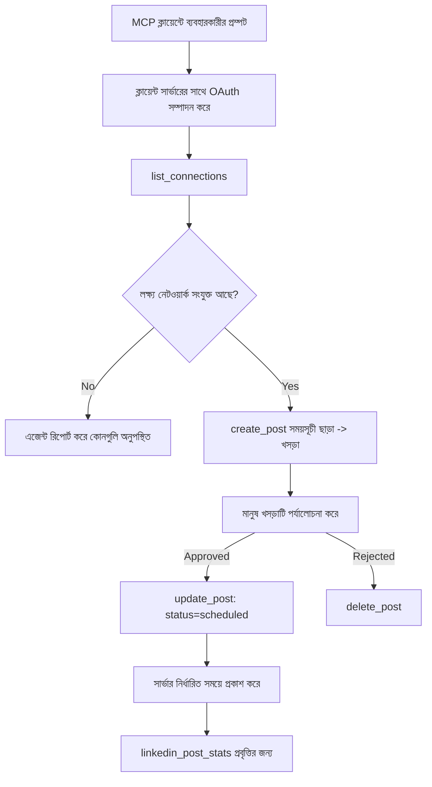

# কেস স্টাডি: একটি এজেন্ট থেকে একটি রিমোট MCP সার্ভারের মাধ্যমে সোশ্যাল নেটওয়ার্কে প্রকাশনা

> **অস্বীকৃতি:** অনেক পরিষেবা এবং ওপেন-সোর্স প্রকল্প সোশ্যাল নেটওয়ার্কে প্রকাশ করতে পারে, এবং একটি দল প্রতিটি নেটওয়ার্কের API সরাসরি একীভূত করতেও সক্ষম। নিচের দৃশ্যপট একটি **লিখতে সক্ষম রিমোট MCP সার্ভার** কীভাবে ডিজাইন ও ব্যবহার করতে পারে তার একটি কাজ করা উদাহরণ হিসেবে প্রদান করা হয়েছে। Publora একটি বাণিজ্যিক পরিষেবা যার ফ্রি টিয়ার রয়েছে; এখানে বর্ণিত প্যাটার্নগুলি যে কোনও MCP সার্ভারের জন্য প্রযোজ্য যা ব্যবহারকারীর পক্ষ থেকে অপরিবর্তনীয় একশন সম্পাদন করে।

## সারসংক্ষেপ

এজেন্টরা কনটেন্ট খসড়া করতে ভালো কিন্তু এটি বিতরণ করতে দূর্বল। একটি মডেল কয়েক সেকেন্ডের মধ্যে একটি রিলিজ ঘোষণা লিখতে পারে, তারপর কাজ থেমে যায়: এটি প্রকাশ করার জন্য একটি নেটওয়ার্কের জন্য API, একটি নেটওয়ার্কের জন্য OAuth অ্যাপ, এবং প্রতিটি জন্য বিভিন্ন মিডিয়া নিয়ম প্রয়োজন। বেশিরভাগ দল এটি সমাধান করে টেক্সট ব্রাউজারে হাত দিয়ে কপি করে।

এই কেস স্টাডি দেখায় কীভাবে শেষ ধাপটি একটি একক রিমোট MCP সার্ভার দিয়ে সম্পন্ন করা যায় এবং — যেকোনো যে কেউ এটি তৈরি করছে তাদের জন্য আরও উপকারী — কী ডিজাইন সিদ্ধান্ত একটি **লিখতে সক্ষম** সার্ভার ঠিক করতে হবে। তথ্য পড়া ক্ষমাশীল; প্রকাশনা নয়: একটি ভুল টুল কল দর্শকদের কাছে দৃশ্যমান এবং পূর্বাবস্থায় ফেরানো যায় না।

## দৃশ্যপট

একটি ছোট ডেভেলপার-সম্পর্কিত দল একটি এজেন্ট (Claude, VS Code, Cursor — ক্লায়েন্ট যা-ই হোক না কেন তা গুরুত্বপূর্ণ নয়) এর ভিতরে পোস্ট খসড়া করে। তারা চায় এজেন্টটি:

- দেখতে যে দল কোন সোশ্যাল একাউন্টগুলি সংযুক্ত করেছে,
- একটি পোস্ট খসড়া করা এবং এটি একটি মানব অনুমোদনের জন্য খসড়া হিসেবে রাখা,
- একটি ছবি সংযুক্ত করা,
- সেটি একাধিক নেটওয়ার্কে নির্দিষ্ট সময়ে নির্ধারণ করা,
- এবং পরে এর পারফরম্যান্স রিপোর্ট করা।

সবচেয়ে গুরুত্বপূর্ণ, তারা চায় এজেন্টটি পরীক্ষা-নিরীক্ষার সময় *অজান্তেই* কিছু প্রকাশ করতে অক্ষম হোক।

## ব্যবহৃত সরঞ্জামসমূহ

- [Publora MCP Server](https://github.com/publora/mcp-server) — একটি রিমোট MCP সার্ভার (`streamable-http`) যা প্রকাশনা, সময় নির্ধারণ, মিডিয়া এবং LinkedIn বিশ্লেষণের সরঞ্জাম সরবরাহ করে। অফিসিয়াল MCP রেজিস্ট্রিতে `com.publora/mcp-server` নামে নিবন্ধিত।

## ধাপে ধাপে কার্যপ্রবাহ

1. **সার্ভারের সাথে সংযোগ করুন।** OAuth কথা বলেযে ক্লায়েন্টরা সার্ভারের নিজস্ব সম্মতি স্ক্রিনের মাধ্যমে PKCE সহ অনুমোদন-কোড প্রবাহ সম্পন্ন করে; যা নয়, যেমন হেডলেস CLI, তারা একটি Publora API কী হেডারে ব্যবহার করে। উভয় পথ সমর্থিত, এবং কোনটি পাবেন তা ক্লায়েন্ট উপর নির্ভর করে, সার্ভার নয়।
2. **সংযোগগুলি তালিকা করুন।** এজেন্ট `list_connections` কল করে যুক্ত একাউন্টগুলি তাদের আইডেন্টিফায়ারসহ পায়।
3. **খসড়া করুন।** এজেন্ট `create_post` কল করে *নির্ধারিত সময় ছাড়া*। পোস্টটি খসড়া হিসেবে সংরক্ষিত হয় — কিছুই প্রকাশিত হয় না।
4. **মিডিয়া সংযুক্ত করুন।** পাবলিক ছবি URL একই কলেই পাঠানো হয়; সার্ভার সেগুলি ডাউনলোড ও যাচাই করে।
5. **সময় নির্ধারণ করুন।** একজন মানব অনুমোদনের পরে, `update_post` ISO 8601 সঙ্গত সময়সহ স্থিতি নির্ধারণ করে।
6. **পরিমাপ করুন।** LinkedIn-এর জন্য, `linkedin_post_stats` পোস্ট লাইভ হলে এনগেজমেন্ট ফেরায়।

## উদাহরণ প্রম্পট

```text
Which social accounts do I have connected?
Draft a post announcing our new changelog page, attach the screenshot at
https://example.com/changelog.png, and keep it as a draft — do not publish it.
Once I approve, schedule it to LinkedIn and Bluesky for tomorrow at 09:00 UTC.
```

## মেরমেইড ফ্লোচার্ট



## প্রযুক্তিগত বাস্তবায়ন

নিচের পাঠগুলি এই কেস স্টাডির স্থানান্তরযোগ্য অংশ।

### উন্মুক্ত আবিষ্কার, প্রমাণীকৃত কার্যনির্বাহী

`tools/list` প্রমাণপত্র ছাড়াই পরিবেশন করা হয়; প্রতিটি `tools/call` একটি টোকেনের প্রয়োজন এবং তা না থাকলে `401` সহ `WWW-Authenticate` হেডার ফিরিয়ে দেয় যা সুরক্ষিত সংস্থান মেটাডেটার দিকে নির্দেশ করে। (সার্ভার একটি অননুমোদিত `initialize` এরও উত্তর দেয়, যা শুধুমাত্র `2026-07-28` পূর্ববর্তী প্রোটোকল সংস্করণের ক্লায়েন্টদের জন্য প্রাসঙ্গিক; সেই সংস্করণে হ্যান্ডশেক পুরোপুরি সরানো হয়েছে।)

এই বিভাজন প্র্যাকটিসে গুরুত্বপূর্ণ। রেজিস্ট্রি, ক্যাটালগ এবং ক্লায়েন্টরা টুলের পৃষ্ঠতল — নাম, স্কিমা, অ্যানোটেশন — গোপন রাখা ছাড়া ইন্টারস্পেক্ট করতে পারে, কিন্তু কিছুই অবিভক্তভাবে প্রয়োগ করা যায় না। একটি সার্ভার যা `initialize` জন্য টোকেন দাবি করে তা কার্যকরভাবে সরঞ্জামগুলোর জন্য অদৃশ্য; যা অজ্ঞাত `tools/call` অনুমতি দেয় তা একটি ঝুঁকি।

### নিবন্ধন: ডায়নামিক ক্লায়েন্ট নিবন্ধন এবং এর বিকল্প

সার্ভার `/.well-known/oauth-protected-resource` এবং `/.well-known/oauth-authorization-server` ঘোষণা করে এবং PKCE (`S256`), রিফ্রেশ টোকেন এবং **ডায়নামিক ক্লায়েন্ট নিবন্ধনের** সাথে অনুমোদন-কোড প্রবাহ সমর্থন করে।

ডায়নামিক নিবন্ধন হাতেই ম্যানুয়াল ধাপ অপসারণ করে: তা না হলে প্রতিটি ক্লায়েন্টের জন্য একটি পূর্ব-জারি করা `client_id` দরকার, যা বিক্রেতার কাছে প্রতিটি নতুন ক্লায়েন্টের জন্য একটি বাহিরের অনুরোধ মানে।

এটি একটি উপযোগী আচরণ হিসেবে বিবেচনা করুন ডিজাইন অনুলিপি হিসেবে নয়। `2026-07-28` স্পেসিফিকেশন সংস্করণ ডায়নামিক ক্লায়েন্ট নিবন্ধন অবলুপ্তি ঘোষণা করে Client ID Metadata Documents (CIMD) এর পক্ষে, যেখানে ক্লায়েন্ট একটি স্থায়ী HTTPS URL এ একটি মেটাডেটা ডকুমেন্ট হোস্ট করে এবং সেই URL হচ্ছে `client_id`। DCR এখনও কাজ করছে, কিন্তু আজকের কোনো সার্ভার CIMD-এর জন্য পরিকল্পনা করবে এবং পুরনো ক্লায়েন্টদের জন্য কেবল DCR রাখবে।

### টুল অ্যানোটেশনস মাত্র অলঙ্করণ নয়

প্রতিটি টুলে একটি `title` এবং প্রযোজ্য ইঙ্গিত থাকে: `readOnlyHint`, `destructiveHint`, `idempotentHint`, `openWorldHint`।

এটি বিনিয়োগ করার দুটি কারণ। প্রথমত, ক্লায়েন্টেরা ইঙ্গিত ব্যবহার করে ব্যবহারকারীর অনুমোদন কী এ নিশ্চিত করে — একটি ক্লায়েন্ট একটি রিড-ওনলি লুকআপ স্বয়ংক্রিয়ভাবে চালাতে পারে এবং মুছার আগে অনুমোদনের জন্য থামে। স্পেসিফিকেশন স্পষ্টভাবে বলে যে অ্যানোটেশনস বিশ্বাসযোগ্য নয়, এটি একটি অনুমোদনের প্রক্রিয়া নয়: এগুলো ক্লায়েন্ট কী করবে তা গঠন করে, সার্ভার কিছুকে থামায় না, এবং সার্ভার তার নিজের নিয়ম অবশ্যই চাপিয়ে দেয়। দ্বিতীয়ত, প্রধান সংযোগকারী ডিরেক্টরিগুলি এখন পর্যালোচনার জন্য এগুলো *প্রয়োজন* করে; যারা টুলের শিরোনাম ও ইঙ্গিত নেই সেই সার্ভারগুলোকে কার্যক্ষমতা নির্বিশেষে ফেরত দেওয়া হয়।

### আইডেন্টিফায়ারগুলো অনুমানযোগ্য হতে দিও না

প্ল্যাটফর্ম আইডেন্টিফায়ারগুলো `list_connections` দ্বারা ফেরত দেওয়া অস্বচ্ছ স্ট্রিং, এবং স্কিমা স্পষ্টভাবে বলে যে এগুলোকে যথাযথভাবে অনুলিপি করতে হবে এবং অনুমান করতে নয়। সার্ভার অন্যকিছু প্রত্যাখ্যান করে।

মডেলগুলো সহজেই অনুমান করে। যেকোনো লিখতে সক্ষম সার্ভার ধরে নিবে আইডি শেষ পর্যন্ত ভুলভাবে হালুসিনেটেড হবে এবং সেই পথটি দ্রুত ও জোরালোভাবে ব্যর্থ হবে, সম্ভাব্য দেখানো মান নয় যে আদেশ চালাবে।

### প্রকাশের আগে ব্যর্থ হোন, কার্যকর বার্তাসহ

কিছু নেটওয়ার্ক শুধু টেক্সট পোস্ট অস্বীকার করে এবং ছবি বা ভিডিও প্রয়োজন। এটি পোস্ট নির্ধারণের সময় যাচাই করা হয়, এবং ত্রুটিটি প্ল্যাটফর্ম ও অনুপস্থিত প্রয়োজনীয়তা বলে।

একটি এজেন্ট "Instagram মিডিয়া প্রয়োজন — একটি ছবি বা ভিডিও সংযুক্ত করুন" থেকে পুনরুদ্ধার করতে পারে কোন অতিরিক্ত রাউন্ড ট্রিপ ছাড়াই। এটি একটি সাধারন `400` থেকে পুনরুদ্ধার করতে পারে না।

### রিট্রাইগুলো নিরাপদ রাখুন

দুটি টুল যারা কনটেন্ট তৈরি করে, `create_post` এবং `update_post`, একটি idempotency কী গ্রহণ করে: সমান অনুরোধের সাথে পুনরায় ব্যবহার করলে ডুপ্লিকেট পোস্ট তৈরি না করে মূল প্রতিক্রিয়া ফিরে দেয়। এজেন্ট রানটাইম টাইমআউট হলে রিট্রাই করে; idempotency না থাকলে ধীর প্রতিক্রিয়া ডুপ্লিকেট প্রকাশে পরিণত হয়। অন্যান্য লিখন টুলগুলো — মুছে ফেলা, মিডিয়া ধাপ, LinkedIn প্রতিক্রিয়া এবং মন্তব্য — একটি গ্রহণ করে না, তাই সেগুলোর রিট্রাই স্বয়ংক্রিয়ভাবে নিরাপদ নয়। নিজের মিউটেশনগুলোর কোনগুলো সুরক্ষিত এবং কোনগুলো নয় জানাই ভাল।

### কিছুই প্রকাশ না করার পরীক্ষা করার উপায় দিন

সার্ভার একটি সংরক্ষিত লক্ষ্য `publora-playground` গ্রহণ করে, যা যাচাই ও স্বীকৃত হয় একটি প্রকৃত গন্তব্যের মত এবং পরে বাদ দেওয়া হয় — কিছুই লাইভ অ্যাকাউন্টে পৌঁছায় না। এটি টুল স্কিমাতেই বর্ণিত, যা কোনো ক্লায়েন্ট প্রমাণপত্র ছাড়াই পড়তে পারে: `create_post` এর `platforms` ফিল্ডে এটিকে "একটি সংযোগ-পরীক্ষার লক্ষ্য যা কোনো প্রকৃত সংযোগের প্রয়োজন নেই — পোস্ট স্বীকৃত হয় এবং বাতিল করা হয়, কিছুই প্রকাশিত হয় না" হিসাবে উল্লেখ করা হয়েছে। এটি কল করুন একমাত্র এন্ট্রি হিসেবে: `platforms: ["publora-playground"]`।

এটি পুরো পৃষ্ঠতলের সবচেয়ে উপকারী বিশদগুলোর একটি প্রমাণিত হয়েছে। সংযোগকারী ডিরেক্টরির পর্যালোচক, অবদানকারীদের এবং CI পুরো লিখন পথ বিপন্নতা ছাড়াই সম্পূর্ণরূপে অবলম্বন করতে পারে। যে কোনও MCP সার্ভার যার অপরিবর্তনীয় একশন আছে একটি নথিবদ্ধ no-op লক্ষ্য থেকে লাভবান হয়।

## ফলাফল এবং প্রভাব

- প্রকাশনা ধাপ ব্রাউজার থেকে সেই একই কথোপকথনে সরানো হয়েছে যেখানে কনটেন্ট লেখা হয়, এবং একটি খসড়া-প্রথম অভ্যাস মানুষকে লুপে রাখে। পরিষ্কার করুন এটা কি: একটি খসড়া একটি রীতিনীতি, সীমানা নয়। একই ক্রেডেনশিয়াল সময় নির্ধারণ বা প্রকাশ করতে পারে, তাই যারা প্রকৃত অনুমোদন দরকার তাদের সরঞ্জাম পৃষ্ঠতলের বাইরে তা প্রয়োগ করতে হবে — আলাদা ক্রেডেনশিয়াল বা সার্ভারের সামনে একটি নীতি স্তর।
- প্রতিটি নেটওয়ার্কের পার্থক্য — মিডিয়া প্রয়োজনীয়তা, থ্রেডিং, উত্তর নিয়ন্ত্রণ — সার্ভারে একবারেই পরিচালিত হয়, প্রতিটি এজেন্টে নয়।
- একই সার্ভার অনেক MCP ক্লায়েন্টকে সমর্থন করে ক্লায়েন্টনির্ধারিত কাজ ছাড়াই, কারণ আবিষ্কার উন্মুক্ত এবং নিবন্ধন ডায়নামিক।
- উপরের ডিজাইন সীমাবদ্ধতাগুলো ব্যবহারকারী এবং সংযোগকারী ডিরেক্টরি পর্যালোচনাগুলি দ্বারা নির্ধারিত হয়েছে: অ্যানোটেশন, OAuth এবং একটি নিরাপদ পরীক্ষা লক্ষ্য প্রতিটি অন্তত একটিতে আবশ্যক ছিল।

## রেফারেন্সসমূহ

- [Publora MCP Server (সোর্স)](https://github.com/publora/mcp-server)
- [Publora API এবং MCP ডকুমেন্টেশন](https://docs.publora.com)
- [MCP রেজিস্ট্রি এন্ট্রি: `com.publora/mcp-server`](https://registry.modelcontextprotocol.io/v0/servers?search=com.publora/mcp-server)
- [MCP স্পেসিফিকেশন — অনুমোদন](https://modelcontextprotocol.io/specification/draft/basic/authorization)
- [MCP স্পেসিফিকেশন — টুল অ্যানোটেশনস](https://modelcontextprotocol.io/docs/concepts/tools)

## পরবর্তী ধাপ

- আপনি যে MCP সার্ভার তৈরি করছেন সেটিকে নিয়ে এখানে তিনটি সস্তা জয় পরীক্ষা করুন: প্রতিটি টুলে অ্যানোটেশন, প্রতিটি লেখার জন্য একটি idempotency কী, এবং একটি নথিভুক্ত no-op লক্ষ্য।
- উন্মুক্ত আবিষ্কার বিভাজন চেষ্টা করুন: একটি পাবলিক রিমোট সার্ভারে প্রমাণপত্র ছাড়া `tools/list` কল করুন, তারপর একটি টুল কল করে `401` চ্যালেঞ্জ পরিদর্শন করুন।
- বিবেচনা করুন আপনার ডোমেইনের জন্য "undo" কী অর্থ বহন করে। প্রকাশনায় খসড়া এবং মুছে ফেলা আছে; যদি আপনার অ্যাকশনগুলির সমতুল্য না থাকে, অনুমোদন প্রবণতা টুল ডিজাইনে থাকা উচিত, প্রম্পটে নয়।

---

<!-- CO-OP TRANSLATOR DISCLAIMER START -->
**অস্বীকৃতি**:
এই নথিটি AI অনুবাদ পরিষেবা [Co-op Translator](https://github.com/Azure/co-op-translator) ব্যবহার করে অনূদিত হয়েছে। যদিও আমরা শুদ্ধতার জন্য চেষ্টা করি, অনুগ্রহ করে মনে রাখবেন যে স্বয়ংক্রিয় অনুবাদে ত্রুটি বা অসঙ্গতি থাকতে পারে। মূল নথিটি তার স্বভাষায় কর্তৃত্বপূর্ণ উৎস হিসেবে বিবেচিত হওয়া উচিত। গুরুত্বপূর্ণ তথ্যের জন্য পেশাদার মানব অনুবাদ সুপারিশ করা হয়। এই অনুবাদের ব্যবহারে প্রয়োজনীয় ভুল বোঝাবুঝি বা ভুল ব্যাখ্যার জন্য আমরা দায়বদ্ধ নই।
<!-- CO-OP TRANSLATOR DISCLAIMER END -->