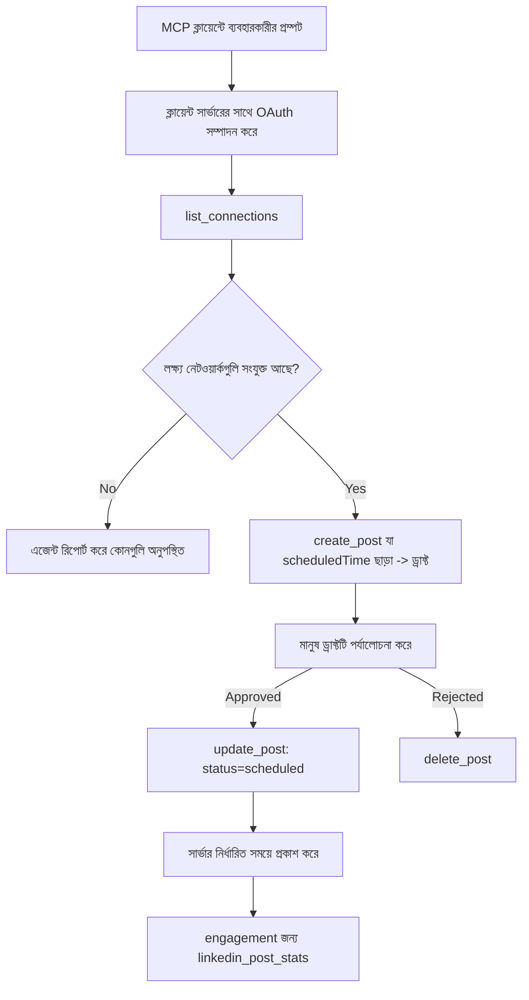

# কেস স্টাডি: একটি এজেন্ট থেকে রিমোট MCP সার্ভার ব্যবহার করে সোশ্যাল নেটওয়ার্কে প্রকাশনা

> **অস্বীকৃতি:** বিভিন্ন সার্ভিস এবং ওপেন-সোর্স প্রকল্প সোশ্যাল নেটওয়ার্কে প্রকাশনা করতে পারে, এবং একটি দল প্রত্যেক নেটওয়ার্কের API সরাসরি ইন্টিগ্রেটও করতে পারে। নিচের পরিস্থিতিটি একটি কাজ করা উদাহরণ হিসাবে প্রদান করা হয়েছে যে কীভাবে একটি **লিখনে সক্ষম রিমোট MCP সার্ভার** ডিজাইন ও ব্যবহৃত হতে পারে। Publora একটি বাণিজ্যিক সার্ভিস যার একটি ফ্রি স্তর রয়েছে; এখানে বর্ণিত প্যাটার্নগুলি যেকোন MCP সার্ভারের জন্য প্রযোজ্য যা একজন ব্যবহারকারীর হয়ে অপরিবর্তনীয় কাজ করে।

## ওভারভিউ

এজেন্টগণ বিষয়বস্তু খসড়া করতে ভালো, কিন্তু এটি বিতরণ করতে দুর্বল। একটি মডেল কয়েক সেকেন্ডে একটি রিলিজ ঘোষণা লিখতে পারে, তারপর কাজ থেমে যায়: প্রকাশনা মানে প্রতি নেটওয়ার্কে একটি API, প্রতি নেটওয়ার্কে একটি OAuth অ্যাপ, এবং প্রতি নেটওয়ার্কের জন্য আলাদা মিডিয়া নিয়ম। বেশির ভাগ দল এটি সমাধান করে হাতে ব্রাউজারে টেক্সট অনুলিপি করেই।

এই কেস স্টাডি দেখায় কীভাবে সেই শেষ ধাপটি একটি একক রিমোট MCP সার্ভার দিয়ে সম্পন্ন হয়, এবং — যেকোনো যিনি এটি তৈরি করছেন তাদের জন্য আরও সহায়ক — একটি **লিখনে সক্ষম** সার্ভারকে কী ডিজাইন সিদ্ধান্ত সঠিক করতে হবে। ডেটা পড়া তেমন কঠিন নয়। প্রকাশনা নয়: অসৎ টুল কল দর্শকের সামনে দৃশ্যমান এবং তা ফেরানো যায় না।

## পরিস্থিতি

একটি ছোট ডেভেলপার-সম্পর্ক দল একটি এজেন্টের ভিতরে পোস্ট খসড়া করে (Claude, VS Code, Cursor — ক্লায়েন্ট কোনটা তা গুরুত্বপূর্ণ নয়)। তারা চায় এজেন্টটি:

- দেখতে দল কোন সোশ্যাল অ্যাকাউন্টগুলো যুক্ত করেছে,
- একটি পোস্ট খসড়া করতে এবং সেটি মানুষের অনুমোদনের জন্য খসড়া হিসেবে রাখতে,
- একটি ছবি সংযুক্ত করতে,
- নির্ধারিত সময়ে একাধিক নেটওয়ার্কে শিডিউল করতে,
- এবং পরবর্তীতে কী ফলাফল ছিল তা রিপোর্ট করতে।

বিশেষভাবে, তারা চায় এজেন্ট **অবিচ্ছিন্নভাবে** প্রকাশনা করতে না পারে যখন তারা এখনও পরীক্ষা নিরীক্ষা করছে।

## ব্যবহৃত টুলসমূহ

- [Publora MCP Server](https://github.com/publora/mcp-server) — একটি রিমোট MCP সার্ভার (`streamable-http`) যা প্রকাশনা, শিডিউল, মিডিয়া এবং LinkedIn অ্যানালিটিক্স টুল সরবরাহ করে। অফিসিয়াল MCP রেজিস্ট্রিতে `com.publora/mcp-server` নামে নিবন্ধিত।

## ধাপে ধাপে কার্যপ্রবাহ

1. **সার্ভারের সাথে সংযোগ করুন।** OAuth ব্যবহার করা ক্লায়েন্টরা PKCE সহ সার্ভারের নিজস্ব সম্মতি স্ক্রিন দিয়ে অথরাইজেশন-কোড ফ্লো পূরণ করে; হেডলেস CLI এর মতো যারা OAuth ব্যবহার করে না, তারা হেডারে Publora API কী ব্যবহার করে। দুই পথই সমর্থিত, এবং কোনটি পাবেন তা ক্লায়েন্ট নির্ভর, সার্ভার নির্ভর নয়।
2. **সংযোগ তালিকা।** এজেন্ট `list_connections` কল করে এবং তাদের শনাক্তকরণসহ সংযুক্ত অ্যাকাউন্টগুলি পায়।
3. **খসড়া করুন।** এজেন্ট `create_post` কল করে *নির্ধারিত সময় ছাড়া।* পোস্টটি খসড়ারূপে সংরক্ষিত হয় — কিছু প্রকাশিত হয় না।
4. **মিডিয়া সংযুক্ত করুন।** একই কল-এ পাবলিক অবস্থিতির ইমেজ URL প্রদান করা হয়; সার্ভার তা ডাউনলোড করে যাচাই করে।
5. **শিডিউল করুন।** একজন মানুষ অনুমোদন করার পর, `update_post` স্ট্যাটাস নির্ধারিত সময়সহ সেট করে ISO 8601 টাইম ফরম্যাটে।
6. **পরিমাপ করুন।** LinkedIn এর জন্য, `linkedin_post_stats` পোস্ট লাইভ হওয়ার পর এঙ্গেজমেন্ট ফেরত দেয়।

## উদাহরণ প্রম্পট

```text
Which social accounts do I have connected?
Draft a post announcing our new changelog page, attach the screenshot at
https://example.com/changelog.png, and keep it as a draft — do not publish it.
Once I approve, schedule it to LinkedIn and Bluesky for tomorrow at 09:00 UTC.
```

## মারমেইড ফ্লোচার্ট



## প্রযুক্তিগত বাস্তবায়ন

নিচের পাঠগুলো এই কেস স্টাডির স্থানান্তরনীয় অংশ।

### খোলা আবিষ্কার, প্রমাণীকৃত কার্যকারিতা

`tools/list` ক্রেডেনশিয়াল ছাড়া সার্ভ করা হয়; প্রতি `tools/call` একটি টোকেন প্রয়োজন
এবং তা ব্যতীত `401` ফেরায় একটি `WWW-Authenticate` হেডার সহ যা
রক্ষা করা রিসোর্স মেটাডেটার দিকে নির্দেশ করে। সার্ভারের পুরাতন এন্ডপয়েন্টও একটি
নন-অথেনটিকেটেড `initialize` এর উত্তর দেয় প্রোটোকল সংস্করণ আগে
`2026-07-28` থেকে; বর্তমান ক্লায়েন্টরা হ্যান্ডশেক ব্যবহার করে না।

এই সার্ভার-নির্দিষ্ট বিভাজন রেজিস্ট্রির, ক্যাটালগ এবং ক্লায়েন্টদের কোনো গোপন ছাড়া টুল
নাম, স্কিমা, এবং এনোটেশনগুলো পরিদর্শন করতে দেয়, কিন্তু অজানা
কার্যকরতা থেকে রক্ষা করে। খোলা আবিষ্কারের একটি ডিপ্লয়মেন্ট পছন্দ, MCP অনिवार্য নয়; একটি
সুরক্ষিত ডিপ্লয়মেন্টে হয়তো `tools/list` এর জন্যও অথরাইজেশন প্রয়োজন হতে পারে।

### নিবন্ধন: গতিশীল ক্লায়েন্ট নিবন্ধন এবং এটি কী প্রতিস্থাপন করে

সার্ভার `/.well-known/oauth-protected-resource` এবং `/.well-known/oauth-authorization-server` ঘোষণা করে, এবং PKCE (`S256`), রিফ্রেশ টোকেন এবং **গতিশীল ক্লায়েন্ট নিবন্ধন** সহ অথরাইজেশন-কোড ফ্লো সমর্থন করে।

গতিশীল নিবন্ধন পুরাতন ক্লায়েন্টদের জন্য ম্যানুয়াল ধাপটি সরিয়ে দিয়েছে: তা ছাড়া,
প্রতিটি ক্লায়েন্টকে বিক্রেতা থেকে পূর্ব-ইস্যুকৃত `client_id` প্রয়োজন ছিল।

এটিকে সামঞ্জস্যপূর্ণ আচরণ হিসেবে বিবেচনা করুন, ডিজাইন হিসেবে নয়। স্পেসিফিকেশনের `2026-07-28` সংস্করণ গতিশীল ক্লায়েন্ট নিবন্ধন বাতিল করে ক্লায়েন্ট ID মেটাডেটা ডকুমেন্টের পক্ষে, যেখানে ক্লায়েন্ট একটি স্থিতিশীল HTTPS URL এ মেটাডেটা ডকুমেন্ট হোস্ট করে এবং সেই URL *হয়* `client_id`। DCR এখনো কাজ করে, কিন্তু আজকের কোনও সার্ভার CIMD এর পরিকল্পনা করা উচিত এবং DCR শুধু পুরানো ক্লায়েন্টদের জন্য রাখতে হবে।

### টুল এনোটেশন কেবল সাজসজ্জা নয়

প্রতিটি টুলে একটি `title` এবং প্রযোজ্য হিন্ট রয়েছে: `readOnlyHint`, `destructiveHint`, `idempotentHint`, `openWorldHint`।

দ্বিগুণ কারণ রয়েছে এতে বিনিয়োগ করার। প্রথমে, ক্লায়েন্ট হিন্ট ব্যবহার করে ব্যবহারকারীর সাথে কী নিশ্চিত করতে হবে তা সিদ্ধান্ত নেয় — ক্লায়েন্ট একটি রিড-ওনলি লুকআপ স্বয়ংক্রিয় চালাতে পারে এবং ডিলিটের আগে অনুমোদনের জন্য থেমে যেতে পারে। স্পেসিফিকেশন স্পষ্ট যে এনোটেশনগুলি বিশ্বাসযোগ্য হিন্ট, অথরাইজেশন পদ্ধতি নয়: এগুলো ক্লায়েন্ট যা করার প্রস্তাব দেয় সেটিকে গঠন করে, সার্ভার কিছু থামায় না, এবং সার্ভার অবশ্যই নিজস্ব নিয়ম প্রয়োগ করবে। দ্বিতীয়ত, প্রধান সংযোগকারী ডিরেক্টরিগুলো এখন *অনুমোদনের জন্য* এগুলো প্রয়োজন করে; যেসব সার্ভারের টুলে শিরোনাম ও হিন্ট নেই সেগুলো প্রত্যাখ্যাত হবে কাজ ভাল হওয়া সত্ত্বেও।

### শনাক্তকারীগুলো অনুমান অযোগ্য করুন

প্ল্যাটফর্ম শনাক্তকারীগুলো এমন অপ্যাক্ট স্ট্রিংস যেগুলো `list_connections` থেকে ফিরে আসে এবং স্কিমা বর্ণনায় স্পষ্ট বলা হয়েছে এগুলো সঠিকভাবে কপি করতে হবে এবং অনুমান করা যাবে না। সার্ভার অন্য কিছু প্রত্যাখ্যান করে।

মডেলগুলো প্রবাহমান অনুমানকারী। যেকোনো লিখনে সক্ষম সার্ভার ধরে নেবে শনাক্তকারী হয়তো হেলুসিনেটেড হবে এবং সেই পথে স্পষ্টভাবে ও দ্রুত ব্যর্থ হবে, ক্লায়েন্টকে সম্ভাব্য মানের উপর কাজ করাবে না।

### প্রকাশনার আগে ব্যর্থ হোন, কার্যকর বার্তাসহ

কিছু নেটওয়ার্ক শুধুমাত্র টেক্সট পোস্ট প্রত্যাখ্যান করে এবং একটি ছবি বা ভিডিও প্রয়োজন। এটা পোস্ট শিডিউল করার সময় যাচাই করা হয়, এবং ত্রুটিটি প্ল্যাটফর্ম ও অনুপস্থিত প্রয়োজনীয়তা নাম হিসেবে জানায়।

একটি এজেন্ট "Instagram মিডিয়া প্রয়োজন — ছবি বা ভিডিও সংযুক্ত করুন" এর থেকে পুনরুদ্ধার করতে পারে অতিরিক্ত রাউন্ড ট্রিপ ছাড়াই। এটি সাধারণ `400` থেকে পুনরুদ্ধার করতে পারে না।

### পুনরায় চেষ্টা নিরাপদ করুন

দুটি টুল যা বিষয়বস্তু তৈরি করে, `create_post` এবং `update_post`, একটি আইডেমপোটেন্সি কী গ্রহণ করে: একই কীর সঙ্গে অনুরোধ পুনরায় করলে মূল প্রতিক্রিয়া আবার দেয়, দ্বিতীয় পোস্ট তৈরি করে না। এজেন্ট রানটাইম টাইমআউটের সময় পুনরায় চেষ্টা করে; আইডেমপোটেন্সি ছাড়া ধীর প্রতিক্রিয়া ভুয়া প্রকাশনা। অন্য লিখন টুলগুলো—মুছে ফেলা, মিডিয়া স্টেপ, LinkedIn প্রতিক্রিয়া ও মন্তব্য—একটি গ্রহণ করে না, তাই সেখানে পুনরায় চেষ্টা স্বয়ংক্রিয়ভাবে নিরাপদ নয়। নিজের মিউটেশনের কী সুরক্ষিত এবং কী নয় জানা দরকার।

### কিছুই প্রকাশ না করে পরীক্ষার উপায় দিন

সার্ভার একটি সংরক্ষিত গন্তব্য, `publora-playground` গ্রহণ করে, যা যাচাই ও স্বীকৃত হয় আসল গন্তব্যের মতো এবং তারপর বাতিল করা হয় — কিছুই লাইভ অ্যাকাউন্টে পৌঁছায় না। এটি টুল স্কিমাতেই বর্ণিত, যেটি কোনো ক্লায়েন্ট ক্রেডেনশিয়াল ছাড়াই পড়তে পারে: `create_post` এর `platforms` ক্ষেত্র এটি "একটি সংযোগ-পরীক্ষার লক্ষ্য যা কোনো আসল সংযোগের প্রয়োজন নেই — পোস্ট স্বীকৃত এবং বাতিল, কিছুই প্রকাশিত নয়" হিসেবে ডকুমেন্ট করা হয়েছে। একমাত্র হিসাবে পাস করে আহ্বান করুন: `platforms: ["publora-playground"]`।

পুরো সার্ফেসের সবচেয়ে উপকারী বিবরণগুলোর একটি এটি। কানেক্টর ডিরেক্টরির পর্যালোচক, অবদানকারী ও CI সবাই পূর্ণ লিখন পথ শেষ থেকে শেষ পর্যন্ত কোনো বাস্তব দর্শকের ঝুঁকি ছাড়া অনুশীলন করতে পারে। যেকোন MCP সার্ভার যার অপরিবর্তনীয় কাজ আছে তার নথিভুক্ত নো-অপ লক্ষ্য থেকে লাভ।

## ফলাফল এবং প্রভাব

- প্রকাশনা ধাপ ব্রাউজার থেকে একই কথোপকথনে চলে গেছে যেখানে বিষয়বস্তু লেখা হয়, এবং একটি খসড়া-প্রথম অভ্যাস মানুষকে যুক্ত রাখে। সুনির্দিষ্ট থাকুন এটা কী: খসড়া একটি রীতিনীতি, সীমানা নয়। একই ক্রেডেনশিয়াল শিডিউল বা প্রকাশ করতে পারে, তাই যারা আসল অনুমোদন দরকার তাদের টুল সার্ফেসের বাইরে এটি নিশ্চিত করতে হবে — পৃথক ক্রেডেনশিয়াল অথবা সার্ভারের সামনে নীতি স্তর।
- প্রতি নেটওয়ার্ক পার্থক্য — মিডিয়া প্রয়োজনীয়তা, থ্রেডিং, রিপ্লাই নিয়ন্ত্রণ — একবার সার্ভারে হ্যান্ডেল হয়, প্রত্যেক এজেন্টে নয়।
- একই সার্ভার অনেক MCP ক্লায়েন্টকে পূর্ব-নির্ধারিত ক্রেডেনশিয়াল ছাড়া সাপোর্ট করে।
    বর্তমান ক্লায়েন্টরা ক্লায়েন্ট ID মেটাডেটা ডকুমেন্ট ব্যবহার করতে পারে; DCR পুরানোদের জন্য ব্যাকআপ।

- উপরের ডিজাইন বিধিনিষেধ কানেক্টর-ডিরেক্টরি পর্যালোচনা এবং ব্যবহারকারীর মতামত দ্বারা গড়া: এনোটেশন, OAuth এবং একটি সুরক্ষিত পরীক্ষার টার্গেট প্রত্যেকই অন্তত একজনের মাধ্যমে প্রয়োজনীয় হয়েছে।

## রেফারেন্স

- [Publora MCP Server (সোর্স)](https://github.com/publora/mcp-server)
- [Publora API এবং MCP ডকুমেন্টেশন](https://docs.publora.com)
- [MCP রেজিস্ট্রি এন্ট্রি: `com.publora/mcp-server`](https://registry.modelcontextprotocol.io/v0/servers?search=com.publora/mcp-server)
- [MCP স্পেসিফিকেশন — অথরাইজেশন](https://modelcontextprotocol.io/specification/2026-07-28/basic/authorization)
- [MCP স্পেসিফিকেশন — টুল এনোটেশন](https://modelcontextprotocol.io/docs/concepts/tools)

## পরবর্তী পদক্ষেপ

- আপনি যে MCP সার্ভার বানাচ্ছেন তা নিয়ে এখানে তিনটি সস্তা জয়ের বিষয়ে পরীক্ষা করুন: প্রতিটি টুলে এনোটেশন, প্রতিটি লিখনে আইডেমপোটেন্সি কী, এবং নথিভুক্ত নো-অপ টার্গেট।
- খোলা-আবিষ্কার বিভাজন চেষ্টা করুন: একটি পাবলিক রিমোট সার্ভারে কোনো ক্রেডেনশিয়াল ছাড়া `tools/list` কল করুন, তারপর একটি টুল কল করে `401` চ্যালেঞ্জ দেখুন।
- আপনার ডোমেনে "শেষ করা" কী বুঝায় তা বিবেচনা করুন। প্রকাশনায় খসড়া এবং মুছে ফেলা থাকে; যদি আপনার কর্মের সমান কিছু না থাকে, নিশ্চিতিকরণ টুল ডিজাইনে থাকা উচিত, প্রম্পটে নয়।

---

<!-- CO-OP TRANSLATOR DISCLAIMER START -->
**অস্বীকৃতি**:
এই নথিটি AI অনুবাদ পরিষেবা [Co-op Translator](https://github.com/Azure/co-op-translator) ব্যবহার করে অনূদিত হয়েছে। যদিও আমরা শুদ্ধতার জন্য চেষ্টা করি, অনুগ্রহ করে মনে রাখবেন যে স্বয়ংক্রিয় অনুবাদে ত্রুটি বা অসঙ্গতি থাকতে পারে। মূল নথিটি তার স্বভাষায় কর্তৃত্বপূর্ণ উৎস হিসেবে বিবেচিত হওয়া উচিত। গুরুত্বপূর্ণ তথ্যের জন্য পেশাদার মানব অনুবাদ সুপারিশ করা হয়। এই অনুবাদের ব্যবহারে প্রয়োজনীয় ভুল বোঝাবুঝি বা ভুল ব্যাখ্যার জন্য আমরা দায়বদ্ধ নই।
<!-- CO-OP TRANSLATOR DISCLAIMER END -->