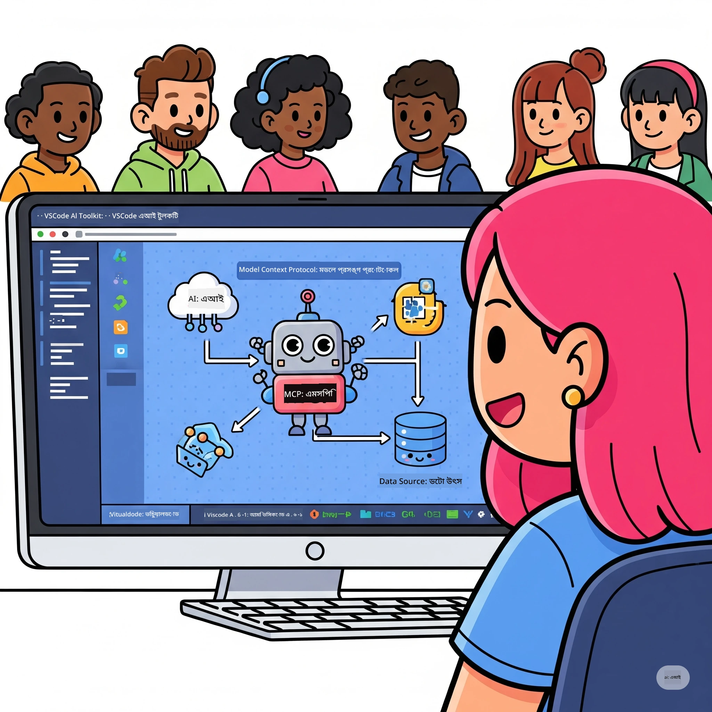

# এআই ওয়ার্কফ্লোগুলিকে সহজতর করা: Microsoft Foundry Toolkit দিয়ে একটি MCP সার্ভার তৈরি

## 🎯  ওভারভিউ

_(এই লেসনের ভিডিও দেখতে উপরের ছবিতে ক্লিক করুন)_

**মডেল কনটেক্সট প্রোটোকল (MCP) ওয়ার্কশপে** আপনাকে স্বাগতম! এই ব্যাপক হ্যান্ডস-অন ওয়ার্কশপটি দুটি অগ্রণী প্রযুক্তি একত্রিত করে AI অ্যাপ্লিকেশন ডেভেলপমেন্টে বিপ্লব ঘটায়:

> **কম্প্যাটিবিলিটি নোট:** ওয়ার্কশপ কোডটি MCP
> `2025-11-25` অনুসারে তৈরি এবং পরীক্ষা করা হয়েছে, উপরের ব্যাজ দ্বারা প্রদর্শিত। নতুন
> প্রোটোকল ইমপ্লিমেন্টেশনের জন্য
> [বর্তমান `2026-07-28` স্পেসিফিকেশন](https://modelcontextprotocol.io/specification/2026-07-28/)
> ব্যবহার করুন এবং ল্যাবগুলো মাইগ্রেট করার আগে SDK রিলিজ নোটগুলি দেখুন।

- **🔗 মডেল কনটেক্সট প্রোটোকল (MCP)**: নির্বিঘ্ন AI-টুল ইন্টিগ্রেশনের জন্য একটি খোলা স্ট্যান্ডার্ড
- **🛠️ VS Code এর জন্য Microsoft Foundry Toolkit এক্সটেনশন**: Microsoft-এর শক্তিশালী AI ডেভেলপমেন্ট এক্সটেনশন

### 🎓 আপনি কী শিখবেন

এই ওয়ার্কশপের শেষে, আপনি বুদ্ধিমান অ্যাপ্লিকেশন তৈরি করার কলাকৌশল আয়ত্ত করবেন যা AI মডেলকে বাস্তব বিশ্বের টুল এবং সার্ভিসের সাথে সংযুক্ত করে। স্বয়ংক্রিয় পরীক্ষণ থেকে শুরু করে কাস্টম API ইন্টিগ্রেশন পর্যন্ত, আপনি জটিল ব্যবসায়িক চ্যালেঞ্জ সমাধানের জন্য বাস্তব দক্ষতা অর্জন করবেন।

## 🏗️ প্রযুক্তি স্ট্যাক

### 🔌 মডেল কনটেক্সট প্রোটোকল (MCP)

MCP হল **"AI এর জন্য USB-C"** - একটি সার্বজনীন স্ট্যান্ডার্ড যা AI মডেলকে বাহ্যিক টুল এবং ডেটা উৎসের সাথে সংযুক্ত করে।

**✨ মূল বৈশিষ্ট্য:**

- 🔄 **স্ট্যান্ডার্ডাইজড ইন্টিগ্রেশন**: AI-টুল সংযোগের জন্য ইউনিভার্সাল ইন্টারফেস
- 🏛️ **লচিল আর্কিটেকচার**: stdio/SSE ট্রান্সপোর্টের মাধ্যমে লোকাল এবং রিমোট সার্ভার
- 🧰 **সমৃদ্ধ ইকোসিস্টেম**: এক প্রোটোকলে টুল, প্রম্পট, এবং রিসোর্স
- 🔒 **এন্টারপ্রাইজ-উপযোগী**: বিল্ট-ইন সিকিউরিটি এবং বিশ্বাসযোগ্যতা

**🎯 কেন MCP গুরুত্বপূর্ণ:**
যেমন USB-C তারের জটিলতা দূর করেছিল, MCP AI ইন্টিগ্রেশনের জটিলতা দূর করে। এক প্রোটোকল, অসীম সম্ভাবনা।

### 🤖 VS Code এর জন্য Microsoft Foundry Toolkit এক্সটেনশন

Microsoft-এর মুখ্য AI ডেভেলপমেন্ট এক্সটেনশন যা VS Code-কে একটি AI পাওয়ারহাউসে রূপান্তর করে।

**🚀 মূল সক্ষমতা:**

- 📦 **মডেল ক্যাটালগ**: Azure AI, GitHub, Hugging Face, Ollama থেকে মডেল অ্যাক্সেস
- ⚡ **লোকাল ইনফারেন্স**: ONNX-অপ্টিমাইজড CPU/GPU/NPU কার্যকরী
- 🏗️ **এজেন্ট বিল্ডার**: MCP ইন্টিগ্রেশনসহ ভিজুয়াল AI এজেন্ট ডেভেলপমেন্ট
- 🎭 **মাল্টি-মোডাল**: টেক্সট, ভিশন, এবং স্ট্রাকচার্ড আউটপুট সাপোর্ট

**💡 ডেভেলপমেন্ট সুবিধা:**

- জিরো-কনফিগ মডেল ডিপ্লয়মেন্ট
- ভিজ্যুয়াল প্রোম্প্ট ইঞ্জিনিয়ারিং
- রিয়েল-টাইম টেস্টিং প্লেগ্রাউন্ড
- নির্বিঘ্ন MCP সার্ভার ইন্টিগ্রেশন

## 📚 শেখার যাত্রা

### [🚀 মডিউল ১: মাইক্রোসফট ফাউন্ড্রি টুলকিট ফান্ডামেন্টালস](./lab1/README.md)

**সময়কাল**: ১৫ মিনিট

- 🛠️ ভিএস কোডের জন্য মাইক্রোসফট ফাউন্ড্রি টুলকিট ইনস্টল ও কনফিগার করা
- 🗂️ মডেল ক্যাটালগ (GitHub, ONNX, OpenAI, Anthropic, Google থেকে ১০০+ মডেল) অন্বেষণ করা
- 🎮 রিয়েল-টাইম মডেল টেস্টিংয়ের জন্য ইন্টারেক্টিভ প্লেগ্রাউন্ডে পারদর্শী হওয়া
- 🤖 এজেন্ট বিল্ডার দিয়ে আপনার প্রথম AI এজেন্ট তৈরি করা
- 📊 বিল্ট-ইন মেট্রিক্স (F1, প্রাসঙ্গিকতা, সাদৃশ্য, সামঞ্জস্য) দিয়ে মডেল পারফরম্যান্স মূল্যায়ন করা
- ⚡ ব্যাচ প্রসেসিং ও মাল্টি-মোডাল সাপোর্ট সক্ষমতা শেখা

**🎯 শেখার ফলাফল**: মাইক্রোসফট ফাউন্ড্রি টুলকিট সক্ষমতার ব্যাপক জ্ঞান নিয়ে একটি কার্যকরী AI এজেন্ট তৈরি করা

### [🌐 মডিউল ২: মাইক্রোসফট ফাউন্ড্রি টুলকিট ফান্ডামেন্টালস সহ MCP](./lab2/README.md)

**সময়কাল**: ২০ মিনিট

- 🧠 মডেল কনটেক্সট প্রোটোকল (MCP) আর্কিটেকচার এবং ধারণাগুলো আয়ত্ত করা
- 🌐 মাইক্রোসফটের MCP সার্ভার ইকোসিস্টেম অন্বেষণ করা
- 🤖 প্লে রাইট MCP সার্ভার ব্যবহার করে ব্রাউজার অটোমেশন এজেন্ট তৈরি করা
- 🔧 MCP সার্ভারগুলো মাইক্রোসফট ফাউন্ড্রি টুলকিট এজেন্ট বিল্ডারের সাথে ইন্টিগ্রেট করা
- 📊 আপনার এজেন্টে MCP টুলস কনফিগার ও পরীক্ষা করা
- 🚀 MCP-সক্ষম এজেন্ট রপ্তানি এবং প্রোডাকশনে ডিপ্লয় করা

**🎯 শেখার ফলাফল**: MCP মাধ্যমে বাহ্যিক সরঞ্জামসমূহের সাথে সুপারচার্জড AI এজেন্ট ডিপ্লয় করা

### [🔧 মডিউল ৩: মাইক্রোসফট ফাউন্ড্রি টুলকিটের সাথে অ্যাডভান্সড MCP ডেভেলপমেন্ট](./lab3/README.md)

**সময়কাল**: ২০ মিনিট

- 💻 মাইক্রোসফট ফাউন্ড্রি টুলকিট ব্যবহার করে কাস্টম MCP সার্ভার তৈরি করা
- 🐍 সর্বশেষ MCP পাইথন SDK (v1.9.3) কনফিগার এবং ব্যবহার করা
- 🔍 ডিবাগিংয়ের জন্য MCP ইন্সপেক্টর সেট আপ ও ব্যবহার করা
- 🛠️ প্রফেশনাল ডিবাগিং ওয়ার্কফ্লোতে একটি ওয়েদার MCP সার্ভার তৈরি করা
- 🧪 এজেন্ট বিল্ডার এবং ইন্সপেক্টর পরিবেশে MCP সার্ভার ডিবাগ করা

**🎯 শেখার ফলাফল**: আধুনিক টুলিং ব্যবহার করে কাস্টম MCP সার্ভার ডেভেলপ এবং ডিবাগ করা

### [🐙 মডিউল ৪: প্র্যাকটিক্যাল MCP ডেভেলপমেন্ট - কাস্টম GitHub ক্লোন সার্ভার](./lab4/README.md)

**সময়কাল**: ৩০ মিনিট

- 🏗️ ডেভেলপমেন্ট ওয়ার্কফ্লোর জন্য একটি বাস্তব জগৎ GitHub ক্লোন MCP সার্ভার তৈরি করা
- 🔄 যাচাই এবং এরর হ্যান্ডলিং সহ স্মার্ট রিপোজিটরি ক্লোনিং বাস্তবায়ন করা
- 📁 বুদ্ধিমত্তাসম্পন্ন ডিরেক্টরি ম্যানেজমেন্ট ও ভিএস কোড ইন্টিগ্রেশন তৈরি করা
- 🤖 কাস্টম MCP টুলস নিয়ে GitHub Copilot Agent Mode ব্যবহার করা
- 🛡️ প্রোডাকশন রেডি রিলায়েবিলিটি ও ক্রস-প্ল্যাটফর্ম সামঞ্জস্য প্রয়োগ করা

**🎯 শেখার ফলাফল**: একটি প্রোডাকশন-রেডি MCP সার্ভার ডিপ্লয় করা যা প্রকৃত ডেভেলপমেন্ট ওয়ার্কফ্লোগুলোকে সহজতর করে

## 💡 বাস্তব বিশ্ব অ্যাপ্লিকেশন ও প্রভাব

### 🏢 এন্টারপ্রাইজ ব্যবহার ক্ষেত্রসমূহ

#### 🔄 ডেভঅপস অটোমেশন

বুদ্ধিমত্তাসম্পন্ন অটোমেশনের মাধ্যমে আপনার ডেভেলপমেন্ট ওয়ার্কফ্লো রূপান্তর করুন:

- **স্মার্ট রিপোজিটরি ম্যানেজমেন্ট**: AI-চালিত কোড রিভিউ এবং মার্জ সিদ্ধান্ত
- **বুদ্ধিমত্তাসম্পন্ন CI/CD**: কোড পরিবর্তনের ভিত্তিতে স্বয়ংক্রিয় পাইপলাইন অপ্টিমাইজেশন
- **ইস্যু ট্রায়াজ**: স্বয়ংক্রিয় বাগ শ্রেণীবিন্যাস এবং অ্যাসাইনমেন্ট

#### 🧪 কোয়ালিটি অ্যাসুরেন্স বিপ্লব

AI-চালিত অটোমেশনের মাধ্যমে টেস্টিং উন্নত করুন:

- **বুদ্ধিমত্তাসম্পন্ন টেস্ট জেনারেশন**: স্বয়ংক্রিয়ভাবে ব্যাপক টেস্ট স্যুট তৈরি করা
- **ভিজ্যুয়াল রিগ্রেশন টেস্টিং**: AI-চালিত UI পরিবর্তন সনাক্তকরণ
- **পারফরম্যান্স মনিটরিং**: সক্রিয় সমস্যা সনাক্তকরণ ও সমাধান

#### 📊 ডেটা পাইপলাইন ইন্টেলিজেন্স

আরও বুদ্ধিমান ডেটা প্রক্রিয়াকরণ ওয়ার্কফ্লো তৈরি করুন:

- **অ্যাডাপটিভ ETL প্রসেস**: স্ব-অপটিমাইজিং ডেটা রূপান্তর
- **এনোমালি ডিটেকশন**: রিয়েল-টাইম ডেটা কোয়ালিটি ম্যানিটরিং
- **ইন্টেলিজেন্ট রাউটিং**: স্মার্ট ডেটা ফ্লো ব্যবস্থাপনা

#### 🎧 গ্রাহক অভিজ্ঞতা উন্নয়ন

অসাধারণ গ্রাহক ইন্টারঅ্যাকশন তৈরি করুন:

- **প্রসঙ্গ সচেতন সহায়তা**: গ্রাহকের ইতিহাস অ্যাক্সেস সহ AI এজেন্ট
- **প্রোঅ্যাকটিভ সমস্যা সমাধান**: পূর্বাভাসমূলক গ্রাহক সেবা
- **মাল্টি-চ্যানেল ইন্টিগ্রেশন**: প্ল্যাটফর্ম জুড়ে একক AI অভিজ্ঞতা

## 🛠️ পূর্বশর্তসমূহ ও সেটআপ

### 💻 সিস্টেমের চাহিদা

| উপাদান | চাহিদা | নোট |
|-----------|-------------|-------|
| **অপারেটিং সিস্টেম** | উইন্ডোজ 10+, মাকওএস 10.15+, লিনাক্স | যেকোন আধুনিক OS |
| **ভিজ্যুয়াল স্টুডিও কোড** | সাম্প্রতিক স্থিতিশীল সংস্করণ | Microsoft Foundry Toolkit এর জন্য প্রয়োজনীয় |
| **Node.js** | v18.0+ এবং npm | MCP সার্ভার উন্নয়নের জন্য |
| **Python** | 3.10+ | ঐচ্ছিক Python MCP সার্ভার জন্য |
| **মেমরি** | সর্বনিম্ন 8GB RAM | স্থানীয় মডেলগুলির জন্য 16GB সুপারিশকৃত |

### 🔧 ডেভেলপমেন্ট পরিবেশ

#### সুপারিশকৃত VS কোড এক্সটেনশনসমূহ

- **Microsoft Foundry Toolkit** (ms-windows-ai-studio.windows-ai-studio)
- **Python** (ms-python.python)
- **Python Debugger** (ms-python.debugpy)
- **GitHub Copilot** (GitHub.copilot) - ঐচ্ছিক কিন্তু সহায়ক

#### ঐচ্ছিক সরঞ্জামসমূহ

- **uv**: আধুনিক Python প্যাকেজ ম্যানেজার
- **MCP Inspector**: MCP সার্ভারগুলোর জন্য ভিজ্যুয়াল ডিবাগিং টুল
- **Playwright**: ওয়েব অটোমেশন উদাহরণগুলির জন্য

## 🎖️ শেখার ফলাফল ও সার্টিফিকেশন পাথ

### 🏆 দক্ষতা অর্জন চেকলিস্ট

এই কর্মশালা সম্পন্ন করে, আপনি দক্ষতা অর্জন করবেন:

#### 🎯 মূল দক্ষতাসমূহ

- [ ] **MCP প্রোটোকল মাস্টারি**: আর্কিটেকচার ও বাস্তবায়ন প্যাটার্নের গভীর জ্ঞান
- [ ] **Microsoft Foundry Toolkit দক্ষতা**: দ্রুত উন্নয়নের জন্য Microsoft Foundry Toolkit এর বিশেষজ্ঞ স্তরের ব্যবহার
- [ ] **কাস্টম সার্ভার উন্নয়ন**: MCP সার্ভার তৈরি, মোতায়েন ও রক্ষণাবেক্ষণ
- [ ] **টুল ইন্টিগ্রেশন উৎকর্ষ**: বিদ্যমান ডেভেলপমেন্ট ওয়ার্কফ্লোর সাথে AI এর সিমলেস সংযোগ
- [ ] **সমস্যা সমাধান প্রয়োগ**: শেখা দক্ষতাগুলি বাস্তব ব্যবসায়িক চ্যালেঞ্জে প্রয়োগ

#### 🔧 প্রযুক্তিগত দক্ষতা

- [ ] VS কোডে Microsoft Foundry Toolkit সেটআপ ও কনফিগারেশন
- [ ] কাস্টম MCP সার্ভার ডিজাইন ও বাস্তবায়ন
- [ ] MCP আর্কিটেকচারের সাথে GitHub মডেল ইন্টিগ্রেশন
- [ ] Playwright দিয়ে স্বয়ংক্রিয় টেস্টিং ওয়ার্কফ্লো নির্মাণ
- [ ] প্রোডাকশনের জন্য AI এজেন্ট মোতায়েন
- [ ] MCP সার্ভারের পারফরম্যান্স ডিবাগ ও অপটিমাইজ করা

#### 🚀 উন্নত সক্ষমতা

- [ ] এন্টারপ্রাইজ-স্কেল AI ইন্টিগ্রেশন আর্কিটেক্ট করা
- [ ] AI অ্যাপ্লিকেশনের জন্য সুরক্ষা সর্বোত্তম অনুশীলন বাস্তবায়ন করা
- [ ] স্কেলযোগ্য MCP সার্ভার আর্কিটেকচার ডিজাইন করা
- [ ] নির্দিষ্ট ডোমেইনের জন্য কাস্টম টুল চেইন তৈরি করা
- [ ] AI-নেটিভ ডেভেলপমেন্টে অন্যদের পরামর্শ দেওয়া

## 📖 অতিরিক্ত সম্পদসমূহ

- [MCP স্পেসিফিকেশন (2026-07-28)](https://modelcontextprotocol.io/specification/2026-07-28/)
- [Microsoft Foundry Toolkit GitHub রিপোজিটরি](https://github.com/microsoft/vscode-ai-toolkit)
- [নমুনা MCP সার্ভার সংগ্রহ](https://github.com/modelcontextprotocol/servers)
- [সেরা অনুশীলন গাইড](https://modelcontextprotocol.io/docs/best-practices)
- [OWASP MCP টপ 10](https://microsoft.github.io/mcp-azure-security-guide/mcp/) - সুরক্ষার সর্বোত্তম অনুশীলন

---

**🚀 আপনার AI ডেভেলপমেন্ট ওয়ার্কফ্লো পরিবর্তনের জন্য প্রস্তুত?**

আসুন MCP এবং Microsoft Foundry Toolkit দিয়ে একসাথে বুদ্ধিমান অ্যাপ্লিকেশনের ভবিষ্যত তৈরি করি!

## পরবর্তী ধাপ

অব্যাহত রাখুন: [মডিউল ১১: MCP সার্ভার হ্যান্ডস-অন ল্যাবস](../11-MCPServerHandsOnLabs/README.md)

---

<!-- CO-OP TRANSLATOR DISCLAIMER START -->
**অস্বীকৃতি**:
এই নথিটি AI অনুবাদ পরিষেবা [Co-op Translator](https://github.com/Azure/co-op-translator) ব্যবহার করে অনূদিত হয়েছে। যদিও আমরা শুদ্ধতার জন্য চেষ্টা করি, অনুগ্রহ করে মনে রাখবেন যে স্বয়ংক্রিয় অনুবাদে ত্রুটি বা অসঙ্গতি থাকতে পারে। মূল নথিটি তার স্বভাষায় কর্তৃত্বপূর্ণ উৎস হিসেবে বিবেচিত হওয়া উচিত। গুরুত্বপূর্ণ তথ্যের জন্য পেশাদার মানব অনুবাদ সুপারিশ করা হয়। এই অনুবাদের ব্যবহারে প্রয়োজনীয় ভুল বোঝাবুঝি বা ভুল ব্যাখ্যার জন্য আমরা দায়বদ্ধ নই।
<!-- CO-OP TRANSLATOR DISCLAIMER END -->