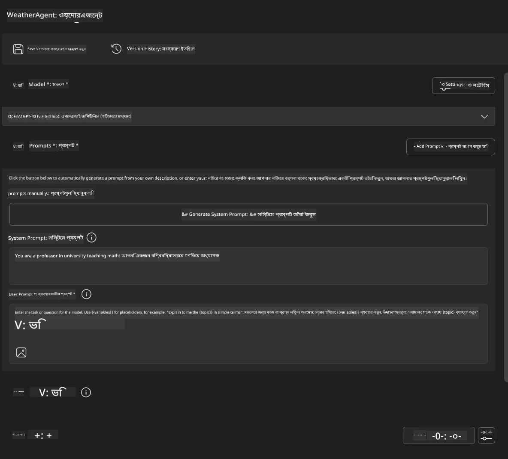
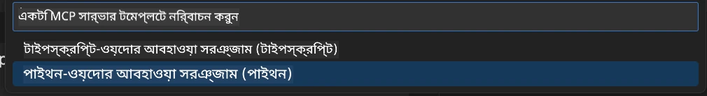
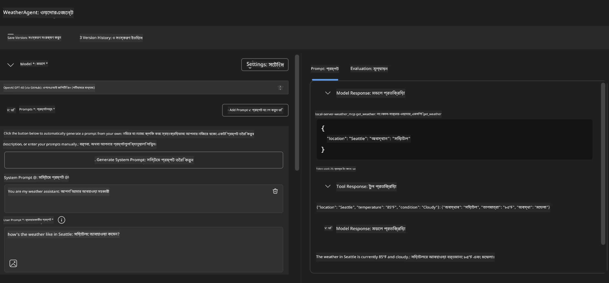
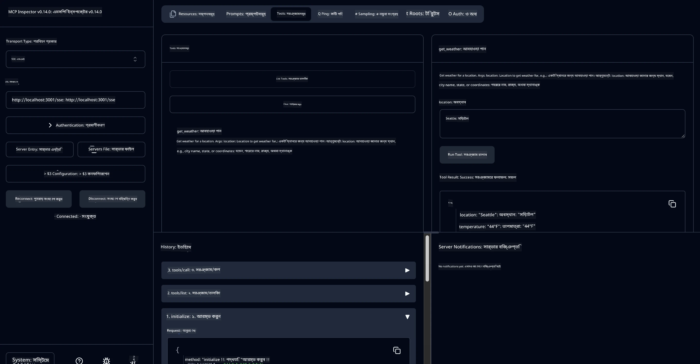

# 🔧 মডিউল ৩: মাইক্রোসফ্ট ফাউন্ড্রি টুলকিট সহ উন্নত MCP ডেভেলপমেন্ট

> [!NOTE]
> এই ল্যাবের Inspector URL গুলো পুরানো `/sse` এন্ডপয়েন্ট ব্যবহার করে এবং লক্ষ্য করে
> নির্দিষ্ট MCP SDK `1.9.3` এবং Inspector `0.14.0` নির্ভরশীলতাগুলোকে। এগুলো বর্তমান
> `2026-07-28` Streamable HTTP উদাহরণ নয়।


## 🎯 শেখার উদ্দেশ্যসমূহ

এই ল্যাবের শেষে, আপনি সক্ষম হবেন:

- ✅ মাইক্রোসফ্ট ফাউন্ড্রি টুলকিট ব্যবহার করে কাস্টম MCP সার্ভার তৈরি করা
- ✅ সর্বশেষ MCP Python SDK (v1.9.3) কনফিগার ও ব্যবহার করা
- ✅ বাগ ধরার জন্য MCP Inspector সেট আপ এবং ব্যবহার করা
- ✅ Agent Builder এবং Inspector পরিবেশে MCP সার্ভার ডিবাগ করা
- ✅ উন্নত MCP সার্ভার ডেভেলপমেন্ট কর্মপ্রবাহ বুঝা

## 📋 পূর্বের প্রয়োজনীয়তা

- ল্যাব ২ (MCP মূল বিষয়) সম্পূর্ণ করা
- VS Code-এ Microsoft Foundry Toolkit এক্সটেনশন ইনস্টল করা
- Python 3.10+ পরিবেশ
- Inspector সেট আপের জন্য Node.js এবং npm

## 🏗️ আপনি যা তৈরি করবেন

এই ল্যাবে, আপনি একটি **Weather MCP Server** তৈরি করবেন যা প্রদর্শন করবে:
- কাস্টম MCP সার্ভার বাস্তবায়ন
- Microsoft Foundry Toolkit Agent Builder-এর সাথে ইন্টিগ্রেশন
- পেশাদার ডিবাগিং কর্মপ্রবাহ
- আধুনিক MCP SDK ব্যবহার প্যাটার্ন

---

## 🔧 মূল উপাদান পর্যালোচনা

### 🐍 MCP Python SDK
Model Context Protocol Python SDK হল কাস্টম MCP সার্ভার তৈরির ভিত্তি। আপনি সংস্করণ 1.9.3 ব্যবহার করবেন উন্নত ডিবাগিং সক্ষমতাসহ।

### 🔍 MCP Inspector
একটি শক্তিশালী ডিবাগিং টুল যা প্রদান করে:
- রিয়েল-টাইম সার্ভার পর্যবেক্ষণ
- টুল কার্যকারিতা ভিজ্যুয়ালাইজেশন
- নেটওয়ার্ক অনুরোধ/প্রতিক্রিয়া পরিদর্শন
- ইন্টারঅ্যাক্টিভ টেস্টিং পরিবেশ

---

## 📖 ধাপে ধাপে বাস্তবায়ন

### ধাপ ১: Agent Builder-এ WeatherAgent তৈরি করা

১. **Agent Builder চালু করুন** VS Code-এ Microsoft Foundry Toolkit এক্সটেনশন এর মাধ্যমে
২. **নতুন এজেন্ট তৈরি করুন** নিম্নলিখিত কনফিগারেশন দিয়ে:
   - এজেন্ট নাম: `WeatherAgent`



### ধাপ ২: MCP সার্ভার প্রকল্প শুরু করা

১. **Agent Builder-এ Tools → Add Tool এ যান**
২. **উপলব্ধ অপশন থেকে "MCP Server" নির্বাচন করুন**
৩. **"Create A new MCP Server" নির্বাচন করুন**
৪. **`python-weather` টেমপ্লেট নির্বাচন করুন**
৫. **আপনার সার্ভারের নাম দিন:** `weather_mcp`



### ধাপ ৩: প্রকল্প খুলে পর্যালোচনা করা

১. **তৈরি হওয়া প্রকল্পটি VS Code-এ খুলুন**
২. **প্রকল্প কাঠামো পর্যালোচনা করুন:**
   ```
   weather_mcp/
   ├── src/
   │   ├── __init__.py
   │   └── server.py
   ├── inspector/
   │   ├── package.json
   │   └── package-lock.json
   ├── .vscode/
   │   ├── launch.json
   │   └── tasks.json
   ├── pyproject.toml
   └── README.md
   ```

### ধাপ ৪: সর্বশেষ MCP SDK তে আপগ্রেড করুন

> **🔍 কেন আপগ্রেড?** আমরা সর্বশেষ MCP SDK (v1.9.3) এবং Inspector সার্ভিস (0.14.0) ব্যবহার করতে চাই উন্নত ফিচার ও উন্নত ডিবাগিং সক্ষমতার জন্য।

#### ৪ক. পাইথন নির্ভরশীলতা আপডেট

**`pyproject.toml` সম্পাদনা করুন:** আপডেট করুন [./code/weather_mcp/pyproject.toml](../../../../10-StreamliningAIWorkflowsBuildingAnMCPServerWithAIToolkit/lab3/code/weather_mcp/pyproject.toml)


#### ৪খ. Inspector কনফিগারেশন আপডেট

**`inspector/package.json` সম্পাদনা করুন:** আপডেট করুন [./code/weather_mcp/inspector/package.json](../../../../10-StreamliningAIWorkflowsBuildingAnMCPServerWithAIToolkit/lab3/code/weather_mcp/inspector/package.json)

#### ৪গ. Inspector নির্ভরশীলতা আপডেট

**`inspector/package-lock.json` সম্পাদনা করুন:** আপডেট করুন [./code/weather_mcp/inspector/package-lock.json](../../../../10-StreamliningAIWorkflowsBuildingAnMCPServerWithAIToolkit/lab3/code/weather_mcp/inspector/package-lock.json)

> **📝 নোট:** এই ফাইলে বিস্তৃত নির্ভরশীলতা সংজ্ঞা রয়েছে। নিচে মূল কাঠামো দেখানো হয়েছে - সম্পূর্ণ বিষয়বস্তু সঠিক নির্ভরশীলতা সমাধানের নিশ্চয়তা দেয়।


> **⚡ পূর্ণ প্যাকেজ লক:** সম্পূর্ণ package-lock.json প্রায় ৩০০০ লাইনের নির্ভরশীলতা সংজ্ঞা ধারণ করে। উপরে দেখানো হয়েছে মূল কাঠামো - সম্পূর্ণ নির্ভরশীলতা সমাধানের জন্য প্রদত্ত ফাইল ব্যবহার করুন।

### ধাপ ৫: VS Code ডিবাগিং কনফিগারেশন কনফিগার করুন

*দ্রষ্টব্য: নির্দিষ্ট পথের ফাইলটি অনুগ্রহ করে কপি করে স্থানীয় ফাইল প্রতিস্থাপন করুন*

#### ৫ক. লঞ্চ কনফিগারেশন আপডেট

**`.vscode/launch.json` সম্পাদনা করুন:**

```json
{
  "version": "0.2.0",
  "configurations": [
    {
      "name": "Attach to Local MCP",
      "type": "debugpy",
      "request": "attach",
      "connect": {
        "host": "localhost",
        "port": 5678
      },
      "presentation": {
        "hidden": true
      },
      "internalConsoleOptions": "neverOpen",
      "postDebugTask": "Terminate All Tasks"
    },
    {
      "name": "Launch Inspector (Edge)",
      "type": "msedge",
      "request": "launch",
      "url": "http://localhost:6274?timeout=60000&serverUrl=http://localhost:3001/sse#tools",
      "cascadeTerminateToConfigurations": [
        "Attach to Local MCP"
      ],
      "presentation": {
        "hidden": true
      },
      "internalConsoleOptions": "neverOpen"
    },
    {
      "name": "Launch Inspector (Chrome)",
      "type": "chrome",
      "request": "launch",
      "url": "http://localhost:6274?timeout=60000&serverUrl=http://localhost:3001/sse#tools",
      "cascadeTerminateToConfigurations": [
        "Attach to Local MCP"
      ],
      "presentation": {
        "hidden": true
      },
      "internalConsoleOptions": "neverOpen"
    }
  ],
  "compounds": [
    {
      "name": "Debug in Agent Builder",
      "configurations": [
        "Attach to Local MCP"
      ],
      "preLaunchTask": "Open Agent Builder",
    },
    {
      "name": "Debug in Inspector (Edge)",
      "configurations": [
        "Launch Inspector (Edge)",
        "Attach to Local MCP"
      ],
      "preLaunchTask": "Start MCP Inspector",
      "stopAll": true
    },
    {
      "name": "Debug in Inspector (Chrome)",
      "configurations": [
        "Launch Inspector (Chrome)",
        "Attach to Local MCP"
      ],
      "preLaunchTask": "Start MCP Inspector",
      "stopAll": true
    }
  ]
}
```

**`.vscode/tasks.json` সম্পাদনা করুন:**

```
{
  "version": "2.0.0",
  "tasks": [
    {
      "label": "Start MCP Server",
      "type": "shell",
      "command": "python -m debugpy --listen 127.0.0.1:5678 src/__init__.py sse",
      "isBackground": true,
      "options": {
        "cwd": "${workspaceFolder}",
        "env": {
          "PORT": "3001"
        }
      },
      "problemMatcher": {
        "pattern": [
          {
            "regexp": "^.*$",
            "file": 0,
            "location": 1,
            "message": 2
          }
        ],
        "background": {
          "activeOnStart": true,
          "beginsPattern": ".*",
          "endsPattern": "Application startup complete|running"
        }
      }
    },
    {
      "label": "Start MCP Inspector",
      "type": "shell",
      "command": "npm run dev:inspector",
      "isBackground": true,
      "options": {
        "cwd": "${workspaceFolder}/inspector",
        "env": {
          "CLIENT_PORT": "6274",
          "SERVER_PORT": "6277",
        }
      },
      "problemMatcher": {
        "pattern": [
          {
            "regexp": "^.*$",
            "file": 0,
            "location": 1,
            "message": 2
          }
        ],
        "background": {
          "activeOnStart": true,
          "beginsPattern": "Starting MCP inspector",
          "endsPattern": "Proxy server listening on port"
        }
      },
      "dependsOn": [
        "Start MCP Server"
      ]
    },
    {
      "label": "Open Agent Builder",
      "type": "shell",
      "command": "echo ${input:openAgentBuilder}",
      "presentation": {
        "reveal": "never"
      },
      "dependsOn": [
        "Start MCP Server"
      ],
    },
    {
      "label": "Terminate All Tasks",
      "command": "echo ${input:terminate}",
      "type": "shell",
      "problemMatcher": []
    }
  ],
  "inputs": [
    {
      "id": "openAgentBuilder",
      "type": "command",
      "command": "ai-mlstudio.agentBuilder",
      "args": {
        "initialMCPs": [ "local-server-weather_mcp" ],
        "triggeredFrom": "vsc-tasks"
      }
    },
    {
      "id": "terminate",
      "type": "command",
      "command": "workbench.action.tasks.terminate",
      "args": "terminateAll"
    }
  ]
}
```


---

## 🚀 আপনার MCP সার্ভার চালানো এবং পরীক্ষা করা

### ধাপ ৬: নির্ভরশীলতা ইনস্টল করুন

কনফিগারেশন পরিবর্তন করার পর, নিম্নলিখিত কমান্ডগুলি চালান:

**পাইথন নির্ভরশীলতা ইনস্টল করুন:**
```bash
uv sync
```

**Inspector নির্ভরশীলতা ইনস্টল করুন:**
```bash
cd inspector
npm install
```

### ধাপ ৭: Agent Builder দিয়ে ডিবাগ করুন

১. **F5 চাপুন** অথবা **"Debug in Agent Builder"** কনফিগারেশন ব্যবহার করুন
২. **ডিবাগ প্যানেল থেকে কম্পাউন্ড কনফিগারেশন নির্বাচন করুন**
৩. **সার্ভার শুরু হওয়া এবং Agent Builder খুলতে অপেক্ষা করুন**
৪. **আপনার weather MCP সার্ভার টেস্ট করুন** স্বাভাবিক ভাষার প্রশ্নের মাধ্যমে

নিম্নলিখিত ইনপুট প্রম্পট দিন

SYSTEM_PROMPT

```
You are my weather assistant
```

USER_PROMPT

```
How's the weather like in Seattle
```



### ধাপ ৮: MCP Inspector দিয়ে ডিবাগ করুন

১. **"Debug in Inspector"** কনফিগারেশন ব্যবহার করুন (Edge বা Chrome)
২. **Inspector ইন্টারফেস খুলুন** `http://localhost:6274`
৩. **ইন্টারঅ্যাক্টিভ টেস্টিং পরিবেশ অনুসন্ধান করুন:**
   - উপলব্ধ টুল দেখুন
   - টুল কার্যকরী করা পরীক্ষা করুন
   - নেটওয়ার্ক অনুরোধ পর্যবেক্ষণ করুন
   - সার্ভার প্রতিক্রিয়া ডিবাগ করুন



---

## 🎯 মূল শেখার ফলাফল

এই ল্যাব সম্পন্ন করার মাধ্যমে, আপনি:

- [x] **Microsoft Foundry Toolkit টেমপ্লেট ব্যবহার করে কাস্টম MCP সার্ভার তৈরি করেছেন**
- [x] **সর্বশেষ MCP SDK** (v1.9.3) তে আপগ্রেড করেছেন উন্নত কার্যকারিতার জন্য
- [x] **Agent Builder এবং Inspector-উভয়ের জন্য পেশাদার ডিবাগিং কর্মপ্রবাহ কনফিগার করেছেন**
- [x] **ইন্টারঅ্যাক্টিভ সার্ভার টেস্টিং জন্য MCP Inspector সেট আপ করেছেন**
- [x] **MCP ডেভেলপমেন্টের জন্য VS Code ডিবাগিং কনফিগারেশন দক্ষ হয়েছেন**

## 🔧 উন্নত বৈশিষ্ট্যসমূহ অন্বেষণ

| বৈশিষ্ট্য | বর্ণনা | ব্যবহার ক্ষেত্র |
|---------|-------------|----------|
| **MCP Python SDK v1.9.3** | সর্বশেষ প্রোটোকল বাস্তবায়ন | আধুনিক সার্ভার ডেভেলপমেন্ট |
| **MCP Inspector 0.14.0** | ইন্টারঅ্যাক্টিভ ডিবাগিং টুল | রিয়েল-টাইম সার্ভার টেস্টিং |
| **VS Code Debugging** | ইন্টিগ্রেটেড ডেভেলপমেন্ট এনভায়রনমেন্ট | পেশাদার ডিবাগিং কর্মপ্রবাহ |
| **Agent Builder Integration** | সরাসরি Microsoft Foundry Toolkit সংযোগ | সম্পূর্ণ এজেন্ট টেস্টিং |

## 📚 অতিরিক্ত উৎসসমূহ

- [MCP Python SDK ডকুমেন্টেশন](https://modelcontextprotocol.io/docs/sdk/python)
- [Microsoft Foundry Toolkit এক্সটেনশন নির্দেশিকা](https://code.visualstudio.com/docs/ai/ai-toolkit)
- [VS Code ডিবাগিং ডকুমেন্টেশন](https://code.visualstudio.com/docs/editor/debugging)
- [Model Context Protocol স্পেসিফিকেশন](https://modelcontextprotocol.io/docs/concepts/architecture)

---

**🎉 অভিনন্দন!** আপনি সফলভাবে ল্যাব ৩ সম্পন্ন করেছেন এবং এখন পেশাদার ডেভেলপমেন্ট কর্মপ্রবাহ ব্যবহার করে কাস্টম MCP সার্ভার তৈরি, ডিবাগ এবং ডিপ্লয় করতে পারবেন।

### 🔜 পরবর্তী মডিউলে যান

বাস্তব বিশ্বের ডেভেলপমেন্ট কর্মপ্রবাহে আপনার MCP দক্ষতাগুলো প্রয়োগ করতে প্রস্তুত? **[মডিউল ৪: ব্যবহারিক MCP ডেভেলপমেন্ট - কাস্টম GitHub ক্লোন সার্ভার](../lab4/README.md)** এ যান যেখানে আপনি:
- একটি প্রোডাকশন-নিরাপদ MCP সার্ভার তৈরি করবেন যা GitHub রিপোজিটরি অপারেশন স্বয়ংক্রিয় করবে
- MCP এর মাধ্যমে GitHub রিপোজিটরি ক্লোনিং ফাংশনালিটি বাস্তবায়ন করবেন
- VS Code এবং GitHub Copilot Agent Mode এর সাথে কাস্টম MCP সার্ভার ইন্টিগ্রেট করবেন
- প্রোডাকশন পরিবেশে কাস্টম MCP সার্ভার টেস্ট ও ডিপ্লয় করবেন
- ডেভেলপারদের জন্য ব্যবহারিক ওয়ার্কফ্লো অটোমেশন শিখবেন

---

<!-- CO-OP TRANSLATOR DISCLAIMER START -->
**অস্বীকৃতি**:
এই নথিটি AI অনুবাদ পরিষেবা [Co-op Translator](https://github.com/Azure/co-op-translator) ব্যবহার করে অনূদিত হয়েছে। যদিও আমরা শুদ্ধতার জন্য চেষ্টা করি, অনুগ্রহ করে মনে রাখবেন যে স্বয়ংক্রিয় অনুবাদে ত্রুটি বা অসঙ্গতি থাকতে পারে। মূল নথিটি তার স্বভাষায় কর্তৃত্বপূর্ণ উৎস হিসেবে বিবেচিত হওয়া উচিত। গুরুত্বপূর্ণ তথ্যের জন্য পেশাদার মানব অনুবাদ সুপারিশ করা হয়। এই অনুবাদের ব্যবহারে প্রয়োজনীয় ভুল বোঝাবুঝি বা ভুল ব্যাখ্যার জন্য আমরা দায়বদ্ধ নই।
<!-- CO-OP TRANSLATOR DISCLAIMER END -->