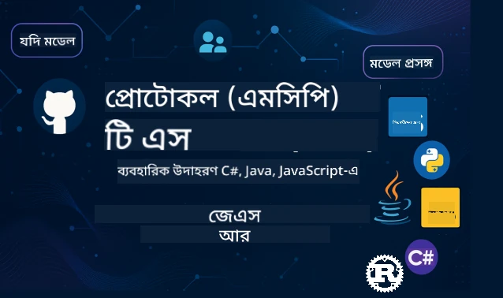

 

[](https://GitHub.com/microsoft/mcp-for-beginners/graphs/contributors)
[](https://GitHub.com/microsoft/mcp-for-beginners/issues)
[](https://GitHub.com/microsoft/mcp-for-beginners/pulls)
[](http://makeapullrequest.com)

[](https://GitHub.com/microsoft/mcp-for-beginners/watchers)
[](https://GitHub.com/microsoft/mcp-for-beginners/fork)
[](https://GitHub.com/microsoft/mcp-for-beginners/stargazers)


[](https://discord.gg/nTYy5BXMWG)

এই সম্পদগুলি ব্যবহার শুরু করতে এই ধাপগুলি অনুসরণ করুন:
1. **রিপোজিটরি ফর্ক করুন**: ক্লিক করুন [](https://GitHub.com/microsoft/mcp-for-beginners/fork)
2. **রিপোজিটরি ক্লোন করুন**:   `git clone https://github.com/microsoft/mcp-for-beginners.git`
3. **যোগ দিন** [](https://discord.gg/nTYy5BXMWG)


### 🌐 বহু-ভাষা সমর্থন

#### GitHub Action এর মাধ্যমে সমর্থিত (স্বয়ংক্রিয় ও সর্বদা আপ-টু-ডেট)

<!-- CO-OP TRANSLATOR LANGUAGES TABLE START -->
[Arabic](../ar/README.md) | [Bengali](./README.md) | [Bulgarian](../bg/README.md) | [Burmese (Myanmar)](../my/README.md) | [Chinese (Simplified)](../zh-CN/README.md) | [Chinese (Traditional, Hong Kong)](../zh-HK/README.md) | [Chinese (Traditional, Macau)](../zh-MO/README.md) | [Chinese (Traditional, Taiwan)](../zh-TW/README.md) | [Croatian](../hr/README.md) | [Czech](../cs/README.md) | [Danish](../da/README.md) | [Dutch](../nl/README.md) | [Estonian](../et/README.md) | [Finnish](../fi/README.md) | [French](../fr/README.md) | [German](../de/README.md) | [Greek](../el/README.md) | [Hebrew](../he/README.md) | [Hindi](../hi/README.md) | [Hungarian](../hu/README.md) | [Indonesian](../id/README.md) | [Italian](../it/README.md) | [Japanese](../ja/README.md) | [Kannada](../kn/README.md) | [Korean](../ko/README.md) | [Lithuanian](../lt/README.md) | [Malay](../ms/README.md) | [Malayalam](../ml/README.md) | [Marathi](../mr/README.md) | [Nepali](../ne/README.md) | [Nigerian Pidgin](../pcm/README.md) | [Norwegian](../no/README.md) | [Persian (Farsi)](../fa/README.md) | [Polish](../pl/README.md) | [Portuguese (Brazil)](../pt-BR/README.md) | [Portuguese (Portugal)](../pt-PT/README.md) | [Punjabi (Gurmukhi)](../pa/README.md) | [Romanian](../ro/README.md) | [Russian](../ru/README.md) | [Serbian (Cyrillic)](../sr/README.md) | [Slovak](../sk/README.md) | [Slovenian](../sl/README.md) | [Spanish](../es/README.md) | [Swahili](../sw/README.md) | [Swedish](../sv/README.md) | [Tagalog (Filipino)](../tl/README.md) | [Tamil](../ta/README.md) | [Telugu](../te/README.md) | [Thai](../th/README.md) | [Turkish](../tr/README.md) | [Ukrainian](../uk/README.md) | [Urdu](../ur/README.md) | [Vietnamese](../vi/README.md)

> **স্থানীয়ভাবে ক্লোন করতে চান?**

> এই রিপোজিটরিতে ৫০+ ভাষার অনুবাদ রয়েছে যা ডাউনলোডের আকার উল্লেখযোগ্যভাবে বৃদ্ধি করে। অনুবাদ ছাড়া ক্লোন করতে, sparse checkout ব্যবহার করুন:
> ```bash
> git clone --filter=blob:none --sparse https://github.com/microsoft/mcp-for-beginners.git
> cd mcp-for-beginners
> git sparse-checkout set --no-cone '/*' '!translations' '!translated_images'
> ```
> এটি আপনাকে কোর্স সম্পন্ন করতে যা যা দরকার তা দ্রুত ডাউনলোডের মাধ্যমে দেবে।
<!-- CO-OP TRANSLATOR LANGUAGES TABLE END -->

# 🚀 মডেল কনটেক্সট প্রোটোকল (MCP) কারিকুলাম শুরু করার জন্য

## **C#, Java, JavaScript, Rust, Python, এবং TypeScript-এ হাতে কলমে কোড উদাহরণসহ MCP শিখুন**

## 🧠 মডেল কনটেক্সট প্রোটোকল কারিকুলামের সংক্ষিপ্ত বিবরণ
মডেল কনটেক্সট প্রোটোকলের যাত্রায় আপনাকে স্বাগতম! আপনি যদি কদাচিৎ ভেবেছেন কিভাবে AI অ্যাপ্লিকেশনগুলি বিভিন্ন টুলস এবং পরিষেবার সাথে যোগাযোগ করে, তাহলে আপনি সেই মার্জিত সমাধান আবিষ্কার করতে চলেছেন যা ডেভেলপারদের বুদ্ধিমান সিস্টেম নির্মাণ করার পদ্ধতি বদলে দিচ্ছে।

MCP কে ভাবুন AI অ্যাপ্লিকেশনগুলির জন্য একটি বিশ্বজনীন অনুবাদক হিসেবে — যেমনি ইউএসবি পোর্টগুলি যেকোনো ডিভাইসকে আপনার কম্পিউটারে সংযোগ করতে দেয়, MCP তেমনি AI মডেলকে যেকোনো টুল বা পরিষেবার সাথে স্ট্যান্ডার্ডাইজড উপায়ে সংযুক্ত হতে দেয়। আপনি প্রথম চ্যাটবট তৈরি করছেন বা জটিল AI ওয়ার্কফ্লোতে কাজ করছেন, MCP বোঝা আপনাকে আরও সক্ষম এবং নমনীয় অ্যাপ্লিকেশন তৈরি করার ক্ষমতা দেবে।

এই কারিকুলামটি আপনার শেখার যাত্রার জন্য ধৈর্য্য ও যত্নসহ ডিজাইন করা হয়েছে। আমরা সহজ ধারণা দিয়ে শুরু করব যা আপনি ইতিমধ্যেই বোঝেন এবং আপনার প্রিয় প্রোগ্রামিং ভাষায় হাতে কলমে অনুশীলনের মাধ্যমে আপনার দক্ষতা ধীরে ধীরে বাড়াব। প্রতিটি ধাপে স্পষ্ট ব্যাখ্যা, বাস্তব উদাহরণ এবং প্রচুর উদ্দীপনা থাকবে।

এই যাত্রা শেষ করার সময়, আপনি নিজের MCP সার্ভার তৈরি করতে, জনপ্রিয় AI প্ল্যাটফর্মের সাথে সেগুলো একত্রিত করতে এবং কিভাবে এই প্রযুক্তি AI উন্নয়নের ভবিষ্যত পরিবর্তন করছে তা বোঝার আত্মবিশ্বাস পাবেন। চল শুরু করি এই উত্তেজনাপূর্ণ অভিযান!

### আনুষ্ঠানিক ডকুমেন্টেশন এবং স্পেসিফিকেশনসমূহ

আপনার বোঝাপড়া বাড়ার সাথে সাথে এই সম্পদগুলির গুরুত্ব বাড়বে, তবে সবকিছু একবারেই পড়ার চাপ অনুভব করবেন না। সবচেয়ে আগ্রহী অংশ থেকেই শুরু করুন!
- 📘 [MCP ডকুমেন্টেশন](https://modelcontextprotocol.io/) – ধাপে ধাপে টিউটোরিয়াল এবং ব্যবহারকারী গাইডের জন্য এটি আপনার প্রধান সম্পদ। ডকুমেন্টেশনটি নতুনদের জন্য লেখা হয়েছে, যেখানে পরিষ্কার উদাহরণ রয়েছে যা আপনি আপনার গতিতে অনুসরণ করতে পারবেন।
- 📜 [MCP স্পেসিফিকেশন](https://modelcontextprotocol.io/docs/) – এটি আপনার ব্যাপক রেফারেন্স ম্যানুয়াল হিসেবে ভাবুন। কারিকুলামের মাধ্যমে কাজ করার সময় আপনি এখানে নির্দিষ্ট বিবরণ দেখতে এবং উন্নত বৈশিষ্ট্য অনুসন্ধান করতে ঘুরে আসবেন।
- 📜 [মূল MCP স্পেসিফিকেশন](https://modelcontextprotocol.io/specification/versioning) – এটির মধ্যে অতিরিক্ত প্রযুক্তিগত বিবরণ রয়েছে যা উন্নত ইমপ্লিমেন্টেশনের জন্য সহায়ক হতে পারে। আপনার প্রয়োজন হলে এটি সেখানে আছে, তবে শুরুতে এ নিয়ে চিন্তা করবেন না।
- 🧑‍💻 [MCP গিটহাব রিপোজিটরি](https://github.com/modelcontextprotocol) – এখানে বহু প্রোগ্রামিং ভাষায় SDK, টুলস, এবং কোড নমুনা পাবেন। এটি ব্যবহারিক উদাহরণের এবং প্রস্তুত-ব্যবহারের কম্পোনেন্টের একটি ভান্ডারের মতো।
- 🌐 [MCP কমিউনিটি](https://github.com/orgs/modelcontextprotocol/discussions) – MCP নিয়ে আলোচনা করতে অভিজ্ঞ ডেভেলপার এবং অন্য শিক্ষার্থীদের সঙ্গে যোগ দিন। এটি একটি সহায়ক কমিউনিটি যেখানে প্রশ্ন স্বাগত এবং জ্ঞান মুক্তভাবে ভাগ করা হয়।
  
## শেখার লক্ষ্যসমূহ

এই কারিকুলাম শেষ হওয়ার পর, আপনি আপনার নতুন দক্ষতা নিয়ে আত্মবিশ্বাসী এবং উৎসাহী বোধ করবেন। আপনি যা অর্জন করবেন:

• **MCP মৌলিকতা বোঝা**: আপনি বুঝবেন মডেল কনটেক্সট প্রোটোকল কী এবং কেন এটি AI অ্যাপ্লিকেশনগুলির সহযোগিতাকে বিপ্লবী করছে, এমন রূপক এবং উদাহরণ ব্যবহার করে যা সহজে বোধগম্য।

• **আপনার প্রথম MCP সার্ভার তৈরি করা**: আপনার পছন্দের প্রোগ্রামিং ভাষায় একটি কাজ করা MCP সার্ভার তৈরির মাধ্যমে আপনি শুরু করবেন, সহজ উদাহরণ থেকে শুরু করে ধাপে ধাপে দক্ষতা বাড়াবেন।

• **AI মডেলগুলিকে বাস্তব টুলের সাথে সংযোগ করা**: আপনি শিখবেন কিভাবে AI মডেলের এবং প্রকৃত পরিষেবার মাঝে সেতুবন্ধন গড়া যায়, যা আপনার অ্যাপ্লিকেশনকে শক্তিশালী নতুন ক্ষমতা দেবে।

• **নিরাপত্তার সর্বোত্তম চর্চা প্রয়োগ করা**: আপনি বুঝবেন কিভাবে আপনার MCP ইমপ্লিমেন্টেশনগুলো নিরাপদ ও সুরক্ষিত রাখা যায়, আপনার অ্যাপ্লিকেশন এবং ব্যবহারকারী উভয়ের সুরক্ষায়।

• **আত্মবিশ্বাসের সাথে ডিপ্লয় করা**: আপনি জানবেন কিভাবে আপনার MCP প্রকল্পগুলো উন্নয়ন থেকে প্রোডাকশনে নিয়ে যাওয়া যায়, বাস্তব জগতের কার্যকর ডিপ্লয়মেন্ট কৌশল সহ।

• **MCP কমিউনিটিতে যোগদান করা**: আপনি এমন একটি বেড়ে ওঠা ডেভেলপার সম্প্রদায়ের অংশ হবেন যারা AI অ্যাপ্লিকেশন উন্নয়নের ভবিষ্যত গড়ছেন।

## প্রয়োজনীয় পটভূমি

MCP এর বিস্তারিত পর্যায়ে যাওয়ার আগে, আসুন নিশ্চিত করি যে আপনি কিছু মৌলিক ধারণা নিয়ে স্বচ্ছন্দ বোধ করেন। আপনি যদি এই বিষয়গুলিতে বিশেষজ্ঞ না হন তবুও চিন্তা করবেন না — যা কিছু জানার প্রয়োজন, আমরা তা এগোবার পথে ব্যাখ্যা করব!

### প্রোটোকল বোঝা (ভিত্তি)

প্রোটোকলকে ভাবুন কথোপকথনের নিয়মের মতো। যখন আপনি কাউকে ফোন করেন, আপনি দুজনেই জানেন "হ্যালো" বলা উচিত কল গ্রহণে, পালা করে কথা বলা এবং শেষ মুহূর্তে "বিদায়" বলা। কম্পিউটার প্রোগ্রামগুলোরও কার্যকর যোগাযোগের জন্য এমন নিয়ম প্রয়োজন।

MCP একটি প্রোটোকল — সম্মত নিয়মাবলীর একটি সংগ্রহ যা AI মডেল এবং অ্যাপ্লিকেশনদের টুলস ও পরিষেবার সাথে ফলপ্রসূ "কথোপকথন" করতে সাহায্য করে। যেমন কথোপকথনের নিয়ম মানুষের যোগাযোগকে মসৃণ করে, MCP AI অ্যাপ্লিকেশন যোগাযোগকে অনেক নির্ভরযোগ্য এবং শক্তিশালী করে তোলে।

### ক্লায়েন্ট-সার্ভার সম্পর্ক (প্রোগ্রামগুলো কিভাবে একসাথে কাজ করে)

আপনি প্রতিদিনই ক্লায়েন্ট-সার্ভার সম্পর্ক ব্যবহার করেন! যখন আপনি ওয়েব ব্রাউজার (ক্লায়েন্ট) ব্যবহার করে কোনো ওয়েবসাইট ব্রাউজ করেন, আপনি এমন একটি ওয়েব সার্ভারের সাথে সংযোগ স্থাপন করছেন যা আপনাকে পেজের বিষয়বস্তু পাঠায়। ব্রাউজার জানে কিভাবে তথ্য চাইতে হয়, আর সার্ভার জানে কিভাবে সাড়া দিতে হয়।

MCP তেও একই ধরনের সম্পর্ক রয়েছে: AI মডেলগুলো ক্লায়েন্ট হিসেবে কাজ করে যেগুলি তথ্য বা ক্রিয়ার অনুরোধ করে, MCP সার্ভারগুলো সেই ক্ষমতা প্রদান করে। এটা এমন যেমন একটি সাহায্যকারী সহকারী (সার্ভার) রয়েছে যাকে AI নির্দিষ্ট কাজ করার জন্য জিজ্ঞাসা করতে পারে।

### কেন মান অনুসরণ গুরুত্বপূর্ণ (বস্তুগুলো একসাথে কাজ করবে)

ধরা যাক প্রতিটি গাড়ি নির্মাতা ভিন্ন আকৃতির গ্যাস পাম্প ব্যবহার করে — আপনাকে প্রতিটি গাড়ির জন্য আলাদা অ্যাডাপ্টার লাগবে! মান অনুসরণ মানে হলো সাধারণ এক বা একাধিক পদ্ধতিতে সম্মত হওয়া যাতে সবকিছু মসৃণভাবে একসাথে কাজ করে।

MCP AI অ্যাপ্লিকেশনগুলোর জন্য এই মান অনুসরণের ব্যবস্থা দেয়। প্রতিটি AI মডেলকে প্রতিটি টুলের জন্য কাস্টম কোড লেখা বদলে, MCP তাদের কথোপকথনের একক এবং ইউনিভার্সাল পথ তৈরি করে। এর ফলে ডেভেলপাররা একবার টুল তৈরি করে অনেক ভিন্ন AI সিস্টেমের সাথে কাজ করতে পারে।

## 🧭 আপনার শেখার পথের সংক্ষিপ্ত বিবরণ

আপনার MCP যাত্রা সাবধানে গঠিত হয়েছে যাতে আপনার আত্মবিশ্বাস এবং দক্ষতা ধাপে ধাপে বাড়ে। প্রতিটি ধাপ নতুন ধারণা নিয়ে আসে এবং আপনি যা শিখেছেন তা আরও দৃঢ় করে।

### 🌱 ভিত্তি পর্যায়: মৌলিক বিষয় বুঝুন (মডিউল ০-২)

এখান থেকেই আপনার অভিযান শুরু! আমরা পরিচিত রূপক ও সহজ উদাহরণের মাধ্যমে MCP ধারণা উপস্থাপন করব। আপনি বুঝবেন MCP কী, কেন এটি বিদ্যমান এবং AI উন্নয়নের বৃহত্তর জগতে এটি কীভাবে ফিট করে।

• **মডিউল 0 - MCP পরিচিতি**: আমরা শুরু করব MCP কী এবং কেন এটি আধুনিক AI অ্যাপ্লিকেশনের জন্য এত গুরুত্বপূর্ণ, তা অন্বেষণ করে। আপনি বাস্তব দুনিয়ার MCP এর উদাহরণ দেখবেন এবং বুঝবেন এটি ডেভেলপারদের সাধারণ সমস্যাগুলি কীভাবে সমাধান করে।

• **মডিউল 1 - মূল ধারণাগুলি ব্যাখ্যা**: এখানে আপনি MCP এর গুরুত্বপূর্ণ নির্মাণ ব্লকগুলো শিখবেন। আমরা প্রচুর রূপক এবং দৃশ্যমান উদাহরণ ব্যবহার করব যাতে ধারণাগুলো স্বাভাবিক এবং বোধগম্য হয়।

• **মডিউল 2 - MCP এর নিরাপত্তা**: নিরাপত্তা শোনার সময় ভীতিকর মনে হতে পারে, কিন্তু আমরা দেখাবো MCP কিভাবে অন্তর্নির্মিত সুরক্ষা বৈশিষ্ট্য নিয়ে এসেছে এবং অ্যাপ্লিকেশনকে শুরু থেকেই রক্ষা করার সেরা অভ্যাস শিখাবো।

### 🔨 নির্মাণ পর্যায়: আপনার প্রথম ইমপ্লিমেন্টেশন তৈরি করুন (মডিউল ৩)

এখন আসল মজা শুরু! আপনি হাতে কলমে প্রকৃত MCP সার্ভার এবং ক্লায়েন্ট তৈরি করবেন। চিন্তা করবেন না — আমরা সহজ থেকে শুরু করব এবং প্রতিটি ধাপে আপনাকে গাইড করব।

এই মডিউলটিতে একাধিক হাতে কলমে গাইড রয়েছে যা আপনাকে আপনার পছন্দের প্রোগ্রামিং ভাষায় অনুশীলন করতে দেয়। আপনি আপনার প্রথম সার্ভার তৈরি করবেন, সেটিতে সংযোগ করার জন্য ক্লায়েন্ট তৈরি করবেন, এমনকি জনপ্রিয় ডেভেলপমেন্ট টুল যেমন VS Code-এ ইন্টিগ্রেট করতে শিখবেন।
প্রতিটি গাইডে সম্পূর্ণ কোড উদাহরণ, সমস্যা সমাধানের টিপস এবং আমরা কেন নির্দিষ্ট ডিজাইন পছন্দগুলি করি তার ব্যাখ্যা অন্তর্ভুক্ত থাকে। এই পর্যায়ের শেষে, আপনার কাছে কাজ করা MCP ইমপ্লিমেন্টেশন থাকবে যার উপর আপনি গর্ব করতে পারেন!

### 🚀 বৃদ্ধি পর্যায়: উন্নত ধারণা এবং বাস্তব বিশ্বের প্রয়োগ (মডিউল ৪-৫)

মৌলিক বিষয়গুলি আয়ত্ত করার পরে, আপনি আরও পরিশীলিত MCP বৈশিষ্ট্যগুলি অন্বেষণ করতে প্রস্তুত। আমরা ব্যবহারিক বাস্তবায়ন কৌশল, ডিবাগিং প্রযুক্তি এবং মাল্টি-মোডাল AI ইন্টিগ্রেশনের মতো উন্নত বিষয়গুলি কভার করব।

আপনি শিখবেন কিভাবে আপনার MCP ইমপ্লিমেন্টেশনগুলোকে প্রোডাকশনের জন্য স্কেল করবেন এবং Azure-এর মতো ক্লাউড প্ল্যাটফর্মের সাথে সংযুক্ত করবেন। এই মডিউলগুলি আপনাকে বাস্তব বিশ্বের চাহিদা পরিচালনা করার জন্য MCP সমাধান তৈরি করতে প্রস্তুত করে।

### 🌟 দক্ষতা পর্যায়: কমিউনিটি এবং বিশেষায়ন (মডিউল ৬-১১)

চূড়ান্ত পর্যায়টি MCP কমিউনিটিতে যোগদান এবং আপনার সবচেয়ে আগ্রহী ক্ষেত্রগুলিতে বিশেষায়ন করার উপর কেন্দ্রিত। আপনি শিখবেন কিভাবে ওপেন-সোর্স MCP প্রকল্পে অবদান রাখতে হয়, উন্নত প্রমাণিকরণ প্যাটার্ন বাস্তবায়ন করতে হয়, এবং বিস্তৃত ডাটাবেস-ইনটিগ্রেটেড সমাধান তৈরি করতে হয়।

মডিউল ১১ বিশেষ উল্লেখ করার যোগ্য - এটি একটি সম্পূর্ণ ১৩-ল্যাব হ্যান্ডস-অন শেখার পথ যা আপনাকে PostgreSQL ইন্টিগ্রেশনের সাথে প্রোডাকশন-রেডি MCP সার্ভার বানাতে শেখায়। এটি এমন একটি ক্যাপস্টোন প্রকল্প যা আপনার শেখা সবকিছু একত্রিত করে!

### 📚 সম্পূর্ণ পাঠ্যক্রম কাঠামো

| মডিউল | বিষয় | বর্ণনা | লিঙ্ক |
|--------|-------|-------------|------|
| **মডিউল ১-৩: মৌলিক বিষয়** | | | |
| ০০ | MCP পরিচিতি | মডেল কনটেক্সট প্রোটোকল এবং এটির AI পাইপলাইনে গুরুত্বের ওভারভিউ | [আরো পড়ুন](./00-Introduction/README.md) |
| ০১ | মূল ধারণার ব্যাখ্যা | MCP-এর মূল ধারণাগুলির গভীর অনুসন্ধান | [আরো পড়ুন](./01-CoreConcepts/README.md) |
| ০২ | MCP-তে সিকিউরিটি | সিকিউরিটি ঝুঁকি এবং সেরা অনুশীলনসমূহ | [আরো পড়ুন](./02-Security/README.md) |
| ০৩ | MCP শুরু করা | পরিবেশ সেটআপ, বেসিক সার্ভার/ক্লায়েন্ট, ইন্টিগ্রেশন | [আরো পড়ুন](./03-GettingStarted/README.md) |
| **মডিউল ৩: প্রথম সার্ভার ও ক্লায়েন্ট তৈরি** | | | |
| ৩.১ | প্রথম সার্ভার | আপনার প্রথম MCP সার্ভার তৈরি করুন | [গাইড](./03-GettingStarted/01-first-server/README.md) |
| ৩.২ | প্রথম ক্লায়েন্ট | একটি বেসিক MCP ক্লায়েন্ট তৈরি করুন | [গাইড](./03-GettingStarted/02-client/README.md) |
| ৩.৩ | LLM সহ ক্লায়েন্ট | বড় ভাষা মডেল একীভূত করুন | [গাইড](./03-GettingStarted/03-llm-client/README.md) |
| ৩.৪ | VS কোড ইন্টিগ্রেশন | VS কোডে MCP সার্ভার ব্যবহার করুন | [গাইড](./03-GettingStarted/04-vscode/README.md) |
| ৩.৫ | stdio সার্ভার | stdio ট্রান্সপোর্ট ব্যবহার করে সার্ভার তৈরি করুন | [গাইড](./03-GettingStarted/05-stdio-server/README.md) |
| ৩.৬ | HTTP স্ট্রিমিং | MCP-তে HTTP স্ট্রিমিং বাস্তবায়ন করুন | [গাইড](./03-GettingStarted/06-http-streaming/README.md) |
| ৩.৭ | AI টুলকিট | MCP-র সাথে AI টুলকিট ব্যবহার করুন | [গাইড](./03-GettingStarted/07-aitk/README.md) |
| ৩.৮ | টেস্টিং | আপনার MCP সার্ভার ইমপ্লিমেন্টেশন পরীক্ষা করুন | [গাইড](./03-GettingStarted/08-testing/README.md) |
| ৩.৯ | ডিপ্লয়মেন্ট | MCP সার্ভার প্রোডাকশনে বসান | [গাইড](./03-GettingStarted/09-deployment/README.md) |
| ৩.১০ | উন্নত সার্ভার ব্যবহার | উন্নত ফিচার ব্যবহারের জন্য উন্নত সার্ভার ব্যবহার করুন ও আর্কিটেকচার উন্নত করুন | [গাইড](./03-GettingStarted/10-advanced/README.md) |
| ৩.১১ | সরল অথেন্টিকেশন | শুরু থেকেই অথেন্টিকেশন এবং RBAC দেখানো একটি অধ্যায় | [গাইড](./03-GettingStarted/11-simple-auth/README.md) |
| **মডিউল ৪-৫: ব্যবহারিক ও উন্নত** | | | |
| ০৪ | ব্যবহারিক বাস্তবায়ন | SDK, ডিবাগিং, টেস্টিং, পুনঃব্যবহারযোগ্য প্রম্পট টেমপ্লেট | [আরো পড়ুন](./04-PracticalImplementation/README.md) |
| ০৫ | MCP-তে উন্নত বিষয় | মাল্টি-মোডাল AI, স্কেলিং, এন্টারপ্রাইজ ব্যবহার | [আরো পড়ুন](./05-AdvancedTopics/README.md) |
| ৫.১ | Azure ইন্টিগ্রেশন | MCP-এর Azure-এর সাথে ইন্টিগ্রেশন | [গাইড](./05-AdvancedTopics/mcp-integration/README.md) |
| ৫.২ | মাল্টি-মোডালিটি | একাধিক মোডালিটির সাথে কাজ | [গাইড](./05-AdvancedTopics/mcp-multi-modality/README.md) |
| ৫.৩ | OAuth2 ডেমো | OAuth2 অথেন্টিকেশন বাস্তবায়ন | [গাইড](./05-AdvancedTopics/mcp-oauth2-demo/README.md) |
| ৫.৪ | রুট কনটেক্সট | রুট কনটেক্সটগুলি বুঝুন এবং বাস্তবায়ন করুন | [গাইড](./05-AdvancedTopics/mcp-root-contexts/README.md) |
| ৫.৫ | রাউটিং | MCP রাউটিং কৌশল | [গাইড](./05-AdvancedTopics/mcp-routing/README.md) |
| ৫.৬ | স্যাম্পলিং | MCP-তে স্যাম্পলিং প্রযুক্তি | [গাইড](./05-AdvancedTopics/mcp-sampling/README.md) |
| ৫.৭ | স্কেলিং | MCP ইমপ্লিমেন্টেশন স্কেল করুন | [গাইড](./05-AdvancedTopics/mcp-scaling/README.md) |
| ৫.৮ | সিকিউরিটি | উন্নত সিকিউরিটি বিবেচনা | [গাইড](./05-AdvancedTopics/mcp-security/README.md) |
| ৫.৯ | ওয়েব সার্চ | ওয়েব সার্চ ক্ষমতা বাস্তবায়ন | [গাইড](./05-AdvancedTopics/web-search-mcp/README.md) |
| ৫.১০ | রিয়েলটাইম স্ট্রিমিং | রিয়েলটাইম স্ট্রিমিং ফাংশনালিটি তৈরি করুন | [গাইড](./05-AdvancedTopics/mcp-realtimestreaming/README.md) |
| ৫.১১ | রিয়েলটাইম সার্চ | রিয়েলটাইম সার্চ বাস্তবায়ন | [গাইড](./05-AdvancedTopics/mcp-realtimesearch/README.md) |
| ৫.১২ | Entra ID অথ | Microsoft Entra ID দ্বারা অথেন্টিকেশন | [গাইড](./05-AdvancedTopics/mcp-security-entra/README.md) |
| ৫.১৩ | Foundry ইন্টিগ্রেশন | Azure AI Foundry সঙ্গে ইন্টিগ্রেশন | [গাইড](./05-AdvancedTopics/mcp-foundry-agent-integration/README.md) |
| ৫.১৪ | কনটেক্সট ইঞ্জিনিয়ারিং | কার্যকরী কনটেক্সট ইঞ্জিনিয়ারিংয়ের কৌশল | [গাইড](./05-AdvancedTopics/mcp-contextengineering/README.md) |
| ৫.১৫ | MCP কাস্টম ট্রান্সপোর্ট | কাস্টম ট্রান্সপোর্ট ইমপ্লিমেন্টেশন | [গাইড](./05-AdvancedTopics/mcp-transport/README.md) |
| **মডিউল ৬-১০: কমিউনিটি ও সেরা অনুশীলনসমূহ** | | | |
| ০৬ | কমিউনিটি অবদান | MCP পরিবেশে অবদান রাখার উপায় | [গাইড](./06-CommunityContributions/README.md) |
| ০৭ | প্রারম্ভিক গ্রহণের অন্তর্দৃষ্টি | বাস্তব বিশ্বের বাস্তবায়ন গল্প | [গাইড](./07-LessonsFromEarlyAdoption/README.md) |
| ০৮ | MCP-এর সেরা অনুশীলনসমূহ | কর্মক্ষমতা, ত্রুটির সহনশীলতা, স্থিতিস্থাপকতা | [গাইড](./08-BestPractices/README.md) |
| ০৯ | MCP কেস স্টাডি | ব্যবহারিক বাস্তবায়ন উদাহরণ | [গাইড](./09-CaseStudy/README.md) |
| ১০ | হ্যান্ডস-অন কর্মশালা | AI টুলকিট সহ MCP সার্ভার তৈরি | [ল্যাব](./10-StreamliningAIWorkflowsBuildingAnMCPServerWithAIToolkit/README.md) |
| **মডিউল ১১: MCP সার্ভার হ্যান্ডস-অন ল্যাব** | | | |
| ১১ | MCP সার্ভার ডাটাবেস ইন্টিগ্রেশন | PostgreSQL ইন্টিগ্রেশনের জন্য বিস্তৃত ১৩-ল্যাব হ্যান্ডস-অন শেখার পথ | [ল্যাবসমূহ](./11-MCPServerHandsOnLabs/README.md) |
| ১১.১ | পরিচিতি | MCP ও ডাটাবেস ইন্টিগ্রেশন ও রিটেল অ্যানালিটিকস ব্যবহার কেস ওভারভিউ | [ল্যাব ০০](./11-MCPServerHandsOnLabs/00-Introduction/README.md) |
| ১১.২ | মূল আর্কিটেকচার | MCP সার্ভার আর্কিটেকচার, ডাটাবেস স্তর এবং সিকিউরিটি প্যাটার্ন বোঝা | [ল্যাব ০১](./11-MCPServerHandsOnLabs/01-Architecture/README.md) |
| ১১.৩ | নিরাপত্তা ও মাল্টি-টেন্যান্সি | রো লেভেল সিকিউরিটি, অথেন্টিকেশন এবং মাল্টি-টেন্যান্ট ডেটা অ্যাক্সেস | [ল্যাব ০২](./11-MCPServerHandsOnLabs/02-Security/README.md) |
| ১১.৪ | পরিবেশ সেটআপ | উন্নয়ন পরিবেশ সেট আপ, ডকার, Azure রিসোর্স | [ল্যাব ০৩](./11-MCPServerHandsOnLabs/03-Setup/README.md) |
| ১১.৫ | ডাটাবেস ডিজাইন | PostgreSQL সেটআপ, রিটেইল স্কিমা ডিজাইন এবং নমুনা ডেটা | [ল্যাব ০৪](./11-MCPServerHandsOnLabs/04-Database/README.md) |
| ১১.৬ | MCP সার্ভার ইমপ্লিমেন্টেশন | ডাটাবেস ইন্টিগ্রেশন সহ FastMCP সার্ভার তৈরি করা | [ল্যাব ০৫](./11-MCPServerHandsOnLabs/05-MCP-Server/README.md) |
| ১১.৭ | টুল ডেভেলপমেন্ট | ডাটাবেস কোয়েরি টুল ও স্কিমা ইন্ট্রোস্পেকশন তৈরি | [ল্যাব ০৬](./11-MCPServerHandsOnLabs/06-Tools/README.md) |
| ১১.৮ | সেমেন্টিক সার্চ | Azure OpenAI ও pgvector সহ ভেক্টর এমবেডিং বাস্তবায়ন | [ল্যাব ০৭](./11-MCPServerHandsOnLabs/07-Semantic-Search/README.md) |
| ১১.৯ | টেস্টিং ও ডিবাগিং | টেস্টিং কৌশল, ডিবাগিং টুল ও যাচাই পদ্ধতি | [ল্যাব ০৮](./11-MCPServerHandsOnLabs/08-Testing/README.md) |
| ১১.১০ | VS কোড ইন্টিগ্রেশন | VS কোড MCP ইন্টিগ্রেশন ও AI চ্যাট ব্যবহার কনফিগারেশন | [ল্যাব ০৯](./11-MCPServerHandsOnLabs/09-VS-Code/README.md) |
| ১১.১১ | ডিপ্লয়মেন্ট কৌশল | ডকার ডিপ্লয়মেন্ট, Azure কন্টেইনার অ্যাপ, এবং স্কেলিং বিবেচনা | [ল্যাব ১০](./11-MCPServerHandsOnLabs/10-Deployment/README.md) |
| ১১.১২ | মনিটরিং | অ্যাপ্লিকেশন ইনসাইটস, লগিং, কর্মক্ষমতা মনিটরিং | [ল্যাব ১১](./11-MCPServerHandsOnLabs/11-Monitoring/README.md) |
| ১১.১৩ | সেরা অনুশীলন | কর্মক্ষমতা অপ্টিমাইজেশন, নিরাপত্তা শক্তিশালীকরণ এবং প্রোডাকশন টিপস | [ল্যাব ১২](./11-MCPServerHandsOnLabs/12-Best-Practices/README.md) |

### 💻 নমুনা কোড প্রকল্পসমূহ

MCP শেখার সবচেয়ে উত্তেজনাপূর্ণ অংশগুলোর একটি হল আপনার কোড দক্ষতা ধাপে ধাপে উন্নত হওয়া দেখা। আমরা আমাদের কোড উদাহরণগুলো এমনভাবে ডিজাইন করেছি যাতে সেগুলো সহজ থেকে শুরু করে আরও জটিল হয় আপনার বোঝাপড়া গভীর হওয়ার সাথে সাথে। আমরা ধারণাগুলো এমনভাবে উপস্থাপন করি - এমন কোড যা বুঝতে সহজ কিন্তু বাস্তব MCP নীতিমালা প্রদর্শন করে, আপনি বুঝতে পারবেন শুধুমাত্র কোডটি কী করে তা নয়, কেন এটি এইভাবে সাজানো হয়েছে এবং এটি বড় MCP অ্যাপ্লিকেশনে কিভাবে ফিট করে।

#### মৌলিক MCP ক্যালকুলেটর নমুনা

| ভাষা | বর্ণনা | লিঙ্ক |
|----------|-------------|------|
| C# | MCP সার্ভার উদাহরণ | [কোড দেখুন](./03-GettingStarted/samples/csharp/README.md) |
| Java | MCP ক্যালকুলেটর | [কোড দেখুন](./03-GettingStarted/samples/java/calculator/README.md) |
| JavaScript | MCP ডেমো | [কোড দেখুন](./03-GettingStarted/samples/javascript/README.md) |
| Python | MCP সার্ভার | [কোড দেখুন](../../03-GettingStarted/samples/python/mcp_calculator_server.py) |
| TypeScript | MCP উদাহরণ | [কোড দেখুন](./03-GettingStarted/samples/typescript/README.md) |
| Rust | MCP উদাহরণ | [কোড দেখুন](./03-GettingStarted/samples/rust/README.md) |

#### উন্নত MCP ইমপ্লিমেন্টেশন

| ভাষা | বর্ণনা | লিঙ্ক |
|----------|-------------|------|
| C# | উন্নত নমুনা | [কোড দেখুন](./04-PracticalImplementation/samples/csharp/README.md) |
| Java with Spring | কন্টেইনার অ্যাপ উদাহরণ | [কোড দেখুন](./04-PracticalImplementation/samples/java/containerapp/README.md) |
| JavaScript | উন্নত নমুনা | [কোড দেখুন](./04-PracticalImplementation/samples/javascript/README.md) |
| Python | জটিল ইমপ্লিমেন্টেশন | [কোড দেখুন](../../04-PracticalImplementation/samples/python/READMEmd) |
| TypeScript | কন্টেইনার নমুনা | [কোড দেখুন](./04-PracticalImplementation/samples/typescript/README.md) |


## 🎯 MCP শেখার পূর্বশর্তসমূহ

এই পাঠ্যক্রম থেকে সর্বোচ্চ সুবিধা পেতে, আপনার উচিত:

- ন্যূনতম একটি ভাষায় প্রোগ্রামিং বেসিক জ্ঞান থাকা: C#, Java, JavaScript, Python, অথবা TypeScript
- ক্লায়েন্ট-সার্ভার মডেল এবং এপিআই বোঝাপড়া
- REST ও HTTP ধারণার পরিচিতি
- (ঐচ্ছিক) AI/ML ধারণার পটভূমি

- সহায়তার জন্য আমাদের কমিউনিটি আলোচনায় যোগদান করা

## 📚 অধ্যয়ন গাইড ও সম্পদ

এই রিপোজিটরিতে বেশ কিছু সম্পদ অন্তর্ভুক্ত যা আপনাকে কার্যকরভাবে পথনির্দেশ এবং শেখার ক্ষেত্রে সাহায্য করবে:

### অধ্যয়ন গাইড

একটি বিস্তারিত [অধ্যয়ন গাইড](./study_guide.md) উপলব্ধ যা আপনাকে এই রিপোজিটরি কার্যকরভাবে ব্যবহারে সাহায্য করবে। এই ভিজ্যুয়াল পাঠ্যক্রম মানচিত্র দেখায় কিভাবে সব বিষয় একে অপরের সাথে যুক্ত এবং নমুনা প্রকল্পগুলি কীভাবে কার্যকরভাবে ব্যবহার করতে হয় সে সম্পর্কে নির্দেশনা দেয়। এটি বিশেষ করে ভিজ্যুয়াল শিক্ষার্থীদের জন্য উপকারী যারা সমগ্র চিত্র দেখতে পছন্দ করে।

গাইডটি অন্তর্ভুক্ত:
- সমস্ত কভার করা বিষয়ের ভিজ্যুয়াল পাঠ্যক্রম মানচিত্র
- প্রত্যেকটি রিপোজিটরি অংশের বিস্তারিত ব্রেকডাউন
- নমুনা প্রকল্প ব্যবহারের নির্দেশনা
- বিভিন্ন দক্ষতা স্তরের জন্য সুপারিশকৃত শেখার পথ
- আপনার শেখার যাত্রাকে সমৃদ্ধ করার জন্য অতিরিক্ত সম্পদ

### চেঞ্জলগ

আমরা একটি বিস্তারিত [চেঞ্জলগ](./changelog.md) বজায় রাখি যা পাঠ্যক্রম সামগ্রীর সমস্ত গুরুত্বপূর্ণ আপডেট ট্র্যাক করে, যাতে আপনি সর্বশেষ উন্নতি ও সংযোজন সম্পর্কে জানেন।
- নতুন বিষয়বস্তু সংযোজন
- কাঠামোগত পরিবর্তন
- ফিচার উন্নতি
- ডকুমেন্টেশন আপডেট

## 🛠️ কীভাবে এই পাঠ্যক্রম কার্যকরভাবে ব্যবহার করবেন

এই গাইডের প্রত্যেকটি পাঠে অন্তর্ভুক্ত রয়েছে:
1. MCP ধারণাগুলির স্পষ্ট ব্যাখ্যা  
2. একাধিক ভাষায় লাইভ কোড উদাহরণ  
3. বাস্তব MCP অ্যাপ্লিকেশন তৈরি করার জন্য অনুশীলন  
4. উন্নত শিক্ষার্থীদের জন্য অতিরিক্ত সম্পদ

## অন ডিমান্ড বিষয়বস্তু

### [MCP Dev Days জুলাই 2025](https://developer.microsoft.com/en-us/reactor/series/S-1563/)
#### [➡️অন ডিমান্ড দেখুন - MCP Dev Days](https://developer.microsoft.com/en-us/reactor/series/S-1563/)
MCP Dev Days-এর জন্য প্রস্তুত হোন, একটি ভার্চুয়াল ইভেন্ট যা Model Context Protocol (MCP) এর প্রতি নিবেদিত — একটি উদীয়মান মানদণ্ড যা AI মডেল এবং তারা যে সরঞ্জামগুলোর উপর নির্ভরশীল তা সংযোগ করে, যেখানে দুই দিনের গহীন প্রযুক্তিগত অন্তর্দৃষ্টি, সম্প্রদায় সংযোগ এবং হাতে কলমে শেখার সুযোগ থাকবে।  
আপনি আমাদের ইভেন্ট পেজে নিবন্ধন করে MCP Dev Days দেখতে পারেন: https://aka.ms/mcpdevdays.

#### [দিন ১: MCP উৎপাদনশীলতা, ডেভটুলস, এবং কমিউনিটি:](https://developer.microsoft.com/en-us/reactor/series/S-1563/)

এই দিনটি MCP ব্যবহার করে ডেভেলপারদের তাদের ডেভেলপার কর্মপ্রবাহে সক্ষম করে তোলা এবং আশ্চর্যজনক MCP সম্প্রদায় উদযাপন করার বিষয়ে। আমরা আরকেড, ব্লক, ওক্টা, এবং নিওনের মতো সম্প্রদায় সদস্য ও অংশীদারদের সাথে যুক্ত হবো দেখতে কিভাবে তারা মাইক্রোসফটের সাথে সহযোগিতা করে একটি খোলা, বিস্তৃত MCP ইকোসিস্টেম গঠন করছে।  
বাস্তব বিশ্বের ডেমোগুলি VS কোড, ভিজ্যুয়াল স্টুডিও, গিটহাব কোপাইলট, এবং জনপ্রিয় কমিউনিটি সরঞ্জাম জুড়ে  
প্রায়োগিক, প্রেক্ষাপট-ভিত্তিক ডেভ কর্মপ্রবাহ  
সম্প্রদায়-নেতৃত্বাধীন সেশন এবং অন্তর্দৃষ্টি  
আপনি যদি MCP নিয়ে নতুন হন বা ইতিমধ্যে তৈরি করছিলেন, দিন ১ অনুপ্রেরণা এবং কার্যকর টেকনিক দিয়ে পরবর্তী কাজের মঞ্চ তৈরি করবে।

#### [দিন ২: আত্মবিশ্বাসের সঙ্গে MCP সার্ভার নির্মাণ](https://developer.microsoft.com/en-us/reactor/series/S-1563/)

এই দিনটি MCP নির্মাতাদের জন্য। আমরা MCP সার্ভার নির্মাণ এবং MCP কে আপনার AI কর্মপ্রবাহের সাথে সংহত করার ক্ষেত্রে বাস্তবায়ন কৌশল এবং শ্রেষ্ঠ অনুশীলনের দিকে গভীরভাবে নজর দিব।

#### বিষয়বস্তু:

- MCP সার্ভার নির্মাণ এবং এজেন্ট অভিজ্ঞতায় একীকরণ  
- প্রম্পট-চালিত উন্নয়ন  
- নিরাপত্তার শ্রেষ্ঠ অনুশীলন  
- ফাংশন, ACA, এবং API ব্যবস্থাপনার মতো নির্মাণ ব্লক ব্যবহার  
- রেজিস্ট্রি সামঞ্জস্য এবং টুলিং (১পি + ৩পি)

আপনি যদি একজন ডেভেলপার, টুল নির্মাতা, বা AI পণ্য কৌশলবিদ হন, এই দিনটি আপনার জন্য বিস্তৃত, নিরাপদ, ও ভবিষ্যত প্রস্তুত MCP সমাধান নির্মাণের অন্তর্দৃষ্টি নিয়ে আবর্তিত।

### MCP বুট ক্যাম্প আগস্ট 2025  
ভিড়ো সেশনের মাধ্যমে শেখা যা MCP সার্ভার তৈরি করা, VS কোডের সঙ্গে একীভূত করা, এবং Azure-এ পেশাদারিভাবে মোতায়েন করা শেখায়, যা MCP ফর বিগিনার্স পাঠ্যক্রম থেকে নেওয়া হয়েছে। বাস্তব দক্ষতা অর্জন করুন একটি প্রযুক্তিতে যা বড় বড় কোম্পানিরা ইতিমধ্যেই ব্যবহার করছে।

#### [➡️অন ডিমান্ড দেখুন MCP বুটক্যাম্প | ইংরেজি](https://developer.microsoft.com/en-us/reactor/series/s-1568/)
#### [➡️অন ডিমান্ড দেখুন MCP বুটক্যাম্প | ব্রাজিল](https://developer.microsoft.com/en-us/reactor/series/S-1566/)
#### [➡️অন ডিমান্ড দেখুন MCP বুটক্যাম্প | স্প্যানিশ](https://developer.microsoft.com/en-us/reactor/series/S-1567/)

### আসুন MCP শিখি C#-এর সাথে - টিউটোরিয়াল সিরিজ  
আসুন Model Context Protocol (MCP) সম্পর্কে জানি, একটি উন্নত ফ্রেমওয়ার্ক যা AI মডেল এবং ক্লায়েন্ট অ্যাপ্লিকেশনের মধ্যে মিথস্ক্রিয়াকে মানসম্মত করার জন্য ডিজাইন করা হয়েছে। এই শিক্ষার্থী-বান্ধব সেশনের মাধ্যমে আমরা আপনাকে MCP পরিচয় করিয়ে দেবো এবং প্রথম MCP সার্ভার তৈরি করার মাধ্যমে গাইড করবো।  
#### C#: [https://aka.ms/letslearnmcp-csharp](https://aka.ms/letslearnmcp-csharp)  
#### Java: [https://aka.ms/letslearnmcp-java](https://aka.ms/letslearnmcp-java)  
#### JavaScript: [https://aka.ms/letslearnmcp-javascript](https://aka.ms/letslearnmcp-javascript)  
#### Python: [https://aka.ms/letslearnmcp-python](https://aka.ms/letslearnmcp-python)

## 🎓 আপনার MCP যাত্রা শুরু হলো

অভিনন্দন! আপনি একটি উত্তেজনাপূর্ণ যাত্রার প্রথম ধাপ নিয়েছেন যা আপনার প্রোগ্রামিং দক্ষতাকে প্রসারিত করবে এবং আপনাকে AI উন্নয়নের সর্বশেষ ধারা সাথে সংযুক্ত করবে।

### আপনি ইতিমধ্যেই যা অর্জন করেছেন

এই পরিচিতি পড়ে, আপনি ইতোমধ্যে MCP সম্পর্কে আপনার জ্ঞানভিত্তি তৈরি শুরু করেছেন। আপনি বুঝতে পেরেছেন MCP কী, কেন এটি গুরুত্বপূর্ণ এবং এই পাঠ্যক্রম কীভাবে আপনার শেখার যাত্রাকে সহায়তা করবে। এটি একটি উল্লেখযোগ্য অর্জন এবং এই গুরুত্বপূর্ণ প্রযুক্তিতে আপনার দক্ষতার সূচনা।

### সামনে থাকা অভিযান

আপনি যেভাবে মডিউলগুলি অগ্রসর করবেন, মনে রাখবেন প্রতিটি বিশেষজ্ঞ কখনো একজন শিক্ষার্থী ছিলেন। যা ধারণাগুলো এখন জটিল মনে হতে পারে, সেটি অনুশীলন ও প্রয়োগের মাধ্যমে স্বাভাবিক হয়ে উঠবে। প্রতিটি ছোট ধাপ শক্তিশালী দক্ষতা গড়ে তুলবে যা আপনার উন্নয়ন ক্যারিয়ার জুড়ে কাজে লাগবে।

### আপনার সহায়তা নেটওয়ার্ক

আপনি এমন একটি সম্প্রদায়ে যোগ দিয়েছেন যেখানে MCP সম্পর্কে উত্সাহী শিক্ষার্থীরা এবং বিশেষজ্ঞরা আছেন যারা অন্যদের সফল হতে সাহায্য করতে আগ্রহী। আপনি যদি কোনো কোডিং চ্যালেঞ্জে আটকে পড়েন বা কোনো বড় সাফল্য শেয়ার করতে চান, এই সম্প্রদায় আপনার যাত্রার সহায়তায় উপস্থিত আছে।

আপনি যদি আটকে যান বা AI অ্যাপ নির্মাণ নিয়ে কোনো প্রশ্ন থাকে, MCP সম্পর্কে আলোচনা করার জন্য অন্যান্য শিক্ষার্থী এবং অভিজ্ঞ ডেভেলপারদের সাথে যুক্ত হন। এটা একটি সহায়ক সম্প্রদায় যেখানে প্রশ্ন স্বাগত এবং জ্ঞান স্বতঃস্ফূর্তভাবে শেয়ার করা হয়।

[](https://discord.gg/nTYy5BXMWG)

আপনি যদি পণ্য প্রতিক্রিয়া বা নির্মাণে কোনো ত্রুটি পান, তাহলে এখানে যান:

[](https://aka.ms/foundry/forum)  

### শুরু করতে প্রস্তুত?

আপনার MCP অভিযান এখনই শুরু হচ্ছে! Module 0 থেকে শুরু করে আপনার প্রথম হাতে-কলম MCP অভিজ্ঞতা অর্জন করুন, অথবা নমুনা প্রকল্পগুলি দেখুন যা আপনি তৈরি করবেন। মনে রাখবেন - প্রতিটি বিশেষজ্ঞ ঠিক আপনার মতোই শুরু করেছিল, ধৈর্য ও অনুশীলনের মাধ্যমে আপনি দেখে অবাক হবেন আপনি কী অর্জন করতে পারেন।

Model Context Protocol এর বিশ্বে স্বাগতম। আসুন একসাথে কিছু অসাধারণ তৈরি করি!

## 🤝 শেখার সম্প্রদায়কে সহযোগিতা

এই পাঠ্যক্রম শিক্ষার্থীদের অবদানে জোরদার হয়! আপনি যদি টাইপো ঠিক করেন, আরও স্পষ্ট ব্যাখ্যা প্রস্তাব করেন বা নতুন কোনো উদাহরণ যোগ করেন, আপনার অবদান অন্য শিক্ষার্থীদের সফল হতে সাহায্য করে।

Microsoft মূল্যায়িত প্রশিক্ষণদাতা [Shivam Goyal](https://www.linkedin.com/in/shivam2003/) কে কোড নমুনার জন্য ধন্যবাদ।

অবদান প্রক্রিয়া স্বাগত ও সহায়ক করে ডিজাইন করা হয়েছে। বেশিরভাগ অবদানের জন্য একটি Contributor License Agreement (CLA) প্রয়োজন, তবে স্বয়ংক্রিয় টুল আপনাকে সুষ্ঠুভাবে প্রক্রিয়ায় গাইড করবে।

## 📜 ওপেন সোর্স শেখা

এই সম্পূর্ণ পাঠ্যক্রম MIT [LICENSE](../../LICENSE) এর আওতায় উপলব্ধ, অর্থাৎ আপনি এটি ব্যবহার, সংশোধন এবং মুক্তভাবে শেয়ার করতে পারেন। এটি আমাদের MCP জ্ঞানকে বিকাশকারীদের কাছে সহজলভ্য করার লক্ষ্যের অংশ।

## 🤝 অবদান নির্দেশিকা

এই প্রকল্প অবদান এবং প্রস্তাব স্বাগত জানায়। বেশিরভাগ অবদানের জন্য আপনাকে একটি Contributor License Agreement (CLA) তে সম্মত হতে হবে যা ঘোষণা করে যে আপনার অবদান ব্যবহারের অধিকার আপনার কাছে আছে এবং আপনি সেগুলো আমাদের ব্যবহারের জন্য দিচ্ছেন। বিস্তারিত জানতে <https://cla.opensource.microsoft.com> দেখুন।

যখন আপনি একটি pull request জমা দেবেন, একটি CLA বট স্বয়ংক্রিয়ভাবে নির্ধারণ করবে আপনাকে CLA প্রদান করতে হবে কি না এবং PR উপযুক্তভাবে সাজাবে (যেমন, স্ট্যাটাস চেক, মন্তব্য)। বট প্রদত্ত নির্দেশাবলী অনুসরণ করুন। আমাদের CLA ব্যবহৃত সমস্ত রিপোজে আপনাকে কেবল একবারই এটি করতে হবে।

এই প্রকল্প [Microsoft Open Source Code of Conduct](https://opensource.microsoft.com/codeofconduct/) গ্রহণ করেছে। অধিক তথ্যের জন্য দেখুন [Code of Conduct FAQ](https://opensource.microsoft.com/codeofconduct/faq/) অথবা কোন প্রশ্ন বা মন্তব্যের জন্য [opencode@microsoft.com](mailto:opencode@microsoft.com) এ যোগাযোগ করুন।

---

*আপনার MCP যাত্রা শুরু করতে চান? শুরু করুন [Module 00 - MCP পরিচিতি](./00-Introduction/README.md) থেকে এবং Model Context Protocol উন্নয়নের জগতে আপনার প্রথম পদক্ষেপ নিন!*

## 🎒 অন্যান্য কোর্স  
আমাদের দল অন্যান্য কোর্স তৈরি করে! দেখুন:

<!-- CO-OP TRANSLATOR OTHER COURSES START -->
### LangChain  
[](https://aka.ms/langchain4j-for-beginners)  
[](https://aka.ms/langchainjs-for-beginners?WT.mc_id=m365-94501-dwahlin)

---

### Azure / Edge / MCP / Agents  
[](https://github.com/microsoft/AZD-for-beginners?WT.mc_id=academic-105485-koreyst)  
[](https://github.com/microsoft/edgeai-for-beginners?WT.mc_id=academic-105485-koreyst)  
[](https://github.com/microsoft/mcp-for-beginners?WT.mc_id=academic-105485-koreyst)  
[](https://github.com/microsoft/ai-agents-for-beginners?WT.mc_id=academic-105485-koreyst)

---

### Generative AI সিরিজ  
[](https://github.com/microsoft/generative-ai-for-beginners?WT.mc_id=academic-105485-koreyst)  
[-9333EA?style=for-the-badge&labelColor=E5E7EB&color=9333EA)](https://github.com/microsoft/Generative-AI-for-beginners-dotnet?WT.mc_id=academic-105485-koreyst)  
[-C084FC?style=for-the-badge&labelColor=E5E7EB&color=C084FC)](https://github.com/microsoft/generative-ai-for-beginners-java?WT.mc_id=academic-105485-koreyst)  
[-E879F9?style=for-the-badge&labelColor=E5E7EB&color=E879F9)](https://github.com/microsoft/generative-ai-with-javascript?WT.mc_id=academic-105485-koreyst)

---

### মূল শিক্ষাবিষয়ক  
[](https://aka.ms/ml-beginners?WT.mc_id=academic-105485-koreyst)  
[](https://aka.ms/datascience-beginners?WT.mc_id=academic-105485-koreyst)  
[](https://aka.ms/ai-beginners?WT.mc_id=academic-105485-koreyst)  
[](https://github.com/microsoft/Security-101?WT.mc_id=academic-96948-sayoung)
[](https://aka.ms/webdev-beginners?WT.mc_id=academic-105485-koreyst)
[](https://aka.ms/iot-beginners?WT.mc_id=academic-105485-koreyst)
[](https://github.com/microsoft/xr-development-for-beginners?WT.mc_id=academic-105485-koreyst)

---
 
### কপাইলট সিরিজ
[](https://aka.ms/GitHubCopilotAI?WT.mc_id=academic-105485-koreyst)
[](https://github.com/microsoft/mastering-github-copilot-for-dotnet-csharp-developers?WT.mc_id=academic-105485-koreyst)
[](https://github.com/microsoft/CopilotAdventures?WT.mc_id=academic-105485-koreyst)
<!-- CO-OP TRANSLATOR OTHER COURSES END -->

---

<!-- CO-OP TRANSLATOR DISCLAIMER START -->
**দ্বিতীয় কর্তব্যজ্ঞান**:
এই নথি [Co-op Translator](https://github.com/Azure/co-op-translator) নামক এআই অনুবাদ সেবা ব্যবহার করে অনূদিত হয়েছে। আমরা যথাসাধ্য সঠিকতার জন্য চেষ্টা করি, তবে স্বয়ংক্রিয় অনুবাদে ভুল বা ত্রুটি থাকতে পারে। মূল নথির স্বদেশী ভাষাটিই সর্বজন স্বীকৃত উৎস হিসেবে বিবেচিত হওয়া উচিত। জরুরি তথ্যের জন্য পেশাদার মানুষের দ্বারা অনুবাদ করানো সুপারিশ করা হয়। এই অনুবাদের ব্যবহারের ফলে কোনো ভুল বুঝাবুঝি বা ভুল ব্যাখ্যার জন্য আমরা দায়বদ্ধ নই।
<!-- CO-OP TRANSLATOR DISCLAIMER END -->