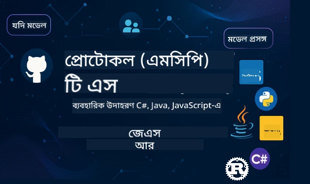

 

[](https://GitHub.com/microsoft/mcp-for-beginners/graphs/contributors)
[](https://GitHub.com/microsoft/mcp-for-beginners/issues)
[](https://GitHub.com/microsoft/mcp-for-beginners/pulls)
[](http://makeapullrequest.com)

[](https://GitHub.com/microsoft/mcp-for-beginners/watchers)
[](https://GitHub.com/microsoft/mcp-for-beginners/fork)
[](https://GitHub.com/microsoft/mcp-for-beginners/stargazers)


[](https://discord.gg/nTYy5BXMWG)

এই সম্পদগুলি ব্যবহার শুরু করতে এই ধাপগুলি অনুসরণ করুন:
1. **রিপোজিটরি ফর্ক করুন**: ক্লিক করুন [](https://GitHub.com/microsoft/mcp-for-beginners/fork)
2. **রিপোজিটরি ক্লোন করুন**:  `git clone https://github.com/microsoft/mcp-for-beginners.git`
3. **যোগ দিন** [](https://discord.gg/nTYy5BXMWG)


### 🌐 মাল্টি-ভাষা সমর্থন

#### GitHub অ্যাকশনের মাধ্যমে সমর্থিত (স্বয়ংক্রিয় এবং সর্বদা আপ-টু-ডেট)

<!-- CO-OP TRANSLATOR LANGUAGES TABLE START -->
[Arabic](../ar/README.md) | [Bengali](./README.md) | [Bulgarian](../bg/README.md) | [Burmese (Myanmar)](../my/README.md) | [Chinese (Simplified)](../zh-CN/README.md) | [Chinese (Traditional, Hong Kong)](../zh-HK/README.md) | [Chinese (Traditional, Macau)](../zh-MO/README.md) | [Chinese (Traditional, Taiwan)](../zh-TW/README.md) | [Croatian](../hr/README.md) | [Czech](../cs/README.md) | [Danish](../da/README.md) | [Dutch](../nl/README.md) | [Estonian](../et/README.md) | [Finnish](../fi/README.md) | [French](../fr/README.md) | [German](../de/README.md) | [Greek](../el/README.md) | [Hebrew](../he/README.md) | [Hindi](../hi/README.md) | [Hungarian](../hu/README.md) | [Indonesian](../id/README.md) | [Italian](../it/README.md) | [Japanese](../ja/README.md) | [Kannada](../kn/README.md) | [Korean](../ko/README.md) | [Lithuanian](../lt/README.md) | [Malay](../ms/README.md) | [Malayalam](../ml/README.md) | [Marathi](../mr/README.md) | [Nepali](../ne/README.md) | [Nigerian Pidgin](../pcm/README.md) | [Norwegian](../no/README.md) | [Persian (Farsi)](../fa/README.md) | [Polish](../pl/README.md) | [Portuguese (Brazil)](../pt-BR/README.md) | [Portuguese (Portugal)](../pt-PT/README.md) | [Punjabi (Gurmukhi)](../pa/README.md) | [Romanian](../ro/README.md) | [Russian](../ru/README.md) | [Serbian (Cyrillic)](../sr/README.md) | [Slovak](../sk/README.md) | [Slovenian](../sl/README.md) | [Spanish](../es/README.md) | [Swahili](../sw/README.md) | [Swedish](../sv/README.md) | [Tagalog (Filipino)](../tl/README.md) | [Tamil](../ta/README.md) | [Telugu](../te/README.md) | [Thai](../th/README.md) | [Turkish](../tr/README.md) | [Ukrainian](../uk/README.md) | [Urdu](../ur/README.md) | [Vietnamese](../vi/README.md)

> **স্থানীয়ভাবে ক্লোন করতে চান?**
>
> এই রিপোজিটরিতে ৫০+ ভাষার অনুবাদ রয়েছে যা ডাউনলোড সাইজ অনেক বেড়ে যায়। শুধুমাত্র মূল কোড ক্লোন করতে sparse checkout ব্যবহার করুন:
>
> **Bash / macOS / Linux:**
> ```bash
> git clone --filter=blob:none --sparse https://github.com/microsoft/mcp-for-beginners.git
> cd mcp-for-beginners
> git sparse-checkout set --no-cone '/*' '!translations' '!translated_images'
> ```
>
> **CMD (Windows):**
> ```cmd
> git clone --filter=blob:none --sparse https://github.com/microsoft/mcp-for-beginners.git
> cd mcp-for-beginners
> git sparse-checkout set --no-cone "/*" "!translations" "!translated_images"
> ```
>
> এটি আপনাকে দ্রুত ডাউনলোডের মাধ্যমে কোর্স সম্পন্ন করার জন্য সবকিছু দেবে।
<!-- CO-OP TRANSLATOR LANGUAGES TABLE END -->

# 🚀 মডেল কনটেক্সট প্রোটোকল (MCP) কারিকুলাম শুরুদের জন্য

## **C#, Java, JavaScript, Rust, Python, এবং TypeScript এ হাতে কলমে কোড উদাহরণের মাধ্যমে MCP শেখা**

## 🧠 মডেল কনটেক্সট প্রোটোকল কারিকুলামের পর্যালোচনা
মডেল কনটেক্সট প্রোটোকলের (MCP) আপনার যাত্রায় স্বাগতম! আপনি যদি কখনো ভাবেন কিভাবে AI অ্যাপ্লিকেশন গুলো বিভিন্ন টুল এবং সেবার সাথে যোগাযোগ করে, তাহলে আপনি সেই সুন্দর সমাধানটি আবিষ্কার করতে চলেছেন যা ডেভেলপারদের বুদ্ধিমান সিস্টেম তৈরি করার পদ্ধতি বদলাচ্ছে।

MCP কে ভাবুন AI অ্যাপ্লিকেশনগুলোর জন্য একটি বিশ্বজনীন অনুবাদক হিসেবে - যেমন USB পোর্ট যেকোনো ডিভাইস আপনার কম্পিউটারে সংযুক্ত করতে দেয়, তেমনি MCP AI মডেলগুলোকে যেকোনো টুল বা সার্ভিসের সাথে মানসম্মতভাবে সংযুক্ত হতে দেয়। আপনি প্রথমবার চ্যাটবট তৈরি করছেন অথবা জটিল AI ওয়ার্কফ্লো নিয়ে কাজ করছেন, MCP সম্বন্ধে বোঝা আপনাকে আরো সক্ষম এবং নমনীয় অ্যাপ্লিকেশন তৈরি করার ক্ষমতা দেবে।

এই কারিকুলাম ধৈর্য্য এবং যত্ন সহ আপনার শেখার যাত্রার জন্য ডিজাইন করা হয়েছে। আমরা সহজ ধারণা থেকে শুরু করব যা আপনি ইতিমধ্যে বুঝতে পারেন এবং ধীরে ধীরে আপনার পছন্দের প্রোগ্রামিং ভাষায় হাতে-কলমে অভ্যাসের মাধ্যমে আপনার দক্ষতা বৃদ্ধি করব। প্রতিটি ধাপে থাকবে স্পষ্ট ব্যাখ্যা, ব্যবহারিক উদাহরণ, এবং প্রচুর উৎসাহ।

আপনি এই যাত্রা শেষ করার সময়, আপনি আপনার নিজস্ব MCP সার্ভার তৈরি করার, জনপ্রিয় AI প্ল্যাটফর্মের সাথে ইন্টিগ্রেট করার এবং বুঝতে সক্ষম হবেন কীভাবে এই প্রযুক্তি AI উন্নয়নের ভবিষ্যতকে আকৃতির করছে। আসুন এই উত্তেজনাপূর্ণ অ্যাডভেঞ্চারটি একসাথে শুরু করি!

### অফিসিয়াল ডকুমেন্টেশন এবং স্পেসিফিকেশনসমূহ

এই কারিকুলামটি **MCP স্পেসিফিকেশন ২০২৫-১১-২৫** (সর্বশেষ স্থিতিশীল রিলিজ) এর সাথে সামঞ্জস্যপূর্ণ। MCP স্পেসিফিকেশন তারিখ-ভিত্তিক ভার্সনিং (YYYY-MM-DD ফরম্যাট) ব্যবহার করে সুনির্দিষ্ট প্রোটোকল ভার্সন ট্র্যাকিং নিশ্চিত করতে।

এই রিসোর্সগুলি আপনার বোঝাপড়া বাড়ার সাথে সাথে আরো মূল্যবান হবে, কিন্তু সবকিছু পড়ার তাড়াহুড়ো করবেন না। আপনার সবচেয়ে আগ্রহের ক্ষেত্র থেকে শুরু করুন!
- 📘 [MCP ডকুমেন্টেশন](https://modelcontextprotocol.io/) – ধাপে ধাপে টিউটোরিয়াল এবং ইউজার গাইডের জন্য এটি আপনার প্রধান উৎস। ডকুমেন্টেশনটি নবাগতদের কথা মাথায় রেখে লেখা হয়েছে, স্পষ্ট উদাহরণ দিয়ে যা আপনি আপনার গতি অনুযায়ী অনুসরণ করতে পারেন।
- 📜 [MCP স্পেসিফিকেশন](https://modelcontextprotocol.io/specification/2025-11-25) – এটিকে ভাবুন আপনার বিস্তৃত রেফারেন্স ম্যানুয়াল হিসেবে। কারিকুলাম কাজ করার সময়, আপনি এখানে ফেরত এসে নির্দিষ্ট বিবরণ দেখবেন এবং উন্নত ফিচারসমূহ অন্বেষণ করবেন।
- 📜 [MCP স্পেসিফিকেশন ভার্সনিং](https://modelcontextprotocol.io/specification/versioning) – এতে প্রোটোকল ভার্সনের ইতিহাস এবং কীভাবে MCP তারিখ-ভিত্তিক ভার্সনিং (YYYY-MM-DD ফরম্যাট) ব্যবহার করে তার তথ্য আছে।
- 🧑‍💻 [MCP GitHub রিপোজিটরি](https://github.com/modelcontextprotocol) – এখানে আপনি একাধিক প্রোগ্রামিং ভাষার SDK, টুল, এবং কোড স্যাম্পল পাবেন। এটি ব্যবহারিক উদাহরণ এবং রেডি-টু-ইউজ কম্পোনেন্টের একটি ধনকৌটো।
- 🌐 [MCP কমিউনিটি](https://github.com/orgs/modelcontextprotocol/discussions) – শিখতে ইচ্ছুক এবং অভিজ্ঞ ডেভেলপারদের সাথে MCP নিয়ে আলোচনা করতে যোগ দিন। এটি একটি সহায়ক কমিউনিটি যেখানে প্রশ্ন করা স্বাগত এবং জ্ঞান বিনিময় তৎপরতা রয়েছে।
  
## শেখার লক্ষ্যসমূহ

এই কারিকুলামের শেষে, আপনি আপনার নতুন দক্ষতা নিয়ে আত্মবিশ্বাসী এবং উৎসাহী বোধ করবেন। এখানে আপনি যা অর্জন করবেন তার তালিকা:

• **MCP মূলনীতি বোঝা**: আপনি বুঝবেন মডেল কনটেক্সট প্রোটোকল কী এবং কেন এটি AI অ্যাপ্লিকেশনগুলোকে একসাথে কাজ করার পদ্ধতি বিপ্লব করছে, এমন অনুরূপতা এবং উদাহরণের মাধ্যমে যা সহজবোধ্য।

• **প্রথম MCP সার্ভার তৈরি করা**: আপনি আপনার পছন্দের প্রোগ্রামিং ভাষায় একটি কাজ করা MCP সার্ভার তৈরি করবেন, সহজ উদাহরণ থেকে শুরু করে ধাপে ধাপে দক্ষতা বাড়াবেন।

• **AI মডেলগুলোকে বাস্তব টুলের সাথে সংযুক্ত করা**: আপনি শিখবেন কীভাবে AI মডেল এবং বাস্তব সেবাগুলোর মধ্যে সেতুবন্ধন তৈরি করতে হয়, আপনার অ্যাপ্লিকেশনগুলোকে শক্তিশালী নতুন ক্ষমতা প্রদান করে।

• **সিকিউরিটি সেরা প্র্যাকটিস বাস্তবায়ন**: আপনি বুঝতে পারবেন কীভাবে আপনার MCP বাস্তবায়নগুলোকে নিরাপদ এবং সুরক্ষিত রাখা যায়, যাতে আপনার অ্যাপ্লিকেশন এবং ব্যবহারকারীরা সুরক্ষিত থাকে।

• **আত্মবিশ্বাস সহ ডিপ্লয়মেন্ট**: আপনি জানবেন কীভাবে আপনার MCP প্রকল্পগুলো ডেভেলপমেন্ট থেকে প্রোডাকশনে নিয়ে যেতে হয়, বাস্তব দুনিয়ায় কাজ করা ডিপ্লয়মেন্ট কৌশল সহ।

• **MCP কমিউনিটিতে যোগ দিন**: আপনি এমন একটি বাড়তে থাকা ডেভেলপার কমিউনিটির অংশ হবেন যারা AI অ্যাপ্লিকেশন উন্নয়নের ভবিষ্যত গঠন করছেন। 

## অপরিহার্য পটভূমি

MCP এর স্পেসিফিক ব্যাপারে যাওয়ার আগে, আসুন নিশ্চিত হই কিছু মৌলিক ধারণার সাথে আপনি স্বাচ্ছন্দ্যবোধ করছেন। যদি আপনি এই ক্ষেত্রগুলিতে বিশেষজ্ঞ না হনও চিন্তা করবেন না - আমরা যেখানেই যাব, যা যা দরকার সব ব্যাখ্যা করব!

### প্রোটোকল বোঝা (প্রতিষ্ঠা)

একটি প্রোটোকলকে ভাবুন কথা বলার নিয়মের মতো। যখন আপনি বন্ধুকে ফোন করেন, তখন দুজনেই "হ্যালো" বলার নিয়ম জানেন, পালাক্রমে কথা বলেন, এবং শেষ হলে "বিদায়" বলেন। কম্পিউটার প্রোগ্রামগুলিরও কার্যকর যোগাযোগের জন্য অনুরূপ নিয়ম দরকার।

MCP একটি প্রোটোকল - এক সেট সম্মত নিয়ম যা AI মডেল এবং অ্যাপ্লিকেশনগুলোকে টুল এবং সেবার সাথে ফলপ্রসূ "কথোপকথন" করতে সাহায্য করে। যেমন মানুষের কথোপকথনে নিয়ম থাকা যোগাযোগকে মসৃণ করে, MCP থাকার ফলে AI অ্যাপ্লিকেশন যোগাযোগ আরও নির্ভরযোগ্য এবং শক্তিশালী হয়।

### ক্লায়েন্ট-সার্ভার সম্পর্ক (প্রোগ্রামগুলো কিভাবে একসাথে কাজ করে)

আপনি প্রতিদিনই ক্লায়েন্ট-সার্ভার সম্পর্ক ব্যবহার করেন! যখন আপনি একটি ওয়েব ব্রাউজার (ক্লায়েন্ট) ব্যবহার করে একটি ওয়েবসাইট ভিজিট করেন, তখন আপনি এক ওয়েব সার্ভারের সাথে সংযুক্ত হচ্ছেন যা পেজ কনটেন্ট দেয়। ব্রাউজার জানে তথ্য কীভাবে চাওয়া হয়, আর সার্ভার জানে কীভাবে উত্তর দিতে হয়।

MCP-তে, আমাদের একটি অনুরূপ সম্পর্ক আছে: AI মডেল ক্লায়েন্ট হিসাবে তথ্য বা কার্যক্রমের অনুরোধ করে এবং MCP সার্ভার ঐ ক্ষমতাগুলো সরবরাহ করে। এটি এমন যেকোনো সাহায্যকারী (সার্ভার) এর মতো যা AI নির্দিষ্ট কাজ করতে বলে।

### স্ট্যান্ডার্ডাইজেশনের গুরুত্ব (কাজগুলো একসাথে করানো)

ভাবুন প্রায় সব গাড়ি নির্মাতা আলাদা আকৃতির গ্যাস পাম্প ব্যবহার করত - আপনাকে প্রতিটি গাড়ির জন্য আলাদা অ্যাডাপ্টার লাগত! স্ট্যান্ডার্ডাইজেশন মানে সাধারণ পদ্ধতিতে একমত হওয়া যাতে জিনিসগুলো নির্বিঘ্নে মিলেমিশে কাজ করে।

MCP AI অ্যাপ্লিকেশনগুলোর জন্য এই স্ট্যান্ডার্ডাইজেশন প্রদান করে। প্রতিটি AI মডেলের প্রতিটি টুলের সাথে আলাদা কোড দরকার নয়, MCP তাদের মধ্যে যোগাযোগের একটি সার্বজনীন উপায় তৈরি করে। এর ফলে ডেভেলপাররা একবার টুল তৈরি করলে অনেক ভিন্ন AI সিস্টেমের সাথে কাজ করতে পারে।

## 🧭 আপনার শেখার পথের সারাংশ

আপনার MCP যাত্রা সাবধানে পরিকল্পিত যাতে আপনি ক্রমান্বয়ে আত্মবিশ্বাস এবং দক্ষতা অর্জন করতে পারেন। প্রতিটি পর্যায় নতুন ধারণা পরিচয় করায় এবং পূর্ববর্তী শেখাকে জোর দেয়।

### 🌱 ভিত্তি পর্যায়: মৌলিক বিষয়বস্তু বোঝা (মডিউল 0-2)

এখান থেকে আপনার অভিযান শুরু! আমরা পরিচিত অনুরূপতা এবং সহজ উদাহরণের মাধ্যমে MCP ধারণাগুলো তুলে ধরব। আপনি বুঝবেন MCP কী, কেন এটি আছে, এবং কিভাবে এটি AI উন্নয়নের বৃহত্তর দুনিয়ায় মানায়।

• **মডিউল 0 - MCP পরিচিতি**: আমরা শুরু করব MCP কি এবং কেন আধুনিক AI অ্যাপ্লিকেশনের জন্য এটি এত গুরুত্বপূর্ণ সেটি অন্বেষণ করে। আপনি বাস্তব উদাহরণ প্রশিক্ষণ দেখবেন এবং বুঝবেন MCP কিভাবে ডেভেলপারদের সম্মুখীন সাধারণ সমস্যা সমাধান করে।

• **মডিউল 1 - মূল ধারণা ব্যাখ্যা**: এখানে আপনি MCP-এর অপরিহার্য ভিত্তি শিখবেন। আমরা প্রচুর অনুরূপতা এবং চিত্র বিশ্লেষণ ব্যবহার করব যাতে ধারণাগুলো সহজ এবং স্বাভাবিক মনে হয়।

• **মডিউল 2 - MCP-তে সিকিউরিটি**: সিকিউরিটি কঠিন শোনালেও, আমরা দেখাবো MCP কীভাবে অন্তর্নির্মিত নিরাপত্তা বৈশিষ্ট্য রয়েছে এবং শুরু থেকেই আপনার অ্যাপ্লিকেশন রক্ষা করার সেরা প্র্যাকটিস শেখাবো।

### 🔨 নির্মাণ পর্যায়: আপনার প্রথম বাস্তবায়ন তৈরি (মডিউল 3)

এখন আসল মজার শুরু! আপনি হাতে কলমে সত্যিকারের MCP সার্ভার এবং ক্লায়েন্ট তৈরি করবেন। চিন্তা করবেন না — আমরা সহজ থেকে শুরু করে প্রতিটি পদক্ষেপ আপনাকে গাইড করব।
এই মডিউলে একাধিক হাতে-কলমে গাইড রয়েছে যা আপনাকে আপনার পছন্দের প্রোগ্রামিং ভাষায় অনুশীলন করার সুযোগ দেয়। আপনি আপনার প্রথম সার্ভার তৈরি করবেন, এটি সংযোগ করার জন্য একটি ক্লায়েন্ট তৈরি করবেন, এবং এমনকি জনপ্রিয় ডেভেলপমেন্ট টুল যেমন VS Code-ও ইন্টিগ্রেট করবেন।

প্রতিটি গাইডে সম্পূর্ণ কোড উদাহরণ, সমস্যা সমাধানের টিপস এবং কেন আমরা নির্দিষ্ট ডিজাইন পছন্দ করি তার ব্যাখ্যা অন্তর্ভুক্ত রয়েছে। এই ধাপের শেষে, আপনার হাতে এমন কার্যক্ষম MCP ইমপ্লিমেন্টেশন থাকবে যার জন্য আপনি গর্বিত হতে পারেন!

### 🚀 বৃদ্ধির ধাপ: উন্নত ধারণা এবং বাস্তব-জগতের প্রয়োগ (মডিউল ৪-৫)

মূল বিষয়গুলো আয়ত্ত করার পর, আপনি আরও উন্নত MCP বৈশিষ্ট্যগুলি অন্বেষণ করতে প্রস্তুত। আমরা ব্যবহারিক ইমপ্লিমেন্টেশন কৌশল, ডিবাগিং পদ্ধতি এবং মাল্টি-মোডাল AI ইন্টিগ্রেশনের মতো উন্নত বিষয়গুলি কভার করব।

আপনি শিখবেন কিভাবে আপনার MCP ইমপ্লিমেন্টেশনগুলো প্রোডাকশনের জন্য স্কেল করবেন এবং Azure-এর মতো ক্লাউড প্ল্যাটফর্মের সঙ্গে ইন্টিগ্রেট করবেন। এই মডিউলগুলো আপনাকে এমন MCP সলিউশন তৈরি করতে প্রস্তুত করে যা বাস্তব-জগতের চাহিদা সামলাতে পারে।

### 🌟 পারদর্শিতার ধাপ: কমিউনিটি এবং বিশেষীকরণ (মডিউল ৬-১১)

চূড়ান্ত ধাপটি MCP কমিউনিটিতে যোগদান এবং আপনার সবচেয়ে আগ্রহী ক্ষেত্রগুলোতে বিশেষজ্ঞ হওয়ার উপর কেন্দ্রীভূত। আপনি শিখবেন কিভাবে ওপেন-সোর্স MCP প্রকল্পে অবদান রাখতে হয়, উন্নত অথেনটিকেশন প্যাটার্ন ইমপ্লিমেন্ট করতে হয়, এবং ব্যাপক ডেটাবেজ ইন্টিগ্রেটেড সলিউশন তৈরি করতে হয়।

মডিউল ১১ বিশেষ উল্লেখের যোগ্য – এটি একটি সম্পূর্ণ ১৩-ল্যাব হাতে-কলমে শেখার পথ যা আপনাকে PostgreSQL ইন্টিগ্রেশন সহ প্রোডাকশন-রেডি MCP সার্ভার তৈরি করতে শেখায়। এটি একটি ক্যাপস্টোন প্রকল্পের মতো যা আপনি শেখা সবকিছু একত্রিত করে!

### 📚 সম্পূর্ণ কারিকুলাম কাঠামো

| মডিউল | বিষয় | বর্ণনা | লিংক |
|--------|-------|-------------|------|
| **মডিউল ০-৩: মৌলিক বিষয়াবলী** | | | |
| ০০ | MCP-এর পরিচিতি | মডেল কন্টেক্সট প্রোটোকল এবং এটি AI পাইপলাইনে এর গুরুত্বের ওভারভিউ | [আরও পড়ুন](./00-Introduction/README.md) |
| ০১ | মূল ধারণাসমূহ ব্যাখ্যা | MCP এর মূল ধারণাসমূহের গভীর অন্বেষণ | [আরও পড়ুন](./01-CoreConcepts/README.md) |
| ০২ | MCP-তে সিকিউরিটি | নিরাপত্তা হুমকি এবং সেরা অনুশীলন | [আরও পড়ুন](./02-Security/README.md) |
| ০৩ | MCP শুরু করা | পরিবেশ সেটআপ, বেসিক সার্ভার/ক্লায়েন্ট, ইন্টিগ্রেশন | [আরও পড়ুন](./03-GettingStarted/README.md) |
| **মডিউল ৩: আপনার প্রথম সার্ভার ও ক্লায়েন্ট তৈরি** | | | |
| ৩.১ | প্রথম সার্ভার | আপনার প্রথম MCP সার্ভার তৈরি করুন | [গাইড](./03-GettingStarted/01-first-server/README.md) |
| ৩.২ | প্রথম ক্লায়েন্ট | একটি বেসিক MCP ক্লায়েন্ট তৈরি করুন | [গাইড](./03-GettingStarted/02-client/README.md) |
| ৩.৩ | LLM সহ ক্লায়েন্ট | বড় ভাষা মডেল ইন্টিগ্রেট করুন | [গাইড](./03-GettingStarted/03-llm-client/README.md) |
| ৩.৪ | VS Code ইন্টিগ্রেশন | VS Code-এ MCP সার্ভার ব্যবহার করুন | [গাইড](./03-GettingStarted/04-vscode/README.md) |
| ৩.৫ | stdio সার্ভার | stdio ট্রান্সপোর্ট ব্যবহার করে সার্ভার তৈরি করুন | [গাইড](./03-GettingStarted/05-stdio-server/README.md) |
| ৩.৬ | HTTP স্ট্রিমিং | MCP-তে HTTP স্ট্রিমিং ইমপ্লিমেন্ট করুন | [গাইড](./03-GettingStarted/06-http-streaming/README.md) |
| ৩.৭ | AI টুলকিট | MCP-এর সঙ্গে AI টুলকিট ব্যবহার করুন | [গাইড](./03-GettingStarted/07-aitk/README.md) |
| ৩.৮ | পরীক্ষা | আপনার MCP সার্ভার ইমপ্লিমেন্টেশন পরীক্ষা করুন | [গাইড](./03-GettingStarted/08-testing/README.md) |
| ৩.৯ | ডিপ্লয়মেন্ট | MCP সার্ভারগুলো প্রোডাকশনে ডিপ্লয় করুন | [গাইড](./03-GettingStarted/09-deployment/README.md) |
| ৩.১০ | উন্নত সার্ভার ব্যবহার | উন্নত ফিচার ব্যবহারের জন্য উন্নত সার্ভার এবং উন্নত আর্কিটেকচার ব্যবহার করুন | [গাইড](./03-GettingStarted/10-advanced/README.md) |
| ৩.১১ | সহজ অথ | শুরু থেকে অথ এবং RBAC শেখার জন্য একটি অধ্যায় | [গাইড](./03-GettingStarted/11-simple-auth/README.md) |
| ৩.১২ | MCP হোস্টস | Claude Desktop, Cursor, Cline এবং অন্যান্য MCP হোস্ট কনফিগার করুন | [গাইড](./03-GettingStarted/12-mcp-hosts/README.md) |
| ৩.১৩ | MCP ইন্সপেক্টর | ইন্সপেক্টর টুল দিয়ে MCP সার্ভার ডিবাগ ও পরীক্ষা করুন | [গাইড](./03-GettingStarted/13-mcp-inspector/README.md) |
| ৩.১৪ | স্যাম্পলিং | ক্লায়েন্টের সঙ্গে সহযোগিতার জন্য স্যাম্পলিং ব্যবহার করুন | [গাইড](./03-GettingStarted/14-sampling/README.md) |
| ৩.১৫ | MCP অ্যাপস | MCP অ্যাপস তৈরি করুন | [গাইড](./03-GettingStarted/15-mcp-apps/README.md) |

| **মডিউল ৪-৫: ব্যবহারিক ও উন্নত** | | | |
| ০৪ | ব্যবহারিক ইমপ্লিমেন্টেশন | SDK, ডিবাগিং, টেস্টিং, পুনঃব্যবহারযোগ্য প্রম্পট টেমপ্লেট | [আরও পড়ুন](./04-PracticalImplementation/README.md) |
| ৪.১ | পেজিনেশন | কার্সর-ভিত্তিক পেজিনেশন দিয়ে বড় ফলাফল সেট পরিচালনা করুন | [গাইড](./04-PracticalImplementation/pagination/README.md) |
| ০৫ | MCP-তে উন্নত বিষয়বস্তু | মাল্টি-মোডাল AI, স্কেলিং, এন্টারপ্রাইজ ব্যবহার | [আরও পড়ুন](./05-AdvancedTopics/README.md) |
| ৫.১ | Azure ইন্টিগ্রেশন | MCP ও Azure এর ইন্টিগ্রেশন | [গাইড](./05-AdvancedTopics/mcp-integration/README.md) |
| ৫.২ | মাল্টি-মোডালিটি | একাধিক মোডালিটির সঙ্গে কাজ করা | [গাইড](./05-AdvancedTopics/mcp-multi-modality/README.md) |
| ৫.৩ | OAuth2 ডেমো | OAuth2 অথেনটিকেশন ইমপ্লিমেন্ট করুন | [গাইড](./05-AdvancedTopics/mcp-oauth2-demo/README.md) |
| ৫.৪ | রুট কন্টেক্সট | রুট কন্টেক্সট সমঝে এবং ইমপ্লিমেন্ট করুন | [গাইড](./05-AdvancedTopics/mcp-root-contexts/README.md) |
| ৫.৫ | রাউটিং | MCP রাউটিং কৌশল | [গাইড](./05-AdvancedTopics/mcp-routing/README.md) |
| ৫.৬ | স্যাম্পলিং | MCP-তে স্যাম্পলিং প্রযুক্তি | [গাইড](./05-AdvancedTopics/mcp-sampling/README.md) |
| ৫.৭ | স্কেলিং | MCP ইমপ্লিমেন্টেশন স্কেল করুন | [গাইড](./05-AdvancedTopics/mcp-scaling/README.md) |
| ৫.৮ | সিকিউরিটি | উন্নত সিকিউরিটি বিবেচনা | [গাইড](./05-AdvancedTopics/mcp-security/README.md) |
| ৫.৯ | ওয়েব সার্চ | ওয়েব সার্চ ক্ষমতা ইমপ্লিমেন্ট করুন | [গাইড](./05-AdvancedTopics/web-search-mcp/README.md) |
| ৫.১০ | রিয়েলটাইম স্ট্রিমিং | রিয়েলটাইম স্ট্রিমিং কার্যকারিতা তৈরি করুন | [গাইড](./05-AdvancedTopics/mcp-realtimestreaming/README.md) |
| ৫.১১ | রিয়েলটাইম সার্চ | রিয়েলটাইম সার্চ ইমপ্লিমেন্ট করুন | [গাইড](./05-AdvancedTopics/mcp-realtimesearch/README.md) |
| ৫.১২ | Entra ID অথ | Microsoft Entra ID সহ অথেনটিকেশন | [গাইড](./05-AdvancedTopics/mcp-security-entra/README.md) |
| ৫.১৩ | Foundry ইন্টিগ্রেশন | Azure AI Foundry এর সঙ্গে ইন্টিগ্রেট করুন | [গাইড](./05-AdvancedTopics/mcp-foundry-agent-integration/README.md) |
| ৫.১৪ | কন্টেক্সট ইঞ্জিনিয়ারিং | কার্যকর কন্টেক্সট ইঞ্জিনিয়ারিং পদ্ধতি | [গাইড](./05-AdvancedTopics/mcp-contextengineering/README.md) |
| ৫.১৫ | MCP কাস্টম ট্রান্সপোর্ট | কাস্টম ট্রান্সপোর্ট ইমপ্লিমেন্টেশন | [গাইড](./05-AdvancedTopics/mcp-transport/README.md) |
| ৫.১৬ | প্রোটোকল ফিচার | অগ্রগতির বিজ্ঞপ্তি, বাতিলকরণ, রিসোর্স টেমপ্লেট | [গাইড](./05-AdvancedTopics/mcp-protocol-features/README.md) |
| **মডিউল ৬-১০: কমিউনিটি এবং সেরা অনুশীলন** | | | |
| ০৬ | কমিউনিটি অবদান | MCP ইকোসিস্টেমে অবদান রাখার উপায় | [গাইড](./06-CommunityContributions/README.md) |
| ০৭ | প্রাথমিক গ্রহণ থেকে অন্তর্দৃষ্টি | বাস্তব-জগতের ইমপ্লিমেন্টেশন গল্প | [গাইড](./07-LessonsfromEarlyAdoption/README.md) |
| ০৮ | MCP-এর সেরা অনুশীলন | পারফরম্যান্স, ফল্ট-টলারেন্স, রেজিলিয়েন্স | [গাইড](./08-BestPractices/README.md) |
| ০৯ | MCP কেস স্টাডিজ | ব্যবহারিক ইমপ্লিমেন্টেশন উদাহরণ | [গাইড](./09-CaseStudy/README.md) |
| ১০ | হাতে-কলমে কর্মশালা | AI টুলকিট সহ MCP সার্ভার তৈরি | [ল্যাব](./10-StreamliningAIWorkflowsBuildingAnMCPServerWithAIToolkit/README.md) |
| **মডিউল ১১: MCP সার্ভার হাতে-কলম ল্যাব** | | | |
| ১১ | MCP সার্ভার ডেটাবেজ ইন্টিগ্রেশন | PostgreSQL ইন্টিগ্রেশন সহ ব্যাপক ১৩-ল্যাব হাতে-কলম শেখার পথ | [ল্যাব](./11-MCPServerHandsOnLabs/README.md) |
| ১১.১ | পরিচিতি | ডেটাবেজ ইন্টিগ্রেশন এবং খুচরা বিশ্লেষণের ক্ষেত্রে MCP ওভারভিউ | [ল্যাব ০০](./11-MCPServerHandsOnLabs/00-Introduction/README.md) |
| ১১.২ | মূল আর্কিটেকচার | MCP সার্ভার আর্কিটেকচার, ডেটাবেজ স্তর এবং সিকিউরিটি প্যাটার্ন বোঝা | [ল্যাব ০১](./11-MCPServerHandsOnLabs/01-Architecture/README.md) |
| ১১.৩ | সিকিউরিটি ও মাল্টি-টেন্যান্সি | রো লেভেল সিকিউরিটি, অথেনটিকেশন, এবং মাল্টি-টেন্যান্ট ডেটা অ্যাক্সেস | [ল্যাব ০২](./11-MCPServerHandsOnLabs/02-Security/README.md) |
| ১১.৪ | পরিবেশ সেটআপ | ডেভেলপমেন্ট এনভায়রনমেন্ট, ডকার, Azure রিসোর্স সেটআপ | [ল্যাব ০৩](./11-MCPServerHandsOnLabs/03-Setup/README.md) |
| ১১.৫ | ডেটাবেজ ডিজাইন | PostgreSQL সেটআপ, খুচরা স্কিমা ডিজাইন এবং স্যাম্পল ডেটা | [ল্যাব ০৪](./11-MCPServerHandsOnLabs/04-Database/README.md) |
| ১১.৬ | MCP সার্ভার ইমপ্লিমেন্টেশন | ডেটাবেজ ইন্টিগ্রেশন সহ FastMCP সার্ভার তৈরি | [ল্যাব ০৫](./11-MCPServerHandsOnLabs/05-MCP-Server/README.md) |
| ১১.৭ | টুল ডেভেলপমেন্ট | ডেটাবেজ কোয়েরি টুল এবং স্কিমা ইন্ট্রোস্পেকশন তৈরি | [ল্যাব ০৬](./11-MCPServerHandsOnLabs/06-Tools/README.md) |
| ১১.৮ | সেমান্টিক সার্চ | Azure OpenAI এবং pgvector দিয়ে ভেক্টর এম্বেডিং ইমপ্লিমেন্টেশন | [ল্যাব ০৭](./11-MCPServerHandsOnLabs/07-Semantic-Search/README.md) |
| ১১.৯ | পরীক্ষা ও ডিবাগিং | পরীক্ষা করার কৌশল, ডিবাগিং টুল এবং ভ্যালিডেশন পদ্ধতি | [ল্যাব ০৮](./11-MCPServerHandsOnLabs/08-Testing/README.md) |
| ১১.১০ | VS Code ইন্টিগ্রেশন | VS Code MCP ইন্টিগ্রেশন ও AI চ্যাট ব্যবহার কনফিগারেশন | [ল্যাব ০৯](./11-MCPServerHandsOnLabs/09-VS-Code/README.md) |
| ১১.১১ | ডিপ্লয়মেন্ট কৌশল | ডকার ডিপ্লয়মেন্ট, Azure কন্টেইনার অ্যাপস এবং স্কেলিং বিবেচনা | [ল্যাব ১০](./11-MCPServerHandsOnLabs/10-Deployment/README.md) |
| ১১.১২ | মনিটরিং | অ্যাপ্লিকেশন ইনসাইটস, লগিং, পারফরম্যান্স মনিটরিং | [ল্যাব ১১](./11-MCPServerHandsOnLabs/11-Monitoring/README.md) |
| ১১.১৩ | সেরা অনুশীলন | পারফরম্যান্স অপ্টিমাইজেশন, সিকিউরিটি হার্ডেনিং এবং প্রোডাকশন টিপস | [ল্যাব ১২](./11-MCPServerHandsOnLabs/12-Best-Practices/README.md) |

### 💻 নমুনা কোড প্রকল্প

MCP শেখার সবচেয়ে রোমাঞ্চকর অংশগুলোর মধ্যে একটি হল আপনার কোড দক্ষতা ক্রমান্বয়ে উন্নত হয় দেখা। আমরা আমাদের কোড উদাহরণগুলো সহজ থেকে শুরু করে আপনার বোঝাপড়া গভীর হলে আরও জটিল করে ডিজাইন করেছি। এখানে আমরা ধারণাসমূহ কীভাবে পরিচয় করাই—সহজবোধ্য কোডের মাধ্যমে যা MCP এর মৌলিক নীতিগুলো প্রদর্শন করে, আপনি বুঝতে পারবেন কেবল কোডটি কী করে তা নয়, বরং এটি কেন এমন গঠন করা হয়েছে এবং বৃহত্তর MCP অ্যাপ্লিকেশনগুলোর মধ্যে এটি কিভাবে ফিট করে।

#### বেসিক MCP ক্যালকুলেটর স্যাম্পলস

| ভাষা | বর্ণনা | লিংক |
|----------|-------------|------|
| C# | MCP সার্ভার উদাহরণ | [কোড দেখুন](./03-GettingStarted/samples/csharp/README.md) |
| Java | MCP ক্যালকুলেটর | [কোড দেখুন](./03-GettingStarted/samples/java/calculator/README.md) |
| JavaScript | MCP ডেমো | [কোড দেখুন](./03-GettingStarted/samples/javascript/README.md) |
| Python | MCP সার্ভার | [কোড দেখুন](../../03-GettingStarted/samples/python/mcp_calculator_server.py) |
| TypeScript | MCP উদাহরণ | [কোড দেখুন](./03-GettingStarted/samples/typescript/README.md) |
| Rust | MCP উদাহরণ | [কোড দেখুন](./03-GettingStarted/samples/rust/README.md) |

#### উন্নত MCP ইমপ্লিমেন্টেশন

| ভাষা | বর্ণনা | লিংক |
|----------|-------------|------|
| C# | উন্নত স্যাম্পল | [কোড দেখুন](./04-PracticalImplementation/samples/csharp/README.md) |
| Spring সহ Java | কন্টেনার অ্যাপ উদাহরণ | [কোড দেখুন](./04-PracticalImplementation/samples/java/containerapp/README.md) |
| JavaScript | উন্নত স্যাম্পল | [কোড দেখুন](./04-PracticalImplementation/samples/javascript/README.md) |
| Python | জটিল ইমপ্লিমেন্টেশন | [কোড দেখুন](./04-PracticalImplementation/samples/python/README.md) |
| TypeScript | কন্টেনার স্যাম্পল | [কোড দেখুন](./04-PracticalImplementation/samples/typescript/README.md) |


## 🎯 MCP শেখার পূর্বশর্তসমূহ

এই কারিকুলাম থেকে সর্বোচ্চ সুবিধা নিতে, আপনার উচিত:
- কমপক্ষে নিম্নলিখিত ভাষাগুলোর যেকোনো একটিতে প্রোগ্রামিংয়ের মৌলিক জ্ঞান: C#, Java, JavaScript, Python, বা TypeScript
- ক্লায়েন্ট-সার্ভার মডেল এবং API সম্পর্কে বোঝাপড়া
- REST এবং HTTP ধারণাগুলোর সঙ্গে পরিচিতি
- (ঐচ্ছিক) AI/ML ধারণায় পটভূমি

- সাহায্যের জন্য আমাদের কমিউনিটি আলোচনা নিয়ে যুক্ত হওয়া

## 📚 অধ্যয়ন গাইড ও রিসোর্স

এই রেপোজিটরিতে আপনাকে সঠিকভাবে জ্ঞান অর্জন এবং পথচলা সহজ করতে বেশ কিছু রিসোর্স অন্তর্ভুক্ত রয়েছে:

### অধ্যয়ন গাইড

একটি ব্যাপক [অধ্যয়ন গাইড](./study_guide.md) উপলব্ধ যা আপনাকে এই রেপোজিটরিটি কার্যকরভাবে বুঝতে সাহায্য করবে। এই ভিজ্যুয়াল কারিকুলাম মানচিত্র দেখায় কীভাবে সব বিষয় সংযুক্ত এবং কীভাবে স্যাম্পল প্রকল্পগুলি কার্যকরভাবে ব্যবহার করা যায় তার নির্দেশ দেয়। বিশেষ করে যারা বড় ছবি দেখতে পছন্দ করেন তাদের জন্য এটি খুবই উপযোগী।

গাইডটিতে অন্তর্ভুক্ত রয়েছে:
- সমস্ত আলোচ্য বিষয়ের ভিজ্যুয়াল কারিকুলাম মানচিত্র
- প্রতিটি রেপোজিটরির অংশের বিস্তারিত ভাঙ্গন
- স্যাম্পল প্রকল্পগুলি ব্যবহারের নির্দেশনা
- বিভিন্ন দক্ষতা স্তরের জন্য সুপারিশকৃত শেখার পথ
- আপনার শেখার যাত্রায় অতিরিক্ত রিসোর্স

### পরিবর্তনসংক্রান্ত তালিকা

আমরা একটি বিস্তারিত [পরিবর্তনসংক্রান্ত তালিকা](./changelog.md) রক্ষা করি যা কারিকুলাম পরির্বতনগুলি ট্র্যাক করে, যাতে আপনি সর্বশেষ উন্নতি এবং সংযোজন সম্পর্কে আপডেট থাকতে পারেন।
- নতুন বিষয়বস্তু সংযোজন
- কাঠামোগত পরিবর্তন
- বৈশিষ্ট্য উন্নতি
- ডকুমেন্টেশনের আপডেট

## 🛠️ কীভাবে কার্যকরভাবে এই কারিকুলাম ব্যবহার করবেন

এই গাইডের প্রতিটি পাঠ অন্তর্ভুক্ত করে:

1. MCP ধারণার স্পষ্ট ব্যাখ্যা  
2. একাধিক ভাষায় লাইভ কোড উদাহরণ  
3. বাস্তব MCP অ্যাপ্লিকেশন তৈরি করার জন্য অনুশীলন  
4. উচ্চতর শিক্ষার্থীদের জন্য অতিরিক্ত রিসোর্স

### চলুন MCP শিখি C# দিয়ে - টিউটোরিয়াল সিরিজ
আসুন Model Context Protocol (MCP) শিখি, একটি আধুনিক ফ্রেমওয়ার্ক যা AI মডেল ও ক্লায়েন্ট অ্যাপ্লিকেশনগুলোর মধ্যে মিথস্ক্রিয়া মানক করে। এই শুরু করার জন্য উপযুক্ত সেশনে আমরা আপনাকে MCP পরিচয় করিয়ে দেব এবং আপনার প্রথম MCP সার্ভার তৈরি করার পথ প্রদর্শন করব।
#### C#: [https://aka.ms/letslearnmcp-csharp](https://aka.ms/letslearnmcp-csharp)
#### Java: [https://aka.ms/letslearnmcp-java](https://aka.ms/letslearnmcp-java)
#### JavaScript: [https://aka.ms/letslearnmcp-javascript](https://aka.ms/letslearnmcp-javascript)
#### Python: [https://aka.ms/letslearnmcp-python](https://aka.ms/letslearnmcp-python)

## 🎓 আপনার MCP যাত্রার সূচনা

অভিনন্দন! আপনি একটি উত্তেজনাপূর্ণ যাত্রার প্রথম ধাপ নিয়েছেন যা আপনার প্রোগ্রামিং দক্ষতাকে সম্প্রসারিত করবে এবং AI উন্নয়নের সর্বাধুনিক প্রান্তের সাথে সংযুক্ত করবে।

### আপনি যা ইতিমধ্যেই করেছেন

এই পরিচিতিটি পড়ে আপনি ইতোমধ্যে MCP জ্ঞানের ভিত্তি তৈরি শুরু করেছেন। আপনি বোঝেন MCP কী, কেন এটি গুরুত্বপূর্ণ এবং এই কারিকুলাম কীভাবে আপনার শেখার যাত্রাকে সহায়তা করবে। এটি একটি বড় অর্জন এবং এই গুরুত্বপূর্ণ প্রযুক্তিতে আপনার দক্ষতার সূচনা।

### সামনের অভিযান

যখন আপনি মডিউলগুলোতে এগোবেন, মনে রাখবেন প্রতিটি বিশেষজ্ঞ একসময় একজন নবীন ছিলেন। আপাতত জটিল মনে হওয়া ধারণাগুলো অনুশীলন ও প্রয়োগের মাধ্যমে স্বাভাবিক হয়ে উঠবে। প্রতিটি ছোট ধাপ শক্তিশালী সক্ষমতার দিকে নিয়ে যাবে যা আপনার উন্নয়ন ক্যারিয়ার জুড়ে কাজে আসবে।

### আপনার সহায়ক নেটওয়ার্ক

আপনি এমন একটি শিক্ষার্থী এবং বিশেষজ্ঞদের কমিউনিটিতে যোগ দিচ্ছেন যারা MCP সম্পর্কে উৎসাহী এবং অন্যদের সফল হতে সহায়তা করতে আগ্রহী। কোডিং চ্যালেঞ্জে আটকে পড়ুন বা কোনো আবিষ্কার শেয়ার করতে চান, কমিউনিটি আপনার যাত্রাকে সাপোর্ট করবে।

যদি আপনি আটকে যান বা AI অ্যাপ তৈরির বিষয়ে প্রশ্ন থাকে, MCP নিয়ে আলোচনা করতে অন্য শিক্ষার্থীদের সঙ্গে যুক্ত হন। এটি একটি সহায়ক কমিউনিটি যেখানে প্রশ্ন স্বাগত এবং জ্ঞান বিনিময় মুক্ত।

[](https://discord.gg/nTYy5BXMWG)

যদি আপনার কোনো পণ্যের সম্পর্কে মতামত বা ত্রুটি থাকে, ভিজিট করুন:

[](https://aka.ms/foundry/forum)

### শুরু করতে প্রস্তুত?

আপনার MCP অভিযান এখনই শুরু! মডিউল 0 থেকে শুরু করে আপনার প্রথম হ্যান্ডস-অন MCP অভিজ্ঞতার প্রবেশ করুন, অথবা স্যাম্পল প্রকল্পগুলি দেখে দেখুন আপনি কী তৈরি করবেন। মনে রাখবেন - প্রত্যেক বিশেষজ্ঞ শুরু করেছিলেন ঠিক আপনার অবস্থান থেকে, ধৈর্য এবং অনুশীলনের মাধ্যমে আপনি অবাক হবেন আপনি কী অর্জন করতে পারেন তার কতটা।

Model Context Protocol উন্নয়নের জগতে আপনাকে স্বাগতম। চলুন একসাথে কিছু অসাধারণ তৈরি করি!

## 🤝 শেখার কমিউনিটিতে অবদান রাখা

এই কারিকুলাম আপনার মত শিক্ষার্থীদের অবদানে শক্তিশালী হয়! আপনি যদি একটি টাইপো সংশোধন করেন, স্পষ্ট ব্যাখ্যার পরামর্শ দেন অথবা নতুন কোনো উদাহরণ যোগ করেন, আপনার অবদান অন্যান্য নবীনদের সফল হতে সাহায্য করে।

Microsoft Valued Professional [Shivam Goyal](https://www.linkedin.com/in/shivam2003/) কে কোড স্যাম্পল দেওয়ার জন্য ধন্যবাদ।

অবদান প্রক্রিয়া স্বাগত এবং সহায়ক প্রকৃতির। বেশিরভাগ অবদান Contributor License Agreement (CLA) প্রয়োজন, তবে স্বয়ংক্রিয় সরঞ্জাম আপনাকে প্রক্রিয়াটি সহজে পরিচালনা করতে গাইড করবে।

## 📜 ওপেন সোর্স লার্নিং

এই সম্পূর্ণ কারিকুলাম MIT লাইসেন্স [LICENSE](../../LICENSE) এর অধীনে উপলব্ধ, যার মানে আপনি এটি ব্যবহার, সংস্করণ এবং শেয়ার করতে পারেন বিনামূল্যে। এটি আমাদের মিশনের অংশ MCP জ্ঞান বিশ্বের সকল ডেভেলপারদের কাছে সহজলভ্য করে তোলা।

## 🤝 অবদান নির্দেশিকা

এই প্রকল্প অবদান এবং পরামর্শ স্বাগত জানায়। বেশিরভাগ অবদানের জন্য আপনাকে Contributor License Agreement (CLA) মেনে নিতে হবে যেটি ঘোষণা করে যে আপনি আপনার অবদানের ব্যবহার করার অধিকার রাখেন এবং প্রকৃতপক্ষে তা দেন। বিস্তারিত জানতে <https://cla.opensource.microsoft.com> দেখুন।

যখন আপনি একটি পুল রিকোয়েস্ট জমা দেবেন, CLA বট স্বয়ংক্রিয়ভাবে নির্ধারণ করবে যে আপনার CLA সরবরাহ করতে হবে কিনা এবং উপযুক্ত সাজসজ্জা (যেমন, স্ট্যাটাস চেক, কমেন্ট) দেবে। বটের নির্দেশনা অনুসরণ করুন। আমাদের CLA ব্যবহারের সমস্ত রিপোজে আপনাকে এটি শুধুমাত্র একবারই করতে হবে।

এই প্রকল্প [Microsoft Open Source Code of Conduct](https://opensource.microsoft.com/codeofconduct/) গ্রহণ করেছে। আরও তথ্যের জন্য [Code of Conduct FAQ](https://opensource.microsoft.com/codeofconduct/faq/) দেখুন অথবা যেকোনো অতিরিক্ত প্রশ্ন বা মন্তব্যের জন্য [opencode@microsoft.com](mailto:opencode@microsoft.com) এ যোগাযোগ করুন।

---

*আপনার MCP যাত্রা শুরু করতে প্রস্তুত? শুরু করুন [Module 00 - Introduction to MCP](./00-Introduction/README.md) দিয়ে এবং Model Context Protocol উন্নয়নের জগতে প্রথম পদক্ষেপ নিন!*


## 🎒 অন্যান্য কোর্স
আমাদের টিম অন্যান্য কোর্সও তৈরি করে! দেখুন:

<!-- CO-OP TRANSLATOR OTHER COURSES START -->
### LangChain
[](https://aka.ms/langchain4j-for-beginners)
[](https://aka.ms/langchainjs-for-beginners?WT.mc_id=m365-94501-dwahlin)
[](https://github.com/microsoft/langchain-for-beginners?WT.mc_id=m365-94501-dwahlin)
---

### Azure / Edge / MCP / Agents
[](https://github.com/microsoft/AZD-for-beginners?WT.mc_id=academic-105485-koreyst)
[](https://github.com/microsoft/edgeai-for-beginners?WT.mc_id=academic-105485-koreyst)
[](https://github.com/microsoft/mcp-for-beginners?WT.mc_id=academic-105485-koreyst)
[](https://github.com/microsoft/ai-agents-for-beginners?WT.mc_id=academic-105485-koreyst)

---
 
### Generative AI Series
[](https://github.com/microsoft/generative-ai-for-beginners?WT.mc_id=academic-105485-koreyst)
[-9333EA?style=for-the-badge&labelColor=E5E7EB&color=9333EA)](https://github.com/microsoft/Generative-AI-for-beginners-dotnet?WT.mc_id=academic-105485-koreyst)
[-C084FC?style=for-the-badge&labelColor=E5E7EB&color=C084FC)](https://github.com/microsoft/generative-ai-for-beginners-java?WT.mc_id=academic-105485-koreyst)
[-E879F9?style=for-the-badge&labelColor=E5E7EB&color=E879F9)](https://github.com/microsoft/generative-ai-with-javascript?WT.mc_id=academic-105485-koreyst)

---
 
### Core Learning
[](https://aka.ms/ml-beginners?WT.mc_id=academic-105485-koreyst)
[](https://aka.ms/datascience-beginners?WT.mc_id=academic-105485-koreyst)
[](https://aka.ms/ai-beginners?WT.mc_id=academic-105485-koreyst)
[](https://github.com/microsoft/Security-101?WT.mc_id=academic-96948-sayoung)
[](https://aka.ms/webdev-beginners?WT.mc_id=academic-105485-koreyst)
[](https://aka.ms/iot-beginners?WT.mc_id=academic-105485-koreyst)
[](https://github.com/microsoft/xr-development-for-beginners?WT.mc_id=academic-105485-koreyst)

---
 
### Copilot Series
[](https://aka.ms/GitHubCopilotAI?WT.mc_id=academic-105485-koreyst)
[](https://github.com/microsoft/mastering-github-copilot-for-dotnet-csharp-developers?WT.mc_id=academic-105485-koreyst)
[](https://github.com/microsoft/CopilotAdventures?WT.mc_id=academic-105485-koreyst)
<!-- CO-OP TRANSLATOR OTHER COURSES END -->

---

<!-- CO-OP TRANSLATOR DISCLAIMER START -->
**বিস্তারিত বিবৃতি**:  
এই নথিটি AI অনুবাদ সেবা [Co-op Translator](https://github.com/Azure/co-op-translator) ব্যবহার করে অনূদিত হয়েছে। আমরা যথাসাধ্য সঠিকতার জন্য চেষ্টা করি, তবে স্বয়ংক্রিয় অনুবাদে ভুল বা অসঙ্গতি থাকতে পারে। মূল নথিটি তার নিজস্ব ভাষায় সর্বজনীন সঠিক উৎস হিসেবে বিবেচিত হওয়া উচিত। গুরুত্বপূর্ণ তথ্যের ক্ষেত্রে পেশাদার মানব অনুবাদ গ্রহণ করা উচিত। এই অনুবাদের ব্যবহারে সৃষ্ট কোনও ভুল বোঝাবুঝি বা ব্যাখ্যার জন্য আমরা দায়বদ্ধ নই।
<!-- CO-OP TRANSLATOR DISCLAIMER END -->