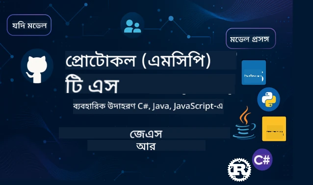

 

[](https://GitHub.com/microsoft/mcp-for-beginners/graphs/contributors)
[](https://GitHub.com/microsoft/mcp-for-beginners/issues)
[](https://GitHub.com/microsoft/mcp-for-beginners/pulls)
[](http://makeapullrequest.com)
[](https://mcptoplist.com/server/mcp.so%2Fmcp-for-beginners%2Fmicrosoft)

[](https://GitHub.com/microsoft/mcp-for-beginners/watchers)
[](https://GitHub.com/microsoft/mcp-for-beginners/fork)
[](https://GitHub.com/microsoft/mcp-for-beginners/stargazers)


[](https://discord.gg/nTYy5BXMWG)

এই রিসোর্সগুলি ব্যবহার শুরু করার জন্য এই ধাপগুলি অনুসরণ করুন:
1. **রিপোজিটরি ফর্ক করুন**: ক্লিক করুন [](https://GitHub.com/microsoft/mcp-for-beginners/fork)
2. **রিপোজিটরি ক্লোন করুন**:   `git clone https://github.com/microsoft/mcp-for-beginners.git`
3. **যোগ দিন** [](https://discord.gg/nTYy5BXMWG)


### 🌐 বহু-ভাষা সমর্থন

#### GitHub অ্যাকশনের মাধ্যমে সমর্থিত (স্বয়ংক্রিয় এবং সর্বদা আপ-টু-ডেট)

<!-- CO-OP TRANSLATOR LANGUAGES TABLE START -->
[Arabic](../ar/README.md) | [Bengali](./README.md) | [Bulgarian](../bg/README.md) | [Burmese (Myanmar)](../my/README.md) | [Chinese (Simplified)](../zh-CN/README.md) | [Chinese (Traditional, Hong Kong)](../zh-HK/README.md) | [Chinese (Traditional, Macau)](../zh-MO/README.md) | [Chinese (Traditional, Taiwan)](../zh-TW/README.md) | [Croatian](../hr/README.md) | [Czech](../cs/README.md) | [Danish](../da/README.md) | [Dutch](../nl/README.md) | [Estonian](../et/README.md) | [Finnish](../fi/README.md) | [French](../fr/README.md) | [German](../de/README.md) | [Greek](../el/README.md) | [Hebrew](../he/README.md) | [Hindi](../hi/README.md) | [Hungarian](../hu/README.md) | [Indonesian](../id/README.md) | [Italian](../it/README.md) | [Japanese](../ja/README.md) | [Kannada](../kn/README.md) | [Khmer](../km/README.md) | [Korean](../ko/README.md) | [Lithuanian](../lt/README.md) | [Malay](../ms/README.md) | [Malayalam](../ml/README.md) | [Marathi](../mr/README.md) | [Nepali](../ne/README.md) | [Nigerian Pidgin](../pcm/README.md) | [Norwegian](../no/README.md) | [Persian (Farsi)](../fa/README.md) | [Polish](../pl/README.md) | [Portuguese (Brazil)](../pt-BR/README.md) | [Portuguese (Portugal)](../pt-PT/README.md) | [Punjabi (Gurmukhi)](../pa/README.md) | [Romanian](../ro/README.md) | [Russian](../ru/README.md) | [Serbian (Cyrillic)](../sr/README.md) | [Slovak](../sk/README.md) | [Slovenian](../sl/README.md) | [Spanish](../es/README.md) | [Swahili](../sw/README.md) | [Swedish](../sv/README.md) | [Tagalog (Filipino)](../tl/README.md) | [Tamil](../ta/README.md) | [Telugu](../te/README.md) | [Thai](../th/README.md) | [Turkish](../tr/README.md) | [Ukrainian](../uk/README.md) | [Urdu](../ur/README.md) | [Vietnamese](../vi/README.md)

> **স্থানীয়ভাবে ক্লোন করতে চান?**
>
> এই রিপোজিটরিতে ৫০টিরও বেশি ভাষার অনুবাদ রয়েছে, যা ডাউনলোড সাইজ উল্লেখযোগ্যভাবে বৃদ্ধি করে। অনুবাদগুলি ছাড়া ক্লোন করতে, স্পার্স চেকআউট ব্যবহার করুন:
>
> **Bash / macOS / Linux:**
> ```bash
> git clone --filter=blob:none --sparse https://github.com/microsoft/mcp-for-beginners.git
> cd mcp-for-beginners
> git sparse-checkout set --no-cone '/*' '!translations' '!translated_images'
> ```
>
> **CMD (Windows):**
> ```cmd
> git clone --filter=blob:none --sparse https://github.com/microsoft/mcp-for-beginners.git
> cd mcp-for-beginners
> git sparse-checkout set --no-cone "/*" "!translations" "!translated_images"
> ```
>
> এটি আপনাকে একটি দ্রুততর ডাউনলোড সহ কোর্স সম্পূর্ণ করার জন্য প্রয়োজনীয় সবকিছু দেয়।
<!-- CO-OP TRANSLATOR LANGUAGES TABLE END -->

# 🚀 মডেল কনটেক্সট প্রোটোকল (MCP) শুরু করার জন্য কারিকুলাম

## **C#, Java, JavaScript, Rust, Python, এবং TypeScript-এ হাতে কলমে কোড উদাহরণ সহ MCP শিখুন**

## 🧠 মডেল কনটেক্সট প্রোটোকল কারিকুলামের ওভারভিউ
মডেল কনটেক্সট প্রোটোকল যাত্রায় স্বাগতম! আপনি যদি কখনও ভাবেন কিভাবে AI অ্যাপ্লিকেশনগুলি বিভিন্ন টুল এবং সার্ভিসের সাথে যোগাযোগ করে, আপনি এমন একটি সুন্দর সমাধান আবিষ্কার করতে যাচ্ছেন যা ডেভেলপারদের বুদ্ধিমান সিস্টেম তৈরি করার পদ্ধতি রূপান্তরিত করছে।

MCP কে একটি বিশ্বজনীন অনুবাদক হিসেবে ভাবুন AI অ্যাপ্লিকেশনগুলোর জন্য - যেমন USB পোর্ট আপনার কম্পিউটারে যেকোন ডিভাইস সংযোগের সুবিধা দেয়, ঠিক তেমনি MCP AI মডেলকে যেকোন টুল বা সার্ভিসের সাথে স্ট্যান্ডার্ডাইজড পদ্ধতিতে সংযোগের সুযোগ দেয়। আপনি প্রথম চ্যাটবট তৈরি করুন বা জটিল AI ওয়ার্কফ্লো নিয়ে কাজ করুন, MCP বোঝা আপনাকে আরও সক্ষম এবং নমনীয় অ্যাপ্লিকেশন তৈরি করার ক্ষমতা দেবে।

এই কারিকুলামটি আপনার শেখার যাত্রার জন্য ধৈর্য এবং যত্ন নিয়ে ডিজাইন করা হয়েছে। আমরা সহজ ধারণা দিয়ে শুরু করব যেগুলো আপনি ইতিমধ্যে বুঝতে পারেন এবং ধাপে ধাপে হাতে কলমে অনুশীলনের মাধ্যমে আপনার দক্ষতা বৃদ্ধি করব। প্রতিটি ধাপে পরিষ্কার ব্যাখ্যা, ব্যবহারিক উদাহরণ এবং প্রচুর উৎসাহ থাকবে।

এই যাত্রা শেষ করার সময়, আপনি নিজের MCP সার্ভার তৈরি করার, জনপ্রিয় AI প্ল্যাটফর্মের সাথে তাদের সংযুক্ত করার আত্মবিশ্বাস পাবেন এবং বুঝতে পারবেন কিভাবে এই প্রযুক্তি AI উন্নয়নের ভবিষ্যতকে আকৃতিবদ্ধ করছে। আসুন একসাথে এই রোমাঞ্চকর অভিযান শুরু করি!

### অফিসিয়াল ডকুমেন্টেশন এবং স্পেসিফিকেশন

এই কারিকুলামটি **MCP স্পেসিফিকেশন 2025-11-25** (সর্বশেষ স্থিতিশীল রিলিজ) এর সাথে সামঞ্জস্যপূর্ণ। MCP স্পেসিফিকেশন তারিখ-ভিত্তিক সংস্করণ ব্যবহৃত করে (YYYY-MM-DD ফর্ম্যাট) ক্লিয়ার প্রোটোকল সংস্করণ ট্র্যাকিং নিশ্চিত করার জন্য।

> **ভবিষ্যতের দিকে:** পরবর্তী স্পেসিফিকেশন সংস্করণ, **2026-07-28**, এর রিলিজ ক্যান্ডিডেট জুলাই ২৮, ২০২৬-এ পাঠানোর জন্য নির্ধারিত। এটি ট্রান্সপোর্ট লেয়ারে প্রোটোকলকে স্টেটলেস করে, এক্সটেনশন ফ্রেমওয়ার্ক (MCP Apps, Tasks) আনুষ্ঠানিক করে, অথোরাইজেশন শক্তিশালী করে এবং Roots, Sampling, এবং Logging ডিপ্রিকেট করে। সম্পূর্ণ বিশ্লেষণের জন্য দেখুন [What's Changing in MCP: The 2026-07-28 Release Candidate](./01-CoreConcepts/mcp-2026-07-28-release-candidate.md)।

এই রিসোর্সগুলি আপনার বোঝাপড়া যত বাড়বে তত বেশি মূল্যবান হবে, কিন্তু সবকিছু একবারে পড়ার চাপ অনুভব করবেন না। আপনার সবচেয়ে আগ্রহের ক্ষেত্রগুলি দিয়ে শুরু করুন!
- 📘 [MCP ডকুমেন্টেশন](https://modelcontextprotocol.io/) – এটি আপনার ধাপে ধাপে টিউটোরিয়াল এবং ব্যবহারকারী গাইডের জন্য প্রধান রিসোর্স। ডকুমেন্টেশন শিশুদের মনের কথা বিবেচনা করে লেখা হয়েছে, পরিষ্কার উদাহরণ সহ যা আপনি আপনার গতিতে অনুসরণ করতে পারেন।
- 📜 [MCP স্পেসিফিকেশন](https://modelcontextprotocol.io/specification/2025-11-25) – এটিকে আপনার বিস্তৃত রেফারেন্স ম্যানুয়াল হিসেবে ভাবুন। কারিকুলাম অনুসরণ করার সময়, আপনি এখানে নির্দিষ্ট বিশদ তথ্য দেখতে এবং উন্নত ফিচার অনুসন্ধানে ফিরে আসবেন।
- 📜 [MCP স্পেসিফিকেশন ভার্সনিং](https://modelcontextprotocol.io/specification/versioning) – এতে প্রোটোকলের সংস্করণ ইতিহাস এবং MCP কীভাবে তারিখ-ভিত্তিক ভার্সনিং (YYYY-MM-DD ফর্ম্যাট) ব্যবহার করে তার তথ্য রয়েছে।
- 🧑‍💻 [MCP GitHub রিপোজিটরি](https://github.com/modelcontextprotocol) – এখানে আপনি SDK, টুলস এবং বহু প্রোগ্রামিং ল্যাঙ্গুয়েজে কোড নমুনা পাবেন। এটি ব্যবহারিক উদাহরণ এবং প্রস্তুত-ব্যবহারের উপাদানের ঘরোয়া ভাণ্ডার।
- 🌐 [MCP কমিউনিটি](https://github.com/orgs/modelcontextprotocol/discussions) – MCP সম্পর্কে আলোচনা করতে সহপাঠী শিক্ষার্থী এবং অভিজ্ঞ ডেভেলপারদের সঙ্গে যোগ দিন। এটি একটি সহায়ক সম্প্রদায় যেখানে প্রশ্ন স্বাগত এবং জ্ঞান বিনিময় মুক্তভাবে হয়।
  
## শেখার লক্ষ্যসমূহ

এই কারিকুলামের শেষে, আপনি আপনার নতুন দক্ষতা নিয়ে আত্মবিশ্বাসী এবং উত্তেজিত বোধ করবেন। আপনি যা অর্জন করবেন তা এখানে:

• **MCP মৌলিক ধারণা বোঝা**: আপনি বুঝবেন মডেল কনটেক্সট প্রোটোকল কী এবং কেন এটি AI অ্যাপ্লিকেশনগুলোর পারস্পরিক কাজ করার পদ্ধতি বিপ্লব করছে, উদাহরণ এবং অনুরূপতার মাধ্যমে যা সহজবোধ্য।

• **আপনার প্রথম MCP সার্ভার তৈরি করা**: আপনি আপনার পছন্দের প্রোগ্রামিং ভাষায় একটি কাজকরা MCP সার্ভার তৈরি করবেন, সহজ উদাহরণ থেকে শুরু করে ধাপে ধাপে দক্ষতা বৃদ্ধি করবেন।

• **AI মডেলগুলোকে বাস্তব টুলের সাথে সংযোগ**: আপনি শিখবেন কিভাবে AI মডেল এবং প্রকৃত সার্ভিসের মধ্যে সেতুবন্ধন তৈরি করতে হয়, আপনার অ্যাপ্লিকেশনকে শক্তিশালী নতুন ক্ষমতা প্রদান করতে।

• **সিকিউরিটির সেরা অনুশীলন বাস্তবায়ন**: আপনি বুঝতে পারবেন কিভাবে আপনার MCP বাস্তবায়নগুলোকে নিরাপদ রাখা যায়, আপনার অ্যাপ্লিকেশন এবং ব্যবহারকারীদের সুরক্ষা দেয়া হয়।

• **আত্মবিশ্বাসের সাথে ডেপлой করা**: আপনি জানবেন কিভাবে আপনার MCP প্রকল্পগুলোকে ডেভেলপমেন্ট থেকে প্রোডাকশনে নিয়ে যেতে হয়, বাস্তব বিশ্বের কাজের ডেপлойমেন্ট কৌশলসহ।

• **MCP কমিউনিটিতে যোগদান করা**: আপনি একবর্ধমান ডেভেলপার সমাজের অংশ হয়ে উঠবেন যারা AI অ্যাপ্লিকেশন উন্নয়নের ভবিষ্যত গড়ছেন।

## প্রয়োজনীয় পটভূমি

MCP-র নির্দিষ্ট বিষয়ে নামার আগে আসুন নিশ্চিত করি আপনি কিছু মৌলিক ধারণার সাথে স্বস্তি বোধ করেন। আপনি যদি এই বিষয়গুলিতে বিশেষজ্ঞ না হন, চিন্তা করবেন না - আমরা যা জানা দরকার সব কিছু ব্যাখ্যা করব!

### প্রোটোকল বোঝা (মৌলিক ভিত্তি)

একটি প্রোটোকলকে কথোপকথনের নিয়মের মত ভাবুন। যখন আপনি আপনার বন্ধুকে কল দেন, তখন উত্তর দেওয়ার সময় দুজনেই "হ্যালো" বলেন, পালাক্রমে কথা বলেন, এবং শেষ হলে "বিদায়" বলেন। কম্পিউটার প্রোগ্রামগুলোর মধ্যে সুষ্ঠু যোগাযোগের জন্য একই ধরনের নিয়ম দরকার।

MCP একটি প্রোটোকল - একটি সম্মত নিয়মসমূহের সেট যা AI মডেল এবং অ্যাপ্লিকেশনগুলোকে টুল এবং সার্ভিসের সাথে কার্যকর “কথোপকথন” করতে সাহায্য করে। যেমন মানুষের কথোপকথনকে মসৃণ করে তুলতে নিয়ম থাকে, MCP-ও AI অ্যাপ্লিকেশন যোগাযোগকে আরও নির্ভরযোগ্য ও শক্তিশালী করে তোলে।

### ক্লায়েন্ট-সার্ভার সম্পর্ক (কিভাবে প্রোগ্রাম একসঙ্গে কাজ করে)

আপনি প্রতিদিন ক্লায়েন্ট-সার্ভার সম্পর্ক ব্যবহার করছেন! যখন আপনি একটি ওয়েব ব্রাউজার (ক্লায়েন্ট) ব্যবহার করে একটি ওয়েবসাইট ভিজিট করেন, তখন আপনি একটি ওয়েব সার্ভারের সাথে সংযুক্ত হচ্ছেন যা আপনাকে পেজের বিষয়বস্তু পাঠায়। ব্রাউজার জানে কীভাবে তথ্য অনুরোধ করতে হয়, আর সার্ভার জানে কিভাবে সাড়া দিতে হয়।

MCP-তেও একই ধরনের সম্পর্ক আছে: AI মডেলগুলি ক্লায়েন্ট হিসেবে কাজ করে, যেগুলি তথ্য বা কার্যক্রম অনুরোধ করে, আর MCP সার্ভারগুলি সেই ক্ষমতাগুলি সরবরাহ করে। এটা এমন, যেমন AI-এর জন্য একটি সহায়ক সহকারী (সার্ভার) আছে যে নির্দিষ্ট কাজগুলি সম্পাদন করতে পারে।

### কেন স্ট্যান্ডার্ডাইজেশন প্রয়োজন (কাজগুলো একসঙ্গে কাজ করার জন্য)

কল্পনা করুন যদি প্রতিটি গাড়ি নির্মাতা বিভিন্ন আকারের গ্যাস পাম্প ব্যবহার করত - আপনার প্রতিটি গাড়ির জন্য একটি ভিন্ন অ্যাডাপ্টারের প্রয়োজন হতো! স্ট্যান্ডার্ডাইজেশন মানে সাধারণ পদ্ধতির উপর সম্মত হওয়া যাতে জিনিসগুলো নির্বিঘ্নে একসঙ্গে কাজ করে।

MCP AI অ্যাপ্লিকেশনগুলোর জন্য এই স্ট্যান্ডার্ডাইজেশন প্রদান করে। প্রতিটি AI মডেল যখন প্রতিটি টুলের সাথে কাজ করার জন্য নিজের কাস্টম কোডের প্রয়োজন হয় না, MCP তাদের যোগাযোগের জন্য একটি সার্বজনীন উপায় তৈরি করে। এর ফলে ডেভেলপাররা একবার টুল তৈরি করে অনেক AI সিস্টেমের সাথে কাজ করাতে পারে।

## 🧭 আপনার শেখার পথের ওভারভিউ

আপনার MCP যাত্রাটি যত্নসহকারে গঠন করা হয়েছে যাতে আপনি পরপর নতুন ধারণা শিখতে এবং পুরোনোগুলি দৃঢ় করতে পারেন।

### 🌱 ভিত্তি পর্যায়: মৌলিক বিষয় বোঝা (মডিউল ০-২)

এইখান থেকেই আপনার অভিযান শুরু! আমরা MCP ধারণাগুলো পরিচিত উপমা এবং সহজ উদাহরণের মাধ্যমে পরিচয় করিয়ে দেব। আপনি বুঝবেন MCP কী, কেন এটি আছে, এবং AI উন্নয়নের বৃহত্তর জগতে এটি কীভাবে ফিট করে।


• **মডিউল ০ - MCP এর পরিচিতি**: আমরা শুরু করব MCP কী এবং কেন এটি আধুনিক AI অ্যাপ্লিকেশনগুলোর জন্য এত গুরুত্বপূর্ণ তা অনুসন্ধান করে। আপনি বাস্তব জীবনের উদাহরণ দেখবেন MCP এর কার্যকরীতে এবং বুঝবেন কিভাবে এটি ডেভেলপারদের সাধারণ সমস্যাগুলো সমাধান করে।

• **মডিউল ১ - প্রধান ধারণাগুলোর ব্যাখ্যা**: এখানে আপনি MCP এর অপরিহার্য নির্মাণ উপাদান শিখবেন। আমরা প্রচুর রূপক এবং দৃশ্যমান উদাহরণ ব্যবহার করব যাতে এই ধারণাগুলো স্বাভাবিক এবং বোধ্য মনে হয়।

• **মডিউল ২ - MCP তে নিরাপত্তা**: নিরাপত্তা শোনালে হয়তো ভয়ের অনুভব হতে পারে, কিন্তু আমরা দেখাবো কিভাবে MCP তে ইনবিল্ট সেফটি ফিচার আছে এবং শুরু থেকেই অ্যাপ্লিকেশনগুলোকে সুরক্ষিত রাখার সেরা প্র্যাকটিস শেখাবো।

### 🔨 নির্মাণ পর্যায়: আপনার প্রথম বাস্তবায়ন তৈরি (মডিউল ৩)

এখন আসল মজা শুরু! আপনি হাতেকলমে অভিজ্ঞতা পাবেন MCP সার্ভার এবং ক্লায়েন্ট বাস্তবায়ন করে। চিন্তা করবেন না - আমরা সহজ থেকে শুরু করে প্রতিটি ধাপে গাইড করব।

এই মডিউলে রয়েছে একাধিক হাতেকলমে গাইড যা আপনাকে পছন্দসই প্রোগ্রামিং ভাষায় অনুশীলনের সুযোগ দেবে। আপনি প্রথম সার্ভার তৈরির পাশাপাশি, একটিতে সংযোগ করার জন্য ক্লায়েন্ট তৈরি করবেন, এবং জনপ্রিয় ডেভেলপমেন্ট টুল যেমন VS Code এর সাথে ইন্টিগ্রেটও করবেন।

প্রতিটি গাইডে সম্পূর্ণ কোড উদাহরণ, সমস্যার সমাধানের টিপস, এবং আমরা কেন নির্দিষ্ট ডিজাইন পছন্দ করি তার ব্যাখ্যা থাকবে। এই পর্যায়ের শেষে আপনার পূর্ণাঙ্গ MCP বাস্তবায়ন থাকবে যা নিয়ে আপনি গর্ব করতে পারবেন!

### 🚀 উন্নয়ন পর্যায়: উন্নত ধারণা ও বাস্তব-বিশ্বের প্রয়োগ (মডিউল ৪-৫)

বেসিকগুলো মাস্টার করার পর, আপনি আরও উন্নত MCP ফিচার অনুসন্ধান করতে প্রস্তুত। আমরা প্রাকটিক্যাল ইমপ্লিমেন্টেশন স্ট্র্যাটেজি, ডিবাগিং কৌশল, এবং মাল্টি-মোডাল AI ইন্টিগ্রেশন-এর মত উন্নত বিষয়গুলি কভার করব।

আপনি শিখবেন আপনার MCP বাস্তবায়নকে প্রোডাকশন ব্যবহারের জন্য স্কেল করতে এবং Azure-এর মতো ক্লাউড প্ল্যাটফর্মের সাথে ইন্টিগ্রেট করতে। এই মডিউলগুলো আপনাকে বাস্তব বিশ্বের চাহিদা মোকাবেলা করার জন্য MCP সমাধান তৈরি করতে প্রস্তুত করবে।

### 🌟 দক্ষতা পর্যায়: কমিউনিটি এবং বিশেষায়ন (মডিউল ৬-১১)

চূড়ান্ত পর্বটি MCP কমিউনিটিতে যোগদান এবং আপনার সবচেয়ে আগ্রহী ক্ষেত্রগুলোতে বিশেষায়িত হওয়ার উপর ফোকাস করে। আপনি শিখবেন কিভাবে ওপেন-সোর্স MCP প্রকল্পগুলোতে অবদান রাখতে হয়, উন্নত অথেন্টিকেশন প্যাটার্ন বাস্তবায়ন করতে হয়, এবং ব্যাপক ডেটাবেস-ইন্টিগ্রেটেড সমাধান তৈরি করতে হয়।

মডিউল ১১ বিশেষ উল্লেখযোগ্য - এটি একটি সম্পূর্ণ ১৩-ল্যাব হাতেকলমে শেখার পথ যা আপনাকে PostgreSQL ইন্টিগ্রেশনের সাথে প্রোডাকশন-রেডি MCP সার্ভার তৈরি করতে শেখায়। এটি একটি ক্যাপস্টোন প্রকল্পের মতো যা শেখা সমস্ত বিষয় একত্রিত করে!

### 📚 সম্পূর্ণ পাঠ্যক্রম কাঠামো

| মডিউল | বিষয় | বর্ণনা | লিঙ্ক |
|--------|-------|-------------|------|
| **মডিউল ০-৩: মৌলিক বিষয়** | | | |
| ০০ | MCP পরিচিতি | Model Context Protocol-এর ওভারভিউ এবং AI পাইপলাইনে এর গুরুত্ব | [Read more](./00-Introduction/README.md) |
| ০১ | প্রধান ধারণাগুলো ব্যাখ্যা | MCP এর মূল ধারণাগুলোর গভীর অন্বেষণ | [Read more](./01-CoreConcepts/README.md) |
| ১.১ | MCP তে কী পরিবর্তন হচ্ছে (2026-07-28 RC) | Stateless প্রোটোকল, এক্সটেনশনস ফ্রেমওয়ার্ক, এবং পরবর্তী স্পেসিফিকেশন ভার্সনে আসা ফিচার ডিপ্রেকেশন | [Guide](./01-CoreConcepts/mcp-2026-07-28-release-candidate.md) |
| ০২ | MCP তে নিরাপত্তা | নিরাপত্তা হুমকি এবং সেরা প্র্যাকটিস | [Read more](./02-Security/README.md) |
| ০৩ | MCP শুরু করা | পরিবেশ সেটআপ, মৌলিক সার্ভার/ক্লায়েন্ট, ইন্টিগ্রেশন | [Read more](./03-GettingStarted/README.md) |
| **মডিউল ৩: আপনার প্রথম সার্ভার ও ক্লায়েন্ট তৈরি** | | | |
| ৩.১ | প্রথম সার্ভার | আপনার প্রথম MCP সার্ভার তৈরি করুন | [Guide](./03-GettingStarted/01-first-server/README.md) |
| ৩.২ | প্রথম ক্লায়েন্ট | একটি মৌলিক MCP ক্লায়েন্ট তৈরি করুন | [Guide](./03-GettingStarted/02-client/README.md) |
| ৩.৩ | LLM সহ ক্লায়েন্ট | বড় ভাষার মডেল ইন্টিগ্রেট করুন | [Guide](./03-GettingStarted/03-llm-client/README.md) |
| ৩.৪ | VS Code ইন্টিগ্রেশন | MCP সার্ভারগুলো VS Code-এ ব্যবহার করুন | [Guide](./03-GettingStarted/04-vscode/README.md) |
| ৩.৫ | stdio সার্ভার | stdio ট্রান্সপোর্ট ব্যবহার করে সার্ভার তৈরি করুন | [Guide](./03-GettingStarted/05-stdio-server/README.md) |
| ৩.৬ | HTTP স্ট্রিমিং | MCP তে HTTP স্ট্রিমিং বাস্তবায়ন করুন | [Guide](./03-GettingStarted/06-http-streaming/README.md) |
| ৩.৭ | মাইক্রোসফট ফাউন্ড্রি টুলকিট | MCP এর সাথে Microsoft Foundry Toolkit ব্যবহার করুন | [Guide](./03-GettingStarted/07-aitk/README.md) |
| ৩.৮ | টেস্টিং | আপনার MCP সার্ভার বাস্তবায়নের পরীক্ষা করুন | [Guide](./03-GettingStarted/08-testing/README.md) |
| ৩.৯ | ডিপ্লয়মেন্ট | প্রোডাকশন পরিবেশে MCP সার্ভার ডিপ্লয় করুন | [Guide](./03-GettingStarted/09-deployment/README.md) |
| ৩.১০ | উন্নত সার্ভার ব্যবহার | উন্নত ফিচার ব্যবহার এবং উন্নত আর্কিটেকচারের জন্য উন্নত সার্ভার ব্যবহার করুন | [Guide](./03-GettingStarted/10-advanced/README.md) |
| ৩.১১ | সাধারণ অথ | শুরু থেকে অথ এবং RBAC দেখায় এমন একটি অধ্যায় | [Guide](./03-GettingStarted/11-simple-auth/README.md) |
| ৩.১২ | MCP হোস্ট | Claude Desktop, Cursor, Cline, এবং অন্যান্য MCP হোস্ট কনফিগার করুন | [Guide](./03-GettingStarted/12-mcp-hosts/README.md) |
| ৩.১৩ | MCP ইন্সপেক্টর | ইন্সপেক্টর টুল দিয়ে MCP সার্ভার ডিবাগ এবং পরীক্ষা করুন | [Guide](./03-GettingStarted/13-mcp-inspector/README.md) |
| ৩.১৪ | স্যাম্পলিং | ক্লায়েন্টের সাথে সহযোগিতা করতে স্যাম্পলিং ব্যবহার করুন | [Guide](./03-GettingStarted/14-sampling/README.md) |
| ৩.১৫ | MCP অ্যাপস | MCP অ্যাপ তৈরি করুন | [Guide](./03-GettingStarted/15-mcp-apps/README.md) |
| **মডিউল ৪-৫: প্র্যাকটিক্যাল ও উন্নত** | | | |
| ০৪ | প্র্যাকটিক্যাল বাস্তবায়ন | SDK, ডিবাগিং, টেস্টিং, পুনঃব্যবহারযোগ্য প্রম্পট টেমপ্লেট | [Read more](./04-PracticalImplementation/README.md) |
| ৪.১ | পেজিনেশন | কার্সার-ভিত্তিক পেজিনেশন দিয়ে বড় ফলাফল সেট হ্যান্ডেল করুন | [Guide](./04-PracticalImplementation/pagination/README.md) |
| ০৫ | MCP তে উন্নত বিষয়াবলী | মাল্টি-মোডাল AI, স্কেলিং, এন্টারপ্রাইজ ব্যবহার | [Read more](./05-AdvancedTopics/README.md) |
| ৫.১ | Azure ইন্টিগ্রেশন | MCP এবং Azure এর ইন্টিগ্রেশন | [Guide](./05-AdvancedTopics/mcp-integration/README.md) |
| ৫.২ | মাল্টি-মোডালিটি | একাধিক মোডালিটির সাথে কাজ করা | [Guide](./05-AdvancedTopics/mcp-multi-modality/README.md) |
| ৫.৩ | OAuth2 ডেমো | OAuth2 অথেন্টিকেশন বাস্তবায়ন করুন | [Guide](./05-AdvancedTopics/mcp-oauth2-demo/README.md) |
| ৫.৪ | রুট কনটেক্সট | রুট কনটেক্সট বোঝা এবং বাস্তবায়ন | [Guide](./05-AdvancedTopics/mcp-root-contexts/README.md) |
| ৫.৫ | রাউটিং | MCP রাউটিং কৌশল | [Guide](./05-AdvancedTopics/mcp-routing/README.md) |
| ৫.৬ | স্যাম্পলিং | MCP তে স্যাম্পলিং টেকনিক | [Guide](./05-AdvancedTopics/mcp-sampling/README.md) |
| ৫.৭ | স্কেলিং | MCP বাস্তবায়ন স্কেল করুন | [Guide](./05-AdvancedTopics/mcp-scaling/README.md) |
| ৫.৮ | নিরাপত্তা | উন্নত নিরাপত্তা বিবেচনা | [Guide](./05-AdvancedTopics/mcp-security/README.md) |
| ৫.৯ | ওয়েব সার্চ | ওয়েব সার্চ ক্ষমতা বাস্তবায়ন করুন | [Guide](./05-AdvancedTopics/web-search-mcp/README.md) |
| ৫.১০ | রিয়েলটাইম স্ট্রিমিং | রিয়েলটাইম স্ট্রিমিং কার্যকারিতা তৈরি করুন | [Guide](./05-AdvancedTopics/mcp-realtimestreaming/README.md) |
| ৫.১১ | রিয়েলটাইম সার্চ | রিয়েলটাইম সার্চ বাস্তবায়ন করুন | [Guide](./05-AdvancedTopics/mcp-realtimesearch/README.md) |
| ৫.১২ | Entra ID অথ | মাইক্রোসফট Entra ID দিয়ে অথেন্টিকেশন | [Guide](./05-AdvancedTopics/mcp-security-entra/README.md) |
| ৫.১৩ | ফাউন্ড্রি ইন্টিগ্রেশন | Microsoft Foundry এর সাথে ইন্টিগ্রেট করুন | [Guide](./05-AdvancedTopics/mcp-foundry-agent-integration/README.md) |
| ৫.১৪ | কনটেক্সট ইঞ্জিনিয়ারিং | কার্যকর কনটেক্সট ইঞ্জিনিয়ারিং কৌশল | [Guide](./05-AdvancedTopics/mcp-contextengineering/README.md) |
| ৫.১৫ | MCP কাস্টম ট্রান্সপোর্ট | কাস্টম ট্রান্সপোর্ট বাস্তবায়ন | [Guide](./05-AdvancedTopics/mcp-transport/README.md) |
| ৫.১৬ | প্রোটোকল ফিচার | প্রগ্রেস নোটিফিকেশন, বাতিল, রিসোর্স টেমপ্লেট | [Guide](./05-AdvancedTopics/mcp-protocol-features/README.md) |
| ৫.১৭ | বিরোধী মাল্টি-এজেন্ট যুক্তি | দুই এজেন্ট বিপরীত দিকের যুক্তি MCP টুল শেয়ার করে, বিচারক এজেন্ট দ্বারা মূল্যায়িত | [Guide](./05-AdvancedTopics/mcp-adversarial-agents/README.md) |
| **মডিউল ৬-১০: কমিউনিটি ও সেরা প্র্যাকটিস** | | | |
| ০৬ | কমিউনিটি অবদান | MCP ইকোসিস্টেমে কীভাবে অবদান রাখতে হয় | [Guide](./06-CommunityContributions/README.md) |
| ০৭ | প্রাথমিক গ্রহণ থেকে অন্তর্দৃষ্টি | বাস্তব জীবনের বাস্তবায়ন গল্প | [Guide](./07-LessonsfromEarlyAdoption/README.md) |
| ০৮ | MCP এর সেরা প্র্যাকটিস | কর্মক্ষমতা, ভুল সহনশীলতা, স্থিতিশীলতা | [Guide](./08-BestPractices/README.md) |
| ০৯ | MCP কেস স্টাডিস | প্র্যাকটিক্যাল বাস্তবায়ন উদাহরণ | [Guide](./09-CaseStudy/README.md) |
| ১০ | হাতেকলমে কর্মশালা | Microsoft Foundry Toolkit দিয়ে MCP সার্ভার নির্মাণ | [Lab](./10-StreamliningAIWorkflowsBuildingAnMCPServerWithAIToolkit/README.md) |
| **মডিউল ১১: MCP সার্ভার হাতেকলমে ল্যাব** | | | |
| ১১ | MCP সার্ভার ডেটাবেস ইন্টিগ্রেশন | PostgreSQL ইন্টিগ্রেশনের জন্য ১৩-ল্যাব সম্পূর্ণ হাতেকলমে শেখার পথ | [Labs](./11-MCPServerHandsOnLabs/README.md) |
| ১১.১ | পরিচিতি | ডেটাবেস ইন্টিগ্রেশন এবং রিটেইল অ্যানালিটিকস ব্যবহার কেস সহ MCP ওভারভিউ | [Lab 00](./11-MCPServerHandsOnLabs/00-Introduction/README.md) |
| ১১.২ | মূল স্থাপত্য | MCP সার্ভার আর্কিটেকচার, ডেটাবেস স্তর, এবং নিরাপত্তা প্যাটার্ন বোঝা | [Lab 01](./11-MCPServerHandsOnLabs/01-Architecture/README.md) |
| ১১.৩ | নিরাপত্তা ও মাল্টি-টেন্যানসি | রো লেভেল সিকিউরিটি, অথেন্টিকেশন, এবং মাল্টি-টেন্যান্ট ডেটা অ্যাক্সেস | [Lab 02](./11-MCPServerHandsOnLabs/02-Security/README.md) |
| ১১.৪ | পরিবেশ সেটআপ | ডেভেলপমেন্ট পরিবেশ, ডকার, Azure রিসোর্স সেটআপ | [Lab 03](./11-MCPServerHandsOnLabs/03-Setup/README.md) |
| ১১.৫ | ডেটাবেস ডিজাইন | PostgreSQL সেটআপ, রিটেইল স্কিমা ডিজাইন, এবং স্যাম্পল ডেটা | [Lab 04](./11-MCPServerHandsOnLabs/04-Database/README.md) |
| ১১.৬ | MCP সার্ভার বাস্তবায়ন | ডেটাবেস ইন্টিগ্রেশন সহ FastMCP সার্ভার তৈরি | [Lab 05](./11-MCPServerHandsOnLabs/05-MCP-Server/README.md) |
| ১১.৭ | টুল ডেভেলপমেন্ট | ডেটাবেস কোয়েরি টুলস এবং স্কিমা ইন্ট্রোস্পেকশন তৈরি | [Lab 06](./11-MCPServerHandsOnLabs/06-Tools/README.md) |
| ১১.৮ | সেম্যান্টিক সার্চ | Azure OpenAI এবং pgvector ব্যবহার করে ভেক্টর এম্বেডিং বাস্তবায়ন | [Lab 07](./11-MCPServerHandsOnLabs/07-Semantic-Search/README.md) |
| ১১.৯ | টেস্টিং ও ডিবাগিং | টেস্টিং কৌশল, ডিবাগিং টুলস এবং ভ্যালিডেশন পদ্ধতি | [Lab 08](./11-MCPServerHandsOnLabs/08-Testing/README.md) |
| ১১.১০ | VS Code ইন্টিগ্রেশন | VS Code MCP ইন্টিগ্রেশন এবং AI চ্যাট ব্যবহার সেটআপ | [Lab 09](./11-MCPServerHandsOnLabs/09-VS-Code/README.md) |
| ১১.১১ | ডিপ্লয়মেন্ট স্ট্র্যাটেজি | ডকার ডিপ্লয়মেন্ট, Azure Container Apps, এবং স্কেলিং বিবেচনা | [Lab ১০](./11-MCPServerHandsOnLabs/10-Deployment/README.md) |
| ১১.১২ | মনিটরিং | অ্যাপ্লিকেশন ইনসাইটস, লগিং, পারফরম্যান্স মনিটরিং | [Lab ১১](./11-MCPServerHandsOnLabs/11-Monitoring/README.md) |
| ১১.১৩ | সেরা প্র্যাকটিস | পারফরম্যান্স অপ্টিমাইজেশন, নিরাপত্তা উন্নয়ন, এবং প্রোডাকশন টিপস | [Lab ১২](./11-MCPServerHandsOnLabs/12-Best-Practices/README.md) |
| **মডিউল ১২: MCP টুলিং** | | | |
| ১২.১ | টুলিং | Copilot অ্যাপে MCP ব্যবহারের পন্থা | [ Guide ](./12-tooling/README.md) |

### 💻 নমুনা কোড প্রকল্প

MCP শেখার সবচেয়ে উত্তেজনাপূর্ণ অংশগুলোর একটি হলো আপনার কোড দক্ষতার প্রগতিশীল উন্নয়ন দেখা। আমরা আমাদের কোড উদাহরণগুলো সহজ থেকে শুরু করে যত্নসহকারে আরও জটিল করে তুলেছি যেমন আপনার বোঝাপড়া গভীর হচ্ছে। এখানে কিভাবে ধারণাগুলো উপস্থাপন করা হয় - এমন কোড যা বোধগম্য এবং বাস্তব MCP নীতিমালা প্রদর্শন করে; আপনি শুধু কোডটি কী করে তা দেখবেন না, কেন এটি এইভাবে গঠিত এবং বৃহত্তর MCP অ্যাপ্লিকেশনে এটি কিভাবে ফিট হয় তাও বুঝতে পারবেন।

#### মৌলিক MCP ক্যালকুলেটর নমুনা

| ভাষা | বর্ণনা | লিঙ্ক |
|----------|-------------|------|

| C# | MCP সার্ভার উদাহরণ | [কোড দেখুন](./03-GettingStarted/samples/csharp/README.md) |
| Java | MCP ক্যালকুলেটর | [কোড দেখুন](./03-GettingStarted/samples/java/calculator/README.md) |
| JavaScript | MCP ডেমো | [কোড দেখুন](./03-GettingStarted/samples/javascript/README.md) |
| Python | MCP সার্ভার | [কোড দেখুন](../../03-GettingStarted/samples/python/mcp_calculator_server.py) |
| TypeScript | MCP উদাহরণ | [কোড দেখুন](./03-GettingStarted/samples/typescript/README.md) |
| Rust | MCP উদাহরণ | [কোড দেখুন](./03-GettingStarted/samples/rust/README.md) |

#### উন্নত MCP বাস্তবায়নসমূহ

| ভাষা | বর্ণনা | লিঙ্ক |
|----------|-------------|------|
| C# | উন্নত নমুনা | [কোড দেখুন](./04-PracticalImplementation/samples/csharp/README.md) |
| Spring সহ Java | কন্টেইনার অ্যাপ উদাহরণ | [কোড দেখুন](./04-PracticalImplementation/samples/java/containerapp/README.md) |
| JavaScript | উন্নত নমুনা | [কোড দেখুন](./04-PracticalImplementation/samples/javascript/README.md) |
| Python | জটিল বাস্তবায়ন | [কোড দেখুন](./04-PracticalImplementation/samples/python/README.md) |
| TypeScript | কন্টেইনার নমুনা | [কোড দেখুন](./04-PracticalImplementation/samples/typescript/README.md) |


## 🎯 MCP শেখার জন্য পূর্বশর্তসমূহ

এই পাঠ্যক্রম থেকে সর্বোচ্চ সুবিধা পেতে, আপনার থাকা উচিত:

- নিচের যেকোনো এক বা একাধিক ভাষায় মৌলিক প্রোগ্রামিং জ্ঞান: C#, Java, JavaScript, Python, অথবা TypeScript
- ক্লায়েন্ট-সার্ভার মডেল এবং API এর বোঝাপড়া
- REST এবং HTTP ধারণার সাথে পরিচিতি
- (ঐচ্ছিক) AI/ML ধারণায় পটভূমি

- সমর্থনের জন্য আমাদের কমিউনিটি আলোচনায় যোগদান করা

## 📚 অধ্যয়ন গাইড ও সম্পদসমূহ

এই রিপোজিটরিতে বেশ কিছু সম্পদ রয়েছে যা আপনাকে দক্ষভাবে নেভিগেট এবং শেখার জন্য সাহায্য করবে:

### অধ্যয়ন গাইড

একটি ব্যাপক [অধ্যয়ন গাইড](./study_guide.md) উপলব্ধ যা আপনাকে এই রিপোজিটরিটি দক্ষতার সাথে নেভিগেট করতে সাহায্য করবে। এই ভিজ্যুয়াল কারিকুলাম ম্যাপ সব বিষয়গুলি কিভাবে সংযুক্ত তা দেখায় এবং নমুনা প্রজেক্টগুলি ব্যবহারের নির্দেশনা দেয়। বিশেষত যদি আপনি ভিজ্যুয়াল শিখতে ভালোবাসেন, তবে এটি খুবই উপকারী।

গাইডটিতে রয়েছে:
- সব আলোচিত বিষয়ের ভিজ্যুয়াল কারিকুলাম ম্যাপ
- প্রতিটি রিপোজিটরি অংশের বিশদ বিশ্লেষণ
- নমুনা প্রজেক্ট ব্যবহারের নির্দেশনা
- বিভিন্ন দক্ষতার স্তরের জন্য সুপারিশকৃত শিকন পথ
- আপনার শেখার যাত্রাকে সম্পূর্ণ করার অতিরিক্ত সম্পদ

### চেঞ্জলগ

আমরা একটি বিস্তারিত [চেঞ্জলগ](./changelog.md) বজায় রাখি যা কারিকুলাম উপকরণের সব গুরুত্বপূর্ণ আপডেট ট্র্যাক করে, যাতে আপনি সর্বশেষ উন্নতি এবং সংযোজন সম্পর্কে আপ-টু-ডেট থাকতে পারেন।
- নতুন বিষয়বস্তু সংযোজন
- কাঠামোগত পরিবর্তন
- বৈশিষ্ট্য উন্নয়ন
- ডকুমেন্টেশন আপডেট

## 🛠️ এই কারিকুলাম কার্যকরভাবে কিভাবে ব্যবহার করবেন

এই গাইডের প্রতিটি পাঠে অন্তর্ভুক্ত রয়েছে:

1. MCP ধারণাগুলির স্পষ্ট ব্যাখ্যা  
2. একাধিক ভাষায় লাইভ কোড উদাহরণ  
3. বাস্তব MCP অ্যাপ্লিকেশন তৈরির জন্য অনুশীলন  
4. উন্নত শিক্ষার্থীদের জন্য অতিরিক্ত সম্পদ

### চলুন C# দিয়ে MCP শিখি - টিউটোরিয়াল সিরিজ
চলুন Model Context Protocol (MCP) সম্পর্কে শিখি, একটি আধুনিক ফ্রেমওয়ার্ক যা AI মডেল এবং ক্লায়েন্ট অ্যাপ্লিকেশনের মধ্যে ইন্টারঅ্যাকশন স্ট্যান্ডার্ডাইজ করার জন্য ডিজাইন করা হয়েছে। এই প্রারম্ভিক-মিত্র সেশনের মাধ্যমে, আমরা আপনাকে MCP পরিচয় করিয়ে দেব এবং আপনার প্রথম MCP সার্ভার তৈরি করার পথে নির্দেশনা দেব।
#### C#: [https://aka.ms/letslearnmcp-csharp](https://aka.ms/letslearnmcp-csharp)
#### Java: [https://aka.ms/letslearnmcp-java](https://aka.ms/letslearnmcp-java)
#### JavaScript: [https://aka.ms/letslearnmcp-javascript](https://aka.ms/letslearnmcp-javascript)
#### Python: [https://aka.ms/letslearnmcp-python](https://aka.ms/letslearnmcp-python)

## 🎓 আপনার MCP যাত্রা শুরু হল

অভিনন্দন! আপনি একটি রোমাঞ্চকর যাত্রার প্রথম পদক্ষেপ নিয়েছেন যা আপনার প্রোগ্রামিং দক্ষতাকে সম্প্রসারিত করবে এবং আপনাকে AI উন্নয়নের শীর্ষ পর্যায়ের সাথে সংযুক্ত করবে।

### আপনি যা ইতিমধ্যেই অর্জন করেছেন

এই প্রস্তাবনা পড়ে, আপনি ইতিমধ্যেই আপনার MCP জ্ঞান ভিত্তি গড়তে শুরু করেছেন। আপনি বুঝতে পেরেছেন MCP কী, কেন এটি গুরুত্বপূর্ণ, এবং কিভাবে এই কারিকুলাম আপনার শেখার যাত্রাকে সমর্থন করবে। এটি একটি গুরুত্বপূর্ণ অর্জন এবং এই গুরুত্বপূর্ণ প্রযুক্তিতে আপনার দক্ষতার সূচনা।

### সামনের অভিযান

আপনি যখন মডিউলগুলির মধ্য দিয়ে এগোবেন, মনে রাখবেন প্রতিটি বিশেষজ্ঞ কখনো একজন শিক্ষানবিস ছিলেন। যে ধারণাগুলো এখন জটিল মনে হতে পারে, সেগুলো অনুশীলন ও প্রয়োগের মাধ্যমে স্বাভাবিক হয়ে উঠবে। প্রতিটি ছোট পদক্ষেপ শক্তিশালী দক্ষতা গড়ে তোলে যা আপনার পুরো উন্নয়ন ক্যারিয়ারে সেবা করবে।

### আপনার সহায়ক নেটওয়ার্ক

আপনি MCP নিয়ে আগ্রহী শিক্ষার্থী ও বিশেষজ্ঞদের একটি কমিউনিটিতে যোগদান করছেন যারা অন্যদের সফলতা সাহায্য করতে আগ্রহী। আপনি কোডিং চ্যালেঞ্জে আটকে গেলেও বা কোনো অগ্রগতি শেয়ার করতে উচ্ছ্বসিত হলে, কমিউনিটি আপনার যাত্রায় সহায়তা করতে প্রস্তুত।

যদি আপনি আটকে যান বা AI অ্যাপ্লিকেশন তৈরির ব্যাপারে কোনো প্রশ্ন থাকে, তবে MCP সম্পর্কে সহপাঠী শিক্ষার্থী এবং অভিজ্ঞ ডেভেলপারদের সাথে আলোচনা করুন। এটি একটি সহায়ক কমিউনিটি যেখানে প্রশ্ন স্বাগত এবং জ্ঞান স্বাধীনভাবে শেয়ার করা হয়।

[](https://discord.gg/nTYy5BXMWG)

যদি আপনি পণ্যের প্রতিক্রিয়া বা ত্রুটি সংক্রান্ত সমস্যাগুলো রিপোর্ট করতে চান:

[](https://aka.ms/foundry/forum)

### শুরু করতে প্রস্তুত?

আপনার MCP অভিযান এখনই শুরু! মডিউল 0 দিয়ে শুরু করে আপনার প্রথম হাতে-কলমে MCP অভিজ্ঞতায় প্রবেশ করুন, অথবা নমুনা প্রজেক্টগুলি অন্বেষণ করুন যা আপনি তৈরি করবেন। মনে রাখবেন - প্রতিটি বিশেষজ্ঞ ঠিক এখান থেকেই শুরু করেছিল, ধৈর্য ও অনুশীলনের মাধ্যমে আপনি আশ্চর্যজনক কিছু অর্জন করবেন।

Model Context Protocol উন্নয়নের জগতে আপনাকে স্বাগতম। চলুন একসাথে কিছু অসাধারণ তৈরি করি!

## 🤝 শেখার কমিউনিটিতে অবদান রাখা

এই কারিকুলাম শিক্ষার্থীদের অবদান দিয়ে আরও শক্তিশালী হচ্ছে! আপনি টাইপো মেরামত করুন, স্পষ্টতর ব্যাখ্যা প্রস্তাব করুন, অথবা নতুন উদাহরণ যোগ করুন, আপনার অবদান অন্য শিক্ষানবিসদের সফল হতে সাহায্য করবে।

কোড নমুনা দেয়ার জন্য Microsoft Valued Professional [Shivam Goyal](https://www.linkedin.com/in/shivam2003/) কে ধন্যবাদ।

অবদান প্রক্রিয়া স্বাগত ও সহায়ক করার উদ্দেশ্যে ডিজাইন করা হয়েছে। বেশিরভাগ অবদানের জন্য Contributor License Agreement (CLA) প্রয়োজন, কিন্তু স্বয়ংক্রিয় টুলগুলি আপনাকে মসৃণভাবে প্রক্রিয়ার মধ্য দিয়ে নিয়ে যাবে।

## 📜 ওপেন সোর্স শেখা

এই পুরো কারিকুলাম MIT [LICENSE](../../LICENSE) অধীনে উপলব্ধ, যা মানে আপনি এটি ব্যবহার, পরিবর্তন এবং বিনামূল্যে শেয়ার করতে পারেন। এটি আমাদের MCP জ্ঞান সবার জন্য সরবরাহের মিশনকে সমর্থন করে।
## 🤝 অবদান নির্দেশিকা

এই প্রকল্প অবদান ও পরামর্শকে স্বাগত জানায়। বেশিরভাগ অবদানের জন্য আপনাকে সম্মতি দিতে হবে
Contributor License Agreement (CLA) যা ঘোষণা করে যে আপনার অবদান ব্যবহারের অধিকার ও অনুমতি আমাদের আছে। বিস্তারিত জানতে <https://cla.opensource.microsoft.com> দেখুন।


এই প্রকল্প Microsoft Open Source Code of Conduct কে গ্রহণ করেছে [https://opensource.microsoft.com/codeofconduct/](https://opensource.microsoft.com/codeofconduct/)।
আরো তথ্যের জন্য [Code of Conduct FAQ](https://opensource.microsoft.com/codeofconduct/faq/) দেখুন অথবা


---

*আপনার MCP যাত্রা শুরু করতে প্রস্তুত? [মডিউল 00 - MCP পরিচিতি](./00-Introduction/README.md) দিয়ে শুরু করুন এবং Model Context Protocol উন্নয়নের জগতে আপনার প্রথম পদক্ষেপ নিন!*


## 🎒 অন্যান্য কোর্সসমূহ
আমাদের টিম অন্যান্য কোর্স তৈরি করে! দেখুন:

<!-- CO-OP TRANSLATOR OTHER COURSES START -->
### LangChain
[](https://aka.ms/langchain4j-for-beginners)
[](https://aka.ms/langchainjs-for-beginners?WT.mc_id=m365-94501-dwahlin)
[](https://github.com/microsoft/langchain-for-beginners?WT.mc_id=m365-94501-dwahlin)
---

### Azure / Edge / MCP / Agents
[](https://github.com/microsoft/AZD-for-beginners?WT.mc_id=academic-105485-koreyst)
[](https://github.com/microsoft/edgeai-for-beginners?WT.mc_id=academic-105485-koreyst)
[](https://github.com/microsoft/mcp-for-beginners?WT.mc_id=academic-105485-koreyst)
[](https://github.com/microsoft/ai-agents-for-beginners?WT.mc_id=academic-105485-koreyst)

---
 
### Generative AI সিরিজ
[](https://github.com/microsoft/generative-ai-for-beginners?WT.mc_id=academic-105485-koreyst)
[-9333EA?style=for-the-badge&labelColor=E5E7EB&color=9333EA)](https://github.com/microsoft/Generative-AI-for-beginners-dotnet?WT.mc_id=academic-105485-koreyst)
[-C084FC?style=for-the-badge&labelColor=E5E7EB&color=C084FC)](https://github.com/microsoft/generative-ai-for-beginners-java?WT.mc_id=academic-105485-koreyst)
[-E879F9?style=for-the-badge&labelColor=E5E7EB&color=E879F9)](https://github.com/microsoft/generative-ai-with-javascript?WT.mc_id=academic-105485-koreyst)

---
 
### কোর লার্নিং
[](https://aka.ms/ml-beginners?WT.mc_id=academic-105485-koreyst)
[](https://aka.ms/datascience-beginners?WT.mc_id=academic-105485-koreyst)
[](https://aka.ms/ai-beginners?WT.mc_id=academic-105485-koreyst)

[](https://github.com/microsoft/Security-101?WT.mc_id=academic-96948-sayoung)
[](https://aka.ms/webdev-beginners?WT.mc_id=academic-105485-koreyst)
[](https://aka.ms/iot-beginners?WT.mc_id=academic-105485-koreyst)
[](https://github.com/microsoft/xr-development-for-beginners?WT.mc_id=academic-105485-koreyst)

---
 
### কপাইলট সিরিজ
[](https://aka.ms/GitHubCopilotAI?WT.mc_id=academic-105485-koreyst)
[](https://github.com/microsoft/mastering-github-copilot-for-dotnet-csharp-developers?WT.mc_id=academic-105485-koreyst)
[](https://github.com/microsoft/CopilotAdventures?WT.mc_id=academic-105485-koreyst)
<!-- CO-OP TRANSLATOR OTHER COURSES END -->

---

<!-- CO-OP TRANSLATOR DISCLAIMER START -->
**অস্বীকৃতি**:
এই নথিটি AI অনুবাদ পরিষেবা [Co-op Translator](https://github.com/Azure/co-op-translator) ব্যবহার করে অনূদিত হয়েছে। যদিও আমরা শুদ্ধতার জন্য চেষ্টা করি, অনুগ্রহ করে মনে রাখবেন যে স্বয়ংক্রিয় অনুবাদে ত্রুটি বা অসঙ্গতি থাকতে পারে। মূল নথিটি তার স্বভাষায় কর্তৃত্বপূর্ণ উৎস হিসেবে বিবেচিত হওয়া উচিত। গুরুত্বপূর্ণ তথ্যের জন্য পেশাদার মানব অনুবাদ সুপারিশ করা হয়। এই অনুবাদের ব্যবহারে প্রয়োজনীয় ভুল বোঝাবুঝি বা ভুল ব্যাখ্যার জন্য আমরা দায়বদ্ধ নই।
<!-- CO-OP TRANSLATOR DISCLAIMER END -->