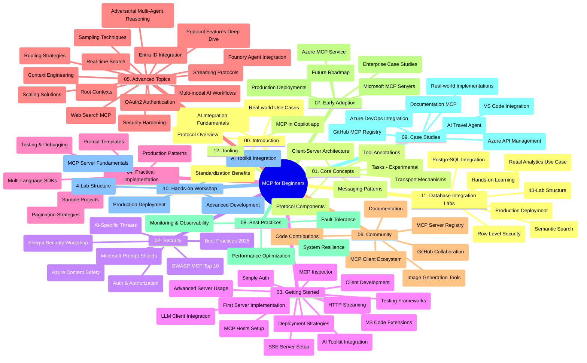

# নবাগতদের জন্য মডেল কন্টেক্সট প্রোটোকল (MCP) - স্টাডি গাইড

এই স্টাডি গাইডটি "নবাগতদের জন্য মডেল কন্টেক্সট প্রোটোকল (MCP)" পাঠ্যক্রমের জন্য রেপোজিটরি কাঠামো এবং বিষয়বস্তু সম্পর্কে একটি ওভারভিউ প্রদান করে। রেপোজিটরিটি দক্ষতার সাথে নেভিগেট করতে এবং উপলব্ধ সম্পদের সর্বোত্তম ব্যবহার করতে এই গাইডটি ব্যবহার করুন।

## রেপোজিটরি ওভারভিউ

মডেল কন্টেক্সট প্রোটোকল (MCP) হলো AI মডেল এবং ক্লায়েন্ট অ্যাপ্লিকেশনগুলির মধ্যে ইন্টারঅ্যাকশনের জন্য একটি স্ট্যান্ডার্ডাইজড কাঠামো। প্রথমে Anthropic দ্বারা তৈরি, MCP এখন অফিসিয়াল GitHub সংস্থার মাধ্যমে বৃহত্তর MCP কমিউনিটির দ্বারা রক্ষণাবেক্ষণ করা হয়। এই রেপোজিটরিটি C#, Java, JavaScript, Python, এবং TypeScript-এ হ্যান্ডস-অন কোড উদাহরণ সহ একটি ব্যাপক পাঠ্যক্রম প্রদান করে, যা AI ডেভেলপার, সিস্টেম আর্কিটেক্ট এবং সফটওয়্যার ইঞ্জিনিয়ারদের জন্য ডিজাইন করা হয়েছে।

## ভিজ্যুয়াল পাঠ্যক্রম মানচিত্র

## রেপোজিটরি কাঠামো

রেপোজিটরিটি বারোটি প্রধান অংশে সংগঠিত, প্রতিটির ফোকাস MCP-এর বিভিন্ন দিকগুলোর উপর:

1. **পরিচিতি (00-Introduction/)**
   - মডেল কন্টেক্সট প্রোটোকলের একটি ওভারভিউ
   - AI পাইপলাইনে স্ট্যান্ডার্ডাইজেশনের গুরুত্ব
   - ব্যবহারিক ব্যবহার কেস এবং সুবিধাসমূহ

2. **কোর ধারণা (01-CoreConcepts/)**
   - ক্লায়েন্ট-সার্ভার আর্কিটেকচার
   - প্রোটোকলের প্রধান উপাদানসমূহ
   - MCP এ মেসেজিং প্যাটার্নসমূহ
   - বর্তমান স্পেসিফিকেশন: [MCP তে কী পরিবর্তন হয়েছে: 2026-07-28 স্পেসিফিকেশন](./01-CoreConcepts/mcp-2026-07-28.md) — স্টেটলেস প্রোটোকল কোর, এক্সটেনশনস ফ্রেমওয়ার্ক, এবং রুটস/সাম্পলিং/লগিং এর নিষ্প্রভতা

3. **নিরাপত্তা (02-Security/)**
   - MCP ভিত্তিক সিস্টেমে নিরাপত্তা হুমকি
   - সুরক্ষিত বাস্তবায়নের সেরা অনুশীলনসমূহ
   - প্রমাণীকরণ এবং অনুমোদন কৌশলসমূহ
   - [CIMD এবং DCR অনুমোদন নমুনা](./02-Security/samples/cimd-dcr-auth/README.md) হ্যান্ডস-অন
   - **বিস্তৃত নিরাপত্তা ডকুমেন্টেশন**:
     - MCP নিরাপত্তার সেরা অনুশীলন
     - Azure কন্টেন্ট সেফটি বাস্তবায়ন গাইড
     - MCP নিরাপত্তা নিয়ন্ত্রণ এবং কৌশল
     - MCP সেরা অনুশীলন দ্রুত রেফারেন্স
   - **মুখ্য নিরাপত্তা বিষয়সমূহ**:
     - প্রম্পট ইনজেকশন এবং টুল বিষক্রিয়ার আক্রমণ
     - সেশন হাইজ্যাকিং এবং বিভ্রান্ত ডেপুটি সমস্যা
     - টোকেন পাসথ্রু দুর্বলতা
     - অতিরিক্ত অনুমতি এবং প্রবেশ সীমা নিয়ন্ত্রণ
     - AI উপাদানের জন্য সাপ্লাই চেইন নিরাপত্তা
     - Microsoft প্রম্পট শীল্ডস ইন্টিগ্রেশন

4. **শুরু করা (03-GettingStarted/)**
   - পরিবেশ সেটআপ এবং কনফিগারেশন
   - মৌলিক MCP সার্ভার এবং ক্লায়েন্ট তৈরি করা
   - বিদ্যমান অ্যাপ্লিকেশনের সাথে ইন্টিগ্রেশন
   - অন্তর্ভুক্ত বিভাগসমূহ:
     - প্রথম সার্ভার বাস্তবায়ন
     - ক্লায়েন্ট ডেভেলপমেন্ট
     - LLM ক্লায়েন্ট ইন্টিগ্রেশন
     - VS কোড ইন্টিগ্রেশন
     - সার্ভার-সেন্ট ইভেন্টস (SSE) সার্ভার
     - উন্নত সার্ভার ব্যবহারের কৌশল
     - HTTP স্ট্রিমিং
     - AI টুলকিট ইন্টিগ্রেশন
     - টেস্টিং কৌশল
     - ডিপ্লয়মেন্ট নির্দেশিকা

5. **প্রাকটিক্যাল বাস্তবায়ন (04-PracticalImplementation/)**
   - বিভিন্ন প্রোগ্রামিং ভাষায় SDK ব্যবহার
   - ডিবাগিং, টেস্টিং, এবং যাচাই করার কৌশলসমূহ
   - পুনর্ব্যবহারযোগ্য প্রম্পট টেমপ্লেট এবং ওয়ার্কফ্লো তৈরি
   - বাস্তবায়ন উদাহরণসহ নমুনা প্রকল্পসমূহ

6. **অ্যাডভান্সড বিষয়সমূহ (05-AdvancedTopics/)**
   - কন্টেক্সট ইঞ্জিনিয়ারিং কৌশল
   - ফাউন্ড্রি এজেন্ট ইন্টিগ্রেশন
   - মাল্টি-মোডাল AI ওয়ার্কফ্লো 
   - OAuth2 প্রমাণীকরণ ডেমোসমূহ
   - রিয়েল-টাইম সার্চ ক্ষমতা
   - রিয়েল-টাইম স্ট্রিমিং
   - রুট কন্টেক্সট বাস্তবায়ন
   - রাউটিং কৌশলসমূহ
   - সাম্পলিং কৌশল
   - স্কেলিং পদ্ধতি
   - নিরাপত্তা বিবেচনা
   - Entra ID নিরাপত্তা ইন্টিগ্রেশন
   - ওয়েব সার্চ ইন্টিগ্রেশন
   - প্রতিদ্বন্দ্বিত মাল্টি-এজেন্ট রিজনিং (বিতর্ক প্যাটার্ন)

7. **কমিউনিটি অবদানসমূহ (06-CommunityContributions/)**
   - কোড এবং ডকুমেন্টেশন কিভাবে অবদান রাখা যায়
   - GitHub এর মাধ্যমে সহযোগিতা
   - কমিউনিটি চালিত উন্নয়ন এবং প্রতিক্রিয়া
   - বিভিন্ন MCP ক্লায়েন্ট ব্যবহার (Claude Desktop, Cline, VSCode)
   - জনপ্রিয় MCP সার্ভারগুলোর সাথে কাজ করা, যার মধ্যে রয়েছে ইমেজ জেনারেশন

8. **প্রারম্ভিক গ্রহণ থেকে শেখা পাঠসমূহ (07-LessonsfromEarlyAdoption/)**
   - বাস্তব পৃথিবীর বাস্তবায়ন এবং সাফল্যের গল্প
   - MCP ভিত্তিক সমাধান তৈরি ও স্থাপন
   - প্রবণতা এবং ভবিষ্যতের রোডম্যাপ
   - **Microsoft MCP সার্ভার গাইড**: 10টি প্রোডাকশন-রেডি Microsoft MCP সার্ভার নিয়ে ব্যাপক গাইড যা অন্তর্ভুক্ত করে:
     - Microsoft Learn Docs MCP সার্ভার
     - Azure MCP সার্ভার (১৫+ বিশেষায়িত কানেক্টর)
     - GitHub MCP সার্ভার
     - Azure DevOps MCP সার্ভার
     - MarkItDown MCP সার্ভার
     - SQL সার্ভার MCP সার্ভার
     - Playwright MCP সার্ভার
     - Dev Box MCP সার্ভার
     - Microsoft Foundry MCP সার্ভার
     - Microsoft 365 Agents Toolkit MCP সার্ভার

9. **সেরা অনুশীলনসমূহ (08-BestPractices/)**
   - কর্মক্ষমতা টিউনিং এবং অপ্টিমাইজেশন
   - ত্রুটি-সহনশীল MCP সিস্টেম ডিজাইন
   - টেস্টিং এবং পুনর্জীবনের কৌশলসমূহ

10. **কেস স্টাডিসমূহ (09-CaseStudy/)**
    - MCP এর বহুমুখিতা প্রদর্শনকারী **সাতটি বিস্তৃত কেস স্টাডি**:
    - **Azure AI ট্রাভেল এজেন্টস**: Azure OpenAI এবং AI সার্চ দ্বারা মাল্টি-এজেন্ট অর্কেস্ট্রেশন
    - **Azure DevOps ইন্টিগ্রেশন**: YouTube ডেটা আপডেট সহ ওয়ার্কফ্লো প্রক্রিয়া স্বয়ংক্রিয়করণ
    - **রিয়েল-টাইম ডকুমেন্টেশন অনুসন্ধান**: স্ট্রিমিং HTTP সহ পাইথন কনসোল ক্লায়েন্ট
    - **ইন্টারঅ্যাকটিভ স্টাডি প্ল্যান জেনারেটর**: চেইনলিট ওয়েব অ্যাপ কথোপকথন AI সহ
    - **ইন-এডিটর ডকুমেন্টেশন**: VS কোড ইন্টিগ্রেশন GitHub Copilot ওয়ার্কফ্লো সহ
    - **Azure API ম্যানেজমেন্ট**: MCP সার্ভার তৈরি সহ এন্টারপ্রাইজ API ইন্টিগ্রেশন
    - **GitHub MCP রেজিস্ট্রি**: ইকোসিস্টেম উন্নয়ন এবং এজেন্টিক ইন্টিগ্রেশন প্ল্যাটফর্ম
    - এন্টারপ্রাইজ ইন্টিগ্রেশন, ডেভেলপার উৎপাদনশীলতা, এবং ইকোসিস্টেম উন্নয়নের বিস্তৃত বাস্তবায়ন উদাহরণ

11. **হ্যান্ডস-অন ওয়ার্কশপ (10-StreamliningAIWorkflowsBuildingAnMCPServerWithAIToolkit/)**
    - MCP এবং AI টুলকিট একত্র করে একটি বিস্তৃত হ্যান্ডস-অন ওয়ার্কশপ
    - AI মডেল এবং বাস্তব-জগতের সরঞ্জামগুলিকে সংযুক্ত করে বুদ্ধিমান অ্যাপ্লিকেশন নির্মাণ
    - মৌলিক বিষয়, কাস্টম সার্ভার ডেভেলপমেন্ট, এবং প্রোডাকশন ডিপ্লয়মেন্ট কৌশলসহ বাস্তবসম্মত মডিউলসমূহ
    - **ল্যাব কাঠামো**:
      - ল্যাব ১: MCP সার্ভার মৌলিক বিষয়
      - ল্যাব ২: উন্নত MCP সার্ভার ডেভেলপমেন্ট
      - ল্যাব ৩: AI টুলকিট ইন্টিগ্রেশন
      - ল্যাব ৪: প্রোডাকশন ডিপ্লয়মেন্ট এবং স্কেলিং
    - স্টেপ-বাই-স্টেপ নির্দেশনাসহ ল্যাবভিত্তিক শেখার পদ্ধতি

12. **MCP সার্ভার ডাটাবেস ইন্টিগ্রেশন ল্যাবসমূহ (11-MCPServerHandsOnLabs/)**
    - প্রোডাকশন-রেডি MCP সার্ভার নির্মাণের জন্য **১৩টি ল্যাবের বিস্তৃত শেখার পথ** PostgreSQL ইন্টিগ্রেশনের সাথে
    - **বাস্তব ব্যবসায়িক খুচরা বিশ্লেষণের বাস্তবায়ন** Zava Retail ব্যবহার কেস ব্যবহারে
    - **এন্টারপ্রাইজ-গ্রেড প্যাটার্ন** যেমন রো লেভেল সিকিউরিটি (RLS), সেম্যান্টিক সার্চ, এবং মাল্টি-টেন্যান্ট ডেটা অ্যাক্সেস
    - **সম্পূর্ণ ল্যাব কাঠামো**:
      - **ল্যাব ০০-০৩: ভিত্তি** - পরিচিতি, আর্কিটেকচার, নিরাপত্তা, পরিবেশ সেটআপ
      - **ল্যাব ০৪-০৬: MCP সার্ভার নির্মাণ** - ডাটাবেস ডিজাইন, MCP সার্ভার বাস্তবায়ন, টুল ডেভেলপমেন্ট

      - **ল্যাব ০৭-০৯: উন্নত বৈশিষ্ট্যসমূহ** - সেমেন্টিক অনুসন্ধান, পরীক্ষা ও ডিবাগিং, VS কোড ইন্টিগ্রেশন
      - **ল্যাব ১০-১২: প্রোডাকশন ও সেরা অনুশীলনসমূহ** - ডিপ্লয়মেন্ট, মনিটরিং, অপটিমাইজেশন
    - **কভারড প্রযুক্তিসমূহ**: FastMCP ফ্রেমওয়ার্ক, PostgreSQL, Azure OpenAI, Azure Container Apps, Application Insights
    - **শিক্ষার ফলাফল**: প্রোডাকশন-রেডি MCP সার্ভার, ডাটাবেজ ইন্টিগ্রেশন প্যাটার্ন, AI-চালিত বিশ্লেষণ, এন্টারপ্রাইজ সিকিউরিটি

১৩. **টুলিং (১২-tooling/)**
    - MCP-কে কোপাইলট অ্যাপ ও অন্যান্য টুলে কিভাবে ব্যবহার করবেন তা শিখুন

## অতিরিক্ত সম্পদসমূহ

রেপোজিটরিটিতে সহায়ক সম্পদসমূহ অন্তর্ভুক্ত আছে:

- **ইমেজ ফোল্ডার**: কারিকুলামের বিভিন্ন স্থানে ব্যবহৃত ডায়াগ্রাম ও চিত্রসমূহ অন্তর্ভুক্ত
- **অনুবাদসমূহ**: ডকুমেন্টেশনের স্বয়ংক্রিয় অনুবাদের মাধ্যমে বহু-ভাষা সহায়তা
- **সরকারি MCP সম্পদসমূহ**:
  - [MCP ডকুমেন্টেশন](https://modelcontextprotocol.io/)
  - [MCP স্পেসিফিকেশন](https://modelcontextprotocol.io/specification/2026-07-28/)
  - [MCP GitHub রেপোজিটরি](https://github.com/modelcontextprotocol)

## কীভাবে এই রেপোজিটরি ব্যবহার করবেন

১. **ক্রমিক শিক্ষণ**: একটি সুসংগঠিত শেখার অভিজ্ঞতার জন্য অধ্যায়গুলো (০০ থেকে ১১ পর্যন্ত) নেকছভাবে অনুসরন করুন।
২. **ভাষা-নির্দিষ্ট ফোকাস**: যদি আপনি একটি নির্দিষ্ট প্রোগ্রামিং ভাষায় আগ্রহী হন, তাহলে আপনার পছন্দের ভাষায় ইম্প্লিমেন্টেশনের জন্য স্যাম্পল ডিরেক্টরি অনুসন্ধান করুন।
৩. **ব্যবহারিক প্রয়োগ**: আপনার পরিবেশ সেটআপ করতে এবং প্রথম MCP সার্ভার ও ক্লায়েন্ট তৈরি করতে "Getting Started" অংশ থেকে শুরু করুন।
৪. **উন্নত অনুসন্ধান**: মূল বিষয়গুলির সাথে আরামদায়ক হলে, উন্নত বিষয়গুলোতে প্রবেশ করে আপনার জ্ঞান বাড়ান।
৫. **কমিউনিটি অংশগ্রহণ**: MCP কমিউনিটিতে GitHub আলোচনা ও Discord চ্যানেলের মাধ্যমে যোগ দিন এবং বিশেষজ্ঞ ও অন্যান্য ডেভেলপারদের সাথে সংযোগ স্থাপন করুন।

## MCP ক্লায়েন্ট ও টুলসমূহ

কারিকুলামে বিভিন্ন MCP ক্লায়েন্ট ও টুল কভার করা হয়েছে:

১. **সরকারি ক্লায়েন্টস**:
   - ভিজ্যুয়াল স্টুডিও কোড
   - Visual Studio Code-এ MCP
   - Claude ডেস্কটপ
   - VSCode-এ Claude
   - Claude API

২. **কমিউনিটি ক্লায়েন্টস**:
   - Cline (টার্মিনাল-ভিত্তিক)
   - Cursor (কোড এডিটর)
   - ChatMCP
   - Windsurf

৩. **MCP ব্যবস্থাপনা টুলসমূহ**:
   - MCP CLI
   - MCP ম্যানেজার
   - MCP লিঙ্কার
   - MCP রাউটার

## জনপ্রিয় MCP সার্ভারসমূহ

রেপোজিটরিটি বিভিন্ন MCP সার্ভার পরিচয় করিয়ে দেয়, যেমন:

১. **সরকারি মাইক্রোসফট MCP সার্ভারগুলি**:
   - Microsoft Learn Docs MCP সার্ভার
   - Azure MCP সার্ভার (১৫+ স্পেশালাইজড কানেক্টর)
   - GitHub MCP সার্ভার
   - Azure DevOps MCP সার্ভার
   - MarkItDown MCP সার্ভার
   - SQL সার্ভার MCP সার্ভার
   - Playwright MCP সার্ভার
   - Dev Box MCP সার্ভার
   - Microsoft Foundry MCP সার্ভার
   - Microsoft 365 এজেন্টস টুলকিট MCP সার্ভার

২. **সরকারি রেফারেন্স সার্ভারসমূহ**:
   - ফাইলসিস্টেম
   - Fetch
   - মেমোরি
   - ক্রমিক চিন্তা

৩. **ইমেজ জেনারেশন**:
   - Azure OpenAI DALL-E 3
   - Stable Diffusion WebUI
   - Replicate

৪. **ডেভেলপমেন্ট টুলস**:
   - Git MCP
   - টার্মিনাল নিয়ন্ত্রণ
   - কোড এ্যাসিস্ট্যান্ট

৫. **বিশেষায়িত সার্ভারসমূহ**:
   - Salesforce
   - Microsoft Teams
   - Jira ও Confluence

## অবদান রাখা

এই রেপোজিটরি কমিউনিটি থেকে অবদান আসতে স্বাগত জানায়। MCP পরিবেশে কার্যকর অবদান রাখার নির্দেশনার জন্য কমিউনিটি অবদান অংশ দেখুন।

----

*এই অধ্যয়ন গাইডটি সর্বশেষ ৯ সেপ্টেম্বর ২০২৬-এ আপডেট হয়েছে। এটি MCP
স্পেসিফিকেশন `2026-07-28`, বর্তমান প্রোটোকল সংস্করণ প্রতিফলিত করে। কিছু হ্যান্ডস-অন
উদাহরণ স্পষ্টভাবে `2025-11-25` সংস্করণ হিসেবে আছে যেহেতু তাদের SDK ও টুলসমূহ
স্টেটলেস প্রোটোকল API গ্রহণ করেছে।*

---

<!-- CO-OP TRANSLATOR DISCLAIMER START -->
**অস্বীকৃতি**:
এই নথিটি AI অনুবাদ পরিষেবা [Co-op Translator](https://github.com/Azure/co-op-translator) ব্যবহার করে অনূদিত হয়েছে। যদিও আমরা শুদ্ধতার জন্য চেষ্টা করি, অনুগ্রহ করে মনে রাখবেন যে স্বয়ংক্রিয় অনুবাদে ত্রুটি বা অসঙ্গতি থাকতে পারে। মূল নথিটি তার স্বভাষায় কর্তৃত্বপূর্ণ উৎস হিসেবে বিবেচিত হওয়া উচিত। গুরুত্বপূর্ণ তথ্যের জন্য পেশাদার মানব অনুবাদ সুপারিশ করা হয়। এই অনুবাদের ব্যবহারে প্রয়োজনীয় ভুল বোঝাবুঝি বা ভুল ব্যাখ্যার জন্য আমরা দায়বদ্ধ নই।
<!-- CO-OP TRANSLATOR DISCLAIMER END -->