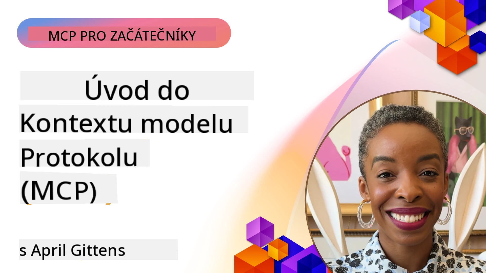
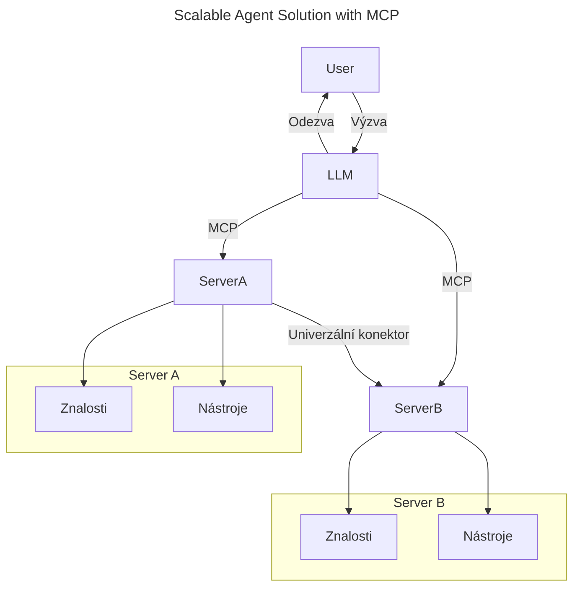
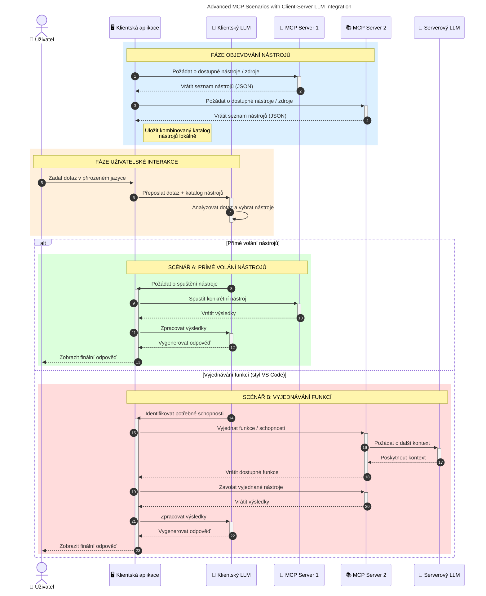

# Úvod do protokolu Model Context Protocol (MCP): Proč je důležitý pro škálovatelné AI aplikace

[](https://youtu.be/agBbdiOPLQA)

_(Klikněte na obrázek výše pro zobrazení videa této lekce)_

Generativní AI aplikace jsou skvělým krokem vpřed, protože často umožňují uživateli komunikovat s aplikací pomocí přirozených jazykových podnětů. Jakmile se však do těchto aplikací investuje více času a zdrojů, chcete zajistit, aby bylo snadné integrovat funkce a zdroje tak, aby šlo aplikaci rozšiřovat, aby aplikace podporovala více než jeden model, a aby zvládala různé modelové složitosti. Stručně řečeno, tvorba Gen AI aplikací je na začátku snadná, ale jak rostou a stávají se složitějšími, je nutné začít definovat architekturu a pravděpodobně se spolehnout na standard, který zajistí, že vaše aplikace budou stavěny konzistentním způsobem. Zde přichází MCP, aby věci organizoval a poskytl standard.

---

## **🔍 Co je Model Context Protocol (MCP)?**

**Model Context Protocol (MCP)** je **otevřené, standardizované rozhraní**, které umožňuje velkým jazykovým modelům (LLM) bezproblémově komunikovat s externími nástroji, API a datovými zdroji. Poskytuje konzistentní architekturu pro rozšíření funkčnosti AI modelů nad rámec jejich tréninkových dat, čímž umožňuje inteligentnější, škálovatelnější a citlivější AI systémy.

---

## **🎯 Proč je standardizace v AI důležitá**

Jak se generativní AI aplikace stávají složitějšími, je zásadní přijmout standardy, které zajistí **škálovatelnost, rozšiřitelnost, udržovatelnost** a **vyhnutí se závislosti na jednom dodavateli**. MCP tyto potřeby řeší tím, že:

- sjednocuje integrace modelů a nástrojů
- redukuje křehká, jednorázová vlastní řešení
- umožňuje koexistenci více modelů od různých dodavatelů v jednom ekosystému

**Poznámka:** I když se MCP prezentuje jako otevřený standard, nejsou plánovány žádné kroky k jeho standardizaci prostřednictvím existujících standardizačních orgánů jako IEEE, IETF, W3C, ISO nebo jiných.

---

## **📚 Výukové cíle**

Na konci tohoto článku budete schopni:

- Definovat **Model Context Protocol (MCP)** a jeho případy použití
- Pochopit, jak MCP standardizuje komunikaci mezi modelem a nástrojem
- Identifikovat základní součásti architektury MCP
- Prozkoumat reálné aplikace MCP v podnikovém i vývojářském kontextu

---

## **💡 Proč je Model Context Protocol (MCP) průlomový**

### **🔗 MCP řeší fragmentaci v AI interakcích**

Před MCP vyžadovala integrace modelů s nástroji:

- vlastní kód pro každou kombinaci model-nástroj
- nestandardizované API pro každého dodavatele
- častá přerušení kvůli aktualizacím
- špatnou škálovatelnost s rostoucím počtem nástrojů

### **✅ Výhody standardizace MCP**

| **Výhoda**                | **Popis**                                                                      |
|--------------------------|--------------------------------------------------------------------------------|
| Interoperabilita         | LLM hladce spolupracují s nástroji různých dodavatelů                         |
| Konzistence              | Jednotné chování napříč platformami a nástroji                                |
| Znovupoužitelnost        | Nástroje vyvinuté jednou lze využít v různých projektech a systémech         |
| Rychlejší vývoj          | Snížení doby vývoje díky využití standardizovaných, plug-and-play rozhraní    |

---

## **🧱 Přehled architektury MCP na vysoké úrovni**

MCP sleduje **model klient-server**, kde:

- **MCP hostitelé** provozují AI modely
- **MCP klienti** iniciují požadavky
- **MCP servery** poskytují kontext, nástroje a schopnosti

### **Klíčové komponenty:**

- **Zdroje** – statická nebo dynamická data pro modely  
- **Podněty** – předdefinované pracovní postupy pro řízenou generaci  
- **Nástroje** – spustitelné funkce jako vyhledávání, výpočty  
- **Vzorkování** – agentní chování přes rekurzivní interakce (zastaralé v
    MCP `2026-07-28`; nové implementace by se měly přímo integrovat s poskytovatelem LLM)

- **Elicitační mechanismus** – požadavky na vstup od uživatele iniciované serverem
- **Rooty** – informační umístění v souborovém systému relevantní pro server
    (zastaralé v MCP `2026-07-28`; preferujte parametry nástrojů, URI zdrojů nebo
    konfiguraci serveru)

### **Architektura protokolu:**

MCP používá dvouvrstvou architekturu:
- **Datová vrstva**: JSON-RPC 2.0 zprávy, metadata k požadavku, objevování a
    protokolové primitivy
- **Transportní vrstva**: stdio pro lokální podsystémy a Streamable HTTP pro
    vzdálené servery. Streamable HTTP může používat SSE rámce pro streamované odpovědi,
    ale starší HTTP+SSE transport je zastaralý.

---

## Jak fungují MCP servery

MCP servery fungují následovně:

- **Průběh požadavku:**
    1. Požadavek je iniciován koncovým uživatelem nebo softwarem jednajícím jeho jménem.
    2. **MCP klient** odešle požadavek na **MCP hostitele**, který spravuje runtime AI modelu.
    3. **AI model** přijme uživatelský podnět a může požádat o přístup k externím nástrojům nebo datům prostřednictvím jednoho či více volání nástrojů.
    4. **MCP hostitel**, nikoli přímo model, komunikuje se správnými **MCP servery** pomocí standardizovaného protokolu.
- **Funkce MCP hostitele:**
    - **Registr nástrojů**: Udržuje katalog dostupných nástrojů a jejich schopností.
    - **Autentifikace**: Ověřuje oprávnění pro přístup k nástrojům.
    - **Správce požadavků**: Zpracovává příchozí požadavky na nástroje od modelu.
    - **Formátovač odpovědí**: Strukturizuje výstupy nástrojů do podoby, kterou model rozumí.
- **Provoz MCP serveru:**
    - **MCP hostitel** směruje volání nástrojů na jeden či více **MCP serverů**, z nichž každý poskytuje specializované funkce (např. vyhledávání, výpočty, dotazy do databáze).
    - **MCP servery** vykonají své operace a vrací výsledky zpátky **MCP hostiteli** v jednotném formátu.
    - **MCP hostitel** formátuje a předává tyto výsledky AI modelu.
- **Dokončení odpovědi:**
    - **AI model** zahrnuje výstupy nástrojů do finální odpovědi.
    - **MCP hostitel** odešle tuto odpověď zpět **MCP klientovi**, který ji dodá koncovému uživateli nebo volajícímu softwaru.
    

```mermaid
---
title: MCP Architecture and Component Interactions
description: A diagram showing the flows of the components in MCP.
---
graph TD
    Client[MCP klient/aplikace] -->|Odesílá požadavek| H[MCP hostitel]
    H -->|Volá| A[AI model]
    A -->|Požadavek na volání nástroje| H
    H -->|MCP Protocol| T1[MCP Server Tool 01: Webové vyhledávání
    H -->|MCP Protocol| T2[MCP Server Tool 02: Kalkulační nástroj
    H -->|MCP Protocol| T3[MCP Server Tool 03: Nástroj přístupu k databázi
    H -->|MCP Protocol| T4[MCP Server Tool 04: Nástroj souborového systému
    H -->|Odesílá odpověď| Client

    subgraph "Složky MCP Hostitele"
        H
        G[Registr nástrojů]
        I[Autentizace]
        J[Zpracovatel požadavků]
        K[Formátovač odpovědí]
    end

    H <--> G
    H <--> I
    H <--> J
    H <--> K

    style A fill:#f9d5e5,stroke:#333,stroke-width:2px
    style H fill:#eeeeee,stroke:#333,stroke-width:2px
    style Client fill:#d5e8f9,stroke:#333,stroke-width:2px
    style G fill:#fffbe6,stroke:#333,stroke-width:1px
    style I fill:#fffbe6,stroke:#333,stroke-width:1px
    style J fill:#fffbe6,stroke:#333,stroke-width:1px
    style K fill:#fffbe6,stroke:#333,stroke-width:1px
    style T1 fill:#c2f0c2,stroke:#333,stroke-width:1px
    style T2 fill:#c2f0c2,stroke:#333,stroke-width:1px
    style T3 fill:#c2f0c2,stroke:#333,stroke-width:1px
    style T4 fill:#c2f0c2,stroke:#333,stroke-width:1px
```

## 👨‍💻 Jak postavit MCP server (s příklady)

MCP servery umožňují rozšířit schopnosti LLM poskytováním dat a funkcionality. 

Připraveno to vyzkoušet? Zde jsou jazykově a/nebo stackově specifické SDK s příklady vytvoření jednoduchých MCP serverů v různých jazycích/stackech:

- **Python SDK**: https://github.com/modelcontextprotocol/python-sdk

- **TypeScript SDK**: https://github.com/modelcontextprotocol/typescript-sdk

- **Java SDK**: https://github.com/modelcontextprotocol/java-sdk

- **C#/.NET SDK**: https://github.com/modelcontextprotocol/csharp-sdk


## 🌍 Reálné případy použití MCP

MCP umožňuje širokou škálu aplikací rozšiřujících AI schopnosti:

| **Aplikace**                  | **Popis**                                                                    |
|------------------------------|------------------------------------------------------------------------------|
| Podniková integrace dat       | Připojení LLM k databázím, CRM nebo interním nástrojům                       |
| Agentní AI systémy            | Umožnění autonomních agentů s přístupem k nástrojům a pracovními postupy rozhodování |
| Multimodální aplikace         | Kombinace textových, obrazových a zvukových nástrojů v jediné sjednocené AI aplikaci |
| Integrace dat v reálném čase  | Přinášení živých dat do AI interakcí pro přesnější, aktuální výstupy          |


### 🧠 MCP = univerzální standard pro AI interakce

Model Context Protocol (MCP) funguje jako univerzální standard pro AI interakce, podobně jako USB-C standardizoval fyzická připojení zařízení. Ve světě AI MCP poskytuje konzistentní rozhraní, které umožňuje modelům (klientům) bezproblémově se integrovat s externími nástroji a poskytovateli dat (servery). Tím je eliminována potřeba různých, na míru šitých protokolů pro každé API nebo datový zdroj.

V rámci MCP nástroj kompatibilní s MCP (označovaný jako MCP server) dodržuje jednotný standard. Tyto servery mohou uvádět nástroje nebo akce, které nabízejí, a vykonávat je na požádání AI agentem. Platformy AI agentů podporující MCP jsou schopny objevovat dostupné nástroje ze serverů a vyvolávat je prostřednictvím tohoto standardizovaného protokolu.

### 💡 Usnadňuje přístup k znalostem

Kromě nabízení nástrojů MCP také usnadňuje přístup ke znalostem. Umožňuje aplikacím poskytovat kontext velkým jazykovým modelům (LLM) tím, že je propojuje s různými datovými zdroji. Například MCP server může reprezentovat dokumentové úložiště společnosti, což umožňuje agentům na vyžádání získávat relevantní informace. Jiný server může vykonávat specifické akce jako odesílání e-mailů nebo aktualizaci záznamů. Z pohledu agenta jsou to jednoduše nástroje – některé vrací data (znalostní kontext), jiné provádějí akce. MCP obě tyto funkce efektivně spravuje.

Agent připojující se k MCP serveru se automaticky naučí dostupné schopnosti a přístupná data serveru prostřednictvím standardního formátu. Tato standardizace umožňuje dynamickou dostupnost nástrojů. Například přidání nového MCP serveru do systému agenta okamžitě zpřístupní jeho funkce bez potřeby dalšího přizpůsobování instrukcí agenta.

Tato zjednodušená integrace odpovídá toku znázorněnému na následujícím diagramu, kde servery poskytují jak nástroje, tak znalosti, což zajišťuje bezproblémovou spolupráci systémů.

### 👉 Příklad: škálovatelné agentní řešení


Univerzální konektor umožňuje MCP serverům komunikovat a sdílet mezi sebou schopnosti, což dovoluje serveru A delegovat úkoly na server B nebo přistupovat k jeho nástrojům a znalostem. To federuje nástroje a data napříč servery a podporuje škálovatelné a modulární agentní architektury. Díky standardizaci vystavení nástrojů může agent dynamicky objevovat a směrovat požadavky mezi servery bez pevně zakódovaných integrací.


Federace nástrojů a znalostí: Nástroje a data jsou dostupné přes servery, což umožňuje škálovatelnější a modulárnější agentní architektury.

### 🔄 Pokročilé scénáře MCP s integrací LLM na straně klienta

Kromě základní architektury MCP existují pokročilé scénáře, kde jak klient, tak server obsahují LLM, což umožňuje sofistikovanější interakce. Na následujícím diagramu může být **klientská aplikace** IDE s řadou dostupných MCP nástrojů pro použití LLM:



## 🔐 Praktické výhody MCP

Zde jsou praktické výhody používání MCP:

- **Aktuálnost**: Modely mají přístup k aktuálním informacím nad rámec svých tréninkových dat
- **Rozšíření schopností**: Modely mohou využívat specializované nástroje pro úkoly, na které nebyly trénovány
- **Snížení halucinací**: Externí datové zdroje poskytují faktické základy
- **Soukromí**: Citlivá data mohou zůstat v zabezpečeném prostředí místo vkládání do podnětů

## 📌 Klíčová shrnutí

Následující jsou klíčová shrnutí použití MCP:

- **MCP** standardizuje způsob interakce AI modelů s nástroji a daty
- Podporuje **rozšiřitelnost, konzistenci a interoperabilitu**
- MCP pomáhá **zkrátit dobu vývoje, zlepšit spolehlivost a rozšířit schopnosti modelu**
- Klient-server architektura **umožňuje flexibilní, rozšiřitelné AI aplikace**

## 🧠 Cvičení

Zamyslete se nad AI aplikací, kterou byste chtěli vytvořit.

- Které **externí nástroje nebo data** by mohly rozšířit její schopnosti?
- Jak by MCP mohl usnadnit integraci **jednodušeji a spolehlivěji?**

## Další zdroje

- [MCP GitHub Repository](https://github.com/modelcontextprotocol)


## Co bude dál

Dále: [Kapitola 1: Základní koncepty](../01-CoreConcepts/README.md)

---

<!-- CO-OP TRANSLATOR DISCLAIMER START -->
**Prohlášení o omezení odpovědnosti**:
Tento dokument byl přeložen pomocí AI překladatelské služby [Co-op Translator](https://github.com/Azure/co-op-translator). Přestože usilujeme o co největší přesnost, mějte prosím na paměti, že automatizované překlady mohou obsahovat chyby nebo nepřesnosti. Originální dokument v jeho mateřském jazyce by měl být považován za autoritativní zdroj. Pro kritické informace se doporučuje profesionální lidský překlad. Nejsme odpovědní za jakékoli nedorozumění nebo nesprávné interpretace vzniklé použitím tohoto překladu.
<!-- CO-OP TRANSLATOR DISCLAIMER END -->