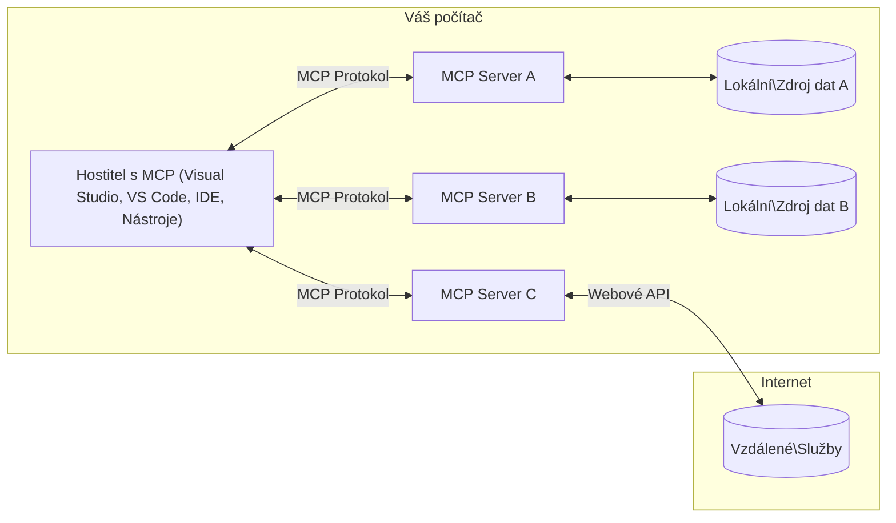

# MCP Základní koncepty: Ovládnutí Model Context Protocol pro integraci AI

[](https://youtu.be/earDzWGtE84)

_(Klikněte na obrázek výše pro zobrazení videa této lekce)_

[Model Context Protocol (MCP)](https://github.com/modelcontextprotocol) je výkonný, standardizovaný rámec, který optimalizuje komunikaci mezi velkými jazykovými modely (LLM) a externími nástroji, aplikacemi a zdroji dat.  
Tento průvodce vás provede základními koncepty MCP. Naučíte se o jeho klient-server architektuře, základních komponentách, mechanismech komunikace a osvědčených postupech implementace.

- **Explicitní souhlas uživatele**: Veškerý přístup k datům a operace vyžadují explicitní schválení uživatele před provedením. Uživatelé musí jasně rozumět, jaká data budou přístupná a jaké akce budou provedeny, s podrobnou kontrolou oprávnění a autorizací.

- **Ochrana soukromí dat**: Uživatelská data jsou zpřístupněna pouze s explicitním souhlasem a musí být chráněna robustními přístupovými kontrolami po celou dobu interakce. Implementace musí zabránit neoprávněnému přenosu dat a udržovat přísné hranice soukromí.

- **Bezpečnost spouštění nástrojů**: Každé vyvolání nástroje vyžaduje explicitní souhlas uživatele s jasným pochopením funkčnosti nástroje, parametrů a možného dopadu. Robustní bezpečnostní hranice musí zabránit nechtěnému, nebezpečnému nebo škodlivému spuštění nástrojů.

- **Bezpečnost transportní vrstvy**: Veškeré komunikační kanály by měly používat vhodné šifrování a autentizační mechanismy. Vzdálená připojení by měla implementovat bezpečné transportní protokoly a správu přihlašovacích údajů.

#### Pokyny k implementaci:

- **Správa oprávnění**: Implementujte jemnozrnné systémy oprávnění, které umožní uživatelům kontrolovat, ke kterým serverům, nástrojům a zdrojům mají přístup  
- **Autentizace a autorizace**: Používejte bezpečné metody autentizace (OAuth, API klíče) s řádnou správou tokenů a expirací  
- **Validace vstupů**: Validujte všechny parametry a vstupy dat podle definovaných schémat, aby se zabránilo injekčním útokům  
- **Auditní protokolování**: Udržujte komplexní záznamy všech operací pro bezpečnostní monitoring a dodržování předpisů

## Přehled

Tato lekce zkoumá základní architekturu a komponenty, které tvoří ekosystém Model Context Protocol (MCP). Naučíte se o klient-server architektuře, klíčových komponentách a komunikačních mechanismech, které umožňují interakce MCP.

## Klíčové vzdělávací cíle

Na konci této lekce budete:

- Rozumět klient-server architektuře MCP.  
- Identifikovat role a odpovědnosti Hostitelů, Klientů a Serverů.  
- Analyzovat hlavní vlastnosti, které činí MCP flexibilní integrační vrstvou.  
- Naučit se, jak informace proudí v ekosystému MCP.  
- Získat praktické poznatky prostřednictvím ukázek kódu v .NET, Java, Python a JavaScript.

## Architektura MCP: Podrobnější pohled

Ekosystém MCP je postaven na modelu klient-server. Tato modulární struktura umožňuje AI aplikacím efektivně komunikovat s nástroji, databázemi, API a kontextovými zdroji. Pojďme si rozebrat tuto architekturu na její základní komponenty.

V jádru MCP následuje klient-server architekturu, kde hostitelská aplikace může připojit k více serverům:


- **MCP Hostitelé**: Programy jako VSCode, Claude Desktop, IDE nebo AI nástroje, které chtějí přistupovat k datům přes MCP  
- **MCP Klienti**: Protokoloví klienti, kteří udržují 1:1 spojení se servery  
- **MCP Servery**: Lehká programy, které každé vystavují specifické schopnosti prostřednictvím standardizovaného Model Context Protocol  
- **Lokální zdroje dat**: Soubory, databáze a služby vašeho počítače, ke kterým MCP servery mohou bezpečně přistupovat  
- **Vzdálené služby**: Externí systémy dostupné přes internet, ke kterým se MCP servery mohou připojit přes API.

Protokol MCP je vyvíjející se standard používající verzování založené na datu (formát RRRR-MM-DD). Aktuální verze protokolu je **2025-11-25**. Nejnovější aktualizace najdete v [specifikaci protokolu](https://modelcontextprotocol.io/specification/2025-11-25/)

### 1. Hostitelé

V Model Context Protocol (MCP) jsou **Hostitelé** AI aplikace, které slouží jako primární rozhraní, přes které uživatelé komunikují s protokolem. Hostitelé koordinují a spravují připojení k více MCP serverům tím, že vytvářejí dedikované MCP klienty pro každé serverové připojení. Příklady hostitelů zahrnují:

- **AI aplikace**: Claude Desktop, Visual Studio Code, Claude Code  
- **Vývojová prostředí**: IDE a editory kódu s integrací MCP  
- **Vlastní aplikace**: Účelově vytvoření AI agenti a nástroje

**Hostitelé** jsou aplikace, které koordinují interakce s AI modely. Oni:

- **Orchestrace AI modelů**: Spouští nebo komunikují s LLM pro generování odpovědí a koordinaci AI workflow  
- **Správa klientských připojení**: Vytváří a udržují jednoho MCP klienta na každé serverové připojení  
- **Řízení uživatelského rozhraní**: Řídí tok konverzace, uživatelské interakce a prezentaci odpovědí  
- **Prosazování bezpečnosti**: Řídí oprávnění, bezpečnostní omezení a autentizaci  
- **Správa uživatelského souhlasu**: Řídí schválení uživatele pro sdílení dat a spouštění nástrojů

### 2. Klienti

**Klienti** jsou základní komponenty, které udržují dedikovaná jedno-na-jedno spojení mezi Hostiteli a MCP servery. Každý MCP klient je vytvořen hostitelem pro připojení ke konkrétnímu MCP serveru, což zajišťuje organizované a bezpečné komunikační kanály. Více klientů umožňuje hostitelům připojit se k více serverům současně.

**Klienti** jsou konektorové komponenty v rámci hostitelské aplikace. Oni:

- **Protokolová komunikace**: Posílají JSON-RPC 2.0 požadavky serverům s výzvami a instrukcemi  
- **Vyjednávání schopností**: Vyjednávají podporované funkce a verze protokolu se servery během inicializace  
- **Spouštění nástrojů**: Spravují požadavky na spuštění nástrojů od modelů a zpracovávají odpovědi  
- **Aktualizace v reálném čase**: Zpracovávají notifikace a aktualizace ze serverů v reálném čase  
- **Zpracování odpovědí**: Zpracovávají a formátují odpovědi serverů pro zobrazení uživatelům

### 3. Servery

**Servery** jsou programy, které poskytují kontext, nástroje a schopnosti MCP klientům. Mohou běžet lokálně (na stejném stroji jako Hostitel) nebo vzdáleně (na externích platformách) a jsou zodpovědné za zpracování požadavků klientů a poskytování strukturovaných odpovědí. Servery vystavují specifickou funkcionalitu prostřednictvím standardizovaného Model Context Protocol.

**Servery** jsou služby, které poskytují kontext a schopnosti. Oni:

- **Registrace funkcí**: Registrují a vystavují dostupné primitivy (zdroje, výzvy, nástroje) klientům  
- **Zpracování požadavků**: Přijímají a vykonávají volání nástrojů, požadavky na zdroje a výzvy od klientů  
- **Poskytování kontextu**: Poskytují kontextové informace a data pro zlepšení odpovědí modelu  
- **Správa stavu**: Udržují stav relace a zpracovávají stavové interakce, pokud je potřeba  
- **Notifikace v reálném čase**: Posílají notifikace o změnách schopností a aktualizacích připojeným klientům

Servery může vyvíjet kdokoliv pro rozšíření schopností modelu specializovanou funkcionalitou a podporují jak lokální, tak vzdálené nasazení.

### 4. Serverové primitivy

Servery v Model Context Protocol (MCP) poskytují tři základní **primitivy**, které definují základní stavební kameny pro bohaté interakce mezi klienty, hostiteli a jazykovými modely. Tyto primitivy specifikují typy kontextových informací a akcí dostupných prostřednictvím protokolu.

MCP servery mohou vystavovat libovolnou kombinaci následujících tří základních primitiv:

#### Zdroje

**Zdroje** jsou datové zdroje, které poskytují kontextové informace AI aplikacím. Reprezentují statický nebo dynamický obsah, který může zlepšit porozumění modelu a rozhodování:

- **Kontextová data**: Strukturované informace a kontext pro spotřebu AI modelem  
- **Znalostní báze**: Repozitáře dokumentů, články, manuály a výzkumné práce  
- **Lokální zdroje dat**: Soubory, databáze a informace o lokálním systému  
- **Externí data**: Odpovědi API, webové služby a data vzdálených systémů  
- **Dynamický obsah**: Data v reálném čase, která se aktualizují podle vnějších podmínek

Zdroje jsou identifikovány URI a podporují vyhledávání přes metody `resources/list` a načítání přes `resources/read`:

```text
file://documents/project-spec.md
database://production/users/schema
api://weather/current
```

#### Výzvy

**Výzvy** jsou znovupoužitelné šablony, které pomáhají strukturovat interakce s jazykovými modely. Poskytují standardizované vzory interakcí a šablonované workflow:

- **Interakce založené na šablonách**: Předstrukturované zprávy a začátky konverzace  
- **Šablony workflow**: Standardizované sekvence pro běžné úkoly a interakce  
- **Few-shot příklady**: Šablony založené na příkladech pro instrukce modelu  
- **Systémové výzvy**: Základní výzvy, které definují chování a kontext modelu  
- **Dynamické šablony**: Parametrizované výzvy, které se přizpůsobují specifickým kontextům

Výzvy podporují nahrazování proměnných a lze je vyhledat přes `prompts/list` a načíst přes `prompts/get`:

```markdown
Generate a {{task_type}} for {{product}} targeting {{audience}} with the following requirements: {{requirements}}
```

#### Nástroje

**Nástroje** jsou spustitelné funkce, které mohou AI modely vyvolat k provedení specifických akcí. Reprezentují „slovesa“ ekosystému MCP, umožňující modelům interagovat s externími systémy:

- **Spustitelné funkce**: Diskrétní operace, které modely mohou vyvolat s konkrétními parametry  
- **Integrace externích systémů**: Volání API, dotazy do databází, operace se soubory, výpočty  
- **Unikátní identita**: Každý nástroj má jedinečný název, popis a schéma parametrů  
- **Strukturovaný vstup/výstup**: Nástroje přijímají validované parametry a vrací strukturované, typované odpovědi  
- **Akční schopnosti**: Umožňují modelům provádět reálné akce a získávat živá data

Nástroje jsou definovány pomocí JSON Schema pro validaci parametrů a lze je vyhledat přes `tools/list` a spustit přes `tools/call`:

```typescript
server.tool(
  "search_products", 
  {
    query: z.string().describe("Search query for products"),
    category: z.string().optional().describe("Product category filter"),
    max_results: z.number().default(10).describe("Maximum results to return")
  }, 
  async (params) => {
    // Proveďte vyhledávání a vraťte strukturované výsledky
    return await productService.search(params);
  }
);
```

## Klientské primitivy

V Model Context Protocol (MCP) mohou **klienti** vystavovat primitivy, které umožňují serverům požadovat další schopnosti od hostitelské aplikace. Tyto klientské primitivy umožňují bohatší, interaktivnější implementace serverů, které mohou přistupovat k schopnostem AI modelu a uživatelským interakcím.

### Sampling

**Sampling** umožňuje serverům požadovat dokončení jazykového modelu z AI aplikace klienta. Tento primitiv umožňuje serverům přístup k schopnostem LLM bez nutnosti vkládat vlastní závislosti na modelech:

- **Modelově nezávislý přístup**: Servery mohou požadovat dokončení bez zahrnutí SDK LLM nebo správy přístupu k modelu  
- **Serverem iniciovaná AI**: Umožňuje serverům autonomně generovat obsah pomocí AI modelu klienta  
- **Rekurzivní interakce s LLM**: Podporuje složité scénáře, kde servery potřebují AI asistenci pro zpracování  
- **Dynamická generace obsahu**: Umožňuje serverům vytvářet kontextové odpovědi pomocí modelu hostitele

Sampling je iniciován metodou `sampling/complete`, kde servery posílají požadavky na dokončení klientům.

### Elicitation

**Elicitation** umožňuje serverům požadovat další informace nebo potvrzení od uživatelů prostřednictvím klientského rozhraní:

- **Požadavky na uživatelský vstup**: Servery mohou žádat o další informace, pokud jsou potřeba pro spuštění nástroje  
- **Potvrzovací dialogy**: Žádost o schválení uživatele pro citlivé nebo významné operace  
- **Interaktivní workflow**: Umožňuje serverům vytvářet krok za krokem uživatelské interakce  
- **Dynamický sběr parametrů**: Shromažďování chybějících nebo volitelných parametrů během spuštění nástroje

Požadavky na elicitation jsou prováděny pomocí metody `elicitation/request` pro sběr uživatelského vstupu přes rozhraní klienta.

### Logging

**Logging** umožňuje serverům posílat strukturované logovací zprávy klientům pro ladění, monitorování a provozní přehled:

- **Podpora ladění**: Umožňuje serverům poskytovat detailní záznamy provádění pro řešení problémů  
- **Provozní monitoring**: Posílání stavových aktualizací a metrik výkonu klientům  
- **Hlásení chyb**: Poskytování detailního kontextu chyb a diagnostických informací  
- **Auditní stopy**: Vytváření komplexních záznamů operací a rozhodnutí serveru

Logovací zprávy jsou posílány klientům pro zajištění transparentnosti operací serveru a usnadnění ladění.

## Tok informací v MCP

Model Context Protocol (MCP) definuje strukturovaný tok informací mezi hostiteli, klienty, servery a modely. Pochopení tohoto toku pomáhá objasnit, jak jsou zpracovávány uživatelské požadavky a jak jsou externí nástroje a data integrovány do odpovědí modelu.

- **Hostitel zahajuje připojení**  
  Hostitelská aplikace (například IDE nebo chatovací rozhraní) naváže připojení k MCP serveru, obvykle přes STDIO, WebSocket nebo jiný podporovaný transport.

- **Vyjednávání schopností**  
  Klient (vložený v hostiteli) a server si vymění informace o podporovaných funkcích, nástrojích, zdrojích a verzích protokolu. To zajistí, že obě strany rozumí, jaké schopnosti jsou pro relaci dostupné.

- **Uživatelský požadavek**  
  Uživatel komunikuje s hostitelem (např. zadá výzvu nebo příkaz). Hostitel tento vstup shromáždí a předá klientovi ke zpracování.

- **Použití zdroje nebo nástroje**  
  - Klient může požádat server o další kontext nebo zdroje (například soubory, záznamy v databázi nebo články ze znalostní báze) pro obohacení porozumění modelu.  
  - Pokud model určí, že je potřeba nástroj (např. pro získání dat, provedení výpočtu nebo volání API), klient pošle serveru požadavek na vyvolání nástroje s uvedením názvu nástroje a parametrů.

- **Spuštění na serveru**  
  Server přijme požadavek na zdroj nebo nástroj, provede potřebné operace (například spuštění funkce, dotaz do databáze nebo načtení souboru) a vrátí výsledky klientovi ve strukturovaném formátu.

- **Generování odpovědi**  
  Klient integruje odpovědi serveru (data ze zdrojů, výstupy nástrojů atd.) do probíhající interakce s modelem. Model použije tyto informace k vytvoření komplexní a kontextově relevantní odpovědi.

- **Prezentace výsledku**  
  Hostitel obdrží finální výstup od klienta a zobrazí jej uživateli, často včetně jak textu generovaného modelem, tak výsledků ze spuštění nástrojů nebo vyhledávání zdrojů.

Tento tok umožňuje MCP podporovat pokročilé, interaktivní a kontextově uvědomělé AI aplikace tím, že bezproblémově propojuje modely s externími nástroji a zdroji dat.

## Architektura protokolu a vrstvy

MCP se skládá ze dvou odlišných architektonických vrstev, které spolupracují na poskytnutí kompletního komunikačního rámce:

### Vrstva dat

**Vrstva dat** implementuje jádro protokolu MCP pomocí **JSON-RPC 2.0** jako základu. Tato vrstva definuje strukturu zpráv, sémantiku a vzory interakcí:

#### Základní komponenty:

- **Protokol JSON-RPC 2.0**: Veškerá komunikace používá standardizovaný formát zpráv JSON-RPC 2.0 pro volání metod, odpovědi a notifikace
- **Správa životního cyklu**: Řídí inicializaci připojení, vyjednávání schopností a ukončení relace mezi klienty a servery  
- **Serverové primitivy**: Umožňují serverům poskytovat základní funkce prostřednictvím nástrojů, zdrojů a výzev  
- **Klientské primitivy**: Umožňují serverům požadovat vzorkování z LLM, vyžadovat vstup uživatele a odesílat logovací zprávy  
- **Notifikace v reálném čase**: Podporuje asynchronní notifikace pro dynamické aktualizace bez potřeby dotazování  

#### Klíčové vlastnosti:

- **Vyjednávání verze protokolu**: Používá verzování založené na datu (RRRR-MM-DD) pro zajištění kompatibility  
- **Objevování schopností**: Klienti a servery si během inicializace vyměňují informace o podporovaných funkcích  
- **Stavové relace**: Udržuje stav připojení napříč více interakcemi pro kontinuitu kontextu  

### Transportní vrstva

**Transportní vrstva** spravuje komunikační kanály, rámcování zpráv a autentizaci mezi účastníky MCP:

#### Podporované transportní mechanismy:

1. **STDIO transport**:  
   - Používá standardní vstupní/výstupní proudy pro přímou komunikaci procesů  
   - Optimální pro lokální procesy na stejném stroji bez síťové režie  
   - Běžně používaný pro lokální implementace MCP serverů  

2. **Streamovatelný HTTP transport**:  
   - Používá HTTP POST pro zprávy klient → server  
   - Volitelné Server-Sent Events (SSE) pro streamování server → klient  
   - Umožňuje vzdálenou komunikaci se servery přes sítě  
   - Podporuje standardní HTTP autentizaci (bearer tokeny, API klíče, vlastní hlavičky)  
   - MCP doporučuje OAuth pro bezpečnou autentizaci založenou na tokenech  

#### Abstrakce transportu:

Transportní vrstva abstrahuje detaily komunikace od datové vrstvy, což umožňuje stejný formát zpráv JSON-RPC 2.0 napříč všemi transportními mechanismy. Tato abstrakce umožňuje aplikacím plynule přepínat mezi lokálními a vzdálenými servery.

### Bezpečnostní aspekty

Implementace MCP musí dodržovat několik klíčových bezpečnostních principů, aby zajistily bezpečné, důvěryhodné a zabezpečené interakce ve všech operacích protokolu:

- **Souhlas a kontrola uživatele**: Uživatelé musí poskytnout explicitní souhlas před přístupem k datům nebo provedením operací. Měli by mít jasnou kontrolu nad tím, jaká data jsou sdílena a jaké akce jsou autorizovány, podpořeno intuitivními uživatelskými rozhraními pro přezkoumání a schválení aktivit.

- **Ochrana soukromí dat**: Uživatelská data by měla být zpřístupněna pouze s explicitním souhlasem a musí být chráněna vhodnými přístupovými kontrolami. Implementace MCP musí zabránit neoprávněnému přenosu dat a zajistit, že soukromí je udržováno ve všech interakcích.

- **Bezpečnost nástrojů**: Před vyvoláním jakéhokoli nástroje je vyžadován explicitní souhlas uživatele. Uživatelé by měli mít jasné pochopení funkčnosti každého nástroje a musí být vynuceny robustní bezpečnostní hranice, aby se zabránilo nechtěnému nebo nebezpečnému spuštění nástrojů.

Dodržováním těchto bezpečnostních principů MCP zajišťuje důvěru uživatelů, ochranu soukromí a bezpečnost napříč všemi interakcemi protokolu a zároveň umožňuje výkonné AI integrace.

## Ukázky kódu: Klíčové komponenty

Níže jsou ukázky kódu v několika populárních programovacích jazycích, které ilustrují, jak implementovat klíčové komponenty MCP serveru a nástroje.

### Příklad .NET: Vytvoření jednoduchého MCP serveru s nástroji

Zde je praktický příklad v .NET, který demonstruje, jak implementovat jednoduchý MCP server s vlastními nástroji. Tento příklad ukazuje, jak definovat a registrovat nástroje, zpracovávat požadavky a připojit server pomocí Model Context Protocol.

```csharp
using System;
using System.Threading.Tasks;
using ModelContextProtocol.Server;
using ModelContextProtocol.Server.Transport;
using ModelContextProtocol.Server.Tools;

public class WeatherServer
{
    public static async Task Main(string[] args)
    {
        // Create an MCP server
        var server = new McpServer(
            name: "Weather MCP Server",
            version: "1.0.0"
        );
        
        // Register our custom weather tool
        server.AddTool<string, WeatherData>("weatherTool", 
            description: "Gets current weather for a location",
            execute: async (location) => {
                // Call weather API (simplified)
                var weatherData = await GetWeatherDataAsync(location);
                return weatherData;
            });
        
        // Connect the server using stdio transport
        var transport = new StdioServerTransport();
        await server.ConnectAsync(transport);
        
        Console.WriteLine("Weather MCP Server started");
        
        // Keep the server running until process is terminated
        await Task.Delay(-1);
    }
    
    private static async Task<WeatherData> GetWeatherDataAsync(string location)
    {
        // This would normally call a weather API
        // Simplified for demonstration
        await Task.Delay(100); // Simulate API call
        return new WeatherData { 
            Temperature = 72.5,
            Conditions = "Sunny",
            Location = location
        };
    }
}

public class WeatherData
{
    public double Temperature { get; set; }
    public string Conditions { get; set; }
    public string Location { get; set; }
}
```

### Příklad Java: Komponenty MCP serveru

Tento příklad demonstruje stejný MCP server a registraci nástrojů jako výše v .NET, ale implementovaný v Javě.

```java
import io.modelcontextprotocol.server.McpServer;
import io.modelcontextprotocol.server.McpToolDefinition;
import io.modelcontextprotocol.server.transport.StdioServerTransport;
import io.modelcontextprotocol.server.tool.ToolExecutionContext;
import io.modelcontextprotocol.server.tool.ToolResponse;

public class WeatherMcpServer {
    public static void main(String[] args) throws Exception {
        // Vytvořit MCP server
        McpServer server = McpServer.builder()
            .name("Weather MCP Server")
            .version("1.0.0")
            .build();
            
        // Zaregistrovat nástroj pro počasí
        server.registerTool(McpToolDefinition.builder("weatherTool")
            .description("Gets current weather for a location")
            .parameter("location", String.class)
            .execute((ToolExecutionContext ctx) -> {
                String location = ctx.getParameter("location", String.class);
                
                // Získat data o počasí (zjednodušené)
                WeatherData data = getWeatherData(location);
                
                // Vrátit formátovanou odpověď
                return ToolResponse.content(
                    String.format("Temperature: %.1f°F, Conditions: %s, Location: %s", 
                    data.getTemperature(), 
                    data.getConditions(), 
                    data.getLocation())
                );
            })
            .build());
        
        // Připojit server pomocí stdio transportu
        try (StdioServerTransport transport = new StdioServerTransport()) {
            server.connect(transport);
            System.out.println("Weather MCP Server started");
            // Udržovat server v chodu, dokud není proces ukončen
            Thread.currentThread().join();
        }
    }
    
    private static WeatherData getWeatherData(String location) {
        // Implementace by volala API pro počasí
        // Zjednodušeno pro účely příkladu
        return new WeatherData(72.5, "Sunny", location);
    }
}

class WeatherData {
    private double temperature;
    private String conditions;
    private String location;
    
    public WeatherData(double temperature, String conditions, String location) {
        this.temperature = temperature;
        this.conditions = conditions;
        this.location = location;
    }
    
    public double getTemperature() {
        return temperature;
    }
    
    public String getConditions() {
        return conditions;
    }
    
    public String getLocation() {
        return location;
    }
}
```

### Příklad Python: Vytvoření MCP serveru

Tento příklad používá fastmcp, proto jej prosím nejprve nainstalujte:

```python
pip install fastmcp
```
Ukázka kódu:

```python
#!/usr/bin/env python3
import asyncio
from fastmcp import FastMCP
from fastmcp.transports.stdio import serve_stdio

# Vytvořit server FastMCP
mcp = FastMCP(
    name="Weather MCP Server",
    version="1.0.0"
)

@mcp.tool()
def get_weather(location: str) -> dict:
    """Gets current weather for a location."""
    return {
        "temperature": 72.5,
        "conditions": "Sunny",
        "location": location
    }

# Alternativní přístup pomocí třídy
class WeatherTools:
    @mcp.tool()
    def forecast(self, location: str, days: int = 1) -> dict:
        """Gets weather forecast for a location for the specified number of days."""
        return {
            "location": location,
            "forecast": [
                {"day": i+1, "temperature": 70 + i, "conditions": "Partly Cloudy"}
                for i in range(days)
            ]
        }

# Registrovat nástroje třídy
weather_tools = WeatherTools()

# Spustit server
if __name__ == "__main__":
    asyncio.run(serve_stdio(mcp))
```

### Příklad JavaScript: Vytvoření MCP serveru

Tento příklad ukazuje vytvoření MCP serveru v JavaScriptu a jak zaregistrovat dva nástroje související s počasím.

```javascript
// Použití oficiálního SDK Model Context Protocol
import { McpServer } from "@modelcontextprotocol/sdk/server/mcp.js";
import { StdioServerTransport } from "@modelcontextprotocol/sdk/server/stdio.js";
import { z } from "zod"; // Pro ověřování parametrů

// Vytvořit MCP server
const server = new McpServer({
  name: "Weather MCP Server",
  version: "1.0.0"
});

// Definovat nástroj pro počasí
server.tool(
  "weatherTool",
  {
    location: z.string().describe("The location to get weather for")
  },
  async ({ location }) => {
    // Toto by normálně volalo API počasí
    // Zjednodušeno pro demonstraci
    const weatherData = await getWeatherData(location);
    
    return {
      content: [
        { 
          type: "text", 
          text: `Temperature: ${weatherData.temperature}°F, Conditions: ${weatherData.conditions}, Location: ${weatherData.location}` 
        }
      ]
    };
  }
);

// Definovat nástroj pro předpověď
server.tool(
  "forecastTool",
  {
    location: z.string(),
    days: z.number().default(3).describe("Number of days for forecast")
  },
  async ({ location, days }) => {
    // Toto by normálně volalo API počasí
    // Zjednodušeno pro demonstraci
    const forecast = await getForecastData(location, days);
    
    return {
      content: [
        { 
          type: "text", 
          text: `${days}-day forecast for ${location}: ${JSON.stringify(forecast)}` 
        }
      ]
    };
  }
);

// Pomocné funkce
async function getWeatherData(location) {
  // Simulovat volání API
  return {
    temperature: 72.5,
    conditions: "Sunny",
    location: location
  };
}

async function getForecastData(location, days) {
  // Simulovat volání API
  return Array.from({ length: days }, (_, i) => ({
    day: i + 1,
    temperature: 70 + Math.floor(Math.random() * 10),
    conditions: i % 2 === 0 ? "Sunny" : "Partly Cloudy"
  }));
}

// Připojit server pomocí stdio transportu
const transport = new StdioServerTransport();
server.connect(transport).catch(console.error);

console.log("Weather MCP Server started");
```

Tento příklad v JavaScriptu demonstruje, jak vytvořit MCP klienta, který se připojí k serveru, odešle prompt a zpracuje odpověď včetně všech volání nástrojů, která byla provedena.

## Bezpečnost a autorizace

MCP obsahuje několik vestavěných konceptů a mechanismů pro správu bezpečnosti a autorizace v celém protokolu:

1. **Řízení oprávnění nástrojů**:  
   Klienti mohou specifikovat, které nástroje může model během relace používat. To zajišťuje, že jsou přístupné pouze explicitně autorizované nástroje, čímž se snižuje riziko nechtěných nebo nebezpečných operací. Oprávnění lze konfigurovat dynamicky na základě uživatelských preferencí, organizačních politik nebo kontextu interakce.

2. **Autentizace**:  
   Servery mohou vyžadovat autentizaci před udělením přístupu k nástrojům, zdrojům nebo citlivým operacím. To může zahrnovat API klíče, OAuth tokeny nebo jiné autentizační schémata. Správná autentizace zajišťuje, že pouze důvěryhodní klienti a uživatelé mohou vyvolávat schopnosti na straně serveru.

3. **Validace**:  
   Validace parametrů je vynucována u všech volání nástrojů. Každý nástroj definuje očekávané typy, formáty a omezení svých parametrů a server odpovídajícím způsobem validuje příchozí požadavky. To zabraňuje tomu, aby do implementací nástrojů pronikly chybné nebo škodlivé vstupy a pomáhá udržovat integritu operací.

4. **Omezení rychlosti (Rate Limiting)**:  
   Aby se zabránilo zneužití a zajistilo spravedlivé využívání serverových zdrojů, mohou MCP servery implementovat omezení rychlosti pro volání nástrojů a přístup ke zdrojům. Omezení mohou být aplikována na uživatele, relaci nebo globálně a pomáhají chránit proti útokům typu denial-of-service nebo nadměrné spotřebě zdrojů.

Kombinací těchto mechanismů MCP poskytuje bezpečný základ pro integraci jazykových modelů s externími nástroji a zdroji dat, přičemž uživatelům a vývojářům dává jemnozrnnou kontrolu nad přístupem a využíváním.

## Protokolové zprávy a tok komunikace

Komunikace MCP používá strukturované **JSON-RPC 2.0** zprávy pro zajištění jasných a spolehlivých interakcí mezi hostiteli, klienty a servery. Protokol definuje specifické vzory zpráv pro různé typy operací:

### Základní typy zpráv:

#### **Inicializační zprávy**
- **`initialize` požadavek**: Navazuje připojení a vyjednává verzi protokolu a schopnosti  
- **`initialize` odpověď**: Potvrzuje podporované funkce a informace o serveru  
- **`notifications/initialized`**: Signalizuje, že inicializace je dokončena a relace je připravena  

#### **Zprávy pro objevování**
- **`tools/list` požadavek**: Objevuje dostupné nástroje na serveru  
- **`resources/list` požadavek**: Vypisuje dostupné zdroje (datové zdroje)  
- **`prompts/list` požadavek**: Získává dostupné šablony promptů  

#### **Zprávy pro vykonávání**  
- **`tools/call` požadavek**: Spouští konkrétní nástroj s poskytnutými parametry  
- **`resources/read` požadavek**: Načítá obsah z konkrétního zdroje  
- **`prompts/get` požadavek**: Stahuje šablonu promptu s volitelnými parametry  

#### **Zprávy na straně klienta**
- **`sampling/complete` požadavek**: Server požaduje dokončení LLM od klienta  
- **`elicitation/request`**: Server žádá uživatelský vstup přes klientské rozhraní  
- **Logovací zprávy**: Server odesílá strukturované logovací zprávy klientovi  

#### **Notifikační zprávy**
- **`notifications/tools/list_changed`**: Server informuje klienta o změnách nástrojů  
- **`notifications/resources/list_changed`**: Server informuje klienta o změnách zdrojů  
- **`notifications/prompts/list_changed`**: Server informuje klienta o změnách promptů  

### Struktura zpráv:

Všechny MCP zprávy dodržují formát JSON-RPC 2.0 s:  
- **Požadavkové zprávy**: Obsahují `id`, `method` a volitelné `params`  
- **Odpovědní zprávy**: Obsahují `id` a buď `result` nebo `error`  
- **Notifikační zprávy**: Obsahují `method` a volitelné `params` (bez `id` a bez očekávané odpovědi)  

Tato strukturovaná komunikace zajišťuje spolehlivé, sledovatelné a rozšiřitelné interakce podporující pokročilé scénáře jako aktualizace v reálném čase, řetězení nástrojů a robustní zpracování chyb.

## Klíčové poznatky

- **Architektura**: MCP používá klient-server architekturu, kde hostitelé spravují více klientských připojení k serverům  
- **Účastníci**: Ekosystém zahrnuje hostitele (AI aplikace), klienty (protokolové konektory) a servery (poskytovatele schopností)  
- **Transportní mechanismy**: Komunikace podporuje STDIO (lokální) a streamovatelný HTTP s volitelným SSE (vzdálený)  
- **Základní primitivy**: Servery vystavují nástroje (spustitelné funkce), zdroje (datové zdroje) a prompty (šablony)  
- **Klientské primitivy**: Servery mohou požadovat vzorkování (LLM dokončení), vyžadování (uživatelský vstup) a logování od klientů  
- **Základ protokolu**: Postaven na JSON-RPC 2.0 s verzováním založeným na datu (aktuální: 2025-11-25)  
- **Schopnosti v reálném čase**: Podporuje notifikace pro dynamické aktualizace a synchronizaci v reálném čase  
- **Bezpečnost na prvním místě**: Explicitní souhlas uživatele, ochrana soukromí dat a bezpečný transport jsou základní požadavky  

## Cvičení

Navrhněte jednoduchý MCP nástroj, který by byl užitečný ve vašem oboru. Definujte:  
1. Jak by se nástroj jmenoval  
2. Jaké parametry by přijímal  
3. Jaký výstup by vracel  
4. Jak by model mohl tento nástroj použít k řešení uživatelských problémů  

---

## Co dál

Další: [Kapitola 2: Bezpečnost](../02-Security/README.md)

---

<!-- CO-OP TRANSLATOR DISCLAIMER START -->
**Prohlášení o vyloučení odpovědnosti**:  
Tento dokument byl přeložen pomocí AI překladatelské služby [Co-op Translator](https://github.com/Azure/co-op-translator). Přestože usilujeme o přesnost, mějte prosím na paměti, že automatické překlady mohou obsahovat chyby nebo nepřesnosti. Původní dokument v jeho mateřském jazyce by měl být považován za autoritativní zdroj. Pro kritické informace se doporučuje profesionální lidský překlad. Nejsme odpovědní za jakékoli nedorozumění nebo nesprávné výklady vyplývající z použití tohoto překladu.
<!-- CO-OP TRANSLATOR DISCLAIMER END -->